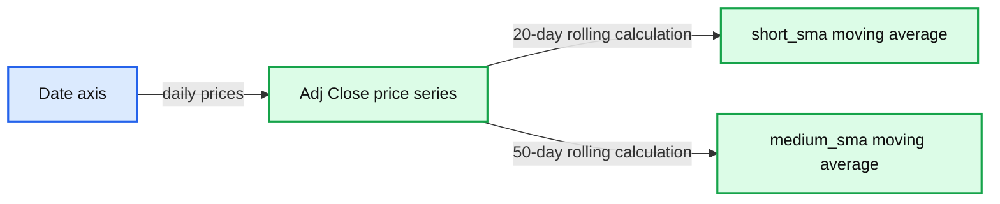
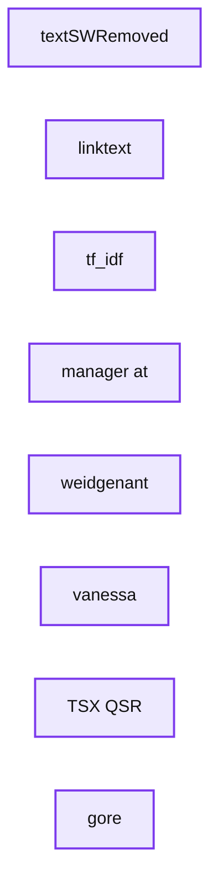
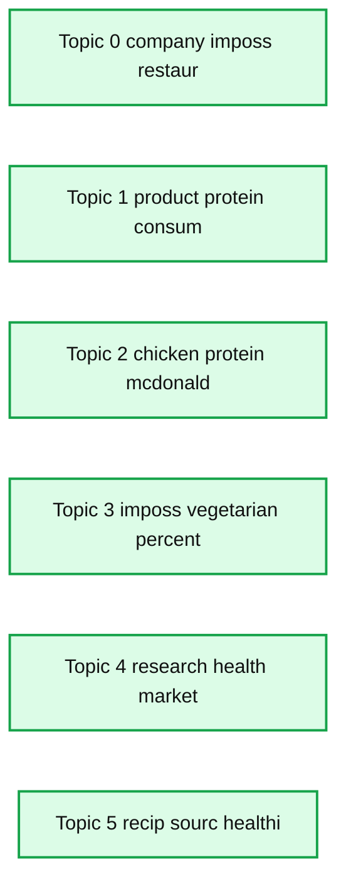
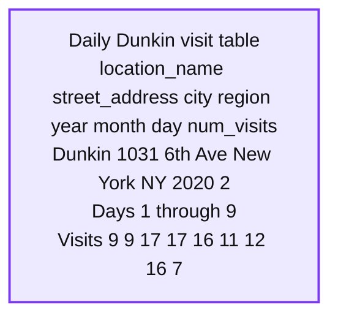
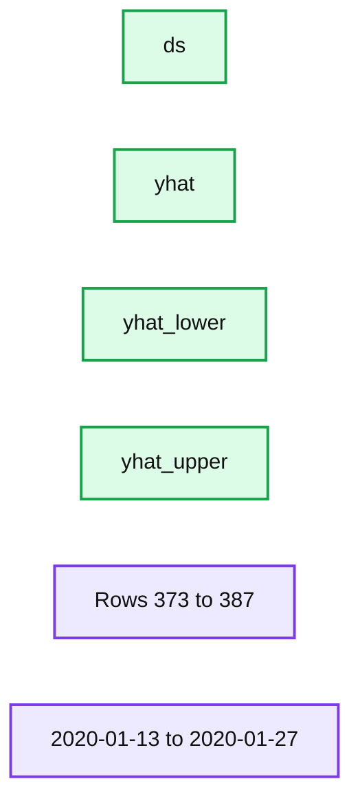
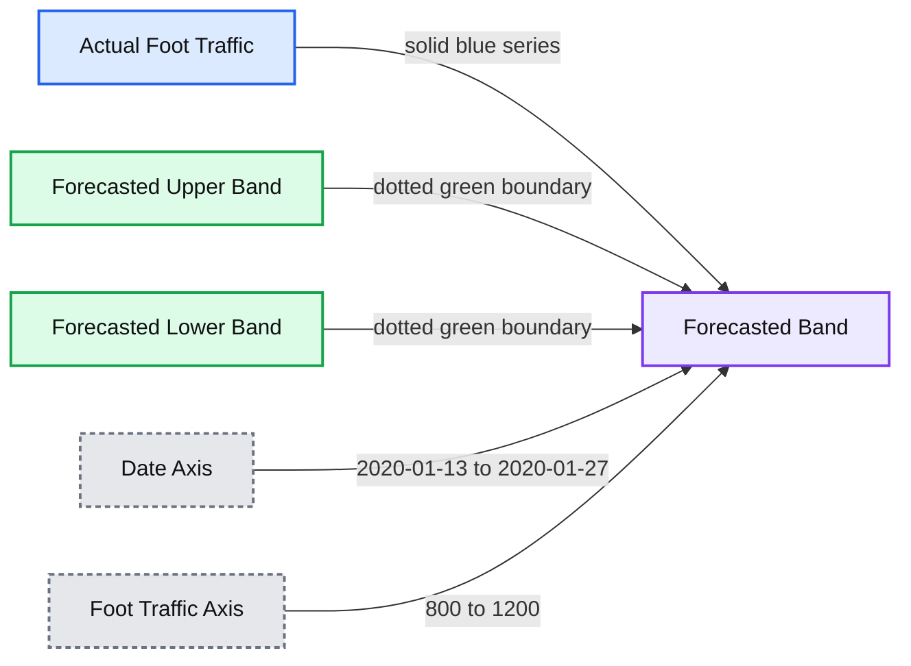

# How to Extract Market Drivers at Scale Using Alternative Data

- Source: https://www.databricks.com/blog/2020/07/15/how-to-extract-market-drivers-at-scale-using-alternative-data.html
- Published: 2020-07-15
- Authors: Ricardo Portilla, Abraham Pabbathi
- Categories: platform, engineering, solution-accelerators, open-source, data-science-machine-learning
- Images: 10 total, 8 extracted as architecture

>  Watch the on-demand webinar [Alternative Data Analytics with Python](https://www.databricks.com/p/webinar/alternative-data-analytics-with-python) for a demonstration of the solution discussed in this blog and/or download the following notebooks to try it yourself.

- [Stock Analysis - Plant-based Meat Historical Data](https://www.databricks.com/notebooks/alt-data/stock-analysis-plant-based-meat-historical-data.html)
- [GDELT News Source In Lakehouse](https://www.databricks.com/notebooks/alt-data/gdelt-news-source-in-lakehouse.html)
- [Text Analytics on GDELT](https://www.databricks.com/notebooks/alt-data/text-analytics-on-gdelt.html)
- [Alternative Data Time Series Foot Traffic Forecasting](https://www.databricks.com/notebooks/alt-data/alt-data-time-series-foot-traffic-forecasting.html)

[**Introduction**](https://www.databricks.com/#sec-1)
Why Alternative data Is critical
[**Main Section - Solution + Descriptive Notebook**](https://www.databricks.com/#sec-2)
Architecture
Ingest alternative data sources
Data analysis using Python:
Important term exploration with TF-IDF
Named entity recognition

## Why alternative data is critical

Alternative data is helping banking institutions, insurance companies and asset managers alike make better decisions by revealing valuable information about consumer behavior (e.g. utility payment history, transaction information) and extends across a variety of use cases including trade analyses, credit risk, and [ESG](https://www.investopedia.com/terms/e/environmental-social-and-governance-esg-criteria.asp) risk. Traditional data sources, such as [FICO scores](https://www.investopedia.com/terms/f/ficoscore.asp) or quarterly [10Q reports](https://www.investopedia.com/terms/e/earningsreport.asp), have been mined and analyzed to the point that they no longer provide a competitive advantage.  To gain a real competitive advantage, financial services institutions (FSIs) need to leverage alternative data to obtain a better understanding of their customers, markets, and businesses. Some of the most common alternative datasets used in the industry include news articles, web/mobile app exhaust data, social media data, credit/debit card data, and satellite imagery data.

According to a [survey completed by Dow Jones newswire](https://visit.dowjones.com/newswires/content/opportunities-alternative-data/), 66% of respondents believe alternative data is critical to the success of their FSI. However, only 7% believe they are leveraging alternative data to the greatest extent possible. [Transunion reports](https://www.transunion.com/resources/transunion/doc/insights/research-reports/research-brief-alternative-data-challenges-barriers.pdf) confirm that 90% of loan applicants would be no-hit (failure to provide credit score) without alternative data, which highlights the immense value of these data sources.  Two main reasons FSIs fail to extract value are a) challenges in integrating alternative data sources (e.g. transactions) and traditional data sources (e.g. earnings reports) and b) iterating on experiments with unstructured data. On top of this, historical datasets are large, frequently updated, and require thorough cleansing to unlock value.

Fortunately, Databricks Unified Data Analytics Platform and Delta Lake, an open-source storage layer that brings ACID transactions to big data workloads, helps organizations overcome these challenges with a scalable platform for data analytics and AI in the cloud. More specifically, Databricks’ Delta Lake autoloader gives capabilities for ‘set and forget’ ETL into a format ready for analytics, improving productivity for data science teams. Additionally, Databricks’ Apache SparkTM runtime on Delta Lake provides performance benefits for parsing and analyzing unstructured and semi-structured sources, such as news and images, thanks to optimized data lake parsers and simple library (e.g. NLP packages) management.

In this blog post, we explore an architecture based on Databricks and Delta Lake which combines analyses on unstructured text and structured time series foot traffic data, mocked in the SafeGraph data format. The specific business challenge is to extract insights from these alternative data sources and uncover a network of partners, competitors, and a proxy for sales at QSRs (quick-serve restaurants) for one plant-based meat company Beyond Meat. We delivered this content in a joint webinar with SafeGraph, which specializes in providing curated datasets for points of interest, geometries, and patterns which is available [here](https://shop.safegraph.com/).

## Discovering key drivers for stock prices using alternative data

The biggest shifts in stock prices occur when new information is released regarding the past performance or future viability of the underlying companies. In this example, we examine alternative data, namely news articles and foot traffic data, to see if positive news, such as celebrity endorsements and free press garnered by innovative products such as plant-based meats, can attract foot traffic to fast-food restaurants, increase sales and ultimately move their stock prices.

To begin the task of getting insights from news articles, we will set up the architecture shown in the diagram below. We are using three data sources for our analysis:

1. articles from an open-source online database called GDELT project
2. restaurant foot traffic (mocked up using the [SafeGraph](https://shop.safegraph.com/) schema)
3. market data from Yahoo finance for initial exploratory analysis

In the attached notebooks, our analysis begins with a chart to examine a simple moving average (SMA). As shown below, since Beyond Meat is a young company, we cannot extract the simplest of technical indicators, and this is our primary driver for understanding this company from other perspectives, namely news and foot traffic data.

**Summary:** Daily Beyond Meat adjusted closing prices are shown with 20-day and 50-day simple moving averages.

**Components:**

- Adj Close price series
- short_sma moving average
- medium_sma moving average
- Date axis
- Price axis

**Flows:**

- Date axis -> Adj Close price series: daily prices
- Adj Close price series -> short_sma moving average: 20-day rolling calculation
- Adj Close price series -> medium_sma moving average: 50-day rolling calculation

**Numbers:** 20, 50, 80, 100, 120, 140, 160, 180, 200, 220, 240, 2019-06, 2019-07, 2019-08, 2019-09, 2019-10, 2019-11, 2019-12, 2020-01, 2020-02, 2020-03

source image: https://www.databricks.com/wp-content/uploads/2020/07/blog-alternative-data-1-alt-1.png

Alternative data sources often exist in raw format in external cloud storage, so a good first step is to ingest this into Delta Lake, an open format based on parquet and optimal for scalable and reliable analytics on a cloud data lake. We establish three layers of data storage using Delta Lake, each with an increasing level of data refinement from raw ingested data on the left (bronze) to parsed and enriched data in the middle layer (silver) to aggregated and annotated data ready for business intelligence (BI) and machine learning on the right.

**Summary:** Alternative data flows through Databricks Delta Lake layers for ingestion, enrichment, feature engineering, and analytics using Python.

**Components:**

- Data Sources: GDELT news articles, SafeGraph foot traffic, and Yahoo market data
- Auto-loader: Databricks Auto Loader
- Bronze layer: Delta Lake
- Enrichment: Delta Lake
- Silver layer: Delta Lake
- Feature Engineering: Delta Lake
- Analytics: Python, spaCy, NLTK, Apache Spark ML, Koalas, and MLflow
- Storage: Amazon S3 and Microsoft Azure Blob Storage
- Platform: Databricks unified data and analytics platform

**Flows:**

- Data Sources -> Auto-loader: alternative data ingestion
- Auto-loader -> Bronze layer: raw ingested data
- Bronze layer -> Enrichment: data for parsing and enrichment
- Enrichment -> Silver layer: parsed and enriched data
- Silver layer -> Feature Engineering: refined data
- Feature Engineering -> Analytics: engineered features for data science and analytics
- Amazon S3 -> Databricks platform: cloud data storage
- Microsoft Azure Blob Storage -> Databricks platform: cloud data storage

**Numbers:** none

```mermaid
%% Alternative data analytics pipeline using Databricks
flowchart LR
    sources[Data Sources]
    loader[Auto loader]
    bronze[Bronze Delta Lake]
    enrich[Enrichment]
    silver[Silver Delta Lake]
    features[Feature Engineering]
    analytics[Python Data Science]
    storage[Cloud Storage]
    platform[Databricks Platform]

    sources -->|alternative data| loader
    loader -->|raw data| bronze
    bronze -->|data| enrich
    enrich -->|parsed enriched data| silver
    silver -->|refined data| features
    features -->|engineered features| analytics
    storage -->|cloud data| platform
    platform -.->|supports pipeline| loader
    platform -.->|supports pipeline| analytics

    classDef client   fill:#dbeafe,stroke:#2563eb,stroke-width:2px,color:#111
    classDef service  fill:#dcfce7,stroke:#16a34a,stroke-width:2px,color:#111
    classDef store    fill:#ede9fe,stroke:#7c3aed,stroke-width:2px,color:#111
    classDef cache    fill:#fef3c7,stroke:#d97706,stroke-width:2px,color:#111
    classDef queue    fill:#cffafe,stroke:#0891b2,stroke-width:2px,color:#111
    classDef critical fill:#fee2e2,stroke:#dc2626,stroke-width:4px,color:#111
    classDef external  fill:#e5e7eb,stroke:#6b7280,stroke-width:2px,color:#111,stroke-dasharray:4 3
    classDef decision fill:#fce7f3,stroke:#db2777,stroke-width:2px,color:#111

    class sources external
    class loader,enrich,features,analytics service
    class bronze,silver,storage,platform store
```

source image: https://www.databricks.com/wp-content/uploads/2020/07/alt-data-2-og.png

## Incrementally ingesting alternative data sources

The first step towards analyzing alternative data is to set up ingestion pipelines from all the required data sources. In this example, we are going to show you how to ingest two data sources:

1. Front Page News Articles: We are going to pull news articles related to plant-based meat. We are going to leverage an open database called [GDELT](https://blog.gdeltproject.org/announcing-gdelt-global-frontpage-graph-gfg/) which scans 50,000 news outlets daily and provides a snapshot of all the news headlines and links every hour.
2. Geospatial Foot Traffic: We will import (mock) foot traffic data for popular restaurants such as Dunkin Donuts in the NY Metro area for the past 12 months using [Safegraph's](http://www.safegraph.com) data format, which is an alternative data vendor specializing in curated points of interest and patterns datasets.

### Autoload data files into Delta Lake

Many alternative data sources, such as news or web search data, arrive in real-time. In our example, GDELT articles are refreshed every 15 minutes. Other sources, such as transaction data, arrive on a daily basis, but it is cumbersome for data science teams to have to keep track of the latest dates in order to append new data to their data lake. To automate the process of ingesting data files from the above-mentioned data sources, we will leverage [Databricks Delta Lake’s autoloader](https://www.databricks.com/blog/2020/02/24/introducing-databricks-ingest-easy-data-ingestion-into-delta-lake.html) functionality to pick up these files continuously as they arrive. We take the data as-is from the raw files and store it into staging tables in Delta format. These tables form the “bronze” layer of the data platform. The code to auto ingest files is shown below. Note that the Spark stream writer has a ‘trigger once’ option: this is particularly useful to avoid always-on streaming queries and instead allows the writer to schedule it on a daily cadence, for ‘set and forget’ ingestion. Also, note that the checkpoint gives us built-in fault tolerance and ease-of-use at no cost; when we start this query at any time, it will only pick up new files from the source and we can safely restart in case of failure.

## Data analysis using Python

Python is a popular and versatile language used by many data scientists around the world. For tasks involving text cleansing and modeling, there are hundreds of libraries and packages, making it our go-to language in the analysis that follows. We first read the bronze layer and load it into an enriched dataset containing the article text, timestamp, and language of the GDELT source. This enriched format will constitute the silver layer and details of this extraction are in the attached notebooks. Once the data is in the silver layer, we can clean and summarize the text in three steps:

1. Summarize terms from corpus - discover important and unique terms among the corpus of articles using TF IDF
2. Summarize article topics from corpus - Topic modeling for articles using distributed LDA may give us information about the following:
  1. Understand the current TAM by uncovering popular forms of plant-based meat (e.g. pork, chicken, beef)
  2. Which competitors or QSRs are showing up as major topics?
3. Find interesting named entities in articles to understand the influences of entities on plant-based meat products and affected companies

### Important term exploration with TF-IDF

Given we are examining many articles about plant-based meat, there are commonalities among these articles. [Term Frequency-Inverse Document Frequency](https://en.wikipedia.org/wiki/Tf%E2%80%93idf#:~:text=In%20information%20retrieval%2C%20tf%E2%80%93idf,in%20a%20collection%20or%20corpus.) (TF-IDF for short) gives us the important terms normalized by their presence in the broader corpus of articles. This type of analysis is easy to distribute with Apache Spark and runs in seconds on thousands of articles. Below is a summary using the TF-IDF computed value, ranked in descending order.

**Summary:** A Spark TF-IDF results table ranks important terms alongside article text and computed scores.

**Components:**

- textSWRemoved column: extracted terms
- linktext column: source article headlines
- tf_idf column: TF-IDF scores

**Flows:**

- none

**Numbers:** 50; 59.55706712734862; 55.302990903966574; 55.302990903966574; 53.884965496172555; 53.884965496172555; TSX:QSR

source image: https://www.databricks.com/wp-content/uploads/2020/07/blog-alternative-data-3-rev.png

What is notable here are some of the names and ticker information. Digging into the article text, we found that Lana Weidgenant created a petition for bringing a new plant-based meat product to Dunkin’s menu. Another interesting observation is the stock ticker TSX: QSR shows up here. This is the ticker for Canadian stock Restaurant Brands International, which pulled Beyond Meat products at Tim Hortons locations due to failed adoption by customers. This simple term summary allows us to get a quick picture of a few quick-serve restaurants (QSRs for short) and Beyond Meat’s impact.

### Applying topic modeling at scale

Now, let’s apply a topic model to understand articles as distributions of topics and topics as distributions of terms. Since we are using unsupervised learning techniques to summarize article content, generative model LDA ([Latent Dirichlet Allocation](https://en.wikipedia.org/wiki/Latent_Dirichlet_allocation)) is a natural choice for discovering latent topics among articles. Fortunately, this algorithm is distributable and built into Spark ML. The succinct code below shows a short and simple configuration needed to run this on our text. We’ve also included a bar chart showing a visual representation of topics extracted from the LDA model.

First, before running any type of modeling exercise, it is essential to clean our data further. To do this, let’s use the robust NLP library [nltk](https://www.nltk.org/) to filter short words, stop words, remove punctuation, and stem our tokens. This will greatly help in improving model results. Below is the function we will apply to each row of our data frame before wrapped inside a pandas UDF. Note that we’ve customized the nltk stop word list since we have extra information about our article base. In particular, ‘veganism’, ‘plant-based’, and meat are not necessarily interesting topics or terms - instead, we want information on QSRs serving these products or actual partners themselves.

Now that we’ve cleaned our text, we’ll leverage Spark for two steps: i) Run a count vectorizer with a vocabulary size of 1000 to featurize our data into vectors and ii) fit LDA to our vectorized data. Note that we’ve included a parameter on document concentration (otherwise known as alpha in the world of LDA), which indicates the document topic density - higher values correspond to the assumption that there are many topics per article as opposed to a smaller number. The default is 1/# of topics, so here we choose a lower value to assume a lower number of topics.

#### Representation of terms with probabilities within each topic

Our LDA model has produced a set of six topics that we summarize below using a bar chart to show distribution over topics and the top 3 terms per topic. Some notable observations involve Beyond Meat protein (chicken), partners (McDonald’s), and competitors such as Impossible Foods featured prominently.

**Summary:** Bar chart showing the distribution of documents across six LDA topics in the analyzed GDELT corpus.

**Components:**

- Topic 0: company, imposs, restaur
- Topic 1: product, protein, consum
- Topic 2: chicken, protein, mcdonald
- Topic 3: imposs, vegetarian, percent
- Topic 4: research, health, market
- Topic 5: recip, sourc, healthi
- Y axis: number of documents
- X axis: dominant topic

**Flows:**

- None shown

**Numbers:** Topic 0, Topic 1, Topic 2, Topic 3, Topic 4, Topic 5; y-axis values 0, 500, 1000, 1500, 2000, 2500

source image: https://www.databricks.com/wp-content/uploads/2020/07/alt-data-4-rev.png

### Named entity recognition

Our topic model gave us great information about more QSRs involved in selling plant-based meat. Now, we want to understand which entities are collocated in the same article to give us more information on any special partnerships or promotions. If we extract information on how Beyond Meat is penetrating the market, we can potentially use other alternative data sources to uncover transaction information or restaurant visits, for example.

Let’s use the Python NLP library SpaCy’s built-in named entity recognition to help solve this problem. Also, instead of running the entity recognition on the article text, let’s run it on the article title text itself to see if we can find new information on partnerships or promotions. We use a Spark Pandas UDF to parallelize the entity recognition annotation (as below).

Now, we produce a summary of the entity information we received from SpaCy’s logic:

- Dunkin’ was one of the top 10 entities
- SQL exploration of all entities related to Dunkin' (Snoop Dogg was a standout)
- Visualization of the article highlighting a promotion by Dunkin’ and Snoop Dogg for a Beyond Meat sandwich, targeted for January 2020.

Now that we have a specific example of Beyond Meat’s sales strategy, let’s formulate a hypothesis about the effectiveness of the promotion using another popular alternative data type - geolocation data, in this case, provided by Safegraph’s POI offering.

**Summary:** SpaCy named entity recognition output showing the relative frequency of extracted entities in text.

**Components:**

- Impossible - SpaCy named entity
- Burger - SpaCy named entity
- Whopper - SpaCy named entity
- Vegan - SpaCy named entity
- Foods - SpaCy named entity
- Plant - SpaCy named entity
- Dunkin - SpaCy named entity
- Burgers - SpaCy named entity
- Hamilton - SpaCy named entity
- Carl - SpaCy named entity

**Flows:**

- none

**Numbers:** 0.00, 50, 100, 150, 200

source image: https://www.databricks.com/wp-content/uploads/2020/07/blog-alternative-data-5-alt.png

Below is the visualized representation of entities that SpaCy produces, which is easily viewable in a Databricks notebook. To produce this, we took the text from the article above we observed through SQL exploration.

## Validating signals using Safegraph’s POI data

Up to this point, we have done many different kinds of news analyses. However, this has only leveraged our GDELT dataset. While results from NLP summaries above have led us to the need to understand Beyond Meat promotions via partnerships, we want to analyze some proxy for sales to see how effectively Beyond Meat is penetrating the fast-food market. We will do this using a mocked dataset based on SafeGraph’s geo-location data schema.SafeGraph's data is coalesced from over 50M mobile devices and offers highly structured formats based on POI (point-of-interest) data for many different brands. The POI data is especially interesting for our use case since we are focused on QSRs (quick-serve restaurants) which tend to have high conversion rates and serve as a proxy for sales. In particular, given a promotion of a Beyond Meat-based product (in this case Snoop Dogg’s breakfast sandwich), we want to understand whether foot traffic was ‘significant’ for this short time period given historical time series data on foot traffic at NYC Dunkin’ locations. We’ll use an additive time series forecasting model, [Prophet](https://facebook.github.io/prophet/docs/quick_start.html), to forecast the foot traffic for a week in January based on the prior year’s history. As a crude metric, a significant uptick in foot traffic will equate to actual Safegraph traffic amounts being higher than the 80% prediction interval forecasted traffic for the majority of the length of the promotional period (1 week).

**Note: **The foot traffic data used within the notebooks and shown in this blog is simulated based on the SafeGraph schema. In order to validate with true data, visit [SafeGraph](https://shop.safegraph.com/) to get these samples.

While SafeGraph’s foot traffic is cleansed well, we still need to [explode](https://docs.databricks.com/spark/latest/dataframes-datasets/complex-nested-data.html) each record to create a time series for Prophet. The code in the attached notebook creates a row per date of the number of visits, i.e. the num_visits array has been converted to multiple records, one record per date as below.

**Summary:** A tabular time series showing daily Dunkin' visits at one New York location.

**Components:**

- `location_name`: Dunkin'
- `street_address`: 1031 6th Ave
- `city`: New York
- `region`: NY
- `year`: 2020
- `month`: 2
- `day`: Daily date values
- `num_visits`: Daily visit counts

**Flows:**

- none

**Numbers:** 1031, 6, 2020, 2, days 1.0 through 9.0, visit counts 9, 9, 17, 17, 16, 11, 12, 16, 7, 1000

source image: https://www.databricks.com/wp-content/uploads/2020/07/blog-alternative-data-8.png

Using the data above, we can aggregate by the date to produce a time series we can use for our forecasting model, which we’ve named all_nyc_dunkin. Once this is done, we’ll produce a pandas data frame, shown below.

**Summary:** A time series forecast table showing dates, predicted values, lower bounds, and upper bounds.

**Components:**

- ds date column
- yhat forecast column
- yhat_lower lower prediction interval
- yhat_upper upper prediction interval
- Indexed forecast records

**Flows:**

- none

**Numbers:**

- Row indices: 373, 374, 375, 376, 377, 378, 379, 380, 381, 382, 383, 384, 385, 386, 387
- Dates: 2020-01-13 through 2020-01-27
- yhat values: 1017.759758, 1045.826045, 1029.144465, 1004.099828, 1039.967075, 1012.741707, 964.428189, 1021.963796, 1050.030084, 1033.348503, 1008.303866, 1044.171113, 1016.945746, 968.632227, 1026.167835
- yhat_lower values: 818.282893, 845.623491, 823.996786, 807.626449, 846.263877, 812.757028, 759.819686, 831.848220, 848.673494, 840.217513, 790.840705, 821.185711, 812.873225, 772.879090, 822.022928
- yhat_upper values: 1224.677271, 1263.566977, 1239.183118, 1222.095382, 1268.495637, 1221.809829, 1157.863507, 1228.296278, 1260.441274, 1232.588852, 1208.793753, 1244.191729, 1210.239813, 1157.615037, 1233.507421

source image: https://www.databricks.com/wp-content/uploads/2020/07/blog-alternative-data-9-rev.png

Overlaying the forecast above with actual foot traffic data, we see that the additional traffic doesn’t pass our test for ‘significant’ (all dates stayed within the prediction interval). Our POI data has allowed us to achieve this interesting result quickly with a simple library import and aggregation in SQL. To conclude this analysis, this is not to say that the average receipt didn't have a higher bill amount as compared to the average transaction price - however, we would need transaction data (another alternative dataset) to confirm this.

**Summary:** Line chart comparing actual NYC foot traffic with a forecasted upper and lower band over January 2020.

**Components:**

- Actual Foot Traffic: solid blue time series
- Forecasted upper band: dotted green time series
- Forecasted lower band: dotted green time series
- Forecasted band: light shaded interval between the two forecast boundaries
- Date axis: daily dates from 2020-01-13 to 2020-01-27
- Foot traffic axis: traffic values

**Flows:**

- none

**Numbers:** 2020, 2020-01-13, 2020-01-15, 2020-01-17, 2020-01-19, 2020-01-21, 2020-01-23, 2020-01-25, 2020-01-27, 800, 900, 1000, 1100, 1200, NYC

source image: https://www.databricks.com/wp-content/uploads/2020/07/blog-alternative-data-10.png

Overall, our goal was to enhance our methodology for discovering market drivers. The analyses presented here greatly improve on the limited technical market data we first inspected. While we would likely conclude there is not a strong buy or sell signal for Beyond Meat based on the article summaries or foot traffic, all of the analyses above can be automated and extended to other use cases to provide hourly dashboards to aid financial decisions.

**Leveraging alternative data**

In summary, this blog post has provided a variety of ideas on how you can leverage alternative data to inform and improve your financial decision-making process. The pipeline code we have provided in this blog post is only for the purpose of getting you started in this journey of exploring non-traditional data. In real-life scenarios, you may deal with more messy data which will require more cleaning steps before the data is ready for analysis. But irrespective of how many steps you need to execute or how big the datasets are, Databricks provides an easy-to-use, collaborative, and scalable platform to uncover insights from unstructured and siloed data in a matter of minutes and hours instead of weeks. Databricks is currently helping some of the largest financial institutions which are leveraging alternative data for investment decisions and we can do the same for your organization as well.

## Getting Started

**Download the Notebooks:**

- [Stock Analysis - Plant-based Meat Historical Data](https://www.databricks.com/notebooks/alt-data/stock-analysis-plant-based-meat-historical-data.html)
- [GDELT News Source In Lakehouse](https://www.databricks.com/notebooks/alt-data/gdelt-news-source-in-lakehouse.html)
- [Text Analytics on GDELT](https://www.databricks.com/notebooks/alt-data/text-analytics-on-gdelt.html)
- [Alternative Data Time Series Foot Traffic Forecasting](https://www.databricks.com/notebooks/alt-data/alt-data-time-series-foot-traffic-forecasting.html)

## More Resources

[Market Data Notebook](https://accounts.google.com/ServiceLogin?service=wise&passive=1209600&continue=https://drive.google.com/file/d/1IzLci8q3UoWhHlWyi-ava7mms9DVSLGL/view?usp%3Dsharing&followup=https://drive.google.com/file/d/1IzLci8q3UoWhHlWyi-ava7mms9DVSLGL/view?usp%3Dsharing)
[Data Ingestion Notebook](https://accounts.google.com/ServiceLogin?service=wise&passive=1209600&continue=https://drive.google.com/file/d/1pfp-XXDiFXCJzFxQDWh5vREf9hD0IESi/view?usp%3Dsharing&followup=https://drive.google.com/file/d/1pfp-XXDiFXCJzFxQDWh5vREf9hD0IESi/view?usp%3Dsharing)
