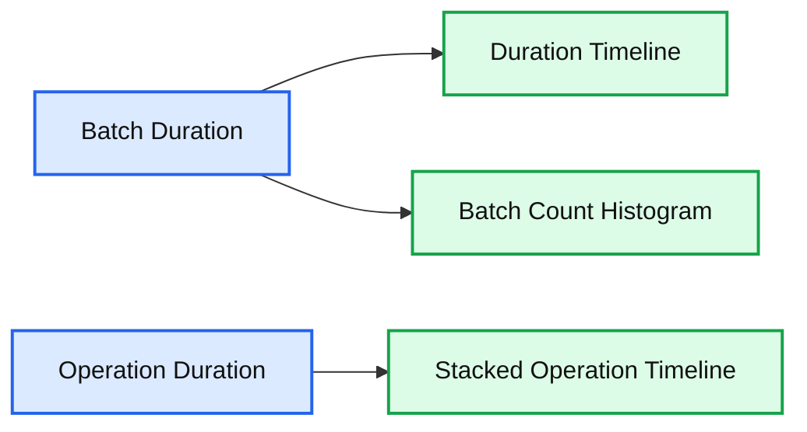
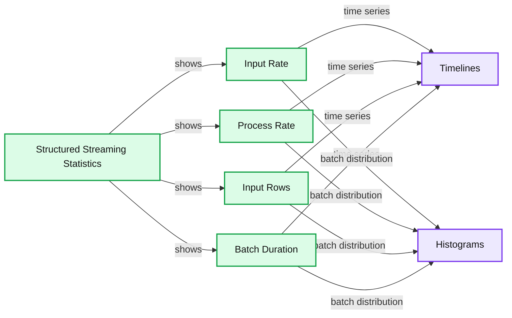
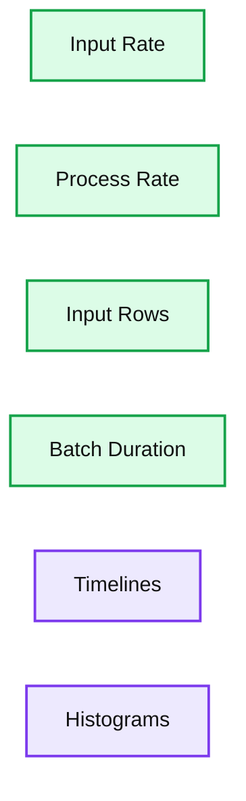
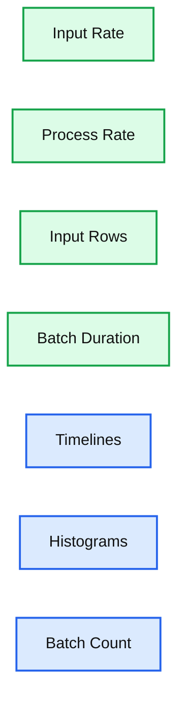
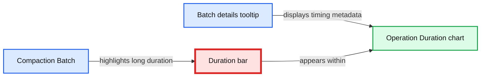

# A look at the new Structured Streaming UI in Apache Spark 3.0

- Source: https://www.databricks.com/blog/2020/07/29/a-look-at-the-new-structured-streaming-ui-in-apache-spark-3-0.html
- Published: 2020-07-29
- Authors: Genmao Yu, Yuanjian Li, Shixiong Zhu
- Categories: platform, solutions, engineering, open-source, data-engineering, data-streaming
- Images: 9 total, 6 extracted as architecture

>  This is a guest community post from Genmao Yu, a software engineer at Alibaba.

Structured Streaming was initially introduced in Apache Spark 2.0. It has proven to be the best platform for building distributed stream processing applications. The unification of SQL/Dataset/DataFrame APIs and Spark’s built-in functions makes it easy for developers to achieve their complex requirements, such as streaming aggregations, stream-stream join, and windowing support. Since the launch of Structured Streaming, developers frequently have asked for a better way to manage their streaming, just like the way we did in Spark Streaming (i.e DStream). In Apache Spark 3.0, we’ve released a new visualization UI for Structured Streaming.

The new Structured Streaming UI provides a simple way to monitor all streaming jobs with useful information and statistics, making it easier to troubleshoot during development debugging as well as improving production observability with real-time metrics. The UI presents two sets of statistics: 1) aggregate information of a streaming query job and 2) detailed statistical information about the streaming query, including Input Rate, Process Rate, Input Rows, Batch Duration, Operation Duration, etc.

## Aggregate information of a streaming query job

When a developer submits a streaming SQL query, it will be listed in the Structured Streaming tab, which includes both active streaming queries and completed streaming queries. Some basic information for streaming queries will be listed in the result table, including query name, status, ID, run ID, submitted time, query duration, last batch ID as well as the aggregate information, like average input rate and average process rate. There are three types of streaming query status, i.e., **RUNNING**, **FINISHED** and **FAILED**. All **FINISHED** and **FAILED** queries are listed in the completed streaming query table. The Error column shows the exception details of a failed query.

We can check the detailed statistics of a streaming query by clicking the run ID link.

## Detailed statistics information

The Statistics page displays the metrics including input/process rate, latency and detailed operation duration, which are useful for insight into the status of your streaming queries, enabling you to easily debug anomalies in query processing.

**Summary:** Spark Structured Streaming statistics show batch duration and operation duration over time, including batch counts and operation-time breakdowns.

**Components:**

- Batch Duration metric using milliseconds
- Batch count histogram
- Operation Duration metric using milliseconds
- Stacked operation-time breakdown

**Flows:**

- none

**Numbers:**

- 0.00, 1,000.00, 2,000.00, 3,000.00, 4,000.00, 5,000.00, 6,000.00 ms
- 0, 20, 40, 60, 80 #batches
- 14:19:16
- 14:26:31
- 0, 1,000, 2,000, 3,000, 4,000, 5,000, 6,000 ms
- 14:19:16.664
- 14:26:31.695



<sub>source image: https://www.databricks.com/wp-content/uploads/2020/07/blog-streaming-ui-3.png</sub>

It contains the following metrics:

- **Input Rate: **The aggregate (across all sources) rate of data arriving.
- **Process Rate:** The aggregate (across all sources) rate at which Spark is processing data.
- **Batch Duration:** The duration of each batch.
- **Operation Duration:** The amount of time taken to perform various operations in milliseconds.

The tracked operations are listed as follows:

- **addBatch:** Time taken to read the micro-batch's input data from the sources, process it, and write the batch's output to the sink. This should take the bulk of the micro-batch's time.
- **getBatch:** Time taken to prepare the logical query to read the input of the current micro-batch from the sources.
- **getOffset:** Time taken to query the sources whether they have new input data.
- **walCommit:** Write the offsets to the metadata log.
- **queryPlanning:** Generate the execution plan.

It’s necessary to note that not all listed operations will be displayed in the UI. There are different operations on different types of data sources, so part of the listed operations may be executed in one streaming query.

## Troubleshooting streaming performance using the UI

In this section, let’s go through a couple of cases in which the new Structured Streaming UI indicates something unusual is happening. At a high level, the demo query looks like this and, in each case, we will suppose some preconditions:

### Increasing latency due to insufficient processing capacity

In the first case, we run the query to process Apache Kafka data as soon as possible. In each batch, the streaming job will process all available data in Kafka. If the processing capacity is not enough to process batch data, then the latency will raise rapidly. The most intuitive judgment is the **Input Rows** and **Batch Duration** will rise in linear. The **Process Rate** prompts that the streaming job can only process about 8,000 records/second at most. But the current **Input Rate** is about 20,000 records/second. We can give the streaming job more execution resources or add enough partitions to handle all the consumers needed to keep up with the producers.

**Summary:** Spark Structured Streaming UI charts show timelines and batch histograms for Input Rate, Process Rate, Input Rows, and Batch Duration.

**Components:**

- Structured Streaming Statistics view using Apache Spark
- Input Rate metric
- Process Rate metric
- Input Rows metric
- Batch Duration metric
- Timelines panel
- Histograms panel

**Flows:**

- Input Rate -> Timelines: records per second over time
- Input Rate -> Histograms: batches by input rate
- Process Rate -> Timelines: records per second over time
- Process Rate -> Histograms: batches by process rate
- Input Rows -> Timelines: input rows over time
- Input Rows -> Histograms: batches by input rows
- Batch Duration -> Timelines: duration in milliseconds over time
- Batch Duration -> Histograms: batches by duration

**Numbers:** 0, 20, 40, 60, 80, 2,000, 4,000, 5,000, 6,000, 8,000, 10,000, 15,000, 20,000, 11:28:46, 12:38:50, records/sec, ms, #batches



<sub>source image: https://www.databricks.com/wp-content/uploads/2020/07/blog-streaming-ui-4.png</sub>

### Stable but high latency

For the case in this section, what’s the difference from the previous one? The latency is not increasing continually but keeps stable, like the following screenshot:

**Summary:** Spark Structured Streaming statistics showing timelines and histograms for input rate, process rate, input rows, and batch duration.

**Components:**

- Input Rate timeline and histogram using records per second
- Process Rate timeline and histogram using records per second
- Input Rows timeline and histogram using records
- Batch Duration timeline and histogram using milliseconds
- Timelines chart panel
- Histograms chart panel

**Flows:**

- none visible

**Numbers:** 0.00, 1,000.00, 5,000.00, 10,000.00, 15,000.00, 20,000.00, 25,000.00, 50, 10, 20, 30, 40, 14:53:54, 15:11:22, records/sec, records, ms, #batches



<sub>source image: https://www.databricks.com/wp-content/uploads/2020/07/blog-streaming-ui-5.png</sub>

We find that the **Process Rate** can keep stable at the same **Input Rate**. This means the processing capacity of a job is enough to process the input data. However, the process duration of each batch, i.e. latency, is still as high as 20 seconds. The main reason for high latency is too much data in each batch. Normally we can reduce the latency by increasing the parallelism of this job. After adding both 10 more Kafka partitions and 10 cores for Spark tasks, we find the latency is about 5 seconds — much better than 20 seconds.

**Summary:** Spark 3.0 Structured Streaming Statistics view showing timelines and batch-count histograms for input rate, process rate, input rows, and batch duration.

**Components:**

- Input Rate panel using Spark Structured Streaming metrics
- Process Rate panel using Spark Structured Streaming metrics
- Input Rows panel using Spark Structured Streaming metrics
- Batch Duration panel using Spark Structured Streaming metrics
- Timelines charts
- Histograms charts
- Batch count axis

**Flows:**

- None visible

**Numbers:**

- Input Rate: 0.00 and 1,000.00 records/sec
- Process Rate: 0.00 and 1,000.00 records/sec
- Input Rows: 0.00 through 6,000.00 records
- Batch Duration: 0.00 through 6,000.00 ms
- Histogram scale: 0, 20, 40, 60, 80 batches
- Timeline: 15:24:05 to 15:31:23



<sub>source image: https://www.databricks.com/wp-content/uploads/2020/07/blog-streaming-ui-6.png</sub>

### Use Operation Duration chart for troubleshooting

The operation duration chart shows the amount of time taken to perform various operations in milliseconds. It is useful for knowing the time distribution for each batch and making it easier for troubleshooting. Let’s use the performance improvement “[SPARK-30915](https://issues.apache.org/jira/browse/SPARK-30915): Avoid reading the metadata log file when finding the latest batch ID” in Apache Spark community as an example.

Before this work, the next batch after compaction takes more time than other batches when the compacted metadata log becomes huge.

**Summary:** Operation Duration chart showing batch execution times, with a highlighted compaction batch taking significantly longer.

**Components:**

- Operation Duration chart using Spark 3.0 Structured Streaming UI
- Batch duration bars measured in milliseconds
- Compaction Batch annotation
- Batch details tooltip

**Flows:**

- Compaction Batch -> Duration bar: highlights prolonged operation
- Batch details tooltip -> Duration chart: displays batch timing metadata

**Numbers:** 73309.0, 2.0, 0.0, 280.0, 0.0, 69, 08:02:25.676, 08:15:04.047, 0, 10000, 20000, 30000, 40000, 50000, 60000, 70000



<sub>source image: https://www.databricks.com/wp-content/uploads/2020/07/blog-streaming-ui-7.png</sub>

After code investigation, an unnecessary reading of the compacted log file was found and fixed. The following chart of operation duration confirms the effect we expect:

**Summary:** The chart shows Structured Streaming operation duration in milliseconds across a time interval, with mostly stable durations and several pronounced spikes.

**Components:**

- Operation Duration chart
- Millisecond scale
- Time axis
- Duration bars
- Color legend

**Flows:**

- none

**Numbers:** 0 ms, 20000 ms, 40000 ms, 60000 ms, 80000 ms, 08:26:14.487, 08:39:19.134

```text
%% mermaid failed to render; kept as text
%% Shows operation duration bars across a streaming query time interval
flowchart LR
    A[08:26:14.487] -->|time interval| B[Operation Duration]
    B -->|milliseconds| C[08:39:19.134]
    B -->|duration bars| D[Color legend]

    classDef client   fill:#dbeafe,stroke:#2563eb,stroke-width:2px,color:#111
    classDef service  fill:#dcfce7,stroke:#16a34a,stroke-width:2px,color:#111
    classDef store    fill:#ede9fe,stroke:#7c3aed,stroke-width:2px,color:#111
    classDef cache    fill:#fef3c7,stroke:#d97706,stroke-width:2px,color:#111
    classDef queue    fill:#cffafe,stroke:#0891b2,stroke-width:2px,color:#111
    classDef critical fill:#fee2e2,stroke:#dc2626,stroke-width:4px,color:#111
    classDef external fill:#e5e7eb,stroke:#6b7280,stroke-width:2px,color:#111,stroke-dasharray:4 3
    classDef decision fill:#fce7f3,stroke:#db2777,stroke-width:2px,color:#111
    client = clients/edge/gateway/LB, service = stateless compute, store = databases/durable storage, cache = Redis/CDN/anything losable, queue = Kafka/streams/async pipes, critical = the bottleneck or SPOF, external = third-party, decision = a trade-off point

    class A,C client
    class B service
    class D external
```

<sub>source image: https://www.databricks.com/wp-content/uploads/2020/07/blog-streaming-ui-8.png</sub>

### Future development

As shown above, the new Structured Streaming UI will help developers to better monitor their streaming jobs with much more useful streaming query information. As an early-release version, the new UI is still under development and will be improved in future releases. There are a couple of features that can be done in the future, including but not limited to the following:

- More streaming query execution details: late data, watermark, state data metrics, etc.
- Support Structured Streaming UI in the Spark history server.
- More conspicuous tips for unusual circumstances: latency happening, etc.

### Try the new UI

Try out this new Spark Streaming UI in Apache Spark 3.0 in the new Databricks Runtime 7.1. If you are using Databricks notebooks, it also gives you a simple way to see the status of any streaming query in your notebook and [manage your queries](https://www.databricks.com/blog/2017/05/18/taking-apache-sparks-structured-structured-streaming-to-production.html). You can sign up for a [free account on Databricks](https://www.databricks.com/try-databricks) and get started in minutes for free, no credit card needed.
  

O'Reilly Learning Spark Book

 

Free 2nd Edition includes updates on Spark 3.0, including the new Python type hints for Pandas UDFs, new date/time implementation, etc.

[Free Download](https://www.databricks.com/p/ebook/the-big-book-of-data-engineering?itm_data=blog-link-learningspark)
