# Modern Industrial IoT Analytics on Azure - Part 1

*Customers Leverage Azure Databricks for Industrial IoT Analytics*

- Source: https://www.databricks.com/blog/2020/08/03/modern-industrial-iot-analytics-on-azure-part-1.html
- Published: 2020-08-03
- Authors: Samir Gupta, Lana Koprivica, Hubert Duan
- Categories: partners, data-streaming, company
- Images: 3 total, 1 extracted as architecture

>  This post and the three-part series about Industrial IoT analytics were jointly authored by Databricks and members of the Microsoft Cloud Solution Architecture team. We would like to thank Databricks Solutions Architect Samir Gupta and Microsoft Cloud Solution Architects Lana Koprivica and Hubert Dua for their contributions to this and the two forthcoming posts.

The Industrial Internet of Things  (IIoT) has grown over the last few years as a grassroots technology stack being piloted predominantly in the oil & gas industry to wide scale adoption and production use across manufacturing, chemical, utilities, transportation and energy sectors. Traditional IoT systems like Scada, Historians and even Hadoop do not provide the big data analytics capabilities needed by most organizations to predictively optimize their industrial assets due to the following factors.

| Challenge | Required Capability |
|---|---|
| Data volumes are significantly larger & more frequent | The ability to capture and store sub-second granular readings reliably and cost effectively from IoT devices streaming terabytes of data per day |
| Data processing needs are more complex | ACID-compliant data processing - time-based windows, aggregations, pivots, backfilling, shifting with the ability to easily reprocess old data |
| More user personas want access to the data | Data is an open format and easily shareable with operational engineers, data analysts, data engineers, and data scientists without creating silos |
| Scalable ML is needed for decision making | The ability to quickly and collaboratively train predictive models on granular, historic data to make intelligent asset optimization decisions |
| Cost reduction demands are higher than ever | Low-cost on-demand managed platform that scales with the data and workloads independently without requiring significant upfront capital |

 Read [Rise of the Data Lakehouse](https://www.databricks.com/resources/ebook/rise-data-lakehouse?itm_data=modernindustrialiot1blog-textpromo-riselakehousebook) to explore why lakehouses are the data architecture of the future with the father of the data warehouse, Bill Inmon.

Organizations  are turning to cloud computing platforms like Microsoft Azure to take advantage of the scalable, IIoT-enabling technologies they have to offer that make ingesting, processing, analyzing and serving time-series data sources like Historians and SCADA systems easy.

In part 1, we discuss the end-to-end technology stack and the role [Azure Databricks](https://www.databricks.com/product/azure) plays in the architecture and design for the industrial application of modern IoT analytics.

In part 2, we will take a deeper dive into deploying modern IIoT analytics, ingest real-time IIoT machine-to-machine data from field devices into Azure Data Lake Storage and perform complex time-series processing on Data Lake directly.

In part 3, we will look at machine learning and analytics with industrial IoT data.

## The Use Case - Wind Turbine Optimization

Most IIoT Analytics projects are designed to maximize the short-term utilization of an industrial asset while minimizing its long-term maintenance costs. In this article, we focus on a hypothetical energy provider trying to optimize its wind turbines. The ultimate goal is to identify the set of optimal turbine operating parameters that maximizes each turbine’s power output while minimizing its time to failure.

The final artifacts of this project are:

1. An automated data ingestion and processing pipeline that streams data to all end users
2. A predictive model that estimates the power output of each turbine given current weather and operating conditions
3. A predictive model that estimates the remaining life of each turbine given current weather and operating conditions
4. An optimization model that determines the optimal operating conditions to maximize power output and minimize maintenance costs thereby maximizing total profit
5. A real-time analytics dashboard for executives to visualize the current and future state of their wind farms, as shown below:

## The Architecture - Ingest, Store, Prep, Train, Serve, Visualize

The architecture below illustrates a modern, best-of-breed platform used by many organizations that leverages all that Azure has to offer for IIoT analytics.

**Summary:** The diagram shows an Azure industrial IoT analytics architecture flowing from ingestion and storage through preparation, training, serving, and visualization.

**Components:**

- Sensors and IoT devices: semi-structured data sources
- Maintenance logs: unstructured data sources
- Production systems: structured data sources
- Azure IoT or Event Hubs: scalable pub-sub messaging
- Azure Data Factory: pipeline orchestration and data flows
- Azure Databricks: data engineering, data science, and machine learning
- Azure Data Lake Storage: write-once, access-often storage
- Delta bronze: raw data storage
- Delta silver: enriched data storage
- Delta gold: aggregated data storage
- Azure Machine Learning: model repository and deployment
- Azure Synapse Analytics: analytical reporting
- Azure Data Explorer: real-time operational reporting
- PowerBI: reports and dashboards

**Flows:**

- Sensors and IoT devices -> Azure IoT or Event Hubs: streaming sensor data
- Azure IoT or Event Hubs -> Azure Databricks: event data
- Maintenance logs -> Azure Data Factory: maintenance log data
- Production systems -> Azure Data Factory: production data
- Azure Data Factory -> Delta bronze: raw ingested data
- Delta bronze -> Delta silver: enriched data
- Delta silver -> Delta gold: aggregated data
- Delta silver -> Azure Databricks: data science and machine learning data
- Azure Databricks -> Azure Machine Learning: trained models
- Delta gold -> Azure Synapse Analytics: aggregated analytical data
- Delta gold -> Azure Data Explorer: real-time operational data
- Azure Synapse Analytics -> PowerBI: reports and dashboards

**Numbers:** none

```mermaid
%% Azure industrial IoT analytics architecture from ingestion to visualization
flowchart LR
    Sources[IoT and enterprise data sources]
    Ingest[Azure IoT or Event Hubs]
    Factory[Azure Data Factory]
    Bronze[Delta bronze raw]
    Silver[Delta silver enriched]
    Gold[Delta gold aggregated]
    ADLS[Azure Data Lake Storage]
    Prep[Azure Databricks]
    ML[Azure Machine Learning]
    Serve[Azure Synapse Analytics]
    Explorer[Azure Data Explorer]
    BI[PowerBI]

    Sources -->|streaming and source data| Ingest
    Sources -->|logs and structured data| Factory
    Ingest -->|event data| Prep
    Factory -->|raw data| Bronze
    Bronze -->|enrich| Silver
    Silver -->|aggregate| Gold
    Silver -->|data science and machine learning| Prep
    Prep -->|trained models| ML
    Gold -->|analytical reporting| Serve
    Gold -->|operational reporting| Explorer
    Serve -->|reports and dashboards| BI
    Bronze -.->|stored in| ADLS
    Silver -.->|stored in| ADLS
    Gold -.->|stored in| ADLS

    classDef client   fill:#dbeafe,stroke:#2563eb,stroke-width:2px,color:#111
    classDef service  fill:#dcfce7,stroke:#16a34a,stroke-width:2px,color:#111
    classDef store    fill:#ede9fe,stroke:#7c3aed,stroke-width:2px,color:#111
    classDef cache    fill:#fef3c7,stroke:#d97706,stroke-width:2px,color:#111
    classDef queue    fill:#cffafe,stroke:#0891b2,stroke-width:2px,color:#111
    classDef critical fill:#fee2e2,stroke:#dc2626,stroke-width:4px,color:#111
    classDef external fill:#e5e7eb,stroke:#6b7280,stroke-width:2px,color:#111,stroke-dasharray:4 3
    classDef decision fill:#fce7f3,stroke:#db2777,stroke-width:2px,color:#111

    class Sources external
    class Ingest queue
    class Factory,Prep,ML,Serve,Explorer service
    class Bronze,Silver,Gold,ADLS store
    class BI client
```

source image: https://www.databricks.com/sites/default/files/inline-images/blog-iot-part-1-3_0.png

A key component of this architecture is the Azure Data Lake Store (ADLS), which enables the write-once, access-often analytics pattern in Azure. However, Data Lakes alone do not solve the real-world challenges that come with time-series streaming data. The Delta storage format provides a layer of resiliency and performance on all data sources stored in ADLS. Specifically for time-series data, Delta provides the following advantages over other storage formats on ADLS:

| Required Capability | Other formats on ADLS Gen 2 | Delta Format on ADLS Gen 2 |
|---|---|---|
| Unified batch & streaming | Data Lakes are often used in conjunction with a streaming store like CosmosDB, resulting in a complex architecture | ACID-compliant transactions enable data engineers to perform streaming ingest and historically batch loads into the same locations on ADLS |
| Schema enforcement and evolution | Data Lakes do not enforce schema, requiring all data to be pushed into a relational database for reliability | Schema is enforced by default. As new IoT devices are added to the data stream, schemas can be evolved safely so downstream applications don’t fail |
| Efficient Upserts | Data Lakes do not support in-line updates and merges, requiring deletion and insertions of entire partitions to perform updates | MERGE commands are effective for situations handling delayed IoT readings, modified dimension tables used for real-time enrichment, or if data needs to be reprocessed. |
| File Compaction | Streaming time-series data into Data Lakes generates hundreds or even thousands of tiny files. | Auto-compaction in Delta optimizes the file sizes to increase throughput and parallelism. |
| Multi-dimensional clustering | Data Lakes provide push-down filtering on partitions only | ZORDERing time-series on fields like timestamp or sensor ID allows Databricks to filter and join on those columns up to 100x faster than simple partitioning techniques. |

## Summary

In this post we reviewed a number of different challenges facing traditional IIoT systems.  We walked through the use case and the goals for modern IIoT analytics, shared a repeatable architecture that organizations are already deploying at scale and explored the benefits of Delta format for each of the required capabilities.

In the next post we will ingest real-time IIoT data from field devices into Azure and perform complex time-series processing on Data Lake directly.

They key technology that ties everything together is Delta Lake. Delta on ADLS provides reliable streaming data pipelines and highly performant data science and analytics queries on massive volumes of time-series data. Lastly, it enables organizations to truly adopt a Lakehouse pattern by bringing best of breed Azure tools to a write-once, access-often data store.

## What’s Next?

Learn more about Azure Databricks with this [3-part training series](https://www.databricks.com/p/webinar/azure-databricks-3-part-training-series) and see how to create modern data architectures by attending [this webinar](https://www.databricks.com/p/webinar/data-engineering-with-azure-databricks).
