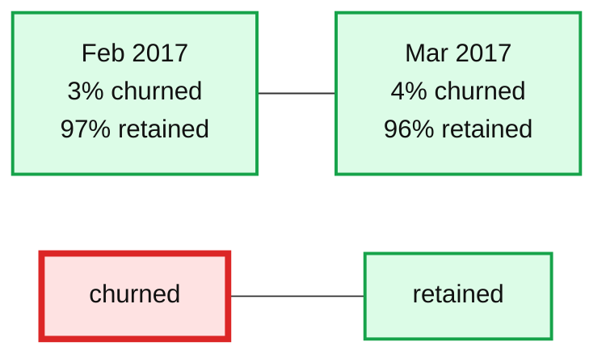

# Profit-Driven Retention Management with Machine Learning

- Source: https://www.databricks.com/blog/2020/08/24/profit-driven-retention-management-with-machine-learning.html
- Published: 2020-08-24
- Authors: Bryan Smith, Rob Saker, Hector Leano
- Categories: platform, engineering, solution-accelerators, open-source, data-science-machine-learning
- Images: 3 total, 2 extracted as architecture

Companies with the highest loyalty ratings and retention rates [grew revenues 250%](https://hbr.org/2020/01/are-you-undervaluing-your-customers) faster than their industry peers and delivered two to five times the shareholder returns over a 10 year period. Earning loyalty and getting the largest number of customers to stick around is something that is in the best interest of both a company and its customer base.

So why do companies struggle with retention? Other than some subscription-based businesses such as telecom that report Average Revenue Per User (ARPU), most companies aren’t required or compelled to disclose this in public filings. Many companies focus on functional priorities instead of the customer, believing customer loyalty will naturally emerge through these efforts. In fact, [a recent survey by Nielsen](https://www.nielsen.com/us/en/insights/article/2020/the-5-new-must-dos-of-marketing/) highlights that addressing “customer churn is the last priority when it comes to companies’ marketing objectives.”

This is particularly problematic in light of increasing evidence that customers are rethinking how and where they spend their money. And while most studies identify these shifts as part of [consumers’ response to COVID](https://www.mckinsey.com/business-functions/marketing-and-sales/solutions/periscope/our-insights/surveys/reinventing-retail), the reality is that this growing disinterest in brand loyalty [predates the current crisis](https://nielseniq.com/global/en/insights/analysis/2019/battle-of-the-brands-consumer-disloyalty-is-sweeping-the-globe/).

## Value Is Delivered Over a Customer’s Lifetime

Customer retention must become a priority for any company seeking [long-term growth](https://www.reforge.com/blog/retention-engagement-growth-silent-killer). In a series of recent posts on customer lifetime value in both [subscription](https://www.databricks.com/blog/2020/07/15/analyzing-customer-attrition-in-subscription-models.html) and [non-subscription](https://www.databricks.com/blog/2020/06/03/customer-lifetime-value-part-1-estimating-customer-lifetimes.html) models, we examined how retention plays a critical role in building profitable customer relationships. At a minimum, customers need to remain engaged long enough for a firm to offset their acquisition costs, but an ideal relationship continues to deliver profits well beyond this.

**Figure 1.** Churn at different stages of the customer lifetime journey

The key to effectively managing retention, and reducing your churn rate, is developing an understanding of how a [customer lifetime](https://segment.com/blog/customer-retention/) should progress (Figure 1) and examining where in that lifetime journey customers are likely to churn. In early stages, customers are still learning about the products and services they are consuming and how best to derive benefits from them. Proactive engagement to encourage the adoption of behaviors that maximize these benefits may help transition customers into later stages of sustained consumption. In those later stages, connecting with customers through brand identity can not only encourage continued loyalty but help customers become brand ambassadors, helping to organically bring new customers to the business and reducing on-boarding challenges.

## You Can’t Save Them All...

When a customer abandons the relationship, it is important that we understand why. Some churn may represent the natural conclusion of a long-standing relationship which has finally run its course. In such scenarios, we may continue to derive value by transitioning the customer to other products and services within our portfolio or provided by a partner organization.  Or we may simply allow the customer to leave, content in knowing a satisfied customer is likely to continue to serve as a net promoter.

It’s when a customer leaves prematurely that we need to take corrective action. Churn in early stages of the lifetime journey may indicate difficulty in using products or services or recognizing value through them.  Churn in later stages may indicate [diminished value](https://hbr.org/2020/01/are-you-undervaluing-your-customers), real or perceived, due to changes in the product, its delivery or the competitive landscape.  And at any stage, business process issues such as the failure to identify expiring credit cards may inadvertently push customers out.  The specific reasons for churn are highly varied and each requires a different kind of response both at the individual and the organizational levels.

## Nor Should You Try 

When addressing the individual, it’s important to consider the costs and benefits of any corrective action. Every customer has a potential value to the firm, derived over the lifetime of a relationship. The cost of avoiding churn whether through promotions, discounts or other incentives should never exceed the [residual value](https://hbr.org/2014/10/the-value-of-keeping-the-right-customers) we might hope to preserve. Our goal should always be to retain profitability.

This requires not only a careful consideration of an individual’s CLV but the cost of implementing an active retention campaign on the whole. The planning and administration as well as the labor costs associated with consistent, sustained engagement must be averaged over the (ideally large) fraction of at-risk customers retained.

This is in no way intended to discourage organizations from pursuing a retention management strategy.  Indeed, numerous studies have shown that it costs [5-times (or more)](https://www.forbes.com/sites/blakemorgan/2019/04/29/does-it-still-cost-5x-more-to-create-a-new-customer-than-retain-an-old-one/#540c9af23516)to acquire a new customer than retain an existing one, and that firms may see as much as a [95% increase in profits](https://media.bain.com/Images/BB_Prescription_cutting_costs.pdf) with each 5% reduction in churn. Still, we must be careful to recognize and address the macro-level patterns behind churn to keep retention pressure down while also selectively engaging the at-risk customers with whom there is the most at stake.  And this is where machine learning and predictive analytics  can help.

## Use Machine Learning to Quantify Likelihood of Churn 

The signals customers emit ahead of departure are often buried in the noise of overall customer activity.  Preventing a customer from leaving requires us to have some amount of advanced notice which is obtained through the careful examination of large volumes of historical data, something for which machine learning models are ideally suited.

The classic techniques, such as the use of logistic regression or decision trees, for proactive churn detection may be insensitive to events such as churn which (ideally) occur with low frequency (Figure 2). More modern techniques such as neural networks and gradient boosted trees are much more capable of picking up on the subtle shifts in patterns that denote churn, but require careful configuration and evaluation to do so.

**Summary:** The chart shows churned versus retained customer proportions for February and March 2017.

**Components:**

- Feb 2017 customer distribution
- Mar 2017 customer distribution
- is_churn category legend
- churned category
- retained category

**Flows:**

- none

**Numbers:**

- Feb 2017
- 3% churned
- 97% retained
- Mar 2017
- 4% churned
- 96% retained

source image: https://www.databricks.com/wp-content/uploads/2020/08/blog-profit-drive-retention-2-min.png

**Figure 2.** The imbalance between churning and not-churning classes in a real-world dataset

The key to success with these models is to move away from a *will-they* or *won’t they* mindset and instead to embrace the uncertainty inherent in any churn prediction. When we begin to examine all vulnerable customers as having a quantifiable risk of churning, we can focus on removing uncertainty from our calculations.  Armed with more reliable predictions of churn risk, we can more carefully examine the residual CLV associated with individual customers and make more targeted decisions regarding when and how to intervene.

## Use Databricks to Focus on Business Outcomes

Machine learning and data science in general is not easy. But bringing together the data with specialized software, managing the infrastructure to enable model processing and frequent reprocessing, and delivering outputs to downstream business systems shouldn’t be what consumes your organization’s time.

Leveraging elastic, cloud-based infrastructure under a platform with the most popular machine learning libraries pre-integrated, your data scientists have immediate access to the capabilities needed to get in motion. Using pre-integrated frameworks like [hyperopt](https://docs.databricks.com/applications/machine-learning/automl-hyperparam-tuning/hyperopt-spark-mlflow-integration.html) and [mlflow](https://docs.databricks.com/applications/mlflow/tracking.html), the previously laborious and time-consuming chore of optimizing model performance and configurations can be automated (Figure 3). And backed by a powerful, dynamically-scalable data processing engine, the mountains of data within which customer signals reside can be quickly and efficiently examined.

**Summary:** The chart shows model average precision relative to the hyperparameters max depth and scale positive weight.

**Components:**

- max depth hyperparameter axis
- scale positive weight hyperparameter axis
- average precision metric axis
- average precision color scale
- Model configuration trajectories

**Flows:**

- none

**Numbers:** max depth 1.00000, 5.00000, 10.00000, 15.00000, 20.00000, 25.00000, 29.00000; scale positive weight 29.13261, 50.00000, 100.00000, 150.00000, 200.00000, 250.00000, 288.79206; average precision 0.15362, 0.20000, 0.25000, 0.30000, 0.35000, 0.40000, 0.44384

```mermaid
%% Shows parallel model trajectories across hyperparameters and precision
flowchart LR
    A[max depth 1 to 29] -->|model configurations| B[scale positive weight 29 to 289]
    B -->|measured precision| C[avg precision 0.15362 to 0.44384]
    C -->|color encoding| D[precision color scale 0.2 to 0.4]

    classDef client   fill:#dbeafe,stroke:#2563eb,stroke-width:2px,color:#111
    classDef service  fill:#dcfce7,stroke:#16a34a,stroke-width:2px,color:#111
    classDef store    fill:#ede9fe,stroke:#7c3aed,stroke-width:2px,color:#111
    classDef cache    fill:#fef3c7,stroke:#d97706,stroke-width:2px,color:#111
    classDef queue    fill:#cffafe,stroke:#0891b2,stroke-width:2px,color:#111
    classDef critical fill:#fee2e2,stroke:#dc2626,stroke-width:4px,color:#111
    classDef external fill:#e5e7eb,stroke:#6b7280,stroke-width:2px,color:#111,stroke-dasharray:4 3
    classDef decision fill:#fce7f3,stroke:#db2777,stroke-width:2px,color:#111
    class A,B,C,D service
```

source image: https://www.databricks.com/wp-content/uploads/2020/08/blog-profit-drive-retention-3-min.png

**Figure 3.** Model precision relative to various hyperparameter values

To see how these capabilities come together to tackle customer churn prediction, check out our Solution Accelerator assets which demonstrate how to go from raw data to prediction leveraging real-world data:

[Get the Solution Accelerator](https://www.databricks.com/solutions/accelerators/retention-management)
