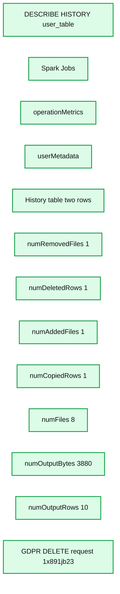
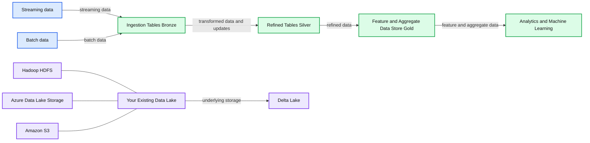
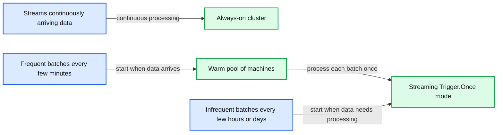

# Enabling Spark SQL DDL and DML in Delta Lake on Apache Spark 3.0

*Delta Lake 0.7.0 is the first release on Apache Spark 3.0 and adds support for metastore-defined tables and SQL DDL*

- Source: https://www.databricks.com/blog/2020/08/27/enabling-spark-sql-ddl-and-dml-in-delta-lake-on-apache-spark-3-0.html
- Published: 2020-08-27
- Authors: Tathagata Das, Burak Yavuz, Denny Lee
- Categories: solutions, engineering, open-source
- Images: 8 total, 5 extracted as architecture

*Get an early preview of *[*O'Reilly's new ebook*](https://www.databricks.com/resources/ebook/delta-lake-running-oreilly?itm_data=sparksqlddldmldlapachespark-blog-oreillydlupandrunning)* for the step-by-step guidance you need to start using Delta Lake.*

---

Last week, we had a fun [Delta Lake 0.7.0 + Apache Spark 3.0 AMA](https://www.youtube.com/watch?v=xzKqjCB8SWU) where Burak Yavuz, Tathagata Das, and Denny Lee provided a recap of Delta Lake 0.7.0 and answered your Delta Lake questions.  The theme for this AMA was the release of [Delta Lake 0.7.0](https://github.com/delta-io/delta/releases/tag/v0.7.0) coincided with the release of [Apache Spark 3.0](https://www.databricks.com/blog/2020/06/18/introducing-apache-spark-3-0-now-available-in-databricks-runtime-7-0.html) thus enabling a new set of features that were simplified using Delta Lake from SQL.

Table of Contents[**Recap of Delta Lake 0.7.0**](https://www.databricks.com/#toc-1)Support for SQL DDL commands to define tables in the Hive metastore
Support for SQL Insert, Delete, Update and Merge
Automatic and incremental Presto/Athena manifest generation
Configuring your table through Table Properties
Support for Adding User-Defined Metadata in Delta Table Commits
Other Highlights[**Now to the Questions!**](https://www.databricks.com/#toc-8)Can Delta tables be created on AWS Glue catalog service?
Can we query the Delta Lake metadata?  Does the cluster have to have live access to the metastore?
Do we still need to define tables in Athena/Presto using symlinks or can we use the new SQL method of defining delta tables via glue catalog?
Does the update, delete, merge immediately write out new Parquet files or use other tricks on the storage layer to minimize I/O?
In our environment, the update happens as a separate process at regular intervals and the ETL happens on the bronze tables. Is it possible to leverage caching to improve performance for these processes.
Can we use Delta Lake in scenarios where the tables are updated very frequently, say every five minutes. Basically we have tables stored in an online system and want to create an offline system using delta lake and update the delta tables every five minutes. What are the perf and cost implications and is this something we can consider using delta for?
What's the performance impact on live queries, when VACUUM is in progress?
Concerning time travel, if a parquet metadata file is created after 10 commits, does it mean that I can go back only 10 commits back? Or time travel queries just ignore parquet metadata files?Get Started with Delta Lake 0.7.0
Credits

## Recap of Delta Lake 0.7.0

Here are some of key highlights of Delta Lake 0.7.0 as recapped in the AMA; refer to the [release notes](https://github.com/delta-io/delta/releases/tag/v0.7.0) for more information.

### Support for SQL DDL commands to define tables in the Hive metastore

You can now define Delta tables in the [Hive metastore](https://spark.apache.org/docs/latest/sql-data-sources-hive-tables.html#interacting-with-different-versions-of-hive-metastore) and use the table name in all SQL operations when creating (or replacing) tables.

- Create or Replace Tables

- Explicitly Alter the Table Schema

You can also use the Scala/Java/Python APIs:

- `DataFrame.saveAsTable(tableName)` and `DataFrameWriterV2` APIs ([#307](https://github.com/delta-io/delta/issues/307)).
- `DeltaTable.forName(tableName)` API to create instances of `io.delta.tables.DeltaTable` which is useful for executing Update/Delete/Merge operations in Scala/Java/Python.

### Support for SQL Insert, Delete, Update and Merge

One of most frequent questions through our [Delta Lake Tech Talks](https://www.youtube.com/watch?v=SQxGx6RTMA8&list=PLTPXxbhUt-YVPwG3OWNQ-1bJI_s_YRvqP) was when would DML operations such as delete, update, and merge be available in Spark SQL?  Wait no more, these operations are now available in SQL!  Below are example of how you can write delete, update, and merge (insert, update, delete, and deduplication operations using Spark SQL

- Delete actions - Delete a target when matched with a source row. For example,  "... WHEN MATCHED THEN DELETE ..."
- Multiple matched actions with clause conditions - Greater flexibility when target and source rows match. For example,

- Star syntax - Short-hand for setting target column value with the similarly-named sources column. For example,

### Automatic and incremental Presto/Athena manifest generation

As noted in [Query Delta Lake Tables from Presto and Athena, Improved Operations Concurrency, and Merge performance](https://www.databricks.com/blog/2020/01/29/query-delta-lake-tables-presto-athena-improved-operations-concurrency-merge-performance.html), Delta Lake supports other processing engines to read Delta Lake by using manifest files; the manifest files contain the list of the most current version of files as of manifest generation.  As described in the preceding blog, you will need to:

- Generate Delta Lake Manifest File
- Configure Presto or Athena to read the generated manifests
- Manually re-generate (update) the manifest file

New for Delta Lake 0.7.0 is the capability to update the manifest file automatically with following command.

### Configuring your table through Table Properties

With the ability to set table properties on your table by using ALTER TABLE SET TBLPROPERTIES, you can enable, disable or configure many features of Delta such as automated manifest generation. For example, with [table properties](https://docs.delta.io/latest/delta-batch.html#table-properties), you can block deletes and updates in a Delta table using `delta.appendOnly=true`.

You can also easily control the history of your Delta Lake table retention by the following properties:

- `delta.logRetentionDuration`: Controls how long the history for a table (i.e. transaction *log* history) is kept. By default, thirty (30) days of history is kept but you may want to alter this value based on your requirements (e.g. GDPR historical context)
- `delta.deletedFileRetentionDuration`: Controls how long ago a file must have been deleted before being a candidate for VACUUM.  By default, *data* files older than seven (7) days are deleted.

As of Delta Lake 0.7.0, you can use ALTER TABLE SET TBLPROPERTIES to configure these properties.

For more information, refer to [Table Properties](https://docs.delta.io/latest/delta-batch.html#table-properties) in the Delta Lake documentation.

### Support for Adding User-Defined Metadata in Delta Table Commits

You can specify user-defined strings as metadata in commits made by Delta table operations, either using the DataFrameWriter option userMetadata or the SparkSession configuration `spark.databricks.delta.commitInfo.userMetadata` (documentation).

In the following example, we are deleting a user (1xsdf1) from our data lake per user request.  To ensure we associate the user’s request with the deletion, we have also added the DELETE request ID into the userMetadata.

When reviewing the [history](https://docs.delta.io/latest/delta-utility.html#-describe-history) operations of the user table (user_table), you can easily identify the associated deletion request within the transaction log.

**Summary:** Delta Lake table history displays operation metrics and user metadata for a user table deletion.

**Components:**

- SQL history command for `user_table`
- Spark Jobs history
- `operationMetrics` transaction metrics
- `userMetadata` deletion request metadata
- History table with two rows

**Flows:**

- No arrows are visible.

**Numbers:** 1, 2, 8, 3880, 10, `1x891jb23`, 2 rows

source image: https://www.databricks.com/wp-content/uploads/2020/08/blog-delta-spark-2-min.png

### Other Highlights

Other highlights for the Delta Lake 0.7.0 release include:

- Support Azure Data Lake Storage Gen2 - Spark 3.0 has support for Hadoop 3.2 libraries which enables support for Azure Data Lake Storage Gen2 (documentation).
- Improved support for streaming one-time triggers - With Spark 3.0, we now ensure that [one-time trigger](https://spark.apache.org/docs/latest/structured-streaming-programming-guide.html#triggers) (`Trigger.Once`) processes all outstanding data in a Delta table in a single micro-batch even if rate limits are set with the DataStreamReader option maxFilesPerTrigger.

There were a lot of great questions during the AMA concerning structured streaming and using  `trigger.once`.  For more information, some good resources explaining this concept include:

- [Running Streaming Jobs Once a Day For 10x Cost Savings](https://www.databricks.com/blog/2017/05/22/running-streaming-jobs-day-10x-cost-savings.html).
- [Beyond Lambda: Introducing Delta Architecture](https://www.youtube.com/watch?v=FePv0lro0z8&list=PLTPXxbhUt-YVPwG3OWNQ-1bJI_s_YRvqP&index=21): Specifically the cost vs. latency trade off on [starting here](https://youtu.be/FePv0lro0z8?t=2398).

## Now to the Questions!

We had a lot of great questions during our AMA; below is a quick synopsis of some of those questions.

### Can Delta tables be created on AWS Glue catalog service?

Yes, you can integrate your Delta Lake tables with the AWS Glue Data Catalog service.  The blog [Transform Your AWS Data Lake using Databricks Delta and the AWS Glue Data Catalog Service](https://www.databricks.com/blog/2019/09/03/transform-your-aws-data-lake-using-databricks-delta-and-aws-glue-data-catalog-service.html) provides a great how-to.

**Summary:** AWS data lake architecture using Databricks Unified Analytics Platform, Delta Lake, and AWS analytics services.

**Components:**

- Streaming data: AWS IoT Events and Amazon API Gateway
- Amazon Kinesis: streaming ingestion
- Batch data: files and datastore
- Amazon S3: object storage
- Databricks platform: Delta Lake tables and MLflow
- Ingestion tables: Bronze layer
- Refined tables: Silver layer
- Featured tables: Gold layer
- Roles: identity and access roles
- AWS IAM Federation: federated access control
- Amazon Redshift: data warehouse
- Crawlers: metadata discovery
- AWS Glue: data catalog and ETL
- Amazon Athena: serverless query engine
- Amazon QuickSight: business intelligence

**Flows:**

- AWS IoT Events and Amazon API Gateway -> Amazon Kinesis: streaming messages
- Amazon Kinesis -> Databricks platform: streaming ingestion
- Files and datastore -> Amazon S3: batch data
- Amazon S3 -> Databricks platform: batch ingestion
- AWS IAM Federation -> Databricks platform: federated access
- Roles -> AWS IAM Federation: identity roles
- Databricks platform -> Amazon Redshift: analytical data
- Amazon Redshift -> Databricks platform: data exchange
- Amazon S3 -> Crawlers: source data discovery
- Crawlers -> AWS Glue: discovered metadata
- AWS Glue -> Databricks platform: catalog integration
- Databricks platform -> AWS Glue: table metadata
- AWS Glue -> Amazon Athena: catalog access
- Amazon Athena -> Amazon QuickSight: query results
- Amazon Redshift -> Amazon QuickSight: warehouse data

**Numbers:** none

source image: https://www.databricks.com/wp-content/uploads/2020/08/blog-delta-spark-3-min.png

```mermaid
%% AWS data lake implementation using Databricks and AWS analytics services
flowchart LR
    Edge[Streaming and batch sources]
    Kinesis[Amazon Kinesis]
    S3[Amazon S3]
    DBX[Databricks Delta Lake and MLflow]
    IAM[AWS IAM Federation]
    Roles[Roles]
    Redshift[Amazon Redshift]
    Crawlers[Crawlers]
    Glue[AWS Glue]
    Athena[Amazon Athena]
    QuickSight[Amazon QuickSight]

    Edge -->|streaming and batch data| Kinesis
    Edge -->|batch files and datastore data| S3
    Kinesis -->|stream ingestion| DBX
    S3 -->|batch ingestion| DBX
    Roles -->|identity roles| IAM
    IAM -->|federated access| DBX
    DBX -->|analytical data| Redshift
    Redshift -->|data exchange| DBX
    S3 -->|metadata discovery| Crawlers
    Crawlers -->|discovered metadata| Glue
    Glue -->|catalog integration| DBX
    DBX -->|table metadata| Glue
    Glue -->|catalog access| Athena
    Athena -->|query results| QuickSight
    Redshift -->|warehouse data| QuickSight

    classDef client   fill:#dbeafe,stroke:#2563eb,stroke-width:2px,color:#111
    classDef service  fill:#dcfce7,stroke:#16a34a,stroke-width:2px,color:#111
    classDef store    fill:#ede9fe,stroke:#7c3aed,stroke-width:2px,color:#111
    classDef cache    fill:#fef3c7,stroke:#d97706,stroke-width:2px,color:#111
    classDef queue    fill:#cffafe,stroke:#0891b2,stroke-width:2px,color:#111
    classDef critical fill:#fee2e2,stroke:#dc2626,stroke-width:4px,color:#111
    classDef external fill:#e5e7eb,stroke:#6b7280,stroke-width:2px,color:#111,stroke-dasharray:4 3
    classDef decision fill:#fce7f3,stroke:#db2777,stroke-width:2px,color:#111

    class Edge,Roles client
    class Kinesis,Crawlers,Glue,Athena,QuickSight service
    class S3,DBX,Redshift store
    class IAM external
```

It is important to note that not all of the Delta Lake metadata information is stored in Glue so for more details, you will still want to read the Delta Lake transaction log directly.

### Can we query the Delta Lake metadata?  Does the cluster have to have live access to the metastore?

As noted in the previous question, there is a slight difference between the Delta Lake metadata vs. the Hive or Glue metastores.  The latter are metastores that act as catalogs to let any compatible framework determine what tables are available to query.

While the Delta Lake metadata contains this information, it also contains a lot of other information that may not be important for a metastore to catalog including the current schema of the table, what files are associated with which transaction, operation metrics, etc.  To query the metadata, you can use Spark SQL or DataFrame APIs to query the Delta Lake transaction log. For more information, refer to the Delta Lake Internals Online Tech Talks which dive deeper into these internals as well as provide example notebooks so you can query the metadata yourself.

### Do we still need to define tables in Athena/Presto using symlinks or can we use the new SQL method of defining delta tables via glue catalog?

As noted earlier, one of the first steps to defining an Athena/Presto table is to generate manifests of a Delta table using Apache Spark. This task will generate a set of files - i.e. the manifest - that contains which files Athena or Presto will read when looking at the most current catalog of data.  The second step is to configure Athena/Presto to read those generated manifests.    Thus, at this time, you will still need to create the synlinks so that Athena/Presto will be able to identify which files it will need to read.

Note, the SQL method for defining the Delta table defines the existence of the table and schema but does not specify which files Athena/Presto should be reading (i.e. read this snapshot of the  latest Parquet files that make up the current version of the table).  As Delta Lake table versions can often change (e.g. structured streams appending data, multiple batches running [ForeachBatch](https://spark.apache.org/docs/latest/structured-streaming-programming-guide.html#using-foreach-and-foreachbatch) statements to update the table, etc.), it would very likely overload any metastore with continuous updates to the metadata of the latest files.

### Does the update, delete, merge immediately write out new Parquet files or use other tricks on the storage layer to minimize I/O?

As noted in Delta Lake Internals Online Tech Talks, any changes to the underlying file system whether they be update, delete, or merge results in the *addition* of new files.  As Delta Lake is writing new files every time, this process is not as storage I/O intensive as (for example) a traditional delete that would require I/O to read the file, remove the deleted rows, and overwrite the original file.   In addition, because Delta Lake uses a transaction log to identify which files are associated with the data version, the reads are not nearly as storage I/O intensive.  Instead of listing out all of the files from distributed storage which can be I/O intensive, time consuming, or both, through its transaction log Delta Lake can automatically obtain the necessary files. In addition, deletes at partition boundaries are performed as pure metadata operations, therefore are super fast.

### In our environment, the update happens as a separate process at regular intervals and the ETL happens on the bronze tables. Is it possible to leverage caching to improve performance for these processes.

For those who may be unfamiliar with bronze tables, this question is in reference to the Delta Medallion Architecture framework for data quality.  We start with a fire hose of events that are written to storage as fast as possible as part of the data ingestion process where the data lands in these ingestion or bronze tables.  As you refind the data (joins, lookups, filtering, etc.) you create silver tables.  Finally, you have the features for your ML and/or aggregate table(s) - also known as Gold tables - to perform your analysis.  For more information on the Delta Architecture, please refer to [Beyond Lambda: Introducing Delta Architecture](https://www.youtube.com/watch?v=FePv0lro0z8) and [Productionizing Machine Learning with Delta Lake](https://www.databricks.com/blog/2019/08/14/productionizing-machine-learning-with-delta-lake.html).

**Summary:** Delta Lake medallion architecture showing streaming and batch data flowing through Bronze, Silver, and Gold tables for analytics and machine learning.

**Components:**

- Streaming data source
- Batch data source
- Delta Lake
- Ingestion Tables Bronze
- Refined Tables Silver
- Feature and Aggregate Data Store Gold
- Analytics and Machine Learning
- Existing Data Lake
- Hadoop HDFS
- Azure Data Lake Storage
- Amazon S3

**Flows:**

- Streaming data source -> Ingestion Tables Bronze: streaming data
- Batch data source -> Ingestion Tables Bronze: batch data
- Ingestion Tables Bronze -> Refined Tables Silver: transformed data and updates
- Refined Tables Silver -> Feature and Aggregate Data Store Gold: refined data
- Feature and Aggregate Data Store Gold -> Analytics and Machine Learning: feature and aggregate data
- Existing Data Lake -> Delta Lake: underlying storage

**Numbers:** none

source image: https://www.databricks.com/wp-content/uploads/2020/08/blog-delta-spark-4-min.png

With this type of architecture, as part of the Extract Transform Load (ETL) process, the extracted data is stored in your Bronze tables as part of data ingestion.  The transformations of your data (including updates) will occur as you go from Bronze to Silver resulting in your refined tables.

In terms of caching, there are two types of caching that may be coming into play. There is the Apache Spark caching as well as the Delta Engine caching which is specific to Databricks. Using Apache Spark cache via .cache and/or .persist allows you to keep data in-memory thus minimizing storage I/O.   This can be especially useful when creating intermediary tables for multi-hop pipelines where multiple downstream tables are created based on a set of intermediate tables.    You can also leverage the Delta Engine cache (which can be used in tandem with the Apache Spark cache) as it contains local copies of remote data thus can be read and operated on faster than data solely using the Apache Spark cache.  In this scenario, you may benefit from materializing the DataFrames not only to take advantage of the Delta Engine cache but to handle fault recovery and simplify troubleshooting for your multi-hop data pipelines.

**Summary:** The diagram shows intermediate Delta tables materializing multi-hop DataFrame transformations to support fault recovery, troubleshooting, and multiple consumers.

**Components:**

- Source DataFrame
- Intermediate Table after T1
- Transformation stages T1 through T7
- Intermediate Table after T3
- Consumer output tables

**Flows:**

- Source DataFrame -> T1: input data
- T1 -> Intermediate Table: materialized intermediate data
- Intermediate Table -> T2: resumed transformation
- T2 -> T3: transformed data
- T3 -> Intermediate Table: materialized intermediate data
- Intermediate Table -> T4 and T5: branched intermediate data
- T4 -> T6: transformed data
- T5 -> T7: transformed data
- T6 -> Consumer output tables: final data
- T7 -> Consumer output tables: final data

**Numbers:** #2, T1, T2, T3, T4, T5, T6, T7

```mermaid
%% Shows materialized intermediate hops in a multi-hop transformation pipeline
flowchart LR
    A[Source DataFrame] -->|input data| B[T1]
    B -->|materialized data| C[Intermediate Table One]
    C -->|resumed transformation| D[T2]
    D -->|transformed data| E[T3]
    E -->|materialized data| F[Intermediate Table Two]
    F -->|branch data| G[T4]
    F -->|branch data| H[T5]
    G -->|transformed data| I[T6]
    H -->|transformed data| J[T7]
    I -->|final data| K[Consumer Outputs]
    J -->|final data| K

    classDef client fill:#dbeafe,stroke:#2563eb,stroke-width:2px,color:#111
    classDef service fill:#dcfce7,stroke:#16a34a,stroke-width:2px,color:#111
    classDef store fill:#ede9fe,stroke:#7c3aed,stroke-width:2px,color:#111
    classDef cache fill:#fef3c7,stroke:#d97706,stroke-width:2px,color:#111
    classDef queue fill:#cffafe,stroke:#0891b2,stroke-width:2px,color:#111
    classDef critical fill:#fee2e2,stroke:#dc2626,stroke-width:4px,color:#111
    classDef external fill:#e5e7eb,stroke:#6b7280,stroke-width:2px,color:#111,stroke-dasharray:4 3
    classDef decision fill:#fce7f3,stroke:#db2777,stroke-width:2px,color:#111

    class A,K client
    class B,D,E,G,H,I,J service
    class C,F store
```

source image: https://www.databricks.com/wp-content/uploads/2020/08/blog-delta-spark-5-min.png

For more information on intermediate hops, please refer to [Beyond Lambda: Introducing Delta Architecture](https://www.youtube.com/watch?v=FePv0lro0z8).  For more information on Delta Engine and Apache Spark caching, please refer to [Optimize performance with caching](https://docs.databricks.com/delta/optimizations/delta-cache.html).

### Can we use Delta Lake in scenarios where the tables are updated very frequently, say every five minutes. Basically we have tables stored in an online system and want to create an offline system using delta lake and update the delta tables every five minutes. What are the perf and cost implications and is this something we can consider using delta for?

Delta Lake can be both a source and a sink for both your batch and streaming processes.  In the case of updating tables frequently, you can either regularly run batch queries every 5min or another approach would be to use `Trigger.once` (as noted in the previous section).  In terms of performance and cost implications, below is a great slide that encompasses the cost vs. latency trade off for these approaches.

**Summary:** The slide presents three cost-versus-latency strategies for continuously arriving, frequent-batch, and infrequent-batch data.

**Components:**

- Streams: continuously arriving data
- Always-on cluster
- Frequent batches
- Warm pool of machines
- Streaming Trigger.Once mode
- Infrequent batches

**Flows:**

- Streams -> Always-on cluster: continuously processes data
- Frequent batches -> Warm pool of machines: starts processing when data arrives
- Warm pool of machines -> Streaming Trigger.Once mode: processes each batch once
- Infrequent batches -> Streaming Trigger.Once mode: starts the cluster when data needs processing

**Numbers:**

- 1
- 2
- 3
- 30 mins
- Every few minutes
- Every few hours
- Days

source image: https://www.databricks.com/wp-content/uploads/2020/08/blog-delta-spark-6-min.png

To dive deeper into this, please refer to the tech talk [Beyond Lambda: Introducing Delta Architecture](https://www.youtube.com/watch?v=FePv0lro0z8&list=PLTPXxbhUt-YVPwG3OWNQ-1bJI_s_YRvqP&index=21).  A quick call out for frequent batches (whether they be batch or streaming):

- When adding data frequently, this may result in many small files.  A best practice would be to periodically [compact your files](https://docs.delta.io/latest/best-practices.html#compact-files).  If you’re using Databricks, you can also [use auto-optimize](https://docs.databricks.com/delta/optimizations/auto-optimize.html) to automate this task.
- Using ForeachBatch to modify existing data may result in a lot of transactions and versions of data.  May want to be more aggressive in cleaning out log entries and/or vacuuming to reduce size.

> Another good reference is the VLDB 2020 paper: [Delta Lake: High-Performance ACID Table Storage over Cloud Object Stores](https://www.databricks.com/wp-content/uploads/2020/08/p975-armbrust.pdf).

### What's the performance impact on live queries, when VACUUM is in progress?

There should be minimal to no impact to live queries as vacuum is typically running on data that is on a different set of files than your queries. Where there is a potential impact is if you’re doing a time travel query on the same data that you’re about to vacuum (e.g. running vacuum of default of 7 days while attempting to query data that is older than 7 days).

### Concerning time travel, if a parquet metadata file is created after 10 commits, does it mean that I can go back only 10 commits back? Or time travel queries just ignore parquet metadata files?

You can go as far back in the transaction log as defined by the delta.logRetentionDuration which is by default 30 days of history.  That is, by default you can see 30 days of history within the transaction log.  Note, while there is 30 days of *log* history, when *running* vacuum (which needs to be initiated manually, it does not run automatically) by default any *data* files that are older than 7 days are removed.

In the case of creating parquet metadata files, every Delta Lake transaction will first record the JSON file that is the transaction log.  Every 10th transaction, a parquet metadata file is generated that stores the previous transaction log entries to improve performance.  Thus, if a new cluster needs to read all the transaction log entries, it needs only to the parquet file and most recent (up to 9) JSON files

For more information, please refer to [Diving into Delta Lake: Unpacking the Transaction Log](https://www.youtube.com/watch?v=F91G4RoA8is&list=PLTPXxbhUt-YVPwG3OWNQ-1bJI_s_YRvqP&index=17).*  *

### Get Started with Delta Lake 0.7.0

Try out Delta Lake with the preceding code snippets on your Apache Spark 3.0.0 (or greater) instance. Delta Lake makes your data lakes more reliable (whether you create a new one or migrate an existing data lake).  To learn more, refer to [https://delta.io/](https://delta.io/), and join the Delta Lake community via [Slack](https://delta-users.slack.com/join/shared_invite/enQtNTY1NDg0ODcxOTI1LWE3YjMxOTM4MmM0YWNhNjE2YmI2OGI4N2Y3MTRhOWQ1YzE3MTMyYTM5YzRiZWZlYzMwYzk0M2JiZmJhY2Q4NWI) and [Google Group](https://groups.google.com/forum/#!forum/delta-users).  You can track all the upcoming releases and planned features in [GitHub milestones](https://github.com/delta-io/delta/milestones). You can also try out Managed Delta Lake on Databricks with a [free account.](https://www.databricks.com/try-databricks)

### Credits

We want to thank the following contributors for updates, doc changes, and contributions in Delta Lake 0.7.0: Alan Jin, Alex Ott, Burak Yavuz, Jose Torres, Pranav Anand, QP Hou, Rahul Mahadev, Rob Kelly, Shixiong Zhu, Subhash Burramsetty, Tathagata Das, Wesley Hoffman, Yin Huai, Youngbin Kim, Zach Schuermann, Eric Chang, Herman van Hovell, Mahmoud Mahdi.

O’Reilly Learning Spark Book

 

Free 2nd Edition includes updates on Spark 3.0 and chapters on Spark SQL and Data Lakes.

[Free Download](https://www.databricks.com/p/ebook/the-big-book-of-data-engineering?itm_data=blog-link-learningspark)
