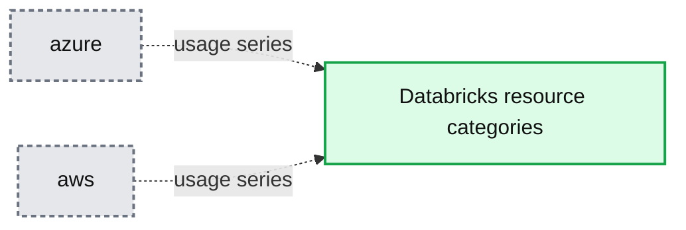
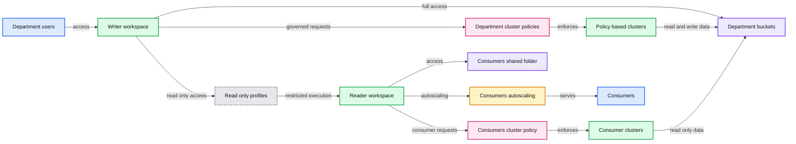

# Announcing Databricks Labs Terraform integration on AWS and Azure

- Source: https://www.databricks.com/blog/2020/09/11/announcing-databricks-labs-terraform-integration-on-aws-and-azure.html
- Published: 2020-09-11
- Authors: Serge Smertin, Sri Tikkireddy
- Categories: platform, solutions, engineering
- Images: 4 total, 4 extracted as architecture

**Summary:** Terraform manages Databricks workspace resources across cloud storage, data access, networking, observability, and self-service automation.

**Components:**

- Automated Jobs - Databricks workspace resource
- Streaming Pipelines - Databricks workspace resource
- Workspace Security - Databricks workspace resource
- Interactive Clusters - Databricks workspace resource
- Machine Learning - Databricks workspace resource
- Cloud Storage - S3, ADLS, and others
- Data Access - AWS IAM and Azure RBAC
- Networking and Observability - Databricks workspace resource
- Cloud-agnostic and Self-Service Automation - Terraform-managed capability
- HashiCorp Terraform - infrastructure automation tool

**Flows:**

- Automated Jobs -> Streaming Pipelines: workspace resource connection
- Streaming Pipelines -> Workspace Security: workspace resource connection
- Workspace Security -> Interactive Clusters: workspace resource connection
- Interactive Clusters -> Machine Learning: workspace resource connection
- Machine Learning -> HashiCorp Terraform: Terraform integration
- Cloud Storage -> Data Access: infrastructure resource connection
- Data Access -> Networking and Observability: infrastructure resource connection
- Networking and Observability -> Cloud-agnostic and Self-Service Automation: Terraform-managed connection
- HashiCorp Terraform -> Cloud-agnostic and Self-Service Automation: self-service automation

**Numbers:** 3

```mermaid
%% Shows Terraform-managed Databricks workspace resources and cloud infrastructure
flowchart LR
  jobs[Automated Jobs] -->|workspace resource connection| streams[Streaming Pipelines]
  streams -->|workspace resource connection| security[Workspace Security]
  security -->|workspace resource connection| clusters[Interactive Clusters]
  clusters -->|workspace resource connection| ml[Machine Learning]
  ml -->|Terraform integration| terraform[HashiCorp Terraform]

  storage[Cloud Storage S3 ADLS and others] -->|infrastructure resource connection| access[Data Access AWS IAM Azure RBAC]
  access -->|infrastructure resource connection| network[Networking and Observability]
  network -->|Terraform managed connection| automation[Cloud agnostic and Self Service Automation]
  terraform -->|self service automation| automation

  classDef client   fill:#dbeafe,stroke:#2563eb,stroke-width:2px,color:#111
  classDef service  fill:#dcfce7,stroke:#16a34a,stroke-width:2px,color:#111
  classDef store    fill:#ede9fe,stroke:#7c3aed,stroke-width:2px,color:#111
  classDef cache    fill:#fef3c7,stroke:#d97706,stroke-width:2px,color:#111
  classDef queue    fill:#cffafe,stroke:#0891b2,stroke-width:2px,color:#111
  classDef critical fill:#fee2e2,stroke:#dc2626,stroke-width:4px,color:#111
  classDef external fill:#e5e7eb,stroke:#6b7280,stroke-width:2px,color:#111,stroke-dasharray:4 3
  classDef decision fill:#fce7f3,stroke:#db2777,stroke-width:2px,color:#111

  class jobs,streams,security,clusters,ml,network,automation service
  class storage,access store
  class terraform external
```

source image: https://www.databricks.com/wp-content/uploads/2020/09/blog-terraform-1-min.png

We are pleased to announce integration for deploying and managing Databricks environments on Microsoft Azure and Amazon Web Services (AWS) with HashiCorp Terraform. It is a popular open source tool for creating safe and predictable cloud infrastructure across several cloud providers. With this release, our customers can manage their entire Databricks workspaces along with the rest of their infrastructure using a flexible, powerful tool. Previously on the company blog you may have read how we [use the tool](https://www.databricks.com/blog/2018/10/31/democratizing-cloud-infrastructure-with-terraform-and-jenkins.html) internally or how to share common [building blocks](https://www.databricks.com/blog/2019/05/07/efficient-databricks-deployment-automation-with-terraform.html) of it as modules.

**Summary:** The chart shows increasing overall resource usage of the Databricks Labs Terraform Provider from April through August 2020, with several fluctuations.

**Components:**

- Resource usage trend line
- Time axis with dates from April 12 to August 2, 2020

**Flows:**

- Apr 12 -> Apr 26: slight increase
- Apr 26 -> May 10: sharp increase
- May 10 -> May 17: flat trend
- May 17 -> May 24: increase
- May 24 -> Jun 7: fluctuation with a dip
- Jun 7 -> Jun 21: increase
- Jun 21 -> Jul 5: sharp increase
- Jul 5 -> Jul 19: decrease
- Jul 19 -> Aug 2: increase to the peak
- Aug 2 -> Aug 9: decrease

**Numbers:** April 12, April 26, May 10, May 24, June 7, June 21, July 5, July 19, August 2, 2020

source image: https://www.databricks.com/wp-content/uploads/2020/09/blog-terraform-2-min.png

*Growing adoption from initial customer base*

Few months ago a customer obsessed crew from the Databricks Labs teamed up and started making a *Databricks Terraform Provider*. Since the very start we’ve been seeing a steady increase in usage of this integration by a number of different customers.

**Summary:** Overall Databricks Terraform Provider resource usage across Azure and AWS.

**Components:**

- Azure usage series
- AWS usage series
- Databricks resource categories including clusters, jobs, secrets, notebooks, instances, groups, users, mounts, files, policies, credentials, networks, and workspaces

**Flows:**

- none

**Numbers:** none

source image: https://www.databricks.com/wp-content/uploads/2020/09/blog-terraform-3-min.png

*Overall resource usage from all clouds*

The aim of this provider is to support all Databricks APIs on Azure and AWS. This allows the Cloud Infrastructure Engineers to automate the most complicated things about their Data & AI platforms. Vast majority of the initial user group is using this provider to set up their clusters and jobs. Customers are also using it to provision workspaces on AWS and configure data access. Workspace setup resources are usually used only in the beginning of deployment setup along with virtual network setup.

## Controlling compute resources and monetary spend

From a compute perspective, the provider makes it simple to create a [cluster](https://registry.terraform.io/providers/databrickslabs/databricks/latest/docs/resources/cluster) for interactive analysis or a [job](https://registry.terraform.io/providers/databrickslabs/databricks/latest/docs/resources/job) to run production workload with guaranteed installation of libraries. It’s also quite simple to create and modify an [instance pool](https://registry.terraform.io/providers/databrickslabs/databricks/latest/docs/resources/instance_pool) with potentially reserved instances, so that your clusters can start up x-times quicker and cost you less $$$.

Managing the cost of compute resources in Databricks data science workspaces is a top concern for Platform admins. And for large organisations, managing all of these compute resources across multiple workspaces comes with a bit of overhead. To address those, the provider makes it easier to create scalable [cluster management](https://www.databricks.com/blog/2020/07/02/allow-simple-cluster-creation-with-full-admin-control-using-cluster-policies.html) using [cluster policies](https://registry.terraform.io/providers/databrickslabs/databricks/latest/docs/resources/cluster_policy) and the Hashicorp Configuration Language (HCL).

## Controlling data access

From a workspace security perspective, administrators can configure different [groups](https://registry.terraform.io/providers/databrickslabs/databricks/latest/docs/resources/group) of users  with different access rights and even add [users](https://registry.terraform.io/providers/databrickslabs/databricks/latest/docs/resources/group_member). General recommendation is to let Terraform manage groups including their workspace and data access rights, leaving group membership management to Identity Provider with SSO or SCIM provisioning.

For the sensitive data sources, one should create [secret scopes](https://registry.terraform.io/providers/databrickslabs/databricks/latest/docs/resources/secret_scope) to store the external API credentials in a [secure manner](https://registry.terraform.io/providers/databrickslabs/databricks/latest/docs/resources/secret). The secrets are redacted by default in the notebooks, and one could also manage access to those using [access control lists](https://registry.terraform.io/providers/databrickslabs/databricks/latest/docs/resources/secret_acl). If you already use Hashicorp [Vault](https://registry.terraform.io/providers/hashicorp/vault/latest/docs/data-sources/generic_secret), AWS [Secrets Manager](https://registry.terraform.io/providers/hashicorp/aws/latest/docs/data-sources/secretsmanager_secret_version#secret_string) or Azure [Key Vault](https://registry.terraform.io/providers/hashicorp/azurerm/latest/docs/data-sources/key_vault_secret#value), you can populate Databricks secrets from there and have them be usable for your AI and Advanced Analytics use cases. If you have workspace security enabled, [permissions](https://registry.terraform.io/providers/databrickslabs/databricks/latest/docs/resources/permissions) can be the single source of truth for managing user or group access to clusters (and their policies), jobs, instance pools, notebooks and other Databricks objects.

From a data security perspective, one could manage AWS EC2 [instance profiles](https://registry.terraform.io/providers/databrickslabs/databricks/latest/docs/resources/instance_profile) in a workspace and assign those to only relevant [groups](https://registry.terraform.io/providers/databrickslabs/databricks/latest/docs/resources/group_instance_profile) of users. The key thing to note here is that you can define all of these cross platform components (AWS & Databricks) in the same language and code base where Terraform manages the intricate dependencies.

The integration also facilitates mounting of object storage within workspace into “normal” file system for the following storage types:

- AWS [Simple Storage Service](https://registry.terraform.io/providers/databrickslabs/databricks/latest/docs/resources/aws_s3_mount)
- Azure [Blob Storage](https://registry.terraform.io/providers/databrickslabs/databricks/latest/docs/resources/azure_blob_mount)
- Azure [Data Lake Storage](https://registry.terraform.io/providers/databrickslabs/databricks/latest/docs/resources/azure_adls_gen2_mount) v2 (also [previous generation](https://registry.terraform.io/providers/databrickslabs/databricks/latest/docs/resources/azure_adls_gen1_mount) of it)

## Managing workspaces

It is possible to create Azure Databricks workspaces using [azurerm_databricks_workspace](https://registry.terraform.io/providers/hashicorp/azurerm/latest/docs/resources/databricks_workspace) (this resource is part of the Azure provider that’s officially supported by Hashicorp). Customers interested in provisioning a setup conforming to their enterprise governance policy could follow this working example with Azure Databricks [VNet injection](https://github.com/databrickslabs/terraform-provider-databricks/tree/master/scripts/azvnet-integration).

**Summary:** The diagram shows secure data sharing across separate Data Science and Marketing workspaces in a Writer VPC and a shared Reader VPC.

**Components:**

- Writer VPC and Workspace using AWS VPC networking
- Data Science department
- Marketing department
- Data Science users
- Marketing users
- Data Science shared folder
- Marketing shared folder
- Data Science full access instance profile
- Marketing full access instance profile
- Data Science bucket
- Marketing bucket
- Data Science cluster policy
- Marketing cluster policy
- Data Science shared autoscaling
- Marketing shared autoscaling
- Policy based clusters
- Data Science read only access
- Marketing read only access
- Reader VPC and Workspace using AWS VPC networking
- Consumers
- Consumers shared folder
- Consumers shared autoscaling
- Read only instance profile
- Consumers cluster policy
- Policy based consumer clusters

**Flows:**

- Data Science users -> Data Science shared folder: shared folder access
- Data Science users -> Data Science shared autoscaling: cluster access
- Data Science users -> Data Science cluster policy: policy governed cluster requests
- Data Science full access instance profile -> Data Science bucket: full access data operations
- Data Science cluster policy -> Policy based clusters: cluster policy enforcement
- Data Science cluster policy -> Data Science shared autoscaling: autoscaling cluster management
- Policy based clusters -> Data Science bucket: data access
- Data Science read only access -> Read only instance profile: read only permissions
- Data Science bucket -> Read only instance profile: read only data access
- Marketing users -> Marketing shared folder: shared folder access
- Marketing users -> Marketing shared autoscaling: cluster access
- Marketing users -> Marketing cluster policy: policy governed cluster requests
- Marketing full access instance profile -> Marketing bucket: full access data operations
- Marketing cluster policy -> Policy based clusters: cluster policy enforcement
- Marketing cluster policy -> Marketing shared autoscaling: autoscaling cluster management
- Policy based clusters -> Marketing bucket: data access
- Marketing read only access -> Read only instance profile: read only permissions
- Marketing bucket -> Read only instance profile: read only data access
- Data Science read only access -> Read only instance profile: cross workspace read only access
- Marketing read only access -> Read only instance profile: cross workspace read only access
- Read only instance profile -> Consumers cluster policy: restricted cluster execution
- Consumers -> Consumers shared folder: shared folder access
- Consumers -> Consumers shared autoscaling: cluster access
- Consumers -> Consumers cluster policy: policy governed cluster requests
- Consumers shared autoscaling -> Consumers: autoscaling cluster service
- Consumers cluster policy -> Policy based consumer clusters: cluster policy enforcement
- Policy based consumer clusters -> Consumers shared autoscaling: managed cluster execution
- Read only instance profile -> Consumers shared autoscaling: read only data execution

source image: https://www.databricks.com/wp-content/uploads/2020/09/terraform-reference-arch-og.png

With [general availability of the E2 capability](https://www.databricks.com/blog/2020/09/01/databricks-unified-data-analytics-platform-for-aws-gets-a-major-upgrade.html), our AWS customers can now leverage enhanced security features and create [workspaces](https://registry.terraform.io/providers/databrickslabs/databricks/latest/docs/resources/mws_workspaces) within their own fully managed VPCs. Customers can configure a [network](https://registry.terraform.io/providers/databrickslabs/databricks/latest/docs/resources/mws_networks) resource which defines the subnets and security groups within the existing VPC. Then could then create a[cross-account role](https://docs.databricks.com/administration-guide/account-settings/aws-accounts.html) and register it as a [credentials](https://registry.terraform.io/providers/databrickslabs/databricks/latest/docs/resources/mws_credentials) resource to grant Databricks relevant permissions to provision compute resources within the provided VPC. A [storage configuration](https://registry.terraform.io/providers/databrickslabs/databricks/latest/docs/resources/mws_storage_configurations) resource could be used to configure the root bucket.

Please follow [this complete example](https://github.com/databrickslabs/terraform-provider-databricks/blob/master/scripts/awsmt-integration/main.tf) with a new VPC and new workspace setup. Please pay special attention to the fact that there are two different instances of the Databricks provider - one for deploying workspaces (with *host=*[*https://accounts.cloud.databricks.com/login*](https://accounts.cloud.databricks.com/login#aws)) and another for managing Databricks objects within the provisioned workspace. If you would like to manage provisioning of workspaces as well as clusters within that workspace in the same terraform module (essentially same directory), you should use the [provider aliasing feature of Terraform](https://www.terraform.io/language/providers/configuration#alias-multiple-provider-instances). We strongly recommend having separate terraform modules for provisioning of the workspace including generating the initial PAT token, and managing resources within the workspace. This is due to the fact that Databricks APIs are nearly the same across all cloud providers but workspace creation may be cloud specific. Once the PAT token has been created after the workspace provisioning, that could be used in other modules to provision relevant objects within the workspace.

## Provider quality and support

Provider has been developed as part of the [Databricks Labs initiative](https://github.com/databrickslabs/terraform-provider-databricks#project-support) and has an established issue tracking [through Github](https://github.com/databrickslabs/terraform-provider-databricks/issues/new/choose). Pull requests are always welcome. Code is undergoing heavy integration testing each release and has got significant unit [test code coverage](https://app.codecov.io/gh/databrickslabs/terraform-provider-databricks). The goal is also to make sure every possible Databricks resource and data source definition is documented.

We extensively test all of the resources for all of the supported cloud providers through a set of integration tests before every release. We mainly test with Terraform 0.12, though soon we’ll switch to testing with 0.13 as well.

## What’s Next?

Stay tuned for related blog posts in future. You can also watch on demand our webinar discussing how to [Simplify, Secure, and Scale your Enterprise Cloud Data Platform](https://www.databricks.com/p/webinar/simplify-secure-scale-enterprise-cloud-data-platform)  on AWS & Azure Databricks in an automated way.

## Read more

- [Allow Simple Cluster Creation with Full Admin Control Using Cluster Policies](https://www.databricks.com/blog/2020/07/02/allow-simple-cluster-creation-with-full-admin-control-using-cluster-policies.html)
- [Efficient Databricks Deployment Automation with Terraform](https://www.databricks.com/blog/2019/05/07/efficient-databricks-deployment-automation-with-terraform.html)
- [Democratizing Cloud Infrastructure with Terraform and Jenkins](https://www.databricks.com/blog/2018/10/31/democratizing-cloud-infrastructure-with-terraform-and-jenkins.html)
- [Declarative Infrastructure with the Jsonnet Templating Language](https://www.databricks.com/blog/2017/06/26/declarative-infrastructure-jsonnet-templating-language.html)
