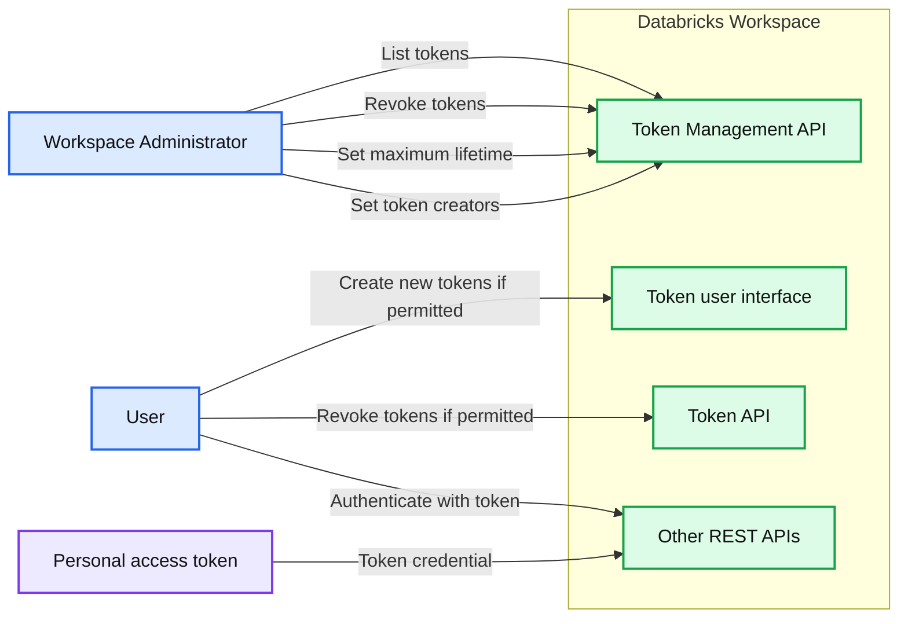
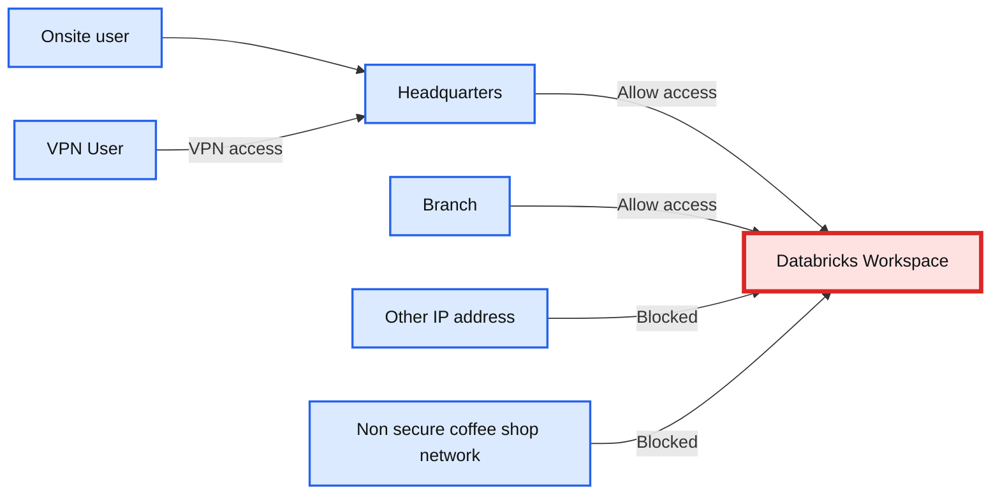

# Automate Azure Databricks Data + AI Platform Provisioning and Configuration

*Learn details of how you could automate Azure Databricks platform deployment and configuration in an automated way.*

- Source: https://www.databricks.com/blog/2020/09/16/automate-azure-databricks-platform-provisioning-and-configuration.html
- Published: 2020-09-16
- Authors: Anna Shrestinian, Abhinav Garg, Bhavin Kukadia
- Categories: engineering, tutorials
- Images: 20 total, 2 extracted as architecture

Table of Contents Introduction
Automation options
Common workflow
Pre-Requisites
Create Azure Resource Group and Virtual Network
Provision Azure Application / Service Principal
Assign Role to Service Principal
Configure Postman Environment
Provision Azure Databricks Workspace
Generate AAD Access Token
Deploy Workspace using the ARM template
Get workspace URL
Generate Access Token for Auth
Generate AAD Access Token For Azure Databricks API Interaction
Generate Azure Databricks Data + AI Platform Token
Users and Groups Management
Provision users and groups using SCIM API
Manage PAT using Token Management API
Cluster Policies
Cluster Permissions
Common use cases
IP Access List
Troubleshooting
Expired token
Rate Limits

## Introduction

In our [previous](https://www.databricks.com/blog/2020/03/16/productionize-and-automate.html) blog, we discussed the practical challenges related to scaling out a data platform across multiple teams and how lack of automation adversely affects innovation and slows down go-to-market. Enterprises need consistent and scalable solutions that could utilize repeatable templates to seamlessly comply with enterprise governance policies, with a goal to bootstrap unified data analytics  environments across data teams. With Microsoft Azure Databricks, we've taken a API-first approach for all objects that enables quick provisioning & bootstrapping of cloud computing data environments, by integrating into existing Enterprise DevOps tooling without requiring customers to reinvent the wheel. In this article, we will walk through such a cloud deployment automation process using different Azure Databricks APIs.

The process for configuring an Azure Databricks data environment looks like the following:

1. Deploy Azure Databricks Workspace
2. Provision users and groups
3. Create clusters policies and clusters
4. Add permissions for users and groups
5. Secure access to workspace within corporate network (IP Access List)
6. Platform access token management

To accomplish the above, we will be using APIs for the following IaaS features or capabilities available as part of Azure Databricks:

1. [Token Management API](https://docs.microsoft.com/en-us/azure/databricks/release-notes/product/2020/july#take-control-of-your-users-personal-access-tokens-with-the-token-management-api-public-preview) allows admins to manage their users' cloud service provider personal access tokens (PAT), including:
  1. Monitor and revoke users' personal access tokens.
  2. Control the lifetime of future tokens in your public cloud workspace.
  3. Control which users can create and use PATs.
2. [AAD Token Support](https://docs.microsoft.com/en-us/azure/databricks/release-notes/product/2020/july#azure-active-directory-tokens-to-authorize-to-the-databricks-rest-api-ga) allows the use of AAD tokens to invoke the Azure Databricks APIs. One could also use Service Principals as first-class identities.
3. [IP Access Lists](https://docs.microsoft.com/en-us/azure/databricks/security/network/ip-access-list)ensure that users can only connect to Azure Databricks through privileged networks thus forming a secure perimeter.
4. [Cluster policies](https://docs.microsoft.com/en-us/azure/databricks/dev-tools/api/latest/policies) is a construct that allows simplification of cluster management across workspace users, where admins could also enforce different security & cost control measures.
5. [Permissions API](https://docs.microsoft.com/en-us/azure/databricks/dev-tools/api/latest/permissions) allows automation to set access control on different Azure Databricks objects like Clusters, Jobs, Pools, Notebooks, Models etc.

## Automation options

There are a few options available to use the Azure Databricks APIs:

- [Databricks Terraform Resource Provider](https://github.com/databrickslabs/terraform-provider-databricks) could be combined with Azure provider to create an end-to-end architecture, utilizing Terraform's dependency and state management features.
- Python (or any other programming language) could be used to invoke the APIs ([sample solution](https://github.com/abhinavg6/azuredb-workspace-provisioner)) providing a way to integrate with third-party or homegrown DevOps tooling.
- A readymade API client like [Postman](https://www.postman.com/) could be used to invoke the API directly.

To keep things simple, we'll use the Postman approach below.

## Common workflow

1. Use a Azure AD Service Principal to create a Azure Databricks workspace.
2. Use the service principal identity to set up ***IP Access Lists*** to ensure that the workspace can only be accessed from privileged networks.
3. Use the service principal identity to set up ***cluster policies*** to simplify the cluster creation workflow. Admins can define a set of policies that could be assigned to specific users or groups.
4. Use the service principal identity to provision users and groups using [SCIM API](https://docs.microsoft.com/en-us/azure/databricks/dev-tools/api/latest/scim/)(alternative to [SCIM provisioning from AAD](https://docs.microsoft.com/en-us/azure/databricks/administration-guide/users-groups/scim/aad))
5. Use the service principal identity to limit user personal access token (PAT) permissions using ***token management*** API
6. All users (non-service principal identities) will use Azure AD tokens to connect to workspace APIs. This ensures conditional access (and MFA) is always enforced.

## Pre-Requisites

### Create Azure Resource Group and Virtual Network

Please go ahead and pre-create an Azure [resource group](https://docs.microsoft.com/en-us/azure/azure-resource-manager/management/overview). We will be deploying Azure Databricks workspace in a customer managed virtual network (VNET). VNET pre-creation is optional. Please refer to this [guide](https://docs.microsoft.com/en-us/azure/databricks/administration-guide/cloud-configurations/azure/vnet-inject#--virtual-network-requirements) to understand VNET requirements.

### Provision Azure Application / Service Principal

We will be using an Azure Service Principal to automate the deployment process, using [this](https://docs.microsoft.com/en-us/azure/active-directory/develop/app-objects-and-service-principals) guide please create a service principal. Please generate a new client secret and make sure to note down the following details:

- Client Id
- Client Secret (secret generated for the service principal)
- Azure Subscription Id
- Azure Tenant Id

### Assign Role to Service Principal

Navigate to Azure Resource Group where you plan to deploy Azure Databricks workspace and add the "Contributor" role to your service principal.

### Configure Postman Environment

We will be using the Azure Databricks ARM REST API option to provision a workspace. This is not to be confused with the REST API for different objects within a workspace.

Download postman collection from here.

The collection consists of several sections

Environment config file is already imported into postman, please go ahead and edit it by clicking on the "gear" button.

Configure environment as per your settings

| **Variable Name** | **Value** | **Description** |
|---|---|---|
| **Azure subscription details** |  |  |
| **tenantId** | Azure Tenant ID | Locate it here |
| **subscriptionId** | Azure Subscription ID | Locate it here |
| **clientCredential** | Service Principal Secret |  |
| **clientId** | Service Principal ID |  |
| **resourceGroup** | Resource group name | User defined resource group |
| **Constant's used** |  |  |
| **managementResource** | https://management.core.windows.net/ | **Constant**, more details here |
| **databricksResourceId** | 2ff814a6-3304-4ab8-85cb-cd0e6f879c1d | **Constant, unique applicationId that identifies Azure Databricks workspace resource inside azure** |

| **Azure Databricks deployment via ARM template specific variables** |  |  |
|---|---|---|
| **workspaceName** | Ex: **adb-dev-workspace** | unique name given to the Azure Databricks workspace |
| **VNETCidr** | Ex: **11.139.13.0/24** | More details here |
| **VNETName** | Ex: **adb-VNET** | unique name given to the VNET where ADB is deployed, if a VNET exists we will use it, otherwise it will create a new one. |
| **publicSubnetName** | Ex: **adb-dev-pub-sub** | unique name given to the subnet within the VNET where Azure Databricks is deployed. **We highly recommend that you let ARM template create this subnet** rather than you pre creating it. |
| **publicSubnetCidr** | Ex: **11.139.13.64/26** | More details here |
| **privateSubnetName** | Ex: **adb-dev-pvt-sub** | unique name given to the subnet within the VNET where ADB is deployed. **We highly recommend that you let ARM template create this subnet** rather than you pre creating it. |
| **privateSubnetCidr** | Ex: **11.139.13.128/26** | More details here |
| **nsgName** | Ex: **adb-dev-workspace-nsg** | Network Security Group attached to Azure Databricks subnets. |
| **pricingTier** | **premium** | Options available **premium** or **standard** , more details here, IP-Access-List feature requires premium tier |
| **workspace tags** |  |  |
| **tag1** | **Ex: dept101 ** | Demonstrating how to set tags on Azure Databricks workspace |

## Provision Azure Databricks Workspace

### Generate AAD Access Token

We will be using Azure AD access token to deploy the workspace, utilizing the [OAuth Client Credential](https://docs.microsoft.com/en-us/azure/active-directory/develop/v2-oauth2-client-creds-grant-flow) workflow, which is also referred to as two-legged OAuth to access web-hosted resources by using the identity of an application. This type of grant is commonly used for server-to-server interactions that must run in the background, without immediate interaction with a user.

Executing ***aad token for management resource*** API returns AAD access token which will be used to deploy the Azure Databricks workspace, and to retrieve the deployment status. Access token is valid for ***599 seconds*** by default, if you run into token expiry issues then please go ahead and rerun this API call to regenerate access token.

### Deploy Workspace using the ARM template

[ARM templates](https://docs.microsoft.com/en-us/azure/databricks/administration-guide/cloud-configurations/azure/vnet-inject#advanced-configuration-using-arm-templates) are utilized in order to deploy Azure Databricks workspace. ARM template is used as a request body payload in step ***provision databricks workspace*** inside ***Provisioning Workspace*** section as highlighted  above.

If subnets specified in the ARM template exist then we will use those otherwise those will be created for you. Azure Databricks workspace will be deployed within your [VNET](https://docs.microsoft.com/en-us/azure/databricks/administration-guide/cloud-configurations/azure/vnet-inject), and a default [Network Security Group](https://docs.microsoft.com/en-us/azure/databricks/administration-guide/cloud-configurations/azure/vnet-inject#nsg) will be created and attached to subnets used by the workspace.

### Get workspace URL

Workspace deployment takes approximately 5-8 minutes. Executing **"get deployment status and workspace url"** call returns workspace URL which we'll use in subsequent calls.

We set a global variable called ***"workspaceUrl"*** inside the test step to extract value from the response. We use this global variable in subsequent API calls.

***A note on using Azure Service Principal as an identity in Azure Databricks***

Please note that Azure Service Principal is considered a first class identity in Azure Databricks and as such can invoke all of the API's. One thing that sets them apart from user identities is that service principals do not have access to the web application UI i.e. they cannot log into the workspace web application and perform UI functions they way a typical user like you and me would perform. Service principals are primarily used to invoke API in a headless fashion.

## Generate Access Token for Auth

To [authenticate](https://docs.microsoft.com/en-us/azure/databricks/dev-tools/api/latest/authentication) and access Azure Databricks REST APIs, we can use of the following:

- [AAD access token](https://docs.microsoft.com/en-us/azure/databricks/dev-tools/api/latest/aad/service-prin-aad-token#--get-an-azure-active-directory-access-token) generated for the service principal
  - Access token is managed by Azure AD
  - Default expiry is 599 seconds
- [Azure Databricks Personal Access Token](https://docs.microsoft.com/en-us/azure/databricks/dev-tools/api/latest/authentication#--generate-a-personal-access-token) generated for the service principal
  - Platform access token is managed by Azure Databricks
  - Default expiry is set by the user, usually in days or months

In this section we demonstrate usage of both of these tokens

### Generate AAD Access Token For Azure Databricks API Interaction

To generate AAD token for the service principal we'll use the [client credentials flow](https://docs.microsoft.com/en-us/azure/active-directory/azuread-dev/v1-oauth2-client-creds-grant-flow) for the AzureDatabricks login application resource which is uniquely identified using the object resource id ***2ff814a6-3304-4ab8-85cb-cd0e6f879c1d***.

Response contains an AAD access token. We'll set up a global variable ***"access_token***" by extracting  this value.

Please note that the AAD access token generated is a bit different from the one that we have generated earlier to create the workspace, AAD token for workspace deployment is generated for the ***Azure management resource*** where as AAD access token to interact with API is for Azure Databricks Workspace resource.

### Generate Azure Databricks Data + AI Platform Token

To generate Azure Databricks platform access token for the service principal we'll use ***access_token*** generated in the last step for authentication.

Executing ***generate databricks platform token for service principal*** returns platform access token, we then set a global environment variable called ***sp_pat*** based on this value. To keep things simple we will be using sp_pat for authentication for the rest of the API calls.

## Users and Groups Management

The [SCIM API](https://docs.microsoft.com/en-us/azure/databricks/dev-tools/api/latest/scim/) allows you to manage

- Users (individual identities)
- Azure Service Principals
- Groups of users and/or service principal

### Provision users and groups using SCIM API

Azure Databricks supports SCIM or System for Cross-domain Identity Management, an open standard that allows you to automate user provisioning using a REST API and JSON. The Azure Databricks SCIM API follows version 2.0 of the SCIM protocol.

- An Azure Databricks administrator can invoke all `SCIM API` endpoints.
- Non-admin users can invoke the Me Get endpoint, the `Users Get` endpoint to read user display names and IDs, and the Group Get endpoint to read group display names and IDs.

Please note that Azure Service Principal is considered a first class identity in Azure Databricks and as such can invoke all of the API's. One thing that sets them apart from user identities is that service principals do not have access to the web application UI i.e. they cannot log into the workspace web application and perform UI functions they way a typical user like you and me would perform. Service principals are primarily used to invoke API in a headless fashion.

### Manage PAT using Token Management API

[Token Management](https://docs.microsoft.com/en-us/azure/databricks/dev-tools/api/latest/tokens) provides Azure Databricks administrators with more insight and control over Personal Access Tokens in their workspaces. Please note that this does not apply to AAD tokens as they are managed within Azure AD.

By monitoring and controlling token creation, you reduce the risk of lost tokens or long-lasting tokens that could lead to data exfiltration from the workspace.

**Summary:** The diagram shows Azure Databricks token creation, administration, revocation, and authentication flows within a workspace.

**Components:**

- Workspace Administrator using Azure Databricks administration controls
- Databricks Workspace containing token management services
- Token Management API for workspace token governance
- Token user interface for creating tokens
- Token API for token revocation
- Other REST APIs for authenticated workspace operations
- User using a personal access token

**Flows:**

- Workspace Administrator -> Token Management API: List tokens
- Workspace Administrator -> Token Management API: Revoke tokens
- Workspace Administrator -> Token Management API: Set maximum lifetime for new tokens
- Workspace Administrator -> Token Management API: Set who can create tokens
- User -> Token user interface: Create new tokens if permitted
- User -> Token API: Revoke tokens if permitted
- User -> Other REST APIs: Use token to authenticate with REST APIs

**Numbers:** none

source image: https://www.databricks.com/wp-content/uploads/2020/09/blog-automate-azure-15.png

## Cluster Policies

A [cluster policy](https://docs.microsoft.com/en-us/azure/databricks/administration-guide/clusters/policies) limits the ability to create clusters based on a set of rules. A policy defines those rules as limitations on the attributes used for the cluster creation. Cluster policies define ACLs to limit their use to specific users and and groups. For more details please refer to our [blog](https://www.databricks.com/blog/2020/07/02/allow-simple-cluster-creation-with-full-admin-control-using-cluster-policies.html) on cluster policies.

Only admin users can create, edit, and delete policies. Admin users also have access to all policies.

### Cluster Permissions

Clusters Permission API allows permissions for users and groups on clusters (both interactive and job clusters). The same process could be used for Jobs, Pools, Notebooks, Folders, Model Registry and Tokens.

### Common use cases

- Clusters are created based on the policies and admins would like to give a user or a group permission to view cluster logs or job output.
- Assigning "Can Attach" permissions for users to jobs submitted through a centralized [orchestration](https://www.databricks.com/glossary/orchestration) mechanism, so they could view the Job's Spark UI and Logs. This can be achieved today for jobs created through jobs/create endpoints and run via run/now or scheduled runs. The centralized automation service can retrieve the cluster_id when the job is run and set permission on it
- Permission Levels have been augmented to include permissions for all the supported objects i.e. Jobs, Pools, Notebooks, Folders, Model Registry and Tokens.

## IP Access List

You may have a security policy which mandates that all access to Azure Databricks workspaces goes through your network and web application proxy. Configuring IP Access Lists ensure that employees have to connect via corporate VPN before accessing a workspace.

**Summary:** IP Access Lists allow Azure Databricks workspace access from headquarters and branch networks while blocking other and non-secure networks.

**Components:**

- Onsite user using the corporate network
- Headquarters network using corporate VPN access
- VPN user using a corporate VPN
- Branch network using an allowed IP range
- Databricks Workspace using Azure Databricks
- Other IP address using an unlisted network
- Non-secure coffee shop network using public Wi-Fi

**Flows:**

- VPN User -> Headquarters: VPN access
- Headquarters -> Databricks Workspace: Allow access
- Branch -> Databricks Workspace: Allow access
- Other IP address -> Databricks Workspace: Blocked access
- Non-secure coffee shop network -> Databricks Workspace: Blocked access

**Numbers:** 72.30.99.4, 98.138.23.1, 76.12.1.1/3, adb-34xxxxxxxx1.1.azuredatabricks.net, 23.185.2.1

source image: https://www.databricks.com/wp-content/uploads/2020/09/blog-automate-azure-19.png

This feature provides Azure Databricks admins a way to set a `allowlist` and `blocklist` for `CIDR / IPs` that could access a workspace.

Azure Databricks platform APIs not only enable data teams to provision and secure enterprise grade data platforms but also help automate some of the most mundane but crucial tasks from user onboarding to setting up secure perimeter around these platforms.

As the unified data analytics platform is scaled across data teams, challenges in terms of workspace provisioning, resource configuration, overall management and compliance with enterprise governance multiply for the admins. End-to-End automation is a highly recommended best practice to address any such concerns and have better repeatability & reproducibility across the board.

We want to make workspace administration super simple, so that you get to do more and focus on solving some of the world's toughest data challenges.

## Troubleshooting

### Expired token

 

 

Please rerun step *** generate aad token for management resource ***to regenerate management access token. Token has a time to live of 599 seconds.

### Rate Limits

The Azure Databricks REST API supports a maximum of 30 requests/second per workspace. Requests that exceed the rate limit will receive a [429 response status code](https://developer.mozilla.org/en-US/docs/Web/HTTP/Status/429).

Common Token Issues are listed over [here](https://docs.microsoft.com/en-us/azure/databricks/dev-tools/api/latest/aad/troubleshoot-aad-token) along with mitigation
