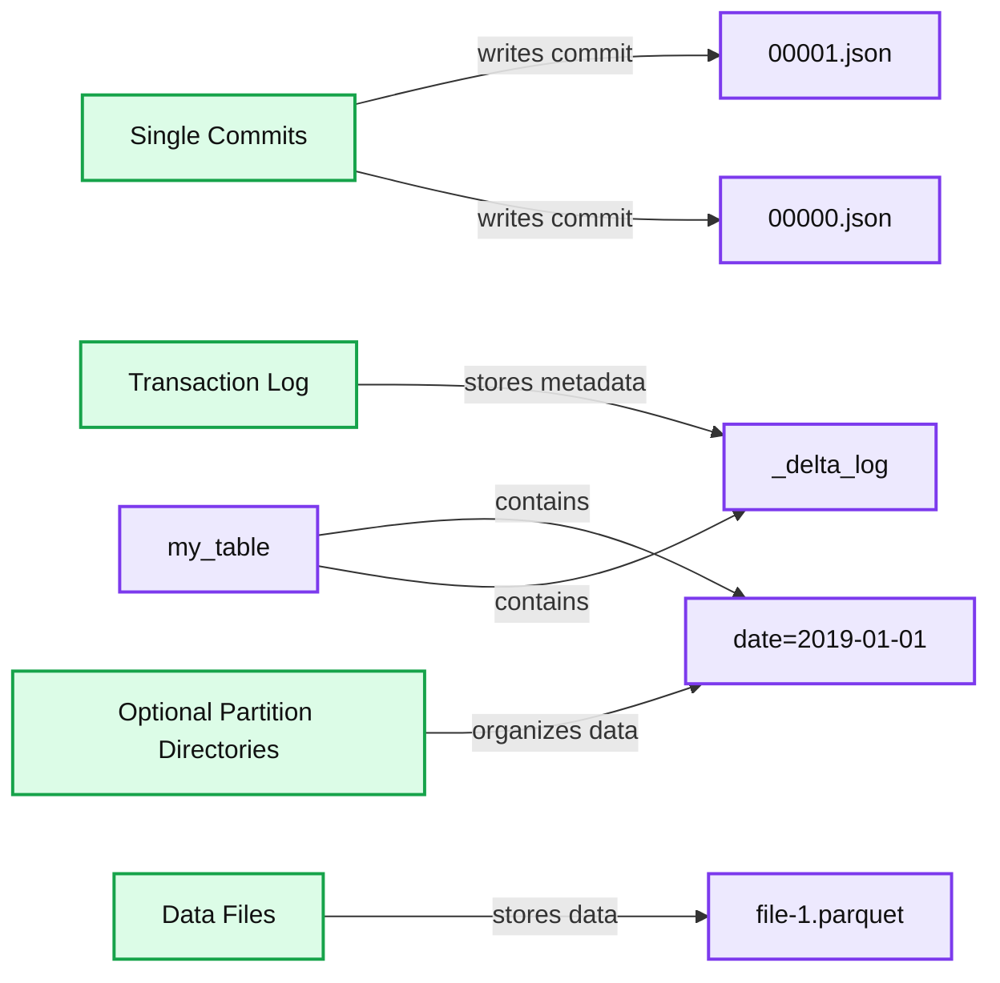
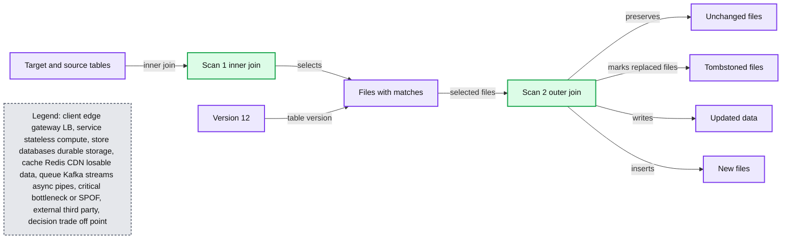

# Diving Into Delta Lake: DML Internals (Update, Delete, Merge)

- Source: https://www.databricks.com/blog/2020/09/29/diving-into-delta-lake-dml-internals-update-delete-merge.html
- Published: 2020-09-29
- Authors: Tathagata Das, Brenner Heintz
- Categories: engineering, open-source
- Images: 3 total, 2 extracted as architecture

In previous blogs [Diving Into Delta Lake: Unpacking The Transaction Log](https://www.databricks.com/blog/2019/08/21/diving-into-delta-lake-unpacking-the-transaction-log.html) and [Diving Into Delta Lake: Schema Enforcement & Evolution](https://www.databricks.com/blog/2019/09/24/diving-into-delta-lake-schema-enforcement-evolution.html), we described how the Delta Lake transaction log works and the internals of schema enforcement and evolution.  Delta Lake supports DML (data manipulation language) commands including `DELETE`, `UPDATE`, and `MERGE`. These commands simplify change data capture (CDC), audit and governance, and GDPR/CCPA workflows, among others. In this post, we will demonstrate how to use each of these DML commands, describe what Delta Lake is doing behind the scenes when you run one, and offer some performance tuning tips for each one.  More specifically:

- A quick primer on the Delta Lake ACID Transaction Log
- Understand the fundamentals when running DELETE, UPDATE, and MERGE
- Understand the actions performed when performing these tasks
- Understand the basics of partition pruning in Delta Lake
- How do streaming queries work within Delta Lake

If you prefer watching this information, you can also review the [Diving into Delta Lake Part 3: How do DELETE, UPDATE, and MERGE work](https://www.youtube.com/watch?v=7ewmcdrylsA) tech talk.

 Get an early preview of [O'Reilly's new ebook](https://www.databricks.com/resources/ebook/delta-lake-running-oreilly?itm_data=divingdelta-textpromo-oreillydlupandrunning) for the step-by-step guidance you need to start using Delta Lake.

## Delta Lake: Basic Mechanics

>  If you would like to know more about the basic mechanics of Delta Lake, please expand the following section.

**Click to expand**

 

First, let's do a quick review of how a Delta Lake table is structured at the file level. When you create a new table, Delta saves your data as a series of Parquet files and also creates the `_delta_log`  folder, which contains the Delta Lake transaction log. The ACID transaction log serves as a master record of every change (known as a transaction) ever made to your table. As you modify your table (by adding new data, or performing an update, merge, or delete, for example), Delta Lake saves a record of each new transaction as a numbered JSON file in the `delta_log` folder starting with `00...00000.json` and counting up. Every 10 transactions, Delta also generates a "checkpoint" Parquet file within the same folder, that allows the reader to quickly recreate the state of the table.

**Summary:** Delta Lake stores table data in Parquet files and records each single commit in numbered JSON files within the transaction log.

**Components:**

- Transaction Log: Delta Lake transaction metadata
- Single Commits: Individual table changes
- Optional Partition Directories: Partitioned storage paths
- Data Files: Parquet data storage
- my_table: Delta Lake table directory
- _delta_log: Transaction log directory
- 00000.json: JSON commit file
- 00001.json: JSON commit file
- date=2019-01-01: Partition directory
- file-1.parquet: Parquet data file

**Flows:**

- Transaction Log -> _delta_log: stores transaction metadata
- Single Commits -> 00000.json: writes a numbered JSON commit
- Single Commits -> 00001.json: writes a numbered JSON commit
- Optional Partition Directories -> date=2019-01-01: organizes data by partition
- Data Files -> file-1.parquet: stores table data
- my_table -> _delta_log: contains the transaction log
- my_table -> date=2019-01-01: contains partition directories

**Numbers:** 00000, 00001, 2019-01-01, 1

source image: https://www.databricks.com/wp-content/uploads/2020/09/blog-diving-delta-2.png

Ultimately, when you query a Delta Lake table, a supported reader refers to the transaction log to quickly determine which data files make up the most current version of the table.  Instead of listing files from your cloud object stores, the paths of the exact files needed are provided significantly improving query performance.   With DML operations, like the ones we'll discuss in this post, Delta Lake creates new versions of files rather than modifying them in place — and uses the transaction log to keep track of it all.  Learn more by reading the previous article in this series, [Diving Into Delta Lake: Unpacking The Transaction Log](https://www.databricks.com/blog/2019/08/21/diving-into-delta-lake-unpacking-the-transaction-log.html).

Now that you have a basic understanding of how Delta Lake works at the file system level, let's dive into how to use DML commands on Delta Lake, and how each operation works under the hood.  The following examples will use the SQL syntax as part of Delta Lake 0.7.0 and Apache Spark 3.0; for more information, refer to [Enabling Spark SQL DDL and DML in Delta Lake on Apache Spark 3.0](https://www.databricks.com/blog/2020/08/27/enabling-spark-sql-ddl-and-dml-in-delta-lake-on-apache-spark-3-0.html).

## Delta Lake DML: UPDATE

You can use the `UPDATE` operation to selectively update any rows that match a filtering condition, also known as a **predicate.** The code below demonstrates how to use each type of predicate as part of an `UPDATE` statement.

### UPDATE: Under the hood

Delta Lake performs an `UPDATE` on a table in two steps:

1. Find and select the files containing data that match the predicate, and therefore need to be updated. Delta Lake uses [data skipping](https://docs.databricks.com/delta/optimizations/file-mgmt.html#data-skipping) whenever possible to speed up this process.
2. Read each matching file into memory, update the relevant rows, and write out the result into a new data file.

Once Delta Lake has executed the `UPDATE` successfully, it adds a commit in the transaction log indicating that the new data file will be used in place of the old one from now on. The old data file is not deleted, though. Instead, it's simply "tombstoned" — recorded as a data file that applied to an older version of the table, but not the current version. Delta Lake is able to use it to provide data versioning and time travel.

### UPDATE + Delta Lake time travel = Easy debugging

Keeping the old data files turns out to be very useful for debugging because you can use Delta Lake "time travel" to go back and query previous versions of a table at any time. In the event that you update your table incorrectly and want to figure out what happened, you can easily compare two versions of a table to one another.

### UPDATE: Performance tuning tips

The main way to improve the performance of the `UPDATE` command on Delta Lake is to add more predicates to narrow down the search space. The more specific the search, the fewer files Delta Lake needs to scan and/or modify.

The Databricks managed version of Delta Lake features other performance enhancements like improved [data skipping](https://docs.databricks.com/delta/optimizations/file-mgmt.html#data-skipping), the use of bloom filters, and [Z-Order Optimize](https://docs.databricks.com/delta/optimizations/file-mgmt.html#z-ordering-multi-dimensional-clustering) (multi-dimensional clustering), which is like an improved version of multi-column sorting. Z-ordering reorganizes the layout of each data file so that similar column values are strategically colocated near one another for maximum efficiency. [Read more about Z-Order Optimize on Databricks](https://docs.databricks.com/delta/optimizations/file-mgmt.html#z-ordering-multi-dimensional-clustering).

## Delta Lake DML: DELETE

You can use the `DELETE` command to selectively delete rows based upon a predicate (filtering condition).

### DELETE: Under the hood

`DELETE` works just like `UPDATE` under the hood. Delta Lake makes two scans of the data: the first scan is to identify any data files that contain rows matching the predicate condition. The second scan reads the matching data files into memory, at which point Delta Lake deletes the rows in question before writing out the newly clean data to disk.

After Delta Lake completes a `DELETE` operation successfully, the old data files are not deleted — they're still retained on disk, but recorded as "tombstoned" (no longer part of the active table) in the Delta Lake transaction log. Remember, those old files aren't deleted immediately because you might still need them to time travel back to an earlier version of the table. If you want to delete files older than a certain time period, you can use the `VACUUM` command.

### DELETE + VACUUM: Cleaning up old data files

Running the `VACUUM` command permanently deletes all data files that are:

1. no longer part of the active table, and
2. older than the retention threshold, which is seven days by default.

Delta Lake does not automatically `VACUUM` old files — you must run the command yourself, as shown below. If you want to specify a retention period that is different from the default of seven days, you can provide it as a parameter.

>  Caution: Running VACUUM with a retention period of 0 hours will delete all files that are not used in the most recent version of the table. Make sure that you do not run this command while there are active writes to the table in progress, as data loss may occur.

For more information about the `VACUUM` command, as well as examples of it in Scala and SQL, take a look at the [documentation for the VACUUM command](https://docs.delta.io/latest/delta-utility.html#-delta-vacuum).

### DELETE: Performance tuning tips

Just like with the `UPDATE` command, the main way to improve the performance of a `DELETE` operation on Delta Lake is to add more predicates to narrow down the search space. The Databricks managed version of Delta Lake also features other performance enhancements like improved [data skipping](https://docs.databricks.com/delta/optimizations/file-mgmt.html#data-skipping), the use of bloom filters, and [Z-Order Optimize](https://docs.databricks.com/delta/optimizations/file-mgmt.html#z-ordering-multi-dimensional-clustering) (multi-dimensional clustering), as well. [Read more about Z-Order Optimize on Databricks](https://docs.databricks.com/delta/optimizations/file-mgmt.html#z-ordering-multi-dimensional-clustering).

## Delta Lake DML: MERGE

The Delta Lake `MERGE` command allows you to perform "upserts", which are a mix of an `UPDATE` and an `INSERT`. To understand upserts, imagine that you have an existing table (a.k.a. a *target table*), and a *source table* that contains a mix of new records and updates to existing records. Here's how an upsert works:

- When a record from the source table **matches a preexisting record** in the target table, Delta Lake **updates** the record.
- When there is **no such match**, Delta Lake **inserts** the new record.

The Delta Lake `MERGE` command greatly simplifies workflows that can be complex and cumbersome with other traditional data formats like Parquet. Common scenarios where merges/upserts come in handy include change data capture, GDPR/CCPA compliance, sessionization, and deduplication of records. For more information about upserts, read the blog posts [Efficient Upserts into Data Lakes with Databricks Delta](https://www.databricks.com/blog/2019/03/19/efficient-upserts-into-data-lakes-databricks-delta.html), [Simple, Reliable Upserts and Deletes on Delta Lake Tables using Python API](https://www.databricks.com/blog/2019/10/03/simple-reliable-upserts-and-deletes-on-delta-lake-tables-using-python-apis.html),  and [Schema Evolution in Merge Operations and Operational Metrics in Delta Lake](https://www.databricks.com/blog/2020/05/19/schema-evolution-in-merge-operations-and-operational-metrics-in-delta-lake.html).

For more in-depth information about the `MERGE` programmatic operation, including the use of conditions with the `whenMatched` clause, visit the documentation.

### MERGE: Under the hood

Delta Lake completes a `MERGE` in two steps.

1. Perform an **inner join** between the target table and source table to select all files that have matches.
2. Perform an **outer join** between the selected files in the target and source tables and write out the updated/deleted/inserted data.

**Summary:** The diagram shows Delta Lake MERGE processing in two scans, first selecting matching files with an inner join, then writing changed data with an outer join.

**Components:**

- Target and source tables
- Scan 1 inner join
- Files with matches
- Scan 2 outer join
- Unchanged files
- Tombstoned files
- Updated data
- New files
- Version 12

**Flows:**

- Target and source tables -> Scan 1 inner join: inner join selects matching files
- Scan 1 inner join -> Files with matches: matched files
- Files with matches -> Scan 2 outer join: selected target and source files
- Scan 2 outer join -> Unchanged files: preserves unchanged data
- Scan 2 outer join -> Tombstoned files: marks replaced files
- Scan 2 outer join -> Updated data: writes updated data
- Scan 2 outer join -> New files: writes inserted data
- Version 12 -> Files with matches: identifies the table version

**Numbers:** 1, 2, v12

source image: https://www.databricks.com/wp-content/uploads/2020/09/blog-diving-delta-4.png

The main way that this differs from an `UPDATE` or a `DELETE` under the hood is that Delta Lake uses *joins* to complete a `MERGE`. This fact allows us to utilize some unique strategies when seeking to improve performance.

### MERGE: Performance tuning tips

To improve performance of the `MERGE` command, you need to determine which of the two joins that make up the merge is limiting your speed.

If the **inner join** is the bottleneck (i.e., *finding* the files that Delta Lake needs to rewrite takes too long), try the following strategies:

-
  - Add more predicates to narrow down the search space.
  - Adjust shuffle partitions.
  - Adjust broadcast join thresholds.
  - Compact the small files in the table if there are lots of them, but don't compact them into files that are *too* large, since Delta Lake has to copy the entire file to rewrite it.

>  On Databricks’ managed Delta Lake, use Z-Order optimize to exploit the locality of updates.

On the other hand, if the **outer join** is the bottleneck (i.e. rewriting the actual files themselves takes too long), try the strategies below:

- Adjust shuffle partitions.
  - Can generate too many small files for partitioned tables.
  - Reduce files by enabling automatic repartitioning before writes (with *Optimized Writes* in *Databricks Delta Lake*)
- Adjust broadcast thresholds. If you're doing a *full* outer join, Spark cannot do a broadcast join, but if you're doing a *right* outer join, Spark can do one, and you can adjust the broadcast thresholds as needed.
- Cache the source table / DataFrame.
  - Caching the *source table* can speed up the second scan, but be sure not to cache the *target table*, as this can lead to cache coherency issues.

## Summary

Delta Lake supports DML commands including `UPDATE`, `DELETE`, and `MERGE INTO`, which greatly simplify the workflow for many common big data operations. In this article, we demonstrated how to use these commands in Delta Lake, shared information about how each one works under the hood, and offered some performance tuning tips.

**Interested in the open source Delta Lake?**
[Visit the Delta Lake online hub](https://delta.io?utm_source=delta-blog) to learn more, download the latest code and join the Delta Lake community.

## Related

Articles in this series:
[**Diving Into Delta Lake #1:** Unpacking the Transaction Log](https://www.databricks.com/blog/2019/08/21/diving-into-delta-lake-unpacking-the-transaction-log.html)
[**Diving Into Delta Lake #2:** Schema Enforcement & Evolution](https://www.databricks.com/blog/2019/09/24/diving-into-delta-lake-schema-enforcement-evolution.html)
[**Diving Into Delta Lake #3:** DML Internals (Update, Delete, Merge)](https://www.youtube.com/watch?v=7ewmcdrylsA)

Other resources:
[Delta Lake Quickstart](https://docs.delta.io/latest/quick-start.html)
[Databricks documentation on UPDATE, MERGE, and DELETE](https://docs.databricks.com/delta/delta-update.html)
[Simple, Reliable Upserts and Deletes on Delta Lake Tables using Python APIs](https://www.databricks.com/blog/2019/10/03/simple-reliable-upserts-and-deletes-on-delta-lake-tables-using-python-apis.html)
