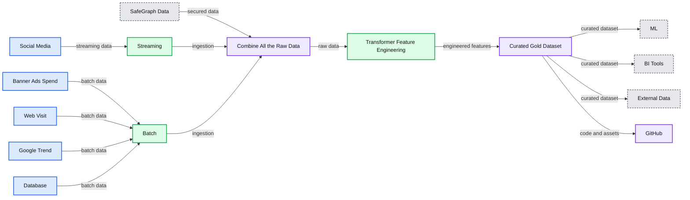
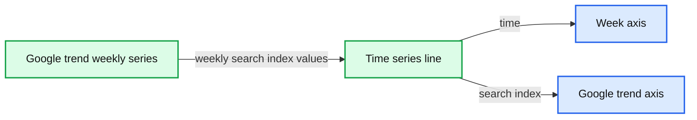
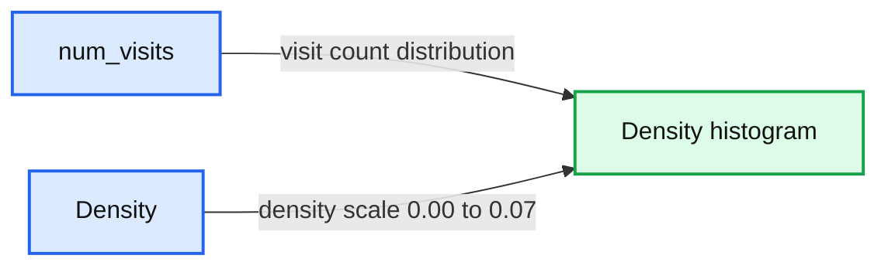
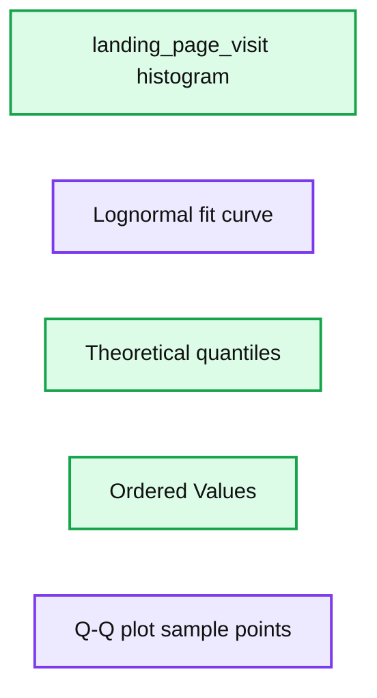
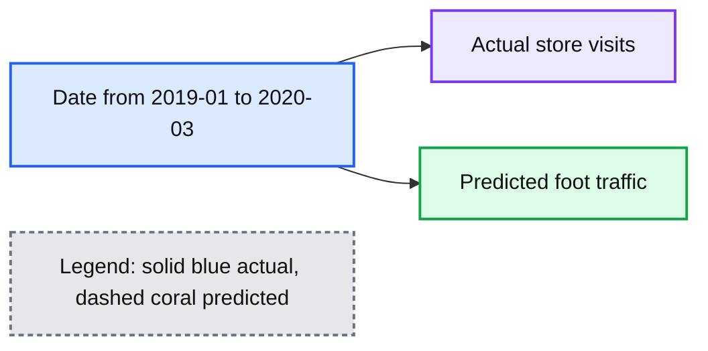
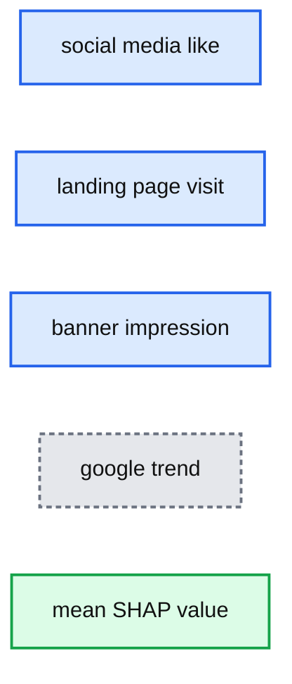
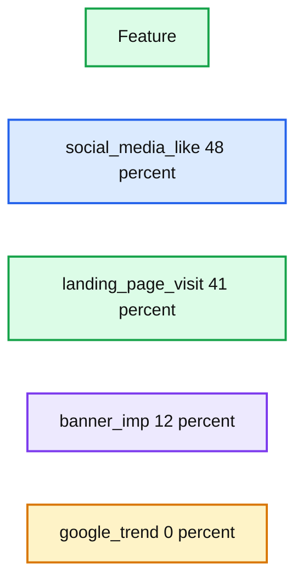

# Measuring Advertising Effectiveness with Sales Forecasting and Attribution

- Source: https://www.databricks.com/blog/2020/10/05/measuring-advertising-effectiveness-with-sales-forecasting-and-attributing.html
- Published: 2020-10-05
- Authors: Layla Yang, Hector Leano
- Categories: engineering, solution-accelerators, data-science-machine-learning
- Images: 11 total, 11 extracted as architecture

>  [Download the notebooks and watch the webinar for this solution accelerator](https://www.databricks.com/solutions/accelerators/sales-forecasting)

How do you connect the impact of marketing and your ad spend toward driving sales? As the advertising landscape continues to evolve, advertisers are finding it increasingly challenging to efficiently pinpoint the impact of various revenue-generating marketing activities within their media mix.

Brands spend billions of dollars annually promoting their products at retail. This marketing  spend is planned 3 to 6 months in advance and is used to drive promotional tactics to raise awareness, generate trials, and increase the consumption of the brand’s product and services. This entire model is being disrupted with COVID. Consumer behaviors are changing rapidly, and brands no longer have the luxury of planning promotional spend months in advance. Brands need to make decisions in weeks and days, or even in near real-time. As a result, brands are shifting budgets to more agile channels such as digital ads and promotions.

Making this change is not easy for brands. Digital tactics hold the promise of increased personalization by the delivering the message most likely to resonate with the individual consumer. Traditional statistical analysis and media planning tools however, have been built around long lead times using aggregate data, which makes it harder to optimize messaging at the segment or individual level. Marketing or Media Mix Modeling (MMM) is commonly used to understand the impact of different marketing tactics in relation to other tactics, and determine optimal levels of spend for future initiatives, but MMM is a highly manual, time-intensive and backwards-looking exercise due to the challenges of integrating a wide range of data sets of different levels of aggregation.

Your print and TV advertising agency might send a biweekly excel spreadsheet providing impressions at a Designated Market Area (DMA) level; digital agencies might provide CSV files showing clicks and impressions at the zip-code level; your sales data may be received at a market level; and search and social each have their own proprietary reports via APIs slicing up audiences by a variety of factors. Compounding this challenge is that as brands shift to digital media and more agile methods of advertising, they increase the number of disparate data sets that need to be quickly incorporated and analyzed. As a result, most marketers conduct MMM exercises *at most *once a quarter (and most often just once a year) since rationalizing and overlaying these different data sources is a process that can take several weeks or months.

While MMM is useful for broader level marketing investment decisions, brands need the ability to quickly make decisions at a finer level. They need to integrate new marketing data, perform analysis, and accelerate decision making from months or weeks to days or hours. Brands that can respond to programs that are working in real time will see significantly higher return on investment as a result of their efforts.

## Introducing the Sales Forecasting & Advertising Attribution Dashboard Solution Accelerator

#### Based on best-practices from our work with the leading brands, we’ve developed solution accelerators for common analytics and machine learning use cases to save weeks or months of development time for your data engineers and data scientists.

Whether you’re an ad agency or an in-house marketing analytics team, this solution accelerator allows you to easily plug in sales, ad engagement, and geo data from a variety of historical and current sources to see how these drive sales at a local level. With this solution, you can also attribute digital marketing efforts at the aggregate trend level without cookie/device ID tracking and mapping, which has become a bigger concern with the news of [Apple deprecating IDFA](https://www.businessinsider.com/facebook-apple-ios-14-damage-audience-network-ad-business-2020-8).

Normally, attribution can be a fairly expensive process, particularly when running attribution against constantly updating datasets without the right technology. Fortunately, Databricks provides a Unified Data Analytics Platform with Delta Lake -- an open source transaction layer for managing your cloud data lake -- for large scale data engineering and data science on a multi-cloud infrastructure. This blog will demonstrate how Databricks facilitates the multi-stage Delta Lake transformation, machine learning, and visualization of campaign data to provide actionable insights.

Three things make this solution accelerator unique compared to other advertising attribution tools:

1. **Ability to easily integrate new data sources into the schema: **One of the strengths of the Delta architecture is how easily it blends new data into the schema. Through the automated data enrichment within Delta Lake, you can easily, for example, integrate a new data source that uses a different time/date format compared to the rest of your data. This makes it easy to overlay marketing tactics into your model, integrating new data sources with ease.
2. **Real-time dashboarding: **While most MMM results in a point-in-time analysis, the accelerator’s automated data pipelines feed easily-shared [dashboards](https://www.databricks.com/product/databricks-sql) that allow business users to immediately map or forecast ad-impressions-to-sales as soon as those files are generated to get daily-level or even segment-level data visualizations.
3. **Integration with machine learning:** With the machine learning models in this solution, marketing data teams can build more granular top-down or ground-up views into which advertising is resonating with which customer segments at the daily- or even individual-level.

By providing the structure and schema enforcement on all your marketing data, Delta Lake on Databricks can make this the central source of data consumption for BI and AI teams, effectively making this the Marketing Data Lake.

**How this solution extends and improves on traditional ****MMM****, forecasting, and attribution**
 The two biggest advantages to this solution are faster time to insight and increased granularity over traditional MMM, forecasting, and attribution by combining reliable data ingestion & preparation, agile data analysis, and machine learning efforts into a unified insights platform.

When trying to determine campaign spend optimizations via MMM, marketers have traditionally relied on manual processes to collect long-term media buying data, as well as observing macro factors that may influence campaigns, like promotions, competitors, brand equity, seasonality, or economic factors. The typical MMM cycle can take weeks or months, often not providing actionable insights until long after campaigns have gone live, or sometimes, not until a campaign has ended! By the time traditional marketing mix models are built and validated, it may be too late to act upon valuable insights and key factors in order to ensure a maximally effective campaign.

Furthermore, MMM focuses on recommending media mix strategies from a big-picture perspective providing only top-down insight without taking optimal messaging at a more granular level into account. As advertising efforts have heavily shifted toward digital media, traditional MMM approaches fail to offer insights into how these user-level opportunities can be effectively optimized.

By unifying the ingestion, processing, analysis, and data science of advertising data into a single platform, marketing data teams can generate insights at a top-down and bottom-up granular level. This will enable marketers to perform immediate daily-level or even user-level deep dives, and help advertisers determine precisely where along the marketing mix their efforts are having the most impact so they can optimize the right messaging at the right time through the right channels. In short, marketers will benefit tremendously from a more efficient and unified measurement approach.

**Solution overview**

**Summary:** The diagram shows a Databricks data lake pipeline that combines advertising and sales data, engineers features, produces a curated dataset, and serves ML, BI, and external data consumers.

**Components:**

- Social Media: streaming source
- Banner Ads Spend: batch source
- Web Visit: batch source
- Google Trend: batch source
- Database: batch source
- SafeGraph Data: secured external data
- Streaming: Databricks streaming
- Batch: Databricks batch processing
- Combine All the Raw Data: Delta Lake and object storage
- Transformer Feature Engineering: Delta Lake and object storage
- Curated Gold Dataset: Delta Lake and object storage
- Data Governance GDPR: Alation, Collibra, and Informatica
- ML: TensorFlow, PyTorch, Keras, XGBoost, and related tools
- BI Tools: Tableau, Looker, and SQL
- External Data: databases and documents
- GitHub: source control

**Flows:**

- Social Media -> Streaming: social media data
- Banner Ads Spend -> Batch: advertising spend data
- Web Visit -> Batch: web visit data
- Google Trend -> Batch: trend data
- Database -> Batch: database data
- Streaming -> Combine All the Raw Data: streaming ingestion
- Batch -> Combine All the Raw Data: batch ingestion
- SafeGraph Data -> Combine All the Raw Data: secured location data
- Combine All the Raw Data -> Transformer Feature Engineering: raw data
- Transformer Feature Engineering -> Curated Gold Dataset: engineered features
- Curated Gold Dataset -> ML: curated dataset
- Curated Gold Dataset -> BI Tools: curated dataset
- Curated Gold Dataset -> External Data: curated dataset
- Data Lake -> GitHub: code and project assets

**Numbers:** none

source image: https://www.databricks.com/wp-content/uploads/2020/09/blog-advertising-effectiveness-1.png

At a high level we are connecting a time series of regional sales to regional offline and online ad impressions over the trailing thirty days. By using ML to compare the different kinds of measurements (TV impressions or GRPs versus digital banner clicks versus social likes) across all regions, we then correlate the type of engagement to incremental regional sales in order to build attribution and forecasting models. The challenge comes in merging advertising KPIs  such as impressions, clicks, and page views from different data sources with different schemas (e.g., one source might use day parts to measure impressions while another uses exact time and date; location might be by zip code in one source and by metropolitan area in another).

As an example, we are using a SafeGraph rich dataset for foot traffic data to restaurants from the same chain. While we are using mocked offline store visits for this example, you can just as easily plug in offline and online sales data provided you have region and date included in your sales data. We will read in different locations’ in-store visit data, explore the data in PySpark and Spark SQL, and make the data clean, reliable and analytics ready for the ML task. For this example, the marketing team wants to find out which of the online media channels is the most effective channel to drive in-store visits.

The main steps are:

1. **Ingest:** Mock Monthly Foot Traffic Time Series in SafeGraph format - here we've mocked data to fit the schema (Bronze)
2. **Feature engineering:** Convert to monthly time series data so we match numeric value for number of visits per date (row = date) (Silver)
3. **Data enrichment: **Overlay regional campaign data to regional sales. Conduct exploratory analysis of features like distribution check and variable transformation (Gold)
4. **Advanced Analytics / Machine Learning:** Build the Forecasting & Attribution model

*About the Data:*

We are using SafeGraph Patterns to extract in-store visits. SafeGraph's Places Patterns is a dataset of anonymized and aggregated visitor foot-traffic and visitor demographic data available for ~3.6MM points of interest (POI) in the US. In this exercise, we look at historical data (Jan 2019 - Feb 2020) for a set of limited-service restaurant in-store visits in New York City.

**1. Ingest data into Delta format (Bronze)**

Start with the notebook “Campaign Effectiveness_Forecasting Foot Traffic_ETL”.

The first step is to load the data in from blob storage. In recent years more and more advertisers choose to ingest their campaign data to blob storage. For example, ‍‍you can retrieve data programmatically through the FBX Facebook Ads Insights API. You can query endpoints for impressions, CTRs, and CPC. In most cases, data will be returned in either CSV or XLS format. In our example, the configuration is quite seamless: we pre-mount S3 bucket to dbfs, so that once the source file directory is set up, we can directly load the raw CSV files from the blob to Databricks.

Then I create a temp view which allows me to directly interact with those files using Spark SQL. Because the in-store visit by day is a big array at this point, we will have some feature engineering work to do later. At this point I’m ready to write out the data using the Delta format to create the Delta Lake Bronze table to capture all my raw data pointing to a blob location. Bronze tables serve as the first stop of your data lake, where raw data comes in from various sources continuously via batch or streaming, and it’s a place where data can be captured and stored in its original raw format. The data at this step can be dirty because it comes from different sources.

**2. Feature engineering to make sales time series ready to plot (Silver)**

After bringing the raw data in, we now have some data cleaning and feature engineering tasks to do. For instance, to add the MSA region and parse Month/Year. And since we found out visit_by_date is an Array, we need to explode the data into separate rows. This block of functions will flatten the array. After running this, it will return visits_by_day df, with num_visit mapped to each row:

After feature engineering, the data is ready for use by downstream business teams. We can persist the data to Delta Lake Silver table so that everyone on the team can access the data directly. At this stage, the data is clean and multiple downstream Gold tables will depend on it. Different business teams may have their own business logic for further data transformation. For example, you can imagine here we have a Silver table “Features for analytics” that hydrates several downstream tables with very different purposes like populating an insights dashboard, generating reports using a set of metrics, or feeding into ML algorithms.

**3. Data enrichment with advertising campaign overlay (Gold - Analytics Ready)**

At this point, we are ready to enrich the dataset with the online campaign media data. In the traditional MMM data gathering phase, data enrichment services normally take place outside the data lake, before reaching the analytics platform. With either approach the goal is the same: transform a business’s basic advertising data (i.e. impressions, clicks, conversions, audience attributes) into a more complete picture of demographic, geographic, psychographic, and/or purchasing behaviors.

Data enrichment is not a one-time process. Information like audience locations, preferences, and actions change over time. By leveraging Delta Lake, advertising data and audience profiles can be consistently updated to ensure data stays clean, relevant, and useful. Marketers and data analysts can build more complete consumer profiles that evolve with the customer. In our example, we have banner impressions, social media FB likes, and web landing page visits. Using Spark SQL it’s really easy to join different streams of data to the original dataframe. To further enrich the data, we call the Google Trend API to pull in Google trend keywords search index to represent the organic search element - this data is from [Google Trends](https://trends.google.com/trends/).

**Summary:** A weekly Google Trends time-series chart showing search-interest values from early 2019 through February 2020.

**Components:**

- Google trend weekly series
- Week x-axis
- Google trend y-axis

**Flows:**

- Weekly data points -> Connected time-series line: Google Trends search index over time

**Numbers:** 70, 80, 90, 100, 2019, 2020, February, March, April, May, June, July, August, September, October, November, December, January, February

source image: https://www.databricks.com/wp-content/uploads/2020/09/blog-advertising-effectiveness-2.png

Finally, a dataset combining the in-store num_visit and the online media data is produced. We can quickly derive insights by plotting the num_visit time series. For instance, you can use the graph to visualize trends in counts or numerical values over time. In our case, because date and time information is a continuous aggregate count data, points are plotted along the x-axis and connected by a continuous line. Missing data is displayed with a dashed line.

Time series graphs can answer questions about your data, such as: How does the trend change over time? Or do I have missing values? The graph below shows in-store visits in the period from Jan, 2019 to Feb, 2020. The highest period for In-store visits occurred in mid Sept 2019. If marketing campaigns occurred in those months, that would imply that the campaigns were effective, but only for a limited time.

**Summary:** Time-series chart showing daily in-store visits from January 2019 through February 2020, with the highest period occurring in mid-September 2019.

**Components:**

- date - time axis; technology not specified
- num_visits - in-store visit metric; technology not specified

**Flows:**

- date -> num_visits: plots visit counts over time

**Numbers:** 400, 600, 800, 1000, 1200; Jan 2019, Feb 2019, Mar 2019, Apr 2019, May 2019, Jun 2019, Jul 2019, Aug 2019, Sep 2019, Oct 2019, Nov 2019, Dec 2019, Jan 2020, Feb 2020

source image: https://www.databricks.com/wp-content/uploads/2020/09/blog-advertising-effectiveness-3.png

We write out this clean, enriched dataset to Delta Lake, and create a Gold table on top of it.

**4. Advanced Analytics and Machine Learning to build forecast and attribution models**

Traditional MMM uses a combination of ANOVA and multi regression. In this solution we will demonstrate how to use an ML algorithm XGBoost with the advantage of being native to the model explainer SHAP in the second ML notebook. Even if this solution does not replace traditional MMM processes, traditional MMM statisticians can just write a single node code and use pandas_udf to run it.

For this next step, use the notebook “Campaign Effectiveness_Forecasting Foot Traffic_**Machine Learning**”.

Up to this point, we’ve used Databricks to ingest and combine all the raw data; we then cleaned, transformed, and added extra reliability to the data by writing to Delta Lake for faster query performance

At this point, we should feel pretty good about the dataset. Now it’s time to create the attribution model. We are going to use the curated gold table data to look closely at foot traffic in New York City to understand how the fast food chain’s various advertising campaign efforts drove in-store visits.

The main steps are:

1. Create a machine learning approach that predicts the number of in-store visits given a set of online media data
2. Leverage SHAP model interpreter to decomposite the model prediction and quantify how much foot traffic a certain media channel drove

As the standard step for data science, we want to understand the probability distribution of the target variable store-visit and the potential features because it tells us all the possible values (or intervals) of the data that implies underlying characteristics of the population. We can quickly identify from this chart that for all NY State in-store visits, there are 2 peaks, indicating **multimodal** distribution. This implies underlying differences of population in different segments that we should drill into further.

**Summary:** Histogram showing the density distribution of `num_visits`, concentrated around 50 to 200 with a long right tail extending beyond 500.

**Components:**

- `num_visits` horizontal axis
- `Density` vertical axis
- Histogram bars representing visit-count density

**Flows:**

- none

**Numbers:** 60, 80, 100, 120, 140, 160, 180, 200, 220, 240, 260, 280, 300, 320, 340, 360, 380, 400, 420, 440, 460, 480, 500; density ticks from 0.00 to 0.07

source image: https://www.databricks.com/wp-content/uploads/2020/09/blog-advertising-effectiveness-4.png

When separating New York City traffic from all the other cities, the distribution looks close to normal - NYC must be a unique region!

**Summary:** Histogram showing the density distribution of NYC `num_visits`, centered around approximately 900 visits.

**Components:**

- NY histogram, statistical density visualization
- num_visits horizontal axis, visit-count measure
- Density vertical axis, probability-density measure

**Flows:**

- none

**Numbers:** 400, 450, 500, 550, 600, 650, 700, 750, 800, 850, 900, 950, 1.0k, 1.1k, 1.2k, 1.3k, 0.00, 0.01, 0.02, 0.03, 0.04, 0.05

source image: https://www.databricks.com/wp-content/uploads/2020/09/blog-advertising-effectiveness-5.png

Then we also check the distribution for all the features using  Q-Q Plots and normality tests. From the charts we can tell the features look quite normally distributed. Good bell curves here.

**Summary:** The image shows a histogram with a lognormal fit alongside a Q-Q plot for the `landing_page_visit` feature.

**Components:**

- `landing_page_visit` histogram
- `Lognormal fit` curve
- `Theoretical quantiles` axis
- `Ordered Values` axis
- Q-Q plot sample points

**Flows:**

- none

**Numbers:** 0, 1, 2, 3, 4, 5, 6.0, 6.1, 6.2, 6.3, 6.4, 6.5, 6.6, 6.7, 6.8

source image: https://www.databricks.com/wp-content/uploads/2020/09/blog-advertising-effectiveness-6.png

One great advantage of doing analysis on Databricks is that I can freely switch from Spark dataframe to pandas, and use popular visualization libraries like plotly to plot charts in the notebook to explore my data. The following chart is from plotly.  We can zoom in, zoom out, and drill in to look closely at any data points.

### plotly chart with zoom in out panel

As we can see, it’s really easy to create all the stat plots that we needed without leaving the same notebook environment.

Now, we are confident that the data is suitable for model training. Let’s train a prediction model. For the Algorithm choice, we will use [XGBoost](https://xgboost.ai/about). The dataset isn’t big, so single node training is an efficient approach. When the data fits into the memory, we recommend that you train ML models on a single machine if the training data size fits into the memory (say HyperOpt - to distributedly tune the model’s hyper parameters so that we can increase the efficiency of finding the best hyperparameters:

**Summary:** Line chart comparing predicted foot traffic with actual store visits from January 2019 through March 2020.

**Components:**

- Predicted foot traffic series
- Actual store visits series
- Date axis
- Store visits metric axis

**Flows:**

- Date -> Actual store visits: observed store visit values
- Date -> Predicted foot traffic: forecast store visit values

**Numbers:**

- 400
- 600
- 800
- 1000
- 1200
- 2019-01
- 2019-03
- 2019-05
- 2019-07
- 2019-09
- 2019-11
- 2020-01
- 2020-03

source image: https://www.databricks.com/wp-content/uploads/2020/09/blog-advertising-effectiveness-8.png

Note that by specifying Spark_trials, the HyperOpt automatically distributes a tuning job across an Apache Spark cluster. After HyperOpt finds the best set of parameters, we only need to fit the model once to get the best  model fit which is much more efficient than running hundreds of iterations of model fits and cross validating to find the best model. Now we can use the fitted model to forecast NYC In-Store Traffic:

**Summary:** Line chart comparing predicted foot traffic with actual store visits from January 2019 through March 2020.

**Components:**

- Predicted foot traffic series
- Actual store visits series
- Date axis
- Store visits metric axis

**Flows:**

- Date -> Actual store visits: observed store visit values
- Date -> Predicted foot traffic: forecast store visit values

**Numbers:**

- 400
- 600
- 800
- 1000
- 1200
- 2019-01
- 2019-03
- 2019-05
- 2019-07
- 2019-09
- 2019-11
- 2020-01
- 2020-03

source image: https://www.databricks.com/wp-content/uploads/2020/09/blog-advertising-effectiveness-9.png

The red line is prediction while blue is actual visits - looks like the model captures the major trend though it misses a few spikes here and there. It definitely needs some tweaking later. Still, it’s pretty decent for such a quick effort!

Once we get the prediction model, one natural question is *how* does the model make predictions? How do each of the features contribute to this black box algo? In our case, the question becomes “how much does each media input contributes to in-store foot traffic.”

By directly using **SHAP** library which is an OSS model interpreter,  we can quickly derive insights such as “what are the most important media channels driving my offline activities?”

There are a few benefits that we can get from using SHAP. Firstly, it can produce explanations at the level of individual inputs: each individual observation will have their own set of SHAP values compared to traditional feature importance algorithms which tell us which features are most important across the entire population. However, by looking only at the trends at a global level, these individual variations can get lost, with only the most common denominators remaining. With individual-level SHAP values, we can pinpoint which factors are most impactful for each observation, allowing us to make the resulting model more robust and the insights more actionable. So in our case, it will compute SHAP values for each media input for each day in-store visit.

From the shapley value chart, we can quickly identify social media and landing page visits had the highest contribution to the model:

**Summary:** SHAP feature-importance chart showing the average impact magnitude of advertising-related inputs on model output.

**Components:**

- social media like - advertising input
- landing page visit - advertising input
- banner impression - advertising input
- google trend - external trend input
- mean SHAP value - model impact metric

**Flows:**

- none

**Numbers:** 0, 10, 20, 30, 40, 50, 60

source image: https://www.databricks.com/wp-content/uploads/2020/09/blog-advertising-effectiveness-10.png

**Summary:** SHAP feature contribution distribution showing social media likes as the largest contributor, followed by landing page visits, banner impressions, and Google trends.

**Components:**

- social_media_like feature
- landing_page_visit feature
- banner_imp feature
- google_trend feature
- Feature legend

**Flows:**

- none

**Numbers:** 48%, 41%, 12%, 0%

source image: https://www.databricks.com/wp-content/uploads/2020/09/blog-advertising-effectiveness-11.png

SHAP can provide the granular insight of media mix contribution at the individual level. We can directly relate feature values to the unit of output. Here, SHAP is able to quantify the impact of a feature on the unit of model target, the in-store visit. In this graph, we try to predict salary and we can read the impact of a feature in the unit of visits, which greatly improves the interpretation of the results compared to the relative score from feature importance.

**Summary:** SHAP waterfall chart showing how social media likes, landing page visits, and banner impressions move a base value to the model output value.

**Components:**

- Base value
- Social media like
- Landing page visit
- Banner impression
- Model output value

**Flows:**

- Base value -> Social media like: higher contribution
- Social media like -> Landing page visit: higher contribution
- Landing page visit -> Banner impression: lower contribution
- Contributions -> Model output value: combined model prediction

**Numbers:** 700.1, 750.1, 800.1, 850.1, 900.1, 953.41, 1,000, 1,050

```mermaid
%% Shows SHAP contributions from a base value to a model output value
flowchart LR
    A[Base value] -->|higher| B[Social media like]
    B -->|higher| C[Landing page visit]
    C -->|lower| D[Banner impression]
    D -->|combined output| E[Model output value]

    classDef client fill:#dbeafe,stroke:#2563eb,stroke-width:2px,color:#111
    classDef service fill:#dcfce7,stroke:#16a34a,stroke-width:2px,color:#111
    classDef store fill:#ede9fe,stroke:#7c3aed,stroke-width:2px,color:#111
    classDef cache fill:#fef3c7,stroke:#d97706,stroke-width:2px,color:#111
    classDef queue fill:#cffafe,stroke:#0891b2,stroke-width:2px,color:#111
    classDef critical fill:#fee2e2,stroke:#dc2626,stroke-width:4px,color:#111
    classDef external fill:#e5e7eb,stroke:#6b7280,stroke-width:2px,color:#111,stroke-dasharray:4 3
    classDef decision fill:#fce7f3,stroke:#db2777,stroke-width:2px,color:#111

    class A client
    class B,C service
    class D store
    class E critical
```

source image: https://www.databricks.com/wp-content/uploads/2020/09/blog-advertising-effectiveness-12.png

And finally we can create the full decomposition chart for daily foot-traffic time series and have a clear understanding on how the in-store visit attributes to each online media input. Traditionally, it requires the data scientists to build decomp matrix, involving a messy transformation and back-and-forth calculations. Here with SHAP you get the value out of the box!

### plotly chart with zoom in out panel

We are making the code behind our analysis available for download and review.  If you have any questions about how this solution can be deployed in your environment, please don’t hesitate to [reach out](https://www.databricks.com/company/contact) to us.

[Get the notebook](https://www.databricks.com/solutions/accelerators/sales-forecasting)
