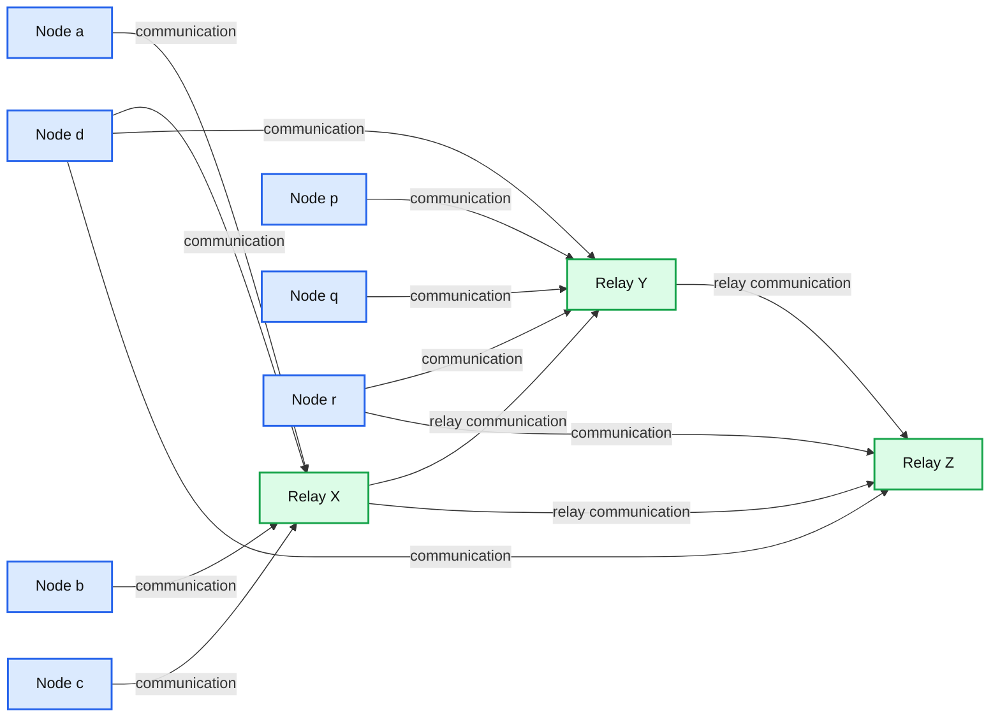
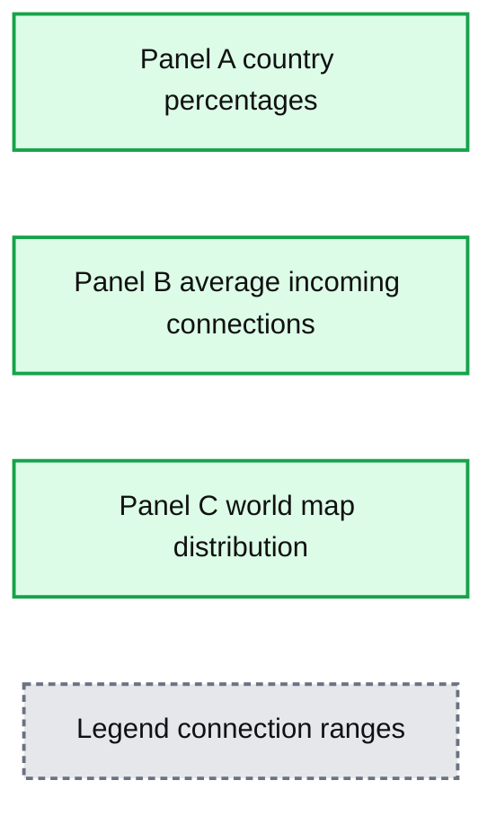
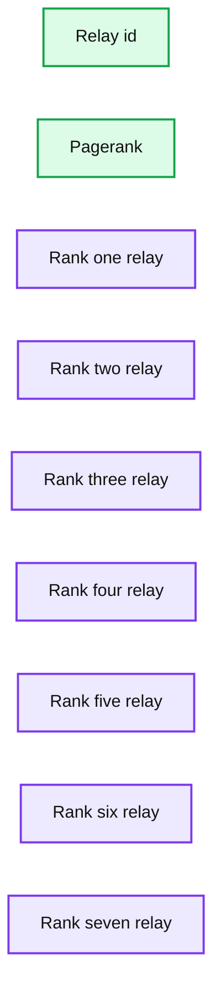
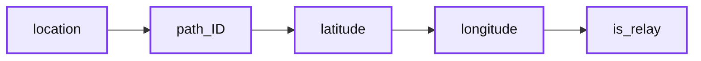

# Analyzing Algorand Blockchain Data with Databricks Delta

- Source: https://www.databricks.com/blog/2020/10/08/analyzing-algorand-blockchain-data-with-databricks-delta.html
- Published: 2020-10-08
- Authors: Anindita Mahapatra, Eric Gieseke
- Categories: engineering, open-source
- Images: 12 total, 7 extracted as architecture

[Get an early preview of O'Reilly's new ebook](https://www.databricks.com/resources/ebook/delta-lake-running-oreilly?itm_data=algorandblockchaindeltapart1-blog-oreillydlupandrunning) for the step-by-step guidance you need to start using Delta Lake.

---

Algorand is a public, decentralized blockchain system that uses a proof of stake consensus protocol. It is fast and energy-efficient, with a transaction commit time under 5 seconds and throughput of one thousand transactions per second. The Algorand system is composed of a network of distributed nodes that work collaboratively to process transactions and add blocks to its distributed ledger.

The following diagram illustrates how blocks containing transactions link together to form the blockchain.

**Summary:** The diagram shows sequential Algorand blockchain blocks linked by each block’s hash of the previous block.

**Components:**

- Block 1: Algorand blockchain block containing round, timestamp, account balances, previous-block hash, and transactions.
- Block 2: Algorand blockchain block containing round, timestamp, account balances, previous-block hash, and transactions.
- Block N: Algorand blockchain block containing round, timestamp, account balances, previous-block hash, and transactions.
- Intermediate blocks: Additional sequential Algorand blockchain blocks.

**Flows:**

- Block 2 -> Block 1: Hash of the previous block
- Block N -> Intermediate blocks: Hash of the previous block
- Intermediate blocks -> Block 2: Sequential blockchain linkage

**Numbers:** 1, 2, N, Round 1, Round 2, Round N, tx1, tx2, txn, tx X, tx Y

```mermaid
%% Shows sequential Algorand blockchain blocks linked by previous block hashes
flowchart LR
    B1["Block 1<br/>Round 1, timestamp, account balances<br/>Hash of previous block<br/>tx1, tx2, txn"]
    B2["Block 2<br/>Round 2, timestamp, account balances<br/>Hash of previous block<br/>tx1, tx2, tx X"]
    MID["Intermediate blocks"]
    BN["Block N<br/>Round N, timestamp, account balances<br/>Hash of previous block<br/>tx1, tx2, tx Y"]

    B2 -. "hash of previous block" .-> B1
    BN -. "hash of previous block" .-> MID
    MID -. "hash of previous block" .-> B2

    classDef client   fill:#dbeafe,stroke:#2563eb,stroke-width:2px,color:#111
    classDef service  fill:#dcfce7,stroke:#16a34a,stroke-width:2px,color:#111
    classDef store    fill:#ede9fe,stroke:#7c3aed,stroke-width:2px,color:#111
    classDef cache    fill:#fef3c7,stroke:#d97706,stroke-width:2px,color:#111
    classDef queue    fill:#cffafe,stroke:#0891b2,stroke-width:2px,color:#111
    classDef critical fill:#fee2e2,stroke:#dc2626,stroke-width:4px,color:#111
    classDef external fill:#e5e7eb,stroke:#6b7280,stroke-width:2px,color:#111,stroke-dasharray:4 3
    classDef decision fill:#fce7f3,stroke:#db2777,stroke-width:2px,color:#111

    class B1,B2,BN store
    class MID external
```

source image: https://www.databricks.com/wp-content/uploads/2020/10/blog-algorand-1.png

 Figure 1: Blocks linked sequentially in Algorand Blockchain

To ensure optimum network performance, it is important to continually monitor and analyze business and operational metrics.

[Databricks](https://www.databricks.com/) provides a Unified Data Analytics Platform for massive-scale data engineering and collaborative data science on multi-cloud infrastructure. [Delta](https://delta.io/) is an open-source storage layer from Databricks that brings reliability and performance for big data processing. This blog post will demonstrate how Delta facilitates real-time data ingestion, transformation, and visualization of the blockchain data to provide the necessary insights.

In this article, we will show how to use Databricks to analyze the operational aspects of the Algorand network. This will include ingestion, transformation, and visualization of Algorand network data to answer questions like:

- To ensure optimum network health, is the ratio of nodes to relays similar across different regions?
- Are the average incoming/outgoing connections by host by country within a reasonable threshold to ensure good utilization of the network without straining specific hosts/regions?
- Do average connection durations between nodes fall below a certain threshold that might indicate high rates of connection failures or a more persistent problem?
- Are there any potential weak links in the network topology for global reach/access?
- Given a node, what are the other nodes that it is connected to, and how does that change over time?
- Having different methods of visualizing the data facilitates detecting and addressing issues.

This is the first of a 2 part blog. In part 2, we’ll analyze block, transaction, and account data.

**Algorand Network**

The Algorand blockchain is a decentralized network of nodes and relays geographically distributed and connected by the Internet. The nodes and relays follow the consensus protocol to agree on the next block of the blockchain.  The proof of stake consensus protocol is fast and new blocks are produced in less than 5 seconds.  In order to produce a block, 77.5% of the stake must agree on the block.  All nodes have a copy of the ledger, which is the collection of all blocks produced to date.  There is a significant amount of communication between the nodes and relays so good connectivity is essential for proper operation.

The Algorand network is composed of:

- **Node**: An instance of Algorand software that is primarily responsible for participating in the consensus protocol.  Nodes communicate with other Nodes through Relays. Because it is a distributed ledger, each node has its own copy of the transaction details.
- **Relay**: An instance of the Algorand software that provides a communication hub for the Nodes
- Nodes and relays form a star topology where
  - A node can connect only to one or more relays.
  - A relay can connect to other relays
- The connections between nodes and relays are periodically updated to favor the best performing connections by disconnecting from slow connections.

## Node Telemetry Data

**Summary:** Algorand nodes connect to relays, while relays connect with one another to propagate blockchain communication.

**Components:**

- Node a: Algorand node
- Node b: Algorand node
- Node c: Algorand node
- Node d: Algorand node
- Node p: Algorand node
- Node q: Algorand node
- Node r: Algorand node
- Relay X: Algorand relay
- Relay Y: Algorand relay
- Relay Z: Algorand relay

**Flows:**

- Node a -> Relay X: communication
- Node b -> Relay X: communication
- Node c -> Relay X: communication
- Node d -> Relay X: communication
- Node d -> Relay Y: communication
- Node d -> Relay Z: communication
- Node p -> Relay Y: communication
- Node q -> Relay Y: communication
- Node r -> Relay Y: communication
- Node r -> Relay Z: communication
- Relay X -> Relay Y: relay communication
- Relay X -> Relay Z: relay communication
- Relay Y -> Relay Z: relay communication

**Numbers:** none

source image: https://www.databricks.com/wp-content/uploads/2020/10/blog-algorand-2.png

| Figure 2: Nodes and Relays in an Algorand Blockchain Networks | - Nodes process transactions and participate in the consensus protocol by voting on blocks - 77.5% of the stake have to agree on the next block proposal, so it is important for them to efficiently communicate with each other during the different stages of voting - Nodes propagate votes and transactions through relays - Relays act as communication hubs for the nodes - Relays connect to 1 or more other relays - Nodes and Relays all maintain a copy of the distributed ledger **Note**: The data used is from the Algorant mainnet blockchain. The node identities (IP and names) have been obfuscated in the notebook. |
|---|---|

**Algorand Data **

| **#** | **Data Type** | **What** | **Why** | **Where** |
|---|---|---|---|---|
| **1** | Node Telemetry Data (JSON data from Elasticsearch) | Peer connection data that describes the **network topology** of nodes and relays. | It gives a real-time view of the active nodes & relays and their interconnectivity. It is important to ensure that the network is not partitioned, there is an equal distribution of nodes across the world and there is a balanced load shared across them. | The nodes (compute instances) periodically transmit this information to a configured Elastic Search Endpoint and the analytic system ingests from ES. |
| **2** | Block, Transaction, Account Data (JSON/CSV data from S3) | Transaction data and individual account balances are committed into blocks chained sequentially. | This gives visibility into usage of the blockchain network and people(accounts) transacting on it where each account is an established identity and each tx/block has a unique identifier. | This data is generated on individual nodes comprising the blockchain network that is pushed into S3 and ingested by the analytic system. |

Table1: Algorand data types

## Analytics Workflow

The following diagram illustrates the present data flow.wp-caption: Figure 3: Algorand Analytics Primary Components

**Summary:** The diagram shows Algorand node telemetry and blockchain data flowing through Elastic and Databricks components into S3 and Delta tables for analytics.

**Components:**

- Algo Nodes: EC2, local storage, and SQLite DB
- Elastic: telemetry data store and analytics source
- Kibana: analytic dashboards
- Databricks Elastic Connector: ingestion connector
- S3: object storage
- Delta Table S3: durable analytics table
- Data Exploration, Aggregations, Reporting, Graph Analytics, ML: analytics workloads

**Flows:**

- Algo Nodes -> Elastic: Node telemetry data
- Elastic -> Kibana: Data for analytic dashboards
- Elastic -> Databricks Elastic Connector: Telemetry data
- Databricks Elastic Connector -> S3: Ingested data
- S3 -> Delta Table S3: Data for Delta tables
- Algo Nodes -> S3: Block, transaction, and account data

**Numbers:** 1, 2

```mermaid
%% Algorand analytics data flow and primary components
flowchart LR
    N[Algo Nodes EC2 Local Storage SQLite DB]
    E[Elastic]
    K[Kibana]
    C[Databricks Elastic Connector]
    S[S3]
    D[Delta Table S3]
    A[Data Exploration Aggregations Reporting Graph Analytics ML]

    N -->|Node telemetry data| E
    E -->|Dashboard data| K
    E -->|Telemetry data| C
    C -->|Ingested data| S
    S -->|Delta table data| D
    N -.->|Block Txn Account Data| S
    D -->|Analytics workloads| A

    classDef client   fill:#dbeafe,stroke:#2563eb,stroke-width:2px,color:#111
    classDef service  fill:#dcfce7,stroke:#16a34a,stroke-width:2px,color:#111
    classDef store    fill:#ede9fe,stroke:#7c3aed,stroke-width:2px,color:#111
    classDef cache    fill:#fef3c7,stroke:#d97706,stroke-width:2px,color:#111
    classDef queue    fill:#cffafe,stroke:#0891b2,stroke-width:2px,color:#111
    classDef critical fill:#fee2e2,stroke:#dc2626,stroke-width:4px,color:#111
    classDef external fill:#e5e7eb,stroke:#6b7280,stroke-width:2px,color:#111,stroke-dasharray:4 3
    classDef decision fill:#fce7f3,stroke:#db2777,stroke-width:2px,color:#111

    N:::client
    E:::service
    K:::service
    C:::queue
    S:::store
    D:::store
    A:::service

    %% Legend
    %% client means edge or gateway
    %% service means stateless compute
    %% store means durable storage
    %% cache means losable cache
    %% queue means asynchronous pipe
    %% critical means bottleneck or SPOF
    %% external means third party
    %% decision means trade off point
```

source image: https://www.databricks.com/wp-content/uploads/2020/10/blog-algorand-3.png

The ability to stream data into Delta tables as it arrives supports near real-time analysis of the network. The data is received in JSON format with the following schema:

- Timestamp
- Host
- MessageType
- Data
  - List of OutgoingPeers
    - Address, ConnectionDuration, Endpoint, HostName
  - List of IncomingPeers
    - Address, ConnectionDuration, Endpoint, HostName

Algorand nodes and relays send telemetry data updates to an Elasticsearch cluster once per hour. Elastic is based on Lucene and is primarily a search technology, with analytics layered on top of it and Kibana to offer a real-time dashboard with time-series functionality out of the box. However, the data ingested is in a proprietary format and there is no separation of compute and storage and over time this can get expensive and require substantial effort to maintain. Elasticsearch does not provide support for transactions and limited data manipulation processing options. The syntax to use queries requires some learning curve and for any advanced ML, data has to be pulled out.

To support analysis using Databricks, the data is pulled from Elasticsearch using the Elastic Connector and stored in S3. The data is then transformed into Delta Tables which support the full range of CRUD operations with ACID compliance. S3 is used as the data storage layer and is scalable, reliable, and affordable. Only when compute is required, a spark cluster is spun up. BI Reporting, Interactive Queries for EDA (Exploratory Data Analysis), and ML workloads can all work off the data in S3 using a variety of tools, frameworks, and familiar languages including SQL, R, Python, and Scala. BI reporting tools like Tableau can directly tap into the data in Delta. For very specific BI Reporting needs, some datasets can be pushed to other systems including a Data Warehouse or an Elasticsearch cluster.

It is worth noting that the present data flow can be simplified by writing the telemetry data directly into S3 to provide a consolidated data lake, skipping Elasticsearch altogether. The existing analytics currently done in Elasticsearch can be transferred to Databricks.

### Blockchain Network Analysis Process

The following steps define the process to retrieve and transform the data into the resulting Delta table.

1. Periodically retrieve telemetry data from Elasticsearch
2. Parse & flatten the JSON data and save the incoming & outgoing peer connection details in separate tables.
3. Call geocoding APIs for new node IPs
  1. Convert IP addresses to ISO3 country code and lat/long coordinates
  2. Convert from ISO3 to ISO2 country codes
4. Analyze the node telemetry data for trends and outliers
  1. Using SQL
  2. Using Graph libraries
5. Visualize Node Network Data
  1. Using [pyvis](https://pyvis.readthedocs.io/en/latest/index.html) libraries
  2. Expose data in a Delta table for geospatial visualization using [Tableau](https://help.tableau.com/current/pro/desktop/en-us/maps_build.htm#Spider)
  3. Output node and edge CSV data files in S3 for visualization in a web browser using [D3](https://www.toptal.com/javascript/a-map-to-perfection-using-d3-js-to-make-beautiful-web-maps)

The following diagram illustrates the analysis process:

**Summary:** The diagram shows an Algorand telemetry data pipeline from Elasticsearch through Databricks Delta processing to PyViz, D3, Tableau, and SQL visualizations.

**Components:**

- Databricks Jobs for periodic data pulls and processing
- Elasticsearch Spark Connector for reading telemetry data
- Temporary Table node telemetry for staging
- algo.in Delta Lake table for input data
- algo.out Delta Lake table for processed output
- Unique Host IPs query for extracting distinct hosts
- algo.tableau Delta Lake table for Tableau exposure
- algo.geo_map Delta Lake table for geospatial data
- PyViz for visualization
- D3 for browser-based visualization
- Node and edge CSV files in S3 for D3
- Tableau Databricks Connector for Tableau access
- SQL and graph libraries for node telemetry analysis

**Flows:**

- Databricks Jobs -> Elasticsearch Spark Connector: periodically pulls telemetry data
- Elasticsearch Spark Connector -> Temporary Table node telemetry: loads raw telemetry
- Temporary Table node telemetry -> algo.in: parses and flattens JSON
- Temporary Table node telemetry -> algo.out: stores parsed and flattened data
- algo.in -> Unique Host IPs: supplies telemetry records
- algo.out -> Unique Host IPs: supplies telemetry records
- Unique Host IPs -> algo.tableau: writes geospatial input data
- Unique Host IPs -> algo.geo_map: writes geospatial input data
- algo.tableau -> Tableau Databricks Connector: exposes Tableau data
- algo.geo_map -> Tableau Databricks Connector: exposes geospatial data
- algo.out -> PyViz: supplies visualization data
- algo.out -> D3: supplies node and edge data
- D3 -> Node and edge CSV files in S3: saves browser visualization files
- SQL and graph libraries -> algo.tableau: analyzes node telemetry trends and outliers
- SQL and graph libraries -> algo.geo_map: analyzes node telemetry trends and outliers

**Numbers:** D3, S3, SQL, ISO3

```mermaid
%% Algorand telemetry data flow from Elasticsearch to analytics visualizations
flowchart LR
    jobs[Databricks Jobs] -->|periodic telemetry pull| es[Elasticsearch Spark Connector]
    es -->|raw telemetry| temp[Temporary Table node telemetry]
    temp -->|parse and flatten JSON| input[algo in Delta Lake]
    temp -->|parse and flatten JSON| output[algo out Delta Lake]
    input -->|telemetry records| hosts[Unique Host IPs]
    output -->|telemetry records| hosts
    hosts -->|geospatial data| tableau[algo tableau Delta Lake]
    hosts -->|geospatial data| geomap[algo geo map Delta Lake]
    output -->|visualization data| pyviz[PyViz]
    output -->|node and edge data| d3[D3]
    d3 -->|save CSV files| s3[Node and edge CSV files in S3]
    tableau -->|Databricks Connector| tb[Tableau]
    geomap -->|Databricks Connector| tb
    sql[SQL and graph libraries] -->|analyze trends and outliers| tableau
    sql -->|analyze trends and outliers| geomap

    classDef client   fill:#dbeafe,stroke:#2563eb,stroke-width:2px,color:#111
    classDef service  fill:#dcfce7,stroke:#16a34a,stroke-width:2px,color:#111
    classDef store    fill:#ede9fe,stroke:#7c3aed,stroke-width:2px,color:#111
    classDef cache    fill:#fef3c7,stroke:#d97706,stroke-width:2px,color:#111
    classDef queue    fill:#cffafe,stroke:#0891b2,stroke-width:2px,color:#111
    classDef critical fill:#fee2e2,stroke:#dc2626,stroke-width:4px,color:#111
    classDef external fill:#e5e7eb,stroke:#6b7280,stroke-width:2px,color:#111,stroke-dasharray:4 3
    classDef decision fill:#fce7f3,stroke:#db2777,stroke-width:2px,color:#111

    class jobs,sql service
    class es,pyviz,d3,tb external
    class temp,hosts cache
    class input,output,tableau,geomap,s3 store
```

source image: https://www.databricks.com/wp-content/uploads/2020/10/blog-algorand-4.png

 Figure 4: Algorand Analytics Data Flow

#### Step 1: Pull data from Elasticsearch

Use SQL to periodically read from [ElasticSearch Connector](https://docs.databricks.com/data/data-sources/elasticsearch.html)to pull the telemetry data from Elasticsearch into S3. Data can be indexed and queried from Spark SQL transparently as Elasticsearch is a native source for Spark SQL. The connector pushes down the operations directly to the source, where the data is efficiently filtered out so that only the required data is streamed back to Spark. This significantly increases the query performance and minimizes the CPU, memory, and I/O on both Spark and Elasticsearch clusters as only the needed data is returned.

- Use the [Databricks Jobs](https://docs.databricks.com/jobs.html) API to schedule the pull
- Use [Secrets](https://docs.databricks.com/security/secrets/index.html) API to store sensitive credential information

#### Step 2:  Parse and flatten JSON data

Create 'out' and 'in' tables to hold peer connection data received over the last hour.  Use the SparkSQL [explode](https://docs.databricks.com/spark/latest/dataframes-datasets/complex-nested-data.html) function to create a row for each connection.

#### Step 3a: Create Edge information and save in S3 as CSV file

#### Step 3b: Create Node information and add geocoding

Create node information and save it in S3.  Call geocoding REST API (e.g., [IPStack](https://ipstack.com/), [Google Geocoding API](https://developers.google.com/maps/documentation/geocoding/start)) within a [UDF](https://docs.databricks.com/spark/latest/spark-sql/udf-python-pandas.html#pandas-user-defined-functions) to map the Node’s IP addresses to its location (latitude, longitude, Country, State, City, Zip, etc). For each node, convert from ISO3 to ISO2 country codes.  Add a column to indicate the node type (Relay or Node).  This is determined based on the number of incoming connections, where only relays have incoming connections.

Table 2: Geo Augmented Data for each node

#### Step 4a: Analyze node telemetry data using SQL and charting

**Summary:** SQL-based node analysis showing country distribution, average incoming connections, and geographic concentration of Algorand nodes.

**Components:**

- Panel A: country percentage donut chart using SQL charting
- Panel B: average incoming connections bar chart using SQL charting
- Panel C: world map showing geographic node distribution

**Flows:**

- none

**Numbers:** 39%, 12%, 12%, 8%, 7%, 6%, 6%, 4%, 3%, 3%; 0, 50, 100, 150, 200 average incoming connections; 100-150, 50-100, 0-50, N/A; top 10 countries

source image: https://www.databricks.com/wp-content/uploads/2020/10/blog-algorand-5.png

 Figure 5: Node Analysis using SQL

(A) shows the percentages of nodes and relays for top 10 countries. The data shows that there is a higher concentration of nodes and relays in the US.  Over time, as the Algorand network grows, it should become more equally distributed across the world as is desirable in a decentralized blockchain.

(B) shows the load distribution  (Top 10 countries with highest Avg number of incoming connections per relay node) The incoming connection distribution looks fairly balanced except for the region around Ireland, Japan and Italy which are under higher load.

(C) shows the Heat map of nodes. The geographic distribution shows higher deployments in the Americas, as the Algorand network grows, the distribution of nodes should cover more of the world.

#### Step 4b: Analyze node telemetry data using [Graph Libraries](https://docs.databricks.com/spark/latest/graph-analysis/graphframes/index.html).

A Graph Frame is created out of node and edge information and provides high-level APIs for DataFrame based graph data manipulation. It is a successor to GraphX and encompasses all the functionality with the added convenience of seamlessly leveraging the same underlying data frame.

Detect potential weak links in the network topology using the Connected Components algorithm. Connected component membership returns a graph with each vertex assigned a component ID.

Each node belongs to the same component indicating that there are currently no partitions or breaks. This is evident when we select distinct on the components generated and it returns just 1 value - in this case, component 0.

Analyze network load using the PageRank algorithm

PageRank measures the importance of each relay and is measured by the number of incoming connections. The resulting table identifies the most important relays in the network. GraphX comes with static and dynamic implementations of PageRank, here we are using the static one with 10 iterations, the dynamic PageRank will run until the ranks converge.

**Summary:** A ranked table of Algorand relay identifiers and their PageRank scores.

**Components:**

- Relay identifier column labeled id
- PageRank score column labeled pagerank
- Seven ranked relay records

**Flows:**

- none

**Numbers:** Row numbers 1, 2, 3, 4, 5, 6, 7; PageRank values 9.536428008969734, 8.576604464508566, 8.499652519557083, 8.434030556928082, 7.803982684044956, 7.56140470281491, 7.345449131428913; identifiers contain visible numeric segments 3, 5234, 661, 9, 9, 71, 70, 2, 0, 0, 35, 6, 4, 8, 34, 1, 2, 452, 828, 175, 442, 5, 49, 0, 4, 9, 23, 1, 0, 9, 96, 4, 7, 85, 1, 47, 1, 796, 6, 6, 0, 1, 1, 7, 7, 7, 19, 2, 0, 6, 7, 1, 9, 6, 8, 13, 6, 8, 3, 8, 44, 9, 1, 6, 2, 0, 4, 3, 5, 2, 3, 1, 0, 0, 8, 7, 6, 0, 3, 5, 6, 7, 2, 0, 8, 9, 9, 1, 1, 2, 0, 4, 3, 5, 0, 4, 4, 8, 4, 9, 5, 0, 6, 9, 5, 0, 0, 5, 0, 0, 0, 9, 7, 0, 7, 9, 0, 7, 9, 0, 9

source image: https://www.databricks.com/wp-content/uploads/2020/10/blog-algorand-8.png

#### Step 5: Visualization of the geographic distribution of nodes and relays

It is important to understand the entire network which needs to be monitored for global reach/access to ensure the decentralized nature of the blockchain. The map is interactive and allows zooming into specific regions for more details. For example, in Tableau which has rich geospatial integration, the search feature could be handy.

#### Step 5a: Pyvis visualization of the star topology

The pyvis library is intended for a quick generation of visual network graphs with minimal python code. It is especially handy for interactive network visualizations. There are many connections between nodes and relays and visualizing the data as a directed graph helps to understand the structure. Apart from source/destination information, there are additional properties such as the number of connections between two nodes, and the node type.

The red vertices denote relays, the blue ones are nodes. Yellow edges represent connections between relays and the blue edges represent connections originating from nodes. The number of connected edges determines the size of vertices which is why the relays (in red) are generally bigger because they typically have more connections than the nodes.  This results in a star topology that we see below.

Figure 6: Pyvis visualization of Algorand Blockchain Network of nodes (blue) and relays (red), edges between relays are yellow and those with nodes are blue

From the diagram, you can see that most nodes connect to 4 relays.  Relays have more connections than nodes and act as a communication mesh to quickly distribute messages between the nodes.

#### Step 5b: Geospatial  Visualization of Node and Edge data in Delta using Tableau

Geospatial data from the Delta tables can be natively overlaid in Tableau to visualize the network on a world map. One convenient way to visualize the data in Tableau is to use a [spider map](https://help.tableau.com/current/pro/desktop/en-us/maps_howto_origin_destination.htm) which is an origin-destination path map.

This requires the Delta table to be in a schema like this.

**Summary:** A schema table showing fields for geospatial Algorand path data.

**Components:**

- location
- path_ID
- latitude
- longitude
- is_relay

**Flows:**

- none

**Numbers:** none

source image: https://www.databricks.com/wp-content/uploads/2020/10/blog-algorand-11.png

The schema requires two rows for each path - one using the *origin as the* location, and the other using the *destination* as the location. This is crucial to enable Tableau to draw the paths correctly.

Where *location* refers to the node, *path_ID* is the concatenation of src & destination nodes along with latitude, longitude, and relay information.

To connect this table to Tableau, follow the instructions located here: [notes to connect Tableau to Delta table.](https://docs.databricks.com/integrations/bi/tableau.html) Periodic refreshes of the data will be reflected in the Tableau dashboard.

Tableau recognizes the latitude and longitude coordinates to distribute the nodes on the world map.

 Figure 7: Tableau geospatial display of Algorand nodes and relays across the US

The map view makes it easy to visualize the geographical distribution of nodes and relays.

Add the path qualifier to show the edges connecting the nodes and relays.

 Figure 8: Tableau geospatial display of Algorand network paths

With the connections enabled, the highly connected nature of the Algorand network becomes clear. The orange connections are between relays and the blue ones connect nodes to relays.

#### Step 5c: Visualization of Node and Edge data in D3

D3 (Data-Driven Documents) is an open-source JavaScript library for producing dynamic, interactive data visualizations that can be rendered in web browsers. It combines map and graph visualizations in a single display using a data-driven approach to DOM manipulation. In the previous section, we saw how an external tool like Tableau could access the data, D3 can be run from within a Databricks notebook as well as a standalone external script. Manipulating and presenting geographic data can be very tricky, but D3.js makes it simple using the following steps.

- Draw a world map based on the data stored in a JSON-compatible data format.
- Define the size of the map and the geographic projection to use
- Use spherical Mercator projection to map the 3-dimensional spherical Earth onto 2-dimensional surfaces(d3.geo.mercator)
- Define an SVG element and append it to the DOM
- Load the map data using JSON (data formatted in JSON format namely topojson)
- Map styling is done via CSS

The following diagram demonstrates map projections, TopoJSON, Voronoi diagrams, force-directed layouts, and edge bundling based on this [example](https://bl.ocks.org/sjengle/2e58e83685f6d854aa40c7bc546aeb24). Updated node and edge data in Delta can be used to periodically refresh an HTML dashboard similar to the one below.

Figure 9: Algorand relays (orange) and nodes (blue) in US reporting their connection links

In this post, we have shown how Databricks is a versatile platform for analyzing the operational data (node telemetry) from the Algorand blockchain. Spark’s distributed compute architecture along with Delta provides a scalable cloud infrastructure to perform exploratory analysis using SQL, Python, Scala & R to analyze structured, semi-structured, and unstructured data. Graph algorithms can be applied with very few lines of code to analyze node importance and component connectedness. Different visualization libraries and tools help inspect the network state. In the next post, we will show how block, transaction, and account information can be analyzed in real-time using Databricks. To get started, view the [Delta Architecture Webinar](https://www.databricks.com/p/webinar/delta-lake-architecture).  To learn more about Algorand Blockchain, please visit [Algorand](http://www.algorand.com).

[DOWNLOAD THE NOTEBOOK](https://www.databricks.com/notebooks/node-telemetry.html)
