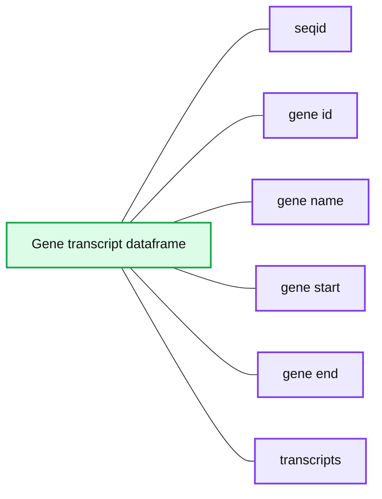
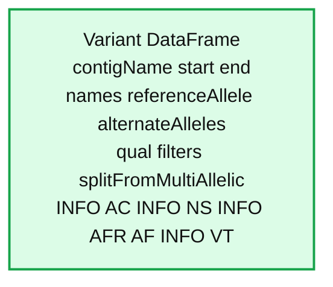

# Integrating large-scale Genomic Variation and Annotation Data with Glow

- Source: https://www.databricks.com/blog/2020/10/09/integrating-large-scale-genomic-variation-and-annotation-data-with-glow.html
- Published: 2020-10-09
- Authors: Kiavash Kianfar
- Categories: engineering, data-science-machine-learning
- Images: 5 total, 4 extracted as architecture

Genomic annotations augment variant data by providing context for each change in the genome. For example, annotations help answer questions like does this mutation cause a change in the protein-coding sequence of a gene? If so, how does it change the protein? Or is the mutation in a low information part of the genome, also known as “junk DNA”? And everything in between. Recently (since release 0.4), [Glow](https://projectglow.io/), an open-source toolkit for large-scale genomic analysis, introduced the capability to ingest genomic annotation data from the [GFF3 (Generic Feature Format Version 3)](https://github.com/The-Sequence-Ontology/Specifications/blob/master/gff3.md) flat-file format. [GFF3](https://github.com/The-Sequence-Ontology/Specifications/blob/master/gff3.md) was proposed by the [Sequence Ontology Project](http://www.sequenceontology.org/) in 2013 and has become the de-facto format for genome annotation. This format is widely used by genome browsers and databases such as NCBI [RefSeq](https://misuse.ncbi.nlm.nih.gov/error/abuse.shtml) and [GenBank](https://misuse.ncbi.nlm.nih.gov/error/abuse.shtml). [GFF3](https://github.com/The-Sequence-Ontology/Specifications/blob/master/gff3.md) is a 9-column tab-separated text format that typically carries the majority of the annotation data in the ninth column. This column is called `attributes` and stores the annotations as a semi-colon separated list of `=` entries. As a result, although GFF3 files can be read as Apache Spark™ DataFrames using Spark’s standard `csv` data source, the resulting DataFrame is unwieldy for query and data manipulation of annotation data, because the whole list of attribute tag-value pairs for each sequence will appear as a single semicolon-separated string in the `attributes` column of the DataFrame.

Glow’s new and flexible `gff` Spark data source addresses this challenge. While reading the GFF3  file, the `gff` data source parses the `attributes` column of the file to create an appropriately typed column for each tag. In each row, this column will contain the value corresponding to that tag in that row (or `null` if the tag does not appear in the row). Consequently, all tags in the GFF3 `attributes` column will have their own corresponding column in the Spark DataFrame, making annotation data query and manipulation much easier.

## Ingesting GFF3 Annotation Data

Like any other Spark data source, reading GFF3 files using Glow's `gff` data source can be done in a single line of code. Figure 1 shows how we can ingest the annotations of the Homo Sapiens genome assembly GRCh38.p13 from a GFF3 file (obtained from RefSeq) as shown below. Here, we have also filtered the annotations to chromosome 22 in order to use the resulting `annotations_df` DataFrame in continuation of our example. The `annotations_df` alias is for the same purpose as well.

**Figure 1:** A small section of the `annotations_df` DataFrame

In addition to reading uncompressed `.gff` files, the gff data source supports all compression formats supported by Spark's `csv` data source, including `.gz` and `.bgz`. It is strongly recommended to use splittable compression formats like `.bgz` instead of `.gz` to enable parallelization of the read process.

## Schema

Let us have a closer look at the schema of the resulting DataFrame, which was automatically inferred by Glow's `gff` data source:

This schema has 100 fields (not all shown here). The first eight fields (`seqId`, `source`, `type`, `start`, `end`, `score`, `strand`, and `phase`), here referred to as the "base" fields, correspond to the first eight columns of the GFF3 format cast in the proper data types. The rest of the fields in the inferred schema are the result of parsing the `attributes` column of the GFF3 file. Fields corresponding to any "official" tag (those referred to as "tags with a pre-defined meaning" in the [GFF3](https://github.com/The-Sequence-Ontology/Specifications/blob/master/gff3.md) format description), if present in the GFF3 file, are automatically assigned the appropriate data types. The official fields are then followed by the "unofficial" fields (fields corresponding to any other tag) in alphabetical order. In the example above, `ID`, `Name`, `Parent`, `Target`, `Gap`, `Note`, `Dbxref`, and `Is_circular` are the official fields, and the rest are the unofficial fields. The gff data source discards the comments, directives, and [FASTA](https://en.wikipedia.org/wiki/FASTA_format) lines that may be in the GFF3 file.

As it is not uncommon for the official tags to be spelled differently in terms of letter case and underscore usage within and/or across different GFF3 files the `gff` data source is designed to be insensitive to letter case and underscore when extracting official tags from the `attributes` field. For example, the official tag `Dbxref` will be correctly extracted as an official field even if it appears as dbxref or `dbx_ref` in the GFF3 file. Please see [Glow documentation](https://glow.readthedocs.io/en/latest/etl/gff.html) for more details.

Like other Spark data sources, Glow's `gff` data source is also able to accept a user-specified schema through the `.schema` command. The data source behavior in this case is also designed to be quite flexible. More specifically, the fields (and their types) in the user-specified schema are treated as the list of fields, whether base, official, or unofficial, to be extracted from the GFF3 file (and cast to the specified types). Please see the [Glow documentation](https://glow.readthedocs.io/en/latest/etl/gff.html) for more details on how user-specified schemas can be used.

## Example: Gene Transcripts and Transcript Exons

With the annotation tags extracted as individual DataFrame columns using Glow's `gff` data source, query and data preparation over genetic annotations becomes as easy as writing common Spark commands in the user's API of choice. As an example, here we demonstrate how simple queries can be used to extract data regarding hierarchical grouping of genomic features from the `annotations_df` created earlier.

One of the main advantages of the GFF3 format compared to older versions of GFF is the improved presentation of feature hierarchies (see the [GFF3 format description](https://github.com/The-Sequence-Ontology/Specifications/blob/master/gff3.md) for more details). Two examples of such hierarchies are:

- Transcripts of a gene (here, gene is the "parent" feature and its transcripts are the "children" features).
- Exons of a transcript (here, the transcript is the parent and its exons are the children).

In the [GFF3](https://github.com/The-Sequence-Ontology/Specifications/blob/master/gff3.md) format, the parents of the feature in each row are identified by the value of the `parent` tag in the `attributes` column, which includes the ID(s) of the parent(s) of the row. Glow's `gff` data source extracts this information as an array of parent ID(s) in a column of the resulting DataFrame called `parent`.

Assume we would like to create a DataFrame, called `gene_transcript_df`, which, for each gene on chromosome 22, provides some basic information about the gene and all its transcripts. As each row in  the `annotations_df` of our example has at most a single parent, the `parent_child_df` DataFrame created by the following query will help us in achieving our goal. This query joins `annotations_df` with a subset of its own columns on the `parent` column as the key. Figure 2 shows a small section of the `parent_child_df` dataframe.

**Summary:** A sample Glow Spark DataFrame showing genomic annotation hierarchy fields and parent-child relationships.

**Components:**

- `seqid` - genomic sequence identifier
- `type` - annotation type
- `start` - annotation start coordinate
- `end` - annotation end coordinate
- `id` - annotation identifier
- `name` - annotation name
- `parent_id` - parent annotation identifier
- `parent_name` - parent annotation name
- `parent_type` - parent annotation type
- `parent_start` - parent start coordinate
- `parent_end` - parent end coordinate
- Glow - genomic data integration technology
- Spark DataFrame - tabular data structure

**Flows:**

- Annotation rows -> Spark DataFrame: genomic annotations with parent metadata
- Parent fields -> Child rows: hierarchy relationship

**Numbers:** 02, 11, 10850456, 10580988, 10742023, 10742191, 10753062, 107420203, 10753053, 10749497, 10749658, 10752759, 10753062, 10858994, 10864475, 10859694, 10859832, 10861764, 10861980, 10863367, 10863581, 10863721, 10864475, 10940596, 10961529, 132320.1, 950596.3, 105379418, 100289194, 1,000 rows

```mermaid
%% Shows a Glow Spark DataFrame containing genomic annotation hierarchy
flowchart LR
    A[Glow genomic annotations] -->|parent child fields| B[Spark DataFrame]
    B -->|annotation columns| C[Genomic hierarchy records]

    classDef client fill:#dbeafe,stroke:#2563eb,stroke-width:2px,color:#111
    classDef service fill:#dcfce7,stroke:#16a34a,stroke-width:2px,color:#111
    classDef store fill:#ede9fe,stroke:#7c3aed,stroke-width:2px,color:#111
    classDef cache fill:#fef3c7,stroke:#d97706,stroke-width:2px,color:#111
    classDef queue fill:#cffafe,stroke:#0891b2,stroke-width:2px,color:#111
    classDef critical fill:#fee2e2,stroke:#dc2626,stroke-width:4px,color:#111
    classDef external fill:#e5e7eb,stroke:#6b7280,stroke-width:2px,color:#111,stroke-dasharray:4 3
    classDef decision fill:#fce7f3,stroke:#db2777,stroke-width:2px,color:#111

    class A external
    class B service
    class C store
```

source image: https://www.databricks.com/wp-content/uploads/2020/08/blog-genomic-variation-2.png

**Figure 2: **A small section of the `parent_child_df` DataFrame

Having the `parent_child_df` DataFrame, we can now write the following simple function, called `parent_child_summary`, which, given this DataFrame, the parent type, and the child type, generates a DataFrame containing basic information on each parent of the given type and all its children of the given type.

Now we can generate our intended `gene_transcript_df` DataFrame, shown in Figure 3, with a single call to this function:

`gene_transcript_df = parent_child_summary(parent_child_df, 'gene', 'transcript')`

**Summary:** A Spark DataFrame summarizes genes and their transcripts, including identifiers, genomic coordinates, and transcript structs.

**Components:**

- `seqid`: chromosome sequence identifier
- `gene_id`: gene identifier
- `gene_name`: gene name
- `gene_start`: gene start coordinate
- `gene_end`: gene end coordinate
- `transcripts`: array of transcript structs containing IDs and coordinates
- Spark DataFrame: tabular genomic annotation output

**Flows:**

- none

**Numbers:** NC_000022.11; 16961935; 17008281; 17008281; 16966348; 17008221; 17137519; 17165287; 17550429; 17369677; 17540430; 17562469; 17580174; 17592256; 17628854; 17730585; 17727270; 17655661; 17830855; 18527801; 18531920; 19036281; 19122454; 19130278; 19144726; 17008280; 16964771; 17008280; 16966348; 17008281; 16961935; 17008222; 17137519; 17159277; 17137519; 17152797; 17549200; 17369677; 17540430; 17580174; 17592256; 17628854; 17727270; 17730585; 18527801; 18531920; 19036285; 19122442; 19036285; 19122454; 19130278; 19144651; 19144726

source image: https://www.databricks.com/wp-content/uploads/2020/08/blog-genomic-variation-3.png

**Figure 3:** A small section of the gene_transcript_df DataFrame.

In each row of this DataFrame, the `transcripts` column contains the ID, start and end of all transcripts of the gene in that row as an array of structs.

The same function can now be used to generate any parent-child feature summary. For example, we can generate the information of all exons of each transcript on chromosome 22 with another call to the `parent_child_summary` function as shown below. Figure 4 shows the generated `transcript_exon_df` DataFrame.

`transcript_exon_df = parent_child_summary(parent_child_df, 'transcript', 'exon')`

**Summary:** A Spark DataFrame table summarizes transcripts and their associated exons on chromosome 22.

**Components:**

- seq: chromosome sequence identifier
- transcript_id: transcript identifier
- transcript_name: transcript name
- transcript_start: transcript start coordinate
- transcript_end: transcript end coordinate
- exons: array of exon identifiers and coordinates

**Flows:**

- none

**Numbers:** NC_000022.11; NR_132320.1; NR_132320; 10940596; 10961529; NR_132320.1-9; 10940596; 10940707; NR_132320.1-8; 10941688; 10941780; NR_132320.1-7; 10944966; 10945053; NR_132320.1-6; 10947303; 10947418; NR_132320.1-5; 10949211; 10949269; NR_132320.1-4; 10950408; 10950714; NR_132320.1-3; 10950966; 10959136; NR_132320.1-2; 10960331; 10960431; NR_122113.1; NR_122113; 15784953; 15827434; NR_122113.1-1; 15784953; 15785057; NR_122113.1-2; 15787171; 15787282; NR_122113.1-3; 15801854; 15818859; NR_122113.1-4; 15818859; 15819911; NR_122113.1-5; 15790660; 1579098; NR_122113.1-6; 15791009; 15791152; NR_122113.1-7; 15815475; 15815566; NR_122113.1-8; 15815641; 15827434; NR_133911.1; NR_133911; 15805697; 15820884; NR_133911.1-1; 15805697; 15806011; NR_133911.1-2; 15813393; 15813481; NR_133911.1-3; 15819206; 15820700; NR_001591.1; NR_001591; 16601910; 16648830; NR_001591.1-1; 16601910; 16602215; NR_001591.1-2; 16611657; 16611893; NR_001591.1-3; 16646076; 16646178; NR_001591.1-4; 16623840; 16624097; NR_001591.1-5; 16633790; 16638470; NR_001591.1-6; 16637039; 16637405; NR_001591.1-7; 16647167; 16647257; NR_001591.1-8; 16647662; 16647785; NR_001591.1-9; 16648256; 16648830

```mermaid
%% Shows a Spark DataFrame transcript and exon summary table
flowchart LR
    A[seq] --> T[transcript_id]
    T --> N[transcript_name]
    N --> S[transcript_start]
    S --> E[transcript_end]
    E --> X[exons]

    classDef client fill:#dbeafe,stroke:#2563eb,stroke-width:2px,color:#111
    classDef service fill:#dcfce7,stroke:#16a34a,stroke-width:2px,color:#111
    classDef store fill:#ede9fe,stroke:#7c3aed,stroke-width:2px,color:#111
    classDef cache fill:#fef3c7,stroke:#d97706,stroke-width:2px,color:#111
    classDef queue fill:#cffafe,stroke:#0891b2,stroke-width:2px,color:#111
    classDef critical fill:#fee2e2,stroke:#dc2626,stroke-width:4px,color:#111
    classDef external fill:#e5e7eb,stroke:#6b7280,stroke-width:2px,color:#111,stroke-dasharray:4 3
    classDef decision fill:#fce7f3,stroke:#db2777,stroke-width:2px,color:#111
    class A,T,N,S,E,X service
```

source image: https://www.databricks.com/wp-content/uploads/2020/08/blog-genomic-variation-4.png

**Figure 4:** A small section of the transcript_exon_df DataFrame

## Example Continued: Integration with Variant Data

Glow has [data sources](https://glow.readthedocs.io/en/stable/etl/variant-data.html) to ingest variant data from common flat file formats such as VCF, BGEN, and PLINK. Combining Glow's variant data sources with the new `gff` data source, users can seamlessly annotate their variant DataFrames by joining them with annotation DataFrames.

As an example, let us load the chromosome 22 variants of the 1000 Genome Project (on GRCh38 genome assembly) from a VCF file (obtained from the project's [ftp site](ftp://ftp.1000genomes.ebi.ac.uk/vol1/ftp/release/20130502/)). Figure 5 shows the resulting `variants_df`.

**Figure 5: **A small section of the `variants_df` DataFrame

Figure 6 shows a DataFrame which, for each variant on a gene on chromosome 22, provides the information of the variant as well as the exon, transcript, and gene on which the variant resides. This is computed using the following query with two joins. Note that the first two exploded DataFrames can also be constructed directly from `parent_child_df`. Here, since we had already defined `gene_transcript_df` and `transcript_exon_df`, we generated these exploded DataFrames simply by applying the `explode` function followed by Glow's [expand_struct function](https://glow.readthedocs.io/en/stable/etl/utility-functions.html) on them.

**Summary:** A Spark DataFrame displays genomic variant records with coordinates, alleles, quality fields, filters, and INFO annotations.

**Components:**

- Variant DataFrame using Apache Spark and Glow
- Genomic coordinate fields: contigName, start, end
- Variant fields: names, referenceAllele, alternateAlleles, qual, filters
- INFO annotation fields: INFO_AC, INFO_NS, INFO_AFR_AF, INFO_VT

**Flows:**

- none visible

**Numbers:** 1, 2, 3, 4, 5, 6, 7, 8, 9, 10, 22, 10516172, 10516173, 10522116, 10522117, 10526444, 10526445, 10527033, 10527034, 10527037, 10527038, 10527073, 10527074, 10530661, 10530662, 10530666, 10530667, 10530668, 10530669, 121, 89, 4948, 271, 267, 104, 30, 1, 4, 131, 2548, 0.06, 0.07, 0.93, 0.11, 0.01, 0, 0.09, 1000

source image: https://www.databricks.com/wp-content/uploads/2020/08/img-5.png

**Figure 6**: A small section of the variant_exon_transcript_gene_df DataFrame

## Try Glow!

Glow is installed in the Databricks Genomics Runtime ([Azure](https://docs.microsoft.com/en-us/azure/databricks/runtime/genomicsruntime#dbr-genomics) | [AWS](https://docs.databricks.com/runtime/genomicsruntime.html#dbr-genomics)) and is optimized for improved performance when using cloud computing to analyze large genomics datasets. Learn more about our genomics solutions and how we’re helping to further human and agricultural genome and other genetic research and enable advances like population-scale next-generation sequencing in the [Databricks Unified Analytics Platform for Genomics](https://www.databricks.com/product/genomics) and [try out a preview today](https://pages.databricks.com/genomics-preview.html). [TRY THE NOTEBOOK!](https://www.databricks.com/notebooks/integrating-variants-w-annotations-using-glow.html)
