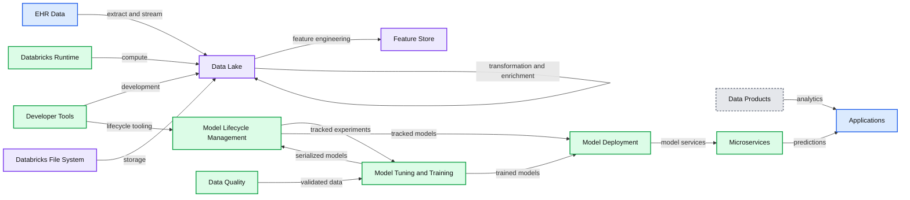
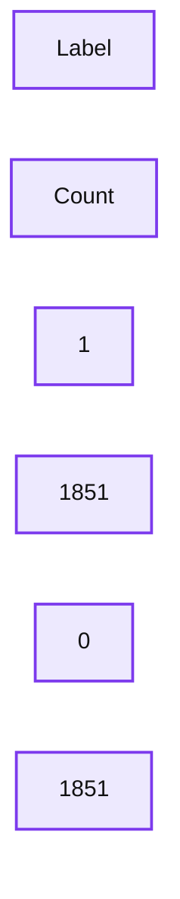

# Detecting At-risk Patients with Real World Data

*How to use the Machine Learning Runtime and MLflow on top of a health Delta Lake to predict patient disease*

- Source: https://www.databricks.com/blog/2020/10/20/detecting-at-risk-patients-with-real-world-data.html
- Published: 2020-10-20
- Authors: Amir Kermany, Frank Austin Nothaft
- Categories: engineering, solution-accelerators, data-science-machine-learning
- Images: 11 total, 5 extracted as architecture

With the rise of low cost genome sequencing and AI-enabled medical imaging, there has been substantial interest in precision medicine. In precision medicine, we aim to use data and AI to come up with the best treatment for a disease. While precision medicine has improved outcomes for patients diagnosed with rare diseases and cancers, precision medicine is reactive: the patient has to be sick for precision medicine to be deployed.

When we look at healthcare spending and outcomes, there is a tremendous opportunity to improve cost-of-care and quality of living by **preventing** chronic conditions such as diabetes, heart disease, or substance use disorders. In the United States, 7 out of 10 deaths and 85% of healthcare spending is driven by chronic conditions, and similar trends are found [in Europe](https://www.euro.who.int/__data/assets/pdf_file/0008/96632/E93736.pdf) and Southeast Asia. Noncommunicable diseases are generally preventable through patient education and by addressing underlying issues that drive the chronic condition. These issues can include underlying biological risk factors such as [known genetic risks that drive neurological conditions](https://www.databricks.com/discover/fighting-dementia-with-deep-learning), socioeconomic factors like [environmental pollution or lack of access to healthy](https://www.barhii.org/barhii-framework)[food/preventative care](https://www.barhii.org/barhii-framework), and [behavioral risks such as smoking status, alcohol consumption, or having a sedentary lifestyle](https://www.cdc.gov/pcd/issues/2015/15_0134.htm).

[***Precision prevention***](https://misuse.ncbi.nlm.nih.gov/error/abuse.shtml) is focused on using data to identify patient populations at risk of developing a disease, and then providing interventions that reduce disease risk. An intervention might include [a digital app that remotely monitors at-risk patients and provides lifestyle and treatment recommendations](https://www.databricks.com/customers/livongo), [increased monitoring of disease status](https://cancerres.aacrjournals.org/content/79/13_Supplement/916.short), or [offering supplemental preventative care](https://www.mckinsey.com/industries/healthcare-systems-and-services/our-insights/digital-health-ecosystems-a-payer-perspective). However, deploying these interventions first depends on identifying the patients at risk.

One of the most powerful tools for identifying patients at risk is the use of real world data (RWD), a term that collectively refers to data generated by the healthcare ecosystem, such as electronic medical records (EMR) and health records (EHR) from hospitalizations, clinical practices, pharmacies, healthcare providers, and increasingly data collected from other sources such as genomics, social media, and wearables. In our [last blog](https://www.databricks.com/blog/2020/04/21/building-a-modern-clinical-health-data-lake-with-delta-lake.html) we demonstrated how to build a clinical data lake from EHR data. In this blog, we build on that by using the Databricks Unified Data Analytics Platform to track a patient’s journey and create a machine learning model. Using this model, given a patient’s encounter history and demographics information, we can assess the risk of a patient for a given condition within a given window of time. In this example, we will look at drug overuse, an important topic given the [broad range of poor health outcomes driven by substance use disorders](https://www.youtube.com/watch?v=M0TcIVEEPZ0&feature=youtu.be&t=7780). By tracking our models using [MLflow](http://mlflow.org), we make it easy to track how models have changed over time, adding [confidence to the process of deploying a model into patient care](https://www.youtube.com/watch?v=AkTmABP_8Go).

## Disease prediction using machine learning on Databricks

**Summary:** Reference architecture showing EHR data flowing through a Databricks data lake, model lifecycle, deployment, microservices, applications, and developer tools.

**Components:**

- EHR Data: clinical records, streaming and batch jobs, genomic and medical data
- Data Lake: Delta Lake with landing, refined, and enriched tables
- Feature Store: reusable machine learning features
- Data Engineering: transformations and enrichments
- Model Lifecycle Management: GitHub, PKL, MLflow, and MLflow Tracking Server
- Data Quality: notebooks, Python, R, and SQL
- Model Tuning and Training: PyTorch, Keras, scikit-learn, Hyperopt, Spark MLlib, and MLflow
- Model Deployment: streaming and batch jobs, Docker
- Data Products: Redash and Tableau
- Applications: analytics and clinical applications
- Microservices: Docker and Kubernetes
- Databricks Runtime: Spark clusters and single-node data science
- Databricks File System: S3 and ADL
- Developer Tools: Databricks, IDEs, GitHub, Jenkins, and version control

**Flows:**

- EHR Data -> Data Lake: extracted clinical data
- EHR Data -> Data Lake: streaming and batch jobs
- Data Lake -> Data Lake: transformations from landing and raw tables to refined tables
- Data Lake -> Data Lake: enrichments from refined tables to enriched tables
- Data Lake -> Feature Store: feature engineering
- Model Lifecycle Management -> Model Tuning and Training: tracked and reproducible experiments
- Model Tuning and Training -> Model Lifecycle Management: serialized models
- Model Lifecycle Management -> Model Deployment: models through the MLflow Tracking Server
- Data Quality -> Model Tuning and Training: validated data
- Model Tuning and Training -> Model Deployment: trained models
- Model Deployment -> Microservices: deployed model services
- Microservices -> Applications: prediction services
- Data Products -> Applications: analytics outputs
- Developer Tools -> Data Lake: development and version control integration
- Developer Tools -> Model Lifecycle Management: experiment and deployment tooling
- Databricks Runtime -> Data Lake: runtime compute
- Databricks File System -> Data Lake: file and object storage

**Numbers:** none

source image: https://www.databricks.com/wp-content/uploads/2020/10/at-risk-ar-og.png

### Data preparation

To train a model to predict risk at a given time, we need a dataset that captures relevant demographic information about the patient (such as age at time of encounter, ethnicity etc) as well as time series data about the patient’s diagnostic history. We can then use this data to train a model that learns the diagnoses and demographic risks that influence the patient’s likelihood of being diagnosed with a disease in the upcoming time period.

**Summary:** The diagram shows relationships among EHR tables for encounters, patients, organizations, and providers.

**Components:**

- Encounters: EHR encounter records
- Patients: Patient demographics and identifiers
- Organization: Healthcare organization records
- Providers: Healthcare provider records

**Flows:**

- Encounters -> Patients: Patient reference
- Encounters -> Organization: Organization reference
- Encounters -> Providers: Provider reference
- Providers -> Organization: Organization reference

**Numbers:** none

source image: https://www.databricks.com/wp-content/uploads/2020/10/blog-detecting-patients-2.png

```mermaid
%% EHR table schemas and relationships
flowchart LR
    E[Encounters]
    P[Patients]
    O[Organization]
    V[Providers]

    E -->|Patient reference| P
    E -->|Organization reference| O
    E -->|Provider reference| V
    V -->|Organization reference| O

    subgraph Legend
        L[client edge gateway load balancer]
        S[service stateless compute]
        D[store databases durable storage]
        C[cache Redis or losable data]
        Q[queue Kafka streams async pipes]
        K[critical bottleneck or SPOF]
        X[external third party]
        T[decision trade off point]
    end

    classDef client fill:#dbeafe,stroke:#2563eb,stroke-width:2px,color:#111
    classDef service fill:#dcfce7,stroke:#16a34a,stroke-width:2px,color:#111
    classDef store fill:#ede9fe,stroke:#7c3aed,stroke-width:2px,color:#111
    classDef cache fill:#fef3c7,stroke:#d97706,stroke-width:2px,color:#111
    classDef queue fill:#cffafe,stroke:#0891b2,stroke-width:2px,color:#111
    classDef critical fill:#fee2e2,stroke:#dc2626,stroke-width:4px,color:#111
    classDef external fill:#e5e7eb,stroke:#6b7280,stroke-width:2px,color:#111,stroke-dasharray:4 3
    classDef decision fill:#fce7f3,stroke:#db2777,stroke-width:2px,color:#111

    class E,P,O,V store
    class L client
    class S service
    class D store
    class C cache
    class Q queue
    class K critical
    class X external
    class T decision
```

 Figure 1: Data schemas and relationships between tables extracted from the EHR

To train this model, we can leverage the patient's encounter records and demographic information, as would be available in an electronic health record (EHR). Figure 1 depicts the tables we will use in our workflow. These tables were prepared using [the notebooks from our previous blog](https://www.databricks.com/blog/2020/04/21/building-a-modern-clinical-health-data-lake-with-delta-lake.html). We will proceed to load encounters, organizations and patient data (with obfuscated PII information) from Delta Lake and create a dataframe of all patient encounters along with patient demographic information.

Based on the target condition, we also select a set of patients that qualify to be included in the training data. Namely, we include cases, patients that have been diagnosed with the disease at least once through their encounter history, and an equal number of controls, patients without any history of the disease.

Now we limit our set of encounters to patients included in the study.

Now that we have the records of interest, our next step is to add features. For this forecasting task, in addition to demographic information, we choose the total number of times having been diagnosed with the condition or any known coexisting conditions (comorbidities) and the number of previous encounters as historical context for a given encounter.

Although for most diseases there is extensive literature on comorbid conditions, we can also leverage the data in our real world dataset to identify comorbidities associated with the target condition.

In our code, we use [notebook widgets](https://docs.databricks.com/notebooks/widgets.html) to specify the number of comorbidities to include, as well as the length of time (in days) to look across encounters. These parameters are logged using MLflow[’s tracking API](https://www.mlflow.org/docs/latest/tracking.html).

Now we need to add comorbidity features to each encounter. Corresponding to each comorbidity we add a column that indicates how many times the condition of interest has been observed in the past, i.e.

where

We add these features in two steps. First, we define a function that adds comorbidity indicator functions (i.e. *x**i,c*):

And then we sum these indicator functions over a contiguous range of days using [Spark SQL’s powerful support for window functions](https://www.databricks.com/blog/2015/07/15/introducing-window-functions-in-spark-sql.html):

After adding comorbidity features, we need to add the target variable, which indicates whether the patient is diagnosed with the target condition in a given window of time in the future (for example a month after the current encounter). The logic of this operation is very similar to the previous step, with the difference that the window of time covers future events. We only use a binary label, indicating whether the diagnosis we are interested in will occur in the future or not.

Now we write these features into a feature store within Delta Lake. To ensure reproducibility, [we add the mlflow experiment ID and the run ID as a column to the feature store](https://www.databricks.com/blog/2019/08/14/productionizing-machine-learning-with-delta-lake.html). The advantage of this approach is that we receive more data, we can add new features to the featurestore that can be re-used to refer to in the future.

### Controlling for quality issues in our data

Before we move ahead with the training task, we take a look at the data to see how different labels are distributed among classes. In many applications of binary classification, one class can be rare, for example in disease prediction. This class imbalance will have a negative impact on the learning process. During the estimation process, the model tends to focus on the majority class at the expense of rare events. Moreover, the evaluation process is also compromised. For example, in an imbalance dataset with 0/1 labels distributed as 95% and %5 respectively,  a model that always predicts 0, would have an accuracy of 95%. If the labels are imbalanced, then we need to apply [one of the common techniques](https://www.kdnuggets.com/2017/06/7-techniques-handle-imbalanced-data.html) for correcting for imbalanced data.

source image: https://www.databricks.com/wp-content/uploads/2020/10/blog-detecting-patients-6.png

Looking at our training data, we see (Figure 2) that this is a very imbalanced dataset: over 95% of the observed time windows do not show evidence of a diagnosis. To adjust for imbalance, we can either downsample the control class or generate synthetic samples. This choice depends on the dataset size and the number of features. In this example, we downsample the majority class to obtain a balanced dataset. Note that in practice, you can choose a combination of methods, for example downsample the majority class and also [assign class weights in your training algorithm](https://scikit-learn.org/stable/modules/generated/sklearn.utils.class_weight.compute_sample_weight.html#sklearn-utils-class-weight-compute-sample-weight).

**Summary:** A table shows a balanced dataset with equal counts for labels 1 and 0.

**Components:**

- Label column: class labels
- Count column: observation counts
- Row 1: label 1 with count 1851
- Row 2: label 0 with count 1851

**Flows:**

- none

**Numbers:** 1, 2, 0, 1851, 1851

source image: https://www.databricks.com/wp-content/uploads/2020/10/blog-detecting-patients-7.png

### Model training

To train the model, we augment our conditions with a subset of demographic and comorbidity features, apply labels to each observation, and pass this data to a model for training downstream. For example, here we augment our recent diagnosed comorbidities with Encounter Class (e.g., was this appointment for preventative care or was it an ER visit?, ), and the cost of the visits, and for demographic information, we choose Race, Gender, Zip and the patient's age at the time of the encounter.

Most often, although the original clinical data can add up to terabytes, after performing filtering and limiting records based on inclusion/exclusion criteria, we end up with a dataset that can be trained on a single machine. We can easily transform spark dataframes to [pandas dataframes](https://www.databricks.com/glossary/pandas-dataframe) and train a model based on any algorithm of choice. When using the [Databricks ML runtime](https://docs.databricks.com/runtime/mlruntime.html), we have access to a wide range of open ML libraries readily available.

Any machine learning algorithm takes a set of parameters (hyper parameters), and depending on the input parameters the score can change. In addition, in some cases wrong parameters or algorithms can result in overfitting. To ensure that the model performs well,  we use [hyperparameter tuning](https://en.wikipedia.org/wiki/Hyperparameter_optimization) to choose the best model architecture and then we will train the final model by specifying the parameters that were obtained from this step.

To perform model tuning, we first need to pre-process the data. In this dataset, in addition to numeric features (counts of recent comorbidities for example), we also have the categorical demographic data that we would like to use. For categorical data, the best approach is to use [one-hot-encoding](https://en.wikipedia.org/wiki/One-hot). There are two main reasons for this: first, most classifiers (logistic regression in this case), operate on numeric features. Second, if we simply convert categorical variables to numeric indices, it would introduce ordinality in our data which can mislead the classifier: for example, if we convert states names to indices, e.g. California to 5 and New York to 23, then New York becomes “bigger” than California. While this reflects the index of each state name in an alphabetized list, in the context of our model, this ordering does not mean anything. One-hot-encoding eliminates this effect.

The pre-processing step in this case does not take any input parameters and  hyperparameters only affect the classifier and not the preprocessing part. Hence, we separately perform pre-processing and then use the resulting dataset for model tuning:

Next, we would like to choose the best parameters to the model. For this classification, we use [LogisticRegression](https://scikit-learn.org/stable/modules/generated/sklearn.linear_model.LogisticRegression.html) with [elastic net penalization](https://en.wikipedia.org/wiki/Elastic_net_regularization). Note that after applying one-hot-encoding, depending on the cardinality of the categorical variable in question, we can end up with many features which can surpass the number of samples. To avoid overfitting for such problems, a penalty is applied to the objective function. The advanaget of elastic net regularization is that it combines two penalization techniques ([LASSO](https://en.wikipedia.org/wiki/Lasso_(statistics)) and [Ridge Regression](https://en.wikipedia.org/wiki/Tikhonov_regularization)) and the degree of the mixture can be controlled by a single variable, during hyperparameter tuning.

To improve on the model, we search a grid of hyperparameters using [hyperopt](https://github.com/hyperopt/hyperopt) to find the best parameters. In addition, we use the [SparkTrials](http://hyperopt.github.io/hyperopt/scaleout/spark/) mode of hyperopt to perform the hyperparameter search in parallel.This process leverages Databricks’ managed MLflow to automatically log parameters and metrics corresponding to each hyperparameter run. To validate each set of parameters, we use a *k*-fold cross validation skim using [F1 score](https://en.wikipedia.org/wiki/F1_score)as the metric to assess the model. Note that since *k*-fold cross validation generates multiple values, we choose the minimum of the scores (the worst case scenario) and try to maximize that when we use hyperopt.

To improve our search over the space, we choose the grid of parameters in logspace and define a transformation function to convert the suggested parameters by hyperopt. For a great overview of the approach and why we chose to define the hyperparameter space like this, look at [this talk](https://www.databricks.com/session_na20/introducing-mlflow-for-end-to-end-machine-learning-on-databricks) that covers how you can manage the end-to-end ML life cycle on Databricks.

The outcome of this run is the best parameters, assessed based on the F1-score from our cross validation.

Now let’s take a look at the MLflow dashboard. MLflow automatically groups all runs of the hyperopt together and we can use a variety of plots to inspect the impact of each hyperparameter on the loss function, as shown in Figure 3. This is particularly important for getting a better understanding of the behavior of our model and the effect of the hyperparameters. For example, we noted that lower values for C, the inverse of regularization strength, result in higher values for F1.

**Summary:** Parallel coordinates plot showing model hyperparameters C, l1_ratio, and tol against loss.

**Components:**

- C axis showing regularization parameter values
- l1_ratio axis showing L1 ratio values
- tol axis showing tolerance values
- loss axis showing model loss
- Color scale encoding loss values

**Flows:**

- C -> l1_ratio: plotted model trial
- l1_ratio -> tol: plotted model trial
- tol -> loss: plotted model result

**Numbers:** C: -0.06164, -0.50000, -1.00000, -1.50000, -1.99754. l1_ratio: -1.00609, -1.50000, -2.00000, -2.50000, -2.92011. tol: -0.00144, -0.50000, -1.00000, -1.50000, -2.00000, -2.50000, -2.99063. loss: -0.91382, -0.91500, -0.92000, -0.92500, -0.93000, -0.93500, -0.94000, -0.94500, -0.94752.

source image: https://www.databricks.com/wp-content/uploads/2020/10/blog-detecting-patients-9.png

 Fig 3. Parallel coordinates plots for our models in MLflow.

After finding the optimal parameter combinations, we train a binary classifier with the optimal hyperparameters and log the model using MLflow. MLflow’s [model api](https://www.mlflow.org/docs/latest/models.html) makes it easy to store a model, regardless of the underlying library that was used for training, as a python function that can later be called during model scoring. To help with model discoverability, we log the model with a name associated with the target condition (for example in this case, “drug-overdose”).

Now, we can train the model by passing the best params obtained from the previous step.

Note that for model training, we have included preprocessing (one hot encoding) as part of the sklearn pipeline and log the encoder and classifier as one model. In the next step, we can simply call the model on patient data and assess their risk.

### Model deployment and productionalization

After training the model and logging it to MLflow, the next step is to use the model for scoring new data. One of the features of MLflow is that you can search through experiments based on different tags. For example, in this case we use the run name that was specified during model training to retrieve the artifact URI of the trained models. We can then order the retrieved experiments based on key metrics.

Once we have chosen a specific model, we can then load the model by specifying the model URI and name:

We can also use Databricks’s model registry to manage model versions, production lifecycle and also easy model serving.

## Translating disease prediction into precision prevention

In this blog, we walked through the need for a precision prevention system that identifies clinical and demographic covariates that drive the onset of chronic conditions. We then looked at an end-to-end machine learning workflow that used simulated data from an EHR to identify patients who were at risk of drug overdose. At the end of this workflow, we were able to export the ML model we trained from MLflow, and we applied it to a new stream of patient data.

While this model is informative, it doesn’t have impact until translated into practice. In real world practice, we have worked with a number of customers to deploy these and similar systems into production. For instance, at the Medical University of South Carolina, they were able to deploy live-streaming pipelines that processed EHR data to identify patients at risk of sepsis. This led to detection of sepsis-related patient decline 8 hours in advance. In a similar system at INTEGRIS Health, EHR data was monitored for emerging signs of pressure ulcer development. In both settings, whenever a patient was identified, a care team was alerted to their condition. In the health insurance setting, we have worked with Optum to deploy a similar model. They were able to develop a disease prediction engine that used recurrent neural networks in a long-term short-term architecture to identify disease progression with good generalization across nine different disease areas. This model was used to align patients with preventative care pathways, leading to improved outcomes and cost-of-care for chronic disease patients.

While most of our blog has focused on the use of disease prediction algorithms in healthcare settings, there is also a strong opportunity to build and deploy these models in a pharmaceutical setting. Disease prediction models can provide insights into how drugs are being used in a postmarket setting, and even detect previously undetected protective effects that can [inform label expansion efforts](https://www.clinicalleader.com/doc/real-world-data-expanding-into-label-expansion-0001). Additionally, [disease prediction models can be useful when looking at clinical trial enrollment for rare—or otherwise underdiagnosed—diseases](https://respiratory-research.biomedcentral.com/articles/10.1186/s12931-018-0882-0). By creating a model that looks at patients who were misdiagnosed prior to receiving a rare disease diagnosis, we can create educational material that educates clinicians about common misdiagnosis patterns and hopefully create trial inclusion criteria that leads to increased trial enrollment and higher efficacy.

## Get started With precision prevention on a health Delta Lake

In this blog, we demonstrated how to use machine learning on real-world data to identify patients at risk of developing a chronic disease. To learn more about using Delta Lake to store and process clinical datasets, download our [free eBook on working with real world clinical datasets](https://pages.databricks.com/201910-EB-Real-World-Evidence.html). You can also start a free trial today using the [patient risk scoring notebooks](https://www.databricks.com/solutions/accelerators/real-world-evidence) from this blog.
