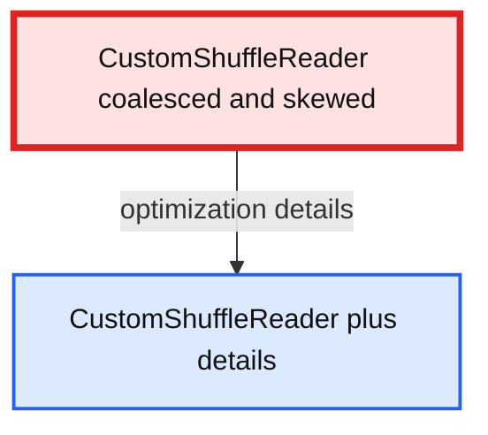
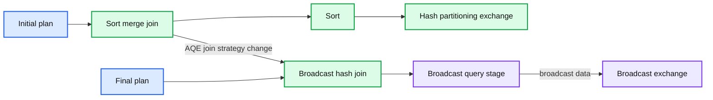
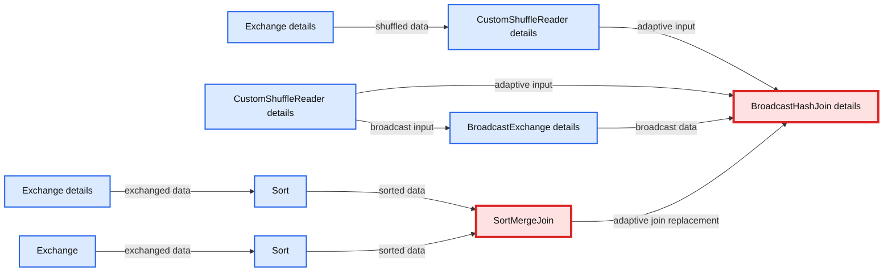
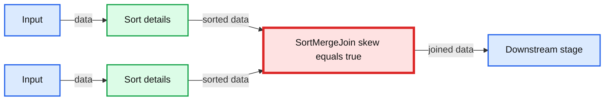
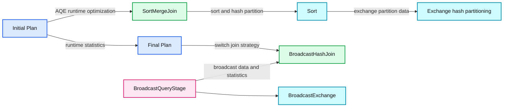

# Faster SQL: Adaptive Query Execution in Databricks

- Source: https://www.databricks.com/blog/2020/10/21/faster-sql-adaptive-query-execution-in-databricks.html
- Published: 2020-10-21
- Authors: MaryAnn Xue, Allison Wang
- Categories: engineering, open-source
- Images: 8 total, 8 extracted as architecture

Earlier this year, Databricks wrote a blog on [the whole new Adaptive Query Execution framework](https://www.databricks.com/blog/2020/05/29/adaptive-query-execution-speeding-up-spark-sql-at-runtime.html) in Spark 3.0 and Databricks Runtime 7.0. The blog has sparked a great amount of interest and discussions from tech enthusiasts. Today, we are happy to announce that Adaptive Query Execution (AQE) has been enabled by default in our latest release of Databricks Runtime, DBR 7.3.

AQE is an execution-time SQL optimization framework that aims to counter the inefficiency and the lack of flexibility in query execution plans caused by insufficient, inaccurate, or obsolete optimizer statistics. As we continue our effort to expand AQE functionalities, below are the specific use cases you can find AQE most effective in its current status.

 

 Check out the [Why the Data Lakehouse is Your Next Data Warehouse ebook](https://www.databricks.com/resources/ebook/bring-data-warehousing-data-lakes?itm_data=sqladaptivequeryblog-textpromo-whylakehouseisnextdw) to discover the inner workings of the Databricks Lakehouse Platform.

## Optimizing Shuffles

While Spark shuffles are a crucial part of the query performance, finding the right *shuffle partition number* has always been a big struggle for Spark users. That is because the amount of data varies from query to query, or even from stage to stage within the same query, and using the same *shuffle partition number* can lead to either small tasks that make inefficient use of the Spark scheduler, or otherwise big tasks that may end up with excessive garbage collection (GC) overhead and disk spilling.

Now, AQE adjusts the *shuffle partition number* automatically at each stage of the query, based on the size of the map-side shuffle output. So as data size grows or shrinks over different stages, the task size will remain roughly the same, neither too big nor too small.

However, it is important to note that AQE does not set the map-side partition number automatically. This means in order for this AQE feature to work perfectly, it is recommended that the user set a relatively high number of initial *shuffle partition number* through the SQL config `spark.sql.shuffle.partitions`. Or, as an alternative, they can enable Databricks edge feature “Auto-Optimized Shuffle” by setting config `spark.databricks.adaptive.autoOptimizeShuffle.enabled` to `true`.

## Choosing Join Strategies

One of the most important cost-based decisions made in the Spark optimizer is the selection of join strategies, which is based on the size estimation of the join relations. But since this estimation can go wrong in both directions, it can either result in a less efficient join strategy because of overestimation, or even worse, out-of-memory errors because of underestimation.

AQE offers a trouble-free solution here by switching to the faster broadcast hash join during execution time.

## Handling Skew Joins

Data skew is a common problem in which data is unevenly distributed, causing bottlenecks and significant performance downgrade, especially with sort merge joins. Those individual long running tasks will become stragglers, slowing down the entire stage. And on top of that, spilling data out of memory onto disk usually happens in those skew partitions, worsening the effect of the slowdown.

The unpredictable nature of the data skew often makes it hard for the static optimizer to handle skew automatically, or even with the help of querying hints. By collecting runtime statistics, AQE can now detect skew joins at runtime and split skew partitions into smaller sub-partitions, thus eliminating the negative impact of skew on query performance.

## Understand AQE Query Plans

One major difference for the AQE query plan is that it often evolves as execution progresses. Several AQE specific plan nodes are introduced to provide more details about the execution. Furthermore, AQE uses a new query plan string format that can show both the initial and the final query execution plans. This section will help users get familiar with the new AQE query plan, and show users how to identify the effects of AQE on the query.

### The AdaptiveSparkPlan Node

AQE-applied queries usually have one or more AdaptiveSparkPlan nodes as the root node of each query or subquery. Before or during the execution, the `isFinalPlan` flag will show as `false`. Once the query is completed, this flag will turn to `true` and the plan under the AdaptiveSparkPlan node will no longer change.

**Summary:** The diagram shows an AdaptiveSparkPlan changing from `isFinalPlan=false` to `isFinalPlan=true` after query completion.

**Components:**

- AdaptiveSparkPlan: Apache Spark SQL adaptive query execution plan.
- isFinalPlan=false: Pre-completion plan state.
- isFinalPlan=true: Completed, finalized plan state.

**Flows:**

- isFinalPlan=false -> AdaptiveSparkPlan: Initial adaptive plan state.
- AdaptiveSparkPlan -> isFinalPlan=true: Query completion finalizes the plan.
- isFinalPlan=true -> AdaptiveSparkPlan: Final adaptive plan remains attached.

**Numbers:** none

```mermaid
%% Shows the AdaptiveSparkPlan state before and after query completion
flowchart TD
    initial[AdaptiveSparkPlan isFinalPlan=false]
    initial_plan[AdaptiveSparkPlan]
    final[AdaptiveSparkPlan isFinalPlan=true]
    final_plan[AdaptiveSparkPlan]

    initial -->|initial plan state| initial_plan
    initial_plan -->|query completes| final
    final -->|finalized plan state| final_plan

    classDef client fill:#dbeafe,stroke:#2563eb,stroke-width:2px,color:#111
    classDef service fill:#dcfce7,stroke:#16a34a,stroke-width:2px,color:#111
    classDef store fill:#ede9fe,stroke:#7c3aed,stroke-width:2px,color:#111
    classDef cache fill:#fef3c7,stroke:#d97706,stroke-width:2px,color:#111
    classDef queue fill:#cffafe,stroke:#0891b2,stroke-width:2px,color:#111
    classDef critical fill:#fee2e2,stroke:#dc2626,stroke-width:4px,color:#111
    classDef external fill:#e5e7eb,stroke:#6b7280,stroke-width:2px,color:#111,stroke-dasharray:4 3
    classDef decision fill:#fce7f3,stroke:#db2777,stroke-width:2px,color:#111

    class initial,final decision
    class initial_plan,final_plan service
``

<sub>source image: https://www.databricks.com/wp-content/uploads/2020/10/blog-adaptive-query-1.png</sub>

### The CustomShuffleReader Node

The CustomShuffleReader node is the key to AQE optimizations. It can dynamically adjust the post shuffle partition number based on the statistics collected during the shuffle map stage. In the Spark UI, users can hover over the node to see the optimizations it applied to the shuffled partitions.

When the flag of CustomShuffleReader is `coalesced`, it means AQE has detected and coalesced small partitions after the shuffle based on the target partition size. Details of this node shows the number of shuffle partitions and partition sizes after the coalesce.

**Summary:** The image shows Spark UI details for a coalesced CustomShuffleReader after AQE combines small shuffle partitions.

**Components:**

- CustomShuffleReader using Apache Spark AQE
- Coalesced partition optimization
- Shuffle partition details table

**Flows:**

- Shuffle partitions -> CustomShuffleReader: coalesced partition data

**Numbers:** 20.0 stages; 11 partitions; 421.4 KiB total; minimum 14.7 KiB; median 40.3 KiB; maximum 42.0 KiB

```mermaid
%% Shows Spark AQE coalesced shuffle reader details
flowchart LR
    A[Shuffle partitions] -->|coalesced| B[CustomShuffleReader]
    B -->|shows details| C[Stages 20.0]
    B -->|reports sizes| D[11 partitions]
    D -->|partition data size| E[421.4 KiB total]
    E -->|min median max| F[14.7 KiB 40.3 KiB 42.0 KiB]

    classDef client fill:#dbeafe,stroke:#2563eb,stroke-width:2px,color:#111
    classDef service fill:#dcfce7,stroke:#16a34a,stroke-width:2px,color:#111
    classDef store fill:#ede9fe,stroke:#7c3aed,stroke-width:2px,color:#111
    classDef cache fill:#fef3c7,stroke:#d97706,stroke-width:2px,color:#111
    classDef queue fill:#cffafe,stroke:#0891b2,stroke-width:2px,color:#111
    classDef critical fill:#fee2e2,stroke:#dc2626,stroke-width:4px,color:#111
    classDef external fill:#e5e7eb,stroke:#6b7280,stroke-width:2px,color:#111,stroke-dasharray:4 3
    classDef decision fill:#fce7f3,stroke:#db2777,stroke-width:2px,color:#111
    class A queue
    class B service
    class C,D,E,F store
```

<sub>source image: https://www.databricks.com/wp-content/uploads/2020/10/blog-adaptive-query-2.png</sub>

When the flag of CustomShuffleReader is `skewed`, it means AQE has detected data skew in one or more partitions before a sort-merge join operation. Details of this node shows the number of skewed partitions as well as the total number of new partitions splitted from the skewed partitions.

**Summary:** AQE identifies a skewed shuffle reader with 231 partitions, one skewed partition, and 32 splits.

**Components:**

- CustomShuffleReader, Apache Spark AQE component
- Skewed partition details, showing partition statistics

**Flows:**

- CustomShuffleReader -> Skewed partition details: shows skew and partition statistics

**Numbers:** 7.0; 231; 8.8 GiB; 13.0 MiB; 13.0 MiB; 13.0 MiB; 199.2 MiB; 1; 32

```text
%% mermaid failed to render; kept as text
%% Shows AQE skew detection and shuffle partition details
flowchart TD
    A[CustomShuffleReader skewed] -->|shows details| B[Stages 7.0]
    B --> C[Number of partitions 231]
    B --> D[Partition data size total 8.8 GiB]
    B --> E[Minimum 13.0 MiB]
    B --> F[Median 13.0 MiB]
    B --> G[Maximum 199.2 MiB]
    B --> H[Number of skewed partitions 1]
    B --> I[Number of skewed partition splits 32]

    classDef client fill:#dbeafe,stroke:#2563eb,stroke-width:2px,color:#111
    classDef service fill:#dcfce7,stroke:#16a34a,stroke-width:2px,color:#111
    classDef store fill:#ede9fe,stroke:#7c3aed,stroke-width:2px,color:#111
    classDef cache fill:#fef3c7,stroke:#d97706,stroke-width:2px,color:#111
    classDef queue fill:#cffafe,stroke:#0891b2,stroke-width:2px,color:#111
    classDef critical fill:#fee2e2,stroke:#dc2626,stroke-width:4px,color:#111
    classDef external fill:#e5e7eb,stroke:#6b7280,stroke-width:2px,color:#111,stroke-dasharray:4 3
    classDef decision fill:#fce7f3,stroke:#db2777,stroke-width:2px,color:#111
    A critical
    B service
    C,D,E,F,G,H,I store
```

<sub>source image: https://www.databricks.com/wp-content/uploads/2020/10/blog-adaptive-query-3.png</sub>

Both effects can also take place at the same time:

**Summary:** AQE shows a CustomShuffleReader simultaneously marked as coalesced and skewed, with additional details available.

**Components:**

- CustomShuffleReader coalesced and skewed
- CustomShuffleReader plus details

**Flows:**

- CustomShuffleReader coalesced and skewed -> CustomShuffleReader plus details: optimization details

**Numbers:** none



<sub>source image: https://www.databricks.com/wp-content/uploads/2020/10/blog-adaptive-query-4.png</sub>

### Detecting Join Strategy Change

A join strategy change can be identified by comparing changes in query plan join nodes before and after the AQE optimizations. In DBR 7.3, AQE query plan string will include both the initial plan (the plan before applying any AQE optimizations) and the current or the final plan. This provides better visibility into the optimizations AQE applied to the query. Here is an example of the new query plan string that shows a broadcast-hash join being changed to a sort-merge join:

**Summary:** The image shows AQE changing an initial sort merge join into a final broadcast hash join based on runtime statistics.

**Components:**

- Adaptive Spark plan using AQE
- Final plan
- Broadcast hash join
- Broadcast query stage
- Broadcast exchange
- Initial plan
- Sort merge join
- Sort
- Hash partitioning exchange

**Flows:**

- Initial sort merge join -> Final broadcast hash join: AQE join strategy change
- Broadcast query stage -> Broadcast exchange: Broadcast data

**Numbers:** 3, 13, 23, 2, 1024.0 KiB, 1, 5, 117, 0



<sub>source image: https://www.databricks.com/wp-content/uploads/2020/10/blog-adaptive-query-5.png</sub>

The Spark UI will only display the current plan. In order to see the effects using the Spark UI, users can compare the plan diagrams before the query execution and after execution completes:

**Summary:** The diagram compares a pre-execution sort-merge join plan with a post-execution adaptive plan using a broadcast-hash join inside WholeStageCodegen.

**Components:**

- Exchange +details: Spark data exchange
- Sort: Spark sort operation
- SortMergeJoin: Spark sort-merge join
- CustomShuffleReader +details: Adaptive shuffle reader
- CustomShuffleReader +details: Adaptive shuffle reader
- BroadcastExchange +details: Spark broadcast exchange
- BroadcastHashJoin +details: Spark broadcast-hash join
- WholeStageCodegen: Spark code generation stage

**Flows:**

- Exchange +details -> Sort: exchanged data
- Sort -> SortMergeJoin: sorted data
- Exchange -> Sort: exchanged data
- Sort -> SortMergeJoin: sorted data
- Exchange +details -> CustomShuffleReader +details: shuffled data
- CustomShuffleReader +details -> BroadcastHashJoin +details: adaptive input
- CustomShuffleReader +details -> BroadcastHashJoin +details: adaptive input
- BroadcastExchange +details -> BroadcastHashJoin +details: broadcast data
- SortMergeJoin -> BroadcastHashJoin +details: adaptive join replacement

**Numbers:**

- WholeStageCodegen stage count: 3
- Duration: 4.7 m
- Stages: 10.0



<sub>source image: https://www.databricks.com/wp-content/uploads/2020/10/blog-adaptive-query-6.png</sub>

### Detecting Skew Join

The effect of skew join optimization can be identified via the join node name.

In the Spark UI:

**Summary:** The diagram shows Spark’s adaptive execution plan using two sort stages feeding a skew-aware sort-merge join within WholeStageCodegen.

**Components:**

- Sort stage on the left
- Sort stage on the right
- WholeStageCodegen stage
- Skew-aware SortMergeJoin

**Flows:**

- Input -> Left sort: data
- Input -> Right sort: data
- Left sort -> SortMergeJoin: sorted data
- Right sort -> SortMergeJoin: sorted data
- SortMergeJoin -> Downstream stage: joined data

**Numbers:** 3; 15.2 m; 18.0



<sub>source image: https://www.databricks.com/wp-content/uploads/2020/10/blog-adaptive-query-7.png</sub>

In the query plan string:

**Summary:** The image shows AQE switching an initial sort merge join to a final broadcast hash join using runtime statistics.

**Components:**

- Initial Plan with SortMergeJoin
- Sort operator
- Exchange hash partitioning
- Final Plan with BroadcastHashJoin
- BroadcastQueryStage
- BroadcastExchange
- Runtime statistics

**Flows:**

- Initial Plan -> Final Plan: AQE changes the join strategy
- BroadcastQueryStage -> BroadcastHashJoin: runtime statistics enable broadcast execution

**Numbers:** 3, 13, 23, 2, 1024.0 KiB, 1, 5, 0, 117



<sub>source image: https://www.databricks.com/wp-content/uploads/2020/10/blog-adaptive-query-8.png</sub>

Adaptive query execution incorporates runtime statistics to make query execution more efficient. Unlike other optimization techniques, it can automatically pick an optimal post shuffle partition size and number, switch join strategies, and handle skew joins. Learn more about AQE in the Spark + AI Summit 2020 talk: [Adaptive Query Execution: Speeding Up Spark SQL at Runtime](https://www.databricks.com/session_na20/adaptive-query-execution-speeding-up-spark-sql-at-runtime) and the [AQE user guide](https://docs.databricks.com/spark/latest/spark-sql/aqe.html). Get started today and try out the new AQE features in Databricks Runtime 7.3.
