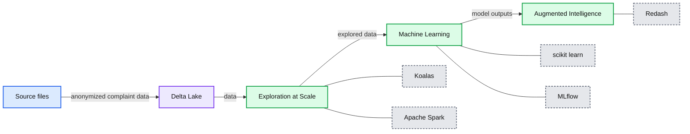
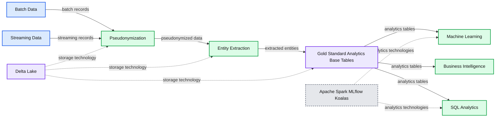
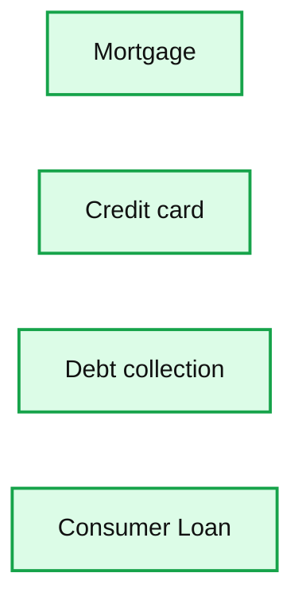
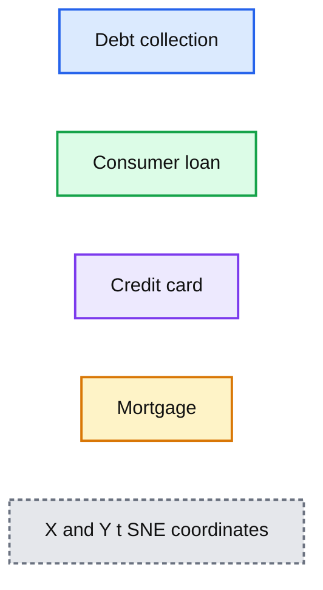
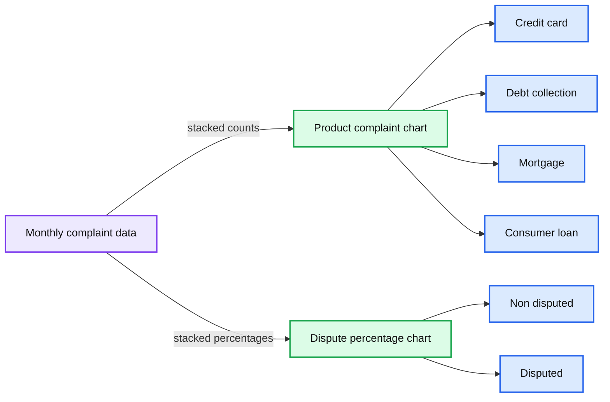

# Reputation Risk: Improving Business Competency and Nurturing Happy Customers by Building a Risk Analysis Engine

- Source: https://www.databricks.com/blog/2020/10/26/reputation-risk-improving-business-competency-and-nurturing-happy-customers-by-building-a-risk-analysis-engine.html
- Published: 2020-10-26
- Authors: Sri Ghattamaneni
- Categories: engineering, data-science-machine-learning, solution-accelerators
- Images: 10 total, 6 extracted as architecture

## Why reputation risk matters?

When it comes to the term "risk management", Financial Service Institutions (FSI) have seen guidance and frameworks around capital requirements from Basel standards. But, none of these guidelines mention reputation risk and for years organizations have lacked a clear way to manage and measure non-financial risks such as reputation risk. Given how the conversation has shifted recently towards the importance of Environmental, Social and Governance (ESG), companies must bridge the reputation-reality gap and ensure processes are in place to adapt to changing beliefs and expectations from stakeholders and customers.

 

For a FSI, reputation is arguably its most important asset.

 

For financial institutions, reputation is arguably its most important asset. For example, Goldman Sachs’ renowned business principles states that “Our assets are our people, capital and reputation. If any of these are ever diminished, the last is the most difficult to restore”. In commercial banking, for example, brands that act on consumer complaints and feedback are able to manage the legal, commercial, and reputation risks better than their competitors. American Banker published [this article](https://www.americanbanker.com/opinion/managing-reputation-risk-is-getting-more-complicated) which re-iterates that non-financial risks, such as reputation risk, are critical factors for FSIs to address in a rapidly changing landscape.

The process of winning a customer’s trust typically involves harnessing vast amounts of data through multiple disparate channels to mine for insights related to issues that may adversely impact a brand’s reputation. Despite the importance of data in nurturing happier customers, most organizations struggle to architect a platform that solves fundamental challenges related to data privacy, scale, and model governance as typically seen in the financial services industry.

In this blog post, we will demonstrate how to leverage the power of Databricks’ Unified Data Analytics Platform to solve those challenges, unlock insights, and initiate remediation actions. We will look at [Delta Lake](https://www.databricks.com/product/delta-lake-on-databricks)which is an open source storage layer that brings reliability and performance to data lakes and easily allows compliance around GDPR and CCPA regulations whether it is structured data or unstructured data. [Machine Learning Runtime](https://www.databricks.com/product/machine-learning-runtime) and [Managed MLflow](https://www.databricks.com/product/managed-mlflow)are also part of Databricks’ Unified Analytics platform which we cover in this blog post that enables Data Scientists and Business Analysts to leverage popular open source machine learning and governance frameworks to build and deploy state-of-the-art machine learning models. This approach to reputation risk enables FSIs to measure brand perception and brings together multiple stakeholders to work collaboratively to drive higher levels of customer satisfaction and trust.

**Summary:** Unified risk architecture flowing from anonymization and ETL through Delta Lake, exploration, machine learning, and augmented intelligence.

**Components:**

- Anonymization and ETL: ingestion and data preparation
- Delta Lake: durable data storage
- Exploration at Scale: Koalas and Apache Spark
- Machine Learning: scikit-learn and MLflow
- Augmented Intelligence: Redash

**Flows:**

- Source files -> Delta Lake: anonymized customer complaint data
- Delta Lake -> Exploration at Scale: data for large-scale exploration
- Exploration at Scale -> Machine Learning: explored data
- Machine Learning -> Augmented Intelligence: machine learning outputs

**Numbers:** 1, 2, 3, 4

source image: https://www.databricks.com/wp-content/uploads/2020/10/reprisk-blog-2.png

Databricks Unified Risk Architecture for assessing reputational risk.

This blog post references notebooks which cover the multiple data engineering and data science challenges that must be addressed to effectively modernize reputation risk management practices:

- Using Delta Lake to ingest anonymized customer complaints in real time
- Explore customer feedback at scale using Koalas
- Leverage AI and open source to enable proactive risk management
- Democratizing AI to risk and advocacy teams using SQL and Business Intelligence (BI) / Machine Learning (ML) reports

## Harnessing cloud storage

Object storage has been a boon to organizations looking to park massive amounts of data at a cheaper cost when compared to traditional data warehouses. But, this comes with operational overhead. When data arrives in rapid volumes, managing this data becomes a huge challenge as often corrupt and unreliable data points lead to inconsistencies that are hard to correct at later points in time.

This has been a major pain-point for many FSIs who have started on an AI journey to develop solutions that enable faster insights and get more from the data that is being collected. Managing reputation risk requires major effort by organizations to measure customer satisfaction and brand perception. Taking a data + AI approach to preserving customer trust requires infrastructure that can support storing massive amounts of customer data in a secure manner, ensuring no personally identifiable information (PII) is exploited, and full compliance with PCI-DSS regulation. While securing and storing the data is only the beginning, performing exploration at scale on millions of complaints and building models that provide prescriptive insights are key to a successful implementation.

As a unified data analytics platform, Databricks not only allows the ingestion and processing of large amounts of data but also enables users to apply AI - at scale - to uncover insights about reputation and customer perceptions. Throughout this blog post, we will ingest data from the Consumer Finance Protection Bureau (CFPB) and build data pipelines to better explore product feedback from consumers using Delta Lake and Koalas API. Open-source libraries will be used to build and deploy ML models in order to classify and measure customer complaint severity across various products and services. By unifying batch and streaming, complaints can be categorized and re-routed to the appropriate advocacy teams in real-time, leading to better management of incoming complaints and greater customer satisfaction.

## Establishing gold data standards

As Databricks already leverages all the security tools provided by the cloud vendors, Apache SparkTM and Delta Lake offer additional enhancements such as data quarantine and schema enforcement to maintain and protect the quality of data in a timely manner. We will be using Spark to read in the complaints data by using a schema and persist it to Delta Lake. In this process, we also provide a path to bad records which may be caused due to schema mismatch, data corruption or syntax errors into a separate location which could then be investigated later for consistency.

It is well known that sensitive data like PII is a major threat and increases the attack surface for any enterprise. [Pseudonymization](https://docs.databricks.com/security/privacy/gdpr-delta.html#use-delta-lake-to-pseudonymize-customer-data), along with ACID transactional capabilities and data retention enforcement based on time, help us maintain data compliance when using Delta Lake for specific column based operations. However, this becomes a real challenge with unstructured data where each complaint could be a transcript from an audio call, web chat, e-mail and contain personal information such as customer first and last names, not to mention the right for consumers to be forgotten (such as GDPR compliance). In the example below, we demonstrate how organizations can leverage natural language processing (NLP) techniques to anonymize highly unstructured records whilst preserving their semantic value (i.e. replacing a mention of name should preserve the underlying meaning of a consumer complaint).

Using open-source libraries like spaCy, organizations can extract specific entities such as customer and agent names, but also Social Security Numbers (SSN), Account Number, and other PII (such as names in the example below).

Example of how Databricks’ reputational risk framework uses Spacy to highlight entities.

In the code below, we show how a simple anonymization strategy based on natural language processing technique can be enabled as a [user-defined function](https://www.databricks.com/blog/2020/05/20/new-pandas-udfs-and-python-type-hints-in-the-upcoming-release-of-apache-spark-3-0.html) (UDF).

By understanding the semantic value of each word (e.g. a name) through NLP, organizations can easily obfuscate sensitive information from unstructured data as per the example below.

With Databricks’ approach to reputational risk assessment, more advanced entity recognition models can be applied to obfuscate sensitive information from an unstructured dataset.

This method can scale really well to handle multiple streams of data in real-time as well as batch processing to continuously update and maintain the state of the latest information in the target Delta table to be consumed by data scientists and business analysts for further analysis.

**Summary:** The diagram shows batch and streaming data flowing through pseudonymization and entity extraction into Delta Lake gold standard analytics tables for machine learning, business intelligence, and SQL analytics.

**Components:**

- Batch Data
- Streaming Data
- Pseudonymization using Delta Lake
- Entity Extraction using Delta Lake
- Gold Standard Analytics Base Tables using Delta Lake
- Machine Learning using MLflow
- Business Intelligence
- SQL Analytics using Apache Spark
- Koalas

**Flows:**

- Batch Data -> Pseudonymization: batch records
- Streaming Data -> Pseudonymization: streaming records
- Pseudonymization -> Entity Extraction: pseudonymized data
- Entity Extraction -> Gold Standard Analytics Base Tables: extracted entities
- Gold Standard Analytics Base Tables -> Machine Learning: analytics tables
- Gold Standard Analytics Base Tables -> Business Intelligence: analytics tables
- Gold Standard Analytics Base Tables -> SQL Analytics: analytics tables

**Numbers:** none

source image: https://www.databricks.com/wp-content/uploads/2020/10/reprisk-blog-5.png

Databricks increases data controls and quality in real time, enabling data engineers, data scientists, and business analysts to collaborate on a unified data analytics platform.

Such a practical approach to data science demonstrates the need for organizations to break the silos that exist between traditional data science activities and day to day data operations, bringing all personas within the same data and analytics platform.

## Measuring brand perception and customer sentiment

With better reputation management systems, FSIs can build superior customer experience by tracking and isolating customer feedback to certain products and services offered by the institution. This not only helps discover problem areas but also helps internal teams be more proactive and reach out to customers in distress. In order to better understand data, data scientists traditionally sample large data sets to produce smaller sets that they can explore in greater depth (sometimes on their laptops) using tools they are familiar with, such as [Pandas dataframe](https://www.databricks.com/glossary/pandas-dataframe) and Matplotlib visualizations. In order to minimize data movement across platforms (therefore minimizing the risk associated with moving data) and maximize the efficiency and effectiveness of exploratory data analysis at scale, [Koalas](https://koalas.readthedocs.io/en/latest/) can be used to explore all of your data with a syntax data scientists are most familiar with (similar to Pandas).

In the below example, we explore all of J.P Morgan Chase’s complaints using simple Pandas-like syntax while still utilizing the distributed Spark engine under the hood.

**Summary:** Bar chart showing complaint counts across four financial products.

**Components:**

- Mortgage using Koalas API
- Credit card using Koalas API
- Debt collection using Koalas API
- Consumer Loan using Koalas API

**Flows:**

- none

**Numbers:** 0, 200, 400, 600, 800, 1000, 1200, 1400, 1600

source image: https://www.databricks.com/wp-content/uploads/2020/10/reprisk-blog-6.png

Sample chart visualizing number of complaints across multiple products using Koalas API

To take the analysis further, we can run a term frequency analysis on customer complaints to identify the top issues that were reported by customers across all the products for a particular FSI. At a glance, we can easily identify issues related to victim identity theft and unfair debt collection.

**Summary:** Bar chart showing the most common trigrams in consumer complaints by complaint count.

**Components:**

- Social security number - technology not shown
- Fall debt collection - technology not shown
- Removed credit report - technology not shown
- Debt collection practices - technology not shown
- Credit reporting agencies - technology not shown
- Collection practices act - technology not shown
- Victim identity theft - technology not shown
- Account credit report - technology not shown
- Fair credit reporting - technology not shown
- Credit reporting act - technology not shown
- Attempting collect debt - technology not shown
- Debt collection agency - technology not shown
- Trying collect debt - technology not shown
- John Doe John - technology not shown
- Credit card company - technology not shown
- Doe John Doe - technology not shown
- Within 30 days - technology not shown
- Portfolio recovery associates - technology not shown
- Mr John Doe - technology not shown
- Credit card account - technology not shown

**Flows:**

- none

**Numbers:** 0, 500, 1000, 1500, 2000, 2500

```mermaid
%% Most common trigrams and complaint counts
flowchart LR
    A[Most common trigrams]

    classDef client   fill:#dbeafe,stroke:#2563eb,stroke-width:2px,color:#111
    classDef service  fill:#dcfce7,stroke:#16a34a,stroke-width:2px,color:#111
    classDef store    fill:#ede9fe,stroke:#7c3aed,stroke-width:2px,color:#111
    classDef cache    fill:#fef3c7,stroke:#d97706,stroke-width:2px,color:#111
    classDef queue    fill:#cffafe,stroke:#0891b2,stroke-width:2px,color:#111
    classDef critical fill:#fee2e2,stroke:#dc2626,stroke-width:4px,color:#111
    classDef external fill:#e5e7eb,stroke:#6b7280,stroke-width:2px,color:#111,stroke-dasharray:4 3
    classDef decision fill:#fce7f3,stroke:#db2777,stroke-width:2px,color:#111

    class A service
```

source image: https://www.databricks.com/wp-content/uploads/2020/10/reprisk-blog-7.png

Sample term frequency analysis chart visualizing the most descriptive n-gram mentioned in consumer complaints, produced via the Databricks approach to reputational risk analysis.

We can dig in further into individual products such as consumer loans and credit cards using a word cloud to better understand what the customers are complaining about.

Understanding consumer complaints through word cloud visualization, produced via the Databricks approach to reputational risk analysis.

While exploratory data analysis is great for business intelligence (BI) and reactive analytics, it is important to understand, predict, and to categorize direct customer feedback, public reviews, and other social media interactions in real time to build trust and enable effective customer service and measure individual product performance. While many solutions enable us to collect and store data, the ability to seamlessly analyze and act on that data to enable key insights within a unified platform is a must when building reputation management systems.

In order to validate the predictive potential of our consumer data and therefore confirm our dataset is a great fit for ML, we can identify similarity between complaints by using[t-Distributed Stochastic Neighbor Embedding (t-SNE)](https://scikit-learn.org/stable/modules/generated/sklearn.manifold.TSNE.html) as per below example. Although some consumer complaints may overlap in terms of possible categories (both secure and unsecured lending exhibit similar keywords), we can observe distinct clusters, indicative of patterns that could easily be learned by a machine.

**Summary:** The t-SNE visualization shows distinct clusters of consumer complaints across four product categories.

**Components:**

- Debt collection consumer complaints using t-SNE embeddings
- Consumer loan complaints using t-SNE embeddings
- Credit card complaints using t-SNE embeddings
- Mortgage complaints using t-SNE embeddings
- X and Y t-SNE coordinate axes

**Flows:**

- none

**Numbers:** -7.5, -5.0, -2.5, 0, 2.5, 5.0, 7.5, 10.0

source image: https://www.databricks.com/wp-content/uploads/2020/10/reprisk-blog-9.png

Validating the predictive potential of consumer complaints through t-SNE visualization.

The above plot re-confirms a pattern that would enable us to classify complaints. The potential overlap also indicates that some complaints could easily be misclassified by end-users or agents, resulting in a suboptimal complaint management system and poor customer experience.

## ML and augmented intelligence

Databricks’ ML runtime packages provide access to reliable and performant open-source frameworks including scikit-learn, XGboost, Tensorflow, Jon Snow Labs NLP among others, helping data scientists better focus on delivering value through data rather than spending time and efforts managing infrastructure, packages, and dependencies.

In this example, we build a simple scikit-learn pipeline to classify complaints into four major categories of products we see in t-SNE plot and predict the severity of complaints by training on previously disputed claims. Whilst Delta Lake provides reliability and performance in your data, MLFlow provides efficiency and transparency to your insights. Every ML experiment will be tracked and hyperparameters automatically logged in a common place, resulting in artifacts of high-quality one can trust and act upon.

With all experiments logged in one place, data scientists can easily find the best model fit, enabling operation teams to retrieve the approved model (as part of their [model risk management](https://www.databricks.com/glossary/model-risk-management) process) and surface those insights to end-users or downstream processes, shortening model lifecycle processes from months to weeks.

While we can now apply ML to automatically classify and re-reroute new complaints in real-time, as they unfold, the possibility to utilize UDF in SQL code gives business analysts the ability to directly interact with our models while querying data for visualization.

**Summary:** Two stacked bar charts show monthly complaint counts by product and the disputed versus non-disputed share over time.

**Components:**

- Product complaint chart - technology not indicated
- Dispute percentage chart - technology not indicated
- Product categories - Credit card, Debt collection, Mortgage, Consumer loan
- Dispute categories - Non disputed, Disputed
- Time axis - year and month

**Flows:**

- none

**Numbers:** 0, 10, 20, 30, 40, 50, 60, 80, 100%, 2015, 2016, 2017, 2018, 2019, 2020, monthly labels 3, 5, 7, 9, 11

source image: https://www.databricks.com/wp-content/uploads/2020/10/reprisk-blog-10-opt-1.png

Databricks approach to reputational risk assessment augmenting BI with artificial intelligence for a more descriptive approach to analyze complaints and disputes for reputational risk management.

This can enable us to produce further actionable insights using Databricks’ notebook visualizations or [SQL Analytics](https://www.databricks.com/product/databricks-sql) which is an easy to use web-based visualization and dashboarding tool within databricks that enables users to explore, query, visualize and share data. Using simple SQL syntax, we can easily look at complaints attributed to different products over a period of time in a given location. If implemented on a stream this can provide rapid insights for advocacy teams to act and respond to customers. For example, typical complaints we see from customers include identity theft and data security which can have huge implications on brand reputation and carry large fines from regulators. These types of incidents can be easily managed by building pipelines outlined in this blog post which helps enterprises manage reputation risk as part of a corporate strategy for happy customers and changing digital landscape.

## Building reputation risk into corporate governance strategy

Throughout this blog, we showed how enterprises can harness Databricks’ Unified Analytics Platform to build a risk engine that can analyze customer feedback, both securely and in real time, in order to allow early assessment of reputational risks. While the blog highlights data sourced from CFPB, this approach can be applied to other sources of data such as social media, direct customer feedback, and other unstructured sources. This enables data teams to collaborate and iterate quickly on building reputation risk platforms that can scale as the data volume grows while utilizing the best of breed open-source AI tools in the market.

Try the below notebooks on Databricks to harness the power of AI to mitigate reputation risk and contact us to learn more about how we assist FSIs with similar use cases.

1. [Using Delta Lake for ingesting anonymized customer complaints in real time](https://www.databricks.com/notebooks/reprisk_notebooks/01_rep_etl.html)
2. [Exploring complaints data at scale using Koalas](https://www.databricks.com/notebooks/reprisk_notebooks/02_rep_eda.html)
3. [Leverage AI to better operate customer complaints](https://www.databricks.com/notebooks/reprisk_notebooks/03_rep_modelling.html)
4. [Supercharge your BI reports with augmented intelligence](https://www.databricks.com/notebooks/reprisk_notebooks/04_rep_augmented.html)
