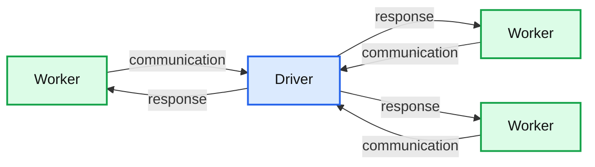
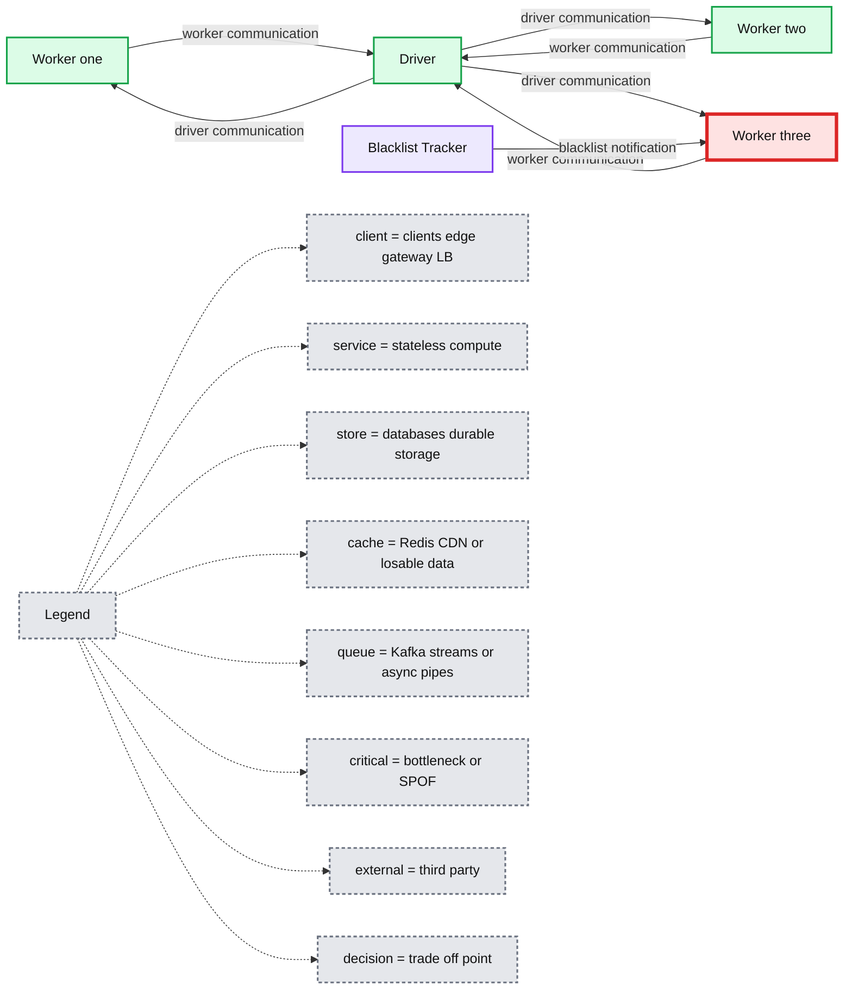
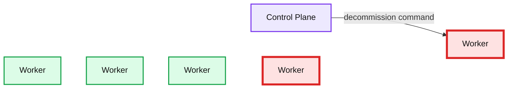

# Improving the Spark Exclusion Mechanism in Databricks

- Source: https://www.databricks.com/blog/2020/11/06/improving-the-spark-exclusion-mechanism-in-databricks.html
- Published: 2020-11-06
- Authors: Tianhan Hu, Xingbo Jiang, Xiao Li
- Categories: engineering, open-source
- Images: 4 total, 4 extracted as architecture

> Ed Note: This article contains references to the term blacklist, a term that the Spark community is actively working to remove from Spark. The feature name [will be changed](https://github.com/apache/spark/pull/29906/) in the upcoming Spark 3.1 release to be more inclusive, and we look forward to this new release.

## Why Exclusion?

The exclusion mechanism was introduced for task scheduling in Apache Spark 2.2.0 (as "blacklisting"). The motivation for having exclusion is to enhance fault tolerance in Spark, especially against the following problematic scenario:

1. In a cluster with hundreds or thousands of nodes, there is a decent probability that executor failures (eg. I/O on a bad disk) happen on one of the nodes during a long-running Spark application — and this can lead to  task failure.
2. When a task failure happens, there is a high probability that the scheduler will reschedule the task to the same node and same executor because of locality considerations. Now, the task will fail again.
3. After failing `spark.task.maxFailures` number of times on the same task, the Spark job would be aborted.

**Summary:** The diagram shows a Driver communicating repeatedly with a Worker while two other Workers remain separate.

**Components:**

- Worker: technology not specified
- Worker: technology not specified
- Worker: technology not specified
- Driver: technology not specified

**Flows:**

- Worker -> Driver: communication
- Driver -> Worker: response
- Worker -> Driver: communication
- Driver -> Worker: response
- Worker -> Driver: communication
- Driver -> Worker: response

**Numbers:** none



<sub>source image: https://www.databricks.com/wp-content/uploads/2020/11/blog-blacklisting-1.png</sub>

Figure 1. A task fails multiple times on a bad node

The exclusion mechanism solves the problem by doing the following. When an executor/node fails a task for a specified number of times (determined by the config `spark.blacklist.task.maxTaskAttemptsPerExecutor` and `spark.blacklist.task.maxTaskAttemptsPerNode`), the executor/node would be blocked for the task, and would not receive the same task again. We also count the number of failures of executors/nodes on a stage/application level, and block them for the entire stage/application when the number exceeds the threshold (determined by the config `spark.blacklist.application.maxFailedTasksPerExecutor` and `spark.blacklist.application.maxFailedExecutorsPerNode`). Executors and nodes in an application-level exclusion will be released out of the exclusion after a timeout period (determined by `spark.blacklist.timeout`).

**Summary:** The diagram shows a Spark Driver communicating with three Workers while a Blacklist Tracker excludes a problematic Worker.

**Components:**

- Driver - Apache Spark driver
- Worker one - Apache Spark worker
- Worker two - Apache Spark worker
- Worker three - Apache Spark worker
- Blacklist Tracker - Spark exclusion tracking component

**Flows:**

- Worker one -> Driver: Worker communication
- Driver -> Worker one: Driver communication
- Worker two -> Driver: Worker communication
- Driver -> Worker two: Driver communication
- Worker three -> Driver: Worker communication
- Driver -> Worker three: Driver communication
- Blacklist Tracker -> Worker three: Blacklist or exclusion notification

**Numbers:** none



<sub>source image: https://www.databricks.com/wp-content/uploads/2020/11/blog-blacklisting-2.png</sub>

Figure 2. A task succeed after excluding the bad node

## Deficiencies in the exclusion mechanism

The exclusion mechanism introduced in Spark 2.2.0 has the following shortcomings that forbid it from being enabled for the user by default.

1. Exclusion mechanisms never actively decommission nodes. The excluded nodes would just sit idle, and contribute nothing to task completion.
2. When there are transient and frequent task failures, many nodes will be added to the exclusion list, thus a cluster quickly gets into a scenario where no worker node can be used.
3. Exclusion mechanism can not be enabled only for shuffle-fetch failures.

## New features introduced in Databricks Runtime 7.3

In Databricks Runtime 7.3, we improved the Spark exclusion mechanism by implementing the following features.

## Enable Node Decommission for Exclusion

In a scenario where some nodes are having permanent failures, all the old exclusion mechanism can do is to put them into application level exclusion list, take them out for another try after a timeout period, and then put them back in. The nodes would be sitting idle, contributing to nothing, and they stay bad.

We address this problem by adding a configuration called `spark.databricks.blacklist.decommissionNode.enabled`. If `spark.databricks.blacklist.decommissionNode.enabled` is set to true, when a node is excluded on the application level, it will be decommissioned, and a new node would be launched to keep the cluster to its desired size.

**Summary:** The diagram shows a Databricks control plane managing Spark workers, including a healthy worker and a decommissioned bad worker.

**Components:**

- Control Plane - Databricks control plane
- Worker - Spark worker, healthy
- Worker - Spark worker
- Worker - Spark worker
- Worker - Spark worker
- Worker - Spark worker, bad

**Flows:**

- Control Plane -> Worker: worker management
- Control Plane -> Worker: worker management

**Numbers:** none

```text
%% mermaid failed to render; kept as text
%% Shows the control plane managing Spark workers, including healthy and bad nodes
flowchart LR
    CP[Control Plane]
    W1[Worker]
    W2[Worker]
    W3[Worker]
    W4[Worker]
    W5[Worker]

    CP -->|manages| W1
    CP -->|manages| W5

    classDef client   fill:#dbeafe,stroke:#2563eb,stroke-width:2px,color:#111
    classDef service  fill:#dcfce7,stroke:#16a34a,stroke-width:2px,color:#111
    classDef store    fill:#ede9fe,stroke:#7c3aed,stroke-width:2px,color:#111
    classDef cache    fill:#fef3c7,stroke:#d97706,stroke-width:2px,color:#111
    classDef queue    fill:#cffafe,stroke:#0891b2,stroke-width:2px,color:#111
    classDef critical fill:#fee2e2,stroke:#dc2626,stroke-width:4px,color:#111
    classDef external fill:#e5e7eb,stroke:#6b7280,stroke-width:2px,color:#111,stroke-dasharray:4 3
    classDef decision fill:#fce7f3,stroke:#db2777,stroke-width:2px,color:#111
    client = clients/edge/gateway/LB, service = stateless compute, store = databases/durable storage, cache = Redis/CDN/anything losable, queue = Kafka/streams/async pipes, critical = the bottleneck or SPOF, external = third-party, decision = a trade-off point

    class CP store
    class W1 service
    class W2,W3,W4 service
    class W5 critical
```

<sub>source image: https://www.databricks.com/wp-content/uploads/2020/11/blog-blacklisting-3.png</sub>

Figure 3. Decommission the bad node, add create new healthy node

## Exclusion Threshold

In Databricks Runtime 7.3, we introduced the feature of thresholding to the exclusion mechanism. By tuning `spark.blacklist.application.blacklistedNodeThreshold` (default to INT_MAX), users can limit the maximum number of nodes excluded at the same time for a Spark application.

**Summary:** The control plane decommissions a bad worker node while other workers remain active.

**Components:**

- Control Plane, technology not specified
- Worker, technology not specified
- Worker, technology not specified
- Worker, technology not specified
- Worker, technology not specified
- Worker, technology not specified

**Flows:**

- Control Plane -> Worker: decommission command

**Numbers:** none



<sub>source image: https://www.databricks.com/wp-content/uploads/2020/11/blog-blacklisting-4.png</sub>

Figure 4. Decommission the bad node until the exclusion threshold is reached

Thresholding is very useful when the failures in a cluster are transient and frequent. In such a scenario, an exclusion mechanism without thresholding is at risk of sending all executors and nodes into application level exclusion, and leaving the user with no resources to use until new healthy nodes are launched.

As shown in Figure 4, we only decommission bad nodes until the exclusion threshold is reached. Thus, with the threshold properly configured, a cluster will not enter the situation that it can only utilize far less worker nodes than expected. Also, as the old bad nodes are replaced by the new healthy nodes, we can still replace the remaining bad nodes in the cluster gradually.

## Independent enabling for FetchFailed errors

FetchFailed errors occur when a node fails to fetch a shuffle block from another node. In this case, it is possible that the node being fetched from is having a long-lasting failure, and many tasks would be affected, and fail due to fetch failures. Therefore, we see exclusion for FetchFailed errors as a special case in the exclusion mechanism due to its large impact.

In Spark 2.2.0, exclusion for FetchFailed errors could only be used when general exclusion is enabled (e.g. `spark.blacklist.enabled` is set to true). In Databricks Runtime 7.3, we made enablement for FetchFailed errors independent.

Now, the user can set `spark.blacklist.application.fetchFailure.enabled` alone to enable exclusion for FetchFailed errors.

## Conclusion

The improved exclusion mechanism is better integrated with the control plane, it gradually decommissions the excluded nodes. As a result, the bad nodes are recycled and replaced by new healthy nodes, thus reduces the task failures caused by bad nodes, and also saves the cost spent on bad nodes. Get started today and try out the improved exclusion mechanism in Databricks Runtime 7.3.
