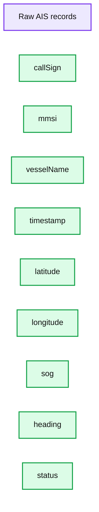
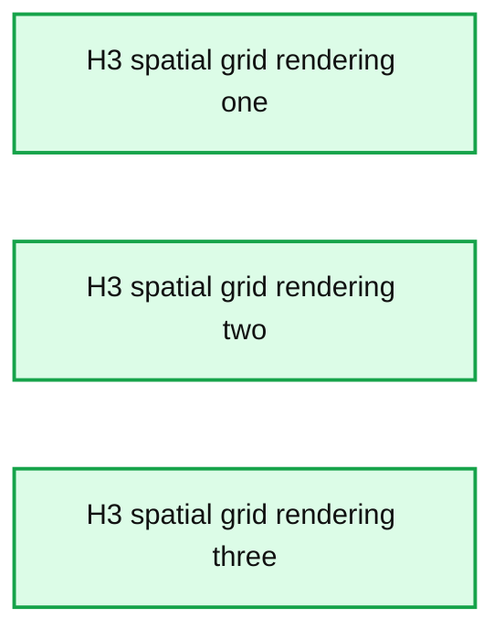
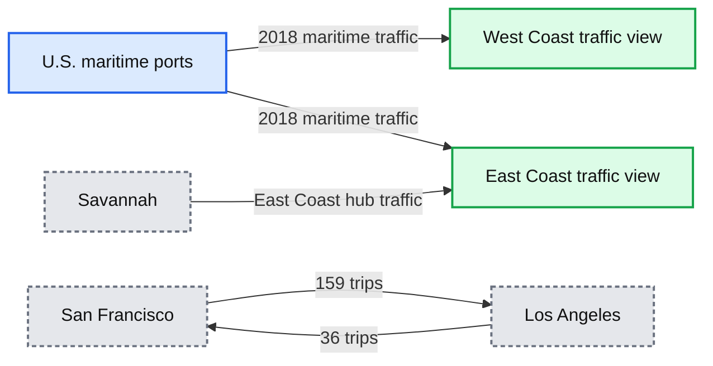
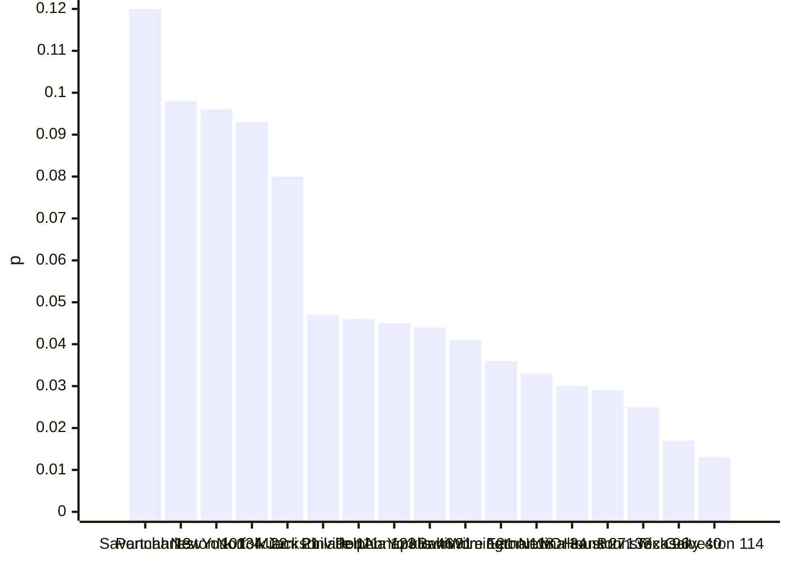
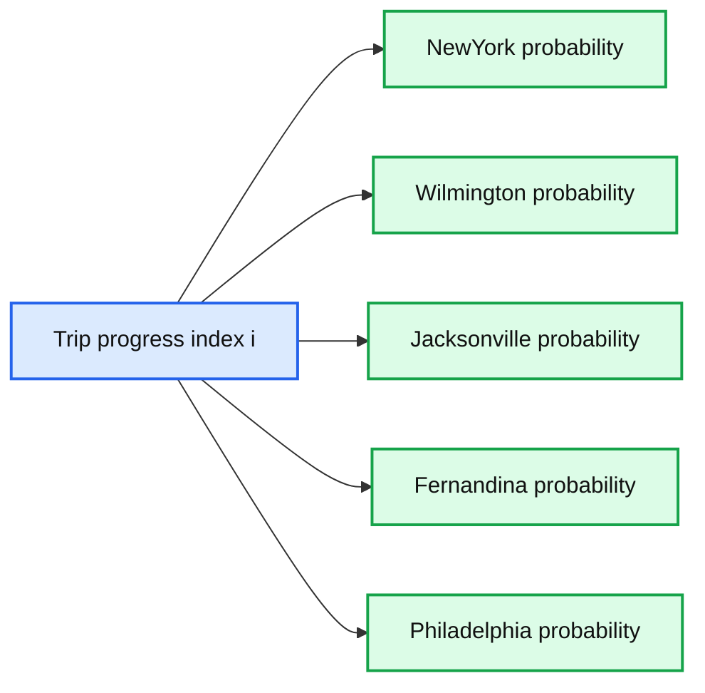

# Leveraging ESG Data to Operationalize Sustainability

- Source: https://www.databricks.com/blog/2020/11/11/leveraging-esg-data-to-operationalize-sustainability.html
- Published: 2020-11-11
- Authors: Antoine Amend
- Categories: engineering, solution-accelerators
- Images: 12 total, 7 extracted as architecture

The benefits of Environmental, Social and Governance (ESG) are well understood across the financial services industry. In our previous [blog post](https://www.databricks.com/blog/2020/07/10/a-data-driven-approach-to-environmental-social-and-governance.html), we demonstrated how asset managers can leverage data and AI to better optimize their portfolios and identify organizations that not only look good from an ESG perspective, but also do good — companies that operate in an environmentally friendly, socially acceptable and sustainable manner. But the benefits of ESG go beyond sustainable investments. Recent experience has taught us that the key to thriving during the COVID-19 pandemic starts with establishing a high bar for social responsibility and sustainable governance. For example, large retailers that already use ESG to monitor their supply chain performance have been able to leverage this information to better navigate the challenges of global lockdowns, ensuring a constant flow of goods and products to communities. In fact, the benefits of operationalizing ESG have been widespread during COVID-19. In Q1 2020, 94% of ESG funds outperformed their benchmarks. High ESG companies have higher resilience because they take a closer look at how they treat their workers, their sourcing, and how vulnerable they are to external shocks. What we are seeing among our ESG-focused customers is consistent with the findings of this [article](https://corpgov.law.harvard.edu/2020/08/14/the-other-s-in-esg-building-a-sustainable-and-resilient-supply-chain/) from the Harvard Law School Forum on Corporate Governance, “Companies that invest in [ESG] benefit from competitive advantages, faster recovery from disruptions.”

> “High-quality businesses that adhere to sound ESG practices will outperform those that do not.”Tidjane ThiamChair of the audit committee of the Kering GroupFormer CEO of Credit Suisse

In this blog post, we’ll demonstrate a novel approach to supply chain analytics by combining geospatial techniques and predictive data analytics for logistics companies not only to reduce their carbon footprint, improve working conditions and enhance regulatory compliance but also to use that information to adapt to emerging threats, in real time. Using a maritime transport company as an example, we’ll uncover the following topics as key enablers toward a sustainable transformation through data and AI:

- Leverage geospatial analytics to group IoT sensor data into actionable signals
- Optimize logistics using Markov chain models
- Predict vessel destination and optimize fuel consumption

## The veracity of ESG

The burst of the web 2.0 bubble in the early 2000s has led to a variety of information being collected (e.g., IoT, sensor data) and the adoption of Hadoop-based technologies in 2010 has allowed organizations to efficiently store and process massive amounts of data (e.g., volume, velocity). However, organizations were not able to fully unlock the true potential of data until recently. Today, cloud computing coupled with open source AI technologies have democratized data, allowing businesses to address the biggest hurdle in taking a data-driven approach to ESG: information veracity. Alternative data, sensor data, ratings, and ESG disclosures come at different scales, different qualities, different formats, are often incomplete or unreliable and dramatically change over time, requiring all scientific personas (i.e., data scientists and computer scientists) to work collaboratively and iteratively to convert raw information into actionable signals. By unifying data and analytics, Databricks not only allows the ingestion and processing of massive amounts of data at minimal costs, but also helps enterprises iterate faster through the use of AI, establish new strategies to adapt to changing conditions, inform better decision-making, and transform their operating models to be more data-driven, agile and resilient.

In this demo, we’ll use maritime traffic information from the Automatic Identification System (AIS), an automatic tracking system that captures the exact location of every operating vessel at regular time intervals. This publicly available data set can be accessed either via [NOAA](https://coast.noaa.gov) archives or live feeds.

**Summary:** The diagram shows an ESG resilience loop that transforms AIS data into enriched trips, traffic descriptions, predictions, and operational prescriptions.

**Components:**

- AIS data sources
- Delta Lake for reliable AIS data storage
- Apache Spark for sessionizing geo points into trips
- Geospatial enrichment with U.S. ports using H3
- Describe traffic using a Markov Chain
- Predict destinations and detect anomalies
- Prescribe actions to maximize value and reduce operation costs
- ESG resilience loop

**Flows:**

- AIS data sources -> Delta Lake: AIS data
- Delta Lake -> Apache Spark: stored geo points
- Apache Spark -> Geospatial enrichment: sessionized trips
- Geospatial enrichment -> Describe: enriched trips
- Describe -> Predict: traffic understanding
- Predict -> Prescribe: destinations and anomalies
- Prescribe -> Describe: operational feedback
- Prescribe -> Predict: resilience loop feedback

**Numbers:** 1, 2, 3, 4, 5, 6

```mermaid
%% Shows the ESG resilience workflow from AIS data to operational prescriptions
flowchart LR
    A[AIS data sources] -->|AIS data| B[Delta Lake]
    B -->|Stored geo points| C[Apache Spark]
    C -->|Sessionized trips| D[Geospatial enrichment]
    D -->|Enriched trips| E[Describe traffic]
    E -->|Traffic understanding| F[Predict destinations and anomalies]
    F -->|Predictions and anomalies| G[Prescribe actions]
    G -->|Operational feedback| E
    G -->|Resilience loop feedback| F

    classDef client fill:#dbeafe,stroke:#2563eb,stroke-width:2px,color:#111
    classDef service fill:#dcfce7,stroke:#16a34a,stroke-width:2px,color:#111
    classDef store fill:#ede9fe,stroke:#7c3aed,stroke-width:2px,color:#111
    classDef cache fill:#fef3c7,stroke:#d97706,stroke-width:2px,color:#111
    classDef queue fill:#cffafe,stroke:#0891b2,stroke-width:2px,color:#111
    classDef critical fill:#fee2e2,stroke:#dc2626,stroke-width:4px,color:#111
    classDef external fill:#e5e7eb,stroke:#6b7280,stroke-width:2px,color:#111,stroke-dasharray:4 3
    classDef decision fill:#fce7f3,stroke:#db2777,stroke-width:2px,color:#111

    class A external
    class B store
    class C,D,E,F,G service
```

source image: https://www.databricks.com/wp-content/uploads/2020/11/blog-leveraging-esg-2.png

As reported in the above workflow, **Delta Lake** will be used to provide both reliability and performance of AIS data (1), and **Apache SparkTM** will be used to group billions of isolated geographical information (2) into well-defined routes (commonly known as “sessionizing” IoT data), leveraging geospatial libraries such as H3 Uber’s Hexagonal Hierarchical Spatial Index (3). Using Markov chains, we will demonstrate how logistics companies can better understand the efficiency of their own fleet (4), and also leverage contextual information from others in order to predict traffic, detect anomalies (5) and minimize associated risks and disruption to their businesses (6).

### Acquiring AIS data

The [Automated Identification System](https://en.wikipedia.org/wiki/Automatic_identification_system) is a navigation standard all vessels must theoretically comply with. As a result, its structure is relatively simple and contains vessel attributes, including Maritime Mobile Service Identity (MMSI) and call sign (unique to a ship) alongside dynamic characteristics such as the exact location, speed over ground, heading and timestamp. We can read incoming CSV files and append that information as-is onto a Delta bronze table, as represented in the table below.

**Summary:** A tabular view of raw AIS vessel records, including identity, location, movement, status, and timestamp fields.

**Components:**

- callSign: vessel call sign, technology not specified
- mmsi: Maritime Mobile Service Identity, technology not specified
- vesselName: vessel name, technology not specified
- timestamp: event timestamp, technology not specified
- latitude: geographic latitude, technology not specified
- longitude: geographic longitude, technology not specified
- sog: speed over ground, technology not specified
- heading: vessel heading, technology not specified
- status: vessel status, technology not specified

**Flows:**

- none

**Numbers:** 1, 2, 3, 4, 5, 6, 7, 8, 9, 9V3502, 563636000, 2018-07-24T15:12:02.000+0000, 45.63181, -122.69755, 0, 307, 5, WDH7560, 367057570, 2018-07-24T15:13:26.000+0000, 47.01464, -91.67177, 299, 0, 9HA3797, 256045000, 2018-07-24T15:11:36.000+0000, 18.65217, -66.515, 11, 90, LAJF7, 257457000, 2018-07-24T15:11:32.000+0000, 32.0874, -81.09902, 141, V7VT7, 538007588, 2018-07-24T15:11:59.000+0000, 29.99715, -90.43892, 292, 1, MAPY4, 232006508, 2018-07-24T15:11:22.000+0000, 33.73199, -118.25677, 71, OYGN2, 220416000, 2018-07-24T15:12:34.000+0000, 40.4929, -73.67165, 149, V7HJ2, 538005831, 2018-07-24T15:14:40.000+0000, 23.61966, -118.61306, 13.1, 124, CQBS, 255805847, 2018-07-24T15:11:47.000+0000, 27.29377, -79.96945, 12.7, 178

source image: https://www.databricks.com/wp-content/uploads/2020/11/blog-leveraging-esg-3.png

Given the volume of data at play (2 billion data points collected for the U.S. alone in 2018), we leverage H3, a hierarchical structure that encodes latitude/longitude points as a series of overlapping polygons as represented below. Such a powerful grid structure will help us group points at different resolutions spanning from a million of km2 down to a few cm2.

**Summary:** Three renderings of Uber’s hexagonal hierarchical spatial index at different spatial resolutions.

**Components:**

- H3 spatial grid rendering one
- H3 spatial grid rendering two
- H3 spatial grid rendering three

**Flows:**

- none

**Numbers:** none

source image: https://www.databricks.com/wp-content/uploads/2020/11/blog-leveraging-esg-4.png

Using Uber’s third-party library, we wrap this encoding logic as a User-Defined Function (UDF):

In order to appreciate the complexity of the task at hand, we render all points (grouped by a 10 km large polygon) using [KeplerGL](https://kepler.gl/) visualization. Such a visualization demonstrates the aggressive nature of AIS data and the necessity to address that problem as a data science challenge instead of a simple engineering pipeline or ETL workflow.

Since AIS data only contains latitudes and longitudes, we also acquire the location of 142 commercial ports in the United States using a simple web scraper and BeautifulSoup python library (the process is reported in the associated notebooks).

### Transforming raw information into actionable signals

In order to convert raw information into actionable signals, we first need to sessionize points into trips separated by points where a vessel is no longer under command (e.g., when a vessel is anchored). This apparently simple problem comes with a series of computer science challenges: First, a trip is theoretically unbound (in terms of distance or time), using a typical SQL window function would result in each location for a given vessel to be held in memory. Second, some vessels may exhibit half a million data points, and sorting such a large list would lead to major inefficiencies. Lastly, our data set is highly unbalanced. Some vessels account for more traffic than others, a strategy for a given vessel may be suboptimal for others. None of these challenges can be addressed using standard SQL and relational database techniques.

#### Secondary sorting

We overcome these challenges by leveraging a well-known big data pattern, [secondary sorting](https://www.oreilly.com/library/view/data-algorithms/9781491906170/ch01.html). This apparent legacy pattern (famous in the MapReduce era) is still incredibly useful with massive data sets and a must-have in the modern data science toolbox. The idea is to leverage Spark Shuffle by creating a custom partitioner on a composite key. The first half of the key is used to define the partition number (i.e., the MMSI) while its second half is used to sort each key within a given partition (i.e., timestamp), resulting in a vessel’s data to be grouped together in a sorted collection.

Although the full code is detailed in the attached notebook, we report below the use of a Partitioner (to tell the Spark framework what executor will be processing which vessel) and a composite key in order to exploit, at its best, the elasticity offered by cloud computing (and, therefore, minimize its cost).

Equipped with a composite key, a partitioner, and a business logic to split sorted data points into sequences (separated by a vessel status), we can now safely address this challenge using Spark repartitionAndSortWithinPartitions framework (another name for secondary sorting). On a relatively small cluster, the process took 3mn to split our entire data set into 30,000 sessions, storing each trip on a silver Delta table that can be further enriched.

#### Geospatial enrichment

With the complexity of our data dramatically reduced, the next challenge is to further refine this information by filtering out incomplete trips (missing data) using the information of U.S. ports and locations we scraped from the internet. Instead of a complex geospatial query such as finding a “point in polygon”  or a brute force approach to find the minimum distance to any known U.S. ports, we leverage the semantic properties of H3 to define a catchment area around the exact location of each port (as per picture below).

Any vessel caught in these areas (i.e., matching a simple INNER JOIN condition) at either end of their journeys will be considered as originating from/at the destination to these specific ports. Through this approach, we successfully reduced a massive data set of 2 billion raw records down to 15,000 actionable trips that can now be used to improve the operational resilience of our shipment company.

### Flags of convenience and safety concerns

Maritime transport is the backbone of international trade. The global economy has around 80% of global trade by volume, and over 70% of global trade by value are carried by sea. With over 50,000 merchant ships registered in 150 countries, “Regulatory frameworks such as Basel Convention, OECD and ILO guidelines are looking at better governing shipbreaking activities. However, many boats sail under flags of convenience, including Panama, Liberia, and the Marshall Islands, making it possible to escape the rules laid down by international organizations and governments.”* *

> ”Globalization has helped to fuel this rush to the bottom. In a competitive shipping market, FOCs lower fees and minimize regulation, as ship owners look for the cheapest way to run their vessels.”International Transport Workers’ Federation

There are a variety of factors for sailing under flags of convenience, but the least disciplined ship owners tend to register vessels in countries that impose fewer regulations. Consequently, ships bearing a flag of convenience can be ESG red-flags: Often characterized by poor conditions, inadequately trained crews, and frequent collisions that cause serious environmental and safety concerns that can only be detected and quantified using a data-driven approach. With all of our data points properly classified and stored on Delta Lake, a simple SQL query on MMSI patterns (contains information about flags) can help us identify vessels suspected of operating under a flag of convenience.

In the example below, we have been able to identify PEAK PEGASUS, a shipping carrier operating in the Gulf of Mexico in 2018, consecutively sailing under either a Liberia or Gabon flag. Without taking a big data approach to this problem, it would not only be difficult to uncover which ships are changing flags but to predict which kind of potential ESG issues this may cause and where these ships may be heading toward (see later in this blog).

By better addressing the veracity of IoT data, we have demonstrated how transforming raw information into actionable signals offers no place to hide for ship owners to operate out of the sight of regulators (this cargo was hidden among 2 billion data points). Whether or not this particular vessel is breaching any regulatory requirement is outside of the scope of this blog.

## A data and AI compass to maximize business value

With our raw information converted into actionable signals, one can easily identify the most common routes across the United States at different times of the year. Using Circos visualization techniques as represented below, we can appreciate the global complexity of the U.S. maritime traffic for 2018 (left picture). When most of the trips originating from San Francisco are headed to Los Angeles, the latter acts as a hub for the whole West Coast (right picture), uncovering some interesting economic insights. Similarly, Savannah, Georgia, seems to be the hub for the East Coast.

**Summary:** Circos visualizations show 2018 maritime traffic between U.S. ports, with a detailed view highlighting San Francisco and Los Angeles connections.

**Components:**

- U.S. maritime ports
- San Francisco
- Los Angeles
- Savannah
- West Coast traffic view
- East Coast traffic view

**Flows:**

- San Francisco -> Los Angeles: 159 trips
- Los Angeles -> San Francisco: 36 trips
- U.S. maritime ports -> U.S. maritime ports: maritime traffic connections

**Numbers:** 2018, 159, 36

source image: https://www.databricks.com/wp-content/uploads/2020/11/blog-leveraging-esg-8.png

If we assume that the number of trips between two ports is positively correlated with the economic activity between two cities, a higher probability of reaching a port is therefore a function of higher profitability for a shipper. This Circos map is the key to economic growth, and Markov chain is its compass.

A [Markov chain](https://en.wikipedia.org/wiki/Markov_chain) is a mathematical system that experiences transitions from one state (e.g., a port) to another according to certain probabilistic rules (i.e., the number of observations). Widely employed in economics, communication theory, genetics and finance, this stochastic process can be used to simulate sampling from complex probability distributions, for instance studying queues or lines of customers arriving at an airport or forecasting market crashes and cycles between recession and expansion. Using this approach, we demonstrate how port authorities could better regulate inbound traffic and reduce long queues at anchorage, resulting in cost benefits for industry stakeholders and a major reduction in carbon emission. Long queues at anchorage are a major safety and environmental issue.

### Minimizing disruption to a business

As reported in the [Financial Times](https://www.ft.com/content/65fe4650-5d90-41bc-8025-4ac81df8a5e4), carriers have dramatically changed their operations during the COVID-19 pandemic, by quickly parking ships, sending vessels on longer journeys, and canceling hundreds of routes to protect profits. As the global economy recovers, we can leverage Markov chains to predict where a cargo operator should redeploy their fleet in order to minimize disruption to their businesses. Starting from a given port, where would a given vessel statistically be after three, four, five consecutive trips? These insights not only optimize profits, but also help protect the well-being of seamen that work on the ships by creating a data-driven framework that takes into account how to help them return home after voyages.

We capture the probability distribution of each port reaching any other port as what is commonly referred to as a transition matrix. Given an initial state vector (a port of origin), we can easily “random walk” these probabilities in order to find the next N most probable routes, factoring for erratic behavior (this is known in the Markovian literature as a “teleport” variable that contributed to Google’s successful algorithm, Page rank).

Starting from New York City, we represent the most probable location any ship would be after five consecutive trips (12% chance of being at Savannah, Georgia).

**Summary:** Bar chart showing the probabilistic vessel locations after five trips originating from New York City.

**Components:**

- Port probability distribution
- Probability axis
- Port axis

**Flows:**

- none

**Numbers:** 0, 0.02, 0.04, 0.06, 0.08, 0.1, 0.12; Savannah 13, Portcharleston 101, NewYork 134, Norfolk 22, Miami 21, Jacksonville 111, Philadelphia 123, PortAnnapolis 46, Yorktown 91, Baltimore 121, Wilmington 118, Fernandina 34, NewOrleans 27, Houston 133, Brunswick 96, Texascity 40, Galveston 114; bar probabilities approximately 0.12, 0.098, 0.096, 0.093, 0.08, 0.047, 0.046, 0.045, 0.044, 0.041, 0.036, 0.033, 0.03, 0.029, 0.025, 0.017, 0.013

source image: https://www.databricks.com/wp-content/uploads/2020/11/blog-leveraging-esg-9.png

Since the number of trips between two cities should be correlated with high economic activity, this framework will not only tell us what the most probable next N routes are, but what are the next N routes with the highest profitability. When part of their fleet must be redeployed to different locations or re-routed because of external events (e.g., weather conditions), this probabilistic framework will help ship operators think multiple steps ahead, optimizing routes to be the most economically viable and, therefore, minimizing further disruption to their businesses.

In the example below, we represent a journal log (dynamically generated from our framework) that optimizes business value when departing from New York City. For each trip, we can easily report the average duration and distance based on historical records.

**Summary:** A probabilistic journal log lists sequential maritime trips from New York through Yorktown with historical travel hours and distances.

**Components:**

- Trip journal table
- Trip index
- Origin port name
- Destination port name
- Travel hours
- Travel distance

**Flows:**

- NewYork -> Baltimore: 32 hours and 774 distance
- Baltimore -> Jacksonville: 61 hours and 1367 distance
- Jacksonville -> Miami: 28 hours and 581 distance
- Miami -> BiloxiPort: 68 hours and 1575 distance
- BiloxiPort -> PortFreeport: 47 hours and 1009 distance
- PortFreeport -> Jacksonville: 101 hours and 2827 distance
- Jacksonville -> Norfolk: 49 hours and 1148 distance
- Norfolk -> Savannah: 42 hours and 997 distance
- Savannah -> Yorktown: 39 hours and 989 distance

**Numbers:** Trip indices 0, 1, 2, 3, 4, 5, 6, 7, 8; hours 32, 61, 28, 68, 47, 101, 49, 42, 39; distances 774, 1367, 581, 1575, 1009, 2827, 1148, 997, 989

```mermaid
%% Shows the sequential port trips and their historical travel metrics
flowchart LR
    A[NewYork] -->|32 hours 774 distance| B[Baltimore]
    B -->|61 hours 1367 distance| C[Jacksonville]
    C -->|28 hours 581 distance| D[Miami]
    D -->|68 hours 1575 distance| E[BiloxiPort]
    E -->|47 hours 1009 distance| F[PortFreeport]
    F -->|101 hours 2827 distance| C
    C -->|49 hours 1148 distance| G[Norfolk]
    G -->|42 hours 997 distance| H[Savannah]
    H -->|39 hours 989 distance| I[Yorktown]

    classDef client fill:#dbeafe,stroke:#2563eb,stroke-width:2px,color:#111
    classDef service fill:#dcfce7,stroke:#16a34a,stroke-width:2px,color:#111
    classDef store fill:#ede9fe,stroke:#7c3aed,stroke-width:2px,color:#111
    classDef cache fill:#fef3c7,stroke:#d97706,stroke-width:2px,color:#111
    classDef queue fill:#cffafe,stroke:#0891b2,stroke-width:2px,color:#111
    classDef critical fill:#fee2e2,stroke:#dc2626,stroke-width:4px,color:#111
    classDef external fill:#e5e7eb,stroke:#6b7280,stroke-width:2px,color:#111,stroke-dasharray:4 3
    classDef decision fill:#fce7f3,stroke:#db2777,stroke-width:2px,color:#111
    class A,B,C,D,E,F,G,H,I service
```

source image: https://www.databricks.com/wp-content/uploads/2020/11/blog-leveraging-esg-10.png

An improvement of this model (at the reader’s discretion) would be to factor for additional variables, such as weather data, vessel type, known contracts or seasonality or allow users to input additional constraints (e.g., maximum distance). In fact, an anomaly in our approach was detected where no historical data was found between Sault Ste. Marie and Duluth between January and March. This apparent oddity could certainly be explained by the fact the Great Lakes are mostly frozen in winter, so recommending such a route would not necessarily be appropriate.

### Being socially responsible and economically pragmatic

Currently, roughly 250,000 ship workers are believed to be marooned, as authorities have prevented seafarers from disembarking on grounds of infection risk. In this real-life scenario, how could a cargo operator bring its crew home safely while minimizing further disruption to their business? Using graph theory, our framework can also be used where the destination is known. The same Circos map shown earlier (hence its associated Markov transition matrix) can be converted as a graph using the networkX library in order to further study its structure, learning its connections and their shortest paths.

Sailing half-empty from Albany to Fort Pierce may be the fastest but not the most economically viable route. As reported below, our framework indicates that — at this time of the year — a stop at Baltimore and Miami could help shippers maximize their profits while bringing their crew safely home in a timely manner.

## Predict and prescribe

In the previous section, we demonstrated the use of Markov chains to better understand economic activity as a steady flow of traffic between U.S. ports. In this section, we use that acquired knowledge to understand the transition from one geographic location to another. Can we machine learn a ship destination given its port of origin and its current location, at any point in time? Besides the evident strategic advantage for the financial services industry to understand and predict shipment of goods and better model supply and demand, cargo operators can better optimize their operations by estimating the traffic at the destination and avoid long queues at anchorage.

### Geospatial Markov chains

Although our approach is an extension to our existing framework, our definition of a probabilistic state has changed from a port to an exact geographical location. A high granularity would create a sparse transition matrix while a lower granularity would prevent us from running actual predictions. We will leverage H3 information (as introduced earlier) by approximating locations within a 20 km radius. Another consideration to bear in mind is the “[Memorylessness](https://en.wikipedia.org/wiki/Memorylessness)” nature of Markov chains (i.e., the current location does not carry information about previous steps). Since the originating port of each vessel is known, we will create multiple machine learning models, one for each U.S. port of origin.

At any point in time, our system will detect the next probable N states (the next N locations) a ship is heading to. Given an infinite number of “random walks,” our probability distribution will become stationary as all known ports will be reached. Eventually, we want to stop our random walk process when the probability distribution remains unchanged (within a defined threshold). For that purpose, we use [Bhattacharyya](https://en.wikipedia.org/wiki/Bhattacharyya_distance) coefficient as a distance measure between two probability distributions.

### Predicting destinations

Given a trip originating from Miami, we extract the most probable destinations at every step of its journey. We represent our model output in the picture below. The most probable destination was Wilmington (30% of chances) until the ship started to head east, moving toward the New York / Philadelphia route (probabilities were similar). Around 80% of trip completion, it became obvious that our ship was heading toward New York City (as the probability of heading toward Philadelphia dramatically dropped to zero).

**Summary:** Line chart showing predicted destination probabilities over trip progress index `i` for five ports.

**Components:**

- NewYork probability series
- Wilmington probability series
- Jacksonville probability series
- Fernandina probability series
- Philadelphia probability series
- Trip progress index `i`
- Probability axis

**Flows:**

- `i -> NewYork`: predicted destination probability over time
- `i -> Wilmington`: predicted destination probability over time
- `i -> Jacksonville`: predicted destination probability over time
- `i -> Fernandina`: predicted destination probability over time
- `i -> Philadelphia`: predicted destination probability over time

**Numbers:** x-axis values `0, 5, 10, 15, 20, 25, 30, 35, 40, 45, 50`; y-axis values `0, 0.2, 0.4, 0.6, 0.8, 1`; Wilmington reaches approximately `0.27`; NewYork reaches `1`; Philadelphia falls to `0`.

source image: https://www.databricks.com/wp-content/uploads/2020/11/blog-leveraging-esg-12.png

 As represented in the figure below, we observe the probability of reaching New York City increases over time. We are obviously more confident about a prediction being made when the destination port is in sight (and less random walks are required as represented by the polygons’ heights).

 After multiple tests, we can observe an evident drawback in our model. There are multiple ports densely packed around specific regions. An example would be the Houston, Texas, area with Freeport, Houston, Galveston, Matagorda ports, all located within a 50–100 km radius, and all sharing the same inbound route pattern (overall direction pointing toward Houston). As a consequence, the most popular port shadows its least popular neighbors resulting in low probability distribution and apparent low accuracy. To fully appreciate the predictive power of our approach, one would need to look at the actual distance between predicted vs. actual locations as a more appropriate success metric. With fuel costs representing as much as 50%–60% of total ship operating costs, ship owners can leverage this framework to **reduce carbon emissions**. Owners can not only monitor their own fleets, but also those of their competitors (AIS is publicly available), predict traffic at the destination, and establish data-driven strategies for optimizing fuel consumption in real time (reducing sailing speed, re-routing, etc.).

### Preventive measures through AI

As we are now able to predict what the immediate next step of any vessel is, operators can use this information to detect unusual patterns. Anomalies can be observed given a drastic change in the probability distribution between two successive events (such a change can easily be captured using the Bhattacharyya coefficient introduced earlier) and preventive measures can be taken immediately. By monitoring the fleets of their competitors and the environmental and safety concerns related to the least regulated vessels, ship owners now have access to a real-time lense of dense traffic where auxiliary correction can be made in real time to vessels approaching the danger state (it may take about 20 minutes for a fully loaded large tanker to stop when heading at normal speed), navigating with higher safety standards.

## Enabling a sustainable transformation

Through this series of real-world examples, we demonstrated why ESG is a data and AI challenge. From environmental (reducing carbon emission), social (ensuring the safety of their crew), and governance (detecting the least regulated activities), we have demonstrated how organizations who successfully embedded ESG at their core have built a strategic resilience to better optimize their operating model to emerging threats. Although we used maritime information, the same framework and its underlying technical capabilities can easily be ported to different sectors besides the logistics industry. In the financial services industry, this framework would be directly applicable to commodity trading, risk management, trade finance, and compliance  (ensuring that vessels would not be sailing across sanctioned waters). Try the below notebooks on Databricks to accelerate your sustainable transformation today and [contact us](https://www.databricks.com/company/contact) to learn more about how we assist customers with similar use cases.

- [Downloading vessel AIS tracking data](https://www.databricks.com/notebooks/esgops_notebooks/01_vessel_etl.html)
- [Harnessing the veracity of IoT data](https://www.databricks.com/notebooks/esgops_notebooks/02_vessel_trips.html)
- [Minimizing disruption through Markov Chain](https://www.databricks.com/notebooks/esgops_notebooks/03_vessel_markov.html)
- [Predicting vessel destinations](https://www.databricks.com/notebooks/esgops_notebooks/04_vessel_predict.html)
