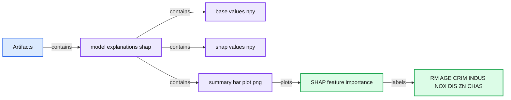

# MLflow 1.12 Features Extended PyTorch Integration

- Source: https://www.databricks.com/blog/2020/11/13/mlflow-1-12-features-extended-pytorch-integration.html
- Published: 2020-11-13
- Authors: Jules Damji, Siddharth Murching, Harutaka Kawamura
- Categories: engineering, data-science-machine-learning
- Images: 4 total, 2 extracted as architecture

MLflow 1.12 features include extended PyTorch integration, SHAP model explainability, autologging MLflow entities for [supported model flavors](https://mlflow.org/docs/latest/tracking.html#automatic-logging), and a number of UI and document improvements. Now available on [PyPI](https://pypi.org/project/mlflow/) and the [docs online](https://mlflow.org/docs/latest/index.html), you can install this new release with `pip install mlflow==1.12.0` as described in the [MLflow quickstart guide](https://mlflow.org/docs/latest/quickstart.html).

In this blog, we briefly explain the key features, in particular extended PyTorch integration, and how to use them. For a comprehensive list of additional features, changes and bug fixes read the MLflow 1.12 Changelog.

## Support for PyTorch Autologging, TorchScript Models and TorchServing

At the [PyTorch Developer Day](https://www.facebook.com/events/802177440559164/), Facebook's AI and PyTorch engineering team, in collaboration with Databricks’ MLflow team and community, announced an [extended PyTorch and MLflow integration](https://medium.com/pytorch/mlflow-and-pytorch-where-cutting-edge-ai-meets-mlops-1985cf8aa789?source=friends_link&sk=bce9c976697fa8934174628eacb7f207)as part of the MLflow release 1.12. This joint engineering investment and integration with MLflow offer PyTorch developers an “end-to-end exploration to production platform for PyTorch.” We briefly cover three areas of integration:

- Autologging for PyTorch models
- Supporting TorchScript models
- Deploying PyTorch models onto TorchServe

## Autologging PyTorch pl.LightningModule Models

As part of the universal autologging feature introduced in this release (see autologging section below), you can automatically log (and track) parameters and metrics from PyTorch Lightning models.

Aside from customized entities to log and track, the [PyTorch autolog](https://mlflow.org/docs/latest/tracking.html#pytorch-experimental) tracking functionality will log the model’s optimizer names and learning rates; metrics like training loss, validation loss, accuracies; and models as artifacts and checkpoints. For early stopping, model checkpoints, early stopping parameters and metrics are logged too.

## Converting PyTorch models to TorchScript

[TorchScript](https://pytorch.org/docs/stable/jit.html) is a way to create serializable and optimizable models from PyTorch code. As such any MLflow-logged PyTorch model can be converted into a TorchScript, saved and loaded (or deployed to) a high-performance, independent process, where there is no Python dependency. The process entails following steps:

1. Create an MLflow Python model
2. Compile the model using JIT and convert to TorchScript model
3. Log or save the TorchScript model
4. Load or deploy the TorchScript model

For brevity, we have not included all the code here, but you can examine the example code—[IrisClassification](https://github.com/mlflow/mlflow/blob/master/examples/pytorch/torchscript/IrisClassification/iris_classification.py)and [MNIST](https://github.com/mlflow/mlflow/blob/master/examples/pytorch/torchscript/MNIST/mnist_torchscript.py)—in the GitHub [mlflow/examples/pytorch/torchscript directory](https://github.com/mlflow/mlflow/tree/master/examples/pytorch/torchscript).

One thing you can do with a scripted (fitted or logged) model is use the mflow fluent and `mlflow.pytorch` APIs to access the model and its properties, as shown in the GitHub examples. Another thing you can do with the scripted model is deploy it to a TorchServe server using TorchServer MLflow Plugin.

## Deploying PyTorch models with TorchServe MLflow Plugin

[TorchServe](https://pytorch.org/serve/)offers a flexible, easy tool for serving PyTorch models. Through the [TorchServe MLflow deployment plugin](https://github.com/mlflow/mlflow-torchserve), you can deploy any MLflow-logged and fitted PyTorch model. This extended integration completes the [PyTorch MLOps lifecycle](https://medium.com/pytorch/mlflow-and-pytorch-where-cutting-edge-ai-meets-mlops-1985cf8aa789?source=friends_link&sk=bce9c976697fa8934174628eacb7f207)—from developing, tracking and saving to deploying and serving PyTorch models.

 Figure 1: Extended end-to-end PyTorch and MLflow Integration

For demonstration, two PyTorch examples—BertNewsClassifcation and [MNIST](https://github.com/mlflow/mlflow-torchserve/tree/master/examples/MNIST)—enumerate steps in how you can use the TorchServe MLflow deployment plugin to deploy a PyTorch saved model to an existing TorcheServe server. Any MLflow-logged and fitted PyTorch model can easily be deployed using [mlflow deployments](https://www.mlflow.org/docs/latest/cli.html#mlflow-deployments) commands. For example:

`mlflow deployments create -t torchserve -m models:/my_pytorch_model/production -n my_pytorch_model`

Once deployed, you can just easily use mlflow deployments predict command for inference.

`mlflow deployments predict --name my_pytorch_model --target torchserve --input-path sample.json --output-path output.json.`

## SHAP API Offers Model Explainability

As more and more machine learning models are deployed in production as part of business applications that offer suggestive hints or make decisive predictions, machine learning engineers are obliged to explain how a model was trained and what features contributed to its output. One common technique used to answer these questions is [SHAP](https://github.com/slundberg/shap) (SHapley Additive exPlanations), a theoretical approach to explain an output of any machine learning model.

**Summary:** The diagram shows SHAP explaining a model output by attributing contributions to four input features relative to a base rate.

**Components:**

- Model: machine learning model
- SHAP explanation: feature attribution method
- Input features: Age, Sex, BP, and BMI
- Output attribution chart: SHAP contribution visualization

**Flows:**

- Age, Sex, BP, and BMI -> Model: feature inputs
- Base rate -> Model: baseline output
- Model -> Output attribution chart: predicted output
- SHAP explanation -> Output attribution chart: feature contributions

**Numbers:** 65, F, 180, 40, 0.4, 0.1, +0.4, -0.3, +.1, +.1

```text
%% mermaid failed to render; kept as text
%% SHAP feature attribution from model inputs to explained output
flowchart LR
    I[Age 65<br/>Sex F<br/>BP 180<br/>BMI 40] -->|feature inputs| M[Model]
    B[Base rate 0.1] -->|baseline output| M
    M -->|output 0.4| O[Output attribution chart]
    S[SHAP explanation] -->|feature contributions| O

    classDef client   fill:#dbeafe,stroke:#2563eb,stroke-width:2px,color:#111
    classDef service  fill:#dcfce7,stroke:#16a34a,stroke-width:2px,color:#111
    classDef store    fill:#ede9fe,stroke:#7c3aed,stroke-width:2px,color:#111
    classDef cache    fill:#fef3c7,stroke:#d97706,stroke-width:2px,color:#111
    classDef queue    fill:#cffafe,stroke:#0891b2,stroke-width:2px,color:#111
    classDef critical fill:#fee2e2,stroke:#dc2626,stroke-width:4px,color:#111
    classDef external fill:#e5e7eb,stroke:#6b7280,stroke-width:2px,color:#111,stroke-dasharray:4 3
    classDef decision fill:#fce7f3,stroke:#db2777,stroke-width:2px,color:#111
    I,S client
    M service
    B store
    O service
```

<sub>source image: https://www.databricks.com/wp-content/uploads/2020/11/mlflow1-2_2.png</sub>

 Figure 2: SHAP can estimate how each feature contributes to the model output.

To that end, this release includes an [mlflow.shap module](https://mlflow.org/docs/latest/python_api/mlflow.shap.html) with a single method `mlflow.shap.log_explanation()` to generate an illustrative figure that can be logged
 as a model artifact and inspected in the UI.

**Summary:** MLflow’s Artifacts UI displays a SHAP explanation artifact directory containing NumPy data files and a summary bar plot.

**Components:**

- Artifacts: MLflow artifact browser
- model explanations shap: SHAP artifact directory
- base values npy: NumPy base values file
- shap values npy: NumPy SHAP values file
- summary bar plot png: SHAP summary bar chart
- Feature labels: RM, AGE, CRIM, INDUS, NOX, DIS, ZN, CHAS

**Flows:**

- Artifacts -> model explanations shap: contains artifact directory
- model explanations shap -> base values npy: contains file
- model explanations shap -> shap values npy: contains file
- model explanations shap -> summary bar plot png: contains visualization

**Numbers:** 20.36KB; 0.0, 0.5, 1.0, 1.5, 2.0



<sub>source image: https://www.databricks.com/wp-content/uploads/2020/11/mlflow1-2_3.png</sub>

 Figure 3: SHAP explanation saved as an MLflow artifact

You can view the example code in the [docs page](https://mlflow.org/docs/latest/python_api/mlflow.shap.html#mlflow.shap.log_explanation) and try other examples of models with SHAP explanations in the MLflow GitHub [mlflow/examples/shap](https://github.com/mlflow/mlflow/tree/master/examples/shap) directory.

## Autologging Simplifies Tracking Experiments

The [mlflow.autolog()](https://mlflow.org/docs/latest/tracking.html#automatic-logging) method is a universal tracking API that simplifies training code by automatically logging all relevant model entities—parameters, metrics, artifacts such as models and model summaries—with a single call, without the need to explicitly call each separate method to log respective model’s entities.

As a universal single method, under the hood, it detects which supported autologging model flavor is used—in our case scikit-learn—and tracks all its respective entities to log. After the run, when viewed in the MLflow UI, you can inspect all automatically logged entities.

 Figure 4: MLflow UI showing automatically logged entities for scikit-learn model

## What’s next

Learn more about PyTorch integration at the [Data + AI Summit Europe](https://www.databricks.com/dataaisummit/europe-2020) next week, with a keynote from [Facebook AI Engineering Director](https://www.databricks.com/speaker/lin-Qiao) Lin Qiao and a session on[Reproducible AI Using PyTorch and MLflow](https://www.databricks.com/session_eu20/reproducible-ai-using-pytorch-and-mlflow) from Facebook’s Geeta Chauhan.

Stay tuned for additional PyTorch and MLflow detailed blogs. For now you can:

- Read [MLflow and PyTorch — Where Cutting Edge AI meets MLOps](https://medium.com/pytorch/mlflow-and-pytorch-where-cutting-edge-ai-meets-mlops-1985cf8aa789?source=friends_link&sk=bce9c976697fa8934174628eacb7f207)
- Checkout out the PyTorch and MLFlow [mlflow/examples/pytorch/](https://github.com/mlflow/mlflow/tree/master/examples/pytorch)
- Examine SHAP GitHub [mlflow/examples/shap/](https://github.com/mlflow/mlflow/tree/master/examples/shap)
- `pip install mlflow==1.12.0` and have a go at it.

## Community Credits

We want to thank the following contributors for updates, doc changes, and contributions to MLflow release 1.12. In particular, we want to thank the Facebook AI and PyTorch engineering team for their extended PyTorch integration contribution and all MLflow community contributors:

Andy Chow, Andrea Kress, Andrew Nitu, Ankit Mathur, Apurva Koti, Arjun DCunha, Avesh Singh, Axel Vivien, Corey Zumar, Fabian Höring, Geeta Chauhan, Harutaka Kawamura, Jean-Denis Lesage, Joseph Berry, Jules S. Damji, Juntai Zheng, Lorenz Walthert, Poruri Sai Rahul, Mark Andersen, Matei Zaharia, Martynov Maxim, Olivier Bondu, Sean Naren, Shrinath Suresh, Siddharth Murching, Sue Ann Hong, Tomas Nykodym, Yitao Li, Zhidong Qu, @abawchen, @cafeal, @bramrodenburg, @danielvdende, @edgan8, @emptalk, @ghisvail, @jgc128 @karthik-77, @kzm4269, @magnus-m, @sbrugman, @simonhessner, @shivp950, @willzhan-db
