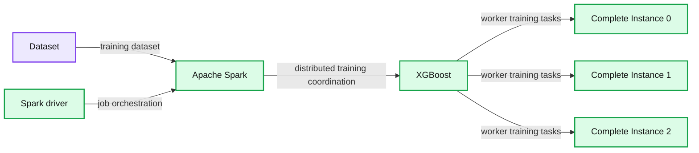

# How to Train XGBoost With Spark

- Source: https://www.databricks.com/blog/2020/11/16/how-to-train-xgboost-with-spark.html
- Published: 2020-11-16
- Authors: Stephen Offer
- Categories: data-science-machine-learning, solutions, open-source
- Images: 2 total, 2 extracted as architecture

XGBoost is currently one of the most popular machine learning libraries and distributed training is becoming more frequently required to accommodate the rapidly increasing size of datasets. To utilize distributed training on a Spark cluster, the XGBoost4J-Spark package can be used in Scala pipelines but presents issues with Python pipelines. This article will go over best practices about integrating XGBoost4J-Spark with Python and how to avoid common problems.

## Best practices: Whether to use XGBoost

This article assumes that the audience is already familiar with XGBoost and gradient boosting frameworks, and has determined that distributed training is required. However, it is still important to briefly go over how to come to that conclusion in case a simpler option than distributed XGBoost is available.

While trendy within enterprise ML, distributed training should primarily be only used when the data or model memory size is too large to fit on any single instance. Currently, for a large majority of cases, distributed training is not required. However, after the cached training data size exceeds 0.25x the instance's capacity, distributed training becomes a viable alternative. As XGBoost can be trained on CPU as well as GPU, this greatly increases the types of applicable instances. But before just increasing the instance size, there are a few ways to avoid this scaling issue, such as transforming the training data at the hardware level to a lower precision format or from an array to a sparse matrix.

Most other types of machine learning models can be trained in batches on partitions of the dataset. But if the training data is too large and the model cannot be trained in batches, it is far better to distribute training rather than skip over a section of the data to remain on a single instance. So when distributed training is required, there are many distributed framework options to choose from.

When testing different ML frameworks, first try more easily integrable distributed ML frameworks if using Python. For sticking with gradient boosted decision trees that can be distributed by Spark, try PySpark.ml or MLlib. The "Occam's Razor" principle of philosophy can also be applied to system architecture: simpler designs that provide the least assumptions are often correct. But XGBoost has its advantages, which makes it a valuable tool to try, especially if the existing system runs on the default single-node version of XGBoost. Migration to a non-XGBoost system, such as LightGBM, PySpark.ml, or scikit-learn, might cause prolonged development time. It should also be used if its accuracy is significantly better than the other options, but especially if it has a lower computational cost. For example, a large Keras model might have slightly better accuracy, but its training and inference time may be much longer, so the trade-off can cost more than a XGBoost model, enough to justify using XGBoost instead.

|  | **Requires XGBoost** | **Does not require XGBoost** |
|---|---|---|
| **Non-Distributed Training** | XGBoost | Scikit-learn, LightGBM |
| **Distributed Training** | XGBoost4J-Spark | PySpark.ml, MLlib |

Table 1: Comparison of Gradient Boosted Tree Frameworks

## Best practices: System design

**Summary:** The diagram shows Scala and PySpark XGBoost training pipelines that ingest data through Spark, log models to MLflow, and serve them through PySpark integrations.

**Components:**

- Training Data using SQL, Delta Lake, and JSON
- Apache Spark for loading training data
- XGBoost using Scala
- MLflow for logging the Scala model as an artifact
- XGBoost using the PySpark Wrapper
- MLflow for logging the PySpark model
- PySpark for loading the model during serving
- Three unlabeled model serving targets

**Flows:**

- Training Data -> Apache Spark: training data
- Apache Spark -> Scala XGBoost: loaded training data
- Apache Spark -> PySpark XGBoost: loaded training data
- Scala XGBoost -> MLflow Artifact: trained model
- PySpark XGBoost -> MLflow Model: trained model
- MLflow Artifact -> PySpark Serving: logged model artifact
- MLflow Model -> PySpark Serving: logged PySpark model
- PySpark Serving -> Model Serving Targets: served model

**Numbers:** none

```mermaid
%% XGBoost training and model serving flows
flowchart LR
    data[Training Data SQL Delta Lake JSON]
    spark[Apache Spark]
    scala[ XGBoost Scala]
    pyspark[XGBoost PySpark Wrapper]
    artifact[MLflow Model Artifact]
    model[MLflow Model]
    serving[PySpark Model Serving]
    target1[Serving Target One]
    target2[Serving Target Two]
    target3[Serving Target Three]
    note[Same partitions as XGBoost workers]

    data -->|training data| spark
    spark -->|loaded training data| scala
    spark -->|loaded training data| pyspark
    scala -->|log trained model| artifact
    pyspark -->|log trained model| model
    artifact -->|load model| serving
    model -->|load model| serving
    spark -.->|partition guidance| note
    serving -->|serve model| target1
    serving -->|serve model| target2
    serving -->|serve model| target3

    classDef client   fill:#dbeafe,stroke:#2563eb,stroke-width:2px,color:#111
    classDef service  fill:#dcfce7,stroke:#16a34a,stroke-width:2px,color:#111
    classDef store    fill:#ede9fe,stroke:#7c3aed,stroke-width:2px,color:#111
    classDef cache    fill:#fef3c7,stroke:#d97706,stroke-width:2px,color:#111
    classDef queue    fill:#cffafe,stroke:#0891b2,stroke-width:2px,color:#111
    classDef critical fill:#fee2e2,stroke:#dc2626,stroke-width:4px,color:#111
    classDef external fill:#e5e7eb,stroke:#6b7280,stroke-width:2px,color:#111,stroke-dasharray:4 3
    classDef decision fill:#fce7f3,stroke:#db2777,stroke-width:2px,color:#111

    class data,note store
    class spark,scala,pyspark,serving service
    class artifact,model store
    class target1,target2,target3 external
```

source image: https://www.databricks.com/wp-content/uploads/2020/11/xgboost-1.png

Figure 1. Sample XGBoost4J-Spark Pipelines in PySpark or Scala

One way to integrate XGBoost4J-Spark with a Python pipeline is a surprising one: don't use Python. The Databricks platform easily allows you to develop pipelines with multiple languages. The training pipeline can take in an input training table with PySpark and run ETL, train XGBoost4J-Spark on Scala, and output to a table that can be ingested with PySpark in the next stage. MLflow also supports both Scala and Python, so it can be used to log the model in Python or artifacts in Scala after training and load it into PySpark later for inference or to deploy it to a model serving applications.

If there are multiple stages within the training job that do not benefit from the large number of cores required for training, it is advisable to separate the stages and have smaller clusters for the other stages (as long as the difference in cluster spin-up time would not cause excessive performance loss). As an example, the initial data ingestion stage may benefit from a Delta cache enabled instance, but not benefit from having a very large core count and especially a GPU instance. Meanwhile, the training stage would be the reverse in that it might need a GPU instance and while not benefiting from a Delta cache enabled instance.

There are several considerations when configuring Databricks clusters for model training and selecting which type of compute instance:
 - When multiple distributed model training jobs are submitted to the same cluster, they may deadlock each other if submitted at the same time. Therefore, [it is advised to have dedicated clusters for each training pipeline](https://github.com/dmlc/xgboost/pull/5625).
 - Autoscaling should be turned off so training can be tuned for a certain set amount of cores but autoscaling will have a varied number of cores available.
 - Select a cluster where the memory capacity is 4x the cached data size due to the additional overhead handling the data. This is because, typically, the overhead and operations will cause 3x data consumption, which would place memory consumption optimally at 75%.
 - Be sure to select one of the Databricks ML Runtimes as these come preinstalled with XGBoost, MLflow, CUDA and cuDNN.

## Best practices: Hardware

XGBoost supports both CPU or GPU training. While there can be cost savings due to performance increases, GPUs may be more expensive than CPU only clusters depending on the training time. However, a recent Databricks collaboration with NVIDIA with an optimized fork of XGBoost showed [how switching to GPUs gave a 22x performance boost and an 8x reduction in cost](https://www.databricks.com/blog/2020/05/15/shrink-training-time-and-cost-using-nvidia-gpu-accelerated-xgboost-and-apache-spark-on-databricks.html). RAPIDS is a collection of software libraries built on CUDA-X AI which provides high-bandwidth memory speed and GPU parallelism through simple Python APIs. [RAPIDS accelerates XGBoost](https://rapids.ai/xgboost.html) and can be installed on the Databricks Unified Analytics Platform. To set up GPU training, first start a Spark cluster with GPU instances ([more information about GPU clusters here](https://docs.databricks.com/clusters/gpu.html)), and switching the code between CPU and GPU training is simple, as shown by the following example:

For CPU-based training:

For GPU-based training:

However, there can be setbacks in using GPUs for distributed training. First, the primary reason for distributed training is the large amount of memory required to fit the dataset. GPUs are more memory constrained than CPUs, so it could be too expensive at very large scales. This is often overcome by the speed of GPU instances being fast enough to be cheaper, but the cost savings are not the same as an increase in performance and will diminish with the increase in number of required GPUs.

## Best practices: Hardware cost example

Performance increases do not have the same increase in cost savings. For example, [NVIDIA released the cost results of GPU accelerated XGBoost4J-Spark training](https://developer.nvidia.com/blog/gpu-accelerated-spark-xgboost/) where there was a 34x speed-up, there was only a 6x cost saving (note that these experiment's results were not run on Databricks).

| Type | Cluster | Hardware | # of Instances | Instance Type | AWS EC2 Cost per Hour | AWS EMR Cost per Hour | Train Time in Minutes | Training Costs |
|---|---|---|---|---|---|---|---|---|
| GPU | AWS | 4 x V100 | 2 | p3.8xlarge | $12.24 | $0.27 | 14 | $5.81 |
| CPU | AWS | 2 x 8 cores | 4 | r5a.4xlarge | $0.904 | $0.226 | 456 | $34.37 |

This experiment was run with 190 GB of training data, meaning that following the 4x memory rule, it should preferably have a memory limit of at least 760 GB. The 8 V100 GPUs only hold a total of 128 GB yet XGBoost requires that the data fit into memory. However, this was worked around with memory optimizations from NVIDIA such as a dynamic in-memory representation of data based on data sparsity. But with 4 r5a.4xlarge instances that have a combined memory of 512 GB, it can more easily fit all the data without requiring other optimizations. 512 GB is lower than the preferred amount of data, but can still work under the memory limit depending on the particular dataset as the memory overhead can depend on additional factors such as how it is partitioned or the data format.

Note also that these cost estimates do not include labor costs. If training is run only a few times, it may save development time to simply train on a CPU cluster that doesn't require additional libraries to be installed or memory optimizations for fitting the data onto GPUs. However, if model training is frequently run, it may be worth the time investment to add hardware optimizations. This example also doesn't take into account CPU optimization libraries for XGBoost such as Intel DAAL (*not included in the Databricks ML Runtime nor officially supported) or showcase memory optimizations available through Databricks.

## Best practices: PySpark wrappers

There are plenty of unofficial open-source wrappers available to either install or use as a reference when creating one. Most are based on PySpark.ml.wrapper and use a Java wrapper to interface with the Scala library in Python. However, be aware that XGBoost4J-Spark may push changes to its library that are not reflected in the open-source wrappers. An example of one such open-source wrapper that is later used in the companion notebook can be found [here](https://github.com/sllynn/spark-xgboost). Databricks does not officially support any third party XGBoost4J-Spark PySpark wrappers.

## Solutions to Common Problems

**Summary:** The diagram shows XGBoost training integrated with Apache Spark across three executor instances, each using four CPU cores.

**Components:**

- Spark executors using three complete instances with four CPUs each
- Spark driver using a driver instance with four CPUs
- XGBoost for distributed model training
- Apache Spark for orchestration
- Dataset as the input data source

**Flows:**

- Dataset -> Apache Spark: training dataset
- Spark driver -> Apache Spark: job orchestration
- Apache Spark -> XGBoost: distributed training coordination
- XGBoost -> Complete Instance 0: worker training tasks
- XGBoost -> Complete Instance 1: worker training tasks
- XGBoost -> Complete Instance 2: worker training tasks

**Numbers:**

- E executors = 3
- C cores = 4
- Total CPUs = 12
- spark.tasks.cpus = 4
- nthreads = 4
- num_workers = 3
- Complete Instance 0
- Complete Instance 1
- Complete Instance 2
- Driver instance CPUs = 4
- Executor CPUs = 12
- Model training is not performed on the driver node

source image: https://www.databricks.com/wp-content/uploads/2020/11/blog-xgboost-2.png

- **Multithreading — **While most Spark jobs are straightforward because distributed threads are handled by Spark, XGBoost4J-Spark also deploys multithreaded worker processes. For a cluster with E executors of C cores, there will be E*C available cores, so the number of threads should not exceed E*C
- Careful — If this is not set, training may not start or may suddenly stop
- Be sure to run this on a dedicated cluster with the Autoscaler off so you have a set number of cores
- Required — To tune a cluster, you must be able to set threads/workers for XGBoost and Spark and have this be reliably the same and repeatable

XGBoost uses **num_workers** to set how many parallel workers and **nthreads** to the number of threads per worker. Spark uses spark.task.cpus to set how many CPUs to allocate per task, so it should be set to the same as nthreads. Here are some recommendations:

- Set 1-4 nthreads and then set num_workers to fully use the cluster
  - Example: For a cluster with 64 total cores, spark.tasks.cpus being set to 4, and nthreads set to 4, num_workers would be set to 16
- Monitor the cluster during training using the Ganglia metrics. Watch for memory overutilization or CPU underutilization due to nthreads being set too high or low.
  - If memory usage is too high: Either get a larger instance or reduce the number of XGBoost workers and increase nthreads accordingly
  - If the CPU is overutilized: The number of nthreads could be increased while workers decrease
  - If the CPU is underutilized, it most likely means that the number of XGBoost workers should be increased and nthreads decreased.
  - The following table shows a summary of these techniques:

|  | **Memory usage too high** | **Memory usage nominal** |
|---|---|---|
| **CPU overutilized** | Larger instance or reduce num_workers and increase nthreads | Decrease nthreads |
| **CPU underutilized** | Reduce num_workers and increase nthreads | Increase num_workers, decrease nthreads |
| **CPU nominal** | Larger memory instance or reduce num_workers and increase nthreads | "Everything's nominal and ready to launch here at Databricks" |

Figure 2. Table of best tuning practices

There can be multiple issues dealing with sparse matrices. It's important to calculate the memory size of the dense matrix for when it's converted because the dense matrix can cause a memory overload during the conversion. If the data is very sparse, it will contain many zeroes that will allocate a large amount of memory, potentially causing a memory overload. For example, the additional zeros with float32 precision can inflate the size of a dataset from several gigabytes to hundreds of gigabytes. XGBoost by default treats a zero as "missing", so configuring setMissing can correct this issue by setting the missing value to another value other than zero. For [more information about dealing with missing values in XGBoost, see the documentation here](https://xgboost.readthedocs.io/en/latest/jvm/xgboost4j_spark_tutorial.html#dealing-with-missing-values).

XGBoost will automatically repartition the input data to the number of XGBoost workers, so the input data should be repartitioned in Spark to avoid the additional work in repartitioning the data again. As a hypothetical example, when reading from a single CSV file, it is common to repartition the DataFrame. It may be repartitioned to four partitions by the initial ETL but when XGBoost4J-Spark will repartition it to eight to distribute to the workers. This causes another data shuffle that will cause performance loss at large data sizes. So always calculate the number of workers and check the ETL partition size, especially because it's common to use smaller datasets during development so this performance issue wouldn't be noticed until late production testing.

When dealing with HIPAA compliance for medical data, XGBoost and XGBoost4J-Spark use unencrypted over-the-wire communication protocols that are normally not in compliance to use. Make sure to follow [the instructions on how to create a HIPAA-compliant Databricks cluster](https://docs.databricks.com/security/privacy/hipaa-compliant-deployment.html) and deploy XGBoost on AWS Nitro instances in order to comply with data privacy laws. While there are efforts to create [more secure versions of XGBoost](https://github.com/mc2-project/secure-xgboost), there is not yet an established secure version of XGBoost4J-Spark.

There are integration issues with the PySpark wrapper and several other libraries to be made aware of. MLflow will not log with mlflow.xgboost.log_model but rather with mlfow.spark.log_model. It cannot be deployed using Databricks Connect, so use the Jobs API or notebooks instead. When using Hyperopt trials, make sure to use Trials, not SparkTrials as that will fail because it will attempt to launch Spark tasks from an executor and not the driver. Another common issue is that many XGBoost code examples will use Pandas, which may suggest converting the Spark dataframe to a [Pandas dataframe](https://www.databricks.com/glossary/pandas-dataframe). But this will invalidate the reason to use distributed XGBoost since the conversion will localize the data on the driver node, which is not supposed to fit on a single node if requiring distributed training.

If XGBoost4J-Spark fails during training, it stops the SparkContext, forcing the notebook to be reattached or stopping the job. If this occurs during testing, it's advisable to separate stages to make it easier to isolate the issue since re-running training jobs is lengthy and expensive. The error causing training to stop may be found in the cluster stderr logs, but if the SparkContext stops, the error may not show in the cluster logs. In those cases, monitor the cluster while it is running to find the issue.

## Conclusion

XGBoost4J-Spark can be tricky to integrate with Python pipelines but is a valuable tool to scale training. To create a wrapper from scratch will delay development time, so it's advisable to use open source wrappers. If you decide that distributed training is required and that XGBoost is the best algorithm for the application, avoid overcomplication and excessive wrapper building to support multiple languages being used in your pipeline. Use MLflow and careful cluster tuning when developing and deploying production models. Using the methods described throughout this article, XGBoost4J-Spark can now be quickly used to distribute training on big data for high performance and accuracy predictions.

[GET THE NOTEBOOK](https://demo.cloud.databricks.com/?#notebook/7906920/command/7906939)
