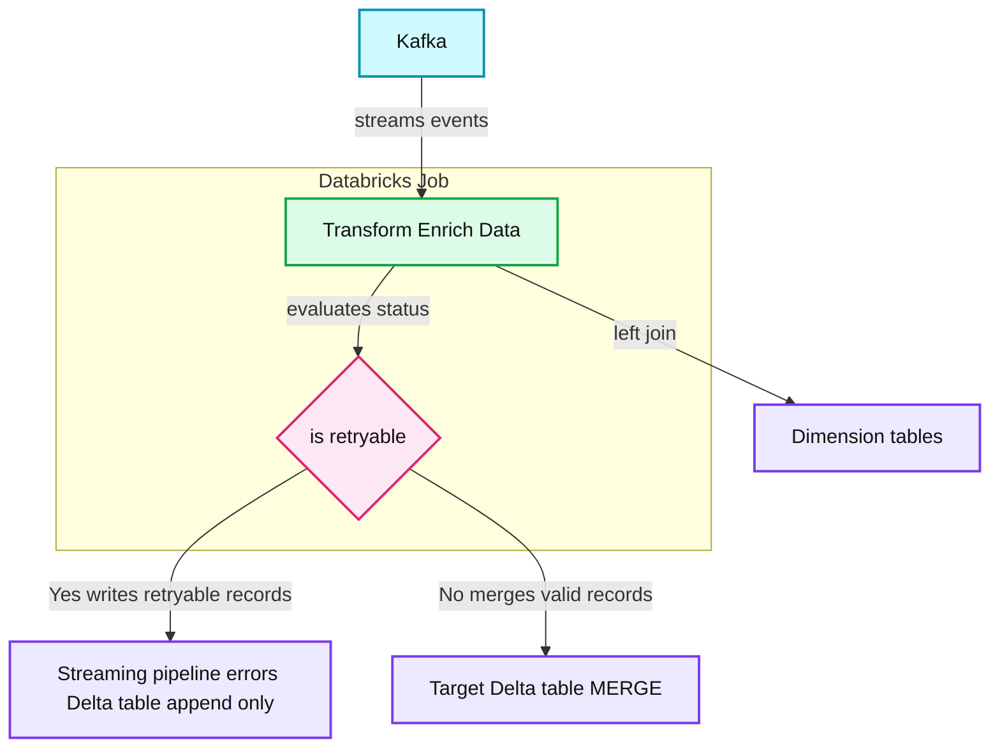
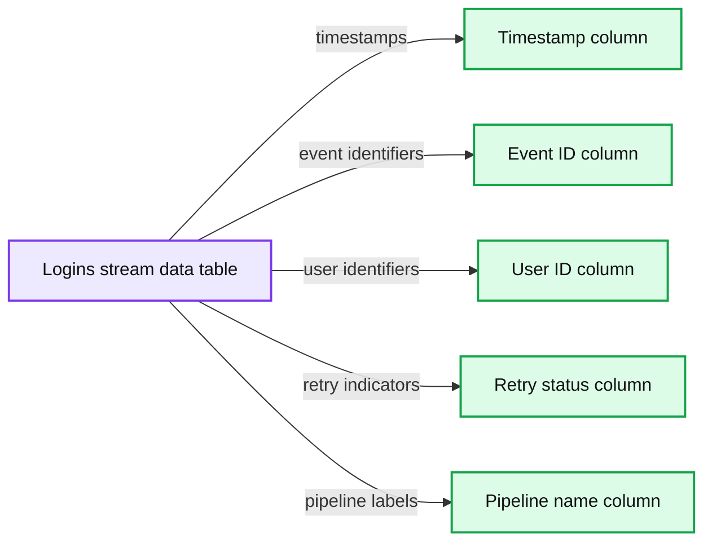
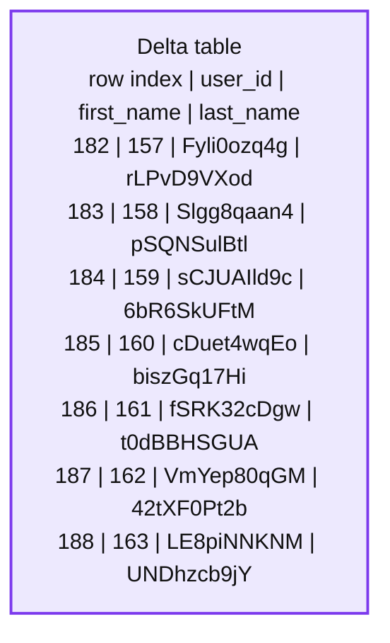
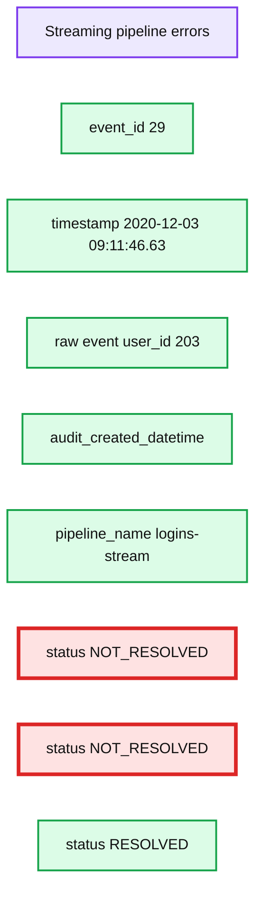
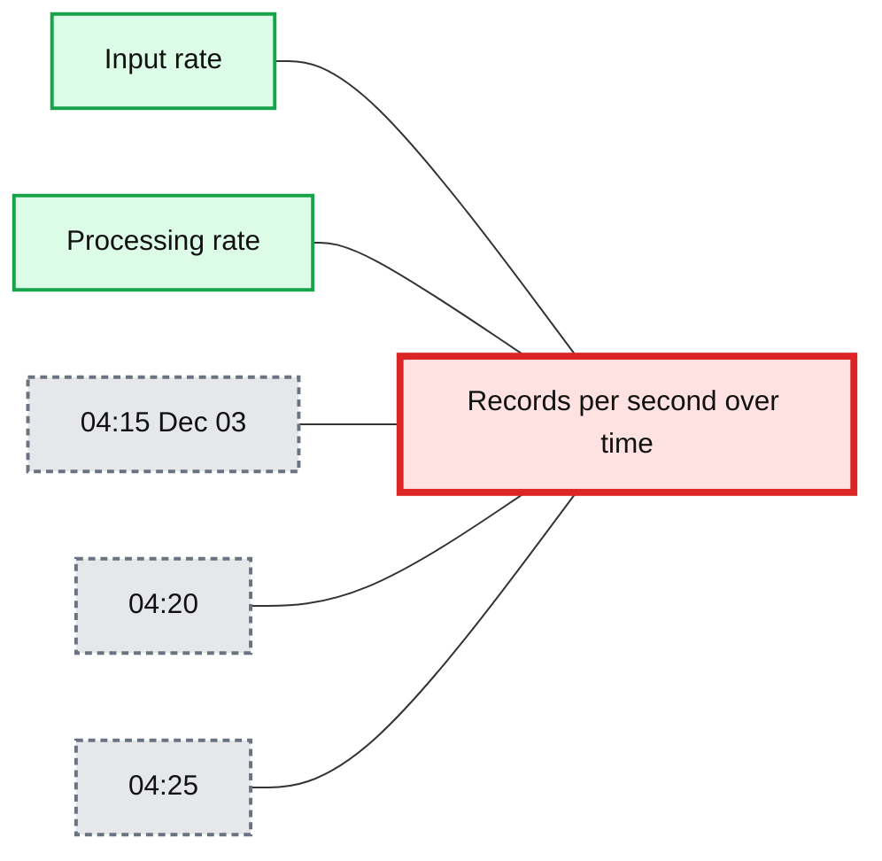

# Handling Late Arriving Dimensions Using a Reconciliation Pattern

*Solving a common engineering ‘annoyance’ with the help of Apache Spark*

- Source: https://www.databricks.com/blog/2020/12/15/handling-late-arriving-dimensions-using-a-reconciliation-pattern.html
- Published: 2020-12-15
- Authors: Chaitanya Chandurkar
- Categories: company, customers, data-streaming
- Images: 9 total, 8 extracted as architecture

|  | This is a guest community post authored by Chaitanya Chandurkar, Senior Software Engineer in the Analytics and Reporting team at McGraw Hill Education. Special thanks to MHE Analytics team members Nick Afshartous, Principal Engineer; Kapil Shrivastava, Engineering Manager; and Steve Stalzer, VP of Engineering / Analytics and Data Science, for their contributions. |
|---|---|

Processing facts and dimensions is the core of data engineering. Fact and dimension tables appear in what is commonly known as a Star Schema. Its purpose is to keep tables denormalized enough to write simpler and faster SQL queries. In a data warehouse, a dimension is more like an entity that represents an individual, a non-overlapping data element where the facts are behavioral data produced as a result of an action on or by a dimension. A fact table is surrounded by one or more dimension tables as it holds a reference to dimension natural or surrogate keys.

Late-arriving transactions (facts) aren't as annoying as late-arriving dimensions. In order to ensure the accuracy of the data, usually dimensions are processed first as they need to be looked up while processing the facts for enrichment or validation. In this blog post, we are going to look at a few use cases of late-arriving dimensions and potential solutions to handle it in Apache Spark pipelines.

## Architecture and Constraints

*Figure 1 - The Architecture and Constraints*

**Summary:** The diagram shows a hybrid streaming and batch ETL architecture using Kafka, Delta Lake, PostgreSQL, and REST APIs.

**Components:**

- Consumer Facing Applications
- Kafka event broker
- Raw Data Stream
- Raw Event Store using Delta Lake
- Dimension and Fact Streams
- Delta Tables using MERGE
- Aggregate Data
- Batch ETL Jobs
- External Data Stores
- Analytical Slices using PostgreSQL
- REST APIs

**Flows:**

- Consumer Facing Applications -> Kafka: Eventing data
- Kafka -> Raw Data Stream: Raw events
- Raw Data Stream -> Raw Event Store: Append-only event data
- Kafka -> Dimension and Fact Streams: Dimension and fact events
- Dimension and Fact Streams -> Delta Tables: Streamed records for MERGE
- External Data Stores -> Batch ETL Jobs: External dimensions
- Batch ETL Jobs -> Delta Tables: Dimension updates
- Delta Tables -> Aggregate Data: Data for scheduled aggregation
- Aggregate Data -> Analytical Slices: Aggregated data
- Analytical Slices -> REST APIs: Reporting data

**Numbers:** none

source image: https://www.databricks.com/sites/default/files/inline-images/blog-design-late-image-1.png

```mermaid
%% Hybrid streaming and batch ETL architecture with Delta Lake analytics
flowchart LR
    A[Consumer Facing Applications] -->|Eventing data| B[Kafka]
    B -->|Raw events| C[Raw Data Stream]
    C -->|Append-only event data| D[Raw Event Store using Delta Lake]
    B -->|Dimension and fact events| E[Dimension and Fact Streams]
    E -->|Streamed records for MERGE| F[Delta Tables using MERGE]
    G[External Data Stores] -->|External dimensions| H[Batch ETL Jobs]
    H -->|Dimension updates| F
    F -->|Data for scheduled aggregation| I[Aggregate Data]
    I -->|Aggregated data| J[Analytical Slices using PostgreSQL]
    J -->|Reporting data| K[REST APIs]

    classDef client fill:#dbeafe,stroke:#2563eb,stroke-width:2px,color:#111
    classDef service fill:#dcfce7,stroke:#16a34a,stroke-width:2px,color:#111
    classDef store fill:#ede9fe,stroke:#7c3aed,stroke-width:2px,color:#111
    classDef cache fill:#fef3c7,stroke:#d97706,stroke-width:2px,color:#111
    classDef queue fill:#cffafe,stroke:#0891b2,stroke-width:2px,color:#111
    classDef critical fill:#fee2e2,stroke:#dc2626,stroke-width:4px,color:#111
    classDef external fill:#e5e7eb,stroke:#6b7280,stroke-width:2px,color:#111,stroke-dasharray:4 3
    classDef decision fill:#fce7f3,stroke:#db2777,stroke-width:2px,color:#111

    class A,K client
    class B,C,E queue
    class D,F,J store
    class G external
    class H,I service
```

Figure 1 - The Architecture and Constraints

To give a little bit of context: The Analytics & Reporting team at [McGraw Hill](https://www.mheducation.com/) provides data processing and reporting services that operate downstream from the application. This service has a hybrid ETL structure. Some facts and dimensions generated by our customer-facing applications are consumed in near real-time, transformed, and stored in delta tables. Few dimensions that are not streamed yet, are ingested in batch ETLs from different parts of the system. Some facts that are streamed have a reference to keys of the dimension table. In some cases, it's possible that the fact being processed does not have a corresponding dimension entry yet because it’s waiting on ETL’s next run or has some problems upstream.

Even if other dimensions were streamed, it would still be possible for corresponding facts to arrive in close proximity.. Think of an automated test generating synthetic data in a lower environment. Another example that can be often seen is organizational migration. Private schools sometimes migrate under a district. This entity migration triggers a wave of Slowly Changing Dimensions and the facts streamed afterward should use the updated dimensions. In such cases, when attempting to join facts and dimensions, it's possible that the join will fail due to late-arriving dimensions.

The margin of error here can be reduced by scheduling ETL jobs efficiently to ensure new dimensions are processed before processing the new facts. At McGraw Hill, this is not an option because significant delays do occasionally occur in our source systems.

## Potential Solutions

There are a few solutions that can be incorporated depending on the use cases and constraints enforced by the infrastructure.

### Process now and hydrate later

In this approach, even if dimension lookup fails,  facts are dumped into fact tables with default values in the dimension columns and have a hydration process to periodically hydrate the missing dimension data in the facts table. You can filter out data with no or default dimension keys while querying that table to ensure that you aren't returning the bad data. The caveat of this approach is that it does not work where those dimension keys are the foreign keys in fact tables. Another limitation is that if facts are written to multiple destinations, the hydration process has to update missing dimension columns in all those destinations for the sake of data consistency.

### Early detection of late-arriving dimensions

We can detect the early-arriving facts instead (facts for which the corresponding dimension has not arrived yet), put them on hold, and retry them after a period until either they get processed or exhaust retries. This ensures data quality and consistency in the target tables. At McGraw Hill, we have many such streaming pipelines that read facts from Kafka, lookup multiple dimension tables, and write to multiple destinations. To handle such late-arriving dimensions, we built an internal framework that easily plugs into the streaming pipelines. The framework is built around a common pattern that all streaming pipelines use:

1. Read data from Kafka.
2. Transform facts and use the join to dimension tables.
3. If the dimension has not arrived yet, flag the fact record as `retryable`.
4. Write these retryable records in a separate delta table called `streaming_pipeline_errors`.
5. MERGE valid records into the target delta table.

*Figure 2 - The Common Streaming Pipeline Pattern*

**Summary:** A Databricks streaming job reads Kafka events, enriches them with dimension tables, and routes retryable or valid records to separate Delta tables.

**Components:**

- Kafka event stream
- Databricks Job for transformation and enrichment
- Dimension tables
- Retry decision using `is_retryable`
- Streaming pipeline errors Delta table, append-only
- Target Delta table, MERGE

**Flows:**

- Kafka -> Transform Enrich Data: streams events
- Transform Enrich Data -> Dimension tables: performs a left join
- Transform Enrich Data -> is retryable: evaluates processing status
- is retryable -> Streaming pipeline errors Delta table: writes retryable records
- is retryable -> Target Delta table: merges valid records
- is retryable -> Target Delta table: routes non-retryable records

**Numbers:** none

source image: https://www.databricks.com/sites/default/files/inline-images/blog-design-late-image-2.png

Figure 2 - The Common Streaming Pipeline Pattern

Records are flagged as "not_retryable" (is_retryable = false) if it is there's a schema validation failure (no use of retrying such events). Now, how do we reprocess fact data from the `streaming_pipeline_errors` table given a few limitations on the infrastructure:

1. We could not put this data back on Kafka because such duplicate events are like noise to other consumers.
2. We cannot not have another instance of the job running purely in "reconciliation" mode (re-process data only from error tables) as delta does not support doing concurrent MERGE operations on the same delta table.
3. We could stop the regular job and run only the "reconciliation" version of this job but it could get complicated to orchestrate that with streaming jobs as they run in continuous mode.

A mechanism was needed to process retryable data along with the new data without having to send it back to Kafka. Spark allows you to UNION two or more data frames as long as they have the same schema. Retryable records can be unioned with the new data from Kafka and process it all together. That's how the reconciliation pattern was designed.

## The Reconciliation Pattern

The reconciliation pattern uses a 2-step process to prepare the data to be reconciled.

1. Write unjoined records to the streaming_pipeline_errors table.
2. Put a process in place that consolidates multiple failed retries for the same event into a new single fact row with more metadata about the retries.

Using a scheduled batch process for Step-2 could automatically control the frequency of retries through its schedule.

*Figure 3 - The Reconciliation Pattern*

**Summary:** The reconciliation pattern combines Kafka events with retryable records, enriches them with dimension tables, and merges valid records into the target delta table while routing retryable failures through batch reconciliation.

**Components:**

- Kafka Stream
- Databricks Job
- UNION ALL data combination
- Transform and Enrich Data
- Dimension tables
- Target delta table using MERGE
- Streaming pipeline errors delta table using append-only storage
- Reconciliation Table using MERGE
- Batch Job for deduplication and retry counting
- Retryability decision

**Flows:**

- Kafka Stream -> UNION ALL: regular events
- Reconciliation Table -> UNION ALL: retryable records
- UNION ALL -> Transform and Enrich Data: unioned events with `is_retry_event`
- Transform and Enrich Data -> Dimension tables: LEFT Join
- Transform and Enrich Data -> Retryability decision: enriched data with `is_retryable`
- Retryability decision -> Streaming pipeline errors delta table: retryable records when `is_retryable OR is_retry_event` is Yes
- Streaming pipeline errors delta table -> Batch Job: failed streaming records
- Batch Job -> Reconciliation Table: deduplicated retryable records with retry count
- Retryability decision -> Target delta table: non-retryable records when the decision is No
- Batch Job -> Reconciliation Table: `retries: int`

**Numbers:** none

source image: https://www.databricks.com/sites/default/files/inline-images/blog-design-late-image-3.png

```mermaid
%% Reconciliation pattern for late arriving dimensions
flowchart LR
    kafka[Kafka Stream] -->|regular data| union[UNION ALL inject retryable events with regular data]
    recon[Reconciliation Table MERGE] -->|retryable records| union
    union -->|is retry event boolean| enrich[Transform and Enrich Data]
    dims[Dimension tables] -->|LEFT Join| enrich
    enrich -->|is retryable boolean| decision{is retryable OR is retry event}
    decision -->|Yes| errors[Streaming pipeline errors delta table append only]
    errors -->|failed records| batch[Batch Job dedup retries and count total retries]
    batch -->|retryable records and retries int| recon
    decision -->|No| target[Target delta table MERGE]

    classDef client fill:#dbeafe,stroke:#2563eb,stroke-width:2px,color:#111
    classDef service fill:#dcfce7,stroke:#16a34a,stroke-width:2px,color:#111
    classDef store fill:#ede9fe,stroke:#7c3aed,stroke-width:2px,color:#111
    classDef cache fill:#fef3c7,stroke:#d97706,stroke-width:2px,color:#111
    classDef queue fill:#cffafe,stroke:#0891b2,stroke-width:2px,color:#111
    classDef critical fill:#fee2e2,stroke:#dc2626,stroke-width:4px,color:#111
    classDef external fill:#e5e7eb,stroke:#6b7280,stroke-width:2px,color:#111,stroke-dasharray:4 3
    classDef decision fill:#fce7f3,stroke:#db2777,stroke-width:2px,color:#111

    class kafka queue
    class recon,errors,target store
    class union,enrich,batch service
    class dims external
    class decision decision
```

Figure 3 - The Reconciliation Pattern

This is how the flow looks like:

1. Read new events from Kafka.
2. Read retryable events from the reconciliation table.
3. UNION Kafka and retryable events.
4. Transform/Join this unioned data with users dimension table.
5. If there's any early arriving fact (dimension has not arrived yet), mark it as retryable.
6. Write retryable records to the `streaming_pipeline_errors` table.
7. MERGE all the good records into the target delta table.
8. A scheduled batch job dedupes new error records and MERGE into a reconciliation table with updated retry count and status.
9. Data written to the reconciliation table is picked up by the streaming pipeline in the next trigger.

In a streaming pipeline, data read from reconciliation is flagged as `retry_event`. All the failed retries are written back to the `streaming_pipeline_errors` table with status = 'NOT_RESOLVED'. When the reconciliation job MERGEs this data into the reconciliation table, it updates the number of retry counts for such failed retries. After certain retries, If data joins with the dimension table, we write it to the target table and also write an updated status to the `streaming_pipeline_errors` table with `status = RESOLVED` indicating that this event is processed successfully so that it is not injected back into the stream in next trigger.

Since the reconciliation table has the `retry_count`, each pipeline can control how many retries are allowed by filtering out reconciliation records that exceed the configured number of retries. If a certain event exhausts the max retry count, the reconciliation job updates its status as DEAD and is not retried anymore.

## Example

Refer to this [databricks notebook](https://www.databricks.com/notebooks/design-approach-reconcile-test.html) for a sample code. This is the miniature example of our logins pipeline that computes usage stats of our consumer-facing applications. Here login events are processed in near real-time. It joins login events with the user’s dimension table which is updated by another ETL that is scheduled as a batch job.

Logins data from Kafka unioned with retryable data from reconciliation table:

**Summary:** A table shows retryable and successfully processed login events from the logins stream, including timestamps, identifiers, retry status, and pipeline name.

**Components:**

- Timestamp column
- Event ID column
- User ID column
- Retry status column
- Pipeline name column
- Logins stream data table

**Flows:**

- Logins stream data table -> Timestamp column: event processing timestamps
- Logins stream data table -> Event ID column: login event identifiers
- Logins stream data table -> User ID column: user identifiers
- Logins stream data table -> Retry status column: retry indicators
- Logins stream data table -> Pipeline name column: pipeline labels

**Numbers:** 161, 162, 163, 164, 165, 166, 167, 2020-12-03 09:12:47.63, 90, 209, 2020-12-03 09:12:50.63, 93, 216, 2020-12-03 09:12:52.63, 95, 207, 2020-12-03 09:13:43.425, 148, 169, 2020-12-03 09:13:51.425, 156, 12, 2020-12-03 09:13:44.425, 149, 23, 2020-12-03 09:13:52.425, 157, 98

source image: https://www.databricks.com/wp-content/uploads/2020/12/blog-design-late-4.png

Users data from delta table:

**Summary:** A sample Delta table displaying user IDs with first and last names.

**Components:**

- Delta table with columns `user_id`, `first_name`, and `last_name`
- Row index column

**Flows:**

- none

**Numbers:** Row indices 182, 183, 184, 185, 186, 187, 188; user IDs 157, 158, 159, 160, 161, 162, 163

source image: https://www.databricks.com/wp-content/uploads/2020/12/blog-design-late-5.png

Let’s isolate a particular event #29. Looking at `streaming_pipeline_errors` logs, it can be seen that this event was retried two times before it was successfully joined with corresponding dimensions.

**Summary:** The table shows three error-log records for event 29, including two unresolved attempts followed by one resolved attempt.

**Components:**

- `event_id` field
- `timestamp` field
- `raw` event payload
- `audit_created_datetime` field
- `pipeline_name` field
- `status` field
- `logins-stream` pipeline

**Flows:**

- None visible.

**Numbers:**

- Event ID: 29
- User ID: 203
- Timestamp: `2020-12-03 09:11:46.63`
- Audit times: `2020-12-03T09:12:05.105+0000`, `2020-12-03T09:14:00.113+0000`, `2020-12-03T09:18:09.629+0000`
- Statuses: `NOT_RESOLVED`, `NOT_RESOLVED`, `RESOLVED`

source image: https://www.databricks.com/wp-content/uploads/2020/12/design-approach-6-opt-1.png

When these error logs are consolidated to a single row in reconciliation table:

**Summary:** A reconciliation table row consolidates a late-arriving event and its retry metadata.

**Components:**

- Raw event payload, technology not specified
- Event ID, technology not specified
- Pipeline name, technology not specified
- Status, technology not specified
- Retry count, technology not specified
- Error creation datetime, technology not specified
- Audit creation datetime, technology not specified

**Flows:**

- None visible

**Numbers:** 1, 29, 203, 2020-12-03 09:11:46.63, -1, 2020-12-03T09:12:05.105+0000, 2020-12-03T09:13:36.233+0000

```mermaid
%% Shows one consolidated reconciliation table row
flowchart LR
    A[Reconciliation table row]

    classDef client   fill:#dbeafe,stroke:#2563eb,stroke-width:2px,color:#111
    classDef service  fill:#dcfce7,stroke:#16a34a,stroke-width:2px,color:#111
    classDef store    fill:#ede9fe,stroke:#7c3aed,stroke-width:2px,color:#111
    classDef cache    fill:#fef3c7,stroke:#d97706,stroke-width:2px,color:#111
    classDef queue    fill:#cffafe,stroke:#0891b2,stroke-width:2px,color:#111
    classDef critical fill:#fee2e2,stroke:#dc2626,stroke-width:4px,color:#111
    classDef external fill:#e5e7eb,stroke:#6b7280,stroke-width:2px,color:#111,stroke-dasharray:4 3
    classDef decision fill:#fce7f3,stroke:#db2777,stroke-width:2px,color:#111
    class A store
```

source image: https://www.databricks.com/wp-content/uploads/2020/12/blog-design-late-7.png

A spike in records processed here indicates that more and more retryable records were getting accumulated faster than they were getting resolved. It indicates a potential issue in a batch job that loads dimensions. Once retries are exhausted or all events are processed, this spike will reduce. The best way to optimize this is to partition the reconciliation table on the `status` column so that you are only reading unresolved records.

**Summary:** Line chart comparing input rate and processing rate over time, showing processing spikes after reconciliation.

**Components:**

- Input rate, measured in records per second
- Processing rate, measured in records per second
- Time axis

**Flows:**

- none

**Numbers:** 0 rec/s, 0 rec/s, 04:15, Dec 03, 04:20, 04:25

source image: https://www.databricks.com/wp-content/uploads/2020/12/blog-design-late-8.png

## Conclusion

This reconciliation pattern becomes easy enough to plug into the existing pipelines once a tiny boilerplate framework is added on top of it. It works with both streaming and batch ETLs. In streaming, it relies on the checkpoint state to read new data from the reconciliation table. Whereas in batch mode, it has to rely on the latest timestamp to keep track of new data. The best way of doing this would be to use streams with Trigger--once.

This automated reconciliation saves a lot of manual effort. You can also add alerting and monitoring on top of it. The volume of retryable data can become a performance overhead as it grows over time. It's better to periodically clean those tables to get rid of older unwanted error logs and keep their size minimal.

[Try the Notebook](https://www.databricks.com/notebooks/design-approach-reconcile-test.html)
