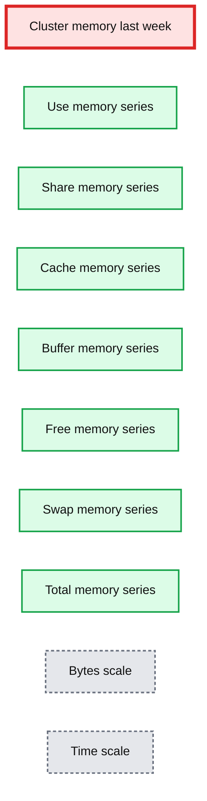
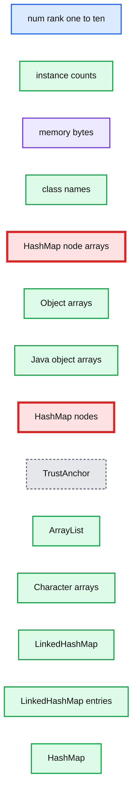

# A Step-by-step Guide for Debugging Memory Leaks in Spark Applications

- Source: https://www.databricks.com/blog/2020/12/16/a-step-by-step-guide-for-debugging-memory-leaks-in-spark-applications.html
- Published: 2020-12-16
- Authors: Shivansh Srivastava
- Categories: engineering, tutorials, data-streaming
- Images: 5 total, 3 extracted as architecture

This is a guest authored post by Shivansh Srivastava, software engineer, Disney Streaming Services. It was [originally published](https://medium.com/disney-streaming/a-step-by-step-guide-for-debugging-memory-leaks-in-spark-applications-e0dd05118958) on Medium.com

## Just a bit of context

We at Disney Streaming Services use [Apache Spark](https://spark.apache.org/) across the business and [Spark Structured Streaming](https://spark.apache.org/docs/latest/structured-streaming-programming-guide.html) to develop our pipelines. These applications run on the [Databricks Runtime(DBR) environment](https://www.databricks.com/glossary/what-is-databricks-runtime#:~:text=Back%20to%20glossary%20Databricks%20Runtime,security%20of%20big%20data%20analytics.) which is quite user-friendly.

One of our Structured Streaming Jobs uses [**flatMapGroupsWithState**](https://www.databricks.com/blog/2017/10/17/arbitrary-stateful-processing-in-apache-sparks-structured-streaming.html) where it accumulates state and performs grouping operations as per our business logic. This job kept on crashing approximately every 3 days. Sometimes even less, and then after that, the whole application got restarted, because of the retry functionality provided by DBR environment. If this had been a normal batch job this would have been acceptable but in our case, we had a structured streaming job and a low-latency SLA to meet. This is the tale of our fight with **OutOfMemory Exception(OOM)** and how we tackled the whole thing.

Below is the 10-step approach we as a department took to solving the problem:

## Step 1: Check Driver logs. What’s causing the problem?

If a problem occurs resulting in the failure of the job, then the driver logs (which can be directly found on the Spark UI) will describe why the last retry of the task failed.

If a task fails more than four (4) times (if spark.task.maxFailures = 4 ), then the reason for the last failure will be reported in the driver log, detailing why the whole job failed.

In our case, it showed that the executor died and got disassociated. Hence the next step was to find out why.

## Step 2: Check Executor Logs. Why are they failing?

In our executor logs, generally accessible via ssh, we saw that it was failing with OOM.

We encountered two types of OOM errors:

1. java.lang.OutOfMemoryError: GC Overhead limit exceeded
2. java.lang.OutOfMemoryError: Java heap space.

Note: JavaHeapSpace OOM can occur if the system doesn’t have enough memory for the data it needs to process. In some cases, choosing a bigger instance like [i3.4x large](https://aws.amazon.com/ec2/instance-types/)(16 vCPU, 122Gib ) can solve the problem.

Another possible solution could be to tune the parameters to ensure consumption of what can be processed. What this essentially means is that enough memory must be available to process the amount of data to be processed in one micro-batch.

## Step 3: Check Garbage Collector Activity

We saw from our logs that the Garbage Collector (GC) was taking too much time and sometimes it failed with the error GC Overhead limit exceeded when it was trying to perform the full garbage collection.

According to Spark [documentation](https://spark.apache.org/docs/latest/tuning.html), [G1GC](https://www.oracle.com/technical-resources/articles/java/g1gc.html) can solve problems in some cases where garbage collection is a bottleneck. We enabled G1GC using the following configuration:

Thankfully, this tweak improved a number of things:

1. Periodic GC speed improved.
2. Full GC was still too slow for our liking, but the cycle of full GC became less frequent.
3. GC Overhead limit exceeded exceptions disappeared.

However, we still had the Java heap space OOM errors to solve. Our next step was to look at our cluster health to see if we could get any clues.

## Step 4: Check your Cluster health

Databricks clusters provide support for [Ganglia](https://sourceforge.net/projects/ganglia/), a scalable distributed monitoring system for high-performance computing systems such as clusters and grids.

Our Ganglia graphs looked something like this:

**Summary:** The chart shows cluster memory usage over the week, with separate plotted series for use, share, cache, buffer, free, swap, and total memory.

**Components:**

- Cluster memory last week
- Use memory series
- Share memory series
- Cache memory series
- Buffer memory series
- Free memory series
- Swap memory series
- Total memory series
- Bytes scale
- Time scale

**Flows:**

- none

**Numbers:**

- Y-axis: 0.0 T, 0.5 T, 1.0 T, 1.5 T, 2.0 T, 2.5 T
- Dates: Tue 01 Sep, Thu 03 Sep, Sat 05 Sep
- Use: Now 579.0G, Min 268.2G, Avg 1.1T, Max 1.8T
- Share: Now 0.0, Min 0.0, Avg 0.0, Max 0.0
- Cache: Now 37.1G, Min 18.4G, Avg 32.4G, Max 38.3G
- Buffer: Now 0.0, Min 0.0, Avg 0.0, Max 0.0
- Free: Now 1.7T, Min 403.7G, Avg 1.2T, Max 2.0T
- Swap: Now 8.5k, Min 0.0, Avg 795.8M, Max 0.0
- Total: Now 2.3T, Min 2.3T, Avg 2.3T, Max 2.3T



<sub>source image: https://www.databricks.com/wp-content/uploads/2020/12/blog-disney-1.png</sub>

Cluster Memory Screenshot from Ganglia

**Summary:** Ganglia screenshots show memory usage across multiple cluster workers, generally rising from around 0 to 100 G before dropping sharply.

**Components:**

- Cluster memory graph panels using Ganglia
- Worker memory graph panels using Ganglia
- Memory usage axis measured in bytes
- Time axis spanning 01 Sep to 05 Sep

**Flows:**

- none

**Numbers:**

- 0, 20 G, 40 G, 50 G, 60 G, 100 G
- 01 Sep, 03 Sep, 05 Sep
- 16 graph panels

```text
%% mermaid failed to render; kept as text
%% Ganglia cluster and worker memory graphs showing rising usage and sharp drops
flowchart LR
    A[Cluster memory graphs] --> B[Worker memory graphs]: memory usage over time
    B --> C[Ganglia monitoring]: rendered metrics

    classDef client fill:#dbeafe,stroke:#2563eb,stroke-width:2px,color:#111
    classDef service fill:#dcfce7,stroke:#16a34a,stroke-width:2px,color:#111
    classDef store fill:#ede9fe,stroke:#7c3aed,stroke-width:2px,color:#111
    classDef cache fill:#fef3c7,stroke:#d97706,stroke-width:2px,color:#111
    classDef queue fill:#cffafe,stroke:#0891b2,stroke-width:2px,color:#111
    classDef critical fill:#fee2e2,stroke:#dc2626,stroke-width:4px,color:#111
    classDef external fill:#e5e7eb,stroke:#6b7280,stroke-width:2px,color:#111,stroke-dasharray:4 3
    classDef decision fill:#fce7f3,stroke:#db2777,stroke-width:2px,color:#111
    A:::service
    B:::service
    C:::external
```

<sub>source image: https://www.databricks.com/wp-content/uploads/2020/12/blog-disney-debug-2.png</sub>

Worker_Memory Screenshot from Ganglia

The graphs tell us that the cluster memory was stable for a while, started growing, kept on growing, and then fell off the edge. What does that mean?

1. This was a stateful job so maybe we were not clearing out the state over time.
2. A memory leak could have occurred.

## Step 5: Check your Streaming Metrics

Looking at our streaming metrics took us down the path of eliminating the culprits creating the cluster memory issue. Streaming metrics, emitted by Spark, provide information for every batch processed.

It looks something like this:

Note: These are not our real metrics. It's just an example.

Plotting *stateOperators.numRowsTotal* against event time, we noticed stability over time. Hence it eliminates the possibility that OOM is occurring because of the state being retained.

The conclusion: a memory leak occurred, and we needed to find it. To do so, we enabled the heap dump to see what is occupying so much memory.

## Step 6: Enable HeapDumpOnOutOfMemory

To get a heap dump on OOM, the following option can be enabled in the Spark Cluster configuration on the executor side:

Additionally, a path can be provided for heap dumps to be saved. We use this configuration because we can access it from the Databricks Data + AI Platform. You can also access these files by ssh-ing into the workers and downloading them using tools like [rsync](https://linux.die.net/man/1/rsync).

## Step 7: Take Periodic Heap dumps

Taking periodic heap dumps allow for analysis of multiple heap dumps to be compared with the OOM heap dumps. We took heap dumps every 12 hrs from the same executor. Once our executor goes into OOM, we would have at least two dumps available. In our case, executors were taking at least 24 hours to go into OOM.

Steps to take periodic heap dump:

1. ssh into worker
2. Get Pid using top of the java process
3. Get Heapdump jmap -dump:format=b,file=pbs_worker.hprof
4. Provide correct permissions to Heapdump file.
 sudo chmod 444 pbs_worker.hprof
5. Download file on your local
 ./rsync -chavzP --stats
 ubuntu@:/home/ubuntu/pbs_worker.hprof .

## Step 8: Analyze Heap Dumps

Heap dump analysis can be performed with tools like [YourKit](https://www.yourkit.com/) or [Eclipse MAT.](https://www.eclipse.org/mat/)

In our case, heap dumps were large — in the range of 40gb or more. The size of the heap dumps made it difficult to analyze. There is a [workaround](https://stackoverflow.com/questions/7254017/tool-for-analyzing-large-java-heap-dumps/7254494) that can be used to index the large files and then analyze them.

## Step 9: Find where it is leaking memory by looking at Object Explorer

YourKit provides ***inspection*** of *hprof* files. If the problem is obvious, it will be shown in the inspection section. In our case, the problem was not obvious.

Looking at our heap histogram, we saw many HashMapNode instances, but based on our business logic, didn’t deem the information too concerning.

**Summary:** Heap histogram showing the ten largest Java object classes by instance count and retained bytes.

**Components:**

- `num` column: ranked entries.
- `#instances` column: Java object instance counts.
- `#bytes` column: memory usage in bytes.
- `class name` column: Java and JVM array classes.
- `java.util.HashMap$Node`: HashMap node objects.
- `java.security.cert.TrustAnchor`: Java security certificate objects.
- `java.util.ArrayList`: Java list objects.
- `java.util.LinkedHashMap`: Java linked hash maps and entries.

**Flows:**

- none

**Numbers:** 1, 2, 3, 4, 5, 6, 7, 8, 9, 10; 1564017; 69427563064; 545680; 10133335368; 33340528; 347069952; 66663378; 3199842144; 33326336; 2132885504; 33849498; 1353979920; 871727; 96696736; 1042055; 91700840; 1308965; 83773760; 1304119; 83463616



<sub>source image: https://www.databricks.com/wp-content/uploads/2020/12/blog-disney-3.png</sub>

HeapHistogram Screenshot from Spark UI

When we looked at the class and packages section in YourKit, we found the same results; as we had expected.

HeapDump Analysis Screenshot from YourKit

What took us by surprise was HashMap$Node[16384] growing over periodic heap dump files. Looking inside HashMap$Node[16384] revealed that these HashMaps were not related to business logic but the AWS SDK.

Screenshot from YourKit

A quick Google search and code analysis gave us our answer: we were not closing the connection correctly. The same issue has also been addressed on the [aws-sdk Github issues](https://github.com/aws/aws-sdk-java-v2/issues/1679).

## Step 10: Fix the memory leak

By analyzing the heap dump, we were able to determine the location of the problem. While making a connection to Kinesis, we created a new Kinesis client for every partition when the connection was opened (general idea copied from [Databricks’ Kinesis documentation](https://docs.databricks.com/_static/notebooks/structured-streaming-kinesis-sink.html)):

But in the case of closing the connection, we were closing only the **KinesisClient**:

The Apache Http client was not being closed. This resulted in an increasing number of Http clients being created and TCP connections being opened on the system, causing the issue discussed [here](https://github.com/aws/aws-sdk-java-v2/issues/1679). The aws-sdk [documentation](https://github.com/aws/aws-sdk-java-v2/blob/master/services/sts/src/main/java/software/amazon/awssdk/services/sts/auth/StsAssumeRoleCredentialsProvider.java#L36) states that:

We were able to prove it out using the following script:

## Conclusion

What we’ve seen in this post is an example of how to diagnose a memory leak happening in a Spark application. If I faced this issue again, I would attach a JVM profiler to the executor and try to debug it from there.

From this investigation, we got a better understanding of how Spark structured streaming is working internally, and how we can tune it to our advantage. Some lessons learned that are worth remembering:

1. Memory leaks can happen, but there are a number of things you can do to investigate them.
2. We need better tooling to read large hprof files.
3. If you open a connection, when you are done, always close it.
