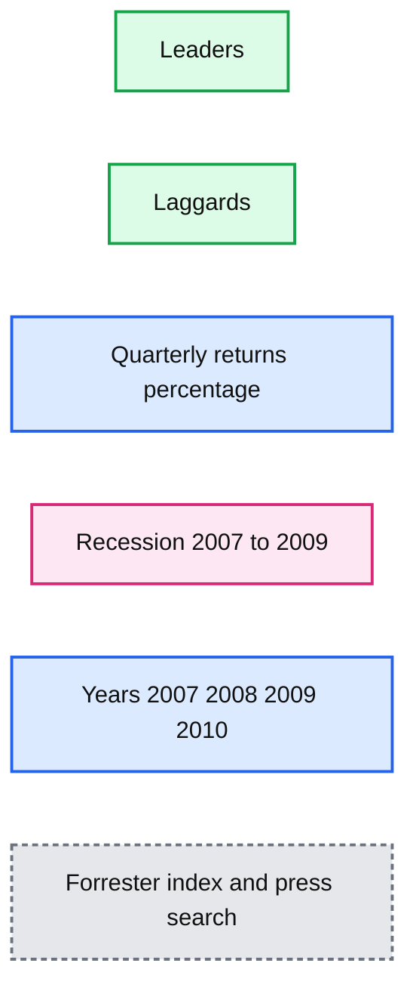

# Personalizing the Customer Experience with Recommendations

- Source: https://www.databricks.com/blog/2020/12/18/personalizing-the-customer-experience-with-recommendations.html
- Published: 2020-12-18
- Authors: Rob Saker, Bryan Smith, Bilaji Raman, Ye Wang, Yiyan Zhang, Terry Tang
- Categories: engineering, data-science-machine-learning, solution-accelerators
- Images: 2 total, 1 extracted as architecture

> Go directly to the Recommendation notebooks referenced throughout this post.

**Retail made a giant leap forward in the adoption of e-commerce in 2020, E-commerce as a percentage of total retail saw multiple years of progress in one year. Meanwhile, COVID, lockdowns and economic uncertainty have completely disrupted how we engage and retain customers. Companies need to rethink personalization to effectively compete in this period of rapid change.**

In 2020, we saw a rapid shift in consumer behavior, not just in the adoption of e-commerce. Store brands saw increased consumer adoption. Staple goods saw a resurgence in demand. Customers not only rethought their relationships with specific products but retailers as well, spreading their spend across multiple retail partners. The relevance of in-store displays, features and promotions was challenged by leading retailers capable of driving 35% of their revenue through personalized recommendations.

Providing an experience that makes customers feel understood helps retailers stand out from the crowd of mass merchants and build loyalty. This was true before COVID but shifting consumer preferences make this more critical for retail organizations. With research showing the cost of customer acquisition being as much as five times as retaining existing ones, organizations looking to succeed in the new normal must continue to build deeper connections with the existing customers in order to retain a solid consumer base. There is no shortage of options and incentives for today’s consumers to rethink long-established patterns of spending.

## Personalization is a must to compete

Presented with overwhelming choice, consumers expect the brands they buy and the organizations they buy them from to deliver an experience aligned with their needs and preferences. Personalization, once presented as an exotic [vision](https://www.goodreads.com/book/show/724622.The_One_to_One_Future) for what could be, is increasingly becoming the baseline expectation for consumers continuously connected, short on time and seeking [value](https://www.bain.com/insights/the-elements-of-value-hbr/) through an increasingly more complex set of considerations.

Brands that deliver personalized experiences can compete with these retail giants. In a [pre-COVID analysis](https://www.epsilon.com/us/about-us/pressroom/new-epsilon-research-indicates-80-of-consumers-are-more-likely-to-make-a-purchase-when-brands-offer-personalized-experiences) of consumer attitudes and spending patterns, 80% of participants indicated they were more likely to do business with a company offering personalized experiences. Those individuals were found to be 10-times more likely to make 15 or more purchases per year with organizations they believe understood and responded to their personal needs and preferences. In a separate survey, 50% of participants reported seeing the brands they buy as extensions of themselves, driving deeper, more sustained [customer loyalty](https://retailleader.com/personalization-new-loyalty-research-says) for the brands that [get it right](https://www.forrester.com/report/Use-Personalization-To-Drive-Loyalty-And-Customer-Obsession/RES157237).

As COVID forced a [shift](https://www.mckinsey.com/business-functions/marketing-and-sales/our-insights/a-global-view-of-how-consumer-behavior-is-changing-amid-covid-19) in consumer focus towards value, availability, quality, safety and community, brands most attuned to changing needs and sentiments saw customers [switch](https://martechseries.com/sales-marketing/customer-experience-management/braze-survey-one-in-four-consumers-tried-new-brand-during-covid-19/) from [rivals](https://www.retailtouchpoints.com/resources/personalization-gains-new-relevance-as-covid-19-challenges-brand-loyalties). While some segments gained business and many lost, organizations that had already begun the journey towards improved customer experience saw better outcomes, closely mirroring patterns [observed](https://www.mckinsey.com/~/media/McKinsey/Business%20Functions/Marketing%20and%20Sales/Our%20Insights/Adapting%20customer%20experience%20in%20the%20time%20of%20coronavirus/Adapting-customer-experience-in-the-time-of-coronavirus.ashx) in the 2007-2008 recession (Figure 1).

*)*

**Summary:** Quarterly shareholder returns show customer-experience leaders outperforming laggards, especially during the 2007-09 recession.

**Components:**

- Leaders: customer-experience leader return series; technology not specified
- Laggards: customer-experience laggard return series; technology not specified
- Quarterly return axis: percentage scale
- Recession comparison: 2007-09 period
- Source: Forrester Customer Experience Performance Index and press search

**Flows:**

- none

**Numbers:** 3×; 2007-09; 2007; 2008; 2009; 2010; 300%; 200%; 100%; 0%; -100%; -200%; -300%; -400%; -500%; -600%; -700%; -800%; footnote 1

source image: https://www.databricks.com/wp-content/uploads/2020/12/blog-p13n-1.png

 Figure 1. CX leaders outperform laggards, even in a down market, a visualization of the Forrester Customer Experience Performance Index as provided by McKinsey & Company ([link](https://www.mckinsey.com/~/media/McKinsey/Business%20Functions/Marketing%20and%20Sales/Our%20Insights/Adapting%20customer%20experience%20in%20the%20time%20of%20coronavirus/Adapting-customer-experience-in-the-time-of-coronavirus.ashx)

)

As we look towards what will be the new normal, it is clear that the personalization of customer experiences will remain a key focus for many B2C and even [B2B organizations](https://hbr.org/2017/07/how-b2b-sellers-are-offering-personalization-at-scale). Increasingly, market analysts are recognizing customer experience as a [disruptive force](https://sloanreview.mit.edu/article/the-experience-disrupters/) enabling upstart organizations to upend long-established players. Organizations focused on competing through product, placement, pricing and promotion alone will [find themselves under pressure from competitors](https://www.forbes.com/sites/forbestechcouncil/2020/02/26/the-so-called-retail-apocalypse-isnt-an-end-its-a-beginning/?sh=7fe3f60c372e) capable of delivering more value to consumers for each dollar received.

## Focus on the customer journey

Personalization starts with a careful exploration of the [customer journey](https://hbr.org/2015/11/competing-on-customer-journeys). This starts as customers come to recognize a need and move to identify a product to fulfill it. It then shifts towards the selection of a channel for its purchase and concludes with consumption, disposal and the possible repeat purchase. The path is varied and not simply linear, but with every stage, there is an opportunity for value to be created for the customer.

The [digitization of each stage](https://www.mckinsey.com/business-functions/mckinsey-digital/our-insights/the-drumbeat-of-digital-how-winning-teams-play) provides the customer with flexibility in terms of how they will engage and provides the organization with the ability to [assess the health of their model](https://www.bcg.com/en-us/publications/2020/three-personalization-imperatives-during-covid-crisis). While part and parcel of the online and mobile experience, digitization can be extended to the in-store, in-transit and even the in-home stages of the customer journey with appropriate considerations of transparency, privacy and value-add for the customer.

Figure 2. Bringing the digital experience into the store can be used to facilitate a personalized engagement

This customer-generated data as well as third-party inputs provide the organization with the information they need to refine their understanding of the customer and their unique journeys. Individual motivations, goals and preferences can now be better understood and more personalized experiences delivered to the customer.

The examination of the customer journey, its digitization and the analysis of the data generated by it are used to create a feedback loop through which the customer experience improves. To get this loop in motion and sustain it over time, a [clear vision for competing on customer experience](https://www.mckinsey.com/business-functions/operations/our-insights/the-human-touch-at-the-center-of-customer-experience-excellence) must be expressed. This vision must bring together the entire organization, not just marketing and their IT-enablers, around shared goals. These goals must then be translated into incentive structures that encourage cross-departmental collaboration and innovation. The organization’s journey towards delivering differentiating customer experiences is fundamentally a journey towards becoming a learning organization, one which puts insights into motion, celebrates the learnings that come with failure, and rapidly scales its successes to drive customer value.

## Leverage customer preferences

Personalization is multifaceted, but at various points in the customer journey, organizations will have the opportunity to select content, products, promotions to be presented to the customer. In these moments, we can take into consideration past feedback from customers to select the right items to present. Customer feedback doesn’t always come to us in the form of 1-to-5 star ratings or written reviews. Feedback may be expressed through interactions, dwell times, product searches, and purchase events. Careful consideration of how customers interact with various assets and how these interactions may be interpreted as expressions of preference can unlock a wide range of data with which you can enable personalization.

With feedback in hand, we now consider which items to present. Consider a customer browsing an assortment of recommended products, clicking on one, exploring alternatives to this item, putting it into their cart and then exploring items frequently bought in combination with this item. At each stage of this very narrow slice of the customer’s journey, the customer is interacting with our content with very different goals in mind. The customer’s preferences are unchanged throughout this journey but their intent leads us to use that information to make very different choices with regards to what we might present.

## Understand it’s as much art as science

The engines we use to serve content based on customer preferences are known as recommenders. To describe their construction as much Art as Science would be an understatement. With some recommenders, we focus heavily on the shared preferences of similar customers to expand the range of content we might expose to customers. With others, we focus on the properties of the content itself (e.g., product descriptions) and leverage user-specific interactions with related content to quantify the likelihood an item is likely to resonate with the customer. Each class of recommendation engine orients around a general goal, but within each, there are myriad decisions the business must make that orient its recommendations towards specific goals.

The complexity of these engines and the nature of why we build them are such that any upfront evaluation of their supposed accuracy is suspect. While offline evaluation methods have been proposed and should be employed to ensure that the recommenders we build are not flying off the rails, the reality is that we can only effectively evaluate their ability to assist us in achieving a particular goal by releasing them in limited pilots and assessing customer response. And in those assessments, it’s important to keep in mind that there is no expectation of perfection, only incremental improvement over the prior solution.

## Consider tradeoffs between performance & completeness

The primary challenge we must overcome in the assembly of any recommender is scalability. Consider a recommender leveraging user similarities. A small pool of 100,000 users requires the evaluation of approximately 5,000,000,000 user pairs and each of those evaluations may involve a comparison of preferences for each item we might recommend. From a purely technical standpoint, performing this number of calculations is not a problem, but the cost of doing it on a regular basis and within the time-constraints imposed on these systems makes a brute-force evaluation untenable.

It’s for this reason that the technical literature surrounding the development of recommender systems puts a heavy emphasis on approximate similarity techniques. These techniques offer shortcuts that allow us to home in on those users or items most likely to be similar to the objects we are comparing. With these techniques, there is a tradeoff between performance gains and recommendation completeness. So while these techniques are quite technically oriented, there is an important conversation to be had between solution architects and the business stakeholders about the right balance between these two considerations.

## Jumpstart your efforts with solution accelerators

It goes without saying that careful management of resources can go a long way to keeping the cost of on-going recommender development, training and deployment. Databricks is purpose-built for scalable development on cloud infrastructures that allow organizations to rapidly provision and then deprovision resources for exactly this reason.

To help our customers understand how they might use Databricks to develop various recommenders, we’ve made available a series of detailed notebooks as part of our Solution Accelerators program. Each notebook leverages a real-world dataset to show how raw data may be transformed into one or more recommender solutions.

The focus of these notebooks is on education. No one should take the techniques demonstrated here as the only way or even the preferred way to solve a specific recommendation challenge. Still, in wrestling with the issues described above, we hope that some portions of the presented code will assist our customers in tackling their own recommender needs.

#### **Collaborative Filter Recommenders**

- [CF 01: Data Preparation](https://www.databricks.com/wp-content/uploads/notebooks/recommenders/cf_01_data_preparation.html)
- [CF 02: Identify Similar Users](https://www.databricks.com/notebooks/recommenders/cf_02_identify_similar_users.html)
- [CF 03: Build User-Based Recommendations](https://www.databricks.com/notebooks/recommenders/cf_03_build_user-based_recommendations.html)
- [CF 04: Build Item-Based Recommendations](https://www.databricks.com/wp-content/uploads/notebooks/recommenders/cf_04_build_item-based_recommendations.html)
- [CF 05: Deploy Collaborative Filters](https://www.databricks.com/notebooks/recommenders/cf_05_deploy_collaborative_filters.html)

#### **Content-Based Recommenders**

You can also view our [on-demand webinar around personalization and recommendations](https://www.databricks.com/p/webinar/data-driven-personalization).

- [CN 01: Data Preparation](https://www.databricks.com/notebooks/recommenders/cn_01_data_preparation.html)
- [CN 02a: Determine Title Similarities](https://www.databricks.com/notebooks/recommenders/cn_02a_determine_title_similarity.html)
- [CN 02b: Determine Description Similarities](https://www.databricks.com/notebooks/recommenders/cn_02b_determine_description_similarity.html)
- [CN 02c: Determine Category Similarities](https://www.databricks.com/notebooks/recommenders/cn_02c_determine_category_similarity.html)
- [CN 03: Construct User-Profile Recommenders](https://www.databricks.com/wp-content/uploads/notebooks/recommenders/cn_03_construct_user-profile_recommenders.html)
- [CN 04 Deploy Content-based Recommenders](https://www.databricks.com/notebooks/recommenders/cn_04_deploy_content-based_recommenders.html)
