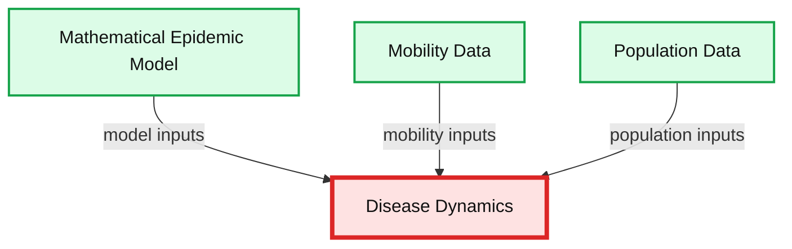
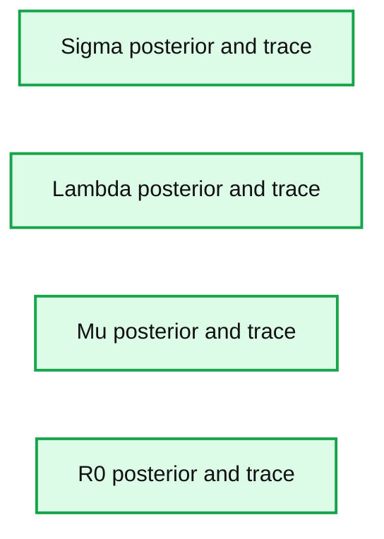

# Bayesian Modeling of the Temporal Dynamics of COVID-19 Using PyMC3

- Source: https://www.databricks.com/blog/2021/01/06/bayesian-modeling-of-the-temporal-dynamics-of-covid-19-using-pymc3.html
- Published: 2021-01-06
- Authors: Srijith Rajamohan, Ph.D.
- Categories: engineering, data-science-machine-learning
- Images: 7 total, 3 extracted as architecture

In this post, we look at how to use PyMC3 to infer the disease parameters for COVID-19. PyMC3 is a popular probabilistic programming framework that is used for Bayesian modeling. Two popular methods to accomplish this are the Markov Chain Monte Carlo ([MCMC](https://reference.wolfram.com/language/howto/PerformAMonteCarloSimulation.html)) and [Variational Inference](https://reference.wolfram.com/language/VariationalMethods/tutorial/VariationalMethods.html) methods. The work here looks at using the currently available data for the infected cases in the United States as a time-series and attempts to model this using a compartmental probabilistic model. We want to try to infer the disease parameters and eventually estimate R0 using MCMC sampling.

The work presented here is for illustration purposes only and real-life Bayesian modeling requires far more sophisticated tools than what is shown here. Various assumptions regarding population dynamics are made here, which may not be valid for large non-homogeneous populations. Also,  interventions such as social distancing and vaccinations are not considered here.

This post will cover the following:

1. Compartmental models for Epidemics
2. Where the data comes from and how it is ingested
3. The SIR and an overview of the SIRS model
4. Bayesian Inference for ODEs with PyMC3
5. Inference Workflow on Databricks

## Compartmental models for epidemics

For an overview of compartmental models and their behavior, please refer to [this notebook in Julia](https://github.com/sjster/Epidemic).

Compartmental models are a set of Ordinary Differential Equations (ODEs) for closed populations, which imply that there is a movement of the population in or out of this compartment. These aim to model disease propagation in compartments of populations that are homogeneous. As you can imagine, these assumptions may not be valid in large populations. It is also important to point out here that vital statistics such as the number of births and deaths in the population may not be included in this model. The following list mentions some of the compartmental models along with the various compartments of disease propagation, however, this is not an exhaustive list by any means.

- Susceptible Infected (SI)
- Susceptible Infected Recovered (SIR)
- Susceptible Infected Susceptible (SIS)
- Susceptible Infected Recovered Susceptible (SIRS)
- Susceptible Infected Recovered Dead (SIRD)
- Susceptible Exposed Infected Recovered (SEIR)
- Susceptible Exposed Infected Recovered Susceptible (SEIRS)
- Susceptible Exposed Infected Recovered Dead (SEIRD)
- Maternally-derived Immunity Susceptible Infectious Recovered (MSIR)
- [SIDARTHE](https://www.nature.com/articles/s41591-020-0883-7?error=cookies_not_supported&code=7af0549d-effa-4edc-a8ba-df2e283ddfd3)

The last one listed above is more recent and specifically targets COVID-19 and maybe worth a read for those interested. Real-world disease modeling often involves more than just the temporal evolution of disease stages since many of the assumptions associated with compartments are violated. To understand how the disease propagates, we would want to look at the spatial discretization and evolution of the progression of the disease through the population. An example of a framework that models this spatio-temporal evolution is GLEAM (Fig.1).

**Summary:** The diagram shows mathematical epidemic modeling, mobility data, and population data flowing into disease dynamics.

**Components:**

- Mathematical Epidemic Model - technology not specified
- Mobility Data - technology not specified
- Population Data - technology not specified
- Disease Dynamics - technology not specified

**Flows:**

- Mathematical Epidemic Model -> Disease Dynamics: epidemic model inputs
- Mobility Data -> Disease Dynamics: mobility inputs
- Population Data -> Disease Dynamics: population inputs

**Numbers:** none

source image: https://www.databricks.com/wp-content/uploads/2021/01/blog-bayesian-1.jpg

​Fig. 1

Tools such as GLEAM use the population census data and the mobility patterns to understand how people move geographically. GLEAM divides the globe into spatial grids of roughly 25km x 25km. There are broadly two types of mobility: global or long-range mobility and local or short-range mobility. Long-term mobility mostly involves air travel and as such airports are considered a central hub for disease transmission. Travel by sea is also another significant factor and therefore naval ports are another type of access point. Along with the mathematical models listed above, this provides a stochastic framework that can be used to make millions of simulations to draw inferences about parameters and make forecasts.

The data is obtained from the Johns Hopkins CSSE Github page where case counts are regularly updated:

[CSSE GitHub](https://github.com/CSSEGISandData/COVID-19/tree/master/csse_covid_19_data/csse_covid_19_time_series)

[Confirmed cases](https://raw.githubusercontent.com/CSSEGISandData/COVID-19/master/csse_covid_19_data/csse_covid_19_time_series/time_series_covid19_confirmed_global.csv)

[Number of deaths](https://raw.githubusercontent.com/CSSEGISandData/COVID-19/master/csse_covid_19_data/csse_covid_19_time_series/time_series_covid19_deaths_global.csv)

The data is available as CSV files which can be read in through Python pandas.

## **The SIR and SIRS models**

### **SIR model**

The SIR model is given by the set of three Ordinary Differential Equations (ODEs) shown below. There are three compartments in this model.

Here ‘S’, ‘I’ and ‘R’ refer to the susceptible, infected and recovered portions of the population of size ‘N’ such that

S + I + R = N

The assumption here is that once you have recovered from the disease, lifetime immunity is conferred on an individual. This is not the case for a lot of diseases and hence may not be a valid model.

λ is the rate of infection and μ is the rate of recovery from the disease. The fraction of people who recover from the infection is given by ‘f’ but for the purpose of this work, ‘f’ is set to 1 here. We end up with an Initial Value Problem (IVP) for our set of ODEs where I(0) is assumed to be known from the case counts at the beginning of the pandemic and S(0) can be estimated as N - I(0). Here we make the assumption that the entire population is susceptible. Our goal is to accomplish the following:

- Use Bayesian Inference to make estimates about λ and μ
- Use the above parameters to estimate I(t) for any time ‘t’
- Compute R0

As already pointed out, λ is the disease transmission coefficient. This depends on the number of interactions, in unit time, with infectious people. This in turn depends on the number of infectious people in the population.

λ = contact rate x transmission probability

The force of infection or risk at any time ‘t’ is defined as λ Ιt/Ν. Also, is the fraction of recovery that happens in unit time. μ-1 is hence the mean recovery time. The ‘basic reproduction number’ R0 is the average number of secondary cases produced by a single primary case (Examples [https://misuse.ncbi.nlm.nih.gov/error/abuse.shtml](https://misuse.ncbi.nlm.nih.gov/error/abuse.shtml)). R0 is also defined in terms of the λ and μ as the ratio given by

R0 = λ/μ (Assumes S0 is close to 1)

When R0>1, we have a proliferation of the disease and we have a pandemic. With the recent efforts to vaccinate the vulnerable, this has become even more relevant to understand. If we vaccinate a fraction ‘p’ of the population to get (1-p)R0**SIRS model**
 The SIRS model, shown below, makes no assumption of lifetime immunity once an infected person has recovered. Therefore, one goes from the recovered compartment to the susceptible compartment. As such, this is probably a better low-fidelity baseline model for COVID-19 where it is suggested that the acquired immunity is short-term. The only additional parameter here is γ which refers to the rate at which immunity is lost and the infected individual moves from the recovered pool to the susceptible pool.

For this work, only the SIR model is implemented, and the SIRS model and its variants are left for future work.

## **Using PyMC3 to infer the disease parameters**

We can discretize the SIR model using a first-order or a second-order temporal differentiation scheme which can then be passed to PyMC3 which will march the solution forward in time using these discretized equations. The parameters λ and μ can then be fitted using the Monte Carlo sampling procedure.

### **First-order scheme**

### **Second-order scheme**

### **The DifferentialEquation method in PyMC3**

While we can provide the discretization manually with our choice of a higher-order discretization scheme, this quickly becomes cumbersome and error-prone not to mention computationally inefficient. Fortunately, PyMC3 has an ODE module to help do exactly this. We can use the DifferentialEquation method from the ODE module which takes as input a function that returns the value of the set of ODEs as a vector, the time steps where the solution is desired, the number of states corresponding to the number of equations and the number of variables we would like to have solved. One of the disadvantages of this method is that it tends to be slow. The recommended best practice is to use the ‘sunode’ module (see below) in PyMC3. For example,  the same problem took 5.4 mins using DifferentialEquations vs. 16s with sunode for 100 samples,100 tuning samples and 20 time points.

The syntax for using the sunode module is shown below.While there are some syntactic differences, the general structure is the same as that of DifferentialEquations.

### **The inference process for an SIR model**

In order to perform inference on the parameters we seek, we start by selecting reasonable priors for the disease parameters. Based on our understanding of the behavior of these parameters, a lognormal distribution is a reasonable prior. Ideally, we want the mean parameter of this lognormal to be in the neighborhood of what we expect the desired parameters to reside. For good convergence and solutions, it is also essential that the data likelihood is appropriate (domain expertise!). It is common to pick one of the following as the likelihood.

- Normal distribution
- Lognormal distribution
- Student’s t-distribution

We obtain the Susceptible (S(t)) and Infectious (I(t)) numbers from the ODE solver and then sample for values of λ and μ as shown below.

## **The inference workflow with PyMC3 on Databricks**

Since developing a model such as this, for estimating the disease parameters using Bayesian inference, is an iterative process we would like to automate away as much as possible. It is probably a good idea to instantiate a class of model objects with various parameters and have automated runs. Fortunately, automating the execution is quite easy to accomplish using Databricks notebooks, each cell contains a combination of the desired parameters (see below) and once executed outputs the plots without user intervention. It is also a good idea to save the trace information, inference metrics such as *R̂* along with other metadata information for each run. A file format such as NetCDF can be used for this although it could be as simple as using the Python built-in database module ‘shelve’.

### **Sample results**

These results are purely for illustration purposes and extensive experimentation is needed before meaningful results can be expected from this simulation. The case count for the United States from January to October is shown below (Fig 2).

**Summary:** The chart shows cumulative COVID-19 case counts for the United States from January through October 2020.

**Components:**

- US case count series

**Flows:**

- none

**Numbers:** 1e7; 0.0, 0.2, 0.4, 0.6, 0.8, 1.0; 1/23/20, 3/13/20, 5/2/20, 6/21/20, 8/10/20, 9/29/20

source image: https://www.databricks.com/wp-content/uploads/2021/01/blog-bayesian-2.png

Fig. 2

Fig. 3 shows the results of an inference run where the posterior distributions of λ, μ and R0 are displayed. One of the advantages of performing Bayesian inference is that the distributions show the mean value estimate along with the Highest Density Interval (HDI) for quantifying uncertainty. It is a good idea to check the trace (at the very least!) to ensure sampling was done properly.

**Summary:** Posterior density and sampling trace plots for the parameters sigma, lambda, mu, and R0, including means and 95% highest density intervals.

**Components:**

- Sigma posterior density plot using PyMC3
- Lambda posterior density plot using PyMC3
- Mu posterior density plot using PyMC3
- R0 posterior density plot using PyMC3
- Sigma sampling trace
- Lambda sampling trace
- Mu sampling trace
- R0 sampling trace

**Flows:**

- none

**Numbers:**

- 95% HDI
- Sigma mean approximately 0.0031
- Lambda mean approximately 0.047
- Mu mean approximately 0.038
- R0 mean approximately 1.3
- Trace sample axis: 0, 1000, 2000, 3000, 4000, 5000
- Sigma axis approximately 0.00025 to 0.000425
- Lambda axis approximately 0.038 to 0.054
- Mu axis approximately 0.030 to 0.044
- R0 axis approximately 1.22 to 1.30
- Trace values approximately 0.0004, 0.055, 0.050, and 1.30

source image: https://www.databricks.com/wp-content/uploads/2021/01/blog-bayesian-3-opt-2.png

## **Notes and guidelines**

Some general guidelines for modeling and inference:

- Use at least 5000 samples and 1000 samples for tuning
- For the results shown above, I have used:
  - Mean: λ = 1.5, μ = 1.5
  - Standard deviation: 2.0 for both parameters
- Sample from 3 chains at least
- Set **target_accept** to > 0.85
- If possible, sample in parallel with **cores=n**, where ‘n’ is the number of cores available
- Inspect the trace for convergence
- Limited time-samples have an impact on inference accuracy, it is always better to have more good quality data
- Normalize your data, large values are generally not good for convergence

### **Debugging your model**

- Since the backend for PyMC3 is theano, the Python print statement cannot be used to inspect the value of a variable. Use **theano.printing.Print(DESCRIPTIVE_STRING)(VAR)** to accomplish this
- Initialize stochastic variables by passing a ‘testval’. This is very helpful to check those pesky ‘Bad Energy’ errors, which are usually due to poor choice of likelihoods or priors. Use **Model.check_test_point()** to verify this.
- Use **step = pm.Metropolis()** for quick debugging, this runs much faster but results in a rougher posterior
- If the sampling is slow, check your prior and likelihood distributions

## **Conclusion**

This post covered the basics of using PyMC3 for obtaining the disease parameters. In a follow-up post, we will look at how to use the Databricks environment and integrate workflow tools such as MLflow for experiment tracking and HyperOpt for hyperparameter optimization.

[Try the Notebook](https://www.databricks.com/notebooks/covid_pymc3_post.html)

## **References**

- The work by the Priesemann Group
  - https://github.com/Priesemann-Group/covid_bayesian_mcmc
- Demetri Pananos work on the PyMC3 page
  - https://docs.pymc.io/notebooks/ODE_API_introduction.html
