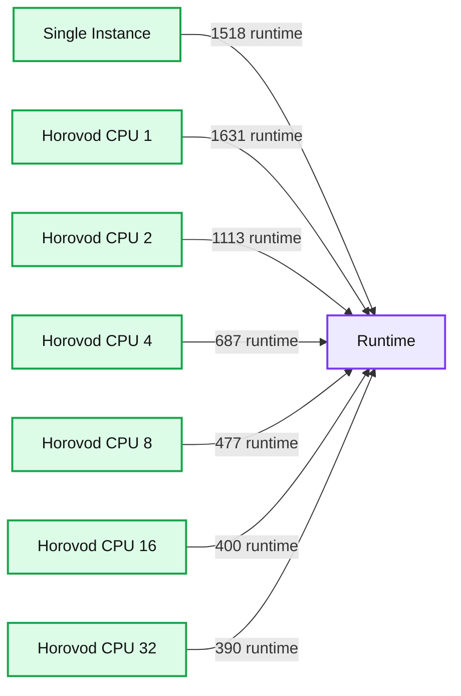
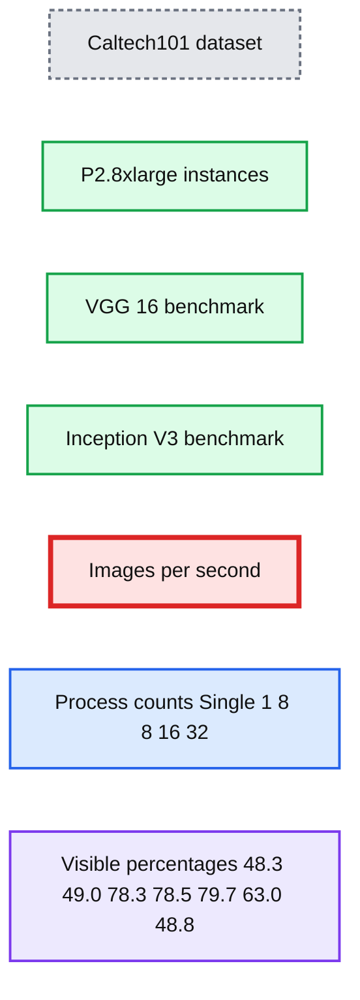

# Leveling the Playing Field: HorovodRunner for Distributed Deep Learning Training

- Source: https://www.databricks.com/blog/2021/01/14/leveling-the-playing-field-horovodrunner-for-distributed-deep-learning-training.html
- Published: 2021-01-14
- Authors: Jing Pan, Wendao Liu
- Categories: engineering, data-science-machine-learning
- Images: 2 total, 2 extracted as architecture

This is a guest post authored by Sr. Staff Data Scientist/User Experience Researcher Jing Pan and Senior Data Scientist Wendao Liu of leading health insurance marketplace eHealth.

 

*None generates Taichi;*
*Taichi generates two complementary forces;*
*Two complementary forces generate four aggregates;*
*Four aggregates generate eight trigrams;*
*Eight trigrams determine myriads of phenomena.*

*—Classic of Changes*

From the *Classic of Changes* or *I Ching*’s primitive concept of binary numbers to the origin of the term “algorithm” (*al-jabr*, from the title of the foundational text by al-Khwarizmi, the father of algebra), every civilization has placed great emphasis on the power of computation. So too does every modern technology company. Mid-cap companies are joining the race with big tech firms to turn out fast iterations of deep learning services. A scrum master in an agile team often asks their engineers, “How long will it take to finish this development?” But the scrum master, shocked by the length of the training period for any deep learning project, has no way to accelerate the project simply by adding more ML engineers, encouraging longer working hours, or setting KPIs.

*See the *[*official page for the eHealth session*](https://www.databricks.com/session_na20/benchmark-tests-and-how-tos-of-convolutional-neural-network-on-horovodrunner-enabled-apache-spark-clusters)* for more information about the program, including downloadable slides a transcript*.

One of the bottlenecks for deep learning projects is the size of the largest GPU machine available on AWS, Azure, or any other cloud provider. Want to increase your batch size, looking to gain training speed without (hopefully) compromising accuracy? Whoops, GPU out of memory. So you apply the universal wisdom of the 80/20 rule and maybe don’t train for so many epochs, among other time-reduction measures (such as fast-converging optimizers… which raises the question of how many optimizers you are going to try). The result? Your ambitious deep learning-based artificial “intelligence” turns out to be an artificial “intellectually challenged.” And at a mid-cap company, there are a thousand more important challenges to prioritize in the budget. Supercomputer? Customized GPU cluster? Maybe in the long-term roadmap, but for now you’re out of luck. Even if your Silicon Valley company manages to build a successful product and is desperate to deploy it in production, you’ll have to contest with California’s wildfires and preventive power shutdowns. These are the kinds of pain points that can keep a smaller company stuck in what feels like the 1980s, while larger tech giants leap into the future.

## HorovodRunner benchmark

Ice breaks, however, with good tools—and in this case, it’s as simple as importing HorovodRunner as hvd in Python. HorovodRunner is a general API to run distributed deep learning workloads on a Databricks Spark cluster using Uber’s Horovod framework (Databricks, 2019). In February 2020, we (on behalf of online health insurance broker eHealth Inc.) presented a paper entitled “Benchmark Tests of Convolutional Neural Network and Graph Convolutional Network on HorovodRunner Enabled Spark Clusters” at the [First International Workshop on Deep Learning on Graphs: Methodologies and Applications](https://deep-learning-graphs.bitbucket.io/dlg-aaai20/) (held in conjunction with the 34th AAAI Conference on Artificial Intelligence, one of the top AI conferences in the world—the full paper is available at [https://arxiv.org/abs/2005.05510](https://arxiv.org/abs/2005.05510)). Our research showed that Databricks’s HorovodRunner achieves significant lift in scaling efficiency for convolutional neural network-based (CNN-based, hereafter) tasks on both GPU and CPU clusters, but not the original graph convolutional network (GCN) task. On GPU clusters for the Caltech 101 image classification task, the scaling efficiency ranges from 18.5% to 79.7%, depending on the number of GPUs and models. On CPU clusters for the MNIST handwritten digit classification task, it shows a positive lift in image processing speed where the number of processes is 16 or under. We also implemented the Rectified Adam optimizer for the first time in HorovodRunner. The complete code can be found at [https://github.com/psychologyphd/horovodRunnerBenchMark_IPython](https://github.com/psychologyphd/horovodRunnerBenchMark_IPython).

**Summary:** CPU runtime benchmark comparing a single instance with HorovodRunner configurations using 1 to 32 CPUs.

**Components:**

- Single Instance - standalone CPU execution
- Horovod #CPU 1 - Horovod distributed execution
- Horovod #CPU 2 - Horovod distributed execution
- Horovod #CPU 4 - Horovod distributed execution
- Horovod #CPU 8 - Horovod distributed execution
- Horovod #CPU 16 - Horovod distributed execution
- Horovod #CPU 32 - Horovod distributed execution
- Runtime - benchmark measurement axis

**Flows:**

- Single Instance -> Runtime: measured runtime
- Horovod #CPU 1 -> Runtime: measured runtime
- Horovod #CPU 2 -> Runtime: measured runtime
- Horovod #CPU 4 -> Runtime: measured runtime
- Horovod #CPU 8 -> Runtime: measured runtime
- Horovod #CPU 16 -> Runtime: measured runtime
- Horovod #CPU 32 -> Runtime: measured runtime

**Numbers:** 1518, 1631, 1113, 687, 477, 400, 390, 1, 2, 4, 8, 16, 32, 0, 200, 400, 600, 800, 1000, 1200, 1400, 1600; Runtime

source image: https://www.databricks.com/wp-content/uploads/2020/12/blog-ehealth-1.jpg

Figure 1. CPU cluster performance on image classification on MNIST dataset

**Summary:** Benchmark chart comparing VGG-16 and Inception V3 image classification throughput on Caltech101 using P2.8xlarge instances.

**Components:**

- VGG-16 model benchmark
- Inception V3 model benchmark
- Caltech101 dataset
- P2.8xlarge GPU instances
- Images per second throughput axis
- Process-count categories: Single, 1, 8, 8, 16, and 32

**Flows:**

- none

**Numbers:**

- Caltech101
- P2.8xlarge
- Throughput axis from 0 to 800 images per second
- Axis increments of 100 images per second
- Process counts: Single, 1, 8, 8, 16, 32
- Visible percentages: 48.3%, 49.0%, 78.3%, 78.5%, 79.7%, 63.0%, 48.8%

source image: https://www.databricks.com/wp-content/uploads/2020/12/blog-ehealth-2.png

Figure 2. GPU cluster performance on image classification on Caltech101 dataset

## HorovodRunner implementation tips

In addition to the overall positive lift in benchmark performance, here are some more technical tips on how to get things done right:

1. **Cluster settings:** Get a TensorFlow 1 cluster (GPU or CPU). This will enable most Keras Functional API models to run relatively smoothly, except ResNet, which requires TensorFlow 2 (there are too many compatibility issues with TensorFlow 2 at the moment for it to run on HorovodRunner). The cluster should not have auto-scaling enabled. If you want to use Rectified Adam, you need to run an init script as described below. If you want to use TensorFlow 2 anyway, you can use Databricks Runtime 7.x which includes TF2.
2. **Distributed model retrieval:** Since the Keras Model API downloads models from GitHub and GitHub has a limit on how many downloads you can have per second that HorovodRunner’s processes will easily exceed, we recommend downloading your model to your master with the Keras Functional API and then uploading it to an S3 or DBFS location. HorovodRunner can then get the model from that location.
3. **Avoid Horovod Timeline:** Previous studies have shown that using Horovod Timeline increases overall training time (Databricks, 2019) and leads to no overall increase in training efficiency (Wu et al., 2018). We get time in the following two ways. First, we get the wall-clock total time from right before calling HorovodRunner and after the HorovodRunner object’s run method finishes running, which includes overhead in loading data, loading the model, pickling functions, etc. Second, we get the time it takes to run each epoch (called the *epoch time*) from the driver’s standard output. Every time a new line of driver output is printed, we add a timestamp. In the driver’s standard output, in the form of notebook output, it will print out [1,x]:Epoch y/z, where x is the *x*th hvd.np, y is the *y*th epoch, and z is the total number of epochs. We record the timestamp t1 of the first time Epoch y/z shows up in the standard output and the timestamp t2 of the first time Epoch (y+1)/z shows up, regardless of which process emits the output. The time difference t2 – t1 approximates the time it takes for the epoch y to complete, based on the assumption that only after all processes finish an epoch and the weights have been averaged can the next epoch begin. For MNIST, we got the wall-clock run time for three repetitions (with elapsed time measured in Python), and epoch times from TF1 output. We used the number of images in the training set times the number of repetitions divided by the total wall-clock time to get the number of images per second.
4. **Use Rectified Adam:** This is a new optimizer that accurately finds the initial direction for gradient descent (Liu et al., 2019). To use it, first you need to install the Python package keras-rectified-adam. Second, you need to run the initiation script on the cluster:

*Note, the preceding step may not be necessary due to recent updates to the goofys within Databricks.*

The notebook titled [*np4_VGG horovod benchmark_debug_RAdam*](https://github.com/psychologyphd/horovodRunnerBenchMark_IPython) in the GitHub repository for our paper can run successfully with the Rectified Adam optimizer. We found %env TF_KERAS = 1 worked, but not os.environ['TF_KERAS'] = '1'. We imported RAdam from keras_radam, then used optimizer = RAdam(total_steps=5000, warmup_proportion=0.1, learning_rate=learning_rate*hvd.size(), min_lr=1e-5), which we learned from optimizer = keras.optimizers.Adadelta(lr=learning_rate*hvd.size()) in Uber’s [Horovod advanced example](https://github.com/horovod/horovod/blob/master/examples/keras/keras_mnist_advanced.py). We don’t know the exact optimal parameters for Rectified Adam on a HorovodRunner-enabled Spark cluster yet, but at least the code can run.

Note, the %env TF_KERAS = 1 configuration can also be configured at Databricks cluster configuration level.

1. **Choice of models:** HorovodRunner builds on Horovod. Horovod implements data parallelism to take in programs written based on single-machine deep learning libraries to run distributed training fast (Sergeev and Del Balso, 2017). It’s based on the Message Passing Interface (MPI) concepts of size, rank, local rank, allreduce, allgather, and broadcast (Sergeev and Del Balso, 2017; Sergeev and Del Balso, 2018). So, a model that will gain scaling efficiency has to support data parallelism (i.e., partitioning of rows of data on Spark). Regular sequential neural networks,  RNN-based models, and CNN-based models will gain scaling efficiency. We haven’t done the coding ourselves, but we think with Petastorm preparing data the way they digest it, HorovodRunner should work with LSTMs too. GCNs, which need the entire graph’s connection matrix to be distributed to a slave, will not. There are partitioning (Liao et al., 2018) and fast GCN (Wu et al., 2019) methods and so on to help with parallelized GCN training, and AWS’s deep graph library is actively implementing those strategies. As for models that can gain scaling efficiency out of the box with HorovodRunner, theoretical modeling of distributed data-parallel training (Castelló et al., 2019) predicts models with lower operational intensity will benefit more, which is consistent with our work and with Uber’s benchmarks. Inception V3’s scaling efficiency is higher than VGG-16’s.

## Why HorovodRunner?

In addition to speeding up the deep learning training process, HorovodRunner solves additional pain points for mid-cap companies. Residing on Spark clusters, it eliminates the need for customized GPU clusters which are cumbersome to build and maintain. Since Spark clusters reside in the cloud, it takes (nearly) full advantage of the cloud and removes the burden of maintaining the clusters from the company’s ML engineers and data scientists. It also supports multiple deep learning frameworks, which provides more flexibility and less business risk than sticking to one framework. Maybe the only caveat is that it is not elastic yet, but we expect that once HorovodRunner gains enough momentum in the industry it will move toward being elastic.

There’s more than one distributed training platform on the market, with distributed TensorFlow being the original player. Note, TensorFlow 2 has a better system for distributed TensorFlow but it is specific to TensorFlow only.  Uber developed Horovod because using distributed TensorFlow is hard—both the code and the cluster setup. Then Databricks developed  HorovodRunner and HorovodEstimator to make things even easier, especially on the cluster setup side. We had prior experience with Spark and single-machine deep learning training, but not with distributed deep learning training, and we were able to pick up HorovodRunner in about two months with Databricks’s standard user support. Although some people approximate the cognitive load of adopting a new framework with lines of code in GitHub examples, we find the framework’s class design and the readability of the example code to be good indicators of the ease of learning. By either measure, HorovodRunner, in our opinion, is an easy-to-use tool. This means it not only enables business advancement but also technological advancement.

The author of the Taichi programming language for graphics applications, Yuanming Hu, once said that the lack of user-friendly tools is a contributing factor to why computer graphics lacks advancement ([https://www.qbitai.com/2020/01/10534.html](https://www.qbitai.com/2020/01/10534.html)). The importance of usability also applies to the advancement of distributed deep learning, with HorovodRunner being a good choice of tool. People use Keras because TensorFlow is hard to read. Uber developed Horovod because distributed TensorFlow maintenance is difficult, and even they found the code hard to understand. How many resources can a smaller company dedicate to competing with the tech giants for top tech talent who can understand the backend logic behind the code? Sometimes the difference is a matter of life or death or the difference between an IPO or not. Zoom went public based on a mere $7 million annual profit. If they hired a handful of additional top ML engineers in Silicon Valley, their balance sheet would go negative and their billion-dollar IPO could be jeopardized.

Of course, there are alternatives to HorovodRunner. CollectiveAllReduceStrategy, under development by TensorFlow, is a similar tool, though as of the end of 2020 there are limited resources available online and unknown use in production. A quick search with the keyword “CollectiveAllReduceStrategy” returns several reports of failures and performance issues. At this point, it’s too early to say which one will prove to be a better framework for distributed deep learning, although CollectiveAllReduceStrategy’s deep ties to TensorFlow slightly increase the business risk. HorovodRunner is agnostic to deep learning platforms, which provides flexibility in choosing deep learning tools as well as integrated support of deep learning on different cloud platforms. Not every cloud platform is allowed to operate anywhere in the world, nor does every cloud platform support every deep learning platform.

## Looking forward

In our opinion, it will be some time before the AI community no longer needs labels. Until then, the models (sequential models, CNNs, and RNNs) HorovodRunner currently supports will continue to have a huge impact on applications like natural language processing and understanding, translation, image classification, and image transformation. As mentioned previously, even if HorovodRunner doesn’t support them now, any models that allow data parallelism can theoretically work with it. If the model accuracy is highly dependent on the labeling of data, it’s important to get the correct labels and own your labels in-house (instead of buying labeled training data from elsewhere, which is a doomed business model for AI companies).

An urban legend in the AI community says that a shitake mushroom–picking robot’s performance strongly depends on whether the human labeler is the plant’s senior director, a technician, or a seasonal worker, resulting in descending order of accuracy when classifying mushrooms into different grades. But oftentimes, this wisdom is ignored. There is a slight twist to the concept of owning your labels, advertised as “generating” your own labels, but in our opinion, this understates the importance of proper labeling. Let’s say a medical AI startup wants to create a product that can automatically label images for disease classification. Instead of hiring top physicians to label images, the startup trains novices to do this task, and then builds fancy models on top of those labels. Garbage labels don’t do any AI company, investor, or customer any good. Although GCN models have more complex relationships among nodes than the sequential relationships in RNN (and RNN-like) models, the success of any GCN model is still highly dependent on the accuracy of labeling. It is now well known that reinforcement learning without any labels outperforms any human master at the game of Go, and outperforms its predecessors that used human masters’ labels (Silver et al., 2017). Because of our dependency on labels, and the relative scarcity of labeled data, this means reinforcement learning might well be the future of AI. We are excited to see how it will evolve into training not done from scratch (i.e., leveraging previously available human or model knowledge), adapting to a changing environment, and going distributed.

HorovodRunner’s easy-to-use,  platform-agnostic, production-grade support for the currently popular models has the potential to level the playing field for smaller companies so they can, perhaps, compete with the tech giants. And who doesn’t want to be the next Zoom, anyway?

[GET SESSION SLIDES & TRANSCRIPT!](https://www.databricks.com/session_na20/benchmark-tests-and-how-tos-of-convolutional-neural-network-on-horovodrunner-enabled-apache-spark-clusters)

**References**
Castelló, A., Dolz, M.F., Quintana-Ortí, E.S., and Duato, J. 2019. “Theoretical Scalability Analysis of Distributed Deep Convolutional Neural Networks.” In *Proceedings of the 19th IEEE/ACM International Symposium on Cluster, Cloud and Grid Computing (CCGRID)*. [https://www.computer.org/csdl/proceedings-article/ccgrid/2019/091200a534/1bomDaYjSTK](https://www.computer.org/csdl/proceedings-article/ccgrid/2019/091200a534/1bomDaYjSTK)

Databricks. 2019. “Record Horovod Training with Horovod Timeline.” [https://docs.databricks.com/applications/machine-learning/train-model/distributed-training/horovod-runner.html#record-horovod-training-with-horovod-timeline](https://docs.databricks.com/applications/machine-learning/train-model/distributed-training/horovod-runner.html#record-horovod-training-with-horovod-timeline)

Liao, R., Brockschmidt, M., Tarlow, D., Gaunt, A.L., Urtasun, R., and Zemel, R. 2018. “Graph Partition Neural Networks for Semi-Supervised Classification.” arXiv preprint arXiv: 1803.06272. [https://arxiv.org/abs/1803.06272](https://arxiv.org/abs/1803.06272)

Liu, L., Jiang H., He, P., Chen W., Liu X., Gao J., and Han J. 2019. “On the Variance of the Adaptive Learning Rate and Beyond.” arXiv preprint arXiv:1908.03265. [https://arxiv.org/abs/1908.03265](https://arxiv.org/abs/1908.03265)

Sergeev, A., and Del Balso, M. 2017. “Meet Horovod: Uber’s Open Source Distributed Deep Learning Framework for TensorFlow.” https://eng.uber.com/horovod/

Sergeev, A., and Del Balso, M. 2018. “Horovod: Fast and Easy Distributed Deep Learning in TensorFlow.” arXiv preprint arXiv:1802.05799. [https://arxiv.org/abs/1802.05799](https://arxiv.org/abs/1802.05799)

Silver, D., Schrittwieser, J., Simonyan, K., Antonoglou, I., Huang, A., Guez, A., Hubert, T., et al. 2017. “Mastering the Game of Go Without Human Knowledge.” Nature 550(7676):354–359. [http://augmentingcognition.com/assets/Silver2017a.pdf](http://augmentingcognition.com/assets/Silver2017a.pdf)

Wu, F., Zhang, T., Holanda de Souza Jr., A., Fifty, C., Yu, T., and Weinberger, K.Q. 2019. “Simplifying Graph Convolutional Networks.” In *Proceedings of the 36th International Conference on Machine Learning*. [http://proceedings.mlr.press/v97/wu19e.html](http://proceedings.mlr.press/v97/wu19e.html)

Wu, X., Taylor, V., Wozniak, J. M., Stevens, R., Brettin, T., and Xia, F. 2018. “Performance, Power, and Scalability Analysis of the Horovod Implementation of the CANDLE NT3 Benchmark on the Cray XC40 Theta.” In *Proceedings of the 8th Workshop on Python for High-Performance and Scientific Computing*. [https://sc18.supercomputing.org/proceedings/workshops/workshop_files/ws_phpsc104s2-file1.pdf](https://sc18.supercomputing.org/proceedings/workshops/workshop_files/ws_phpsc104s2-file1.pdf)
