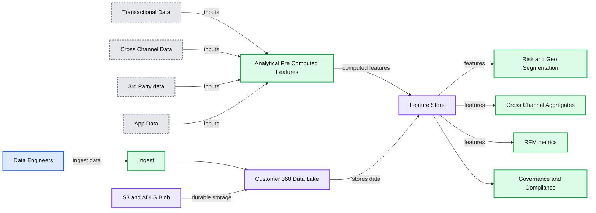
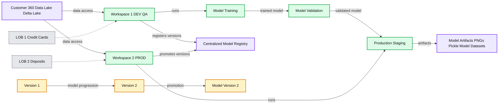
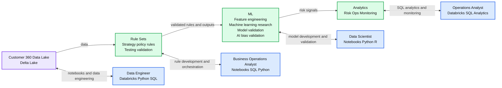
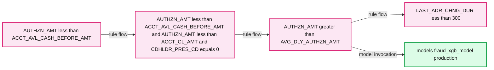
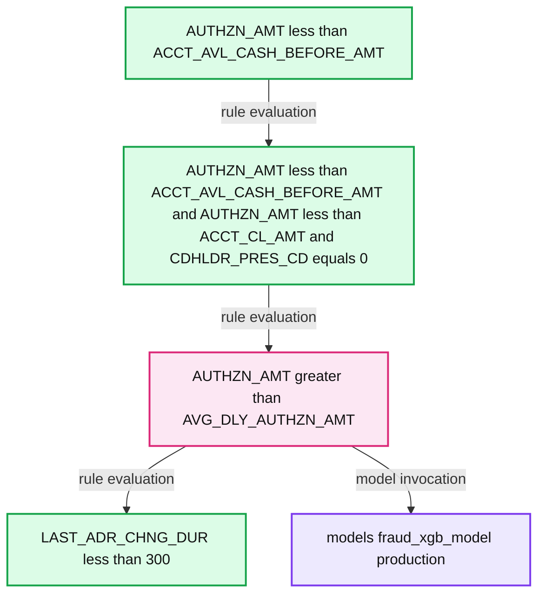
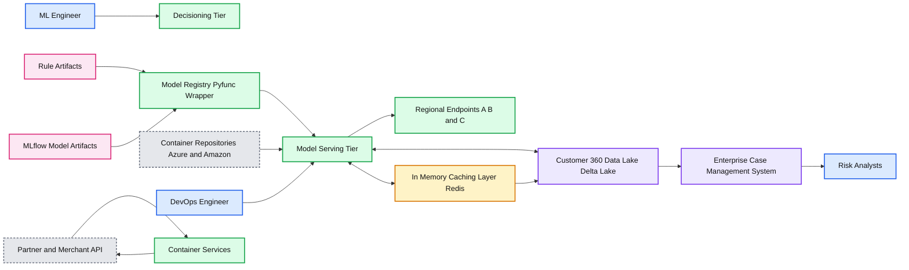

# Combining Rules-based and AI Models to Combat Financial Fraud

- Source: https://www.databricks.com/blog/2021/01/19/combining-rules-based-and-ai-models-to-combat-financial-fraud.html
- Published: 2021-01-19
- Authors: Sri Ghattamaneni, Ricardo Portilla, Nikhil Gupta
- Categories: engineering, data-science-machine-learning
- Images: 8 total, 6 extracted as architecture

The financial services industry (FSI) is rushing towards transformational change, delivering transactional features and facilitating payments through new digital channels to remain competitive. Unfortunately, the speed and convenience that these capabilities afford also benefit fraudsters.

Fraud in financial services still remains the number one threat to organizations’ bottom line given the record-high increase in overall fraud and how it has diversified in recent years. A recent survey by [PwC](https://www.pwc.com/gx/en/services/forensics/economic-crime-survey.html) outlines a staggering global impact of fraud. For example, in the United States alone, the cost to businesses in 2019 totaled $42bn, and 47% of surveyed companies experienced fraud in the past 24 months.

So how should companies respond to the ever-increasing threat of fraud? Fraudsters are exploiting the capabilities of the new digital landscape, meaning organizations must fight fraud in real-time while still keeping the customer experience in mind. To elaborate further, financial institutions leverage two key levers for minimizing fraud losses: effective fraud prevention strategies and chargeback to customers. Both present pros and cons, as they directly affect the customer experience. In this blog, we describe how to build a fraud detection and prevention framework using Databricks’ modern data architecture that can effectively balance fraud prevention strategies and policies to improve recoveries while maintaining the highest possible customer satisfaction.

## Challenges in building a scalable and robust framework

Building a fraud prevention framework often goes beyond just creating a highly-accurate machine learning (ML) model due to an ever-changing landscape and customer expectations. Oftentimes, it involves a complex ETL process with a decision science setup that combines a rules engine with an ML platform. The requirements for such a platform include scalability and isolation of multiple workspaces for cross-regional teams built on open source standards. By design, such an environment empowers data scientists, data engineers and analysts to collaborate in a secure environment.

We will first look at using a data Lakehouse architecture combined with Databricks’ [enterprise platform](https://docs.databricks.com/getting-started/overview.html), which supports the infrastructure needs of all downstream applications of a fraud prevention application. Throughout this blog, we will also be referencing Databricks’ core components of Lakehouse called [Delta Engine](https://docs.databricks.com/delta/optimizations/index.html), which is a high-performance query engine designed for scalability and performance on big data workloads, and [MLflow](https://www.databricks.com/product/managed-mlflow), a fully managed ML governance tool to track ML experiments and quickly productionalize them.

## Customer 360 Data Lake

In financial services, and particularly when building fraud prevention applications, we often need to unify data from various data sources, usually at a scale ranging from multiple terabytes to petabytes. As technology changes rapidly and financial services integrate new systems, data storage systems must keep up with the changing underlying data formats. At the same time, these systems must enable organic evolutions of data pipelines while staying cost-effective. We are proposing Delta Lake as a consistent storage layer built on open-source standards to enable storage and compute of features to keep anomaly detection models on the cutting edge.

Data engineers can easily connect to various external data pipelines and payment gateways using the [Databricks Ingestion Partner Network](https://www.databricks.com/company/partners) to unify member transactions, performance and trade history. As mentioned, it is critical to compute new features and refresh existing ones over time as the data flows in. Examples of pre-computed features are historical aggregates of member account history or statistical averages important for downstream analytical reporting and accelerating retraining of ML models. Databricks’ Delta Lake and native [Delta Engine](https://docs.databricks.com/delta/optimizations/index.html) are built exactly for this purpose and can accelerate the speed of feature development using Spark-compatible APIs to enforce the highest levels of quality constraints for engineering teams.

**Summary:** A Customer 360 data lake ingests multiple data sources, creates analytical features, and stores governed feature data for fraud prevention use cases.

**Components:**

- Customer 360 Data Lake using Delta Lake
- Ingest pipeline
- Transactional Data
- Cross Channel Data
- 3rd Party data
- App Data
- Kafka
- API Apps
- Database
- Analytical Pre Computed Features
- Feature Store
- Risk and Geo Segmentation
- Cross Channel Aggregates
- RFM metrics
- Managed Catalogue
- Schema Enforcement and Evolution
- PII and GDPR Compliance
- S3
- ADLS and Blob
- Data Engineers

**Flows:**

- Data Engineers -> Ingest: source data ingestion
- Transactional Data -> Analytical Pre Computed Features: transactional inputs
- Cross Channel Data -> Analytical Pre Computed Features: cross channel inputs
- 3rd Party data -> Analytical Pre Computed Features: third party inputs
- App Data -> Analytical Pre Computed Features: application inputs
- Analytical Pre Computed Features -> Feature Store: computed features
- Feature Store -> Risk and Geo Segmentation: stored features
- Feature Store -> Cross Channel Aggregates: stored features
- Feature Store -> RFM metrics: stored features

**Numbers:** 360, 3rd, S3, 10 01

source image: https://www.databricks.com/wp-content/uploads/2021/01/360-data-lake-diagram.jpg

## One platform serving all fraud prevention use cases

Since our approach to fraud detection involves a combination of a rules suite and ML, Databricks fits in well, as it is home to a diverse set of personas required to create rules and ML models – namely business analysts, domain experts and data scientists. In the following section, we’ll outline the different components of Databricks that map to personas and how rules meet ML using MLflow, shared notebooks and Databricks SQL.

The ability for users to collaborate using multiple workspaces while providing isolation at the user level is critical in financial services. With the [Databricks’ Enterprise Cloud Service](https://www.databricks.com/product/enterprise-cloud-service) architecture, an organization can create new workspaces within minutes. This is extremely helpful when orchestrating a fraud detection framework since it creates isolations for various product, business group users and CI/CD [orchestration](https://www.databricks.com/glossary/orchestration) within each group. For example, credit cards business group users can be isolated from deposits, and each line of business can control the development and promotion of model artifacts.

**Summary:** The diagram shows two isolated Databricks workspaces for development and production, connected to a shared Customer 360 Delta Lake and centralized model registry across lines of business.

**Components:**

- Customer 360 Data Lake using Delta Lake
- Workspace 1 - DEV/QA for model development
- Workspace 2 - PROD for model staging and deployment
- Experiment 1 and Experiment 2
- Model Training
- Model Validation
- Production/Staging
- Model Artifacts containing PNGs, Pickle Model, and Datasets
- Centralized Model Registry
- Version 1 and Version 2 model stages
- LOB 1 - Credit Cards
- LOB 2 - Deposits

**Flows:**

- Customer 360 Data Lake -> Workspace 1 - DEV/QA: data access
- Customer 360 Data Lake -> Workspace 2 - PROD: data access
- Model Training -> Model Validation: trained model
- Model Validation -> Production/Staging: validated model
- Production/Staging -> Model Artifacts: PNGs, Pickle Model, and Datasets
- Workspace 1 - DEV/QA -> Centralized Model Registry: model versions
- Workspace 2 - PROD -> Centralized Model Registry: promoted model versions
- Version 1 -> Version 2: model progression
- Version 2 -> Model Version 2: promotion to production

**Numbers:** 360; 1; 2; 1; 2; 1; 2; 1; 2; 2

source image: https://www.databricks.com/wp-content/uploads/2021/01/combo-blog-2.png

## Combining rules-based systems with AI

### Mapping users and Databricks’ components

The fraud detection development cycle begins with business analysts and domain experts who often contribute a major part of initial discovery, including sample rulesets. These common sense rules involving tried-and-true features (such as customer location and distance from home):

a) Fast to execute
 b) Easily interpretable and defensible by a FSI
 c) Decrease false positives (i.e. false declines through rules framework)
 d) Flexible enough to increase the scope of training data required for fraud models

While rules are the first line of defense and an important part of a firm’s overall fraud strategy, the financial services industry has been leading the charge in developing and adopting cutting-edge ML algorithms alongside rulesets. The following design tier shows several components using the approach of combining rule sets and ML models. Now let’s look at each component and the typical workflow for the personas who will be supporting the respective operations.

**Summary:** The diagram shows a unified design tier combining a Customer 360 data lake, rules-based fraud detection, machine learning, and analytics workflows.

**Components:**

- Customer 360 Data Lake - Delta Lake
- Rule Sets - strategy and policy rule development, testing, and validation
- ML - feature engineering, machine learning research and development, model validation, and AI bias validation
- Analytics - risk operations monitoring
- Data Engineer - notebooks using Databricks, Python, and SQL
- Business Operations Analyst - notebooks, SQL, Python, and third-party rule orchestration tooling
- Data Scientist - notebooks using Python and R
- Operations Analyst - Databricks SQL Analytics and SQL

**Flows:**

- Customer 360 Data Lake -> Rule Sets: data for rule development
- Rule Sets -> ML: rules and validated outputs for machine learning
- Customer 360 Data Lake <-> Data Engineer: notebook-based data engineering
- Rule Sets <-> Business Operations Analyst: rule authoring, testing, and orchestration
- ML <-> Data Scientist: feature engineering, model development, and validation
- Analytics <-> Operations Analyst: SQL-based risk operations monitoring

**Numbers:** none

source image: https://www.databricks.com/wp-content/uploads/2021/01/combo-blog-3.png

## Exploring rules using SQL functionalities

For exploratory data analysis, Databricks offers two avenues of attacking fraud for the analyst persona: Databricks SQL/Python/R-supported notebooks for data engineering and data science and [Databricks SQL](https://www.databricks.com/product/databricks-sql) for business intelligence and decision-making. Databricks SQL is an environment where users can build dashboards to capture historical information, query data lake tables with ease, and hook up BI tools for further exploration. As shown below, analysts have the ability to create dashboards with descriptive statistics, then transition to an investigation of individual fraudulent predictions to validate the reasons why a particular transaction was chosen as fraudulent.

In addition, users can edit any of the underlying queries powering the dashboard and access the catalog of data lake objects to inform future features that could be used as part of a rule based / ML based fraud prevention algorithm. In particular, users can start to slice data using rulesets, which ultimately make their way into production models. See the image below, which highlights the SQL query editor as well as the following collaborative and ease-of-use features:

- **Query sharing and reusability** - the same query can power multiple dashboards, which demands less of a load on the underlying SQL endpoint, allowing for higher concurrency
- **Query formatting** - improved readability and ease of use of SQL on Databricks
- **Sharing** - queries can be shared across business analysts, domain experts, and data scientists with the ‘Share’ functionality at the top right-hand side

### Rules and model orchestration framework

We have covered the benefits of leveraging rulesets in our fraud detection implementation. However, it is important to recognize the limitations of a strict rules-based engine, namely:

- **Strict rules-based approaches put in place today become stale tomorrow** since fraudsters are routinely updating strategies. However, as new fraud patterns emerge, analysts will scramble to develop new rules to detect new instances, resulting in high maintenance costs. Furthermore, there are hard costs associated with the inability to detect fraud quickly given updated data -- ML approaches can help speed up time to detect fraud and thus save merchants potential losses
- **Rules lack a spectrum of conclusions** and thus ignore risk tolerance since they cannot provide a probability of fraud
- **Accuracy can suffer** due to the lack of interaction between rules when assessing fraudulent transactions, resulting in losses

For fraud detection framework development, we recommend a hybrid approach that combines rulesets with ML models. To this end, we have used a [business logic editor](https://sandbox.kie.org/#/editor/dmn) to develop rules in a graphical interface, which is commonly used by systems such as Drools to make rule-making simple. Specifically, we interactively code our rules as nodes in a graph and reference an existing MLflow model (using its ML registry URI such as models:/fraud_prediction/production) to signal that an ML model, developed by a data scientist colleague, should be loaded and used to predict the output after executing the rules above it. Each rule uses a feature from a Delta Lake table, which has been curated by the data engineering team and is instantly available once the feature is added (see more details on schema evolution [here](https://www.databricks.com/blog/2019/09/24/diving-into-delta-lake-schema-enforcement-evolution.html#:~:text=Schema%20evolution%20is%20a%20feature,one%20or%20more%20new%20columns.) to see how simple it is to add features to tables that change throughout the life of an ML project).

We create a logical flow by iteratively adding each rule (e.g. authorized amounts should be less than cash available money on the account as a baseline rule) and adding directed edges to visualize the decision-making process. In tandem, our data scientist may have an ML model to catch fraudulent instances discoverable by training data. As a data analyst, we can simply annotate a note to capture the execution of the ML model to give us a probability of fraud for the transaction being evaluated.

Note: In the picture below, the underlying markup language (DMN) that contains all the rules is XML-based, so regardless of the tools or GUIs used to generate rules, it is common to extract the rulesets and graph structure from the underlying flat file or XML (e.g. a system like [Drools](https://www.drools.org/)).

**Summary:** A DMN fraud workflow applies sequential rules before invoking a production fraud XGBoost model.

**Components:**

- Rule node: `AUTHZN_AMT < ACCT_AVL_CASH_BEFORE_AMT`
- Rule node: `AUTHZN_AMT < ACCT_AVL_CASH_BEFORE_AMT and AUTHZN_AMT < ACCT_CL_AMT and CDHLDR_PRES_CD = 0`
- Rule node: `AUTHZN_AMT > AVG_DLY_AUTHZN_AMT`
- Rule node: `LAST_ADR_CHNG_DUR < 300`
- Production model: `models/fraud_xgb_model/production`

**Flows:**

- `AUTHZN_AMT < ACCT_AVL_CASH_BEFORE_AMT` -> `AUTHZN_AMT < ACCT_AVL_CASH_BEFORE_AMT and AUTHZN_AMT < ACCT_CL_AMT and CDHLDR_PRES_CD = 0`: rule flow
- `AUTHZN_AMT < ACCT_AVL_CASH_BEFORE_AMT and AUTHZN_AMT < ACCT_CL_AMT and CDHLDR_PRES_CD = 0` -> `AUTHZN_AMT > AVG_DLY_AUTHZN_AMT`: rule flow
- `AUTHZN_AMT > AVG_DLY_AUTHZN_AMT` -> `LAST_ADR_CHNG_DUR < 300`: rule flow
- `AUTHZN_AMT > AVG_DLY_AUTHZN_AMT` -> `models/fraud_xgb_model/production`: model invocation

**Numbers:** 0, 300

source image: https://www.databricks.com/wp-content/uploads/2021/01/combo-blog-6.png

After assembling a combined ruleset and model steps, as shown above, we can now encode this entire visual flow into a decisioning fraud detection engine in Databricks. Namely, we can extract the DMN markup from the Kogito tool and [upload directly into Databricks](https://docs.databricks.com/administration-guide/workspace/dbfs-ui-upload.html) as a file. Since the .dmn file has node and edge contents, representing the order of rules and models to execute, we can leverage the graph structure. Luckily, we can use a network analysis Python package, networkx, to ingest, validate, and traverse the graph. This package will serve as the basis for the fraud scoring framework.

Now that we have the metadata and tools in place, we’ll use MLflow to wrap the hybrid ruleset and models up into a custom Pyfunc model, which is a lightweight wrapper we’ll use for fraud scoring. The only assumptions are that the model, which is annotated and used in the DAG (directed acyclic graph) above, is registered in the MLflow model registry and has a column called ‘predicted’ as our probability. The framework pyfunc orchestrator model (which leverages networkx) will traverse the graph and execute the rules directly from the XML content, resulting in an ‘approved’ or ‘denied’ state once the pyfunc is called for inference.

Below is a sample DAG created from the rules editor mentioned. We’ve encoded the mixture of rules and a model that has been pre-registered (shown in the attached notebooks). The rules file itself is persisted within the model artifacts so, at inference time, all rules and models are loaded from the cloud storage, and the models used (in this case the fraud detection model) are loaded from the MLflow model registry in a real-time data pipeline. Note that in a sample run for an example transaction, the third rule is not satisfied for a sample input, so the node is marked as red, which indicates a fraudulent transaction.

**Summary:** The diagram shows a rule-based fraud decision flow leading to either an address-change rule or an XGBoost fraud model.

**Components:**

- Authorization amount less than account average cash before amount: rule condition
- Combined authorization, account limit, and cardholder condition: rule condition
- Authorization amount greater than average daily authorization amount: rule condition
- Last address-change duration less than 300: rule condition
- Fraud XGBoost production model: MLflow model registry

**Flows:**

- Authorization amount less than account average cash before amount -> Combined condition: evaluates the initial rule
- Combined condition -> Authorization amount greater than average daily authorization amount: evaluates the next rule
- Authorization amount greater than average daily authorization amount -> Last address-change duration less than 300: evaluates the address-change rule
- Authorization amount greater than average daily authorization amount -> Fraud XGBoost production model: invokes the production model

**Numbers:** 300, 0

source image: https://www.databricks.com/wp-content/uploads/2021/01/traversing-directed-acyclic-graph.jpg

To further understand how the model executes rules, here is a snippet from the custom Pyfunc itself, which uses pandasql to encode the string from the XML ruleset inside of a SQL case statement for a simple flag setting. This results in output for the orchestrator, which is used to designate a fraudulent or valid transaction.

## Decisioning and serving

Lastly, we’ll show what an end-to-end architecture looks like for the fraud detection framework. Notably, we have outlined what data scientists and data analysts work on, namely rulesets and models. These are combined in the decisioning tier to test out exactly what patterns will be deemed fraud or valid. The rulesets themselves are stored as artifacts in custom MLflow Pyfunc models and can be loaded in memory at inference time, which is done in a Python conda environment during testing. Finally, once the decisioning framework is ready to be promoted to production, there are a few steps that are relevant to deployment:

- The decisioning framework is encoded in a custom pyfunc model, which can be loaded into a Docker container for inference in real time.
- The base MLflow container used for inference should be deployed to ECR (Amazon), ACR (Azure) or generally Docker Hub.
- Once the framework is deployed to a container service (EKS, AKS, or custom k8s deployments), the service refers to the container repository and MLflow model repository for standing up an application endpoint. Since the serving layer is based on k8s and a lightweight pyfunc model, model inference is relatively fast. In cases where the inference demands sub-second (ms) latency, the logic can be rewritten in C, Go or other frameworks.
- For fast lookups on historical data when scoring in real time, data can be loaded into an in-memory database from the Customer 360 feature store that was created earlier. Finally, an enterprise case management system can be interfaced with the Customer 360 Data Lake to capture scoring results and from the deployment container.

**Summary:** End-to-end fraud decisioning architecture combining rules and MLflow models with regional container services, data layers, and case management.

**Components:**

- ML Engineer
- Decisioning Tier
- Rule Artifacts
- MLflow Model Artifacts
- Model Registry Pyfunc Wrapper
- Azure Container Repository
- Amazon ECR
- DevOps Engineer
- Model Serving Tier
- Regional Endpoints A, B, and C
- Partner and Merchant API using HTTPS
- Container Services
- In Memory Caching Layer using Redis
- Customer 360 Data Lake using Delta Lake
- Enterprise Case Management System
- Risk Analysts

**Flows:**

- ML Engineer -> Decisioning Tier: develops and manages fraud rules and models
- Rule Artifacts -> Model Registry Pyfunc Wrapper: rule artifacts
- MLflow Model Artifacts -> Model Registry Pyfunc Wrapper: model artifacts
- Model Registry Pyfunc Wrapper -> Model Serving Tier: deployable decisioning package
- Azure Container Repository -> Model Serving Tier: container images
- Amazon ECR -> Model Serving Tier: container images
- DevOps Engineer -> Model Serving Tier: deployment and operations
- Model Serving Tier -> Regional Endpoints A B C: serves fraud decisions
- Partner and Merchant API -> Container Services: HTTPS scoring requests
- Container Services -> Partner and Merchant API: HTTPS scoring responses
- Model Serving Tier -> In Memory Caching Layer: cache reads and writes
- Model Serving Tier -> Customer 360 Data Lake: feature and scoring data
- In Memory Caching Layer -> Customer 360 Data Lake: cache data synchronization
- Customer 360 Data Lake -> Enterprise Case Management System: scoring results and case data
- Enterprise Case Management System -> Risk Analysts: fraud cases

**Numbers:** none

source image: https://www.databricks.com/wp-content/uploads/2021/01/combo-blog-7.png

## Building a modern fraud framework

While it’s a shared responsibility between vendors and financial services organizations to combat fraud effectively, by deploying effective fraud prevention strategies, FSIs can minimize direct financial loss and improve customers' trust from fewer false declines. As we have seen in the surveys, fraud has diversified rapidly and the finance industry has turned to analytical models and ML to manage losses and increase customer satisfaction. It is a big mandate to build and maintain infrastructure to support multiple product teams and personas, which could directly impact a company’s revenue bottom line.

We believe this solution addresses the key areas of scalability in the cloud, fraud prevention workflow management and production-grade open source ML frameworks for organizations to build and maintain a modern fraud and financial crimes management infrastructure by bringing closer alignment between different internal teams.

This Solution Accelerator is part 1 of a series on building fraud and financial crimes solutions using Databricks’ Unified Analytics Platform. Try the below notebooks on Databricks to harness the power of AI to mitigate reputation risk. [Contact us](https://www.databricks.com/company/contact) to learn more about how we assist FSIs with similar use cases.

## Try the notebooks

Check out the [solution accelerator](https://www.databricks.com/solutions/accelerators/fraud-detection) to download the notebooks referred throughout this blog.
