# Burning Through Electronic Health Records in Real Time With Smolder

- Source: https://www.databricks.com/blog/2021/01/28/burning-through-electronic-health-records-in-real-time-with-smolder.html
- Published: 2021-01-28
- Authors: Ryan DeCosmo, Frank Austin Nothaft
- Categories: engineering, open-source, data-engineering, data-streaming
- Images: 1 total, 1 extracted as architecture

Check out the [solution accelerator](https://www.databricks.com/solutions/accelerators/hl7v2) to download the notebook referred throughout this blog. 

In previous[blogs](https://www.databricks.com/blog/2020/10/20/detecting-at-risk-patients-with-real-world-data.html), we looked at two separate workflows for working with patient data coming out of an electronic health record (EHR). In those workflows, we focused on a historical batch extract of EHR data. However, in the real world, data is continuously inputted into an EHR. For many of the important predictive healthcare analytics use cases, like sepsis prediction or [ER overcrowding](https://sjtrem.biomedcentral.com/articles/10.1186/s13049-020-00799-6), we need to work with the clinical data as it flows through the EHR.

How does data actually flow through an EHR? Typically, there are several passes of refinement. In some EHR implementations, data first lands in a near-real-time fashion into a NoSQL style operational store. After a day, the new data in this NoSQL store moves from the operational store into normalized and dimensional SQL stores. Other EHR implementations have different database implementations, but still, there is typically a delay before a final “historical” record of EHR data is available for batch analysis. To analyze clinical data in real time, we need to access either push-based [HL7 message feeds](https://www.hl7.org/) or pull-based [FHIR API endpoints](https://www.hl7.org/fhir/overview.html). These feeds and endpoints contain a variety of health information data. For instance, the Admission/Discharge/Transfer (ADT) messages can be used to track when a patient comes in or moves between units, while Order Entry (ORM) messages place/modify/cancel orders, such as giving oxygen to a patient or running a specific laboratory test. By combining feeds and resources together, we can get a comprehensive view of our patients and our hospital.

Healthcare teams and clinicians face a number of questions when building a real-time analytics system on top of EHR data: should I consume FHIR or HL7? How should I parse the records? How should I store and merge data? In this blog, we introduce Smolder, an open-source library for manipulating EHR data using Apache Spark™. Smolder provides Spark-native data loaders and APIs that transforms HL7 messages into Apache Spark™ SQL DataFrames. To simplify manipulating, validating, and remapping the content in messages, Smolder adds SQL functions for accessing message fields. Ultimately, this makes it possible to build streaming pipelines to ingest and analyze HL7 data in minutes while providing an easy-to-use declarative syntax that eliminates the need to learn [low-level libraries like HAPI](https://hapifhir.github.io/hapi-hl7v2/). These pipelines can achieve near-real-time latencies while achieving [data unification across healthcare data sources](https://www.databricks.com/blog/2020/04/21/building-a-modern-clinical-health-data-lake-with-delta-lake.html) by leveraging open source standards like [Delta Lake](http://delta.io)

**Summary:** The diagram shows HL7 message sources processed by Smolder into Bronze raw feeds, Silver aggregated datasets, and Gold application outputs.

**Components:**

- HL7 Message Sources using Apache Kafka
- Smolder stream processing library
- Bronze Delta Lake tables for ADT, ORM, and ORU raw messages
- Silver Delta Lake tables for longitudinal patient records and hospital resources
- Apache Spark processing
- Gold Delta Lake outputs for sepsis predictions and ward overcrowding status

**Flows:**

- HL7 Message Sources -> Smolder: HL7 messages
- Smolder -> Bronze: Raw messages separated by feed
- Bronze -> Smolder: Feed data for joining and aggregation
- Smolder -> Silver: Joined and aggregated datasets
- Silver -> Apache Spark: Aggregated healthcare data
- Apache Spark -> Gold: Application-level predictions and status outputs

**Numbers:** HL7 includes the number 7

```mermaid
%% Shows HL7 messages flowing through Smolder and Delta Lake layers
flowchart LR
    A[HL7 Message Sources] -->|HL7 messages| B[Smolder]
    B -->|Raw messages| C[Bronze ADT ORM ORU]
    C -->|Feed data| B
    B -->|Joined and aggregated datasets| D[Silver Longitudinal Patient Record Hospital Resources]
    D -->|Aggregated data| E[Apache Spark]
    E -->|Application outputs| F[Gold Sepsis Predictions Ward Overcrowding Status]

    classDef client fill:#dbeafe,stroke:#2563eb,stroke-width:2px,color:#111
    classDef service fill:#dcfce7,stroke:#16a34a,stroke-width:2px,color:#111
    classDef store fill:#ede9fe,stroke:#7c3aed,stroke-width:2px,color:#111
    classDef cache fill:#fef3c7,stroke:#d97706,stroke-width:2px,color:#111
    classDef queue fill:#cffafe,stroke:#0891b2,stroke-width:2px,color:#111
    classDef critical fill:#fee2e2,stroke:#dc2626,stroke-width:4px,color:#111
    classDef external fill:#e5e7eb,stroke:#6b7280,stroke-width:2px,color:#111,stroke-dasharray:4 3
    classDef decision fill:#fce7f3,stroke:#db2777,stroke-width:2px,color:#111

    class A queue
    class B,E service
    class C,D,F store
```

source image: https://www.databricks.com/wp-content/uploads/2021/01/blog-image-ehr-in-rt-1.jpg

In the rest of this blog, we will use the Smolder library to analyze EHR data in near-real-time to identify patients with high care utilization. First, we will do a deep dive on the [HL7v2 standard](https://www.hl7.org/implement/standards/product_brief.cfm?product_id=185), how it works, and what it means. Then, we will discuss the design principles that guided our development of Smolder. Finally, we will show how to load the data into [Delta Lake](https://delta.io) in real-time by using [Apache Spark’s Structured Streaming](https://spark.apache.org/docs/latest/structured-streaming-programming-guide.html) APIs, and the Smolder library. We will use this data to drive a dashboard that helps us identify in real time where we have high-utilization patients across our hospital system.

## Working with HL7 messages

HL7v2
HL7 stands for *Health Level 7*, an international standards body that defines interoperability standards for healthcare. They maintain multiple prominent standards, such as the [emerging FHIR healthcare data exchange standard](http://hl7.org/fhir/) that defines REST APIs and JSON schemas for exchanging healthcare data, the XML-based [(consolidated) Clinical Document Architecture (CDA and C-CDA) standard](https://misuse.ncbi.nlm.nih.gov/error/abuse.shtml), and the original HL7v2 standard. These standards have different purposes: FHIR defines API endpoints that are useful for application development, C-CDA defines standards that are best used for exchanging historical information about a patient, and HL7v2 is a messaging dialect that captures real-time updates to the state and data that is present in an EHR. While there has been a lot of recent interest in FHIR for application development, HL7v2 is generally the most appropriate standard to use for analytics due to its widespread adoption. Most institutions have legacy systems currently leveraging HL7 feeds. As a result, it is easier to tap into a larger amount of data and create a richer base for analytics, without having to wait for every system to support FHIR. Also, HL7 feeds themselves are typically streams of data based on TCP/IP, which meshes very cleanly to event-based streaming architectures.

 

*Code: This is an example HL7 message. This message is an ADT_A03 message, which provides information about a patient being discharged. We generated this message using the open-source Synthea medical record simulator.*

Since we have settled on HL7v2, let’s start by looking at the contents of an HL7v2 message. The image above shows a single HL7v2 message, which is multiline, pipe delimited. There is also an XML version of the spec. FHIR is a JSON-based spec.  The schema for each message type and segment type is specified by the HL7v2 spec. Each line of the message is a segment, and the first column is the “segment descriptor,” which tells us what the schema is for in that segment. When we parse the ADT_A03 message above, we have two segments; the “PID” segment identifier contains information about the patient’s identity and the “PV1” segment contains information about the patient’s visit that they are discharged from. In a patient identity segment, the second field is the ID for the patient, the fourth field is the name, and so on.

So, how can you work with this data? We have helped multiple customers ingest HL7 data into Databricks using Apache Spark’s streaming capabilities. Historically, we have seen customers build a conduit between their EHR and a streaming service like [Apache Kafka™️](https://kafka.apache.org), Kinesis or EventHubs. Then they connect one of these streaming busses up to Apache Spark, which yields a DataFrame of message text. Finally, they parse this text using either a handwritten parser or a low-level library like HAPI.

While this approach has worked for some customers, having to hand-code parsing libraries--or rely on libraries like HAPI that have overhead--can cause challenges. One of the key benefits of data lakes is to be able to delay validation in a pipeline. We typically talk about this being the bronze layer, which is the data that is ingested and stored in its raw form. This gives you the flexibility to maintain the observed historical data without having to make any choices about the size and shape of your data yet.

This is particularly useful when you need to do historical validation and analysis before embarking on a business-facing use case. For example, consider the case of validating the primary care provider (PCP) field. If you discover a healthcare system was swapping the PCP with a different physician on the care team, you would want to be able to retroactively correct the error in all those records. Smolder by design, subscribes to this paradigm.

Unlike HAPI, Smolder breaks messages down into structs that make no attempt at validation beyond it being a valid HL7 message. This allows us to capture the observed data, while still making it accessible to query and populate our silver layer.

## Designing Smolder, an open-source library for working with HL7 in Apache Spark

We started developing Smolder to provide an easy-to-use system that can achieve near-real-time latencies for processing HL7v2 messages and make this data accessible to a large ecosystem of tools for data science and visualization. To do this, we took the following approach:

- **Turn HL7 messages into DataFrames with a single line of code: **DataFrames are widely used across data science—whether through Pandas, R, or Spark—and can be used through widely-accessible declarative programming frameworks like SQL. If we can load HL7 messages into a DataFrame with a single line of code, we have dramatically increased the number of downstream places we can work with HL7 messages.
- **Use simple, declarative APIs to extract data from messages: **While libraries like [HAPI](https://hapifhir.github.io/hapi-hl7v2/) provide APIs for working with HL7v2 messages, these APIs are complex, deeply object-oriented, and require a lot of knowledge about the HL7v2 messaging format. If we can instead give people one-line SQL-like functions, they can make sense of the data in HL7 messages without needing to learn a new and complex API.
- **Have a consistent schema and semantics for HL7 messages, no matter the source: **Smolder supports both the direct ingestion of HL7v2 messages, as well as the ingestion of HL7v2 message text that has come from another streaming source, whether an open-source tool like [Apache Kafka](https://kafka.apache.org) or cloud-specific services like [AWS’ Kinesis](https://aws.amazon.com/kinesis/) or [Azure’s EventHubs](https://azure.microsoft.com/en-us/services/event-hubs/). No matter the source, the messages always are parsed into the same schema. When coupled with [Apache Spark’s Structured Streaming semantics](https://spark.apache.org/docs/latest/structured-streaming-programming-guide.html#programming-model), we  achieve portable, platform-neutral code that can easily be validated and runs equivalently during batch or streaming data processing.

Ultimately, this approach makes Smolder a lightweight library that is easy to learn and use, which can support demanding SLAs on large volumes of HL7 messages. Now we will dive into Smolder’s APIs and how to build a dashboard that analyzes hospital admission patterns.

## Parsing HL7 messages using Smolder

[Apache Spark™’s Structured Streaming API](https://spark.apache.org/docs/latest/structured-streaming-programming-guide.html) allows a user to process streaming data by using an extension of the Spark SQL APIs. When coupled with the Smolder library, you can load HL7v2 messages into a DataFrame, either using Smolder to read batches of raw HL7v2 messages, or by using Smolder to parse out HL7v2 message text that comes in from another streaming source. For instance, if you have a batch of messages to load, you simply invoke the hl7 reader:

The schema returned contains the message header in the message column. The message segments are nested in the segments column, which is an array that contains two nested fields: the string id for the segment (e.g., PID for a [patient identification segment](http://www.hl7.eu/refactored/segPID.html)) and an array of segment fields.

Smolder can also be used to parse raw message text. This might happen if you had an HL7 message feed land in an intermediate source first (e.g., a Kafka stream). To do this, we can use Smolder's parse_hl7_message helper function. First, we start with a DataFrame containing HL7 message text:

Then, we can import the parse_hl7_message message from the com.databricks.labs.smolder.functions object and apply that to the column we want to parse:

This yields the same schema as our hl7 data source.

## Extracting data from HL7v2 message segments using Smolder

While Smolder provides an easy-to-use schema for HL7 messages, we also provide helper functions in com.databricks.labs.smolder.functions to extract subfields of a message segment. For instance, let's say we want to get the patient's name, which is the 5th field in the patient ID (PID) segment. We can extract this with the segment_field function:

If we then wanted to get the patient's first name, we can use the subfield function:

- **The bronze layer **contains raw message feeds (e.g., a table per feed of ADT, ORM, ORU, etc)
- **The silver layer** aggregates this information into tables that are useful for downstream applications (e.g., a [longitudinal patient record](https://www.databricks.com/blog/2020/04/21/building-a-modern-clinical-health-data-lake-with-delta-lake.html), aggregates about hospital resources)
- **The gold layer** contains application-level data (e.g., for a hospital overcrowding alerting system, occupancy per ward per hospital)

Why build on top of Delta Lake? First of all, Delta is an open format that ensures that data is easily accessible from many analytical systems, whether its a data science ecosystem through Apache Spark or through [data warehouse systems like Synapse](https://docs.microsoft.com/en-us/azure/synapse-analytics/spark/apache-spark-what-is-delta-lake). Additionally, Delta Lake is designed to support cascading streams, meaning that data can stream through the bronze layer, into the silver, and finally gold layers. Additionally, Delta Lake provides numerous ways to [optimize our tables to improve query performance](https://www.meetup.com/data-ai-online/events/274093223/). For instance, we probably want to query rapidly across both patient ID and date of an encounter, since those are common fields to query over: [as we discussed in our previous blog](https://www.databricks.com/blog/2020/04/21/building-a-modern-clinical-health-data-lake-with-delta-lake.html), we can use Z-ordering. Delta Lake supports Z-ordering to do multi-dimensional data clustering and provide good performance on both of these query patterns.

## Get started building a health Delta Lake with Smolder

In this blog, we introduced [Smolder](https://github.com/databrickslabs/smolder), an Apache 2 licensed library for loading patient data from an EHR. You can get started by [reading our project docs](https://github.com/databrickslabs/smolder), or [create a fork of the repository](https://github.com/login?return_to=https%3A%2F%2Fgithub.com%2Fdatabrickslabs%2Fsmolder%2Ffork) to start contributing code today. To learn more about using Delta Lake to store and process clinical datasets, download our [free eBook on working with real-world clinical datasets](https://pages.databricks.com/201910-EB-Real-World-Evidence.html). You can also start a free trial today using the notebooks from this [solution accelerator](https://www.databricks.com/solutions/accelerators/hl7v2).
