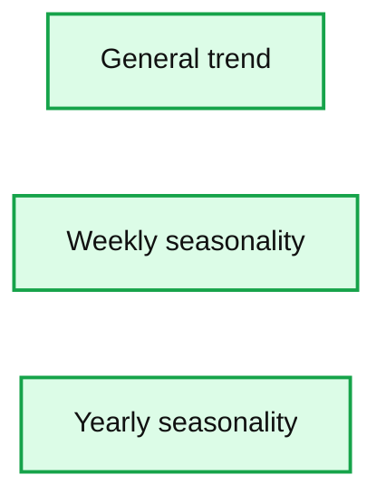

# How to Accelerate Demand Planning From 4.5 Hours to Under 1 Hour With Azure Databricks

- Source: https://www.databricks.com/blog/2021/01/28/how-to-accelerate-demand-planning-from-4-5-hours-to-under-1-hour-with-azure-databricks.html
- Published: 2021-01-28
- Authors: Adam Wasserman, Clinton Ford
- Categories: engineering, tutorials
- Images: 2 total, 2 extracted as architecture

## The importance of supply chain analytics

Rapid changes in consumer purchase behavior can have a material impact on supply chain planning, inventory management, and business results. Accurate forecasts of consumer-driven demand are just the starting point for optimizing profitability and other business outcomes. Swift inventory adjustments across distribution networks are critical to ensure supply meets demand while minimizing shipping costs for consumers. In addition, consumers redeem seasonal offers, purchase add-ons and subscriptions that affect product supply and logistics planning.

## Supply chain analytics at ButcherBox

ButcherBox faced extremely complex demand planning as it sought to ensure inventory with sufficient lead times, meet highly-variable customer order preferences, navigate unpredictable customer sign-ups and manage delivery logistics. It needed a predictive solution to address these challenges, adapt quickly and integrate tightly with the rest of its Azure data estate.

>  “Though ButcherBox was cloud-born, all our teams used spreadsheets,” said Jimmy Cooper, Head of Data, ButcherBox. “Because of this, we were working with outdated data from the moment a report was published. It’s a very different world now that we’re working with Azure Databricks.”

## How ButcherBox streamlined supply chain analytics

ButcherBox uses [Azure Databricks](https://www.databricks.com/product/azure) to generate its Demand Plan. When Azure Data Factory (ADF) triggers the Demand Plan run, Azure Databricks processes supply chain data from Azure Data Lake, vendor data and Hive caches. New outputs are stored in a data lake, then Azure Synapse updates Demand Plan production visualizations.

*Batching/microbatching orchestration with Azure Databricks*

**Summary:** Azure Databricks coordinates batch and microbatch supply-chain data processing across Azure Data Factory, Azure Data Lake Storage, Azure Synapse, Logic Apps, SQL pipelines, Hive Cache, and Power BI visualizations.

**Components:**

- Azure Data Factory ADF
- Raw, curated, and business-ready datasets
- Azure Data Lake Storage Gen2 ADLS2
- Data Pipelines
- Logic Apps
- SQL Azure SQL Pipelines
- Power BI Dataset Health Overview Visualization
- Vendor data from APIs and FTP
- Azure Key Vault KV
- Databricks
- Hive Cache
- Azure Active Directory Passthrough AAD Passthrough
- Power BI Production Visualizations
- Azure Synapse

**Flows:**

- Azure Data Factory -> Raw, curated, and business-ready datasets: copies from sources
- Raw, curated, and business-ready datasets -> Azure Data Lake Storage Gen2: stores datasets
- Azure Data Factory -> Data Pipelines: orchestration monitoring
- Azure Data Lake Storage Gen2 -> Data Pipelines: pipeline input
- Data Pipelines -> Logic Apps: triggers workflows
- Logic Apps -> SQL Azure SQL Pipelines: triggers SQL pipelines
- SQL Azure SQL Pipelines -> Power BI Dataset Health Overview Visualization: updates health visualization
- Vendor data from APIs and FTP -> Databricks: vendor data ingestion
- Azure Data Lake Storage Gen2 -> Databricks: data input
- Azure Key Vault -> Databricks: secrets access
- Hive Cache -> Databricks: cached data input
- Databricks -> Azure Active Directory Passthrough: authentication passthrough
- Azure Active Directory Passthrough -> Azure Data Lake Storage Gen2: authenticated storage access
- Databricks -> Azure Data Lake Storage Gen2: writes processed outputs
- Databricks -> Hive Cache: writes cached data
- Azure Data Lake Storage Gen2 -> Azure Synapse: triggers Synapse
- Azure Synapse -> Power BI Production Visualizations: updates production visualizations

**Numbers:** none

```mermaid
%% Shows Azure Databricks batch and microbatch orchestration
flowchart LR
    ADF[Azure Data Factory ADF]
    DATA[Raw curated and business ready datasets]
    ADLS[Azure Data Lake Storage Gen2 ADLS2]
    PIPE[Data Pipelines]
    LOGIC[Logic Apps]
    SQL[SQL Azure SQL Pipelines]
    HEALTH[Power BI Dataset Health Overview]
    VENDOR[Vendor data from APIs and FTP]
    KV[Azure Key Vault KV]
    DBX[Databricks]
    CACHE[Hive Cache]
    AAD[Azure Active Directory Passthrough]
    SYN[Azure Synapse]
    PROD[Power BI Production Visualizations]

    ADF -->|copies sources| DATA
    DATA -->|stores datasets| ADLS
    ADF -->|orchestration monitoring| PIPE
    ADLS -->|pipeline input| PIPE
    PIPE -->|triggers workflows| LOGIC
    LOGIC -->|triggers SQL pipelines| SQL
    SQL -->|updates health view| HEALTH
    VENDOR -->|vendor data| DBX
    ADLS -->|data input| DBX
    KV -->|secrets access| DBX
    CACHE -->|cached data| DBX
    DBX -->|authentication passthrough| AAD
    AAD -->|authenticated access| ADLS
    DBX -->|processed outputs| ADLS
    DBX -->|cached data| CACHE
    ADLS -->|triggers Synapse| SYN
    SYN -->|updates production view| PROD

    classDef client   fill:#dbeafe,stroke:#2563eb,stroke-width:2px,color:#111
    classDef service  fill:#dcfce7,stroke:#16a34a,stroke-width:2px,color:#111
    classDef store    fill:#ede9fe,stroke:#7c3aed,stroke-width:2px,color:#111
    classDef cache    fill:#fef3c7,stroke:#d97706,stroke-width:2px,color:#111
    classDef queue    fill:#cffafe,stroke:#0891b2,stroke-width:2px,color:#111
    classDef critical fill:#fee2e2,stroke:#dc2626,stroke-width:4px,color:#111
    classDef external fill:#e5e7eb,stroke:#6b7280,stroke-width:2px,stroke-dasharray:4 3,color:#111
    classDef decision fill:#fce7f3,stroke:#db2777,stroke-width:2px,color:#111

    class ADF,HEALTH,PROD client
    class PIPE,LOGIC,DBX,SYN,AAD service
    class DATA,ADLS,SQL store
    class CACHE cache
    class VENDOR external
    class KV queue

    %% Legend
    %% client = clients edge gateway or load balancer
    %% service = stateless compute
    %% store = databases or durable storage
    %% cache = Redis CDN or losable cache
    %% queue = Kafka streams or asynchronous pipes
    %% critical = bottleneck or single point of failure
    %% external = third party
    %% decision = trade off point
```

source image: https://www.databricks.com/wp-content/uploads/2021/01/butcherbox-blog-1.png

Batching/microbatching orchestration with Azure Databricks

 

ButcherBox leverages Azure Databricks to ingest all real-time streams of raw data from vendors, internal sources and historical data. Azure Databricks reconciles this data into item, box and distribution levels for users to view demand for the upcoming year. This data is then used for retention modeling, and pushed to Azure Synapse for historical comparison.

Apache Spark SQL in Azure Databricks is designed to be compatible with [Apache Hive](https://www.databricks.com/glossary/apache-hive). ButcherBox uses Hive to cache data from CSV files and then processes the cached data in Azure Databricks, enabling Demand Plan calculation times to decrease from 4.5 hours to less than one hour. This enabled an updated Demand Plan to be available for business users every morning to aid decision-making. Ingestion of these data streams also created trustworthy datasets for other processes and activities to consume. These new tools and capabilities helped ButcherBox quickly understand and adjust to changes in member behavior, especially in the midst of he COVID-19 pandemic.

## Create your first demand forecast using Azure Databricks

To get started using Azure Databricks for demand forecasts, download [this sample notebook](https://www.databricks.com/notebooks/fine-grained-demand-forecasting.html) and import it into your Azure Databricks workspace.

**Step 1: Load Store-Item Sales Data**
 Our training dataset is five years of transactional data across ten different stores. We’ll define a schema, read our data into a DataFrame and then create a temporary view for subsequent querying.

**Step 2: Examine data**
 Aggregating the data at the month level, we can observe an identifiable annual seasonality pattern, which grows over time. We can optionally restructure our query to look for other patterns such as weekly seasonality and overall sales growth.

**Step 3: Assemble historical dataset**
 From our previous loaded data, we can build a Pandas DataFrame by querying the “train” temporary view and then remove any missing values.

**Step 4: Build model**

Based on exploration of the data, we will want to set model parameters in accordance with the observed growth and seasonal patterns. As such, we opted for a linear growth pattern and enabled the evaluation of weekly and yearly seasonal patterns. Once our model parameters are set, we can easily fit the model to the historical, cleansed data.

**Step 5: Use a trained model to build a 90-day forecast**

Since our model is trained, we can use it to build a forecast similar to the one ButcherBox uses in their Demand Plan. This can be done quickly using historical data as shown below.

Once we predict over the future dataset, we can produce general and seasonal trends in our model as graphs (also shown below).

**Summary:** Three model-output charts show general trend, weekly seasonality, and yearly seasonality for demand forecasting.

**Components:**

- General trend chart using dates and trend values
- Weekly seasonality chart using day of week and weekly percentages
- Yearly seasonality chart using day of year and yearly percentages

**Flows:**

- none

**Numbers:** 2013, 2014, 2015, 2016, 2017, 2018, 16, 17, 18, 19, 20, 21, 22, 23, Sunday, Monday, Tuesday, Wednesday, Thursday, Friday, Saturday, -20%, -10%, 0%, 10%, 20%, January 1, March 1, May 1, July 1, September 1, November 1, -30%, -20%, -10%, 0%, 10%, 20%, 30%

source image: https://www.databricks.com/wp-content/uploads/2021/01/blog-image-butcher-box-2.jpg

Learn more by joining an [Azure Databricks event](https://www.databricks.com/azure-databricks-events) and get started right away with this [3-part training series](https://www.databricks.com/p/webinar/azure-databricks-3-part-training-series).
