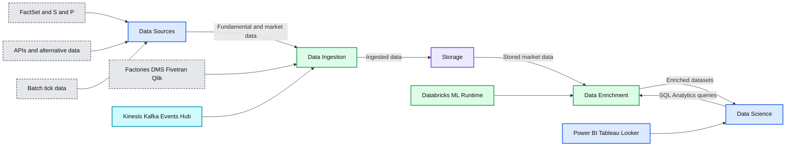
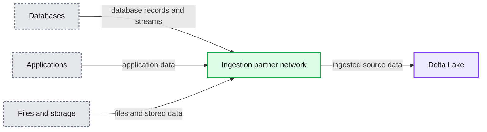
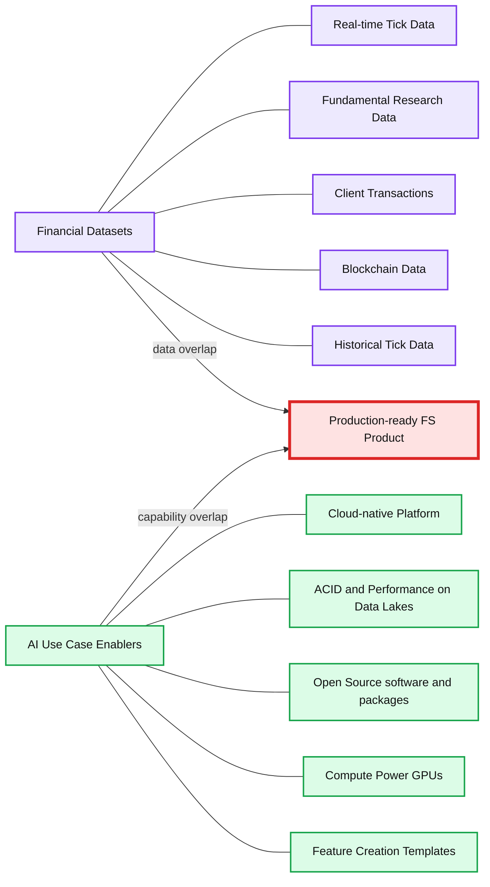
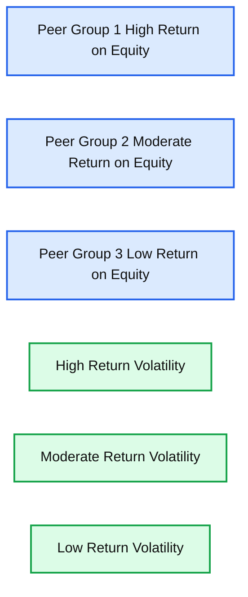
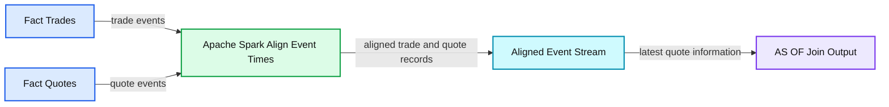
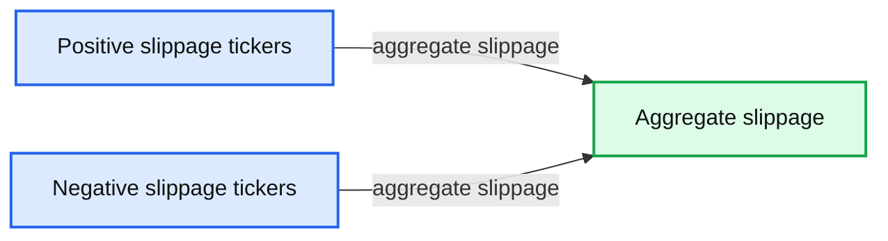
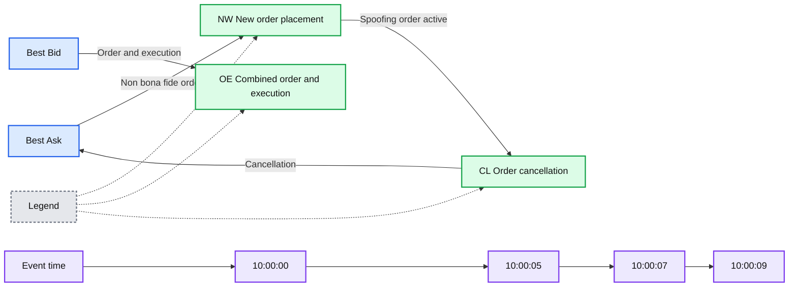
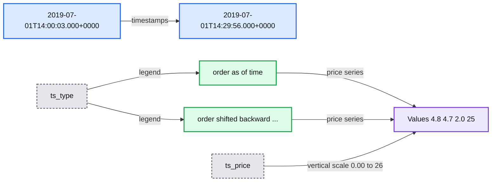

# Strategies for Modernizing Investment Data Platforms

- Source: https://www.databricks.com/blog/2021/01/29/strategies-for-modernizing-investment-data-platforms.html
- Published: 2021-01-29
- Authors: Ricardo Portilla
- Categories: engineering, solution-accelerators, open-source
- Images: 12 total, 10 extracted as architecture

The appetite for investment was at a historic high in 2020 for both individual and institutional investors. One study showed that ["retail traders make up nearly 25% of the stock market following COVID-driven volatility"](https://markets.businessinsider.com/news/stocks/retail-investors-quarter-of-stock-market-coronavirus-volatility-trading-citadel-2020-7-1029382035). Moreover, institutional investors have piled on investments in cryptocurrency, with 36% invested in cryptocurrency, [as outlined in Business Insider](https://markets.businessinsider.com/currencies/news/crypto-assets-bitcoin-owned-large-investors-institutional-fidelity-survey-percentage-2020-6-1029293753). As investors gain access to and trade alternative assets such as cryptocurrency, trading volumes have skyrocketed and created new data challenges. Moreover, cutting edge research is no longer restricted to institutional investors on Wall Street -- today's world of investing extends to digital exchanges in Silicon Valley, data-centric market makers, and retail brokers that are investing increasingly in AI-powered tools for investors. Data lakes have become standard for building financial data products and research, but they come with a unique set of challenges:

- Lack of blueprints for how to build an enterprise data lake in the cloud
- Organizations are still struggling to guarantee both reliability and timeliness of their data, leading to sub-optimal processes and diluted insights

As a result, scalable AI (such as volatility forecasting) is difficult to achieve due to high maintenance costs and the lack of a blueprint for scale and hence trading profitability. As part of our suggested blueprint, we recommend standardization on Delta Lake, which is an open-source storage layer that brings ACID transactions to Apache Spark™ and big data workloads. A table in Delta Lake is both a batch table, as well as a streaming source and sink. Streaming data ingest, batch historic backfill, and interactive queries all just work out of the box. In particular, since raw market data is delivered in real-time and must be used in near real-time to support trading decisions, Delta Lake is critical to support trading use cases.

This blog has 2 main sections. The first covers detailed options for landing financial market data into Delta Lake. The second section covers a blueprint for productionalizing use cases such as financial product volatility forecasting as well as market surveillance on Delta Lake. Notably, as part of the use cases, we introduce an open-source time-series package developed as part of Databricks Labs, which helps build the foundation for the use cases above.

## How to build a market Delta Lake

In this blog, through a series of design patterns and real-world examples, we will address the data challenges from the previous section. As a visual guide, the reference architecture below will be the basis for how to build out data lake sources and curate datasets for end reporting, trading summaries, and market surveillance alerts.

**Summary:** Reference architecture for an investment data platform spanning data sources, ingestion, enrichment, and data science.

**Components:**

- Data Sources using FactSet, S&P Global Market Intelligence, SQL Server, Aladdin, Bloomberg, 7Park Data, SafeGraph, ICE, Thomson Reuters, APIs, and CSV files
- Data Ingestion using Azure Data Factories, AWS DMS, Fivetran, Qlik, Amazon Kinesis, Kafka, Events Hub, Cloud Files Autoloader, and custom Spark ETL
- Storage using storage blob and Amazon S3
- Data Enrichment using Databricks Runtime for Machine Learning, Spark, TensorFlow, PyTorch, MLflow, XGBoost, and Pandas UDFs
- Data Science using SQL Analytics, Power BI, Tableau, Looker, and an exploratory data science workspace
- Enrichment datasets for tick data, market intelligence, TTM metrics, spread and TCA calculations, summarized news, volatility forecasts, news clusters, and risk summaries
- Enrichment optimizations using adaptive query execution and dynamic partition pruning

**Flows:**

- Data Sources -> Data Ingestion: fundamental, API-based, alternative, and batch tick data
- Data Ingestion -> Storage: ingested data
- Storage -> Data Enrichment: stored market data
- Data Enrichment -> Data Science: enriched datasets and analytics
- Data Science -> Data Enrichment: SQL Analytics queries

**Numbers:** 1, 2, 3, 4

source image: https://www.databricks.com/wp-content/uploads/2021/01/image-1.png

### Fundamental data source ingestion

Fundamental data, (positioned at the top left in Figure 1) loosely defined as economic and financial factors used to measure a company's intrinsic value, is available today from most financial data vendors. Two of the most common sources include [Factset](https://www.factset.com/) and [S&P Market Intelligence Platform](https://www.spglobal.com/marketintelligence/en/solutions/sp-capital-iq-pro). Both of these sources make data available via FTP, API, and a SQL Server database. Since data is available via a database for factor analysis, there are three easy options for ingestion into Delta Lake:

#### Option 1 - Partner ingestion network

Databricks has partnered with six companies which make up the "Data Ingestion Network of Partners." Our partners have capabilities to ingest data from a variety of sources, including FTP, CRMs, marketing sources, and database sources. Since financial vendors allow financial clients to host databases, our partner tools can be used to pull out data to store directly in Delta Lake. Full documentation on how to ingest using this network and a listing of partners is located at Databricks' documentation, Partner data integrations.

**Summary:** The diagram shows Delta Lake receiving data through a partner ingestion network from databases, applications, and files or storage systems.

**Components:**

- Delta Lake: lakehouse storage platform
- Data ingestion network of partners: Azure Data Factory, Fivetran, Qlik, Infoworks, StreamSets, and Syncsort
- Databases: SQL Server, Amazon DynamoDB, MySQL, MariaDB, MongoDB, Oracle, Teradata, PostgreSQL, and Kafka
- Applications: Salesforce, Marketo, SAP HANA, Workday, Google Analytics, GitHub, Jira, Splunk, Asana, Mainframe, MailChimp, Mandrill, Intercom, Amplitude, Magento, Facebook Ads, LinkedIn Advertising, AppsFlyer, SendGrid, Oracle, Eloqua, Zendesk, Stripe, and HubSpot
- Files or storage: Azure Data Lake Storage, Amazon S3, Google Cloud Storage, FTP, Dropbox, Google Sheets, email, CSV, PDF, and XML

**Flows:**

- Databases -> Data ingestion network of partners: database records and streams
- Applications -> Data ingestion network of partners: application and business data
- Files or storage -> Data ingestion network of partners: files and stored data
- Data ingestion network of partners -> Delta Lake: ingested source data

**Numbers:** none

source image: https://www.databricks.com/wp-content/uploads/2021/01/image-2.png

#### Option 2 - Use native cloud-based ingestion tools

Cloud service providers also have existing tools for database replication into Delta Lake. Below are two options for ingesting from databases (on-prem or cloud) into Delta Lake.

##### AWS

AWS offers a solution, Database Migration Services, which allows organizations to set up a Change Data Capture (CDC) process to replicate database changes to cloud data lakes. We  outlined a specific method for replicating database changes to Delta Lake in our blog, ["Migrating Transactional Data to a Delta Lake using AWS DMS."](https://www.databricks.com/blog/2019/07/15/migrating-transactional-data-to-a-delta-lake-using-aws-dms.html) Since Xpressfeed S&P data, for example, has hundreds of sources, ranging from ESG risk scores and alternative data to fundamental earnings and news sentiment datasets, an automated way to replicate these to Delta Lake is critical. The AWS solution mentioned above provides a simple way to set this up.

##### Azure

One of Azure's most popular services is Azure Data Factory (ADF) and with good reason. ADF allows copying from many different data sources, including databases, FTP and even cross-cloud sources such as BigQuery. In particular, there are two methods of writing data to Delta Lake from a SQL database:

- ADF offers a simple ['**Copy To**' factory](https://docs.microsoft.com/en-us/azure/data-factory/connector-azure-databricks-delta-lake#direct-copy-to-delta-lake) that simply copies database tables to blob storage (Blob or ADLS Gen2), and Delta Lake is a valid target table for this copy functionality.
- For a more customized transformation from a database to Delta Lake, ADF is flexible enough to read all tables from a database using an information schema as shown here. From here, one can simply configure a Databricks notebook which uses the input table name from the information schema and copies each table by executing a Databricks notebook which reads from the database using JDBC. Examples are [here](https://docs.databricks.com/data/data-sources/sql-databases.html#read-data-from-jdbc).

### API-based data source ingestion

 

Bloomberg is one of the industry standards for market data, reference data, and hundreds of other feeds. In order to show an example of API-based ingestion (middle left in Figure 1) from a Bloomberg data subscription, the B-PIPE (Bloomberg data API for accessing market data sources) [emulator](https://github.com/Robinson664/bemu) will be used. The Java market data subscription client code in the original emulator has been modified in the code below to publish events into a Kinesis real-time stream using the AWS SDK.

**Write B-PIPE market data to streaming service**

#### Write data from Kinesis stream to Delta Lake

 

#### Transform and read records

### Tick data source ingestion

Tick data (positioned in bottom left of Figure 1), which is the general term for high resolution intraday market data, typically comes from data vendors as batch sources in CSV, JSON or binary formats. Types of tick data include trade, quote, and contracts data, and an example of delivery  is the [tick data history service](https://www.thomsonreuters.com/en/press-releases/2017/july/thomson-reuters-enhances-tick-history-in-preparation-for-mifid-ii.html) offered by Thomson Reuters. The easiest way to continuously land data into Delta Lake from these sources is to set up the Databricks [autoloader](https://docs.databricks.com/spark/latest/structured-streaming/auto-loader.html) to read from a bucket and redirect data into a separate Delta Lake table. From here, various ETL processes might curate each message type into refined or aggregated Delta tables. The benefits of autoloader are twofold:

- Reliability and Performance inherited from Delta Lake
- Lower costs due to underlying use of SQS (AWS ) or AQS (Azure) to avoid re-listing input files as well as a managed checkpoint to avoid manual selection of the most current unread files.

## From Delta Lake to financial services use case productionization

Beyond the data collection challenges that surface when building any data platform, investment management firms increasingly need to address the incorporation of AI into product suites, as well as managing costs for feature engineering. In particular:

1. Both retail and institutional investment firms need to also be able to query and run ETL on data lakes in a cost-effective manner and minimize the amount of maintenance costs associated with enriching and querying data lakes*.*
2. Retail investors expect AI-powered offerings and insights in subscriptions. The optimal solution will host the AI infrastructure in such a way that users can create AI-powered applications and dashboards where time spent on the setup of libraries and elastic compute infrastructure is minimized, and the underlying processing can be scaled to billions of data points that come in daily from transactional data sources (customer transactions and tick quotes alike).

Now that we've presented reliable, efficient approaches for landing financial datasets into a cloud data lake, we want to address some of the existing gaps between financial datasets in the cloud and AI-powered products.

 

**Summary:** The diagram shows the overlap between financial datasets and AI use case enablers needed to create a production-ready financial services product.

**Components:**

- Financial Datasets: technology not specified
- Real-time Tick Data: technology not specified
- Fundamental Research Data: technology not specified
- Client Transactions: technology not specified
- Blockchain Data: technology not specified
- Historical Tick Data: technology not specified
- AI Use Case Enablers: technology not specified
- Cloud-native Platform: technology not specified
- ACID and Performance on Data Lakes: technology not specified
- Open Source software and packages: technology not specified
- Compute Power GPUs: technology not specified
- Feature Creation Templates: technology not specified
- Production-ready FS Product: technology not specified

**Flows:**

- Financial Datasets -> Production-ready FS Product: data overlap
- AI Use Case Enablers -> Production-ready FS Product: platform and capability overlap

**Numbers:** none

source image: https://www.databricks.com/wp-content/uploads/2021/01/gaps-between-data-sets-blog-image.png

The image above shows how datasets and siloed infrastructure are not enough to deliver investment analysis products in production. Most FSIs have adopted nearly all of the AI use case enablers on the right-hand side but have failed to maximize the volume-weighted overlap of these with core datasets. The Databricks Unified Data Analytics Platform subsumes the first four AI use case enablers out of the box. To make productionization more concrete, we'll show how to use a new Databricks open-sourced package tempo for manipulating time series at scale. Then we'll dive into the following use case feature creation templates which use tempo and show how to get the best of both worlds in the Venn diagram above.

1. **Retail investing** details using fundamental data to inform daily volatility predictions.
2. **Market surveillance** details a process for summarizing price improvement and detecting spoofing.

### Tempo - Time Series Package

In financial services, time series are ubiquitous, and we find that our customers struggle with manipulating time series at scale. In the past, we have outlined a few [approaches](https://www.databricks.com/blog/2019/10/18/scaling-financial-time-series-analysis-beyond-pcs-and-pandas-on-demand-webinar-and-faq-now-available.html) to scaling time-series queries. Now, Databricks Labs has released a simple common set of time-series utilities to make time-series processing simpler in an open-source package called [tempo](https://github.com/databrickslabs/tempo). This package contains utilities to do the following:

- AS OF joins to merge up to millions of irregular time series together
- Feature creation with rolling aggregations of existing metrics
- Optimized writes to Delta Lake ideal for ad-hoc time-series queries
- Volume-weighted average price (VWAP) calculations
- Resampling
- Exponential Moving Average calculations

By combining the versatile nature of tick data, reliable data pipelines and open source software like tempo, organizations can unlock exponential value from a variety of use cases at minimal costs and fast execution cycles. The next section walks through two recurring themes in capital markets which utilize tempo: volatility forecasting and market surveillance.

### Volatility forecasting methodology with fundamental and technical data

S&P Global Market Intelligence provides [fundamental data](https://www.spglobal.com/marketintelligence/en/solutions/fundamental-data) that can be ingested using a mechanism called Xpressfeed (covered earlier in this guide). Some important points about this feed are that:

- It covers thousands of fundamental data metrics
- It covers hundreds of thousands of globally listed and unlisted equities
- Reporting frequency is daily – there is a filing date that can be used for point-in-time analyses

Although we do not cover the curation process for the tick ETL (contact Databricks [sales](mailto:sales@databricks.com) for more information on this use case), we outline the processing from standard tick formats to a final forecasting object using the tempo library; our implementation is in the links reported in the bottom of this blog. The high-level details are as follows:

1. **Create Point-in-time Calendar** - Merge the latest fundamental data onto the latest calendar date using the filing date (fundamental data point filing date as of trade date). Commonly referred to as AS-OF join, this operation is usually expensive and subject to technical bottlenecks in a highly imbalanced dataset. tempo will guarantee this operation to be evenly distributed to leverage at best the cloud elasticity (and its associated costs).
2. **Create peer groups** - using meaningful fundamental data items such as EPS, return on equity, float % (to represent stakeholder holdings), form peer groups based on each metric. Note that the data item values need to be pivoted to perform meaningful feature engineering here.
3. **Resample tick data** to the hour (or whatever granularity desired). Hourly is chosen due to the fact that daily aggregation does not provide enough granularity for a good forecast on volatility.
4. **Forecast market volatility** on Databricks using the runtime for machine learning.
5. **Aggregate forecasting results** to find max / min volatility companies based on securities being evaluated.

 

**Summary:** Entity relationship diagram showing a Databricks capital-markets data pipeline from raw market feeds through feature engineering and volatility forecasting to an investor dashboard.

**Components:**

- Raw quote facts using `fact_quotes`
- Raw market-data facts using `fact_market_data_items`
- Ticker dimension using `dim_tickers`
- Trade calendar using `trade_calendar`
- Ticker calendar using `dim_ticker_calendar`
- Point-in-time metrics using `point_in_time_ttm_metrics`
- TTM bid-ask summaries using `rollup_quote_bid_ask_summary`
- Market-data features using `feature_mkt_data_items`
- Derived peer groups using `derived_peer_groups`
- Market features using `feature_mkt_data_items`
- Daily market forecast using `daily_mkt_forecast`
- Peer-group volatility summary using `peer_group_max_volatility_summary`
- Investor dashboard for forecast high securities per peer group
- Databricks GPU training and CPU inference

**Flows:**

- `fact_quotes` -> `point_in_time_ttm_metrics`: resampled quote data
- `fact_market_data_items` -> `point_in_time_ttm_metrics`: point-in-time market data
- `dim_tickers` -> `dim_ticker_calendar`: ticker cross join
- `trade_calendar` -> `dim_ticker_calendar`: calendar cross join
- `dim_ticker_calendar` -> `point_in_time_ttm_metrics`: as-of join and window
- `point_in_time_ttm_metrics` -> `rollup_quote_bid_ask_summary`: TTM metric aggregation
- `point_in_time_ttm_metrics` -> `feature_mkt_data_items`: pivoted market-data features
- `rollup_quote_bid_ask_summary` -> `feature_mkt_data_items`: bid-ask summary features
- `feature_mkt_data_items` -> `derived_peer_groups`: peer-group derivation
- `feature_mkt_data_items` -> `daily_mkt_forecast`: forecast features
- `derived_peer_groups` -> `daily_mkt_forecast`: peer-group inputs
- `daily_mkt_forecast` -> `peer_group_max_volatility_summary`: aggregated volatility forecasts
- `feature_mkt_data_items` -> `investor dashboard`: securities and feature data
- `peer_group_max_volatility_summary` -> `investor dashboard`: maximum volatility results
- `daily_mkt_forecast` -> `GPU training and CPU inference`: model processing

**Numbers:** 2021-01-18; 2021

```mermaid
%% Capital markets analytics pipeline from raw feeds to investor dashboard
flowchart LR
  Q[Raw quote facts]
  M[Raw market data facts]
  T[Ticker dimension]
  C[Trade calendar]
  TC[Ticker calendar]
  PIT[Point in time metrics]
  BA[TTM bid ask summary]
  F[Market data features]
  P[Derived peer groups]
  D[Daily market forecast]
  V[Peer group volatility summary]
  I[Investor dashboard]

  Q -->|resample| PIT
  M -->|as of join| PIT
  T -->|cross join| TC
  C -->|cross join| TC
  TC -->|calendar window| PIT
  PIT -->|aggregate| BA
  PIT -->|pivot| F
  BA -->|feature input| F
  F -->|derive groups| P
  F -->|forecast inputs| D
  P -->|peer inputs| D
  D -->|aggregate results| V
  F -->|dashboard data| I
  V -->|max volatility| I

  classDef client fill:#dbeafe,stroke:#2563eb,stroke-width:2px,color:#111
  classDef service fill:#dcfce7,stroke:#16a34a,stroke-width:2px,color:#111
  classDef store fill:#ede9fe,stroke:#7c3aed,stroke-width:2px,color:#111
  classDef cache fill:#fef3c7,stroke:#d97706,stroke-width:2px,color:#111
  classDef queue fill:#cffafe,stroke:#0891b2,stroke-width:2px,color:#111
  classDef critical fill:#fee2e2,stroke:#dc2626,stroke-width:4px,color:#111
  classDef external fill:#e5e7eb,stroke:#6b7280,stroke-width:2px,color:#111,stroke-dasharray:4 3
  classDef decision fill:#fce7f3,stroke:#db2777,stroke-width:2px,color:#111

  class I client
  class PIT,BA,F,P,D,V service
  class Q,M,T,C,TC store
```

source image: https://www.databricks.com/wp-content/uploads/2021/01/erd-for-building-analytics.png

 One of the noteworthy aspects of this data architecture is the last transitions when creating gold forecasting tables. In particular,

1. We have incorporated ML as part of the feature engineering processing. This means we should apply full rigor for CI/CD as part of ML governance. [Here](https://www.databricks.com/blog/2020/10/13/using-mlops-with-mlflow-and-azure.html) is a template for accomplishing this in full rigor.
2. We have chosen to highlight the importance of GPUs for forecasting volatility. In the notebook example at the end of this blog, we have chosen to use xgboost and simple range statistics on various quote metrics as part of our features. By leveraging the gpu_hist tree method and fully-managed GPU clusters and runtime, we can save 2.65X on costs (and 2.27X on runtime), both exhibiting the hard cost reduction and productivity savings for data teams.  These metrics were obtained on 6 months of tick data from a major US exchange.

Ultimately, with the help of tempo and [Databricks Runtime for Machine Learning](https://docs.databricks.com/runtime/mlruntime.html), retail brokerages can service their clients with dashboards unifying fundamental and technical analysis using AI techniques. Below is the result of our peer group forecasts.

 

**Summary:** Dashboard comparing trade-volume peer groups by return on equity and their volatility.

**Components:**

- Trade Volume Peer Group 1 - High Return on Equity: JPM
- Trade Volume Peer Group 2 - Moderate Return on Equity: AAPL, ACA, MTG, EXP
- Trade Volume Peer Group 3 - Low Return on Equity: XOM, AAP, CVNA, GM, ISG
- Volatility for High Return on Equity Peers: JPM
- Volatility for Moderate Return on Equity Peers: AAPL, MTG, ACA, EXP
- Volatility for Low Return on Equity Peers: GM, CVNA, ISG, XOM, AAP
- Legend: JPM, AAPL, EXP, MTG, ACA, XOM, GM, CVNA, AAP, ISG, trace 3, trace 4, trace 5

**Flows:**

- none

**Numbers:**

- Peer groups 1, 2, and 3
- 100%
- 66.3%
- 9.12%
- 11.5%
- 13%
- 47.6%
- 16.2%
- 14%
- 21.8%
- 0.371%
- High-return volatility values: 0 to 3
- Moderate-return volatility values: 0 to 5
- Low-return volatility values: 0 to 25

source image: https://www.databricks.com/wp-content/uploads/2021/01/image-6.png

### Market surveillance methodology with tick data

Market surveillance is an important part of the financial services ecosystem, which aims to reduce market manipulation, increase transparency, and enforce baseline rules for various assets classes. Some examples of organizations, both governmental and private, that have broad surveillance programs in place include NASDAQ, FINRA, CFTC, and CME Group. As the retail investing industry gets larger with newer and inexperienced investors ([source](https://www.tradersmagazine.com/am/retail-investing-evolves/)), especially in the digital currency space, it is important to understand how to build a basic surveillance program that reduces financial fraud and increases transparency in areas such as market volatility, risk, and best execution. In the section below, we show how to build basic price improvement summaries, as well as putting a basic spoofing implementation together.

#### Price improvement

Price improvement refers to the amount of improvement on the bid (in the case of a sell order) or the ask (in the case of a buy order) that brokers provide clients. This is important for a retail broker because it often contributes to perceived quality of a broker if it consistently saves clients money on a set of trades over time. The basic concept of price improvement is:

- Maria places a market order at 10:00 AM for stock XYZ for 100 shares at which the best bid/ask is $10/$11
- Broker A routes the order to an exchange to get an execution price of $10.95 per share
- The savings is $0.05 * 100 = $5.00 on this execution, representing some modest price improvement

Even though the improvement is small, over time, these savings can add up over hundreds of trades. Some brokers display this information in-app also for transparency and to showcase the ability to route to appropriate market centers or market makers to get good prices.

##### Calculating price improvement

Price improvement is really a special case of *slippage* (how much the execution price shifts from the best bid/ask at order arrival time). It affects digital currency as much as traditional equities, arguably more so since there is a high amount of volatility and order-volume fluctuation. For example, here are some[insights on finance market depth and slippage.](https://www.hodlbot.io/blog/an-analysis-of-slippage-on-the-binance-exchange)Below is a basic blueprint for how to calculate slippage using tempo (detailed code is available in the attached notebook):

- Ingest market order messages (orders placed)
- Ingest execution messages
- Perform AS OF join to order arrival time using tempo
- Perform AS OF join to execution time using tempo
- Measure the difference in the execution price and the bid/ask available at order arrival time
- Summarize by firm and serve up in SQL analytics and/or BI dashboards

Ingestion of order book data to get orders and executions is typically available in JSON or other flat file formats from internal systems or OMS (order management systems). Once this data is available, the AS OF join operates on a pair of data frames as described in the official tempo documentation [here](https://github.com/databrickslabs/tempo#1-asofjoin---as-of-join-to-paste-latest-as-of-information-onto-fact-table):

**Summary:** The diagram shows Apache Spark aligning trade and quote event times before performing an AS OF join that appends the latest quote data to each trade.

**Components:**

- Fact Trades with ticker, event timestamp, and trade price
- Fact Quotes with ticker, event timestamp, bid, and ask
- Apache Spark Align Event Times
- Aligned event stream with trade and quote records
- AS OF join output with trade and latest bid and ask values

**Flows:**

- Fact Trades -> Apache Spark Align Event Times: trade events
- Fact Quotes -> Apache Spark Align Event Times: quote events
- Apache Spark Align Event Times -> Aligned event stream: time-aligned trade and quote records
- Aligned event stream -> AS OF join output: latest quote information pasted onto trades

**Numbers:** 09:59:00, 10:00:00, 10:00:01, 10:00:02, 10:01:00, 10:01:05, 10:01:06, 10:01:10, 10:02:00, 11.8, 12, 12.05, 12.07, 12.1, 12.2, 12.3, 12.4, 12.5, 12.6, 13, 14, 7

source image: https://www.databricks.com/wp-content/uploads/2021/01/image-7.png

Below we display the code which performs the join.

 

Once this data is available in Delta Lake, it can be sliced in various ways to get a summary of those securities that have prominent slippage. See the example below, which summarizes the log of the aggregate slippage for a slice of time on a trading day.

**Summary:** Bar chart showing aggregate slippage by ticker, with SWN and HAL highest and SHOP most negative.

**Components:**

- SWN ticker, technology not shown
- HAL ticker, technology not shown
- HQY ticker, technology not shown
- RGNX ticker, technology not shown
- BABA ticker, technology not shown
- LAMR ticker, technology not shown
- LMT ticker, technology not shown
- KLAC ticker, technology not shown
- SMH ticker, technology not shown
- KRC ticker, technology not shown
- GDXJ ticker, technology not shown
- SPPI ticker, technology not shown
- TDY ticker, technology not shown
- CNA ticker, technology not shown
- BIG ticker, technology not shown
- MRK ticker, technology not shown
- FBC ticker, technology not shown
- LINX ticker, technology not shown
- NEU ticker, technology not shown
- SHOP ticker, technology not shown
- Aggregate slippage vertical axis
- Ticker horizontal axis

**Flows:**

- none

**Numbers:** 0, 2, 4, 6, 8

source image: https://www.databricks.com/wp-content/uploads/2021/01/image-8-1.png

#### Spoofing

Spoofing refers to a market manipulation pattern which involves entry of artificial interest (via fake order placement) followed by execution on the opposite side to take advantage of best bid/ask changes, which were falsely influenced by the original artificial interest. The spoofing order of events typically involves cancellation of orders as well - we outline a simple example below.

**Summary:** The diagram shows a basic spoofing sequence in which a non-bona fide ask-side order is placed, a bid-side execution occurs, and the spoofing order is later canceled.

**Components:**

- Best Ask, market price level, technology not specified
- NW, new order placement, technology not specified
- OE, combined order and execution, technology not specified
- CL, order cancellation, technology not specified
- Best Bid, market price level, technology not specified
- Event time, chronological timeline, technology not specified
- Legend, notation reference, technology not specified

**Flows:**

- Best Ask -> NW: non-bona fide order placement
- NW -> CL: spoofing order remains active
- CL -> Best Ask: order cancellation
- Best Bid -> OE: combined order and execution

**Numbers:** 10:00:00, 10:00:05, 10:00:07, 10:00:09

source image: https://www.databricks.com/wp-content/uploads/2021/01/image-9.png

Spoofing is one of the hundreds of different market manipulation techniques and occurs in many different asset classes. In particular, it has been part of most market surveillance programs for equities, but due to increased demand in digital currencies such as bitcoin and Ether, it is of increased importance. In fact, since the volatility of cryptocurrencies is so variable, it is critical to protect clients from potential spoofing activities to secure trust in crypto platforms, whether they be exchanges or DeFi frameworks.

##### Sample pattern

The sequence of steps to detect spoofing applies to other manipulation patterns (e.g. front-running, layering, etc), so we've outlined a simple approach to highlight some underlying techniques.

- Save order placement information - key on ORDER ID and sequence number
- Save cancellation information for all orders (comes equipped with ORDER ID)
- Record NBBO at order arrival time (order_rcvd_ts in data below) as well as the NBBO prior to order arrivalJoin orders and cancellations (look for full cancellations) and record sequences of the following form:
  - NBBO change at limit order placement from seconds prior to order placement (for a sell order, decrease in best ask)
  - Cancellation at order placement (we refer to a fake order as a non-bonafide order)
  - Execution on the opposite side of the order placement above
  - Wash trade (self-trade) activity by the same market participant (or as a nuance, this could represent different MPIDs under the same CRD)

Sample pattern for capturing the NBBO (quote as a proxy here) information using the tempo AS OF join:

Below, we visualize the downward motion of the NBBO for a few sample orders, which validates the pattern we are looking for in the NBBO change.

**Summary:** Bar chart comparing `ts_price` values for orders as of time versus orders shifted backward across six timestamps.

**Components:**

- `ts_price` vertical axis
- `ts_type` legend
- `order as of time` series
- `order shifted backward ...` series
- Timestamp horizontal axis

**Flows:**

- none

**Numbers:** 26, 24, 22, 20, 18, 16, 14, 12, 10, 8.0, 6.0, 4.0, 2.0, 0.00, 4.8, 4.7, 2.0, 25, 2019-07-01T14:00:03.000+0000, 2019-07-01T14:29:56.000+0000

source image: https://www.databricks.com/wp-content/uploads/2021/01/image-10.png

Finally, we save off the report of firms with non-bonafide executions that happen to coincide with some wash trading activity.

**Summary:** SQL joins non-bona-fide executions with wash trades by MPID and size, then ranks the top firms by logarithmic trade count.

**Components:**

- SQL query
- `ricardo.gold_non_bona_fide_executions` source table
- `ricardo.gold_wash_trades` source table
- MPID and size join keys
- Grouped aggregation by MPID
- Ranked bar chart of `log_trade_ct`

**Flows:**

- Non-bona-fide executions -> SQL query: execution records
- Wash trades -> SQL query: wash-trade records
- SQL query -> Join: matches `mpid` and `size`
- Join -> Aggregation: groups by `mpid`
- Aggregation -> Ranking: orders by `log_trade_ct` descending
- Ranking -> Bar chart: top 10 firms

**Numbers:** `10`, `5`, `0`, `1101`

```mermaid
%% Shows the SQL join and ranking flow for overlapping non-bona-fide executions and wash trades
flowchart LR
    A[Non bona fide executions] -->|execution records| C[SQL query]
    B[Wash trades] -->|wash trade records| C
    C -->|match mpid and size| D[Join]
    D -->|group by mpid| E[Aggregation]
    E -->|order by log trade ct descending| F[Top 10 firms]
    F -->|bar values| G[Log trade count chart]

    classDef client fill:#dbeafe,stroke:#2563eb,stroke-width:2px,color:#111
    classDef service fill:#dcfce7,stroke:#16a34a,stroke-width:2px,color:#111
    classDef store fill:#ede9fe,stroke:#7c3aed,stroke-width:2px,color:#111
    classDef cache fill:#fef3c7,stroke:#d97706,stroke-width:2px,color:#111
    classDef queue fill:#cffafe,stroke:#0891b2,stroke-width:2px,color:#111
    classDef critical fill:#fee2e2,stroke:#dc2626,stroke-width:4px,color:#111
    classDef external fill:#e5e7eb,stroke:#6b7280,stroke-width:2px,color:#111,stroke-dasharray:4 3
    classDef decision fill:#fce7f3,stroke:#db2777,stroke-width:2px,color:#111

    class A,B store
    class C,D,E,F service
    class G client
```

source image: https://www.databricks.com/wp-content/uploads/2021/01/image-11.png

## Conclusions

In this blueprint, we've focused on the ingestion of common datasets into Delta Lake as well as strategies for productionizing pipelines on Delta Lake objects. Utilizing Delta Lake enables FSIs to focus on product delivery for customers, ultimately resulting in increased AUM, decreased financial fraud, and increased subscriptions as the world of investing expands to more and more retail investors. From a technical perspective, all the use cases above are made possible by core tenets of a modern data architecture with help from the newly released tempo library:

- Support for open-source packages and integration with industry-accepted frameworks
- Infrastructure support for AI use cases
- Feature creation templates
- Time-series analyses support

We have documented these approaches and provided feature creation templates for a few popular use cases in the notebook links below. In addition, we've  introduced tempo and its applications within these templates as a foundation for investment data platforms.

Try the below notebooks on Databricks to accelerate your investment platforms today and [contact us](https://www.databricks.com/company/contact) to learn more about how we assist customers with similar use cases.

[Bloomberg API Ingestion Notebook](https://www.databricks.com/notebooks/tempo/02_bpipe_producer_etl.html)

[Volatility Forecasting from Fundamental & Technical Data](https://www.databricks.com/notebooks/tempo/03_tempo_volatility.html)

[Execution Quality and Spoofing](https://www.databricks.com/notebooks/tempo/04_tempo_spoofing.html)
