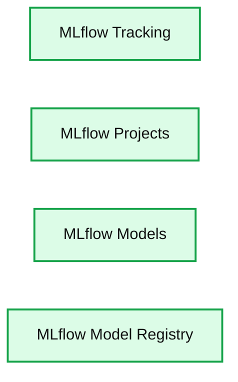

# Ray & MLflow: Taking Distributed Machine Learning Applications to Production

- Source: https://www.databricks.com/blog/2021/02/03/ray-mlflow-taking-distributed-machine-learning-applications-to-production.html
- Published: 2021-02-03
- Authors: Amog Kamsetty, Archit Kulkarni
- Categories: engineering, open-source
- Images: 2 total, 1 extracted as architecture

*Free Edition has replaced Community Edition, offering enhanced features at no cost. Start using *[*Free Edition *](https://login.databricks.com/?intent=SIGN_UP&amp;signup_experience_step=EXPRESS&amp;provider=DB_FREE_TIER&amp;dbx_source=www)*today.*
 

This is a guest blog from software engineers [Amog Kamsetty](https://www.linkedin.com/in/amogkamsetty/) and [Archit Kulkarni](https://www.linkedin.com/in/archit-kulkarni-a0136a90/) of Anyscale and contributors to Ray.io

In this blog post, we're announcing two new integrations with [Ray](https://www.ray.io/) and [MLflow](https://mlflow.org/): Ray Tune+MLflow Tracking and [Ray Serve](https://docs.ray.io/en/master/serve/)+[MLflow Models](https://www.mlflow.org/docs/latest/models.html), which together make it much easier to build machine learning (ML) models and take them to production.

These integrations are available in the latest Ray wheels. You can follow the [instructions here to pip install the nightly version of Ray](https://docs.ray.io/en/master/ray-overview/installation.html#daily-releases-nightlies) and take a look at the documentation to get started. They will also be in the next Ray release -- version 1.2

[Our goal is to leverage the strengths of the two projects: Ray's distributed libraries for scaling training and serving and MLflow's end-to-end model lifecycle management.](https://www.databricks.com/wp-content/uploads/2021/02/ray-logo2.png)

## [What problem are these tools solving?](https://www.databricks.com/wp-content/uploads/2021/02/ray-logo2.png)

[Let's first take a brief look at what these libraries can do before diving into the new integrations.](https://www.databricks.com/wp-content/uploads/2021/02/ray-logo2.png)

### [Ray Tune scales hyperparameter tuning](https://www.databricks.com/wp-content/uploads/2021/02/ray-logo2.png)

[With ML models increasing in size and training times, running large-scale ML experiments on a single machine is no longer feasible. It's now a necessity to distribute your experiment across many machines.](https://www.databricks.com/wp-content/uploads/2021/02/ray-logo2.png)

[Ray Tune](https://docs.ray.io/en/latest/tune/) is a library for executing hyperparameter tuning experiments at any scale and can save you tens of hours in training time.

With [Ray Tune](https://docs.ray.io/en/latest/tune/) you can:

- Launch a multi-node hyperparameter sweep in
- Use any ML framework such as Pytorch, Tensorflow, MXNet, or Keras
- Leverage state of the art hyperparameter optimization algorithms such as Population Based Training, HyperBand, or Asynchronous Successive Halving (ASHA).

## Ray Serve scales model serving

After developing your machine learning model, you often need to deploy your model to actually serve prediction requests. However, ML models are often compute intensive and require scaling out to distributed systems in real deployments.

[Ray Serve](https://docs.ray.io/en/master/serve/) is an easy-to-use scalable model serving library that:

- Simplifies model serving using GPUs across many machines so you can meet production uptime and performance requirements.
- Works with any ML framework, such as Pytorch, Tensorflow, MXNet, or Keras.
- Provides a programmatic configuration interface (no more YAML or JSON!).

## MLflow tames end-to-end model lifecycle management

**Summary:** MLflow provides four components for managing the end-to-end machine learning lifecycle.

**Components:**

- MLflow Tracking: records and queries experiment code, data, configuration, and results.
- MLflow Projects: packages data science code for reproducible runs on any platform.
- MLflow Models: deploys machine learning models in diverse serving environments.
- MLflow Model Registry: stores, annotates, and manages models in a central repository.

**Flows:**

- none

**Numbers:** none

source image: https://www.databricks.com/wp-content/uploads/2021/02/mlflow-components2.png

Ray Tune and Ray Serve make it easy to distribute your ML development and deployment, but how do you manage this process? This is where [MLflow](https://mlflow.org/) comes in.

During experiment execution, you can leverage [MLflow's Tracking API](https://www.mlflow.org/docs/latest/tracking.html) to keep track of the hyperparameters, results, and model checkpoints of all your experiments, as well as easily visualize and share them with other team members. And when it comes to deployment, MLflow Models provides standardized packaging to support deployment in a variety of different environments.

### Key Takeaways

Together, [Ray Tune](https://docs.ray.io/en/latest/tune/), [Ray Serve](https://docs.ray.io/en/master/serve/), and [MLflow](https://mlflow.org/) remove the scaling and managing burden from ML Engineers, allowing them to focus on the main task– building ML models and algorithms.

Let's see how we can leverage these libraries together.

## Ray Tune + MLflow Tracking

[Ray Tune](https://docs.ray.io/en/latest/tune/) integrates with[MLflow Tracking API](https://www.mlflow.org/docs/latest/tracking.html) to easily record information from your distributed tuning run to an MLflow server.

There are two APIs for this integration: an **MLflowLoggerCallback** and an **mlflow_mixin**.

With the MLflowLoggerCallback, [Ray Tune](https://docs.ray.io/en/latest/tune/) will automatically log the hyperparameter configuration, results, and model checkpoints from each run in your experiment to [MLflow](https://mlflow.org/).

You can see below that Ray Tune runs many different training runs, each with a different hyperparameter configuration, all in parallel. These runs can all be seen on the MLflow UI, and on this UI, you can visualize any of your logged metrics. When the MLflow tracking server is remote, others can even access the results of your experiments and artifacts.

If you want to manage what information gets logged yourself rather than letting Ray Tune handle it for you, you can use the mlflow_mixin API.

Add a decorator to your training function to call any MLflow methods inside the function:

You can check out the documentation here for full runnable examples and more information.

## Ray Serve + MLflow Models

[MLflow models](https://www.mlflow.org/docs/latest/models.html) can be conveniently loaded as python functions, which means that they can be served easily using [Ray Serve](https://docs.ray.io/en/master/serve/). The desired version of your model can be loaded from a model checkpoint or from the [MLflow Model Registry](https://www.mlflow.org/docs/latest/model-registry.html) by specifying its Model URI. Here's how this looks:

## Conclusion and outlook

Using Ray with MLflow makes it much easier to build distributed ML applications and take them to production. Ray Tune+MLflow Tracking delivers faster and more manageable development and experimentation, while Ray Serve+MLflow Models simplify deploying your models at scale.

Try running this example in the [Databricks Community Edition (DCE)](https://community.cloud.databricks.com/login.html) with [this notebook](https://databricks-prod-cloudfront.cloud.databricks.com/public/4027ec902e239c93eaaa8714f173bcfc/6762389964551879/1089858099311442/7376217192554178/latest.html). Note: This Ray Tune + MLflow extension has only been tested on DCE runtimes 7.5 and MLR 7.5.

## What's next

Give this integration a try by pip install the latest [Ray nightly wheels](https://docs.ray.io/en/master/ray-overview/installation.html#daily-releases-nightlies) and `pip install mlflow`. Or try this [notebook](https://databricks-prod-cloudfront.cloud.databricks.com/public/4027ec902e239c93eaaa8714f173bcfc/6762389964551879/1089858099311442/7376217192554178/latest.html) on DCE. Also, stay tuned for a future deployment plugin that further integrates Ray Serve and MLflow Models.

For now you can:

- Check out the documentation for the Ray Tune + MLflow Tracking integration
- See how you can use this integration to tune and autolog a **Pytorch Lightning model**.

## Credits

Thanks to the respective Ray and MLflow team members from Anyscale and Databricks: Richard Liaw, Kai Fricke, Eric Liang, Simon Mo, Edward Oakes, Michael Galarnyk, Jules Damji, Sid Murching and Ankit Mathur.
