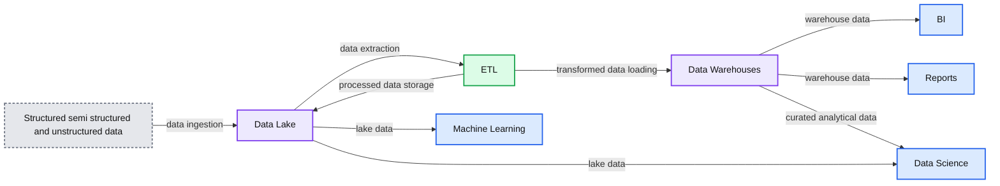
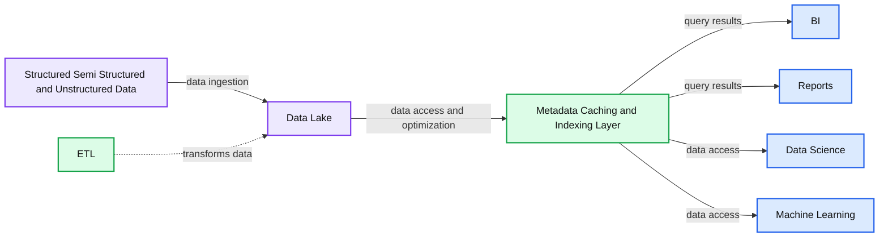

# How Data Lakehouses Solve Common Issues With Data Warehouses

- Source: https://www.databricks.com/blog/2021/02/04/how-data-lakehouses-solve-common-issues-with-data-warehouses.html
- Published: 2021-02-04
- Authors: Ryan Boyd
- Categories: engineering, open-source
- Images: 3 total, 2 extracted as architecture

[Read Rise of the Data Lakehouse](https://www.databricks.com/resources/ebook/rise-data-lakehouse?itm_data=datalakehousessolvedatawarehouseissues-blog-riselakehousebook) to explore why lakehouses are the data architecture of the future with the father of the data warehouse, Bill Inmon.

---

Editor’s note: This is the first in a series of posts largely based on the CIDR paper *[Lakehouse: A New Generation of Open Platforms that Unify Data Warehousing and Advanced Analytics](https://www.databricks.com/research/lakehouse-a-new-generation-of-open-platforms-that-unify-data-warehousing-and-advanced-analytics)*, with permission from the authors.

Data analysts, data scientists, and artificial intelligence experts are often frustrated with the fundamental lack of high-quality, reliable and up-to-date data available for their work. Some of these frustrations are due to known drawbacks of the two-tier data architecture we see prevalent in the vast majority of Fortune 500 companies today. The open lakehouse architecture and underlying technology can dramatically improve the productivity of data teams and thus the efficiency of the businesses employing them.

## Challenges with the two-tier data architecture

In this popular architecture, data from across the organization is extracted from operational databases and loaded into a raw data lake, sometimes referred to as a *data swamp* due to the lack of care for ensuring this data is usable and reliable. Next, another ETL (Extract, Transform, Load) process is executed on a schedule to move important subsets of the data into a data warehouse for business intelligence and decision making.

**Summary:** The diagram shows structured, semi-structured, and unstructured data entering a data lake, with ETL feeding data warehouses and analytics workloads consuming both storage layers.

**Components:**

- Structured, semi-structured and unstructured data - source data types
- Data Lake - raw data storage
- ETL - extract, transform and load processing
- Data Warehouses - curated analytical storage
- BI - business intelligence
- Reports - reporting
- Data Science - analytical modeling
- Machine Learning - machine learning workloads

**Flows:**

- Structured, semi-structured and unstructured data -> Data Lake: data ingestion
- Data Lake -> ETL: data extraction
- ETL -> Data Warehouses: transformed data loading
- ETL -> Data Lake: processed data returned or stored
- Data Warehouses -> BI: warehouse data
- Data Warehouses -> Reports: warehouse data
- Data Warehouses -> Data Science: curated analytical data
- Data Lake -> Data Science: lake data
- Data Lake -> Machine Learning: lake data

**Numbers:** none

source image: https://www.databricks.com/wp-content/uploads/2021/02/two-tier@4x.png

This architecture gives data analysts a nearly impossible choice: use timely and unreliable data from the data lake or use stale and high-quality data from the data warehouse. Due to the closed formats of popular data warehousing solutions, it also makes it very difficult to use the dominant open-source data analysis frameworks on high-quality data sources without introducing another ETL operation and adding additional staleness.

## We can do better: Introducing the Data Lakehouse

These two-tier data architectures, which are common in enterprises today, are highly complex for both the users and the data engineers building them, regardless of whether they’re hosted on-premises or in the cloud.

[Lakehouse architecture](https://www.databricks.com/blog/2020/01/30/what-is-a-data-lakehouse.html) reduces the complexity, cost and operational overhead by providing many of the reliability and performance benefits of the data warehouse tier directly on top of the data lake, ultimately eliminating the warehouse tier.

**Summary:** A data lakehouse architecture places ETL and a metadata, caching, and indexing layer over a data lake to support BI, reports, data science, and machine learning.

**Components:**

- BI: Business intelligence consumer
- Reports: Reporting consumer
- Data Science: Data science consumer
- Machine Learning: Machine learning consumer
- Metadata Caching and Indexing Layer: Lakehouse optimization layer
- ETL: Data transformation process
- Data Lake: Central data storage
- Structured Semi Structured and Unstructured Data: Source data

**Flows:**

- Structured Semi Structured and Unstructured Data -> Data Lake: Data ingestion
- Data Lake -> Metadata Caching and Indexing Layer: Data access and optimization
- Metadata Caching and Indexing Layer -> BI: Query results
- Metadata Caching and Indexing Layer -> Reports: Query results
- Metadata Caching and Indexing Layer -> Data Science: Data access
- Metadata Caching and Indexing Layer -> Machine Learning: Data access

**Numbers:** none

source image: https://www.databricks.com/wp-content/uploads/2021/02/Lakehouse@4x-opt.png

### Data reliability

Data consistency is an incredible challenge when you have multiple copies of data to keep in sync. There are multiple ETL processes -- moving data from operational databases to the data lake and again from the data lake into the data warehouse. Each additional process introduces additional complexity, delays and failure modes.

By eliminating the second tier, the data lakehouse architecture removes one of the ETL processes, while adding support for [schema enforcement and evolution](https://www.databricks.com/blog/2019/09/24/diving-into-delta-lake-schema-enforcement-evolution.html) directly on top of the data lake. It also supports features like [time travel](https://www.databricks.com/discover/diving-into-delta-lake-talks/unpacking-transaction-log) to enable historic validation of data cleanliness.

### Data staleness

Because the data warehouse is populated from the data lake, it is often stale. This forces 86% of analysts to use out-of-date data, according to a recent Fivetran survey.

 While eliminating the data warehouse tier solves this problem, a lakehouse can also support efficient, easy and reliable merging of real-time streaming plus batch processing, to ensure the most up-to-date data is always being used for analysis.

### Limited support for advanced analytics

Advanced analytics, including machine learning and predictive analytics, often requires processing very large datasets. Common tooling, such as TensorFlow, PyTorch and XGBoost, makes it easy to read the raw data lakes in open data formats. However, these tools won’t read most of the proprietary data formats used by the ETL’d data in the data warehouses. Warehouse vendors thus recommend exporting this data to files for processing, resulting in a third ETL step plus increased complexity and staleness.

Alternatively, in the open lakehouse architecture, these common toolsets can operate directly on high-quality, timely data stored in the data lake.

### Total cost of ownership

While storage costs in the cloud are declining, this two-tier architecture for data analytics actually has three online copies of much of the enterprise data: one in the operational databases, one in the data lake, and one in the data warehouse.

The total cost of ownership (TCO) is further compounded when you add the significant engineering costs associated with keeping the data in sync to storage costs.

The data lakehouse architecture eliminates one of the most expensive copies of the data, as well as at least one associated synchronization process.

## What about performance for business intelligence?

Business intelligence and decision support require high-performance execution of exploratory data analysis (EDA) queries, as well as queries powering dashboards, data visualizations and other critical systems. Performance concerns were often the reason companies maintained a data warehouse in addition to a data lake. Technology for optimizing queries on top of data lakes has improved immensely over the past year, making most of these performance concerns moot.

Lakehouses provide support for indexing, locality controls, query optimization and hot data caching to improve performance. This results in data lake SQL performance that exceeds leading cloud data warehouses on TPC-DS, while also providing the flexibility and governance expected of data warehouses.

## Conclusion and next steps

Forward-leaning enterprises and technologists have looked at the two-tier architecture being used today and said: “there has to be a better way.” This better way is what we call the open data lakehouse, which combines the openness and flexibility of the data lake with the reliability, performance, low latency, and high concurrency of traditional data warehouses.

I’ll cover more detail on improvements in data lake performance in an upcoming post of this series.

Of course, you can cheat and skip ahead by [reading the complete CIDR paper](https://www.databricks.com/research/lakehouse-a-new-generation-of-open-platforms-that-unify-data-warehousing-and-advanced-analytics), or [watching a video series diving into the underlying technology supporting the modern lakehouse](https://www.databricks.com/discover/diving-into-delta-lake-talks).
