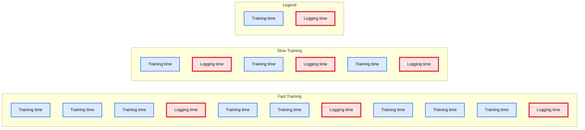

# Accelerating ML Experimentation in MLflow

- Source: https://www.databricks.com/blog/2021/02/10/accelerating-ml-experimentation-in-mlflow.html
- Published: 2021-02-10
- Authors: Andrew Nitu
- Categories: engineering, open-source
- Images: 4 total, 1 extracted as architecture

This fall, I interned with the ML team, which is responsible for building the tools and services that make it easy to do machine learning on Databricks. During my internship, I implemented several ease-of-use features in [MLflow](https://www.mlflow.org/docs/latest/index.html), an open-source machine learning lifecycle management project, and made enhancements to the Reproduce Run capability on the [Databricks ML Platform](https://www.databricks.com/solutions/machine-learning). This blog post walks through some of my most impactful projects and the benefits they offer Databricks customers.

## Autologging improvements

 MLflow autologging automatically tracks machine learning training sessions, recording valuable parameters, metrics, and model artifacts.

[MLflow autologging](https://www.databricks.com/blog/2019/08/19/mlflow-tensorflow-open-source-show.html), which was introduced last year, offers an easy way for data scientists to automatically track relevant metrics and parameters when training machine learning (ML) models by simply adding two lines of code. During the first half of my internship, I made several enhancements to the autologging feature.

### Input examples and model signatures

As a starter project, I worked to implement input example and model signature support for MLflow’s [XGBoost](https://mlflow.org/docs/latest/python_api/mlflow.xgboost.html) and [LightGBM](https://mlflow.org/docs/latest/python_api/mlflow.lightgbm.html) integrations. The input example is a snapshot of model input for inference. The model signature defines the input and output fields and types, providing input schema verification capabilities for batch and real-time model scoring. Together, these attributes enrich autologged models, enabling ML practitioners across an organization to easily interpret and integrate them with production applications.

### Efficiently measuring training progress

Next, I expanded the iteration/epoch logging support in MLflow autologging. When training a model, the model goes through many iterations to improve accuracy. If training takes many hours, it is helpful to track performance metrics, such as accuracy, throughout the training process to ensure that it’s proceeding as expected.

Simultaneously, it is also important to ensure that collecting these performance metrics does not slow down the training process. Since each call to our logging API is a network call, naively logging on each iteration means the network latency can easily add up to a significant chunk of time.

We prototyped several solutions to balance ease-of-use, performance, and code complexity. Initially, we experimented with a multithreaded approach in which training occurs in the main thread and logging is executed in a parallel thread. However, during prototyping, we observed that the performance benefit from this approach was minimal in comparison to the implementation complexity.

We ultimately settled on a time-based approach, executing both the training and logging in the same thread. With this approach, MLflow measures time spent on training and logging, only logging metrics when the time spent on training reaches 10x the time spent on logging. This way, if each iteration takes a long time, MLflow logs metrics for every iteration since the logging time is negligible compared to the training time. In contrast, if each iteration is fast, MLflow stores the iteration results and logs them as one bundle after a few training iterations. In both cases, training progress can be observed in near-real time, with an additional latency overhead of no more than 10%.

**Summary:** The chart compares fast and slow training lifecycles, showing how logging time is grouped differently relative to training time.

**Components:**

- Fast Training - technology not specified
- Slow Training - technology not specified
- Training time - blue duration segments
- Logging time - red duration segments

**Flows:**

- none

**Numbers:** none

source image: https://www.databricks.com/wp-content/uploads/2021/02/blog-accelerating-ml-experimentation-3.png

**Left: **When training iterations are short, we batch metrics together and log them after several iterations have completed. **Right: **When training iterations are longer, we log metrics after each iteration so that progress can be tracked. Both cases avoid imposing significant latency overhead.

### Universal autolog

Finally, I introduced a universal `[mlflow.autolog()](https://mlflow.org/docs/latest/python_api/mlflow.html#mlflow.autolog)` API to further simplify ML instrumentation. This unified API enables autologging for all supported ML library integrations, eliminating the need to add a separate API call for each library used in the training process.

## Software environment reproducibility

The performance and characteristics of an ML model depend heavily on the software environment (specific libraries and versions) where it is trained. To help Databricks users replicate their ML results more effectively, I added library support to the 'Reproduce Run' feature.

Databricks now stores information about the installed libraries when an MLflow Run is created. When a user wants to replicate the environment used to train a model, they can click ‘Reproduce Run’ from the MLflow Run UI to create a new cluster with the same compute resources and libraries as the original training session.
  

  
 Clicking “Reproduce Run” opens a dialog modal, allowing the user to inspect the compute resources and libraries that will be reinstalled to reproduce the run. After clicking “Confirm,” the notebook is seamlessly cloned and attached to a Databricks cluster with the same compute resources and libraries as the one used to train the model.
  

  
 Engineering this feature involved working across the entire stack. The majority of time was spent on backend work, where I had to coordinate communication between several microservices to create the new cluster and reinstall the libraries on it. It was also interesting to learn about React and Redux when implementing the UI based on the design team’s mockups.

## Conclusion

These sixteen weeks at Databricks have been an amazing experience. What really stood out to me was that I truly owned each of my features. I brought each feature through the entire product cycle, including determining user requirements, implementing an initial prototype, writing a design document, conducting a design review, and applying all this feedback to the prototype to implement, test, and ship the final polished feature. Furthermore, everyone at Databricks was awesome to work with and happy to help out, whether with career advice or with feedback about the features I was working on. Special thanks to my mentor Corey Zumar and manager Paul Ogilvie for answering my endless questions, and thanks to everyone at Databricks for making the final internship of my undergrad the best yet!

Visit the [Databricks Career page](https://www.databricks.com/company/careers) to learn more about upcoming internships and other career opportunities across the company.
