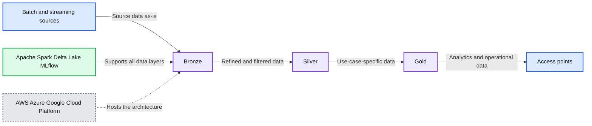

# Solution Accelerator: Telco Customer Churn Predictor

- Source: https://www.databricks.com/blog/2021/02/24/solution-accelerator-telco-customer-churn-predictor.html
- Published: 2021-02-24
- Authors: Dan Morris, Hector Leano, Steve Sobel
- Categories: engineering, solution-accelerators
- Images: 2 total, 2 extracted as architecture

Check out the [solution accelerator](https://www.databricks.com/solutions/accelerators/survival-analysis-for-churn-and-lifetime-value) to download the notebooks referred throughout this blog. 

When T-Mobile embraced the un-carrier label, they didn’t just kick off a marketing campaign; they fundamentally changed the dynamics in the US market for telecom. Previously, telecom had been a staid, utility-like industry with steady growth and subscribers locked into two-year contracts to cover a “free” handset with a phone plan. But three factors changed the nature of the business:

1. Starting in 2004, users could change phone carriers but keep their phone number, eliminating one of the largest barriers to switching providers.
2. Escalating handset prices led carriers to discontinue handset subsidies, resulting in the elimination of phone plan contracts.
3. T-Mobile gained market share with aggressive data plan pricing combined with increased advertising spend, bringing a strong third competitor to what had previously been a duopoly.

These rapidly changing dynamics have moved telco providers from being a utility to being a value-added services provider across multiple lines of business including broadband, security, cable, and streaming video services. This, along with increased competition from new entrants -- has accelerated communications service providers’ investment in personalized, frictionless customer experiences across all channels, at all times. Core to building these experiences is understanding where existing customers are in the subscription life cycle, and in particular identifying those most at risk for churn. Reducing churn continues to be one of the most strategic areas of focus for every provider and the goal of many churn rate initiatives is to predict customer life cycle events and find ways to extend the life cycle profitably.

## Introducing the Telco Customer Churn Predictor Solution Accelerator from Databricks

Based on best practices from our work with the leading communication service providers, we’ve developed solution accelerators for common analytics and machine learning use cases to save weeks or months of development time for your data engineers and data scientists.

This solution accelerator complements our work doing [customer lifetime value](https://www.databricks.com/blog/2020/06/03/customer-lifetime-value-part-1-estimating-customer-lifetimes.html), [attrition for subscription services](https://www.databricks.com/blog/2020/07/15/analyzing-customer-attrition-in-subscription-models.html), and [profitable customer retention](https://www.databricks.com/blog/2020/08/24/profit-driven-retention-management-with-machine-learning.html), but with a telco-specific lens.

Using sample telco datasets from [IBM](https://github.com/IBM/telco-customer-churn-on-icp4d/blob/master/data/Telco-Customer-Churn.csv), and the [Lifelines](https://lifelines.readthedocs.io/en/latest/#) library, this solution accelerator will:

- Introduce survival analysis, a collection of statistical methods used to examine and predict the time until an event of interest occurs.
- Review three methods that are commonly used for survival analysis: Kaplan-Meier, Cox Proportional Hazards, Accelerated Failure Time.
- Build a churn prediction model and use the model output as an input for calculating lifetime value.
- Build an interactive dashboard for calculating the net present value of a given cohort of subscribers over a three-year time horizon.

The contents of this solution accelerator are contained in Databricks notebooks that are linked to at the end of this post.

## About survival analysis

Survival analysis is a collection of statistical methods used to examine and predict the time until an event of interest occurs. This form of analysis originated in healthcare, with a focus on time to death. Since then, survival analysis has been successfully applied to use cases in virtually every industry around the globe.

In Telco specifically, use cases include:

- **Customer retention:** It is widely accepted that the cost of retention is lower than the cost of acquisition. With the event of interest being a service cancellation, Telco companies can more effectively manage customer retention efforts by using survival analysis to better predict at what point in time-specific customers are likely to be at risk of churning.
- **Hardware failures:** The quality of experience a customer has with your products and services plays a key role in the decision to renew or cancel. The network itself is at the epicenter of this experience. With time to failure as the event of interest, survival analysis can be used to predict when hardware will need to be repaired or replaced.
- **Device and data plan upgrades:** There are key moments in a customer's lifecycle when changes to their plan take place. With the event of interest being a plan change, survival analysis can be used to predict when such change will take place and then actions can be taken to positively influence the selected products or services.

In contrast to other methods that may seem similar on the surface, such as linear regression, survival analysis takes censoring into account. [Censoring](https://en.wikipedia.org/wiki/Censoring_(statistics)) occurs when the start and/or end of a measured value is unknown. For example, suppose our historical data includes records for the two customers below. In the case of customer A, we know the precise duration of the subscription because the customer churned in December 2020. For customer B, we know that the contract started four months ago and is still active, but we do not know how much longer they will be a customer. This is an example of right censoring because we do not yet know the end date for the measured value. Right censoring is what we most commonly see with this form of analysis.

| Customer | Subscription Start Date | Subscription End Date | Subscription Duration | Active Subscription Flag |
|---|---|---|---|---|
| A | Feb 3, 2020 | Dec 2, 2020 | 10 months | 0 |
| B | Nov 11, 2020 | - | 4 months | 1 |

*Figure 1: Survival Probability Curve*

**Summary:** The diagram shows a customer survival probability curve declining over time.

**Components:**

- Survival probability curve

**Flows:**

- none

**Numbers:** none

source image: https://www.databricks.com/wp-content/uploads/2021/02/telco-accel-blog-1.png

Figure 1: Survival Probability Curve

As illustrated above, we could move forward with a duration of four months for customer B, but this would lead to underestimating survival time. This problem is alleviated when using survival analysis since censoring is taken into account.

## Using survival analysis in production

After accounting for censoring, the key output of a survival analysis machine learning model is a survival probability curve. As shown below, a survival probability curve plots time on the x-axis and survival probability on the y-axis. Starting at 0 months, this chart can be interpreted as saying: the probability of a customer staying at least 0 months is 100%. This is represented by the point (0, 1.0). Likewise, moving down the survival curve to the median (34 months), showing that a customer has a 50% probability of surviving at least 34 months, given that they have survived 33 months. Note that this last clause, “given that…”, signifies that this is a conditional probability.

Visualizing survival probability curves is particularly helpful when building a model and/or analyzing a model for inference. In many cases, however, the end goal is to use the output of a survival analysis model as an input for another model. For example, in this solution accelerator, we use the output of a survival analysis model as an input for calculating customer lifetime value. We then build an application that provides visibility into the net present value for a given cohort of users throughout a three-year time horizon. This is powerful because it enables marketers to understand what the payback period will be for various new customer acquisition campaigns. Similarly, one could use the output of the survival analysis model we build in this solution accelerator to align marketing messages to where consumers are in their customer journey.

In practice, the reference architecture that enables these types of use cases in production resembles the following:

**Summary:** The diagram shows a cloud-based Databricks architecture supporting batch and streaming data across bronze, silver, and gold layers for multiple access points.

**Components:**

- Batch and streaming sources: customer account data, call detail records, customer support logs, network logs, plan and device metadata, marketing logs, video, images, and audio
- Bronze layer: source data as-is
- Silver layer: refined and filtered data
- Gold layer: use-case-specific data
- Processing and data technologies: Apache Spark, Delta Lake, and MLflow
- Access points: business intelligence tools, data management platforms, messaging platforms, and customer support tools
- Cloud platforms: AWS, Azure, and Google Cloud Platform

**Flows:**

- Batch and streaming sources -> Bronze: source data as-is
- Bronze -> Silver: refined and filtered data
- Silver -> Gold: use-case-specific data
- Gold -> Access points: data for business intelligence, data management, messaging, and customer support

**Numbers:** none

source image: https://www.databricks.com/wp-content/uploads/2021/02/telco-accel-blog-2-new.png

## Getting started

The goal of this solution accelerator is to help you leverage survival analysis for your own customer retention use case as quickly as possible. As such, this solution accelerator contains an in-depth review of commonly used methods: Kaplan-Meier, Cox Proportional Hazards, and Accelerated Failure Time. Get started today by importing this [solution accelerator](https://www.databricks.com/solutions/accelerators/survival-analysis-for-churn-and-lifetime-value) directly into your Databricks workspace. You can also view our on-demand webinar on [Survival Analysis in Telecommunications](https://www.databricks.com/p/webinar/reinventing-the-telco-consumer-experience-with-data-ai-virtual-workshop).
