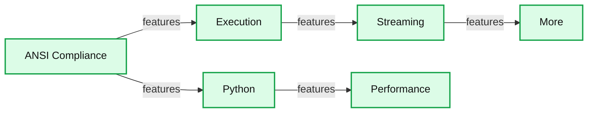

# Introducing Apache Spark™ 3.1

- Source: https://www.databricks.com/blog/2021/03/02/introducing-apache-spark-3-1.html
- Published: 2021-03-02
- Authors: Hyukjin Kwon, Wenchen Fan, Xiao Li, Reynold Xin
- Categories: engineering, open-source
- Images: 2 total, 1 extracted as architecture

*Free Edition has replaced Community Edition, offering enhanced features at no cost. Start using *[*Free Edition *](https://login.databricks.com/?intent=SIGN_UP&amp;signup_experience_step=EXPRESS&amp;provider=DB_FREE_TIER&amp;dbx_source=www)*today.*
 

We are excited to announce the availability of [Apache Spark 3.1](https://spark.apache.org/releases/spark-release-3-1-1.html) on Databricks as part of [Databricks Runtime 8.0](https://docs.databricks.com/release-notes/runtime/8.0.html). We want to thank the Apache Spark™ community for all their valuable contributions to the Spark 3.1 release.

Continuing with the objectives to make Spark faster, easier and smarter, Spark 3.1 extends its scope with the following features:

- Python usability
- ANSI SQL compliance
- Query optimization enhancements
- Shuffle hash join improvements
- History Server support of structured streaming

In this blog post, we summarize some of the higher-level features and improvements. Keep an eye out for upcoming posts that dive deeper into these features. For a comprehensive list of major features across all Spark components and JIRAs resolved, please see the Apache Spark 3.1.1 [release notes](https://spark.apache.org/releases/spark-release-3-1-1.html).

## Project Zen

[Project Zen](https://issues.apache.org/jira/browse/SPARK-32082) was initiated in this release to improve PySpark’s usability in these three ways:

- Being Pythonic
- Better and easier usability in PySpark
- Better interoperability with other Python libraries

As part of this project, this release includes many improvements in PySpark – from leveraging Python type hints to newly redesigned PySpark documentation, [as shown in this blog post](https://www.databricks.com/blog/2020/09/04/an-update-on-project-zen-improving-apache-spark-for-python-users.html).

- **Python typing support** in PySpark was initiated as a third party library, [pyspark-stubs](https://pypi.org/project/pyspark-stubs/), and has become a mature and stable library. In this release, PySpark officially includes the Python type hints with many benefits ([SPARK-32681](https://issues.apache.org/jira/browse/SPARK-32681)). The Python type hints can be most useful in IDEs and notebooks by enabling users and developers to leverage seamless autocompletion, including the recently added [autocompletion support in Databricks notebooks](https://www.databricks.com/blog/2020/12/15/python-autocomplete-improvements-for-databricks-notebooks.html).  In addition, IDE developers can increase their productivity by static type and error detections from the Python type hints.

- **Dependency management support** in PySpark is completed and documented to guide PySpark users and developers ([SPARK-33824](https://issues.apache.org/jira/browse/SPARK-33824)). Previously, PySpark had incomplete support of dependency management that only worked in YARN and was undocumented. In this release, package management systems such as Conda, virtualenv and PEX, can work in any type of cluster by leveraging the *--archive* option ([SPARK-33530](https://issues.apache.org/jira/browse/SPARK-33530), [SPARK-33615](https://issues.apache.org/jira/browse/SPARK-33615)). [This blog post on Python dependency management in PySpark](https://www.databricks.com/blog/2020/12/22/how-to-manage-python-dependencies-in-pyspark.html) has been contributed back to the PySpark documentation and is cross-posted.
- **New installation options for PyPI users** were introduced ([SPARK-32017](https://issues.apache.org/jira/browse/SPARK-32017)). pip is one of the most common ways to install PySpark. However, the previous release only allowed Hadoop 2 in PyPI but allows other options, such as Hadoop 2 and 3, in other release channels of Apache Spark. In this release, as part of Project Zen, all the options  are also available to PyPI users. This enables them to install from PyPI and run their application in any type of their existing Spark clusters.
- **New documentation for PySpark** is introduced in this release ([SPARK-31851](https://issues.apache.org/jira/browse/SPARK-31851)). PySpark documentation was difficult to navigate and only included API references. The documentation is completely redesigned in this release with fine-grained classifications and easy-to-navigate hierarchies ([SPARK-32188](https://issues.apache.org/jira/browse/SPARK-32188)). The docstrings have a better human readable text format with numpydoc style ([SPARK-32085](https://issues.apache.org/jira/browse/SPARK-32085)), and there are many useful pages such as how to debug ([SPARK-32186](https://issues.apache.org/jira/browse/SPARK-32186)), how to contribute and test ([SPARK-32190](https://issues.apache.org/jira/browse/SPARK-32190), [SPARK-31851](https://issues.apache.org/jira/browse/SPARK-31851)), and quickstart with a live notebook ([SPARK-32182](https://issues.apache.org/jira/browse/SPARK-32182)).

## ANSI SQL compliance

This release adds additional improvements for ANSI SQL compliance, which aids in simplifying the workload migration from traditional data warehouse systems to Spark.

- The ANSI dialect mode has been introduced and enhanced since the release of Spark 3.0. The behaviors in the ANSI mode align with ANSI SQL’s style if they are not strictly from the ANSI SQL. In this release when the input is invalid ([SPARK-33275)](https://issues.apache.org/jira/browse/SPARK-33275) more operators/functions throw **runtime errors **instead of returning NULL. Stricter checks for **explicit type casting **[[SQL reference](https://spark.apache.org/docs/latest/sql-ref-ansi-compliance.html#type-conversion) doc]  are also part of this release. When queries contain illegal type casting (e.g., date/timestamp types are cast to numeric types) compile-time errors are thrown informing the user of invalid conversions. ANSI dialect mode is still under active development thus it is disabled by default, but can be enabled by setting *spark.sql.ansi.enabled* to true. We expect it will be stable in the upcoming releases.
- Various new SQL features are added in this release. The widely used standard **CHAR/VARCHAR** data types are added as variants of the supported String types. More built-in functions (e.g., width_bucket ([SPARK-21117](https://issues.apache.org/jira/browse/SPARK-21117)) and regexp_extract_all ([SPARK-24884](https://issues.apache.org/jira/browse/SPARK-24884)) were added. The current number of built-in operators/functions has now reached **350**. More DDL/DML/utility commands have been enhanced, including **INSERT** ([SPARK-32976](https://issues.apache.org/jira/browse/SPARK-32976)), **MERGE** ([SPARK-32030](https://issues.apache.org/jira/browse/SPARK-32030)) and **EXPLAIN** ([SPARK-32337](https://issues.apache.org/jira/browse/SPARK-32337)). Starting from this release, in Spark WebUI, the **SQL plans** are presented in a simpler and structured format (i.e. using EXPLAIN FORMATTED)
- Unifying the [**CREATE TABLE **SQL syntax](https://spark.apache.org/docs/latest/sql-ref-syntax-ddl-create-table.html) has been completed in this release. Spark maintains two sets of CREATE TABLE syntax. When the statement contains neither USING nor STORED AS clauses, Spark used the default Hive file format. When *spark.sql.legacy.createHiveTableByDefault* is set to false (the default is **true** in Spark 3.1 release, but **false** in Databricks Runtime 8.0 release), the default table format depends on *spark.sql.sources.default* (the default is **parquet** in Spark 3.1 release, but **delta** in Databricks Runtime 8.0 release). This means starting in Databricks Runtime 8.0 Delta Lake tables are now the default format which will deliver better performance and reliability. Below is an example to demonstrate the behavior changes in CREATE TABLE SQL syntax when users do not explicitly specify either USING or STORED AS clause.

Below is the change summary of the table formats of table1 and table2

|  | Spark 3.0 (DBR 7) or before | Spark 3.1 * | DBR 8.0 |
|---|---|---|---|
| Default Format | Hive Text Serde | Parquet | Delta |

Note, `spark.sql.legacy.createHiveTableByDefault` needs to be manually set to `false` in Apache Spark; otherwise, it will still be Hive Text Serde.

## Performance

Catalyst is the query compiler that optimizes most Spark applications. In Databricks, **billions of queries per day** are optimized and executed. This release enhances the query optimization and accelerates query processing.

- **Predicate pushdown** is one of the most effective performance features because it can significantly reduce the amount of data scanned and processed. Various enhancements are completed in Spark 3.1:
  - By rewriting the Filter predicates and Join condition in conjunctive normal forms, more predicates are eligible to be pushed down to the metastore and data sources.
  - To reduce partition scanning, the partition predicate pushdown of Hive metastore is further improved by supporting the data type DATE, and more operators including contains, starts-with, ends-with, and not-equals.
  - To enable more predicate pushdown, we added a new optimizer rule to unwrap casts in binary comparison operations for numeric data types ([SPARK-32858](https://issues.apache.org/jira/browse/SPARK-32858) and [SPARK-24994](https://issues.apache.org/jira/browse/SPARK-24994)).
  - The JSON and Avro data sources ([SPARK-32346](https://issues.apache.org/jira/browse/SPARK-32346)) support the predicate pushdown and the ORC data source supports predicate pushdown for nested fields.
  - Filters can also be pushed through the operator EXPAND  ([SPARK-33302](https://issues.apache.org/jira/browse/SPARK-33302)).
- **Shuffle removal**, **subexpression elimination** and **nested field pruning** are the other three major optimization features. As one of the most expensive operators, Shuffle can be avoided in some cases ([SPARK-31869](https://issues.apache.org/jira/browse/SPARK-31869)), [SPARK-32282](https://issues.apache.org/jira/browse/SPARK-32282), [SPARK-33399](https://issues.apache.org/jira/browse/SPARK-33399)), although adaptive query planning might be inapplicable after shuffle removal. Also, duplicate or unnecessary expression evaluation can be removed ([SPARK-33092](https://issues.apache.org/jira/browse/SPARK-33092), [SPARK-33337](https://issues.apache.org/jira/browse/SPARK-33337), [SPARK-33427](https://issues.apache.org/jira/browse/SPARK-33427), [SPARK-33540](https://issues.apache.org/jira/browse/SPARK-33540)) to  reduce computation. Column pruning can be applied for nested fields in various operators ([SPARK-29721](https://issues.apache.org/jira/browse/SPARK-29721), [SPARK-27217](https://issues.apache.org/jira/browse/SPARK-27217), [SPARK-31736](https://issues.apache.org/jira/browse/SPARK-31736), [SPARK-32163](https://issues.apache.org/jira/browse/SPARK-32163), [SPARK-32059](https://issues.apache.org/jira/browse/SPARK-32059)) to reduce I/O resource usage and facilitate the subsequent optimization.
- **Shuffle-Hash Join** (SHJ) supports all the join types ([SPARK-32399](https://issues.apache.org/jira/browse/SPARK-32399)) with the corresponding codegen execution ([SPARK-32421](https://issues.apache.org/jira/browse/SPARK-32421)) starting from this release. Unlike Shuffle-Sort-Merge Join (SMJ), SHJ does not require sorting and thus is more CPU and IO efficient than SMJ, when joining a large table and a small table that is too large to be broadcasted. Note, SHJ could cause OOM when the build side is big, because building a hashmap is memory-intensive.

## Streaming

Spark is the best platform for building distributed stream processing applications. More than **10 trillion records per day** are processed on Databricks with structured streaming. This release enhances its monitoring, usability and functionality.

- For better debugging and monitoring structured streaming applications, the **History Server support** is added ([SPARK-31953](https://issues.apache.org/jira/browse/SPARK-31953)) and the Live UI support is further enhanced by adding more metrics for state ([SPARK-33223](https://issues.apache.org/jira/browse/SPARK-33223)), watermark gap ([SPARK-33224](https://issues.apache.org/jira/browse/SPARK-33224)) and more state custom metrics ([SPARK-33287](https://issues.apache.org/jira/browse/SPARK-33287)).

- **New Streaming table APIs **are added for reading and writing streaming DataFrame to a table, like the table APIs in DataFrameReader and DataFrameWriter, as shown in [this example notebook](https://www.databricks.com/notebooks/structured-streaming-table-api-demo.html). In Databricks Runtime, Delta table format is recommended for exactly-once semantics and better performance.
- **Stream-stream Join** adds two new join type supports, including full outer ([SPARK-32862](https://issues.apache.org/jira/browse/SPARK-32862)) and left semi ([SPARK-32863](https://issues.apache.org/jira/browse/SPARK-32863)) in this release. Prior to Apache Spark 3.1, inner, left outer and right outer stream-stream joins have been supported, as presented in [the original blog post of stream-stream joins](https://www.databricks.com/blog/2018/03/13/introducing-stream-stream-joins-in-apache-spark-2-3.html).

## Other updates in Spark 3.1

In addition to these new features, the release focuses on usability, stability, and refinement, resolving around 1,500 tickets. It’s the result of contributions from over 200 contributors, including individuals as well as companies like Databricks, Google, Apple, Linkedin, Microsoft, Intel, IBM, Alibaba, Facebook, Nvidia, Netflix, Adobe and many more. We’ve highlighted a number of the key SQL, Python and streaming advancements in Spark for this blog post, but there are many other capabilities in this 3.1 milestone not covered here. Learn more in the [release notes](https://spark.apache.org/releases/spark-release-3-1-1.html) and discover all the other improvements to Spark, including Spark on Kubernetes GAed,  node decommissioning, state schema validation, the search function in Spark documentations and more.

Other salient features from Spark contributors include:

**Summary:** Apache Spark 3.1 capabilities are organized across ANSI compliance, execution, Python, streaming, performance, and additional features.

**Components:**

- ANSI Compliance: Runtime Error, Create Table Syntax, Explicit Cast
- Execution: Char/Varchar, Shuffle Hash Join, Node Decommissioning, Partition Pruning, Stage-level Scheduling
- Python: Installation Option for PyPI, New Doc for PySpark, Python Type Support, Dependency Management
- Streaming: History Server Support for SS, Streaming Table APIs, Stream-stream Join, State Schema Validation
- Performance: Shuffle Removal, Nested Field Pruning, Sub-expression Elimination, Predicate Pushdown
- More: Search Function in Spark Doc, Spark on K8S GA, Catalog APIs for JDBC, Ignore Hints

**Flows:**

- none

**Numbers:** none

source image: https://www.databricks.com/wp-content/uploads/2021/02/apache-spark-blog-image-1.jpg

## Get started with Spark 3.1 today

|  |  |
|---|---|

If you want to try out Apache Spark 3.1 in the Databricks Runtime 8.0, sign up for [Databricks Community Edition or Databricks Trial for free](https://www.databricks.com/try-databricks) and get started in minutes. Using Spark 3.1 is as simple as selecting version “8.0” when launching a cluster.
