# Analyzing Algorand Blockchain Data With Databricks Delta (Part 2)

- Source: https://www.databricks.com/blog/2021/03/03/analyzing-algorand-blockchain-data-with-databricks-delta-part-2.html
- Published: 2021-03-03
- Authors: Anindita Mahapatra, Eric Gieseke
- Categories: platform, engineering, open-source, data-engineering
- Images: 18 total, 13 extracted as architecture

[Get an early preview of O'Reilly's new ebook](https://www.databricks.com/resources/ebook/delta-lake-running-oreilly?itm_data=algorandblockchaindeltapart2-blog-oreillydlupandrunning) for the step-by-step guidance you need to start using Delta Lake.

---

This post was written in collaboration betweeen Eric Gieseke, principal software engineer at Algorand, and Anindita Mahapatra, solutions architect, Databricks.

[Algorand](https://www.algorand.com/) is a public, decentralized blockchain system that uses a proof of stake consensus protocol. It is fast and energy efficient, with a transaction commit time under five seconds and a throughput of one thousand transactions per second. Blockchain is a disruptive technology that will transform many industries including Fintech. Algorand, being a public blockchain, generates large amounts of transaction data and this provides interesting opportunities for data analysis.

[Databricks](https://www.databricks.com/) provides a Unified Data Analytics Platform for massive-scale data engineering and collaborative data science on multi-cloud infrastructure. This blog post will demonstrate how [Delta Lake](https://www.databricks.com/product/delta-lake-on-databricks) facilitates real-time data ingestion, transformation, and [SQL Analytics](https://www.databricks.com/product/databricks-sql) visualization of the blockchain data to provide valuable business insights. SQL is a natural choice for business analysts who benefit from SQL Analytics’ out-of-box visualization capabilities. Graphs are also a powerful visualization tool for blockchain transaction data. This article will show how Apache Spark™ [GraphFrame](https://docs.databricks.com/spark/latest/graph-analysis/graphframes/index.html)and graph visualization libraries can help analysts identify significant patterns.

This article is the second part of a two part blog. In [part one](https://www.databricks.com/blog/2020/10/08/analyzing-algorand-blockchain-data-with-databricks-delta.html), we demonstrated the analysis of **operational** telemetry data. In part two, we will show how to use Databricks to analyze the **transactional** aspects of the Algorand blockchain. A robust ecosystem of accounts, transactions and digital assets is essential for the health of the blockchain. Assets are digital tokens that represent reward tokens, cryptocurrencies, supply chain assets, etc. The Algo digital currency price reflects the intrinsic value of the underlying blockchain. Healthy transaction volume indicates user engagement.

Data processing includes ingestion, transformation and visualization of Algorand transaction data. The insights derived from the resulting analysis will help in determining the health of the ecosystem. For example:

- Which assets are driving transaction volume? What is the daily trend of transaction volume? How does it vary over time? Are there certain times of the day that transaction volumes peak?
- Which applications or business models are driving growth in the number of accounts or transactions?
- What are the distribution of asset types and transaction types? Which assets are most widely used, and which assets are trending up or down?
- What is the latest block? How long did it take to create, and what are the transactions that it contains?
- Which are the most active accounts, and how does their activity vary over time?
- What is the relationship between accounts? Is it possible to detect illicit activity?
- How does the Algo price vary with the transaction volume over time?  Can fluctuations in price or volume be predicted?

**Algorand network **
 The Algorand Blockchain network is composed of nodes and relays hosted on servers connected via the internet. The nodes provide the compute and storage needed to host the immutable blocks. The blocks hold the individual transactions committed on the blockchain, and each block links to the preceding block in the chain.

**Summary:** The diagram shows Algorand blockchain blocks linked backward through hashes of their preceding blocks.

**Components:**

- Block 1: Algorand blockchain block containing round data, timestamp, account balances, transactions, and the previous block hash
- Block 2: Algorand blockchain block containing round data, timestamp, account balances, transactions, and the previous block hash
- Omitted blocks: Intermediate Algorand blockchain blocks
- Block N: Algorand blockchain block containing round data, timestamp, account balances, transactions, and the previous block hash

**Flows:**

- Block 2 -> Block 1: Hash reference to the previous block
- Block N -> Omitted blocks: Hash reference to the previous block
- Omitted blocks -> Block 2: Hash-linked continuation

**Numbers:** 1, 2, N, Round 1, Round 2, Round N, tx1, tx2, txn, tx X, tx Y

```mermaid
%% Shows Algorand blockchain blocks linked to their preceding blocks
flowchart LR
    B1["Block 1<br/>Round 1, timestamp, account balances<br/>Hash of previous block<br/>tx1, tx2, txn"]
    B2["Block 2<br/>Round 2, timestamp, account balances<br/>Hash of previous block<br/>tx1, tx2, tx X"]
    OM["Omitted blocks"]
    BN["Block N<br/>Round N, timestamp, account balances<br/>Hash of previous block<br/>tx1, tx2, tx Y"]

    B2 -->|Hash of previous block| B1
    BN -->|Hash of previous block| OM
    OM -->|Hash-linked continuation| B2

    classDef client fill:#dbeafe,stroke:#2563eb,stroke-width:2px,color:#111
    classDef service fill:#dcfce7,stroke:#16a34a,stroke-width:2px,color:#111
    classDef store fill:#ede9fe,stroke:#7c3aed,stroke-width:2px,color:#111
    classDef cache fill:#fef3c7,stroke:#d97706,stroke-width:2px,color:#111
    classDef queue fill:#cffafe,stroke:#0891b2,stroke-width:2px,color:#111
    classDef critical fill:#fee2e2,stroke:#dc2626,stroke-width:4px,color:#111
    classDef external fill:#e5e7eb,stroke:#6b7280,stroke-width:2px,color:#111,stroke-dasharray:4 3
    classDef decision fill:#fce7f3,stroke:#db2777,stroke-width:2px,color:#111
    class B1,B2,OM,BN store
```

<sub>source image: https://www.databricks.com/wp-content/uploads/2021/02/Algorand-Blockchain-network-blog-image-1.jpg</sub>

 Figure 1: Each block is connected to the prior block to form the blockchain

**Algorand data**

| **Data Type** | **What** | **Why** | **Where** |
|---|---|---|---|
| Node Telemetry (JSON data from ElasticSearch API) | Peer connection data that describes the network topology of nodes and relays | It gives a real-time view of where the nodes & relays are and how they are connected and are communicating, and the network load. | The nodes periodically transmit this information to a configured ElasticSearch endpoint. |
| Block, Transaction, Account Data (JSON/CSV data from S3) | Transaction data committed into blocks chained sequentially and individual account balances | This data gives visibility into usage of the blockchain network and people (accounts) transacting. Each account is an established identity, and each tx/block has a unique identifier. | The Algorand blockchain generates block, account, and transaction data. The Algorand Indexer aggregates the data, which is accessible via a REST API. |

## Block, transaction and account data

The Algorand blockchain uses an efficient and high-performance consensus protocol based on proof of stake, which enables a throughput of 1,000 transactions per second.

**Summary:** Entity relationship diagram showing how Algorand blocks, transactions, and accounts relate.

**Components:**

- Block - Algorand blockchain block
- Transaction - Algorand blockchain transaction
- Account - Algorand blockchain account

**Flows:**

- Block -> Transaction: contains one or more transactions
- Block -> Account: associated with one or more accounts
- Account -> Transaction: participates in one or more transactions

**Numbers:** 1, *, 1/n

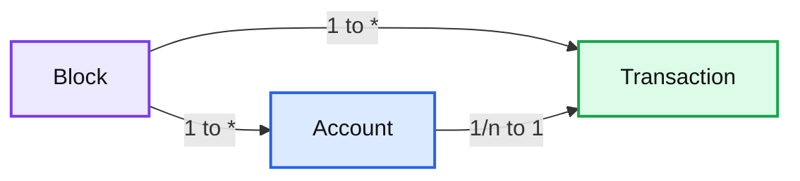

<sub>source image: https://www.databricks.com/wp-content/uploads/2021/02/Algorand-blockchain-blog-image-2.jpg</sub>

|  | **Transactions** transfer value between **Accounts.** **Blocks** aggregate **Transactions **that are committed to the blockchain. A new **Block** is created in less than 5 seconds and is linked to the previous **Block** to form the blockchain. |
|---|---|

**Summary:** Entity relationship diagram showing Blocks, Transactions, and Accounts with their cardinality relationships.

**Components:**

- Block - technology not specified
- Transaction - technology not specified
- Account - technology not specified

**Flows:**

- Block -> Transaction: one Block contains many Transactions
- Block -> Account: one Block relates to many Accounts
- Account -> Transaction: one or many Accounts relate to one Transaction

**Numbers:** 1, *, 1, *, 1/n, 1

```mermaid
%% Shows relationships among blocks transactions and accounts
flowchart LR
    B[Block] -->|1 to many| T[Transaction]
    B -->|1 to many| A[Account]
    A -->|1 or many to 1| T

    subgraph Legend
        L1[client clients edge gateway LB]
        L2[service stateless compute]
        L3[store databases durable storage]
        L4[cache Redis CDN losable]
        L5[queue Kafka streams async pipes]
        L6[critical bottleneck or SPOF]
        L7[external third party]
        L8[decision trade off point]
    end

    classDef client fill:#dbeafe,stroke:#2563eb,stroke-width:2px,color:#111
    classDef service fill:#dcfce7,stroke:#16a34a,stroke-width:2px,color:#111
    classDef store fill:#ede9fe,stroke:#7c3aed,stroke-width:2px,color:#111
    classDef cache fill:#fef3c7,stroke:#d97706,stroke-width:2px,color:#111
    classDef queue fill:#cffafe,stroke:#0891b2,stroke-width:2px,color:#111
    classDef critical fill:#fee2e2,stroke:#dc2626,stroke-width:4px,color:#111
    classDef external fill:#e5e7eb,stroke:#6b7280,stroke-width:2px,color:#111,stroke-dasharray:4 3
    classDef decision fill:#fce7f3,stroke:#db2777,stroke-width:2px,color:#111
    class B,A client
    class T service
    class L1 client
    class L2 service
    class L3 store
    class L4 cache
    class L5 queue
    class L6 critical
    class L7 external
    class L8 decision
```

<sub>source image: https://www.databricks.com/wp-content/uploads/2021/02/Algorand-blockchain-blog-image-2.jpg</sub>

 Figure 2: Entity Relation

## Analytics workflow

The following diagram describes the data flow. Originating from the Algorand Nodes, blocks are aggregated by the Algorand Indexer into a Postgres database. A Databricks job uses the Algorand Python SDK to retrieve blocks from the Indexer as JSON documents and stores them in an S3 bucket. Using the Databricks Autoloader, the JSON documents are auto-ingested from S3 into Delta Tables as they arrive. Additional processing converts the block records to transaction records in a silver table. Then, from the transaction records, aggregates are produced in the gold table. Both the silver and gold tables support visualization and analytics.

**Summary:** The diagram shows an Algorand blockchain analytics pipeline that ingests block data into S3 and processes it through Delta Lake bronze, silver, and gold tables for graph and SQL analytics.

**Components:**

- Algorand blockchain network
- Algorand Indexer V2 for mainnet block data
- py-algorand-sdk for blockchain data access
- CryptoCompare for asset price and volume data
- S3 cloud-native storage
- Databricks Autoloader for automatic ingestion
- Delta Lake raw block table in bronze stream
- Delta Lake refined and enriched transaction tables in silver stream
- Delta Lake aggregated transaction tables in gold stream
- Reference table for asset metadata, Algo price, and node telemetry data
- Graph Analytics using GraphFrames APIs and PyVis libraries
- SQL Analytics for dashboards, auto-refresh, and alerts
- Data quality controls across the Delta Lake pipeline

**Flows:**

- Algorand blockchain network -> Algorand Indexer V2: mainnet block data
- Algorand Indexer V2 -> py-algorand-sdk: block data retrieval
- CryptoCompare -> py-algorand-sdk: asset price and volume data
- py-algorand-sdk -> S3: stream of block data files
- S3 -> Databricks Autoloader: arriving JSON data files
- Databricks Autoloader -> Raw Block Table: automatic ingestion
- Raw Block Table -> Refined Enriched Transaction Tables: enrichments and transaction conversion
- Reference Table -> Refined Enriched Transaction Tables: joins
- Refined Enriched Transaction Tables -> Aggregated Transaction Tables: aggregations
- Aggregated Transaction Tables -> Graph Analytics: graph analysis data
- Aggregated Transaction Tables -> SQL Analytics: dashboard and alert data
- Raw Block Table -> Data Quality: quality checks
- Refined Enriched Transaction Tables -> Data Quality: quality checks
- Aggregated Transaction Tables -> Data Quality: quality checks

**Numbers:** V2, S3

```text
%% mermaid failed to render; kept as text
%% Algorand blockchain data ingestion and Delta Lake analytics workflow
flowchart LR
    blockchain[Algorand blockchain]
    indexer[Algorand Indexer V2]
    sdk[py algorand sdk]
    crypto[CryptoCompare]
    s3[S3 cloud native storage]
    autoloader[Databricks Autoloader]
    bronze[Raw Block Table bronze stream]
    silver[Refined Enriched Tables silver stream]
    reference[Reference Table]
    gold[Aggregated Tx Tables gold stream]
    graph[Graph Analytics]
    sql[SQL Analytics]
    quality[Data Quality]

    blockchain -->|mainnet block data| indexer
    indexer -->|block data retrieval| sdk
    crypto -->|asset price volume data| sdk
    sdk -->|stream of block data files| s3
    s3 -->|arriving data files| autoloader
    autoloader -->|auto ingest| bronze
    bronze -->|enrichments| silver
    reference -->|joins| silver
    silver -->|aggregations| gold
    gold -->|graph analysis data| graph
    gold -->|dashboard and alert data| sql
    bronze -->|quality checks| quality
    silver -->|quality checks| quality
    gold -->|quality checks| quality

    classDef client fill:#dbeafe,stroke:#2563eb,stroke-width:2px,color:#111
    classDef service fill:#dcfce7,stroke:#16a34a,stroke-width:2px,color:#111
    classDef store fill:#ede9fe,stroke:#7c3aed,stroke-width:2px,color:#111
    classDef cache fill:#fef3c7,stroke:#d97706,stroke-width:2px,color:#111
    classDef queue fill:#cffafe,stroke:#0891b2,stroke-width:2px,color:#111
    classDef critical fill:#fee2e2,stroke:#dc2626,stroke-width:4px,color:#111
    classDef external fill:#e5e7eb,stroke:#6b7280,stroke-width:2px,color:#111,stroke-dasharray:4 3
    classDef decision fill:#fce7f3,stroke:#db2777,stroke-width:2px,color:#111

    class blockchain,crypto external
    class indexer,sdk,autoloader,graph,sql service
    class s3,bronze,silver,reference,gold store
    class quality critical
```

<sub>source image: https://www.databricks.com/wp-content/uploads/2021/02/algorand-3-anlaytic-workflow.png</sub>

 Figure 3: Analytic Workflow

As the blockchain creates new blocks, our streaming pipeline automatically updates the Delta tables with the latest transaction and account data. The processing steps follow:

 

- ****Data ingestion****

 

 

1.
  1. Fetch data as JSON files using the

[Algorand Indexer V2 SDK](https://developer.algorand.org/docs/get-details/indexer/)

1. into an S3 bucket:

 

2.
  - Block data containing transactions (sender, payer, amount, fee, time, type, asset type)
  - Account balances (account, asset, balance)
  - Asset data (asset id, asset name, unit name)
  - Algo Trading details using the [CryptoCompare API](https://www.cryptocompare.com/coins/guides/how-to-use-our-api/) (time, price, volume). This trading data will augment the transaction data to correlate the Algo price with the transaction activity.

 

- ****Auto Data Loader****

 

 

1.
  1. The

[Databricks Auto Loader](https://docs.databricks.com/spark/latest/structured-streaming/auto-loader.html)

1. adds new block data into the 'bronze' Delta table as a real-time streaming job.

 

- ****Data refinement****

 

 

1.
  1. A second streaming job reads the block data from the bronze table, flattens the blocks into individual transactions, and stores the resulting transactions into the 'silver' Delta table.

 

1. Additional transformations include:

 

2.
  - Compute statistics for each block, e.g., block time and number of transactions
  - A [User-Defined Function](https://docs.databricks.com/spark/latest/spark-sql/udf-python.html) (UDF) extracts the note field from each transaction, decodes, and removes non-ASCII characters.
  - Compute word counts from the processed note field to determine trending words.

 

- ****InStream aggregation****

 

 

1. Compute in-stream aggregation statistics on transaction data from the silver table and persist into the 'gold’ Delta table.

 

2.
  - Compute count, sum, average, min, max of transaction amounts grouped hourly over each asset type to study trends over time

 

- ****Analysis****

 

 

1. Perform Data Analysis and Visualization using the silver and gold tables.

 

2.
  - Using [GraphFrames](https://docs.databricks.com/spark/latest/graph-analysis/graphframes/index.html) & [pyvis](https://pyvis.readthedocs.io/en/latest/)
    - Create vertices and edges from the transaction data to form a directed graph representing accounts as vertices and transactions as edges.
    - Using Graph APIs, analyze the data for top users and their incoming/outgoing transactions.
    - Visualize the resulting graph using pyvis.
  1. Using [SQL Analytics](https://www.databricks.com/product/databricks-sql)
    - Use SQL queries to analyze data in the Delta Lake and build parameterized Redash dashboards with alerting webhooks.

**Summary:** The diagram shows a Databricks Delta Lake multihop pipeline that ingests Algorand data into Bronze, transforms it into Silver, and aggregates it into Gold for different users.

**Components:**

- S3 bucket: source object storage
- Delta Auto Loader: ingests streaming data
- Bronze Delta tables: raw Algorand blockchain data
- Data Engineer: reads Bronze data
- Silver Delta tables: cleansed and joined data
- ML Practitioner: reads Silver data
- Gold Delta table: aggregated transaction data
- Business Analyst: reads Gold data

**Flows:**

- S3 bucket -> Delta Auto Loader: Algorand data ingestion
- Delta Auto Loader -> Bronze tables: writes raw data
- Bronze tables -> Silver transformation: reads streaming data
- Silver transformation -> Silver tables: writes transformed data
- Silver tables -> Gold aggregation: reads streaming data
- Gold aggregation -> Gold table: writes aggregated data
- Bronze tables -> Data Engineer: reads Bronze data
- Silver tables -> ML Practitioner: reads Silver data
- Gold table -> Business Analyst: reads Gold data

**Numbers:** 1, 2, 3, 1a, 2a, 3a

```mermaid
%% Algorand blockchain data flow through Bronze Silver and Gold layers
flowchart LR
    S3[S3 bucket] -->|ingest data| Auto[Delta Auto Loader]
    Auto -->|write stream raw data| Bronze[Bronze Delta tables]
    Bronze -->|read stream| SilverJob[Transform cleanse join]
    SilverJob -->|write stream| Silver[Silver Delta tables]
    Silver -->|read stream| GoldJob[Aggregate rollup]
    GoldJob -->|write stream| Gold[Gold Delta table]
    Bronze -->|read Bronze data| Engineer[Data Engineer]
    Silver -->|read Silver data| ML[ML Practitioner]
    Gold -->|read Gold data| Analyst[Business Analyst]

    classDef client   fill:#dbeafe,stroke:#2563eb,stroke-width:2px,color:#111
    classDef service  fill:#dcfce7,stroke:#16a34a,stroke-width:2px,color:#111
    classDef store    fill:#ede9fe,stroke:#7c3aed,stroke-width:2px,color:#111
    classDef cache    fill:#fef3c7,stroke:#d97706,stroke-width:2px,color:#111
    classDef queue    fill:#cffafe,stroke:#0891b2,stroke-width:2px,color:#111
    classDef critical fill:#fee2e2,stroke:#dc2626,stroke-width:4px,color:#111
    classDef external fill:#e5e7eb,stroke:#6b7280,stroke-width:2px,color:#111,stroke-dasharray:4 3
    classDef decision fill:#fce7f3,stroke:#db2777,stroke-width:2px,color:#111

    class S3 external
    class Auto,SilverJob,GoldJob service
    class Bronze,Silver,Gold store
    class Engineer,ML,Analyst client
```

<sub>source image: https://www.databricks.com/wp-content/uploads/2021/02/algorand-4-multihop-dataflow.png</sub>

 Figure 4: Multihop Data Flow

**Step 1: Data ingestion into S3**
 This [notebook](https://www.databricks.com/notebooks/algorand-blockchain-2/retrieve-algorand-block-data.html) is run as a Periodic Job to retrieve new algorand blocks as JSON files from Algorand Indexer V2 into the S3 bucket location. It also retrieves and refreshes the asset information.

- With[%pip](https://docs.databricks.com/libraries/notebooks-python-libraries.html), install the notebook-scoped library.
- [Databricks Secrets](https://docs.databricks.com/security/secrets/index.html)securely stores credentials and sensitive information.
- For the initial bulk load of historical block data, a [Spark UDF](https://docs.databricks.com/spark/latest/spark-sql/udf-python.html)utilizes the distributed computing of the Spark worker nodes.

 

- A transaction can be associated with any asset type–the asset information has details on each asset created on the blockchain, including the ID, unit, name and decimals. The decimals specify the number of zeros following the decimal point for the amount. For example, Tether (USDt) amounts are adjusted by 2 decimal places, Meld Gold & Silver by 5, whereas Bitcoin needs no adjusting. A UDF function adjusts the amount by assetId during the aggregation phase.

**Summary:** Table showing Algorand asset metadata, including identifiers, names, total supply, and decimal precision.

**Components:**

- `asset_id`: asset identifier field
- `unit_name`: asset unit name field
- `name`: human-readable asset name field
- `total`: total supply field
- `decimals`: decimal precision field
- Asset records: USDt, Bitcoin, Meld Gold, and Meld Silver

**Flows:**

- none

**Numbers:** 385599, 1844674407370955, 2, 3481041, 20000000, 0, 6547014, 9007199254700000, 5, 6587142

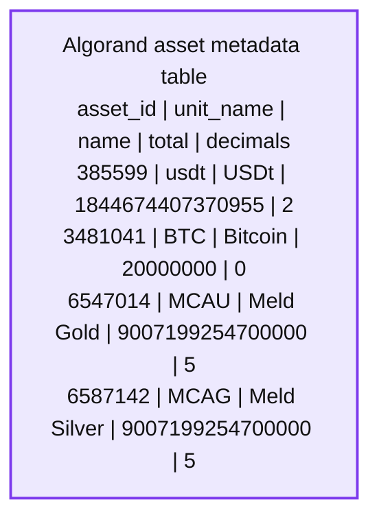

<sub>source image: https://www.databricks.com/wp-content/uploads/2021/02/algorand-2-table.png</sub>

- This[*notebook*](https://www.databricks.com/notebooks/algorand-blockchain-2/retrieve-crypto-compare-data.html) runs periodically to retrieve Algo trading information on a daily and hourly basis.
- Data is converted to a Spark dataframe and persisted in a Delta table.

 

**Step 2: AutoLoader  **
 This[*notebook*](https://www.databricks.com/notebooks/algorand-blockchain-2/real-time-data-ingest-transform-and-aggregate-data.html) is the primary notebook that drives the streaming pipeline for block data ingestion.

- The [Autoloader](https://docs.databricks.com/spark/latest/structured-streaming/auto-loader.html) incrementally and efficiently processes new data files as they arrive in S3 using a Structured Streaming source named ‘cloudFiles’

 

- The data engineer can monitor live stream processing with the live graph in the notebook (using display command) or using the Streaming Query Statistics tab in the [Spark UI](https://spark.apache.org/docs/latest/web-ui.html#structured-streaming-tab).

**Summary:** Databricks displays live Structured Streaming performance through a notebook live graph and the Spark UI Streaming Query Statistics tab.

**Components:**

- Databricks notebook live graph
- Spark UI Streaming Query Statistics
- Structured Streaming query named delta_block_bronze
- Input rate monitor
- Processing rate monitor
- Input rows monitor
- Batch duration monitor
- Operation duration monitor

**Flows:**

- Structured Streaming query -> Databricks notebook live graph: input, processing, and batch-duration metrics
- Structured Streaming query -> Spark UI Streaming Query Statistics: streaming query statistics

**Numbers:** 25.8 records per second input rate; 30.7 records per second processing rate; 3.9 seconds average batch duration; 3.3 seconds latest batch duration; 1 Spark job; query ID 94327b74-032a-4cf4-984d-09d0aa3b1e64; run ID 3c390717-7d4a-458f-98c0-00686e8497; 3 minutes 12 seconds; 53 completed batches; dates 2020/11/08 and Dec 04; times 01:48:36, 01:48:37, 01:51:40, 01:51:40.222, 21:05, 21:06, 21:07, 21:08, 21:09, 21:10; chart scales 0, 10, 20, 30, 40, 50 batches; input-rate scale 0.00 to 8.00 records/sec; process-rate scale 0.00 to 50.00 records/sec; input-rows scale 0.00 to 600.00 records; batch-duration scale 0 to 10,000 ms; operation-duration scale 0 to 14,000 ms; hostname 10.126.254.251; Spark version 2.3.x; Scala version 2.12.

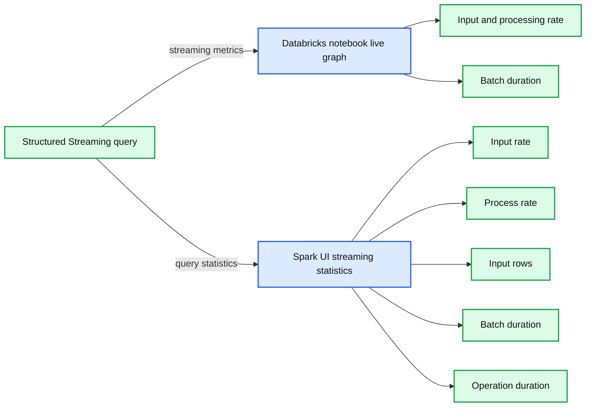

<sub>source image: https://www.databricks.com/wp-content/uploads/2021/02/algorand-5-live-graph-query.png</sub>

 Figure 5: (A) Live Graph and (B) Streaming Query Statistics tab in the Spark UI

- The stream is written out in micro-batches into Delta format. A Delta table is created to point to the data location for easy SQL access. Structured Streaming uses [checkpoint](https://docs.databricks.com/spark/latest/structured-streaming/production.html#recover-from-query-failures) files to provide resilience to job failures and ‘exactly once’ semantics.

**Step 3:Stream refinement**
 Stream from the bronze table, flatten the transactions and persist the transaction stream into the silver table.

- ‘round’ is the block number.
- ‘timestamp’ is when committed.

**Step 4: In-stream aggregations **
 Compute in-stream aggregations and persist into the ‘gold’ Delta table.

- Read from the silver Delta table as a streaming job.
- Compute aggregation statistics on transaction data over a [sliding window](https://spark.apache.org/docs/latest/structured-streaming-programming-guide.html#window-operations-on-event-time) on tx_time. An interval of one hour specifies the aggregation time unit. The [watermark](https://spark.apache.org/docs/latest/structured-streaming-programming-guide.html#handling-late-data-and-watermarking) allows late arriving data to be included in the aggregates. In distributed and networked systems, there’s always a chance for disruption, which is why it is necessary to preserve the state of the aggregate for a little longer. (keeping it indefinitely will exceed memory capacity)
- Persist into the gold Delta table

**Step 5a: Graph analysis**
 A graph is an intuitive way to model data to discover inherent relationships. With SQL, single hop relations are easy to identify, and graphs are better suited for more complex relationships. This [*notebook*](https://www.databricks.com/notebooks/algorand-blockchain-2/graph-analysis.html) leverages graph processing on the transaction data. Sometimes it is necessary to push data to a specialized graph database. With Spark, it is possible to use the Delta Lake data by applying Graph APIs directly. The notebook utilizes Spark’s distributed computing with the Graph APIs’ flexibility, augmented with additional ML models - all from the same source of truth.

While Blockchain reduces the potential for fraud, there is always a risk of fraud, and  Graph semantics can help discover indicative features. Properties of a transaction other than the sender/receiver account ids are more useful in detecting suspicious patterns. A single actor can shield behind multiple identities on the blockchain. For example, a fanout from a single account to multiple accounts through several other layers of accounts and a subsequent convergence to a target account where the original source and target accounts are distinct but in reality map to the same user.

- Create an [optimized](https://docs.databricks.com/spark/latest/spark-sql/language-manual/delta-optimize.html) Delta table for the graph analysis Z-ordered by sender & receiver

 

- Create Vertices, Edges and construct the transaction Graph from it

 

- Once the graph is in memory, analyze user activity such as:

 

- [PageRank](https://graphframes.github.io/graphframes/docs/_site/user-guide.html#pagerank) measures the importance of a vertex (i.e., account) using the directed edges’ link analysis. It is implemented either with controlled iterations or allowing it to converge.

- SP745JJR4KPRQEXJZHVIEN736LYTL2T2DFMG3OIIFJBV66K73PHNMDCZVM was on top of the list. Investigation shows this account processes asset exchanges, which explains the high activity.

**Summary:** A D3 chord visualization shows transaction relationships among top active Algorand accounts, including fan-out and fan-in patterns.

**Components:**

- Top active Algorand accounts using truncated six-character account identifiers
- D3 chord visualization using colored circular segments and transaction chords
- NxN adjacency matrix representing account-to-account transactions

**Flows:**

- Account identifiers -> D3 chord visualization: transaction relationships
- Algorand accounts -> Adjacency matrix: directed transaction edges
- Adjacency matrix -> D3 chord visualization: fan-out and fan-in links

**Numbers:** Six-character account ID prefixes; NxN adjacency matrix; digits visible within account identifiers; no standalone units or measurements.

```mermaid
%% Shows transaction relationships among top active Algorand accounts
flowchart LR
    A[Top active Algorand accounts] -->|directed transaction edges| B[NxN adjacency matrix]
    B -->|fan-out and fan-in links| C[D3 chord visualization]
    A -->|truncated six character IDs| C
    C -->|relationships| D[Account segments]

    classDef client   fill:#dbeafe,stroke:#2563eb,stroke-width:2px,color:#111
    classDef service  fill:#dcfce7,stroke:#16a34a,stroke-width:2px,color:#111
    classDef store    fill:#ede9fe,stroke:#7c3aed,stroke-width:2px,color:#111
    classDef cache    fill:#fef3c7,stroke:#d97706,stroke-width:2px,color:#111
    classDef queue    fill:#cffafe,stroke:#0891b2,stroke-width:2px,color:#111
    classDef critical fill:#fee2e2,stroke:#dc2626,stroke-width:4px,color:#111
    classDef external fill:#e5e7eb,stroke:#6b7280,stroke-width:2px,color:#111,stroke-dasharray:4 3
    classDef decision fill:#fce7f3,stroke:#db2777,stroke-width:2px,color:#111

    class A client
    class B store
    class C service
    class D service
```

<sub>source image: https://www.databricks.com/wp-content/uploads/2021/02/algorand-6-d3-chord.png</sub>

|  | D3 chord visualization right inside the Databricks notebook can help show relationships, especially fan-out/in type transactions, using the top active accounts. The notebook converts the graph tx data into an NxN adjacency matrix, and each vertex is assigned a unique color along the circumference. The chart uses the first 6 char of the account ids for readability. |
|---|---|

Figure 6: Account Interaction using D3 Chord

**Summary:** The image shows a three-hop graph path from vertex A through B and C to vertex D, with edges e1, e2, and e3 containing transaction fields.

**Components:**

- A, B, C, D: graph vertices with string IDs
- e1, e2, e3: graph edges with string transaction IDs, sources, and destinations

**Flows:**

- A -> B: e1 transaction edge
- B -> C: e2 transaction edge
- C -> D: e3 transaction edge

**Numbers:** 3 hops

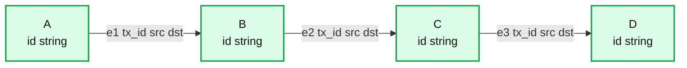

<sub>source image: https://www.databricks.com/wp-content/uploads/2021/02/algorand-6b.png</sub>

| Motif Search is another powerful search technique to find structural patterns in the graph using a simple DSL (Domain Specific Language). - For example, to find all paths (intermediate vertices and edges) between a given start (**A**) and end vertex (D), separated by say 3 hops (e1, e2, e3), one can use an expression like:``` val motifs_3_hops = txG.find("(<b>A</b>)-[e1]->(B);(B)-[e2]->(C);(C)-[e3]->(<b>D</b>)")``` |  |
|---|---|

**A:** Distinct clusters form around the most active accounts.
**B:** Different types of graphs can be constructed--account to account with the nodes representing the accounts and edges representing the transactions. These are directed graphs with the arrows going from sender to receiver. The thickness of the edge is an indication of the volume of traffic.
**C:** Another method would involve giving each asset a different color to see how the various assets interact. The diagram above shows a subset of the assets and the observation is that they are generally distinct with some overlap.
**D:** Zooming into the vortex displays the account id, which aligns with the top senders from the Graph APIs.

**Step 5b: SQL Analytics**
[SQL Analytics](https://docs.databricks.com/sql/user/index.html) offers a performant and full-featured SQL-native query editor that allows data analysts to write queries in a familiar syntax and easily explore [Delta Lake](https://www.databricks.com/product/delta-lake-on-databricks) table schemas. Queries can be saved in a catalog for reuse and are cached for quicker execution. These queries can be parameterized and set to refresh on an interval and are the building blocks of dashboards that can be created quickly and shared. Like the queries, the dashboards can also be configured to automatically refresh with a minimum refresh interval of a minute and alert the team to meaningful changes in the data. Tags can be added to queries and dashboards to organize them into a logical entity.

The dashboard is divided into multiple sections and each has a different focus:

**1. High-level blockchain stats **Provides a general overview of key aggregate metrics indicating the health of the blockchain.
**2. Algo Price and Volume **Monitors the Algo cryptocurrency price and volume for correlation with blockchain stats.
**3. Latest (‘Last’) block status **Provides stats of the most recent block, which is an indicator of the operational state of the blockchain.
**4. Block Trends** Provide a historical view of the number of transactions per block and the time required to produce each block.
**5. Transaction Trends **Provides a more detailed analysis of transaction activity, including volume, transaction type, and assets transferred.
**6. Account Activity** Provides a view of account behavior, including the most active accounts and the assets transferred between them.

**Section 1: High-level blockchain stats **
 This section is a birds-eye view of aggregate stats, including the count of distinct asset types, transaction types, active accounts in a given time period.

 Figure 8: High-level details of the Algorand Blockchain

**A**: The cumulative number of active accounts in a given time period
**B**: The average number of transactions per block in the given time period
**C**: The cumulative number of distinct assets used in the given time period
**D**: The cumulative number of distinct transaction types in the given time period
**E**: A word cloud representing the top trending words extracted from the note field of the transactions
**F**: An alphabetic listing of the asset types. Each asset has a unique identifier, a unit name, and the total number of assets available.

**Section 2: Algo price and volume **
 This section provides price and volume data for Algos, the Algorand cryptocurrency. The price and volume are retrieved using the CryptoCompare API to correlate with the transaction volume.

**Summary:** A Databricks analytics dashboard displays daily and hourly Algorand price and trading-volume data sourced from the CryptoCompare API.

**Components:**

- Algo Trading dashboard
- CryptoCompare API
- algoTradeDaily chart
- Hourly price and volume correlation chart
- Daily date selector
- Hourly date selector

**Flows:**

- CryptoCompare API -> Algo Trading dashboard: daily and hourly trading details

**Numbers:**

- 2020-05-01
- 2020-12-11
- May 2020 through Dec 2020
- 0.2, 0.4, 0.6 USD daily price ticks
- 0.28, 0.285, 0.29 USD hourly price ticks
- 0, 50M, 100M daily volume ticks
- 0, 0.5M, 1M, 1.5M, 2M hourly volume ticks
- Hours 0, 10, 20
- 2 minutes ago

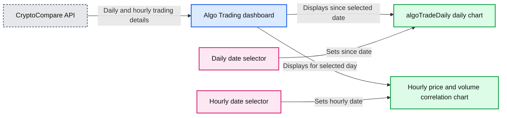

<sub>source image: https://www.databricks.com/wp-content/uploads/2021/02/algorand-9-price-volume.png</sub>

 Figure 9: Price and Volume data for Algos

**A**: Shows trading details daily (Algo price on left axis and volume traded on right axis) since a given date
**B**: Shows the same on an hourly basis for a given day

**Section 3: Latest (‘Last’) block status **
 The latest block stats are an indicator of the operational state of the blockchain. E.g., suppose the number of transactions in a block or the amount of time it takes to generate a block falls below acceptable thresholds. In that case, it could indicate that the underlying blockchain nodes may not be functioning optimally.

**A**:  The latest Block number
**B**:  Number of transactions in the most recent block
**C**: Time in seconds for the block to be created
**D**: The distribution of transaction types in this block
**E**: The asset type distribution for each transaction type within this block. Pay transactions use Algo and are not associated with an asset type.
**F**: The individual transactions within this block
**Section 4: Block trends **
 This section is an extension of the previous and provides the historical view of the number of transactions per block and the time required to produce each block.

**Summary:** Dashboard showing Algorand historical trends for transactions per block and block creation time.

**Components:**

- Tx Per Block chart labeled txPerBlock
- BlockCreationTime chart labeled BlockCreationTime
- Transaction count metric labeled #Tx
- Block or round axis
- Time taken metric labeled timeTaken
- Day filter
- Historical block trend dashboard

**Flows:**

- none

**Numbers:**

2; ~68 tx/s; under 5 seconds; 200; 150; 100; 50; 0; 9.1318M; 9.132M; 9.1322M; 9.1324M; 9.1326M; 20; 15; 10; 5; 2020-11-01; 9.995M; 10M; 10.005M; 10.01M

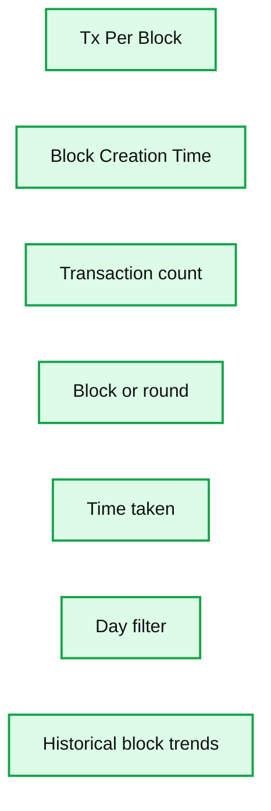

<sub>source image: https://www.databricks.com/wp-content/uploads/2021/02/algorand-11-per-block-trend.png</sub>

 Figure 11: Per block trends

**A**:  The number of transactions per block has a few spikes but shows a regular pattern. Transaction volume is significant since it reflects user adoption on the Algorand blockchain.

**B**:  The time in seconds to create a new block is always less than 5 seconds. The latency indicates the health of the blockchain network and the efficiency of the consensus protocol. An [alert](https://docs.databricks.com/sql/user/alerts/index.html) monitors this critical metric to ensure that it remains below 5 seconds.

 Figure 12: Configuring thresholds for Alert notifications

**Section 5: Transactions trends**
 This section provides a more detailed analysis of transaction activity, including volume, transaction type and assets transferred.

**Summary:** Databricks transaction-trends dashboard showing Algorand asset statistics, hourly transaction activity, transaction-type distribution, asset volume, and maximum transaction amounts across eight panels.

**Components:**

- A: Daily transaction report with asset statistics
- B: Hourly transaction-count report for a selected day
- C: Global average hourly transaction-rate chart
- D: Daily transaction-type distribution chart
- E: Transaction-type distribution donut chart
- F: Daily transaction volume by asset chart
- G: Daily most-active asset-types chart
- H: Daily maximum transaction-amount chart

**Flows:**

- none visible

**Numbers:** 2020-09-18, 2020-09-19, 2020-09-20, 2020-10-04, 2020-10-10, 2,512,768, 9,128,769, 31,566,704, 2,514,167, 24, 21, 18, 5,124, 157,696, 437,062.84, 431,410.52, 98,443,672,248.82, 333,809.66, 4,000,000,000, 5,995,000,000, 1,399,050,380,000, 69,744,000, 2 minutes ago, 30k, 20k, 10k, 5, 10, 15, 20, 25, 3000, 2000, 1000, 0, 500k, 200k, 150k, 100k, 50k, 0, 91.7%, Sep 19, Sep 20, Sep 22, Sep 25, Sep 27, Sep 28, Oct 1, Oct 4, Oct 7, Oct 10, 1T, 100B, 10B, 1B

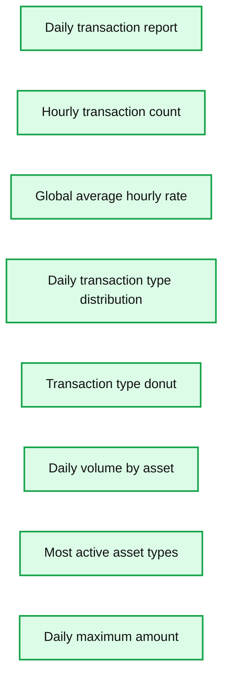

<sub>source image: https://www.databricks.com/wp-content/uploads/2021/02/algorand-13-transaction-trends.png</sub>

 Figure 13: Trends in Transactions

**A**: Asset statistics (count, average, min, max, sum on the amount) by hour and asset type
**B**: For a given day, the trend of the transaction count by hour
**C**: Average transaction volume by hour across the entire time period. There is a pattern that is similar to the previous. It appears that 10 AM is the trough and hour 21 is the crest, possibly on account of Asia’s market waking up.
**D**: The distribution of transaction types on a daily basis shows a high number of asset transfers (axfer) followed by payments with Algos (pay)
**E**: The transaction type distribution is the same for the selected day
**F**: The transaction volume distribution by asset type
**G**: The transaction volume by asset id over time on a daily basis. YouNow and Planet are the top asset ids traded in the given period.
**H**: The max transaction amount by asset id over time on a daily basis

**Section 6: Account activity**
 This section provides a view of current account activity, including the most active accounts and the assets transferred.  A Sanky diagram illustrates the flow of assets between the most active accounts.

**Summary:** Sankey flow showing a three-hop asset transfer from sender SP745J to receiver ABXEBH through multiple intermediary accounts.

**Components:**

- SP745J sender account - technology not specified
- VIIGPW intermediary account - technology not specified
- NV3CA6 intermediary account - technology not specified
- Multiple additional intermediary accounts - technology not specified
- LWUWBZ intermediary account - technology not specified
- ABXEBH receiver account - technology not specified

**Flows:**

- SP745J -> VIIGPW: asset transfer
- SP745J -> NV3CA6: asset transfer
- SP745J -> Additional intermediary accounts: asset transfers
- VIIGPW -> LWUWBZ: asset transfer
- NV3CA6 -> LWUWBZ: asset transfer
- Additional intermediary accounts -> LWUWBZ: asset transfers
- LWUWBZ -> ABXEBH: asset transfer

**Numbers:** 3_hop; 3

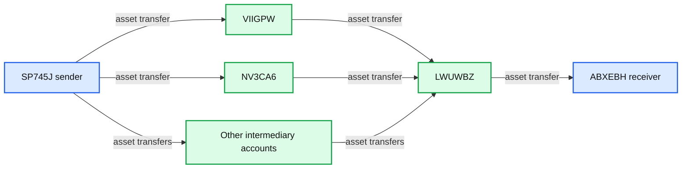

<sub>source image: https://www.databricks.com/wp-content/uploads/2021/02/blog-algorand-2-graph.png</sub>

 Figure 14: Top Accounts by transaction volume

**A**: Top Senders by transaction volume
**B**: Daily transaction volumes of the identified top 20 senders
**C**: [Sankey Diagrams](https://discuss.redash.io/t/flow-sequence-queries-sankey-and-sunburst-visualizations/1703) are useful to capture behavioral flows and sequences. Transactions have a ‘point in time view’ of a single sender and receiver. How the transactions flow on either side tell the bigger story and help us understand the hidden nuances of a large source or sink account and contributors along the path.

## Summary

This post has shown the Databricks platform's versatility for analyzing transactional blockchain data (block, transaction and account) from the Algorand blockchain in real time. Apache Spark’s open source distributed compute architecture and Delta provide a scalable cloud infrastructure performant with reliable and real-time data streaming and curation. Machine learning practitioners and data analysts perform multiple types of analysis on all the data on a single platform in place. SQL, Python, R and Scala provide the tools for exploratory data analysis. Graph algorithms are applied to analyze account behavior. With SQL Analytics, business analysts derive better business insights through powerful visualizations using queries directly on the data lake.

## Try the notebooks

- [Retrieve Algorand Block Data](https://www.databricks.com/notebooks/algorand-blockchain-2/retrieve-algorand-block-data.html)
- [Retrieve CryptoCompare Data](https://www.databricks.com/notebooks/algorand-blockchain-2/retrieve-crypto-compare-data.html)
- [Real-time Data Ingest, Transform and Aggregate Data](https://www.databricks.com/notebooks/algorand-blockchain-2/real-time-data-ingest-transform-and-aggregate-data.html)
- [Graph Analysis](https://www.databricks.com/notebooks/algorand-blockchain-2/graph-analysis.html)
