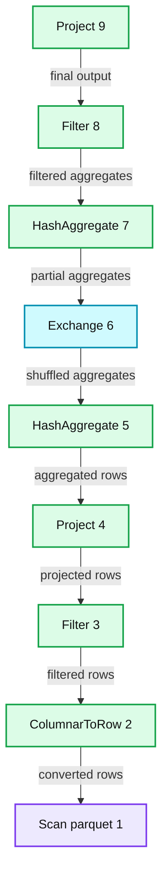
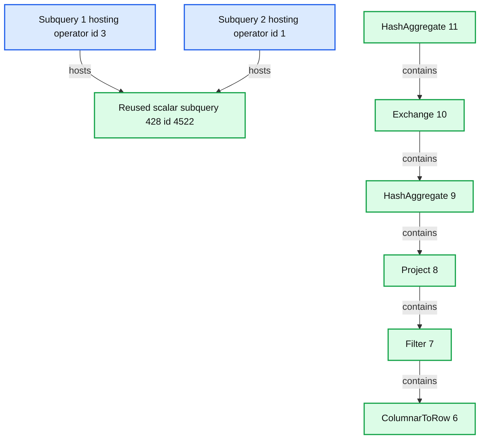
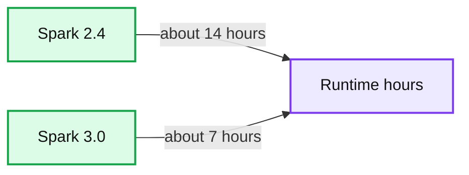
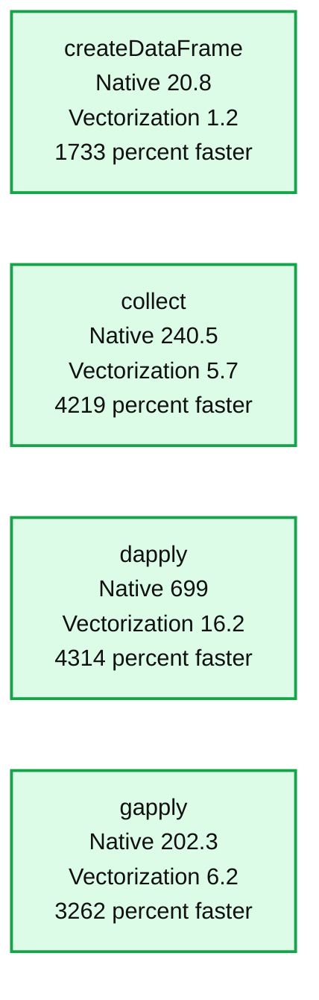

# Upgrade Production Workloads to Be Safer, Easier, and Faster With Databricks Runtime 7.3 LTS

- Source: https://www.databricks.com/blog/2021/03/08/upgrade-production-workloads-to-be-safer-easier-and-faster-with-databricks-runtime-7-3-lts.html
- Published: 2021-03-08
- Authors: Jason Pohl
- Categories: engineering, open-source
- Images: 7 total, 6 extracted as architecture

What a difference a year makes. One year ago, Databricks Runtime version (DBR) 6.4 was released -- followed by 8 more DBR releases. But now it’s time to plan for an upgrade to 7.3 for Long-Term Support (LTS) and compatibility, as support for DBR 6.4 will end on April 1, 2021. (Note that a new DBR 6.4 (Extended Support) release was published on March 5 and will be supported until the end of the year). Upgrading now allows you to take advantage of all the improvements from 6.4 to 7.3 LTS, which has long-term support until Sept 2022. This blog highlights the major benefits of doing so.

DBR 6.4 is the last supported release of the Apache Spark 2.x code line. Spark 3.0 was released in June of 2020 with it a whole bevy of improvements. The Databricks 7.3 Runtime built on the Apache Spark 3.x code line includes many new features for Delta Lake and the Databricks platform as a whole, resulting in these improvements:

## Easier to use

DBR 7.3 LTS makes it easier to develop and run your Spark applications thanks to the Apache Spark 3.0 improvements. The goal of [Project Zen](https://www.databricks.com/blog/2020/09/04/an-update-on-project-zen-improving-apache-spark-for-python-users.html) within Spark 3.0 is to adhere PySpark more closely to Python principles and conventions. Perhaps the most noticeable improvement is the new interface for [Pandas UDFs, which leverages Python type hints](https://www.databricks.com/blog/2020/05/20/new-pandas-udfs-and-python-type-hints-in-the-upcoming-release-of-apache-spark-3-0.html). This standardizes on a preferred way to write Pandas UDFs and leverages type hints to have a better developer experience within your IDE.

If you haven’t yet converted your Apache Parquet data lake into a Delta Lake, you are missing out on many benefits, such as:

1. Preventing data corruption
2. Faster queries
3. Increased data freshness
4. Easy reproducibility of machine learning models
5. Easy implementation of data compliance

These [Top 5 Reasons to Convert Your Cloud Data Lake to Delta Lake](https://www.databricks.com/blog/2020/08/21/top-5-reasons-to-convert-your-cloud-data-lake-to-a-delta-lake.html) should provide an opportunity to upgrade your Data Lake along with your Databricks Runtime.

Data ingestion from cloud storage has been simplified with [Delta Auto Loader](https://www.databricks.com/blog/2020/02/24/introducing-databricks-ingest-easy-data-ingestion-into-delta-lake.html), which was released for general availability in DBR 7.2. This enables a standard API across cloud providers to stream data from blob storage into your Delta Lake. Likewise, the COPY INTO (AWS | Azure) command was introduced to provide an easy way to import data into a Delta table using SQL.

Refactoring changes to your data pipeline became easier with the introduction of [Delta Table Cloning](https://www.databricks.com/blog/2020/09/15/easily-clone-your-delta-lake-for-testing-sharing-and-ml-reproducibility.html). This allows you to quickly clone a production table in a safe way so that you can experiment on it with the next version of your data pipeline code without the risk of corrupting your production data. Another common scenario is the need to move a table to a new bucket or storage system for performance or governance reasons. You can easily do this with the CLONE command to copy massive tables in a more scalable and robust way. Additionally, you can specify your own meta-data ([AWS](https://docs.databricks.com/delta/delta-batch.html?_ga=2.200491949.2081427681.1614632727-865092812.1611791076#set-user-defined-commit-metadata) | [Azure](https://docs.microsoft.com/en-us/azure/databricks/delta/delta-batch#--set-user-defined-commit-metadata)) to the transaction log when committing to delta.

When long-running queries need to be troubleshooted, it is common to generate an explain plan of the query or dataframe. The formatting of large explain plans can be unwieldy to navigate. Explain plans have become much more consumable with the reformatting introduced in Spark 3.0.

**Here is an example of an explain plan pre Spark 3.0:**

**Summary:** The image shows Spark logical query plans progressing from parsed to analyzed and optimized execution stages.

**Components:**

- Parsed logical plan using Spark Filter and Aggregate operators
- Unresolved relation for loans_parquet
- Analyzed logical plan with typed loan and funding fields
- Parquet relation containing loan data
- Optimized logical plan with Project, Filter, and Aggregate operators

**Flows:**

- Unresolved relation -> Loan ID filter: filters loan_id greater than 0
- Loan ID filter -> Aggregate: groups by loan_id and computes maximum funded amount
- Aggregate -> Maximum funding filter: keeps maximum funded amount greater than 0
- Maximum funding filter -> Project: selects loan_id and maximum funded amount
- Parquet relation -> Analyzed filter: supplies typed loan records
- Analyzed filter -> Analyzed aggregate: passes filtered records
- Analyzed aggregate -> Analyzed project: passes aggregated results
- Optimized filter -> Optimized aggregate: applies non-null and positive loan ID conditions
- Optimized aggregate -> Optimized project: passes computed maximum funded amount

**Numbers:** 0, 54L, 55, 56, 57, 170, 173, bigint, int

```mermaid
%% Shows Spark parsed, analyzed, and optimized logical query plans
flowchart LR
    R[Parquet relation] -->|loan records| F[Loan ID filter]
    F -->|filtered records| A[Aggregate by loan ID]
    A -->|maximum funded amount| M[Maximum funding filter]
    M -->|qualified results| P[Project selected fields]

    U[Unresolved relation] -->|source loans parquet| UF[Parsed loan ID filter]
    UF -->|filtered input| UA[Parsed aggregate]
    UA -->|aggregated input| UM[Parsed maximum filter]

    OF[Optimized filter] -->|non null positive loan IDs| OA[Optimized aggregate]
    OA -->|maximum funded amount| OP[Optimized project]

    classDef client fill:#dbeafe,stroke:#2563eb,stroke-width:2px,color:#111
    classDef service fill:#dcfce7,stroke:#16a34a,stroke-width:2px,color:#111
    classDef store fill:#ede9fe,stroke:#7c3aed,stroke-width:2px,color:#111
    classDef cache fill:#fef3c7,stroke:#d97706,stroke-width:2px,color:#111
    classDef queue fill:#cffafe,stroke:#0891b2,stroke-width:2px,color:#111
    classDef critical fill:#fee2e2,stroke:#dc2626,stroke-width:4px,color:#111
    classDef external fill:#e5e7eb,stroke:#6b7280,stroke-width:2px,color:#111,stroke-dasharray:4 3
    classDef decision fill:#fce7f3,stroke:#db2777,stroke-width:2px,color:#111

    class R store
    class F,A,M,P service
    class U,UF,UA,UM service
    class OF,OA,OP service

    %% Legend
    %% client = clients edge gateway or load balancer
    %% service = stateless compute
    %% store = databases or durable storage
    %% cache = Redis CDN or losable data
    %% queue = Kafka streams or asynchronous pipes
    %% critical = bottleneck or single point of failure
    %% external = third party
    %% decision = trade off point
```



<sub>source image: https://www.databricks.com/wp-content/uploads/2021/03/runtime-2.png</sub>

Here is the newly formatted explain plan. It is separated into a Header to show the basic operating tree for the execution plan, and a footer, where each operator is listed with additional attributes.

**Summary:** Spark physical plan showing a parquet scan flowing through row conversion, filtering, projection, aggregation, exchange, and final aggregation.

**Components:**

- Project, Spark execution operator
- Filter, Spark execution operator
- HashAggregate, Spark execution operator
- Exchange, Spark shuffle operator
- ColumnarToRow, Spark conversion operator
- Scan parquet, Databricks parquet reader
- InMemoryFileIndex, file index

**Flows:**

- Scan parquet -> ColumnarToRow: loan ID and funded amount rows
- ColumnarToRow -> Filter: converted rows
- Filter -> Project: filtered rows
- Project -> HashAggregate: projected rows
- HashAggregate -> Exchange: partial aggregates
- Exchange -> HashAggregate: shuffled aggregates
- HashAggregate -> Filter: aggregated results
- Filter -> Project: final filtered results

**Numbers:** 9, 8, 7, 6, 5, 4, 3, 2, 1, 54, 55, 0, 19, true, bigint, int



<sub>source image: https://www.databricks.com/wp-content/uploads/2021/03/runtime-3.png</sub>

Finally, any subqueries will be listed separated:

**Summary:** Spark 3.0 explain output showing two subqueries and their nested execution operators.

**Components:**

- Subquery 1 using Spark SQL scalar subquery
- Subquery 2 using Spark SQL scalar subquery
- HashAggregate operators using Spark SQL
- Exchange operator using Spark SQL
- Project operator using Spark SQL
- Filter operator using Spark SQL
- ColumnarToRow operator using Spark SQL

**Flows:**

- Subquery 1 -> Reused scalar subquery: hosts reused execution
- Subquery 2 -> Reused scalar subquery: hosts reused execution
- HashAggregate -> Exchange: aggregates through exchange
- Exchange -> HashAggregate: feeds aggregation
- HashAggregate -> Project: feeds projection
- Project -> Filter: feeds filtering
- Filter -> ColumnarToRow: converts columnar data to rows

**Numbers:** 1, 3, 428, 4522, 11, 10, 9, 8, 7, 6



<sub>source image: https://www.databricks.com/wp-content/uploads/2021/03/runtime-4.png</sub>

## Fewer failures

Perhaps no feature has been more hotly anticipated than the ability for Spark to automatically calculate the optimum number of shuffle partitions. Gone are the days of manually adjusting spark.shuffle.partitions. This is made possible by the new [Adaptive Query Execution (AQE)](https://www.databricks.com/blog/2020/05/29/adaptive-query-execution-speeding-up-spark-sql-at-runtime.html) added in Spark 3.0 and was a major step-change to the execution engine for Spark.

Spark now has an adaptive planning component to its optimizer so that as a query is executing, statistics can automatically be collected and fed back into the optimizer to replan subsequent sections of the query.

**Summary:** The diagram shows adaptive query execution repeatedly reoptimizing unfinished query stages until all stages are complete.

**Components:**

- Start query stages with dependency cleared, using query stage execution
- Reoptimize unexecuted part of the query, using adaptive query planning
- More stages to run, using a decision point
- Done, marking query completion

**Flows:**

- Start query stages -> Reoptimize: one or more stages complete
- Reoptimize -> More stages to run: updated execution state
- More stages to run -> Start query stages: yes, continue with cleared dependencies
- More stages to run -> Done: no, query complete

**Numbers:** none

```text
%% mermaid failed to render; kept as text
%% Adaptive query execution loops through completed stages and replanning
flowchart LR
    A[Start query stages with dependency cleared] -->|One or more stages complete| B[Reoptimize unexecuted part of the query]
    B --> C{More stages to run}
    C -->|Yes| A
    C -->|No| D((Done))

    classDef client fill:#dbeafe,stroke:#2563eb,stroke-width:2px,color:#111
    classDef service fill:#dcfce7,stroke:#16a34a,stroke-width:2px,color:#111
    classDef store fill:#ede9fe,stroke:#7c3aed,stroke-width:2px,color:#111
    classDef cache fill:#fef3c7,stroke:#d97706,stroke-width:2px,color:#111
    classDef queue fill:#cffafe,stroke:#0891b2,stroke-width:2px,color:#111
    classDef critical fill:#fee2e2,stroke:#dc2626,stroke-width:4px,color:#111
    classDef external fill:#e5e7eb,stroke:#6b7280,stroke-width:2px,color:#111,stroke-dasharray:4 3
    classDef decision fill:#fce7f3,stroke:#db2777,stroke-width:2px,color:#111
    A,B,D service
    C decision
```

<sub>source image: https://www.databricks.com/wp-content/uploads/2021/03/runtime-5.png</sub>

Another benefit of AQE is the ability for Spark to automatically replan queries when it detects data skew. When joining large datasets, it’s not uncommon to have a few keys with a disproportionate amount of data. This can result in a few tasks taking an excessive amount of time to complete, or in some cases, fail the entire job. The AQE can re-plan such a query as it executes to evenly spread the work across multiple tasks.

Sometimes failures can occur on a shared cluster because of the actions of another user, such as when two users are experimenting with different versions of the same library. The latest runtime includes a feature for Notebook-scoped Python Libraries ([AWS](https://docs.databricks.com/libraries/notebooks-python-libraries.html?_ga=2.193693870.2081427681.1614632727-865092812.1611791076) | [Azure](https://docs.microsoft.com/en-us/azure/databricks/libraries/notebooks-python-libraries)). This ensures that you can easily install Python libraries with pip, but their scope is limited to the current notebook and any associated jobs. Other notebooks attached to the same Databricks cluster are not affected.

## Improved performance

In the cloud, time is money. The longer it takes to run a job, the more you pay for the underlying infrastructure. [Significant performance speedups](https://www.databricks.com/blog/2020/10/21/faster-sql-adaptive-query-execution-in-databricks.html) were introduced in Spark 3.0. Much of this is due to the AQE, dynamic partition pruning, automatically selecting the best join strategy, automatically optimizing shuffle partitions and other optimizations. Spark 3.0 was benchmarked as being 2x faster than Spark 2.4 on the TPC-DS 30TB dataset.

**Summary:** Benchmark comparison showing Spark 3.0 completing TPC-DS 30 TB workloads in roughly half the runtime of Spark 2.4.

**Components:**

- Spark 2.4 benchmark runtime
- Spark 3.0 benchmark runtime
- TPC-DS 30 TB workload
- Runtime measured in hours

**Flows:**

- none

**Numbers:** 2.4, 3.0, 30 TB, 0, 3.75, 7.5, 11.25, 15, hours



<sub>source image: https://www.databricks.com/wp-content/uploads/2021/03/runtime-6.png</sub>

UDFs created with R now execute with a 40x improvement by vectorizing the processing and leveraging Apache Arrow.

**Summary:** Performance comparison showing that vectorization is substantially faster than native execution for four R operations.

**Components:**

- Native execution
- Vectorization
- createDataFrame
- collect
- dapply
- gapply
- Time in seconds

**Flows:**

- none

**Numbers:**

- Performance Comparison, smaller is better
- Time in seconds
- Y-axis scale: 0, 100, 200, 300, 400, 500, 600, 700, 800
- createDataFrame: Native 20.8, Vectorization 1.2, 1733% faster
- collect: Native 240.5, Vectorization 5.7, 4219% faster
- dapply: Native 699, Vectorization 16.2, 4314% faster
- gapply: Native 202.3, Vectorization 6.2, 3262% faster



<sub>source image: https://www.databricks.com/wp-content/uploads/2021/03/runtime-7.png</sub>

Finally, our Delta Engine was enhanced to provide even faster performance when reading and writing to your Delta Lake. This includes the collection of optimizations that reduce the overhead of Delta Lake operations from seconds to tens of milliseconds. We introduced a number of optimizations so that the MERGE statement performs much faster.

## Getting started

The past year has seen a major leap in usability, stability, and performance. If you are still running DBR 6.x, you are missing out on all of these improvements. If you have not upgraded yet, then you should plan to do so before extended support ends at the close of 2021. Doing so will also prepare you for future improvements that are to be released for Delta Engine later this year--all dependent on Spark 3.0 APIs.

You can jumpstart your planning by visiting our documentation on DBR 7.x Migration - Technical Considerations ([AWS](https://docs.databricks.com/release-notes/runtime/7.x-migration.html) | [Azure](https://docs.microsoft.com/en-us/azure/databricks/release-notes/runtime/7.x-migration)), and by reaching out to your Account Team.
