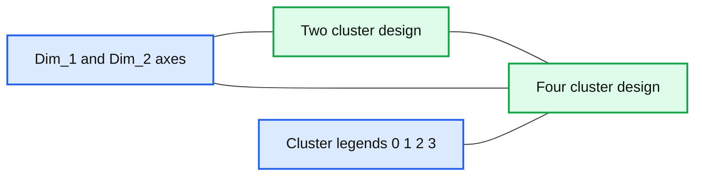
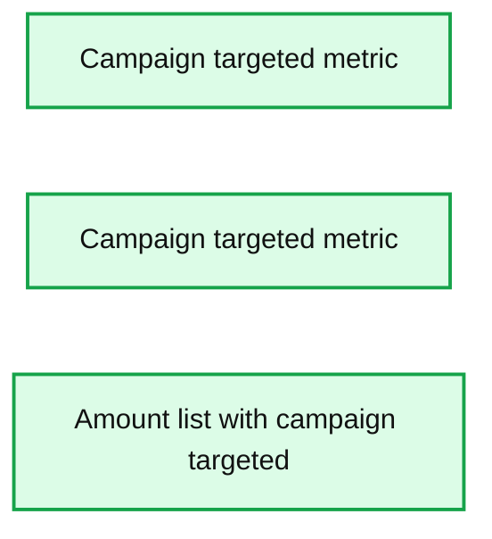
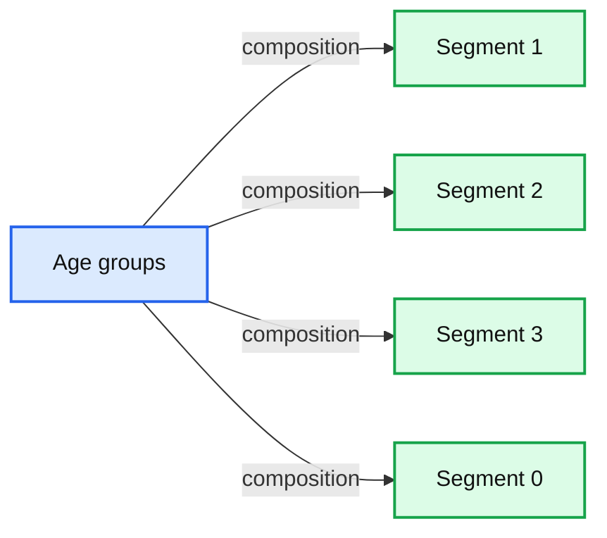

# Segmentation in the Age of Personalization

- Source: https://www.databricks.com/blog/2021/03/16/segmentation-in-the-age-of-personalization.html
- Published: 2021-03-16
- Authors: Bryan Smith, Rob Saker
- Categories: engineering, solution-accelerators
- Images: 4 total, 3 extracted as architecture

[Quick link to notebooks referenced through this post.](https://www.databricks.com/solutions/accelerators/customer-segmentation)

Personalization is heralded as the gold standard of customer engagement. Organizations successfully [personalizing their digital experiences are cited](https://www.mckinsey.com/business-functions/marketing-and-sales/our-insights/the-future-of-personalization-and-how-to-get-ready-for-it)as driving 5 to 15% higher revenues and 10 to 30% greater returns on their marketing spend. And now many customer experience leaders are beginning to [extend personalization to the in-store experience](https://www.mckinsey.com/business-functions/marketing-and-sales/our-insights/the-end-of-shoppings-boundaries-omnichannel-personalization), revolutionizing how consumers engage brands in the physical world and further setting themselves apart from their competition.

But true personalization is not viable in every aspect of customer engagement. When a retailer decides to construct a store, it does so considering the general needs of the population it intends to serve. Those same considerations carry over into the choice of products with which the store is stocked. Consumer goods manufacturers similarly consider the needs of specific, targeted consumer segments when deciding to launch a new brand or product. And even in the digital world where personalization is most easily deployed, the mix of content, products and services made available through a site or app is designed to fulfill the needs of targeted but still fairly broad groups of consumers.

## Why not target the individual?

Fundamentally, it comes down to the cost of delivering a good or service relative to what the consumer is willing to pay. In the earliest applications of segmentation, manufacturers recognized that specialized product lines aligned with the generalized needs and objectives of targeted consumer groups could be used to differentiate their offerings from those of their competitors. By better connecting with these consumers, these products become more attractive, customers shift their spending, and greater value for both the consumer and the manufacturer are obtained. To see the consequence of this way of thinking, simply walk the cooking oil or dairy aisle of any major grocery store and notice the incredible diversity of offerings available for even the most basic of goods.

Figure 1. The recognition of different consumer needs and objectives translates into a variety of product choices.

This mode of thinking, i.e. of considering customers as members of broad groups with similar needs and objectives (aka segments), extends beyond product development and into every business function oriented around the customer. Customer segmentation allows groups to design products, services, messaging and general models of engagement that are more likely to meet the needs of specific consumer groups. But operating in this manner comes at a cost.

Differentiated offerings require differentiated means of production and delivery. Each product, service, advertisement, etc. targeted to a specific segment requires specialized design, engineering, marketing and support efforts to go into it. Because of the greater value delivered by the differentiated product, consumers may be willing to pay more and if the goods can attract customers away from competitors, expanding market share, economies of scale may be accrued. But that’s the gamble.

## How do we know we have the right segments?

To describe it as a gamble is not perfectly accurate. The reality is that most organizations spend significant time and resources scrutinizing customers and testing responsiveness before launching a specialized offering. This analysis continues as it is released and becomes established in the marketplace. If successful, the offering may come to occupy a niche from which the organization can derive profits.

But the marketplace is never stable. Shifts in consumer needs and objectives, their willingness or ability to pay, regulatory changes and the actions of competitors may make a particular niche more or less viable over time. Changes in the ability of the organization to produce a differentiated offering may also change how an organization wishes to continue going to market.

As a result, organizations are continually re-examining their customer segments, looking for both threats and opportunities. With the emergence of data science as a key practice in many marketing organizations, more and more data scientists are finding themselves invited into the segmentation dialog.

## How does data science fit into segmentation?

Segmentation is frequently described as the foundation of modern marketing. With over 60 years of history behind it, the range of techniques and approaches available for conducting a segmentation exercise can be a bit overwhelming. So, how do we navigate this?

First, let’s acknowledge that segments do not exist as features of the real world. Instead, they are generalizations that we form, allowing us to summarize the unique combination of needs, preferences, objectives, motivations and responses that make up each individual consumer. The value of a segment lies not so much in its absolute truth (though it should be grounded in reality) but instead in its usefulness in dealing with this complexity.

Next, there may be multiple ways for our organization to view consumers, and these may lead to different segment definitions. Ideally, there would be a shared perspective on customers that allows the organization to engage in a consistent and cohesive manner, but sub-segment definitions and even alternative segmentation designs may prove useful in the context of specific business functions.

Finally, a segment definition is useful in that it allows us to focus resources in a manner that is likely to provide a good, predictable return. But because resources are likely already invested in particular segment design, changing our models of customer engagement based on a new segmentation perspective requires careful consideration of [organizational change concerns](https://www.researchgate.net/publication/45348436_Bridging_the_segmentation_theorypractice_divide).

## A segmentation walk-through

To illustrate how data scientists might engage in a segmentation exercise, let’s imagine a promotions management team for a large grocery chain. This team is responsible for running a number of promotional campaigns, each of which is intended to drive greater overall sales. Today, these marketing campaigns include leaflets and coupons mailed to individual households, manufacturer coupon matching, in-store discounts and the stocking of various private label alternatives to popular national brands.

Recognizing uneven response rates between households, the team is eager to determine if customers might be segmented based on their responsiveness to these promotions. It is anticipated that such segmentation may allow the promotions management team to better target individual households in a way that drives overall higher response rates for each promotional dollar spent.

Using historical data from point of sales systems along with campaign information from their promotions management systems, the team derives a number of features that capture the behavior of various households with regards to promotions. Applying standard data preparation techniques, the data is organized for analysis, and using a variety of clustering algorithms, such as k-means and hierarchical clustering, the team settles on two potentially useful cluster designs.

*Figure 2. Overlapping segment designs separating households based on their responsiveness to various promotional offerings.*

**Summary:** Two scatter plots compare household segmentation designs, with two clusters on the left and four overlapping clusters on the right.

**Components:**

- Left scatter plot showing clusters 0 and 1
- Right scatter plot showing clusters 0, 1, 2 and 3
- Dim_1 horizontal axis
- Dim_2 vertical axis
- Cluster legends

**Flows:**

- none

**Numbers:** -20, -15, -10, -5, 0, 5, 10 on the horizontal axes; -10, -5, 0, 5, 10 on the vertical axes; cluster labels 0, 1, 2, 3

source image: https://www.databricks.com/wp-content/uploads/2021/03/segment-pn13-blog-image-2.jpg

Figure 2. Overlapping segment designs separating households based on their responsiveness to various promotional offerings.

Applying profiling to these clusters, the team’s marketers can discern that customer households, in general, fall into two groups: those that are responsive to coupons and mailed leaflets and those that are not. Further divisions show differing degrees of responsiveness with other promotional offers.

*Figure 3. Profiling of clusters to identify differences in behavior between clusters*

**Summary:** Three boxplot panels compare behavioral metrics across customer clusters 0, 1, 2, and 3.

**Components:**

- Panel 1: campaign targeted metric by cluster
- Panel 2: campaign targeted metric by cluster
- Panel 3: amount list with campaign targeted by cluster

**Flows:**

- none

**Numbers:** 0.0, 0.2, 0.4, 0.6, 0.8, 1.0; cluster labels 0, 1, 2, 3

source image: https://www.databricks.com/wp-content/uploads/2021/03/segment-pn13-blog-image-3.jpg

Figure 3. Profiling of clusters to identify differences in behavior between clusters

Comparing households by demographic factors not used in developing the clusters themselves, some interesting patterns separating cluster members by age and other factors are identified. While this information may be useful in not only predicting cluster membership and designing more effective campaigns targeted to specific groups of households, the team recognizes the need to collect additional demographic data before putting too much emphasis on these results.

*Figure 4. Age-based differences in cluster composition of behavior-based customer segments.*

**Summary:** The chart compares age-group composition across behavior-based customer segments 1, 2, 3, and 0.

**Components:**

- Segment 1: behavior-based customer segment
- Segment 2: behavior-based customer segment
- Segment 3: behavior-based customer segment
- Segment 0: behavior-based customer segment
- Age groups: 19-24, 25-34, 35-44, 45-54, 55-64, and 65+

**Flows:**

- Age groups -> Segment 1: cluster composition
- Age groups -> Segment 2: cluster composition
- Age groups -> Segment 3: cluster composition
- Age groups -> Segment 0: cluster composition

**Numbers:** 19-24, 25-34, 35-44, 45-54, 55-64, 65+, 1, 2, 3, 0

source image: https://www.databricks.com/wp-content/uploads/2021/03/segment-pn13-blog-image-4.jpg

Figure 4. Age-based differences in cluster composition of behavior-based customer segments.

The results of the analysis now drive a dialog between the data scientists and the promotions management team. Based on initial findings, a revised analysis will be performed focused on what appear to be the most critical features differentiating households as a means to simplify the cluster design and evaluate overall cluster stability. Subsequent analyses will also examine the revenue generated by various households to understand how changes in promotional engagement may impact customer spend. Using this information, the team believes they will have the ability to make a case for change to upper management. Should a change in promotions targeting be approved, the team makes plans to monitor household spend, promotions spend and campaign responsiveness rates using much of the same data used in this analysis. This will allow the team to assess the impact of these efforts and identify when the segmentation design needs to be revisited.

 If you would like to examine the analytics portion of the workflow described here, please [check out the notebooks](https://www.databricks.com/solutions/accelerators/customer-segmentation) written using a publicly available dataset and the Databricks platform.
