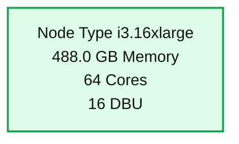
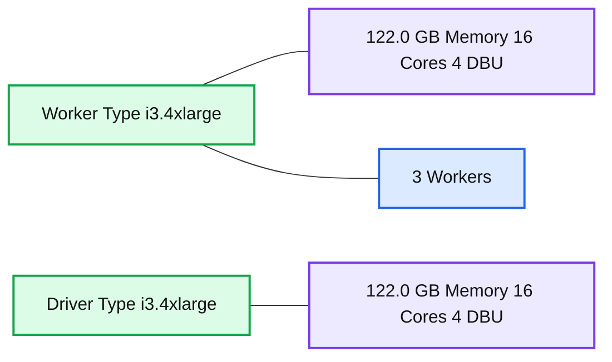
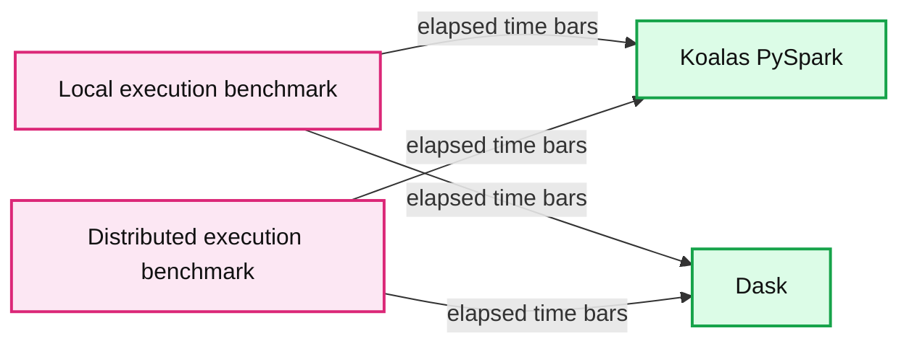
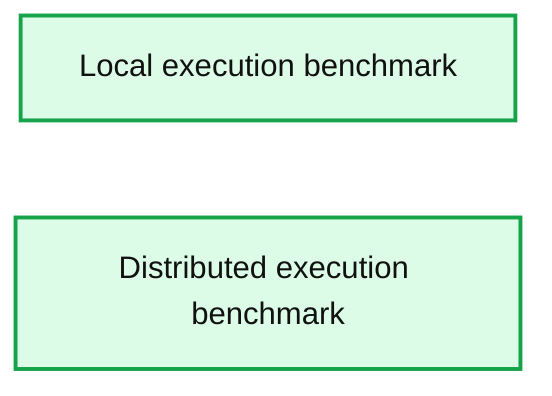
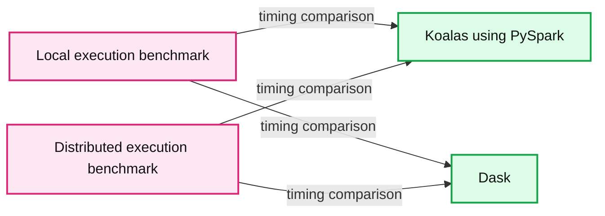
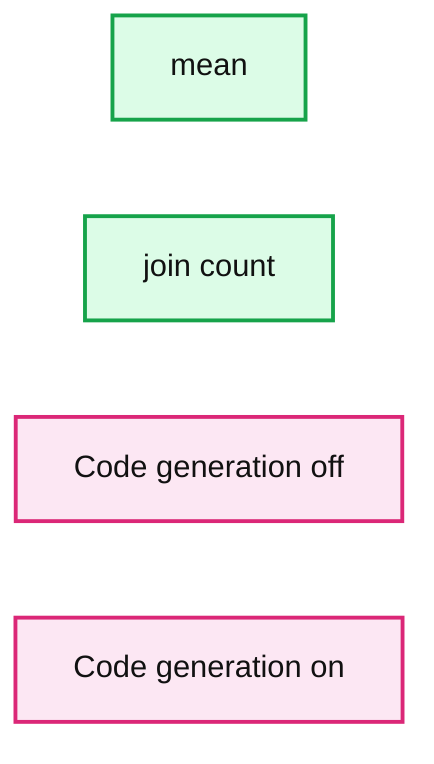

# Benchmark: Koalas (PySpark) and Dask

- Source: https://www.databricks.com/blog/2021/04/07/benchmark-koalas-pyspark-and-dask.html
- Published: 2021-04-07
- Authors: Xinrong Meng, Hyukjin Kwon
- Categories: engineering, open-source
- Images: 6 total, 6 extracted as architecture

[Koalas](https://koalas.readthedocs.io/en/latest/) is a data science library that implements the pandas APIs on top of Apache Spark so data scientists can use their favorite APIs on datasets of all sizes. This blog post compares the performance of [Dask](https://dask.org/)’s implementation of the pandas API and Koalas on PySpark. Using a repeatable benchmark, we have found that **Koalas is 4x faster than Dask on a single node, 8x on a cluster and, in some cases, up to 25x**.

First, we walk through the benchmarking methodology, environment and results of our test. Then, we discuss why Koalas/Spark is significantly faster than Dask by diving into Spark’s optimized SQL engine, which uses sophisticated techniques such as code generation and query optimizations.

## **Methodology**

The benchmark was performed against the 2009 - 2013 Yellow Taxi Trip Records (157 GB) from [NYC Taxi and Limousine Commission (TLC) Trip Record Data](https://www1.nyc.gov/site/tlc/about/tlc-trip-record-data.page). We identified common operations from our pandas workloads such as basic statistical calculations, joins, filtering and grouping on this dataset.

Local and distributed execution were also taken into account in order to cover both single node cases and cluster computing cases comprehensively. The operations were measured with/without filter operations and caching to consider various real-world workloads.

Therefore, we performed the benchmark in the dimensions below:

- Standard operations (local & distributed execution)
- Operations with filtering (local & distributed execution)
- Operations with filtering and caching (local & distributed execution)

### Dataset

The yellow taxi trip record dataset contains CSV files, which consist of 17 columns with numeric and text types. The fields include pick-up and drop-off dates/times, pick-up and drop-off locations, trip distances, itemized fares, rate types, payment types and driver-reported passenger counts. The CSV files were downloaded into [Databricks File System (DBFS)](https://docs.databricks.com/data/databricks-file-system.html), and then were converted into [Parquet](https://parquet.apache.org/) files via Koalas for better efficiency.

### Operations

We analyzed multiple existing pandas workloads and identified several patterns of common operations. Below is some pseudocode of the derived operations.

The operations were executed with/without filtering and caching respectively, to consider the impact of lazy evaluation, caching and related optimizations in both systems, as shown below.

- Standard operations

- Operations with filtering
- The filter operation finds the records that received a tip between $1 - 5 dollars, and it filters down to 36% of the original data.
- Operations with filtering and caching

- When caching was enabled, the data was fully cached before measuring the operations.

For the entire code used in this benchmark, please refer to the notebooks included on the bottom of this blog.

## **Environment**

The benchmark was performed on both a single node for local execution, as well as a cluster with 3 worker nodes for distributed execution. To set the environment up easily, we used Databricks Runtime 7.6 ([Apache Spark 3.0.1](https://docs.databricks.com/release-notes/runtime/releases.html)) and Databricks notebooks.

### System environment

- **Operating System**: Ubuntu 18.04.5 LTS
- **Java**: Zulu 8.50.0.51-CA-linux64 (build 1.8.0_275-b01)
- **Scala**: 2.12.10
- **Python**: 3.7.5

### Python libraries

- **pandas**: 1.1.5
- **PyArrow**: 1.0.1
- **NumPy**: 1.19.5
- **Koalas**: 1.7.0
- **Dask**: 2021.03.0

### Local execution

For local execution, we used a single [i3.16xlarge](https://aws.amazon.com/ec2/instance-types/i3/) VM from AWS that has 488 GB memory and 64 cores with 25 Gigabit Ethernet.

**Summary:** The image shows a Databricks machine specification for local execution.

**Components:**

- Node Type using an i3.16xlarge instance

**Flows:**

- none

**Numbers:**

- 488.0 GB Memory
- 64 Cores
- 16 DBU

source image: https://www.databricks.com/wp-content/uploads/2021/03/benchmark-blog-img-1.png

### Distributed execution

For distributed execution, 3 worker nodes were used with a [i3.4xlarge](https://aws.amazon.com/ec2/instance-types/i3/) VM that has 122 GB memory and 16 cores with (up to) 10 Gigabit Ethernet. This cluster has the same total memory as the single-node configuration.

**Summary:** Machine specification for a distributed execution cluster with three worker nodes and one driver node.

**Components:**

- Worker Type using i3.4xlarge
- Workers with 122.0 GB Memory, 16 Cores, 4 DBU
- Driver Type using i3.4xlarge with 122.0 GB Memory, 16 Cores, 4 DBU

**Flows:**

- none

**Numbers:** 122.0 GB Memory, 16 Cores, 4 DBU, 3 Workers

source image: https://www.databricks.com/wp-content/uploads/2021/03/benchmark-blog-img-2.png

## **Results**

The benchmark results below include overviews with geometric means to explain the general performance differences between Koalas and Dask, and each bar shows the ratio of the elapsed times between Dask and Koalas (Dask / Koalas). Because the Koalas APIs are written on top of PySpark, the results of this benchmark would apply similarly to PySpark.

### Standard operations

**Summary:** Benchmark chart comparing Koalas PySpark and Dask elapsed times for standard operations under local and distributed execution.

**Components:**

- Local execution benchmark
- Distributed execution benchmark
- Koalas PySpark
- Dask
- Standard operations including arithmetic, count, joins, aggregations, series operations, file reading, deviations, and value counts

**Flows:**

- Local execution benchmark -> Koalas PySpark: elapsed time bars
- Local execution benchmark -> Dask: elapsed time bars
- Distributed execution benchmark -> Koalas PySpark: elapsed time bars
- Distributed execution benchmark -> Dask: elapsed time bars

**Numbers:**

- Y axis local elapsed time: 0, 50, 100, 150, 200, 250, 300, 350, 400 sec
- Y axis distributed elapsed time: 0, 25, 50, 75, 100, 125, 150, 175 sec
- Local ratios: 0.9x, 0.9x, 15.9x, 2.0x, 3.2x, 17.6x, 0.5x, 0.4x, 0.4x, 0.4x, 2.3x, 0.9x, 1.0x, 0.3x, 0.3x
- Distributed ratios: 1.3x, 1.6x, 25.0x, 9.0x, 5.4x, 18.9x, 0.7x, 0.6x, 0.7x, 0.6x, 10.5x, 1.5x, 1.4x, 0.7x, 0.6x

source image: https://www.databricks.com/wp-content/uploads/2021/04/koalas-blog-img-resampled-1.jpg

In local execution, Koalas was on average 1.2x faster than Dask:

- In Koalas, join with count (join count) was 17.6x faster.
- In Dask, computing the standard deviation was 3.7x faster.

In distributed execution, Koalas was on average 2.1x faster than Dask:

- In Koalas, the count index operation was 25x faster.
- In Dask, the mean of complex arithmetic operations was 1.8x faster.

### Operations with filtering

**Summary:** Benchmark chart comparing Koalas using PySpark and Dask execution times for filtered operations in local and distributed execution.

**Components:**

- Local execution benchmark using Koalas PySpark
- Local execution benchmark using Dask
- Distributed execution benchmark using Koalas PySpark
- Distributed execution benchmark using Dask
- Operations tested: complex arithmetic, count, count index, groupby statistics, join, join count, mean, mean of complex arithmetic, mean of series addition, mean of series multiplication, series addition, series multiplication, standard deviation, and value counts

**Flows:**

- none

**Numbers:** 2 panels; elapsed time in seconds; local ratios: 2.7x, 11.1x, 10.3x, 6.7x, 3.1x, 8.1x, 9.4x, 3.7x, 9.6x, 7.9x, 4.8x, 4.7x, 7.0x, 8.4x; distributed ratios: 3.5x, 15.4x, 16.7x, 10.6x, 5.0x, 11.4x, 14.0x, 4.4x, 12.9x, 13.1x, 6.1x, 6.0x, 12.8x, 11.7x; visible axis ticks include 0, 20, 25, 40, 50, 60, 75, 80, 100, 120, 125, 140, 150, 160, 175; surrounding text reports 6.4x, 9.2x, 11.1x, 2.7x, and 16.7x.

source image: https://www.databricks.com/wp-content/uploads/2021/04/koalas-blog-img-resampled-2.jpg

In local execution, Koalas was on average 6.4x faster than Dask in all cases:

- In Koalas, the count operation was 11.1x faster.
- Complex arithmetic operations had the smallest gap in which Koalas was 2.7x faster.

In distributed execution, Koalas was on average 9.2x faster than Dask in all cases:

- In Koalas, the count index operation was 16.7x faster.
- Complex arithmetic operations had the smallest gap in which Koalas was 3.5x faster.

### Operations with filtering and caching

**Summary:** Benchmark chart comparing Koalas using PySpark with Dask for filtered and cached operations under local and distributed execution.

**Components:**

- Koalas using PySpark
- Dask
- Local execution benchmark
- Distributed execution benchmark
- Operations: complex arithmetic, count, count index, groupby statistics, join, join count, mean, arithmetic statistics, series addition, series multiplication, standard deviation, value counts

**Flows:**

- Local execution benchmark -> Koalas using PySpark: operation timing comparison
- Local execution benchmark -> Dask: operation timing comparison
- Distributed execution benchmark -> Koalas using PySpark: operation timing comparison
- Distributed execution benchmark -> Dask: operation timing comparison

**Numbers:** Elapsed time in seconds. Local axis: 0, 5, 10, 15, 20, 25, 30, 35. Distributed axis: 0, 10, 20, 30, 40, 50. Visible ratios: 1.3x, 4.0x, 3.8x, 2.1x, 0.7x, 5.9x, 1.6x, 0.8x, 0.7x, 0.7x, 1.3x, 1.3x, 1.5x, 0.3x, 2.4x, 2.6x, 2.8x, 6.1x, 4.5x, 23.8x, 6.2x, 1.8x, 4.9x, 3.7x, 1.7x, 1.9x, 3.0x, 4.7x. Surrounding text states local average 1.4x, join with count 5.9x, value counts 3.6x, distributed average 5.2x, count index 28.6x, and complex arithmetic 3.5x.

source image: https://www.databricks.com/wp-content/uploads/2021/04/koalas-blog-img-resampled-3.jpg

In local execution, Koalas was on average 1.4x faster than Dask:

- In Koalas, join with count (join count) was 5.9x faster.
- In Dask, `Series.value_counts`(value counts) was 3.6x faster.

In distributed execution, Koalas was on average 5.2x faster than Dask in all cases:

- In Koalas, the count index operation was 28.6x faster.
- Complex arithmetic operations had the smallest gap in which Koalas was 1.7x faster.

### Analysis

Koalas (PySpark) was considerably faster than Dask in most cases. The reason seems straightforward because both Koalas and PySpark are based on Spark, [one of the fastest distributed computing engines](https://www.databricks.com/blog/2017/07/12/benchmarking-big-data-sql-platforms-in-the-cloud.html). Spark has a full optimizing SQL engine (Spark SQL) with highly-advanced query plan optimization and code generation. As a rough comparison, Spark SQL has nearly a million lines of code with 1600+ contributors over 11 years, whereas Dask’s code base is around 10% of Spark’s with 400+ contributors around 6 years.

In order to identify which factors contributed to Koalas’ performance the most out of many optimization techniques in Spark SQL, we analyzed these operations executed in distributed manner with filtering when Koalas outperformed Dask most:

- Statistical calculations
- Joins

We dug into the execution and plan optimization aspects for these operations and were able to identify the two most significant factors: code generation and query plan optimization in Spark SQL.

#### Code generation

One of the most important execution optimizations in Spark SQL is code generation. The Spark engine generates optimized bytecodes for each query at runtime, which greatly improves performance. This optimization considerably affected statistical calculations and joins in the benchmark for Koalas by avoiding virtual function dispatches, etc. Please read the [code generation introduction blog post](https://www.databricks.com/blog/2016/05/23/apache-spark-as-a-compiler-joining-a-billion-rows-per-second-on-a-laptop.html) to learn more.

For example, the same benchmark code of mean calculation takes around 8.37 seconds and the join count takes roughly 27.5 seconds with code generation disabled in a Databricks production environment. After enabling the code generation (on by default), calculating the mean takes around 1.26 seconds and the join count takes 2.27 seconds. It is an improvement of 650% and 1200%**, **respectively.

**Summary:** Benchmark chart comparing execution time with code generation disabled versus enabled for mean and join count operations.

**Components:**

- Mean benchmark operation
- Join count benchmark operation
- Code generation off
- Code generation on

**Flows:**

- none

**Numbers:** 0, 10, 20, 30

source image: https://www.databricks.com/wp-content/uploads/2021/03/benchmark-blog-img-7.png

Performance difference by code generation

#### Query plan optimization

Spark SQL has a sophisticated query plan optimizer: [Catalyst](https://www.databricks.com/glossary/catalyst-optimizer), which dynamically optimizes the query plan throughout execution ([Adaptive query execution](https://docs.databricks.com/spark/latest/spark-sql/aqe.html)). In Koalas’ statistics calculations and join with filtering, the Catalyst optimizer also significantly improved the performance.

When Koalas computes the mean without leveraging the Catalyst query optimization, the raw execution plan in Spark SQL is roughly as follows. It uses brute-force to read all columns, and then performs projection multiple times with the filter in the middle before computing the mean.

It applies not only column pruning and filter pushdown but also removes the shuffle step by broadcasting the smaller DataFrame. Internally, it sends the smaller DataFrame to each executor, and performs joins without exchanging data. This removes an unnecessary shuffle and greatly improves the performance.

## **Conclusion**

The results of the benchmark demonstrated that Koalas (PySpark) significantly outperforms Dask in the majority of use cases, with the biggest contributing factors being Spark SQL as the execution engine with many advanced optimization techniques.

Koalas' local and distributed executions of the identified operations were much faster than Dask's as shown below:

- Local execution: 2.1x (geometric mean) and 4x (simple average)
- Distributed execution: 4.6x (geometric mean) and 7.9x (simple average)

Secondly, caching impacted the performance of both Koalas and Dask, and it reduced their elapsed times dramatically.

Lastly, the biggest performance gaps were shown in the distributed execution for statistical calculations and joins with filtering, in which Koalas (PySpark) was 9.2x faster at all identified cases in geometric mean.

We have included the full self-contained notebooks, the dataset and operations, and all settings and benchmark codes for transparency. Please refer to the notebooks below:

- [Dataset](https://docs.databricks.com/_static/notebooks/koalas-benchmark-data-preparation.html)
- [Standard operations (local execution)](https://docs.databricks.com/_static/notebooks/koalas-benchmark-local-execution.html)
- [Standard operations (distributed execution)](https://docs.databricks.com/_static/notebooks/koalas-benchmark-distributed-execution.html)
- [Operations with filtering (local execution)](https://docs.databricks.com/_static/notebooks/koalas-benchmark-local-execution.html)
- [Operations with filtering (distributed execution)](https://docs.databricks.com/_static/notebooks/koalas-benchmark-distributed-execution.html)
- [Operations with filtering and caching (local execution)](https://docs.databricks.com/_static/notebooks/koalas-benchmark-local-execution-with-caching.html)
- [Operations with filtering and caching (distributed execution)](https://docs.databricks.com/_static/notebooks/koalas-benchmark-distributed-execution-with-caching.html)
- [Local execution summary](https://docs.databricks.com/_static/notebooks/koalas-benchmark-local-execution-summary.html)
- [Distributed execution summary](https://docs.databricks.com/_static/notebooks/koalas-benchmark-distributed-execution-summary.html)
