# Identifying Financial Fraud With Geospatial Clustering

- Source: https://www.databricks.com/blog/2021/04/13/identifying-financial-fraud-with-geospatial-clustering.html
- Published: 2021-04-13
- Authors: Antoine Amend
- Categories: engineering, solution-accelerators
- Images: 7 total, 1 extracted as architecture

[Check out the solution accelerator for the accompanying notebooks](https://www.databricks.com/solutions/accelerators/identifying-fraud)

For most financial service institutions (FSI), fraud prevention often implies a complex ecosystem made of various components –- a mixture of traditional rules-based controls and artificial intelligence (AI) and a patchwork of on-premises systems, proprietary frameworks and open source cloud technologies. Combined with strict regulatory requirements (such as model explainability), high governance frameworks, low latency and high availability (sub second response time for card transactions), these systems are costly to operate, hard to maintain and even harder to adapt to customers changing behaviors and fraudsters alike. Similar to [risk management](https://www.databricks.com/blog/2020/05/27/modernizing-risk-management-part-1-streaming-data-ingestion-rapid-model-development-and-monte-carlo-simulations-at-scale.html), a modern fraud prevention strategy must be agile at its core and combines a collaborative data-centered operating model with an established delivery strategy of code, data and machine learning (ML) such as DataOps, DevOps and [MLOps](https://www.databricks.com/glossary/mlops). In a previous [solution accelerator](https://www.databricks.com/blog/2021/01/19/combining-rules-based-and-ai-models-to-combat-financial-fraud.html), we addressed the problem of combining rules with AI in a common [orchestration](https://www.databricks.com/glossary/orchestration) framework powered by MLflow.

As consumers become more digitally engaged, large FSIs often have access to real-time GPS coordinates of every purchase made by their customers. With around 40 billion card transactions processed in the US every year, retail banks have a lot of data they can leverage to better understand transaction behaviors for customers opting into GPS-enabled banking applications. Given the data volume and complexity, it often requires access to a large amount of compute resources and cutting-edge libraries to run geospatial analytics that do not "fit well" within a traditional data warehouse and relational database paradigm.

Geospatial clustering to identify customer spending behaviors

In this solution centered around geospatial analytics, we show how the Databricks Lakehouse Platform enables organizations to better understand customers spending behaviors in terms of both *who* they are and *how* they bank. This is not a one-size-fits-all based model, but truly personalized AI. After all, identifying abnormal patterns can only be achieved with the ability to first understand what normal behaviour is, and doing so for millions of customers is a challenge that requires data and AI combined into one platform.

*Geospatial clustering as part of a fraud prevention strategy*

**Summary:** The diagram shows card transactions flowing through raw data ingestion, geospatial clustering, user behavior analysis, and an MLflow-based fraud prevention framework with an ODS.

**Components:**

- Card transactions
- Data ingestion pipeline using Databricks-related technologies
- MLflow fraud prevention framework with machine learning components
- ODS using MongoDB, Redis, and Databricks storage
- Raw transactions using Azure
- Geospatial clustering
- User behaviour using Azure
- Fraud alert

**Flows:**

- Card transactions -> Data ingestion pipeline: transaction data
- Data ingestion pipeline -> MLflow fraud prevention framework: transaction data and features
- Data ingestion pipeline -> Raw transactions: raw transaction records
- MLflow fraud prevention framework -> Fraud alert: detected anomalies
- MLflow fraud prevention framework -> ODS: model and operational data exchange
- ODS -> MLflow fraud prevention framework: operational data and feedback
- Raw transactions -> Geospatial clustering: raw transaction locations
- Geospatial clustering -> User behaviour: clustered geospatial behavior signals
- User behaviour -> Geospatial clustering: behavioral feedback signals
- User behaviour -> ODS: user behavior data

**Numbers:** none

```mermaid
%% Shows card transaction processing and geospatial fraud detection
flowchart LR
    CT[Card transactions] -->|transaction data| ING[Data ingestion pipeline]
    ING -->|data and features| MF[MLflow fraud prevention framework]
    ING -->|raw records| RT[Raw transactions]
    MF -->|detected anomalies| FA[Fraud alert]
    MF <-->|operational data and feedback| ODS[ODS]
    RT -->|transaction locations| GC[Geospatial clustering]
    GC <-->|behavior signals| UB[User behaviour]
    UB -->|user behavior data| ODS

    classDef client fill:#dbeafe,stroke:#2563eb,stroke-width:2px,color:#111
    classDef service fill:#dcfce7,stroke:#16a34a,stroke-width:2px,color:#111
    classDef store fill:#ede9fe,stroke:#7c3aed,stroke-width:2px,color:#111
    classDef cache fill:#fef3c7,stroke:#d97706,stroke-width:2px,color:#111
    classDef queue fill:#cffafe,stroke:#0891b2,stroke-width:2px,color:#111
    classDef critical fill:#fee2e2,stroke:#dc2626,stroke-width:4px,color:#111
    classDef external fill:#e5e7eb,stroke:#6b7280,stroke-width:2px,color:#111,stroke-dasharray:4 3
    classDef decision fill:#fce7f3,stroke:#db2777,stroke-width:2px,color:#111

    class CT client
    class ING,MF,GC,UB service
    class ODS,RT store
    class FA critical
```

source image: https://www.databricks.com/wp-content/uploads/2021/04/geo-ai-fraud-det-img-2.png

Geospatial clustering as part of a fraud prevention strategy

As part of this real-world solution, we are releasing a new open source geospatial library, [GEOSCAN](https://github.com/databrickslabs/geoscan), to detect geospatial behaviors at massive scale, track customers patterns over time and detect anomalous card transactions. Finally, we demonstrate how organizations can surface anomalies from an analytics environment to an online data store (ODS) with tight SLA requirements following a Lambda-like infrastructure underpinned by [Delta Lake](https://delta.io/), Apache Spark and [MLflow](https://mlflow.org/).

## Geospatial clustering of card transactions

[DBSCAN](https://www.aaai.org/Papers/KDD/1996/KDD96-037.pdf) (density-based spatial clustering of applications with noise) is a common ML technique used to group points that are closely packed together. Compared to other clustering methodologies, it doesn't require you to indicate the number of clusters beforehand, can detect clusters of varying shapes and sizes and effectively finds outliers that don't belong in any dense area. This makes it a great candidate for geospatial analysis of credit card transactions and potentially fraudulent activities. However, it comes with a serious price tag: DBSCAN requires all points to be compared to every other point to find dense neighbourhoods, which is a significant limitation given the scale large FSIs operate at. As we could not find a viable solution that can scale to millions of customers or more than a few hundreds of thousands of records, we created our own [open source AI library: GEOSCAN](https://github.com/databrickslabs/geoscan). Available with both Scala and Python APIs, GEOSCAN is our implementation of DBSCAN algorithm for geospatial clustering at big data scale.

Density based clustering (DBSCAN)

Leveraging Uber’s H3 library to only group points we know are in close vicinity (sharing at least one H3 polygon) and relying on [GraphX API](https://spark.apache.org/docs/latest/graphx-programming-guide.html), this can detect dense areas at massive scale, understand user spending behaviors and detect anomalous transactions in near real time.

In order to validate our framework, we created a synthetic dataset of credit card transactions in the NYC area. Our dataset only contains a tokenized value for users, a geospatial coordinate (as `latitude` and `longitude`), a `timestamp` and a transaction `amount`. In real life, the same should also contain additional transaction context (such as merchant narrative or MCC code) and often has been enriched with clean brand information (the latter will be addressed as part of a future [Databricks Solution Accelerator](https://www.databricks.com/solutions/accelerators)). In this demo, we will extract dense clusters that correspond to areas with higher transaction activities such as high streets and shopping malls.

There are two modes supported by our GEOSCAN implementation, distributed and pseudo distributed.

1. For distributed, our framework detects clusters from an entire dataframe (i.e. across all our users base).
2. For, pseudo-distributed, it retrieves clusters for a grouped predicate, hence training millions of models for millions of customers in parallel. Both modes are useful to better understand customers’ shopping behaviour for a personalized fraud prevention strategy.

### Detecting dense shopping areas

Working fully distributed, the core of the GEOSCAN algorithm relies on GraphX to detect points having `distance (expressed in meters) and neighbors > minPoints.`

`As a strong advocate of open standard, we built GEOSCAN to support `[`RFC7946`](https://datatracker.ietf.org/doc/html/rfc7946)` (aka GeoJSON) as a model output that can be processed as-is with any geospatial library (such as geopandas), GIS database (geomesa) or visualization (folium). As represented below, MLflow natively supports the use of GeoJSON as a model artifact.`

`MLflow displaying GeoJSON file format`

`Let’s walk through an example of GEOSCAN in action. With this solution, we have programmatically extracted geographical shapes corresponding to high density of card transactions in the New York City (NYC) area. As represented above, our parameters resulted in a relatively large shape covering most of NYC. Although reducing minPts value or increasing epsilon could help refine that shape, it may certainly impact less dense areas such as Williamsburg in Brooklyn. Largely domain-specific, we explore different approaches to tune our model and improve performance in the notebooks reported at the end of this blog.`

### `Model inference and cluster tiling`

`As the core of GEOSCAN logic relies on the use of H3 polygons, it becomes natural to leverage the same for model inference instead of bringing in extra GIS dependencies for `[`expensive points in polygons queries`](https://en.wikipedia.org/wiki/Point_in_polygon)`. Our approach consists in "tiling" our clusters with H3 hexagons that can easily be joined to our original dataframe, exploiting at best Delta Lake optimizations (such as `[`ZORDER`](https://docs.databricks.com/spark/latest/spark-sql/language-manual/delta-optimize.html)` indexing) and offering complex geospatial queries as a form of a simple SQL operation.`

`Tiling a geo shape with H3 hexagons`

### `Personalized clustering`

`We have demonstrated how GEOSCAN can be used across our entire dataset. However, the aim was not to machine learn the shape of NYC, nor to find the best place to go shopping, but to track user spending behaviour over time and - most importantly - where transactions are the least expected to happen for a given customer, therefore requiring a personalized approach to geospatial clustering.`

`Similar to our distributed approach, models can be stored and retrieved as per the standard Spark ML API. In this mode, we return a dataframe made of GeoJSON objects rather than a single file in which each card holder has an associated record capturing their spending geographical patterns.`

### `Understanding customer specific patterns`

`It is important to step back and reflect on the insights gained so far. As we learn more about our entire customer base (distributed approach), we could leverage this information to better understand the behaviour that is specific to each individual. If everyone were to shop at the same location, such an area would be less specific to a particular user. We can detect "personalized" zones as how much they overlap with common areas, better understanding our end customers and pave the way towards truly personalized banking.`

`Detecting areas that are the most descriptive for each user is similar to detecting keywords that are more descriptive to each sentence in Natural Language processing use cases. We can use a Term Frequency / Inverse document frequency (TF-IDF) approach to increase the weight of user-specific locations while reducing weight around common areas.`

`Geographical spending patterns for a given customer`

`We suddenly have gained incredible insights about our customers' shopping behaviour. Although the core of this user’s transactions are made in the Chelsea and financial district areas of NYC, what seems to better define this user are their transactions around the Plaza Hotel on the 5th avenue and Williamsburg. Given a specific user and a location, this framework can be used to better understand whether a card transaction falls within a known shopping pattern at a specific time of day or day of the week.`

## `Fraud prevention using personalized AI`

`In the previous section, we showed that geospatial data analysis can tell us a lot of information about customers behaviour and trends, hence a critical component to anomaly detection model in an over-hatching fraud prevention strategy. In this section, we demonstrate how to use these insights to detect suspicious behaviour in real time. More often than not, fraud detection systems run outside of an analytics environment due to the combination of data sensitivity (PII), regulatory requirements (PCI/DSS) and model materiality (high SLAs and low latency). For these reasons, we explore multiple strategies to serve our insights either as a self-contained framework using MLflow or through a relational or NoSQL online datastore such as Redis, MongoDB, Redshift or ElastiCache, although many other solutions may be viable.`

### `Extracting anomalies`

`Since we have stored and indexed all of our personalized ML models as H3 polygons in a Delta table, it becomes easy to enrich each transaction with their cluster using a simple JOIN operation. In the example below, we can extract anomalies (transactions not matching any known pattern of a given user) given a specific H3 resolution (see `[`resolution table`](https://h3geo.org/docs/core-library/restable/)`) embedded in a user defined function.`

`Out of half a million transactions, we extracted 81 records in less than 5 seconds. Not necessarily fraudulent, maybe not even suspicious, but these transactions did not match any of our users’ "normal" behaviors, and as such, should be flagged as part of an over-hatching fraud prevention framework and further combined with other rules and models. In a real-life example, we should factor for time and additional transactional context. Would the same transaction happening on a Sunday afternoon or a Wednesday morning be suspicious given user characteristics we could learn?`

`With millions of transactions and low latency requirements, it would not be realistic to join these large datasets in real time. Although we could load all clusters (their H3 tiles) in memory, we may have evaluated multiple models at different time of the days, for different segments, different transaction indicators (e.g. for different brand category or `[`MCC codes`](https://en.wikipedia.org/wiki/Merchant_category_code)`) and for millions of consumers resulting in a complex system that requires efficient lookup strategies against millions of variables.`

### `Bloom filtering`

`Here comes `[`Bloom filters`](https://en.wikipedia.org/wiki/Bloom_filter)`, an efficient probabilistic data structure that can test the existence of a given record without keeping an entire set in memory. Although Bloom filters have been around for a long time, its usage has not - sadly - been democratized beyond blurry engineering techniques such as database optimization engines and daunting execution planners (Delta engine leverages Bloom filters optimizations under the hood, among other techniques). This technique is a powerful tool worth having in a modern data science toolkit.`

`The concept of a Bloom filter is to convert a series of records (in our case, a card transaction location as a H3 polygon) into a series of hash values, overlaying each of their byte arrays representations as vectors of 1 and 0. Testing the existence of a given record results in testing the existence of each of its bits set to 1. The memory efficiency of Bloom filters comes with a non-negligible downside in the context of fraud detection. Although Bloom filters offer a false negative rate of 0, there is a non-zero false positive rate (records we wrongly assume have been seen due to hash collision) that can be controlled by the length of our array and the number of hash functions.`

`We will be using the pybloomfilter Python library to validate this approach, training a Bloom filter against each and every known H3 tile of every given user. Although our filter may logically contain millions of records, we would only need to physically maintain 1 byte array in memory to enable a probabilistic search, sacrificing 1% of anomalous transactions (our false positive rate) for higher execution speed.`

`Testing the (in-)existence of a specific card transaction location can be enabled at lightning speed.`

`In the notebooks listed in this blog, we demonstrate how data scientists can embed that business logic as an MLflow experiment that can be further delivered to a batch or stream processing or to external APIs with higher throughput requirements (see `[`MLflow deployments`](https://www.mlflow.org/docs/latest/python_api/index.html)`).`

`However, this approach poses an important operational challenge for large financial services organizations, as new models would need to be constantly retrained and redeployed to adapt to users changing behaviors.`

`Let's take an example of a user going on holidays. Although their first card transactions may be returned as anomalous (not necessarily suspicious), such a strategy would need to adapt and learn the new "normal" as more and more transactions are observed. One would need to run the same process with new training data, resulting in a new version of a model being released, reviewed by an independent team of experts, approved by a governance entity and eventually updated to a fraud production endpoint outside of any change freeze. Technically possible and definitely made easier with Databricks due to the platform’s collaborative approach to data management, this approach may not be viable for many.`

### `Online data store`

`It is fairly common for financial services institutions to have an online data store decoupled from an analytics platform. A real-time flow of incoming card transactions usually accessed from an enterprise message broker such as Kafka, Event Hub (Azure) or Kinesis (AWS) are compared with reference data points in real time. An alternative approach to the above is to use an online datastore (like MongoDB) to keep "pushing" reference data points to a live endpoint as a business as usual process (hence outside of ITSM change windows). Any incoming transaction would be matched against a set of rules constantly updated and accessible via sub-seconds look up queries. Using `[`MongoDB connector`](https://docs.mongodb.com/spark-connector/current/)` (as an example), we show how organizations can save our geo clusters dataframes for real-time serving, combining the predictive power of advanced analytics with low latency and explainability of traditional rules-based systems.`

`In the example above, we append new reference data (card transaction H3 location) to a MongoDB collection (i.e. a table) for each of our millions card holders at regular time intervals. In that setting, new transactions can be compared to reference historical data stored on MongoDB as a simple request. Given a user and a transaction location (as a H3 polygon), is this card transaction happening in a known user pattern?`

`As part of this solution, we want to leverage another built-in capability of MongoDB: `[`Time to Live`](https://docs.mongodb.com/manual/tutorial/expire-data/)` (TTL). Besides the operation benefits of not having to maintain this collection (records are purged after TTL expires), we can bring a temporal dimension to our model in order to cope with users changing patterns. With a TTL of 1 week (for example) and a new model trained on Databricks every day, we can track clusters over time while dynamically adapting our fraud strategy as new transactions are being observed, purposely drifting our model to follow users’ changing behaviors.`

``

`*Example of how change in customers' transactional behaviors could be tracked over time*`

`In the visualization above, we show an example of how change in customers' transactional behaviors could be tracked over time (thanks to our TTL on MongoDB in real time and / or time travel functionality on Delta), where any observed location stays active for a period of X days and wherein anomalous transactions can be detected in real time.`

## `Closing thoughts: Geospatial analytics for customer-centric banking`

`Card fraud transactions will never be addressed by a one-size-fits-all model but should always contextualize isolated indicators coming from different controls as part of an over-hatching fraud prevention strategy. Often, this combines advanced modeling techniques (such as neural networks) with rules-based systems, integrates advanced technologies and legacy processes, cloud-based infrastructures and on-premises systems, and must comply with tight regulatory requirements and critical SLAs. Although this solution does not aim at identifying fraudulent transactions on its own, we demonstrated through the release of a new open source library, `[`GEOSCAN`](https://github.com/databrickslabs/geoscan)`, how geospatial analytics can greatly contribute to extracting anomalous events in a timely, cost-effective (self maintained) and fully-explainable manner, hence a great candidate to combat financial fraud more effectively in a coordinated rules + AI strategy.`

`As part of this exercise, we also discovered something equally important in financial services. We demonstrated the ability of the Lakehouse infrastructure to transition from traditional to personalized banking where consumers are no longer segmented by demographics (who they are) but by their spending patterns (how they bank), paving the way towards a more customer-centric and inclusive future of retail banking.`

## `Getting started`

`Check out the `[`solution accelerator`](https://www.databricks.com/solutions/accelerators/identifying-fraud)` and try these notebooks on Databricks to accelerate your fraud prevention development strategy today and `[`contact us`](https://www.databricks.com/company/contact)` to learn more about how we assist customers with similar use cases.`
