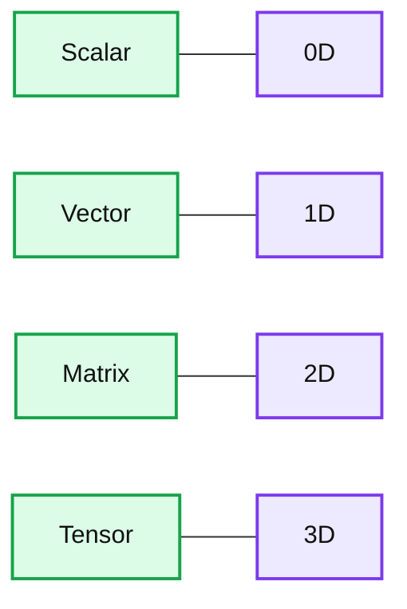
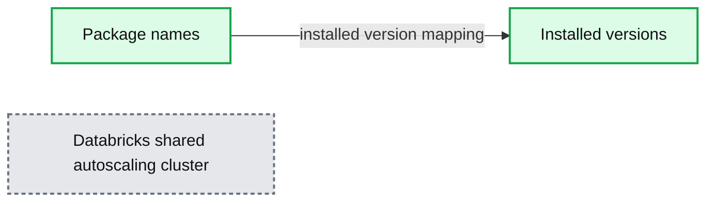

# 7 Reasons to Learn PyTorch on Databricks

- Source: https://www.databricks.com/blog/2021/04/14/7-reasons-to-learn-pytorch-on-databricks.html
- Published: 2021-04-14
- Authors: Jules Damji
- Categories: engineering, open-source
- Images: 20 total, 3 extracted as architecture

*Free Edition has replaced Community Edition, offering enhanced features at no cost. Start using *[*Free Edition *](https://login.databricks.com/?intent=SIGN_UP&amp;signup_experience_step=EXPRESS&amp;provider=DB_FREE_TIER&amp;dbx_source=www)*today.*
 

What expedites the process of learning new concepts, languages or systems? When learning a new task, do you look for analogs from skills you already possess?

Across all learning endeavors, three favorable characteristics stand out: familiarity, clarity and simplicity. Familiarity eases the transition because of a recognizable link between the old and new ways of doing. Clarity minimizes the cognitive burden. And simplicity reduces the friction in the adoption of the unknown and, as a result, increases the fruition of learning a new concept, language or system.

Aside from being popular among researchers, gaining adoption by machine learning practitioners in production, and having a vibrant community,[PyTorch](https://pytorch.org/) has a familiar feel to it, easy to learn, and you can employ it for your machine learning use cases.

Keeping these characteristics in mind, we examine in this blog several reasons why it's easy to learn PyTorch, and how the [Databricks Lakehouse Platform](https://www.databricks.com/product/data-lakehouse) facilitates the learning process.

## 1a. PyTorch is *Pythonic*

Luciano Ramalho in *Fluent Python* defines *Pythonic* as an idiomatic way to use Python code that makes use of language features to be concise and readable. Python object constructs follow a certain protocol, and their behaviors adhere to a consistent pattern across classes, iterators, generators, sequences, context managers, modules, coroutines, decorators, etc. Even with little familiarity with the Python [data model](https://docs.python.org/3/reference/datamodel.html), modules and language constructs, you recognize similar constructs in [PyTorch APIs](https://pytorch.org/docs/stable/nn.html), such as a `torch.tensor, torch.nn.Module, torch.utils.data.Datasets, torch.utils.data.DataLoaders` etc. Another aspect is the concise code you can write in PyTorch as with PyData packages such as Pandas, scikit-learn or SciPy.

PyTorch integrates with the PyData ecosystem, so your familiarity with [NumPy](https://numpy.org/) makes learning [Torch Tensors](https://pytorch.org/docs/stable/tensors.html) incredibly simple. NumPy arrays and tensors have similar data structures and operations. Just as DataFrames are central data structures to [Apache Spark™](https://spark.apache.org/) operations, so are tensors as inputs to PyTorch models, training operations, computations and scoring. A PyTorch tensor's mental image (shown in the diagram below) maps to an n-dimensional NumPy array.

**Summary:** The diagram maps scalars, vectors, matrices, and tensors to zero through three dimensions.

**Components:**

- Scalar
- Vector
- Matrix
- Tensor
- Dimensions 0D, 1D, 2D, and 3D

**Flows:**

- none

**Numbers:** 1, 2, 3, 4, 0D, 1D, 2D, 3D

source image: https://www.databricks.com/wp-content/uploads/2021/04/learn-pytorch-blog-img-2.png

For instance, you can seamlessly create NumPy arrays and convert them into Torch tensors. Familiarity with NumPy operations transfers to tensor operations, as shown in the code below.

Both have familiar, imperative and intuitive operations that one would expect from Python object APIs, such as lists, tuples, dictionaries, sets, etc. All this familiarity with NumPy's equivalent array operations on Torch tensors helps. Consider these examples:

The latest release of [PyTorch 1.8.0](https://pytorch.org/blog/the-torch.fft-module-accelerated-fast-fourier-transforms-with-autograd-in-pyTorch/) further builds on this analog operation between PyTorch tensors and NumPy for fast Fourier transformation series.

## 1b. Easy-to-extend PyTorch nn Modules

PyTorch library includes [neural network modules](https://pytorch.org/docs/stable/nn.html) to build a layered network architecture. In PyTorch parlance, these modules comprise each layer of your network. Derived from its base class module `torch.nn.Module`, you can easily create a simple or complex layered neural network. To define a PyTorch customized network module class and its methods, you follow a similar pattern to build a customized Python object class derived from its base class object. Let's define a simple [two-layered](https://pytorch.org/tutorials/beginner/examples_nn/two_layer_net_module.html#pytorch-custom-nn-modules) linear network example.

Notice that the custom `TwoLayeredNet` below is Pythonic in its flow and structure. Derived classes from the `torch.nn.Module` have class initializers with parameters, define interface methods, and are callable. That is, the base class `torch.nn.Module` implements the Python magic `__call__()` object method. Although the two-layered model is simple, it demonstrates this familiarity with extending a class from Python's base object.

Furthermore, you get an intuitive feeling that you are writing or reading Python application code while using PyTorch APIs –the syntax, structure, form and behavior are all too familiar. The unfamiliar bits are the PyTorch modules and the APIs, which are no different when learning a new PyData package APIs and incorporating them into your Python application code.

For more* Pythonic* code, read the [accompanying notebook](https://www.databricks.com/notebooks/seven-reasons-to-learn-pytorch-on-databricks.html) on the imperative nature of PyTorch code for writing training loops and loss functions, familiar Python iterative constructs, and using the cuda library for GPUs.

Now we define a simple training loop with some iterations, using Python familiar language constructs.

What follows is a recognizable pattern and flow between a Python's customized class and a simple PyTorch neural network. Also, the code reads like Python code. Another recognizable Pythonic pattern in PyTorch is how `Dataset` and `DataLoaders` use Python protocols to build iterators.

## 1c. Easy-to-customize PyTorch Dataset for Dataloaders

At the core of PyTorch data loading utility is the `torch.utils.data.DataLoader` class. It is an integral part of the PyTorch iterative training process, which iterates over batches of input during an epoch of training. `DataLoaders` implements a Python sequence and iterable protocol, which includes implementing `__len__` and `__getitem__ `magic methods on an object. Again, very Pythonic in behavior; as part of the implementation, we employ list comprehensions, use NumPy arrays to convert to tensors and use random access to fetch nth data item — all conforming to familiar access patterns and behaviors of doing things in Python.

Let's look at a simple custom `Dataset` of temperatures for use in training a model. Other complex datasets could be images, extensive features datasets of tensors, etc.

A PyTorch `Dataloader` class takes an instance of a customized `FahrenheitTemperatures` class object as a parameter. This utility class is standard in PyTorch training loops. It offers an ability to iterate over batches of data like an iterator: again, a very Pythonic and straightforward way of doing things!

Since we implemented our custom `Dataset`, let's use it in the PyTorch training loop.

Although the aforementioned *Pythonic* reasons are not directly related to [Databricks Lakehouse Platform](https://www.databricks.com/product/data-lakehouse), they account for ideas of familiarity, clarity, simplicity, and the *Pythonic* way of writing PyTorch code. Next, we examine what aspects within the Databricks Lakehouse Platform's runtime for machine learning facilitate learning PyTorch.

## 2. No need to install Python packages

As part of the Databricks Lakehouse Platform, the runtime for machine learning (ML) comes preinstalled with the latest versions of Python, PyTorch, PyData ecosystem packages and additional standard ML libraries, saving you from installing or managing any packages. Out-of-the-box and ready-to-use-runtime environments also unburden you from needing to control or install packages. If you want to install additional Python packages, simply use `%pip install`. This ability to support [package management](https://www.databricks.com/blog/2020/06/17/simplify-python-environment-management-on-databricks-runtime-for-machine-learning-using-pip-and-conda.html) on your cluster is popular among Databricks customers and widely used as part of their development model lifecycle.

To inspect the list of all preinstalled packages, use the `pip list`.

**Summary:** The image shows a Databricks preinstalled package table with package names and their installed versions.

**Components:**

- `Package` column using Python package names
- `Version` column using installed package versions
- `absl-py`
- `aiohttp`
- `asn1crypto`
- `astor`
- `astunparse`
- `async-timeout`
- `attrs`
- `azure-core`
- `azure-storage-blob`
- `backcall`
- `bcrypt`
- `blinker`
- `boto3`
- `botocore`
- `brotli-py`
- `cachetools`
- `certifi`
- `cffi`
- `chardet`
- Databricks shared autoscaling cluster

**Flows:**

- Package -> Version: installed package version mapping

**Numbers:** 0.11.0, 3.6.3, 1.4.0, 0.8.1, 1.6.3, 3.0.1, 20.3.0, 1.10.0, 12.7.1, 0.2.0, 3.2.0, 1.4, 1.16.7, 1.19.7, 0.7.0, 4.2.1, 2020.12.5, 1.14.3, 3.0.4, 0.57 seconds, 3/25/2021, 2:42:09 PM

source image: https://www.databricks.com/wp-content/uploads/2021/04/learn-pytorch-blog-img-12.jpg

## 3. Easy-to-Use CPUs or GPUs

Neural networks for deep learning involve numeric-intensive computations, including dot products and matrix multiplications on large and higher-ranked tensors. For compute-bound PyTorch applications that require GPUs, create a cluster of MLR with GPUs and consign your data to use GPUs. As such, all training can be done on GPUs, as the above example of `TwoLayeredNet` demonstrates using `cuda`.

Note that this example shows simple code, and showing matrix multiplication of two randomly generated tensors, real PyTorch applications will have much more intense computation during their forward and backward passes and [auto-grad](https://pytorch.org/tutorials/beginner/blitz/autograd_tutorial.html) computations.

## 4. Easy-to-Use TensorBoard

[Already announced in a blog](https://www.databricks.com/blog/2020/08/25/tensorboard-a-new-way-to-use-tensorboard-on-databricks.html) as part of the Databricks Runtime (DBR), this magic command displays your training metrics from [TensorBoard](https://www.tensorflow.org/tensorboard) within the same notebook. No longer do you need to leave your notebook and launch TensorBoard from another tab. This in-place TensorBoard visualization is a significant improvement toward simplicity and developer experience. And PyTorch developers can quickly see their metrics in TensorBoard.

Let's try to run a sample [PyTorch FashionMNIST example](https://pytorch.org/docs/stable/tensorboard.html) with TensorBoard logging.
First, define a SummaryWriter, followed by the FashionMNIST `Dataset` in the `DataLoader` in our PyTorch `torchvision.models.resnet50` model.

Using Databricks notebook's magic commands, you can launch the TensorBoard within your cell and examine the training metrics and model outputs.

`%load_ext tensorboard`

`%tensorboard --logdir=./runs`

## 5. PyTorch Integrated with MLflow

In our steadfast effort to make Databricks simpler, we enhanced [MLflow fluent tracking APIs](https://mlflow.org/docs/latest/python_api/mlflow.html#mlflow.autolog) to autolog MLflow entities—metrics, tags, parameters and artifacts—for supported ML libraries, including PyTorch Lightning. Through the MLflow UI, an integral part of the workspace, you can access all MLflow experiments via the `Experiment` icon in the upper right corner. All experiment runs during training are automatically logged to the MLflow tracking server. No need for you to explicitly use the tracking APIs to log MLflow entities, albeit it does not prevent you from tracking and logging any additional entities such as images, dictionaries, or text artifacts.

Here is a minimal example of a PyTorch Lightning FashionMNIST instance with just a training loop step (no validation, no testing). It illustrates how you can use MLflow to autolog MLflow entities, peruse the MLflow UI to inspect its runs from within this notebook, register the model and [serve or deploy](https://docs.databricks.com/applications/mlflow/model-serving.html) it.

Create the PyTorch model as you would create a Python class, use the `FashionMNIST DataLoader` a PyTorch Lightning Trainer and autolog all MLflow entities during its `trainer.fit()` method.

## 6. Convert MLflow PyTorch-logged Models to TorchScript

[TorchScript](https://pytorch.org/docs/stable/jit.html) is a way to create serializable and optimizable models from PyTorch code. We can convert a PyTorch MLflow-logged model into a TorchScript format, save, and load (or deploy to) a high-performance and independent process. Or [deploy and serve on Databricks cluster](https://docs.databricks.com/applications/mlflow/model-serving.html) as an endpoint.

The process entails the following steps:

1. Create an MLflow PyTorch model
2. Compile the model using JIT and convert it to the TorchScript model
3. Log or save the TorchScript model
4. Load or deploy the TorchScript model

**Summary:** The image shows a PyTorch model workflow that creates, scripts, trains, logs, loads, and evaluates an Iris classifier using MLflow.

**Components:**

- Iris classifier using PyTorch
- Training data and test data
- TorchScript model using PyTorch JIT
- MLflow run
- MLflow model artifact storage
- Loaded PyTorch model
- Prediction result and target labels

**Flows:**

- Iris classifier -> Device: moves model to the target device
- Training data and test data -> Iris classifier: prepares training and evaluation data
- Iris classifier -> TorchScript model: compiles the model using JIT scripting
- TorchScript model -> TorchScript model: trains the scripted model
- TorchScript model -> Prediction result: evaluates test data
- TorchScript model -> MLflow run: logs the model
- MLflow run -> MLflow model artifact storage: stores the model artifact
- MLflow model artifact storage -> Loaded PyTorch model: loads the logged model
- Loaded PyTorch model -> Prediction result: generates a prediction
- Prediction result -> Target labels: maps the predicted class to a target name

**Numbers:** 1, 2, 3, 0.2000, 1.3000, 3.0000, 4.4000, and line numbers 85 through 103

```mermaid
%% Shows the PyTorch TorchScript and MLflow model workflow
flowchart LR
    D[Device]
    DATA[Training data and test data]
    MODEL[Iris classifier]
    SCRIPT[TorchScript model]
    PRED[Prediction result]
    LABELS[Target labels]
    RUN[MLflow run]
    STORE[MLflow model artifact storage]
    LOADED[Loaded PyTorch model]

    MODEL -->|move to device| D
    DATA -->|prepare data| MODEL
    MODEL -->|JIT script| SCRIPT
    SCRIPT -->|train model| SCRIPT
    SCRIPT -->|test model| PRED
    SCRIPT -->|log model| RUN
    RUN -->|store artifact| STORE
    STORE -->|load model| LOADED
    LOADED -->|generate prediction| PRED
    PRED -->|map class| LABELS

    classDef client   fill:#dbeafe,stroke:#2563eb,stroke-width:2px,color:#111
    classDef service  fill:#dcfce7,stroke:#16a34a,stroke-width:2px,color:#111
    classDef store    fill:#ede9fe,stroke:#7c3aed,stroke-width:2px,color:#111
    classDef cache    fill:#fef3c7,stroke:#d97706,stroke-width:2px,color:#111
    classDef queue    fill:#cffafe,stroke:#0891b2,stroke-width:2px,color:#111
    classDef critical fill:#fee2e2,stroke:#dc2626,stroke-width:4px,color:#111
    classDef external fill:#e5e7eb,stroke:#6b7280,stroke-width:2px,color:#111,stroke-dasharray:4 3
    classDef decision fill:#fce7f3,stroke:#db2777,stroke-width:2px,color:#111

    class D,DATA client
    class MODEL,SCRIPT,PRED,LABELS,LOADED service
    class RUN service
    class STORE store
```

source image: https://www.databricks.com/wp-content/uploads/2021/04/learn-pytorch-blog-img-18-opt.jpg

 

We have not included all the code here for brevity, but you can examine the sample code—[IrisClassification](https://github.com/mlflow/mlflow/blob/master/examples/pytorch/torchscript/IrisClassification/iris_classification.py) and [MNIST](https://github.com/mlflow/mlflow/blob/master/examples/pytorch/torchscript/MNIST/mnist_torchscript.py)—in the [GitHub MLflow examples](https://github.com/mlflow/mlflow/tree/master/examples/pytorch/torchscript) directory.

## 7. Ready-to-run PyTorch Tutorials for Distributed Training

Lastly, you can use the Databricks Lakehouse MLR cluster to distribute your PyTorch model training. We provide a set of tutorials that demonstrate a) how to set up a single node training and b) how to migrate to the [Horovod](https://horovod.readthedocs.io/en/stable/pytorch.html) library to distribute your training. Working through these tutorials equips you with how to apply distributed training for your PyTorch models. Ready-to-run and easy-to-import-notebooks into your cluster, these notebooks are an excellent stepping-stone to learn distributed training. Just follow the recommended setups and sit back and watch the model train…

© r/memes - Watching a train model meme

Each notebook provides a step-by-step guide to set up an MLR cluster, how to adapt your code to use either CPUs or GPUs and train your models in a distributed fashion with the Horovod library.

- [Train a simple PyTorch Model](https://docs.databricks.com/applications/mlflow/tracking-ex-pytorch.html#train-a-pytorch-model)
- [Use PyTorch on a Single Node](https://docs.databricks.com/applications/machine-learning/train-model/pytorch.html#use-pytorch-on-a-single-node)
- [Single node PyTorch to distributed deep learning](https://docs.databricks.com/applications/machine-learning/train-model/distributed-training/mnist-pytorch.html#single-node-pytorch-to-distributed-deep-learning)
- [Simplify data conversion from Apache Spark™ to PyTorch](https://www.databricks.com/notebooks/simple-aws/petastorm-spark-converter-pytorch.html)

Moreover, the PyTorch community provides excellent [Learning with PyTorch Examples](https://pytorch.org/tutorials/beginner/pytorch_with_examples.html) starter tutorials. You can just as simply cut-and-paste the code into a Databricks notebook or import a Jupyter notebook and run it on your MLR cluster as in a Python IDE. As you work through them, you get a feel for the *Pythonic* nature of PyTorch: *imperative and intuitive*.

Finally, there will be a number of PyTorch production ML use case sessions at the upcoming [Data + AI Summit](https://www.databricks.com/dataaisummit/north-america-2021). Registration is open now. Save your spot.

## What's Next: How to get started

You can try the [accompanying notebook](https://www.databricks.com/notebooks/seven-reasons-to-learn-pytorch-on-databricks.html) in your MLR cluster and import the PyTorch tutorials mentioned in this notebook. If you don't have a Databricks account, get one today for a free trial and have a go at PyTorch on Databricks Lakehouse Platform. For single-node training, limited functionality and only CPUs usage, use the [Databricks Community Edition](https://www.databricks.com/try-databricks).
