# Attack of the Delta Clones (Against Disaster Recovery Availability Complexity)

- Source: https://www.databricks.com/blog/2021/04/20/attack-of-the-delta-clones-against-disaster-recovery-availability-complexity.html
- Published: 2021-04-20
- Authors: Itai Weiss, Denny Lee
- Categories: engineering, open-source
- Images: 15 total, 14 extracted as architecture

[Get an early preview of O'Reilly's new ebook](https://www.databricks.com/resources/ebook/delta-lake-running-oreilly?itm_data=deltaclonesdisasterrecovery-blog-oreillydlupandrunning) for the step-by-step guidance you need to start using Delta Lake.

---

Notebook: [Using Deep Clone for Disaster Recovery with Delta Lake on Databricks](https://www.databricks.com/wp-content/uploads/notebooks/using-deep-clone-disaster-recovery-delta-lake-databricks.html)

For most businesses, the creation of a [business continuity plan](https://en.wikipedia.org/wiki/Business_continuity_planning) is crucial to ensure vital services, such as data stores, remain online in the event of a disaster,  emergency or other issue. For many, it is mission critical that data teams can still use the Databricks platform even in the rare case of a regional cloud outage, whether caused by a disaster like a hurricane or some other unforeseen event. As noted in the [Azure](https://docs.microsoft.com/en-us/azure/databricks/administration-guide/disaster-recovery) and [AWS](https://docs.databricks.com/administration-guide/disaster-recovery.html#disaster-recovery) disaster recovery guides, Databricks is often a core part of an overall data ecosystem, including, but not limited to, upstream data ingestion, sophisticated data pipelines, cloud-native storage, machine learning and artificial intelligence, business intelligence and [orchestration](https://www.databricks.com/glossary/orchestration). Some use cases might be particularly sensitive to a regional service-wide outage.

[Disaster recovery](https://en.wikipedia.org/wiki/Disaster_recovery) - the tools, policies and procedures in place to recover or ensure continuity of your data infrastructure - is a crucial component of any business continuity plan. [Delta clones](https://www.databricks.com/blog/2020/09/15/easily-clone-your-delta-lake-for-testing-sharing-and-ml-reproducibility.html) simplify data replication, enabling you to develop an effective recovery strategy for your Delta tables. Using Delta clones allows you to quickly and easily incrementally synchronize data in the correct order between your primary and secondary sites or regions. Delta uses its transaction log to perform this synchronization, analogous to how RDBMS replication relies on its logs to restore or recover the database to a stable version. While solutions such as cloud multi-region synchronization may solve some problems, these processes are typically asynchronous, resulting in operations being performed out of order and data corruption.

This article shows how Delta clones can avoid these issues and facilitate DR by controlling the process of data synchronization between data centers.

## What are clones again?

Naturally, the first question is: what are clones?

Clones are replicas of a source table at a given point in time. They have the same metadata as the source table: the same schema, constraints, column descriptions, statistics and partitioning. Note, however, that clones have a separate, independent history from the source table. For example, time travel queries on your source table and clone may not return the same result.

A shallow (also known as zero-copy) clone only duplicates the metadata of the table being cloned; the data files of the table itself are not copied. Because this type of cloning does not create another physical copy of the data, the storage costs are minimal. Shallow clones are not resource-intensive and can be extremely fast to create. However, these clones are not self-contained and maintain a dependency on the source from which they were cloned. Shallow clones are beneficial for testing and experimentation –  such as for staging structural changes against your production table without actually modifying it. For more information, refer to [Easily Clone your Delta Lake for Testing, Sharing, and ML Reproducibility](https://www.databricks.com/blog/2020/09/15/easily-clone-your-delta-lake-for-testing-sharing-and-ml-reproducibility.html).

A deep clone makes a full copy of the metadata and data files of the table being cloned. In that sense, it is similar to copying with a CTAS command ` (CREATE TABLE... AS... SELECT...)`. However, it’s simpler because it makes a faithful copy of the current version of the original table at that point in time, and you don’t need to re-specify partitioning options, constraints and other information as you have to do with CTAS. In addition, it’s much faster, more robust and can work in an incremental manner. This last point is critical in that it enables an efficient solution to replicate only the data that is required to protect against failures, instead of all of the data.

*source:https://raw.githubusercontent.com/databricks/tech-talks/master/images/delta-lake-deep-clone.png*

**Summary:** The diagram shows a Delta table being deep-cloned into a cloned table.

**Components:**

- Original Table: Delta table named loan_details_delta
- Cloned Table: Delta table named loan_details_delta_clone

**Flows:**

- Original Table -> Cloned Table: full copy of metadata and data files

**Numbers:** none

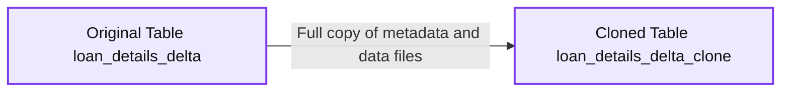

source image: https://www.databricks.com/wp-content/uploads/2021/04/delta-clone-dr-blog-img-1.jpg

source:https://raw.githubusercontent.com/databricks/tech-talks/master/images/delta-lake-deep-clone.png

Deep clones are useful for:

- Testing in a production environment without risking production data processes and affecting users
- Staging major changes to a production table
- Ensuring reproducibility of ML results
- Data migration, sharing and/or archiving

In this article, we’ll be focusing on the role of Delta deep clones in disaster recovery.

## Show me the clones!

Creating a clone can be done with the following SQL command:

You can query both the original table `(loan_details_delta)` and the cloned table `(loan_details_delta_clone)` using the following SQL statements:

The following graphic shows the results using a Databricks notebook map visualization.

*https://raw.githubusercontent.com/databricks/tech-talks/master/images/delta-lake-original-clone-view-map.png*

**Summary:** Two Databricks notebook map visualizations show that the cloned Delta table exactly matches the original table.

**Components:**

- Original view of data using the `loan_details_delta` Delta table
- Clone view of data using the `loan_details_delta_clone` Delta table
- Databricks notebook map visualizations
- SQL queries grouping `addr_state` and `funded_amnt`
- Backend aggregation by sum

**Flows:**

- `loan_details_delta` -> Original map: grouped state and funding data
- `loan_details_delta_clone` -> Clone map: grouped state and funding data

**Numbers:** `531xx`

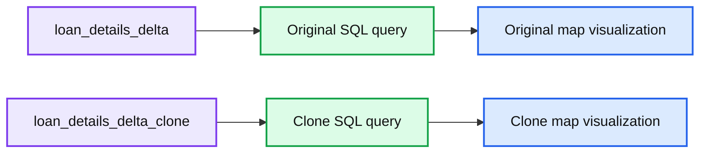

source image: https://www.databricks.com/wp-content/uploads/2021/04/delta-clone-dr-blog-img-2.jpg

https://raw.githubusercontent.com/databricks/tech-talks/master/images/delta-lake-original-clone-view-map.png

An important feature of deep clones is that they allow incremental updates. That is, instead of copying the entire table to ensure consistency between the original and the clone, only rows that contain changes to the data (e.g., where records have been updated, deleted, merged or inserted) will need to be copied and/or modified the next time the table is cloned.

*https://raw.githubusercontent.com/databricks/tech-talks/master/images/deep-clone-incremental-update.png*

**Summary:** The diagram shows incremental updates from an original Delta table to its cloned table after changes in two steps.

**Components:**

- Original Table loan_details_delta, Delta table
- Cloned Table loan_details_delta_clone, deep clone

**Flows:**

- Original Table -> Cloned Table: Incremental table updates
- Original Table -> Cloned Table: Incremental table updates after step 2

**Numbers:** 1, 2

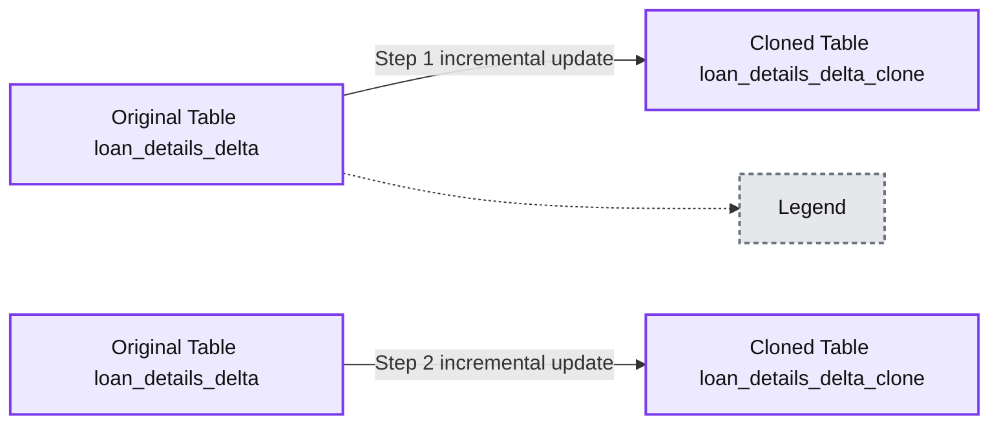

source image: https://www.databricks.com/wp-content/uploads/2021/04/delta-clone-dr-blog-img-3.jpg

https://raw.githubusercontent.com/databricks/tech-talks/master/images/deep-clone-incremental-update.png

To illustrate how incremental updates work with deep clones, let's delete some rows in our original table `(loan_details_delta)` using the following SQL statement (step 1 in the above diagram):

At this point, the original table ` (loan_details_delta) ` no longer contains rows for Ohio (OH), while the cloned table ` (loan_details_delta_clone) ` still contains those rows. To re-sync the two tables, we perform the clone operation again (step 2):

The clone and original tables are now back in sync (this will be readily apparent in the following sections). But instead of copying the entire content of the original table, the rows were deleted incrementally, significantly speeding up the process. The cloned table will only update the rows that were modified in the original table, so in this case, the rows corresponding to Ohio were removed, but all the other rows remained unchanged.

## Okay, let’s recover from this disaster of a blog

While disaster recovery by cloning is conceptually straightforward, as any DBA or DevOps engineer will attest, the practical implementation of a disaster recovery solution is far more complex. Many production systems require a two-way disaster recovery process, analogous to an active–active cluster for relational database systems. When the active server (*Source*) goes offline, the secondary server (*Clone*) needs to come online for both read and write operations. All subsequent changes to the system (e.g. inserts and modifications to the data) are recorded by the secondary server,which is now the active server in the cluster. Then, once the original server (*Source*) comes back online, you need to re-sync all the changes performed on *Clone* back to *Source*. Upon completion of the re-sync, the *Source* server becomes active again and the *Clone* server returns to its secondary state. Because the systems are constantly serving and/or modifying data, it is important that the copies of data synchronize quickly to eliminate data loss

Deep clones make it easy to perform this workflow, even on a multi-region distributed system, as illustrated in the following graphic.

*Source:https://raw.githubusercontent.com/databricks/tech-talks/master/images/delta-lake-deep-clone-timeline.png*

**Summary:** The diagram shows a two-way disaster recovery synchronization timeline between an active Source table and a secondary Clone table using merge, deep clone, and delete operations.

**Components:**

- Source table - Databricks Delta table
- Clone table - Databricks Delta table
- Timeline - synchronization sequence from Source and Clone states
- Merge operation - insert or update on the Source table
- Deep clone operation - synchronization between Source and Clone
- Delete operation - removal from the Source table

**Flows:**

- Source -> Source: merge writes inserts or updates
- Source -> Clone: deep clone synchronizes table data
- Clone -> Source: deep clone restores synchronization in the reverse direction
- Source -> Source: delete removes data during resynchronization

**Numbers:** t=0, t=1, t=2, t=3, t=4, t=4’, t=5

```mermaid
%% Shows the two-way disaster recovery synchronization timeline
flowchart LR
    S0[Source at t0] -->|merge| S1[Source after merge]
    S1 -->|deep clone| C1[Clone synchronized]
    C1 --> S2[Source at t1]
    S2 --> S3[Source at t2]
    S3 --> S4[Source at t3]
    S4 -->|delete| S5[Source at t4]
    S5 -->|deep clone| C2[Clone at t4 prime]
    C2 --> S6[Source at t5]

    classDef client fill:#dbeafe,stroke:#2563eb,stroke-width:2px,color:#111
    classDef service fill:#dcfce7,stroke:#16a34a,stroke-width:2px,color:#111
    classDef store fill:#ede9fe,stroke:#7c3aed,stroke-width:2px,color:#111
    classDef cache fill:#fef3c7,stroke:#d97706,stroke-width:2px,color:#111
    classDef queue fill:#cffafe,stroke:#0891b2,stroke-width:2px,color:#111
    classDef critical fill:#fee2e2,stroke:#dc2626,stroke-width:4px,color:#111
    classDef external fill:#e5e7eb,stroke:#6b7280,stroke-width:2px,color:#111,stroke-dasharray:4 3
    classDef decision fill:#fce7f3,stroke:#db2777,stroke-width:2px,color:#111
    class S0,S1,S2,S3,S4,S5,S6,C1,C2 store
```

source image: https://www.databricks.com/wp-content/uploads/2021/04/delta-clone-dr-blog-img-4-1.jpg

Source:https://raw.githubusercontent.com/databricks/tech-talks/master/images/delta-lake-deep-clone-timeline.png

In this example, *Source* is a table in the active Databricks region and *Clone* is the table in the secondary region:

- At t0: An insert/update statement (merge) is executed on the *Source* table, and we then execute a DEEP CLONE to keep the *Source* and *Clone* tables in sync.
- At t1: The two tables remain in sync.
- At t2: The *Source* table is not accessible. The *Clone* table now becomes *Source'*, which is where all queries and data modifications take place from this timestamp forward.
- At t3: A DELETE statement is executed on *Source'*.
- At t4: The *Source* table is accessible now, but *Source'* and *Source* are not in sync.
- At t4’: We run a DEEP CLONE to synchronize *Source'* and *Source*.
- At t5: Now that the two copies are synchronized, *Source* resumes the identity of the *active* table and *Source'* that of the *secondary* table, *Clone*.

Next, we’ll show you how to perform these steps using SQL commands in Databricks. You can also follow along by running the Databricks notebook [Using Deep Clone for Disaster Recovery with Delta Lake on Databricks](https://github.com/databricks/tech-talks/raw/master/samples/Using%20Deep%20Clone%20for%20Disaster%20Recovery%20with%20Delta%20Lake%20on%20Databricks.dbc).

## Modify the source

We begin by modifying the data in the table in our active region (*Source*) as part of our normal data processing.

*Source:https://raw.githubusercontent.com/databricks/tech-talks/master/images/delta-lake-deep-clone-timeline-0.png*

**Summary:** Disaster recovery timeline showing bidirectional Delta Lake deep cloning between Source and Clone tables, including merge and delete operations.

**Components:**

- Source: active Delta Lake table
- Clone: disaster recovery Delta Lake table
- Source prime: cloned recovery source state
- Clone prime: cloned recovery clone state
- Timeline: operation sequence from t=0 through t=5

**Flows:**

- Source -> Source: merge updates and inserts data
- Source -> Clone: deep clone
- Clone -> Source prime: deep clone after recovery
- Source prime -> Clone: delete operation

**Numbers:** t=0, t=1, t=2, t=3, t=4, t=4’, t=5

```mermaid
%% Shows the two way Delta Lake deep clone disaster recovery timeline
flowchart LR
    S[Source] -->|merge updates and inserts| S1[Source updated]
    S1 -->|deep clone| C[Clone]
    C -->|recovery deep clone| SP[Source prime]
    SP -->|delete operation| CP[Clone prime]

    T0[t=0] --> T1[t=1] --> T2[t=2] --> T3[t=3] --> T4[t=4] --> T4P[t=4 prime] --> T5[t=5]

    classDef client fill:#dbeafe,stroke:#2563eb,stroke-width:2px,color:#111
    classDef service fill:#dcfce7,stroke:#16a34a,stroke-width:2px,color:#111
    classDef store fill:#ede9fe,stroke:#7c3aed,stroke-width:2px,color:#111
    classDef cache fill:#fef3c7,stroke:#d97706,stroke-width:2px,color:#111
    classDef queue fill:#cffafe,stroke:#0891b2,stroke-width:2px,color:#111
    classDef critical fill:#fee2e2,stroke:#dc2626,stroke-width:4px,color:#111
    classDef external fill:#e5e7eb,stroke:#6b7280,stroke-width:2px,color:#111,stroke-dasharray:4 3
    classDef decision fill:#fce7f3,stroke:#db2777,stroke-width:2px,color:#111

    class S,S1,C,SP,CP store
    class T0,T1,T2,T3,T4,T4P,T5 service
```

source image: https://www.databricks.com/wp-content/uploads/2021/04/delta-clone-dr-blog-img-5.jpg

Source:https://raw.githubusercontent.com/databricks/tech-talks/master/images/delta-lake-deep-clone-timeline-0.png

*Source:https://raw.githubusercontent.com/databricks/tech-talks/master/images/delta-lake-insert-update-example.png*

**Summary:** The diagram shows UPDATE and INSERT operations applied to the `loan_details_delta` table, changing TX amounts and adding OH rows.

**Components:**

- `loan_details_delta` source table
- TX rows
- AZ rows
- OH rows
- Amt column

**Flows:**

- TX source rows -> TX target rows: UPDATE to the Amt column
- TX and AZ source rows -> OH target rows: INSERT new rows

**Numbers:** none

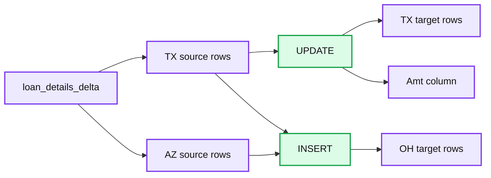

source image: https://www.databricks.com/wp-content/uploads/2021/04/delta-clone-dr-blog-img-6.jpg

Source:https://raw.githubusercontent.com/databricks/tech-talks/master/images/delta-lake-insert-update-example.png

In this case, we’ll implement the merge using an `"UPDATE"` statement (to update the *Amount* column) for ``TX``   and an `INSERT` statement for ``OH`` (to insert new rows based on entries from ``TX`` and ``AZ`` ).

Check the versions of the source and clone tables
 We started this scenario at t0, where the `loan_details_delta` and `loan_details_delta_clone` tables were in sync; then we modified the `loan_details_delta table`. How can we tell if the tables have the same version of the data without querying both and comparing them? With Delta Lake, this information is stored within the transaction log, so the `DEEP CLONE` statements can automatically determine both the source and clone versions in a single table query.

When you execute `DESCRIBE HISTORY DeltaTable`, you will get something similar to the following screenshot.

**Summary:** The table compares the original table’s latest read version, version 2, with the clone table’s source version, version 1.

**Components:**

- Original Table: `loan_details_delta`, Delta Lake table
- Clone Table: `loan_details_delta_clone`, Delta Lake table
- Transaction log history: Delta Lake operation metadata
- `version`: original table read version
- `operationParameters.sourceVersion`: clone’s source version

**Flows:**

- Original table history -> Read version: version 2
- Clone table history -> Source version: version 1

**Numbers:** 2, 1, 0, 100599, 2020-11-09T19:50:16.000+0000, 2020-11-09T19:26:36.000+0000, 2020-11-09T19:26:17.000+0000, 3 rows

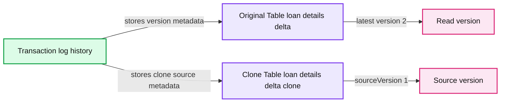

source image: https://www.databricks.com/wp-content/uploads/2021/04/delta-clone-dr-blog-img-7.jpg

Note: original table is `loan_details_delta` while clone table is `loan_details_delta_clone`.

Diving deeper into this:

- For the source table, we query the most recent version to determine the table version – here, version 2.
- For the clone table, we query the most recent `operationParameters.sourceVersion` to identify which `version` of the source table the clone table has – here, version 1.

As noted, all of this information is stored within the Delta Lake transaction log. You can also use the `checkTableVersions()` function included in the associated notebook to query the transaction log to verify the versions of the two tables:

For more information on the log, check out [Diving into Delta Lake: Unpacking the Transaction Log](https://www.databricks.com/discover/diving-into-delta-lake-talks/unpacking-transaction-log).

## Re-sync the source and clone

As we saw in the preceding section, the source table is now on v2 while the clone table is on v1.

*Source:https://raw.githubusercontent.com/databricks/tech-talks/master/images/delta-lake-deep-clone-timeline-0b1.png*

**Summary:** Disaster recovery timeline showing synchronization between a Delta source table and its clone across versions and time.

**Components:**

- Source table using Delta Lake
- Clone table using Delta Lake
- Source version markers v1 and v2
- Clone version markers v1 and v2
- Timeline from t=0 through t=5

**Flows:**

- Source table -> Clone table: CLONE at t=0
- Source table -> Source table: MERGE creates v2
- Clone table -> Clone table: DELETE removes data
- Clone table -> Source table: CLONE re-synchronizes the tables at t=4

**Numbers:** t=0, t=1, t=2, t=3, t=4, t=4′, t=5, v1, v2

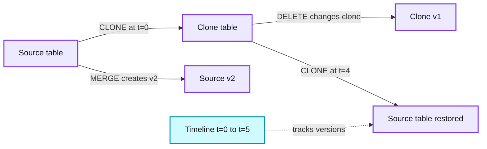

source image: https://www.databricks.com/wp-content/uploads/2021/04/delta-clone-dr-blog-img-8.png

Source:https://raw.githubusercontent.com/databricks/tech-talks/master/images/delta-lake-deep-clone-timeline-0b1.png

To synchronize the two tables, we run the following command at t1:

*Source:https://raw.githubusercontent.com/databricks/tech-talks/master/images/delta-lake-deep-clone-timeline-1.png*

**Summary:** The diagram shows a two-way Delta deep clone timeline synchronizing a source table and clone table through merge, clone, and delete operations.

**Components:**

- Source table using Delta Lake
- Clone table using Delta Lake
- Merge operation
- Deep clone operation
- Delete operation
- Source and clone timeline states
- Version 2 table state

**Flows:**

- Source table -> Merge operation: source data merge
- Source table -> Deep clone operation: clone source state
- Deep clone operation -> Clone table: synchronized table state
- Clone table -> Delete operation: delete clone-side data
- Delete operation -> Clone table: reduced clone state
- Clone table -> Deep clone operation: clone back to source
- Deep clone operation -> Source table: restored source state

**Numbers:** t=0, t=1, t=2, t=3, t=4, t=4', t=5, v2

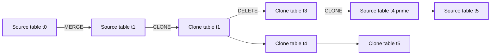

source image: https://www.databricks.com/wp-content/uploads/2021/04/delta-clone-dr-blog-img-9.png

Source:https://raw.githubusercontent.com/databricks/tech-talks/master/images/delta-lake-deep-clone-timeline-1.png

## Source table is not accessible

At t2, the *Source* table is not accessible. Whatever causes this – from user error to an entire region going down – you have to admit this is not a great life hack for waking up.

Source:https://www.reddit.com/r/ProgrammerHumor/comments/kvwj9f/burn_the_backups_if_you_need_that_extra_kick

Jokes aside, the reality is that you should always be prepared for a production system to go offline. Fortunately, because of your [business continuity plan](https://en.wikipedia.org/wiki/Business_continuity_planning), you have a secondary clone where you can redirect your services to read and modify your data.

## Data correction

With your original *Source* unavailable, your table in the secondary region (*Clone*) is now the *Source'* table.

*Source:https://raw.githubusercontent.com/databricks/tech-talks/master/images/delta-lake-deep-clone-timeline-2.png*

**Summary:** The diagram shows a two-way disaster-recovery timeline where a Delta source table is deeply cloned, modified during source unavailability, and later re-cloned back into the restored source.

**Components:**

- Source: original Delta table
- Clone: secondary-region Delta deep clone
- Source prime: promoted clone acting as the source during outage
- Version 2: table state labeled v2
- Merge: source-table merge operation
- Delete: record deletion operation
- Clone operation: deep-clone synchronization between Source and Clone

**Flows:**

- Source -> Clone: deep clone creates the secondary table
- Clone -> Source prime: clone is promoted when Source is unavailable
- Source prime -> Source prime: DELETE removes records during data correction
- Source prime -> Source: deep clone copies corrected data back after recovery
- Source -> Source: MERGE updates the source before cloning

**Numbers:** t=0, t=1, t=2, t=3, t=4, t=4', t=5, v2

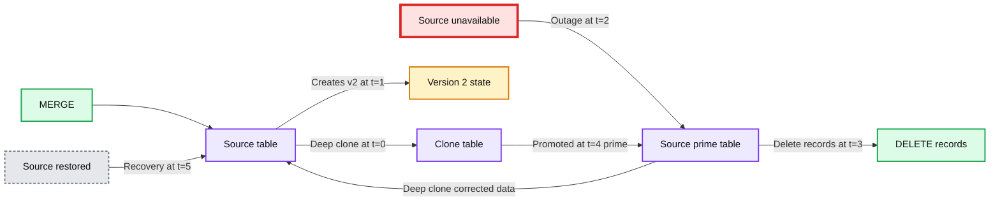

source image: https://www.databricks.com/wp-content/uploads/2021/04/delta-clone-dr-blog-img-9.jpg

Source:https://raw.githubusercontent.com/databricks/tech-talks/master/images/delta-lake-deep-clone-timeline-2.png

Some services that do not need to modify data right away can switch to read-only mode while *Source* is not accessible, but many services and production environments cannot afford such delays. In this case, at t3 we need to modify the *Source'* data and `DELETE` some records:

If you review the table history or run `checkTableVersions()`, *(Source')* table is now at version 4 after running the `DELETE` statement:

Because the original *Source* table is unreachable, its version is reported as *None.*

*Source:https://raw.githubusercontent.com/databricks/tech-talks/master/images/delta-lake-deep-clone-timeline-3b.png*

**Summary:** Timeline showing two-way Delta deep cloning between source and clone tables, including merge, clone, delete, and version divergence when the original source is unreachable.

**Components:**

- Source table - Delta Lake table
- Clone table - Delta Lake deep clone
- Version states - Delta table versions v2 and v4
- Timeline - sequence from t=0 through t=5
- Unreachable original source - source unavailable during recovery

**Flows:**

- Source table -> Clone table: MERGE updates
- Clone table -> Source table: CLONE operation
- Source table -> Clone table: CLONE operation
- Source table -> Clone table: DELETE records
- Unreachable original source -> Version states: source version reported as None

**Numbers:** t=0, t=1, t=2, t=3, t=4, t=4', t=5, v2, v4, 3 previous CLONE operations

```mermaid
%% Delta deep clone timeline with source unavailability and version divergence
flowchart LR
    S0[Source at t0] -->|MERGE| S1[Source at v2]
    C0[Clone at t0] -->|CLONE| C1[Clone at v2]
    S1 -->|CLONE| S2[Source clone at t1]
    S2 -->|DELETE records| S3[Source prime at v4]
    S3 -.->|unreachable, version None| S4[Source unavailable at t4]
    C1 -->|CLONE| C2[Clone at t4 prime]
    S4 -.->|CLONE| C3[Clone at t5]

    classDef client   fill:#dbeafe,stroke:#2563eb,stroke-width:2px,color:#111
    classDef service  fill:#dcfce7,stroke:#16a34a,stroke-width:2px,color:#111
    classDef store    fill:#ede9fe,stroke:#7c3aed,stroke-width:2px,color:#111
    classDef cache    fill:#fef3c7,stroke:#d97706,stroke-width:2px,color:#111
    classDef queue    fill:#cffafe,stroke:#0891b2,stroke-width:2px,color:#111
    classDef critical fill:#fee2e2,stroke:#dc2626,stroke-width:4px,color:#111
    classDef external fill:#e5e7eb,stroke:#6b7280,stroke-width:2px,color:#111,stroke-dasharray:4 3
    classDef decision fill:#fce7f3,stroke:#db2777,stroke-width:2px,color:#111

    class S0,S1,S2,S3 store
    class C0,C1,C2,C3 service
    class S4 critical
```

source image: https://www.databricks.com/wp-content/uploads/2021/04/image13.png

Source:https://raw.githubusercontent.com/databricks/tech-talks/master/images/delta-lake-deep-clone-timeline-3b.png

The reason the clone table is on version 4 can be quickly determined by reviewing its history, which shows the three previous `CLONE` operations and the `DELETE` command:

`DESCRIBE HISTORY loan_details_delta_clone`

 

| **version** | **timestamp** | **...** | **operation** | **...** |
|---|---|---|---|---|
| 4 | ... | ... | DELETE | ... |
| 3 | ... | ... | CLONE | ... |
| 2 | ... | ... | CLONE | ... |
| 1 | ... | ... | CLONE | ... |
| 0 | ... | ... | CREATE TABLE AS SELECT | ... |

## Getting back to the source

Whew, after , the original *Source* table is back online!

*Source:https://raw.githubusercontent.com/databricks/tech-talks/master/images/delta-lake-deep-clone-timeline-4b.png*

**Summary:** The timeline shows bidirectional disaster recovery synchronization between a Delta Lake Source table and its Clone, including merge, delete, and deep clone operations across table versions.

**Components:**

- Source table using Delta Lake
- Clone table using Delta Lake
- Merge operation
- Delete operation
- Deep clone operation
- Timeline states labeled t=0 through t=5

**Flows:**

- Source -> Source: Merge creates the initial source state
- Source -> Clone: Clone operation replicates the source
- Clone -> Clone: Delete creates a divergent clone state
- Clone -> Source: Deep clone replaces the source with the clone state

**Numbers:** 0, 1, 2, 3, 4, 4', 5, v2, v4

```mermaid
%% Disaster recovery two way deep clone timeline
flowchart LR
    S0[Source at t equals 0] -->|MERGE| S1[Source version 1]
    S1 -->|CLONE| C1[Clone version 1]
    S1 --> S2[Source version 2]
    C1 --> C2[Clone version 2]
    S2 --> S3[Source at t equals 2]
    C2 -->|DELETE| C4[Clone version 4]
    S3 --> S4[Source at t equals 4]
    C4 -->|DEEP CLONE| S4P[Source at t equals 4 prime]
    S4P --> S5[Source at t equals 5]
    C4 --> C5[Clone at t equals 5]

    classDef client fill:#dbeafe,stroke:#2563eb,stroke-width:2px,color:#111
    classDef service fill:#dcfce7,stroke:#16a34a,stroke-width:2px,color:#111
    classDef store fill:#ede9fe,stroke:#7c3aed,stroke-width:2px,color:#111
    classDef cache fill:#fef3c7,stroke:#d97706,stroke-width:2px,color:#111
    classDef queue fill:#cffafe,stroke:#0891b2,stroke-width:2px,color:#111
    classDef critical fill:#fee2e2,stroke:#dc2626,stroke-width:4px,color:#111
    classDef external fill:#e5e7eb,stroke:#6b7280,stroke-width:2px,color:#111,stroke-dasharray:4 3
    classDef decision fill:#fce7f3,stroke:#db2777,stroke-width:2px,color:#111

    class S0,S1,S2,S3,S4,S4P,S5,C1,C2,C4,C5 store
```

source image: https://www.databricks.com/wp-content/uploads/2021/04/delta-clone-dr-blog-img-13.png

Source:https://raw.githubusercontent.com/databricks/tech-talks/master/images/delta-lake-deep-clone-timeline-4b.png

But as we saw in the previous steps, there are now differences between *Source* and the *Source'* replica. Fortunately, fixing this problem is easy:

By running a `DEEP CLONE` to replace the original* Source* table `(loans_details_delta_clone)`, we can quickly return to the original state.

*Source:https://raw.githubusercontent.com/databricks/tech-talks/master/images/delta-lake-deep-clone-timeline-5.png*

**Summary:** The diagram shows a Delta Lake disaster recovery timeline where Source and Clone tables diverge, are merged, deleted, and reconciled using deep clones.

**Components:**

- Source: Delta Lake source table
- Clone: Delta Lake deep clone table
- Source prime: modified source replica
- Timeline: Recovery sequence from t=0 to t=5
- Version labels: Delta table versions v2, v3, and v4

**Flows:**

- Source -> Clone: DEEP CLONE at t=0
- Source -> Source prime: DELETE and subsequent divergence
- Source prime -> Source: DEEP CLONE at t=4 prime
- Source -> Clone: Restored clone state at t=5
- Source -> Source prime: MERGE updates source state

**Numbers:** t=0, t=1, t=2, t=3, t=4, t=4 prime, t=5, v2, v3, v4

```mermaid
%% Delta Lake disaster recovery deep clone timeline
flowchart LR
    S0[Source t0] -->|MERGE| S1[Source t1]
    S1 -->|DEEP CLONE| C1[Clone t1]
    S1 --> S2[Source t2]
    S2 --> S3[Source t3]
    S3 -->|DELETE| SP[Source prime t4]
    SP -->|DEEP CLONE| S5[Source v3 t5]
    S5 -->|Restored clone state| C5[Clone v4 t5]

    classDef client fill:#dbeafe,stroke:#2563eb,stroke-width:2px,color:#111
    classDef service fill:#dcfce7,stroke:#16a34a,stroke-width:2px,color:#111
    classDef store fill:#ede9fe,stroke:#7c3aed,stroke-width:2px,color:#111
    classDef cache fill:#fef3c7,stroke:#d97706,stroke-width:2px,color:#111
    classDef queue fill:#cffafe,stroke:#0891b2,stroke-width:2px,color:#111
    classDef critical fill:#fee2e2,stroke:#dc2626,stroke-width:4px,color:#111
    classDef external fill:#e5e7eb,stroke:#6b7280,stroke-width:2px,color:#111,stroke-dasharray:4 3
    classDef decision fill:#fce7f3,stroke:#db2777,stroke-width:2px,color:#111

    class S0,S1,S2,S3,SP,S5,C1,C5 store
```

source image: https://www.databricks.com/wp-content/uploads/2021/04/delta-clone-dr-blog-img-14.jpg

Source:https://raw.githubusercontent.com/databricks/tech-talks/master/images/delta-lake-deep-clone-timeline-5.png

Now all of our services can point back to the original *Source*, and the *Source'* table returns to its *Clone* (or *secondary*) state.

Some of you may have noted that the *Source* table is now version 3 while the *Clone* table is version 4. This is because the version number is associated with the number of operations performed on the table. In this example, the *Source* table had fewer operations:

## Words of caution

This method for disaster recovery ensures the availability of both reads and writes regardless of outages. However, this comes at the cost of possibly losing intermediate changes. Consider the following scenario.

**Summary:** The diagram shows a disaster recovery timeline using two-way deep cloning between Source and Clone tables, highlighting possible loss of intermediate updates.

**Components:**

- Source table
- Clone table
- Timeline
- Version 2 state

**Flows:**

- Source -> Source: MERGE
- Source -> Clone: CLONE
- Source -> Source: update to Version 2
- Clone -> Clone: DELETE
- Clone -> Source: CLONE

**Numbers:** t=0, t=1, t=2, t=3, t=4, t=4 prime, t=5, V2

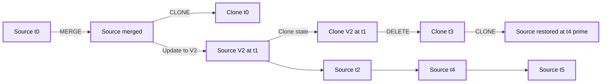

source image: https://www.databricks.com/wp-content/uploads/2021/04/delta-clone-dr-blog-img-4.jpg

Notice that there is an update at t=1, which happens between the two `CLONE` operations. It’s likely that any changes made during this interval will be lost at t=4 when the second `CLONE` operation occurs. To ensure no changes are lost, you’d have to guarantee that no writes to the Source table occur from t=1 to t=4. This could be challenging to accomplish, considering that an entire region may be misbehaving. That being said, there are many use cases where availability is the more important consideration.

## Summary

This article has demonstrated how to perform two-way disaster recovery using the `DEEP CLONE `feature with Delta Lake on Databricks. Using only SQL statements with Delta Lake, you can significantly simplify and speed up data replication as part of your business continuity plan. For more information on Delta clones, refer to [Easily Clone your Delta Lake for Testing, Sharing, and ML Reproducibility](https://www.databricks.com/blog/2020/09/15/easily-clone-your-delta-lake-for-testing-sharing-and-ml-reproducibility.html). Check out [Using Deep Clone for Disaster Recovery with Delta Lake on Databricks](https://github.com/databricks/tech-talks/raw/master/samples/Using%20Deep%20Clone%20for%20Disaster%20Recovery%20with%20Delta%20Lake%20on%20Databricks.dbc) to walk through this exercise yourself with Databricks Runtime.

## Acknowledgements

We would like to thank Peter Stern, Rachel Head, Ryan Kennedy, Afsana Afzal, Ashley Trainor for their invaluable contributions to this blog.
