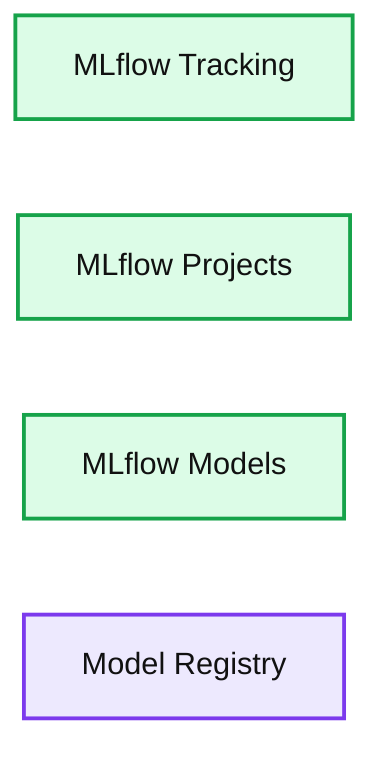

# Reproduce Anything: Machine Learning Meets Data Lakehouse

- Source: https://www.databricks.com/blog/2021/04/26/reproduce-anything-machine-learning-meets-data-lakehouse.html
- Published: 2021-04-26
- Authors: Mary Grace Moesta, Srijith Rajamohan, Ph.D.
- Categories: engineering, data-science-machine-learning
- Images: 5 total, 2 extracted as architecture

Machine learning has proved to add unprecedented value to organization and projects - whether that’s for accelerating innovation, personalization, demand forecasting and countless other use cases. However, machine learning (ML) leverages data from a myriad of sources with an ever-changing ecosystem of tools and dependencies, making these solutions constantly in flux and difficult to reproduce.

While no one can guarantee their model is 100% correct, experiments that have a reproducible model and results are more likely to be trusted than those that are not. A reproducible ML experiment implies that we are able to at least reproduce the following:

- Training/validation/test data
- Compute
- Environment
- Model (and associated hyperparameters, etc.)
- Code

However, reproducibility in ML is a much more difficult task than it appears. You need access to the same underlying data the model was trained on, but how can you guarantee that data hasn’t changed? Did you version control your data in addition to your source code? On top of that, which libraries (and versions), hyperparameters and models were used? Worse yet, does the code successfully run end-to-end?

In this blog, we’ll walk through how the lakehouse architecture built on [Delta Lake](https://delta.io/) coupled with the open-source library [MLflow](https://mlflow.org/) helps solve these replication challenges. In particular, this blog covers:

- Lakehouse architecture
- Data versioning with Delta Lake
- Tracking experiments with MLflow
- End-to-end reproducibility with Databricks

## What is a data lakehouse (and why you should care)

As a data scientist, you might not care where your underlying data comes from - a CSV, relational database, etc. But let’s say you’re working with training data that is updated nightly. You build a model today with a given set of hyperparameters, but tomorrow, you want to improve this model and tweak some of the hyperparameters. Well, did the model performance improve because of the updated hyperparameters or because the underlying data changed? Without being able to version your data and compare apples to apples, there is no way to know! You might say, “Well, I’ll just snapshot all my data” but this could be very costly, go stale quickly and is difficult to maintain and version. You need a single source of truth for your data that is scalable, always up to date and provides data versioning without snapshotting your entire dataset.

This is where a lakehouse comes in. [Lakehouses](http://cidrdb.org/cidr2021/papers/cidr2021_paper17.pdf) combine the best qualities of data warehouses and data lakes. Now, you can have the scalability and low-cost storage of data lakes with the speed and [ACID](https://en.wikipedia.org/wiki/ACID)transactional guarantees of data warehouses. This enables you to have a single source of truth for your data, and you never need to experience stale, inconsistent data again. It accomplishes this by augmenting your existing data lake with metadata management for optimized performance, eliminating the need to copy data around to a data warehouse. You get data versioning, reliable and fault-tolerant transactions, and a fast query engine, all while maintaining open standards. Now, you can have a single solution for all major data workloads – from streaming analytics to BI, data science, and AI. This is the new standard.

So this sounds great in theory, but how do you get started?

## Data versioning with Delta Lake

Delta Lake is an open-source project that powers the lakehouse architecture. While there are a few open-source lakehouse projects, we favor Delta Lake for its tight integration with Apache Spark™ and its supports for the following features:

- ACID transactions
- Scalable metadata handling
- Time travel
- Schema evolution
- Audit history
- Deletes and updates
- Unified batch and streaming

Good ML starts with high-quality data. By using Delta Lake and some of the aforementioned features, you can ensure that your data science projects start on a solid foundation (get it, lakehouse, foundation?). With constant changes and updates to the data, ACID transactions ensure that data integrity is maintained across concurrent reads and writes, whether or not they are batch or streaming. This way, everyone has a consistent view of the data.

Delta Lake only tracks the “delta” or changes since the previous commit, and stores them in the Delta transaction log. As such, this enables time travel based on data versions so you can keep the data constant while making changes to the model, hyperparameters, etc. However, you’re not locked in to a given schema with Delta, as it supports schema evolution, so you’re able to add additional features as input to your machine learning models.

We can view the changes in the transaction log using the history() method from the [Delta APIs](https://docs.delta.io/latest/index.html):

**Summary:** The image shows a Databricks notebook retrieving Delta Lake table history and displaying its write operations.

**Components:**

- Databricks notebook code
- Spark runtime
- DeltaTable API
- Delta Lake transaction history
- Spark DataFrame display

**Flows:**

- Databricks notebook code -> Spark runtime: executes Python
- Spark runtime -> DeltaTable API: loads table from path
- DeltaTable API -> Delta Lake transaction history: requests full history
- Delta Lake transaction history -> Spark DataFrame display: returns history records
- Spark DataFrame display -> Databricks notebook: renders versions and metadata

**Numbers:** 1, 3, 4, 6, 12, 1, 2, 3, 4, 5, 4, 3, 2, 1, 0, 2021-03-03T13:47:59.000+0000, 2021-03-03T13:47:53.000+0000, 2021-03-03T13:46:48.000+0000, 2021-03-02T15:33:29.000+0000, 2021-03-02T15:14:32.000+0000, 3363424249366131

```mermaid
%% Delta history retrieval and display
flowchart LR
    A[Databricks notebook code] -->|executes Python| B[Spark runtime]
    B -->|loads table path| C[DeltaTable API]
    C -->|requests full history| D[Delta Lake transaction history]
    D -->|returns history records| E[Spark DataFrame display]
    E -->|renders versions and metadata| A

    classDef client fill:#dbeafe,stroke:#2563eb,stroke-width:2px,color:#111
    classDef service fill:#dcfce7,stroke:#16a34a,stroke-width:2px,color:#111
    classDef store fill:#ede9fe,stroke:#7c3aed,stroke-width:2px,color:#111
    classDef cache fill:#fef3c7,stroke:#d97706,stroke-width:2px,color:#111
    classDef queue fill:#cffafe,stroke:#0891b2,stroke-width:2px,color:#111
    classDef critical fill:#fee2e2,stroke:#dc2626,stroke-width:4px,color:#111
    classDef external fill:#e5e7eb,stroke:#6b7280,stroke-width:2px,color:#111,stroke-dasharray:4 3
    classDef decision fill:#fce7f3,stroke:#db2777,stroke-width:2px,color:#111

    class A client
    class B,C,E service
    class D store
```

source image: https://www.databricks.com/wp-content/uploads/2021/04/reproduce-ml-blog-img-1.png

This makes it easy to trace the lineage of all changes to the underlying data, ensuring that your model can be reproduced with exactly the same data it was built on. You can specify a specific version or timestamp when you load in your data from Delta Lake.

## Tracking models with MLflow

Once you’re able to reliably reproduce your data, the next step is reproducing your model. The [open-source library MLflow](https://www.mlflow.org/) includes 4 components for managing the ML lifecycle and greatly simplifies experiment reproducibility.

**Summary:** The diagram shows four MLflow components for managing the machine learning lifecycle.

**Components:**

- MLflow Tracking: MLflow experiment tracking
- MLflow Projects: MLflow code packaging and reproducibility
- MLflow Models: MLflow model deployment
- Model Registry: MLflow model repository management

**Flows:**

- none

**Numbers:** none

source image: https://www.databricks.com/wp-content/uploads/2021/04/reproduce-ml-blog-img-2.png

MLflow tracking allows you to log hyperparameters, metrics, code, model and any additional artifacts (such as files, plots, data versions, etc.) to a central location. This includes logging Delta tables and corresponding versions to ensure data consistency for each run (avoiding the need to actually copy or snapshot the entire data). Let’s take a look at an example of building a random forest model on the [wine dataset](https://archive.ics.uci.edu/ml/datasets/wine), and logging our experiment with MLflow. The entire code can be found in [this notebook](https://www.databricks.com/wp-content/uploads/notebooks/reproducible-machine-learning.html).

The results are logged to the MLflow tracking UI, which you can access by selecting the Experiment icon in the upper right-hand corner of your Databricks notebook (unless you provide a different experiment location). From here, you can compare runs, filter based on certain metrics or parameters, etc.

In addition to manually logging your parameters, metrics and so forth, there are [autologging capabilities](https://www.mlflow.org/docs/latest/tracking.html#automatic-logging) for some [built-in model flavors that MLflow supports](https://mlflow.org/docs/latest/models.html#built-in-model-flavors). For example, to automatically log an sklearn model, you simply add: `mlflow.sklearn.autolog()` and it will log the parameters, metrics, generate confusion matrices for classification problems and much more when an `estimator.fit()` is called.

When logging a model to the tracking server, MLflow creates a [standard model packaging format](https://mlflow.org/docs/latest/models.html#built-in-model-flavors). It automatically creates a conda.yaml file, which outlines the necessary channels, dependencies and versions that are required to recreate the environment necessary to load the model. This means you can easily mirror the environment of any model tracked and logged to MLflow.

When using managed MLflow on the Databricks platform, there is a **‘reproduce run**’ feature that allows you to reproduce training runs with the click of a button. It automatically snapshots your Databricks notebook, cluster configuration and any additional libraries you might have installed.

Check out this reproduce run feature and see if you can reproduce your own experiments or those of your coworkers!

## Putting it all together

Now that you’ve learned how the Lakehouse architecture with Delta Lake and MLflow addresses the data, model, code and environment ML reproducibility challenges, take a look at [this notebook](https://www.databricks.com/wp-content/uploads/notebooks/reproducible-machine-learning.html)and reproduce our experiment for yourself! Even with the ability to reproduce the aforementioned items, there might still be some things outside of your control. Regardless, building ML solutions with Delta Lake and MLflow on Databricks addresses the vast majority of issues people face when reproducing ML experiments

Interested to learn what other problems you can solve with a data lakehouse? Read this recent [blog on the challenges of the traditional two-tier data architecture](https://www.databricks.com/blog/2021/02/04/how-data-lakehouses-solve-common-issues-with-data-warehouses.html)and how the lakehouse architecture is helping businesses overcome them.
