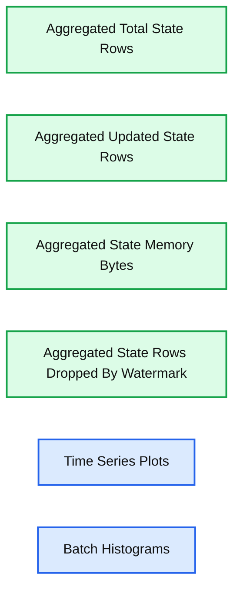
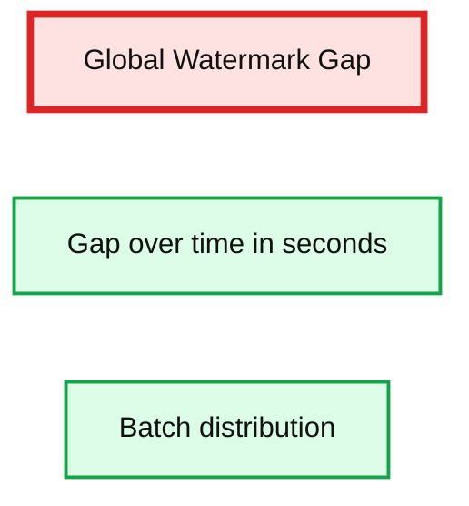
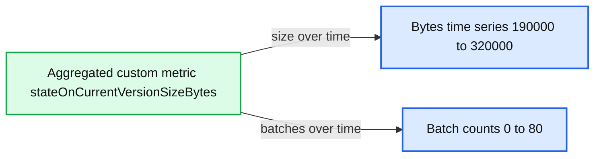

# What’s New in Apache Spark™ 3.1 Release for Structured Streaming

- Source: https://www.databricks.com/blog/2021/04/27/whats-new-in-apache-spark-3-1-release-for-structured-streaming.html
- Published: 2021-04-27
- Authors: Yuanjian Li, Shixiong Zhu, Bo Zhang
- Categories: engineering, open-source, data-streaming
- Images: 3 total, 3 extracted as architecture

Along with providing the ability for streaming processing based on Spark Core and SQL API, Structured Streaming is one of the most important components for Apache Spark™. In this blog post, we summarize the notable improvements for Spark Streaming in the latest 3.1 release, including a new streaming table API, support for stream-stream join and multiple UI enhancements. Also, schema validation and improvements to the Apache Kafka data source deliver better usability. Finally, various enhancements were made for improved read/write performance with FileStream source/sink.

## New streaming table API

When starting a structured stream, a continuous data stream is considered an unbounded table. Therefore, Table APIs provide a more natural and convenient way to handle streaming queries. In Spark 3.1, we added the support for DataStreamReader and DataStreamWriter. End users can now directly use the API to read and write streaming DataFrames as tables. See the example below:

Also, with these new options, users can transform the source dataset and write to a new table:

Databricks recommends using the [Delta Lake](https://docs.databricks.com/delta/delta-streaming.html#table-streaming-reads-and-writes) format with the streaming table APIs, which allows you to

- Compact small files produced by low latency ingest concurrently.
- Maintain “exactly-once” processing with more than one stream (or concurrent batch jobs).
- Efficiently discover which files are new when using files as the source for a stream.

## New support for stream-stream join

Prior to Spark 3.1, only inner, left outer and right outer joins were supported in the stream-stream join. In the latest release, we have implemented full outer and left semi stream-stream join, making Structured Streaming useful in more scenarios.

- Left semi stream-stream join ([SPARK-32862](https://issues.apache.org/jira/browse/SPARK-32862))
- Full outer stream-stream join ([SPARK-32863](https://issues.apache.org/jira/browse/SPARK-32863))

## Kafka data source improvements

In Spark 3.1 we have upgraded the Kafka dependency to 2.6.0 ([SPARK-32568](https://issues.apache.org/jira/browse/SPARK-32568)), which enables users to migrate to the new API for Kafka offsets retrieval (AdminClient.listOffsets). It resolves the issue ([SPARK-28367](https://issues.apache.org/jira/browse/SPARK-28367)) of the Kafka connector waiting infinitely when using the older version.

## Schema validation

Schemas are essential information for Structured Streaming queries. In Spark 3.1, we added schema validation logic for both user-input schema and the internal state store:

**Introduce state schema validation among query restart (**[**SPARK-27237**](https://issues.apache.org/jira/browse/SPARK-27237)**)**

With this update, key and value schemas are stored in the schema files at the stream start. The new key and value schema are then verified against the existing ones for compatibility at the query restart. State schema is considered to be "compatible" when the number of fields is the same and the data type for each field is the same. Note, we don't check the field name here since Spark allows renaming.

This will prevent queries with incompatible state schemas from running, which reduces the chance of in-deterministic behavior and  provides more informative error messages.

**Introduce schema validation for streaming state store (**[**SPARK-31894**](https://issues.apache.org/jira/browse/SPARK-31894)**)**

Previously, Structured Streaming directly put the checkpoint (represented in UnsafeRow) into StateStore without any schema validation. When upgrading to a new Spark version, the checkpoint files will be reused. Without schema validations, any change or bug fix related to the aggregate function may cause random exceptions, even the wrong answer (e.g [SPARK-28067](https://issues.apache.org/jira/browse/SPARK-28067)). Now Spark validates the checkpoint against the schema and throws InvalidUnsafeRowException when the checkpoint is reused during migration. It is worth mentioning that this work also helped us find the blocker, [SPARK-31990](https://issues.apache.org/jira/browse/SPARK-31990): Streaming's state store compatibility is broken, for Spark 3.0.1 release.

## Structured Streaming UI enhancements

We introduced the new Structured Streaming UI in [Spark 3.0](https://www.databricks.com/blog/2020/07/29/a-look-at-the-new-structured-streaming-ui-in-apache-spark-3-0.html). In Spark 3.1, we added History Server support for the Structured Streaming UI([SPARK-31953](https://issues.apache.org/jira/browse/SPARK-31953)) as well as more information about streaming runtime status:

**State information in Structured Streaming UI (**[**SPARK-33223**](https://issues.apache.org/jira/browse/SPARK-33223)**)**

Four more metrics are added for state information:

1. Aggregated Number Of Total State Rows
2. Aggregated Number Of Updated State Rows
3. Aggregated State Memory Used In Bytes
4. Aggregated Number Of State Rows Dropped By Watermark

With these metrics, we have a whole picture for the state store. It also makes it possible to add some new features such as capacity planning.

**Summary:** Spark 3.1 Structured Streaming UI displays four aggregated state-store metrics with time-series charts and batch-distribution histograms.

**Components:**

- Aggregated Number Of Total State Rows, shown in records
- Aggregated Number Of Updated State Rows, shown in records
- Aggregated State Memory Used In Bytes, shown in bytes
- Aggregated Number Of State Rows Dropped By Watermark, shown in records
- Time-series plots
- Per-batch histograms

**Flows:**

- none

**Numbers:**

- Time range: 15:12:57 to 15:14:05
- Total state rows axis: 0.00, 200.00, 400.00, 600.00
- Updated state rows axis: 0.00, 5.00, 10.00, 15.00, 20.00, 25.00, 30.00
- State memory axis: 0.00, 50,000.00, 100,000.00, 150,000.00, 200,000.00, 250,000.00
- Batch histogram ticks: 0, 20, 40, 60, 80
- Visible total state rows endpoint: approximately 650
- Visible updated state rows peak: approximately 30
- Visible state memory endpoint: approximately 280,000 bytes
- Watermark-dropped state rows: 0

source image: https://www.databricks.com/wp-content/uploads/2021/04/SparkStructuredStreamingSpark3.1-blog-img-1.jpg

- Watermark gap information in Structured Streaming UI ([SPARK-33224](https://issues.apache.org/jira/browse/SPARK-33224))

Watermark is one of the major metrics that the end-users need to track for stateful queries. It defines "when" the output will be emitted for append mode, hence knowing how much gap between wall clock and watermark (input data) is very helpful to set an expectation of the output.

**Summary:** The chart shows the global watermark gap over time in seconds alongside a distribution of batch counts.

**Components:**

- Global Watermark Gap
- Time series chart in seconds
- Batch distribution histogram

**Flows:**

- none

**Numbers:**

- 0.00, 20.00, 30.00, 40.00 seconds
- 0, 20, 40, 60, 80 batches
- 18:47:20
- 18:55:30

source image: https://www.databricks.com/wp-content/uploads/2021/04/SparkStructuredStreamingSpark3.1-blog-img-2.png

- [Expose state custom metrics information on SS UI](https://issues.apache.org/jira/browse/SPARK-33287) ([SPARK-33287](https://issues.apache.org/jira/browse/SPARK-33287))

This shows custom metrics information, which is set in the config `spark.sql.streaming.ui.enabledCustomMetricList`.

**Summary:** The image shows an aggregated custom metric chart tracking current state-version size in bytes alongside batch counts over time.

**Components:**

- Aggregated custom metric `stateOnCurrentVersionSizeBytes`
- Bytes time-series chart
- Batch-count horizontal bar chart

**Flows:**

- none

**Numbers:**

- Bytes axis: 0.00, 50,000.00, 100,000.00, 150,000.00, 200,000.00, 250,000.00, 300,000.00
- Batch axis: 0, 20, 40, 60, 80
- Time range: 12:44:17 to 12:45:19
- Metric values shown trend from approximately 190,000 to 320,000 bytes

source image: https://www.databricks.com/wp-content/uploads/2021/04/SparkStructuredStreamingSpark3.1-blog-img-3.png

## Enhancement for FileStreamSource/Sink

There are improvements for FileStreamSource/Sink:

**Cache fetched list of files beyond maxFilesPerTrigger as unread files (**[**SPARK-30866**](https://issues.apache.org/jira/browse/SPARK-30866)**)**

Previously when config maxFilesPerTrigger is set, FileStreamSource will fetch all available files, process a limited number of files according to the config and ignore the others for every micro-batch. With this improvement, it will cache the files fetched in previous batches and reuse them in the following ones.

**Streamline the logic on file stream source and sink metadata log (**[**SPARK-30462**](https://issues.apache.org/jira/browse/SPARK-30462)**)**

Before this change, whenever the metadata was needed in FileStreamSource/Sink, all entries in the metadata log were deserialized into the Spark driver’s memory. With this change, Spark will read and process the metadata log in a streamlined fashion whenever possible.

**Provide a new option to have retention on output files (**[**SPARK-27188**](https://issues.apache.org/jira/browse/SPARK-27188)**)**

There is a  new option to configure the retention of metadata log files in FileStreamSink, which helps limit the growth of metadata log file size for long-running Structured Streaming queries.

## What’s Next

For the next major release, we'll keep focusing on new functionality, performance and usability improvements for Spark Structured Streaming. We would love to hear your feedback as an end-user or a Spark developer! If you have any feedback, please feel free to share it with us through the Spark [user](https://spark.apache.org/community.html) or [developer](https://spark.apache.org/community.html) mailing lists. Thanks to all the contributors and users in the community who help with these significant enhancements happening
