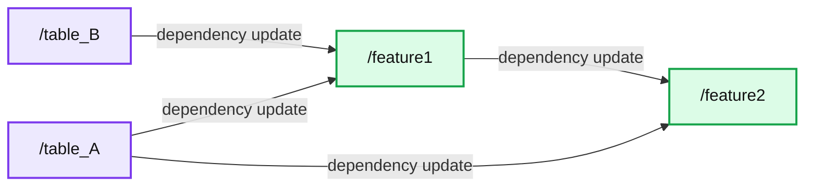

# Data-driven Software: Towards the Future of Programming in Data Science

- Source: https://www.databricks.com/blog/2021/05/04/data-driven-software-towards-the-future-of-programming-in-data-science.html
- Published: 2021-05-04
- Authors: Tim Hunter, Rocio Ventura Abreau
- Categories: engineering, data-science-machine-learning, platform
- Images: 2 total, 2 extracted as architecture

This is a guest authored post by [Tim Hunter](https://nl.linkedin.com/in/timotheehunter), data scientist, and [Rocío Ventura Abreu](https://nl.linkedin.com/in/rocioventura), data scientist, of ABN AMRO Bank N.V.

Data science is now placed at the center of business decision making thanks to the tremendous success of data-driven analytics. However, more stringent expectations around data quality control, reproducibility, auditability and ease of integration from existing systems have come with this position. New insights and updates are expected to be quickly rolled out in a collaborative process without impacting existing production pipelines.

Essentially, data science is confronting issues that software development teams have worked on for decades. Software engineering built effective best practices such as versioning code, dependency management, feature branches and more. However, data science tools do not integrate well with these practices, which forces data scientists to carefully understand the cascading effects of any change in their data science pipeline. Common consequences of this include downstream dependencies using stale data by mistake and needing to rerun an entire pipeline end-to-end for safety. When data scientists collaborate, they should be able to use the intermediate results from their colleagues instead of computing everything from scratch, just like software engineers reuse libraries of code written by others.

This blog shows how to treat data like code through the concept of Data-Driven Software (DDS). This methodology, implemented as a lightweight and [easy-to-use open-source Python package](https://github.com/tjhunter/dds_py), solves all the issues mentioned above for single user and collaborative data pipelines written in Python, and it fully integrates with a [Lakehouse architecture](https://www.databricks.com/product/data-lakehouse) such as Databricks. In effect, it allows data engineers and data scientists to YOLO their data: you only load once — and never recalculate.

## Data-driven software: a first example

To get a deeper understanding of DDS, let’s walk through a common operation in sample data science code: downloading a dataset from the internet. In this case, a sample of the Uber New York trips dataset.

 This simple function illustrates recurring challenges for a data scientist:

- every time the function is called, it slows down the execution by downloading the same dataset.
- adding manual logic to write the content is error-prone. What happens when we want to update the URL to use another month, for example?

DDS consists of two parts: routines that analyze Python code and a data store that caches Python objects or datasets on persistent storage (hard drive or cloud storage). DDS builds the dependency graph of all data transformations done by Python functions. For each function call, it calculates a unique cryptographic signature that depends on all the inputs, dependencies, calls to subroutines and the signatures of these subroutines. DDS uses the signatures to check if the output of a function is already in its store and if it has changed. If the code is the same, so are the signatures of the function call and the output. Here is how we would modify the above Uber example with a simple function decorator:

 Here is the representation inside DDS of the same function. DDS omits most of the details of what the code does and focuses on what this code depends on (the `data_url` variable, the function `read_csv` from pandas and the python modules `io` and `requests`). For our code, the output of `fetch_data()` is associated with a unique signature (fbd5c23cb9). This signature will change if either the URL or the body of the function is updated.

 When calling this function for the first time, DDS sees that the signature fbd5c23cb9 is not present in its store and has not been calculated yet. It calls the `fetch_data()` function and stores the output dataframe under the key fbd5c23cb9 in its persistent store. When calling this function a second time, DDS sees that the signature fbd5c23cb9 is present in its store. It does not need to call the function and simply returns the retrieved CSV file. This check is completely transparent and takes milliseconds, which is much faster than calling retrieved data from the internet! Furthermore, because the store is persistent, the signature is preserved across multiple executions of the code. When the code gets updated, for example when `data_url` changes, then (and only then) will this retrigger calculations.

This code shows a few features of DDS:

- **Tracking only the business logic:** DDS makes the choice by default of just analyzing the user code and not all the "system" dependencies such as `pandas` or `requests`.
- **Storing all the evaluated outcomes in a shared store:** This ensures that all functions called by one user are cached and immediately available to colleagues, even if they are working on different versions of the codebase.
- **Building a high-level view of the data pipeline:** There is no need to use different tools to represent the data pipeline. The full graph of dependencies between datasets is extracted by parsing the code. A full example of this feature will be shown in the use case.

Most importantly, users of this function do not have to worry if it depends on complex data processing or I/O operations. They simply call this function as if it was a "well-behaved" function that just instantly returns the dataset they need. Updating datasets is not required, as it is all automatically handled when code changes. This is how DDS breaks down the barrier between code and data.

## Data-driven software

The idea of tracking changes of data through software is not new. Even the venerable GNU Make program, invented in 1976, is still used to update data pipelines. A couple of tools have similar automation objectives, with different use cases:

- [Data Build Tool (DBT)](https://www.getdbt.com/) for the SQL language
- [Data Version Control (DVC)](https://dvc.org/) framework aims at tracking experimentation and exploration
- [MLflow](https://mlflow.org/) focuses on accelerating the lifecycle of Machine Learning
- [Prefect](https://www.prefect.io/) is most similar to DDS but requires explicit definitions of tasks and flows

DDS can accommodate Python objects of any shape and size: Pandas or Apache Spark DataFrames, arbitrary python objects, scikit-learn models, images and more. Its persistent storage natively supports a wide variety of storage systems – a local file system and its variants (NFS, Google drive, SharePoint), Databricks File System (DBFS), and Azure Data Lake (ADLS Gen 2) – and can easily be extended to other storage systems.

## Use case: how DDS helps a major European bank

DDS has been evaluated on multiple data pipelines within a major European bank. We present here an application in the realm of crime detection.

#### Challenge

The bank has the legal and social duty to detect clients and transactions that might be associated with financial crime. For a specific form of financial crime, the bank has decided to build a new machine learning (ML) model from scratch that scans clients and transactions to flag potential criminal activities.

The raw data for this project (banking transactions over multiple years in Delta Lake tables) was significant (600+ GB). This presents several challenges during the development of a new model:

- Data scientists work in teams and must be careful not to use old or stale data/
- During the exploration phase, data scientists use a combination of different notebooks and scripts, making it difficult to keep track of which code generated which table.
- This project is highly iterative in nature, with significant changes in the business logic at different steps of the data pipeline on a daily basis. A data scientist can simply not afford to wait for the entire pipeline to run all the way from the beginning because they have made an update in the previous to last step.

#### Solution

This project combines all the standard frameworks ([Apache Spark](https://spark.apache.org/), [GraphFrames](http://graphframes.github.io/graphframes/docs/_site/), [pandas](https://pandas.pydata.org/) and [scikit-learn](https://scikit-learn.org/)) with all code structured in functions that look similar to the following skeleton. The actual codebase generates several dozens of ML features coded through thousands of lines of Python code.

 If something in the code changed for table_A or table_B, this table and feature1 would be re-evaluated. In any other circumstances, DDS will recognize nothing has changed and move on. Here is a comparison in running times for the previous example:

1. Code change in table_B: 28.3 min
2. Code change in get_feature1: 19.4 min
3. No change (DDS loading the cached Spark dataframe): 2.7 sec

Compared to running from scratch, that is a reduction of 99.8% in computational time!

#### Visualizing what is new

DDS includes a [built-in visualization tool](https://tjhunter.github.io/dds_py/tut_plotting/) that shows which intermediate tables will be rerun based on the changes in the code. Here, highlighted in green, we see that because the code that generates table B has changed, both feature1 and feature2 will need to be rerun.

**Summary:** Dependency graph showing how updates to table A or table B trigger recomputation of feature1 and feature2.

**Components:**

- `/table_A` - Intermediate data table in the DDS Python pipeline
- `/table_B` - Intermediate data table in the DDS Python pipeline
- `/feature1` - Derived feature in the DDS Python pipeline
- `/feature2` - Derived feature in the DDS Python pipeline

**Flows:**

- `/table_B` -> `/feature1`: dependency update
- `/table_A` -> `/feature1`: dependency update
- `/feature1` -> `/feature2`: dependency update
- `/table_A` -> `/feature2`: dependency update

**Numbers:** none



<sub>source image: https://www.databricks.com/wp-content/uploads/2021/04/data-driven-img-2-opt-1024x538.png</sub>

This feature only relies on inspecting the Python code and does not require running the pipeline itself. It was found so useful that every code change (pull request) displays this graph in our CI/CD pipeline. Here is an example of visualization (the actual names have been changed). In this case, one feature is being updated ("feature4"), which is also triggering the update of dependent features ("group2_profiles" and "feature9_group3"):

**Summary:** DDS visualizes feature and profile dependencies, highlighting feature4 as an updated feature that triggers dependent updates.

**Components:**

- `/all_features` - DDS feature aggregation node
- `/features/feature8` - DDS feature node
- `/features/feature1` - DDS feature node
- `/graph/_edges` - DDS dependency graph edges
- `/graph/_vertices` - DDS dependency graph vertices
- `/graph/_top_ids` - DDS graph top-level identifiers
- `/graph/_assemble_edges` - DDS edge assembly node
- `/graph/_assemble_vertices` - DDS vertex assembly node
- `/profiles/group8_profiles_group3` - DDS profile node
- `/source1_group1_group3` - DDS source node
- `/features/feature9_group3` - DDS feature node
- `/profiles/group2_profiles` - DDS profile node
- `/features/feature5` - DDS feature node
- `/features/feature3` - DDS feature node
- `/features/feature4` - Updated DDS feature node
- `/profiles/group3_profiles` - DDS profile node
- `/features/feature2` - DDS feature node
- `/profiles/group8_profiles` - DDS profile node
- `/group3` - DDS group node
- `/group6` - DDS group node
- `/group2` - DDS group node
- `/source1_group1` - DDS source node
- `/source1_group1_all` - DDS source node
- `/features/other_project_features` - DDS cross-project feature node

**Flows:**

- `/source1_group1_all` -> `/group2`: source data dependency
- `/source1_group1_all` -> `/group3`: source data dependency
- `/group2` -> `/group3`: group dependency
- `/group2` -> `/group6`: group dependency
- `/group2` -> `/profiles/group3_profiles`: profile update trigger
- `/group2` -> `/profiles/group8_profiles`: profile update trigger
- `/group2` -> `/features/feature2`: feature update trigger
- `/group2` -> `/features/feature3`: feature update trigger
- `/group2` -> `/features/feature4`: feature update trigger
- `/group2` -> `/features/feature5`: feature update trigger
- `/group2` -> `/features/other_project_features`: cross-project dependency
- `/group3` -> `/profiles/group3_profiles`: profile update trigger
- `/group3` -> `/profiles/group8_profiles_group3`: profile update trigger
- `/group3` -> `/source1_group1_group3`: source dependency
- `/group6` -> `/profiles/group3_profiles`: profile update trigger
- `/profiles/group3_profiles` -> `/graph/_assemble_vertices`: graph vertex dependency
- `/profiles/group8_profiles` -> `/graph/_assemble_vertices`: graph vertex dependency
- `/profiles/group8_profiles_group3` -> `/graph/_assemble_vertices`: graph vertex dependency
- `/source1_group1_group3` -> `/graph/_assemble_edges`: graph edge dependency
- `/graph/_assemble_edges` -> `/graph/_edges`: assembled graph edges
- `/graph/_assemble_vertices` -> `/graph/_vertices`: assembled graph vertices
- `/graph/_top_ids` -> `/graph/_edges`: top-level graph identifiers
- `/graph/_top_ids` -> `/graph/_vertices`: top-level graph identifiers
- `/graph/_edges` -> `/features/feature1`: dependency graph relationship
- `/graph/_vertices` -> `/features/feature8`: dependency graph relationship
- `/graph/_vertices` -> `/features/feature1`: dependency graph relationship
- `/features/feature1` -> `/all_features`: feature aggregation update
- `/features/feature8` -> `/all_features`: feature aggregation update
- `/features/feature2` -> `/profiles/group3_profiles`: feature dependency
- `/features/feature3` -> `/profiles/group2_profiles`: profile dependency
- `/features/feature4` -> `/profiles/group2_profiles`: updated feature triggers profile update
- `/features/feature4` -> `/features/feature9_group3`: updated feature triggers dependent update
- `/features/feature5` -> `/profiles/group2_profiles`: profile dependency
- `/profiles/group2_profiles` -> `/features/feature9_group3`: dependent feature update
- `/features/feature9_group3` -> `/all_features`: feature aggregation update
- `/features/other_project_features` -> `/all_features`: cross-project feature aggregation update
- `/profiles/group2_profiles` -> `/all_features`: profile aggregation update
- `/features/feature4` -> `/all_features`: updated feature aggregation update

**Numbers:** none

```text
%% mermaid failed to render; kept as text
%% DDS feature dependency graph showing feature4 triggering downstream updates
flowchart LR
    source["source1 group1 all"] -->|source data| group2["group2"]
    group2 -->|group dependency| group3["group3"]
    group2 -->|group dependency| group6["group6"]
    group2 -->|profile update| profiles2["profiles group2 profiles"]
    group2 -->|feature update| feature4["features feature4"]
    group2 -->|feature update| feature5["features feature5"]
    group2 -->|cross project dependency| other["features other project features"]
    group3 -->|profile update| profiles3["profiles group3 profiles"]
    group3 -->|profile update| profiles8g3["profiles group8 profiles group3"]
    feature4 -->|dependent update| feature9["features feature9 group3"]
    feature4 -->|profile update| profiles2
    profiles2 -->|dependent feature update| feature9
    feature9 -->|aggregation update| all["all features"]
    other -->|aggregation update| all
    graph["dependency graph"] -->|graph relationships| feature1["features feature1"]
    feature1 -->|aggregation update| all
    feature8["features feature8"] -->|aggregation update| all

    classDef client fill:#dbeafe,stroke:#2563eb,stroke-width:2px,color:#111
    classDef service fill:#dcfce7,stroke:#16a34a,stroke-width:2px,color:#111
    classDef store fill:#ede9fe,stroke:#7c3aed,stroke-width:2px,color:#111
    classDef cache fill:#fef3c7,stroke:#d97706,stroke-width:2px,color:#111
    classDef queue fill:#cffafe,stroke:#0891b2,stroke-width:2px,color:#111
    classDef critical fill:#fee2e2,stroke:#dc2626,stroke-width:4px,color:#111
    classDef external fill:#e5e7eb,stroke:#6b7280,stroke-width:2px,color:#111,stroke-dasharray:4 3
    classDef decision fill:#fce7f3,stroke:#db2777,stroke-width:2px,color:#111
    class source,group2,group3,group6,profiles2,profiles3,profiles8g3,feature1,feature8,all,graph service
    class feature4,feature9 critical
    classDef legend fill:#fff,stroke:#999,stroke-width:1px,color:#111
```

<sub>source image: https://www.databricks.com/wp-content/uploads/2021/04/data-driven-blog-img-1-opt.png</sub>

 

As one data scientist put it, "we would not have dared to have so many data dependencies without a tool like DDS."

DDS also facilitates constructing pipelines with PySpark and can directly take advantage of a Lakehouse architecture:

- It is a natural solution to checkpoint intermediate tables
- It can make use of the ACID properties of the underlying storage and can leverage a Delta Lake

## Conclusion

DDS reduces the problem of data coherency to the problem of tracking the code that was used to generate it, which has been thoroughly investigated. As seen in the examples, DDS can dramatically simplify the construction of data pipelines and increase collaboration inside data teams of engineers, data scientists and analysts. In practice, current DDS users found that their expectations around collaboration have significantly increased since adopting DDS; they now take for granted that accessing any piece of data (ML models, Spark DataFrames) is *instantaneous*, and that running any notebook always takes *seconds* to complete. All the usual collaborative operations of forking or merging can be performed without fear of breaking production data. Rolling out or updating to the latest version of the data is often as fast as a Git checkout.

We believe it is time to break down the barrier between code and data, making any piece of data instantly accessible as if it was a normal function call. DDS was implemented for Python and SQL users in mind. We see it as a stepping stone towards a more general integration of data, engineering and AI for any platform and any programming language.

For a deeper dive into this topic, check out the Tech Talk: [Towards Software 2.0 with data-driven programming.](https://youtu.be/T7UZ7O8mSRI)

## How to get started

To get started using DDS, simply run `pip install dds_py`. We always welcome contributions and feedback, and look forward to seeing where DDS takes you!

As with any software product, the journey is never finished. The package itself should be considered a "stable beta": the APIs are stable, but the underlying mechanisms for calculating signatures can still evolve (triggering recalculations for the same code) to account for obscure corner cases of the Python language. Contributions and feedback are particularly welcome in this area.

## Acknowledgments

The authors are grateful to Brooke Wenig, Hossein Falaki, Jules Damji and Mikaila Garfinkel for their comments on the blog.
