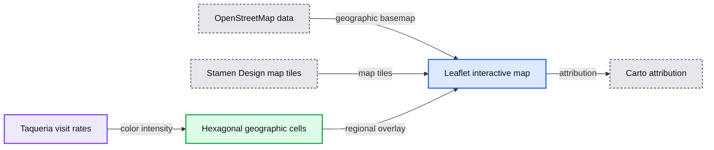
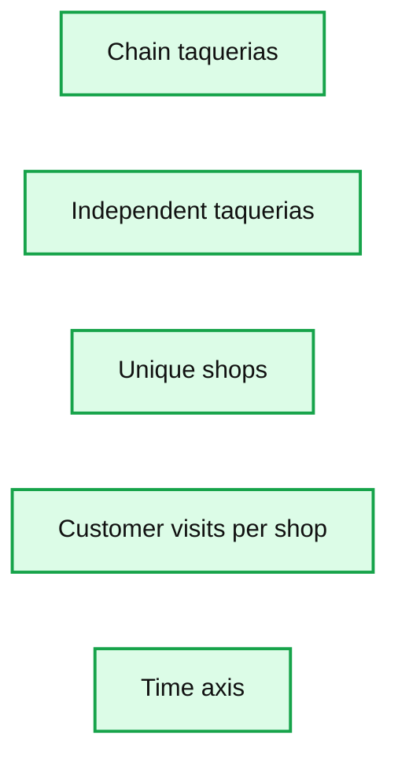
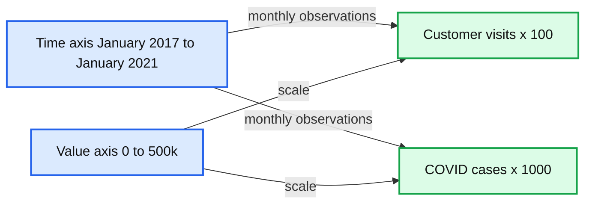
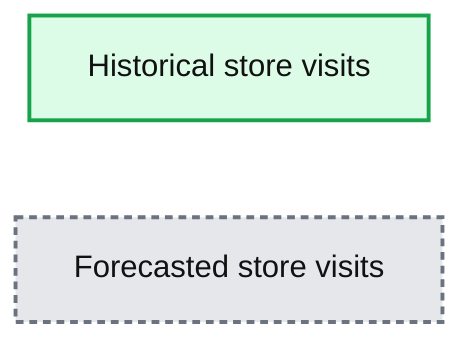

# Building Forward-Looking Intelligence With External Data

- Source: https://www.databricks.com/blog/2021/05/06/building-forward-looking-intelligence-with-external-data.html
- Published: 2021-05-06
- Authors: Tian Tan, Javier Soliz, Bryan Smith, Rob Saker
- Categories: solution-accelerators, data-science-machine-learning, data-engineering
- Images: 6 total, 5 extracted as architecture

This post was written in collaboration with the Foursquare data team. We thank co-author Javier Soliz, sales engineer specializing in data engineering and geospatial analysis at Foursquare, for his contribution.

 
 "In an interlocked global economy, triggering events can quickly set off a chain reaction," [wrote](https://www.bcg.com/publications/2020/using-uncertainty-to-your-advantage) Boston Consulting Group in early 2020 as the world grappled with the COVID pandemic. Already in the first few months of 2021, we have experienced wildfires in western Australia, winter storms causing millions to lose power for days in Texas, a powerful earthquake off the coast of Japan, flooding and evacuations in both eastern Australia and Hawaii, political unrest surrounding the U.S. presidential election and a single ship shutting down a major global shipping route between Europe and Asia – all while the world struggles to recover from a global recession triggered by the pandemic. With no shortage of triggering events, organizations are now investing heavily in [resilience](https://hbr.org/2020/07/a-guide-to-building-a-more-resilient-business).

A common notion of resilience is a return to normalcy following a disruptive event. But as the COVID pandemic illustrates, what was normal before may not be normal after. We've seen  [a remarkable shift](https://www.mckinsey.com/~/media/mckinsey/industries/retail/our%20insights/how%20covid%2019%20is%20changing%20consumer%20behavior%20now%20and%20forever/how-covid-19-is-changing-consumer-behaviornow-and-forever.pdf) in patterns of consumer mobility and spending. Once the initial panic over shortages of staples, such as [toilet paper](https://www.nature.com/articles/d41586-020-01836-1?error=cookies_not_supported&code=41d7a58d-432e-455b-8592-9383469fed21) subsided, [oat milk](https://www.fooddive.com/news/the-winners-and-losers-for-category-sales-during-the-first-7-months-of-the/587793/) and [sweatpants](https://www.fastcompany.com/90580841/covid-19-upended-fashion-trends-but-will-they-last-history-offers-some-clues) became the new must-have items. Businesses that  could fulfill this demand through online purchasing, home delivery and curbside pickup saw [significant growth](https://www.ft.com/content/18112bea-b502-41b5-ab8f-939d272e4477), while others saw their share of the market [decline](https://www.vox.com/recode/22379584/spending-foot-traffic-earnest-research-data-pandemic-recovery). Emerging from the pandemic, even [more shifts](https://www.mckinsey.com/business-functions/marketing-and-sales/our-insights/survey-us-consumer-sentiment-during-the-coronavirus-crisis) in consumer spending patterns are expected.

The bottom line for businesses is that the uncertainty that affects their internal operations also affects the consumers they serve. Organizations seeking resilience need not only an internal focus on performance management but an external focus on the markets within which they operate.

## Building forward-looking intelligence

The Texas-based grocery chain, HEB, provides an excellent example of how organizations may balance an inward focus on [performance management](https://retailwire.com/discussion/h-e-b-gives-100-bills-to-all-its-employees-for-top-grocer-ranking/) with an outward focus on risk detection. Leveraging [methodologies](https://hbr.org/2020/07/learning-from-the-future) that examine potential future scenarios to understand an organization's particular vulnerabilities, HEB was able to identify key risks to its organization well ahead of the pandemic. As the COVID crisis emerged, the grocer [knew to be on the lookout](https://www.texasmonthly.com/food/heb-prepared-coronavirus-pandemic/) for potential disruptions in regions critical to its supply chain and began the process of stocking up on essential items likely to be affected.

While a pandemic was not a specific threat identified by HEB, its assessment of its organization's vulnerabilities informed it where to look for emerging threats. The signals needed to identify those threats would not be found in its internal data until the threat was already upon the organization, so it looked to outside information sources to provide it the early warning it needed to put its planned response in motion. HEB's ability to successfully navigate the early days of the COVID pandemic is multifaceted, but looking outside the organization for forward-looking signals was a key part of it. For its early, effective and on-going efforts in managing the pandemic, HEB was recognized as the [2020 Grocer of the Year](https://www.grocerydive.com/news/grocer-of-year-h-e-b-2020/588866/) by GroceryDive, a leading trade journal.

## Leveraging external data

The growing awareness of the need for organizations to look beyond their own four-walls is driving a surge in interest in external data sources. A recent survey by Forrester indicates 70% of organizations acquired or were in the process of acquiring new external data assets and another 17% reporting intending to do so within the coming year. In response, there are a growing number of data providers, aggregators and marketplaces making all types of information, such as weather data, more accessible. (See also [*alternative data*](https://www.databricks.com/glossary/alternative-data).)

**Figure 1.** Commonly used external data from a [report](https://www.mckinsey.com/business-functions/mckinsey-digital/our-insights/harnessing-the-power-of-external-data) by McKinsey & Company

Effective use of such information requires careful consideration. Here are a few best practices:

**Before acquiring external data, carefully consider the insights your organization wishes to obtain from it. **A careful review of the terms and conditions associated with the data, as well as a consideration of how the data is sourced and how customers might respond  to your company using it, should help you steer clear of potential problems.

If cleared for use, it is important to understand how the data  is collected and prepared for distribution, how far back the data is available, and how fit it is for your organization's intended uses. Many data providers make both documentation and samples available for just this purpose.

**Weigh the technical challenges of leveraging the external data sources.** The volume of historical data and periodic updates, the frequency with which it is updated and the mechanisms by which data is made available are key considerations. Also determine how data assembled outside the organization may be reconciled with internally generated data. Differences in temporal and spatial levels of granularity, as well as different ways of expressing overlapping dimensions, may require the data to undergo significant processing to be made available for analysis. For many organizations, the physical and logical challenges of integrating external data necessitate the adoption of new, more flexible and more cost-effective data management approaches over classic data warehousing approaches developed for the analysis of operational information.

**Ensure value is derived from the data on an ongoing basis. **Careful documentation, education and evangelism, and ongoing utilization monitoring can help ensure the data earns its keep. Many larger data providers assist their customers with this and may be able to provide guidance and best practices. These suggestions and many others for the effective use of external data can be found in published guidance from both [McKinsey](https://www.mckinsey.com/business-functions/mckinsey-digital/our-insights/harnessing-the-power-of-external-data) and [Forrester](https://www.forrester.com/report/The-Insights-Professionals-Guide-To-External-Data-Sourcing/RES139331?objectid=RES139331).

## Examining foot traffic with Foursquare data

To further explore how external data may be employed, we partnered with [Foursquare](https://foursquare.com/), a leading provider of location technology and data, to examine the impact of COVID on taco shops in the US.

Why taco shops? Like most quick service restaurants, these establishments are highly [dependent on foot traffic](https://www.nrn.com/quick-service/visits-quick-service-restaurants-11-nationally-covid-19-outbreak), a key aspect of consumer engagement disrupted during the pandemic. These establishments also tend to be smaller, independent businesses and as such, as [has been noted](https://www.texasmonthly.com/food/taco-endures-covid19-coronavirus/) in some regional reporting, are more capable of adapting their business models in response to the pandemic.. Finally, while this analysis can be applied to any number of businesses represented in the Foursquare dataset, two of our authors are from Texas, where tacos are a [much loved](https://www.travelandleisure.com/food-drink/taco-tuesdays-with-texas-chefs) regional staple.

With foot traffic data collected through Foursquare's Pilgrim SDK and made available through its Places and [Visits](https://foursquare.com/products/visits) databases, we examined the visitation rates of customers to taco shops in various regions of the country. Leveraging population estimates from the US Census Bureau, we were able to see a clear picture of the regional importance of these establishments.

**Summary:** Visits to taquerias are represented by colored hexagonal cells across the United States, with map and attribution layers.

**Components:**

- Hexagonal geographic cells using the Uber H3 grid system
- Leaflet interactive map
- OpenStreetMap geographic data
- Stamen Design map tiles
- Carto attribution layer
- Taqueria visit-rate color scale relative to population

**Flows:**

- Taqueria visit-rate data -> Hexagonal geographic cells: color intensity by regional visitation rate
- OpenStreetMap geographic data -> Leaflet interactive map: geographic basemap
- Stamen Design map tiles -> Leaflet interactive map: map tiles
- Leaflet interactive map -> Carto attribution layer: attribution display

**Numbers:** 2017 through 2020, -3, 2, Q4, 6, CC BY 3.0

source image: https://www.databricks.com/wp-content/uploads/2021/05/Building-Forward-Looking-Intelligence-with-External-Data-blog-featured-img.jpg

**Figure 2**. Visits to taquerias relative to population size, logarithmically scaled, for the years 2017 through 2020

To align the point locations of individual businesses with the county-level metrics provided by the US Census Bureau, we leveraged the [Uber H3 grid system](https://h3geo.org/docs/core-library/restable/), which maps geographic locations to hexagonal grids of varying resolutions. This system made it easier for us to overlay additional datasets, such as county-level COVID case counts.

Our analysis shows that while the number of taco shops has been increasing over the last few years, customer visits per restaurant had declined prior to the COVID pandemic. While the vast majority of restaurants are independent, the bulk of the traffic to taco shops was consumed by chain establishments.

**Summary:** Stacked bars show per-location customer visits for independent and chain taquerias over time, alongside the share of unique shops.

**Components:**

- Chain taquerias
- Independent taquerias
- Unique shops
- Time axis
- Customer visits per shop axis

**Flows:**

- none

**Numbers:** 0, 5k, 10k, 15k, 20k, 25k, 30k, 13%, 87%, 2017-01-01, 2017-04-01, 2017-07-01, 2017-10-01, 2018-01-01, 2018-04-01, 2018-07-01, 2018-10-01, 2019-01-01, 2019-04-01, 2019-07-01, 2019-10-01, 2020-01-01, 2020-04-01, 2020-07-01, 2020-10-01

source image: https://www.databricks.com/wp-content/uploads/2021/05/Building-Forward-Looking-Intelligence-with-External-Data-blog-img-3.png

**Figure 4.** Per location customer visits for independent vs. chain taquerias

With the emergence of COVID in early 2020, a strong initial dip in visitations led to a return of customers to stores in May at about 75% the levels seen across prior years.

source image: https://www.databricks.com/wp-content/uploads/2021/05/Building-Forward-Looking-Intelligence-with-External-Data-blog-img-4.png

**Figure 5.** Impact of COVID on store visitations

Examining year-over-year numbers, the independent restaurants appear to have recovered better than chains following this initial dip. As reported in other venues, the agility of smaller, independent establishments may account for some of their better rebound. Shop local efforts may also have contributed to the pattern with customers favoring neighborhood establishments over larger chains. But independent restaurants have also seen better year-over-year visitation numbers relative to chains just prior to the pandemic, indicating that forces favoring them in 2020 predate the pandemic.

**Summary:** Line chart comparing customer visits and COVID cases from January 2017 through January 2021.

**Components:**

- Customer visits x 100 series
- COVID cases x 1000 series
- Time axis from January 2017 to January 2021
- Value axis from 0 to 500k

**Flows:**

- none

**Numbers:** 0, 100k, 200k, 300k, 400k, 500k, x 100, x 1000, January 2017, April 2017, July 2017, October 2017, January 2018, April 2018, July 2018, October 2018, January 2019, April 2019, July 2019, October 2019, January 2020, April 2020, July 2020, October 2020, January 2021

source image: https://www.databricks.com/wp-content/uploads/2021/05/Building-Forward-Looking-Intelligence-with-External-Data-blog-img-5.png

**Figure 6.** Year-over-year changes in shop visits for independent vs. chain restaurants

This is a positive bit of news for these small businesses which have been losing ground to chain restaurants. Looking ahead, we forecast continued overall improvements in visitation numbers which should provide good news for independents and chains alike. That said, these projections depend on reliable forecasts of COVID numbers, something that has alluded public health experts to date. In our analysis we made what we felt was a reasonable projection for a limited period of time, but in the end we found that forecasts were only reliable for a 2-3 month horizon.  All of this is to say that there are still many unknowns, and while we are hopeful for a recovery, this is a scenario that will need to be frequently revisited as new information is available. Based on our experience with other QSRs and retailers, we believe this same caveat applies broadly across the industry.

**Summary:** The chart shows historical and forecasted store visits over time for selected regions.

**Components:**

- Historical store visits
- Forecasted store visits

**Flows:**

- none

**Numbers:** 0, 5M, 10M, 15M, 20M, 25M, 30M, 35M, 40M, 45M; 2017-01-01, 2017-04-01, 2017-07-01, 2017-10-01, 2018-01-01, 2018-04-01, 2018-07-01, 2018-10-01, 2019-01-01, 2019-04-01, 2019-07-01, 2019-10-01, 2020-01-01, 2020-04-01, 2020-07-01, 2020-10-01, 2021-01-01

source image: https://www.databricks.com/wp-content/uploads/2021/05/Building-Forward-Looking-Intelligence-with-External-Data-blog-img-6.png

**Figure 7.** Historical and forecasted store visits for subset of regions for which forecasts could be made

To examine our analysis in more detail, including the data preparation work required to spatially align our datasets, please explore the following notebooks:

- [FSQ 01: Data Preparation](https://www.databricks.com/notebooks/external-data/fsq-01-data-prep.html)
- [FSQ 02: Exploratory Data Analysis](https://www.databricks.com/notebooks/external-data/fsq-02-exploratory-analysis.html)
- [FSQ 03: Forecasting](https://www.databricks.com/notebooks/external-data/fsq-03-forecasting.html)

*Databricks and Foursquare would like to extend our best wishes to all the local restaurateurs and their employees who have and continue to navigate the uncertainty of the pandemic. Please remember to *[*support your local restaurants*](https://www.today.com/food/how-help-local-restaurants-stay-afloat-during-covid-19-pandemic-t203702)*.*
