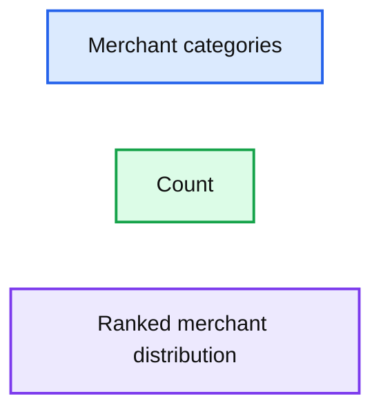
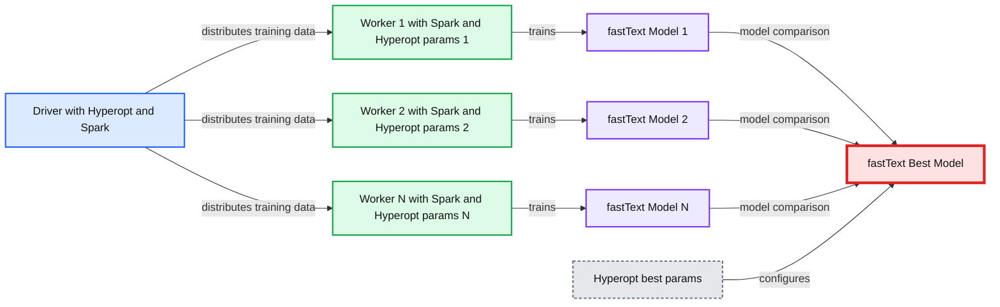
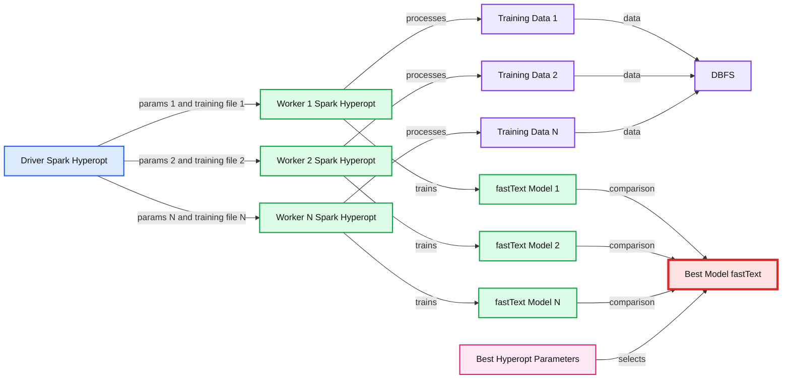

# Improving Customer Experience With Transaction Enrichment

- Source: https://www.databricks.com/blog/2021/05/10/improving-customer-experience-with-transaction-enrichment.html
- Published: 2021-05-10
- Authors: Milos Colic
- Categories: engineering, solution-accelerators, data-science-machine-learning
- Images: 10 total, 7 extracted as architecture

The retail banking landscape has dramatically changed over the past five years with the accessibility of open banking applications, mainstream adoption of Neobanks and the recent introduction of tech giants into the financial services industry. According to [a recent Forbes article](https://www.forbes.com/sites/zachconway/2017/04/19/why-more-millennials-would-rather-visit-the-dentist-than-listen-to-banks/), millennials now represent 75% of the global workforce, and "71% claim they'd "rather go to the dentist than to take advice from their banks". The competition has shifted from a 9 to 5 pm brick-and-mortar branch network to winning over digitally savvy consumers who are becoming more and more obsessed with the notions of simplicity, efficiency, and transparency. Newer generations are no longer interested to hear generic financial advice from a branch manager but want to be back in control of their finances with personalized insights, in real time, through the comfort of their mobile banking applications. To remain competitive, banks have to offer an engaging mobile banking experience that goes beyond traditional banking via personalized insights, recommendations, setting financial goals and reporting capabilities – all powered by advanced analytics like [geospatial](https://www.databricks.com/blog/2021/04/13/identifying-financial-fraud-with-geospatial-clustering.html) or natural language processing (NLP).

These capabilities can be especially profound given the sheer amount of data banks have at their fingertips. According to 2020 research from the [Nilson Report](https://nilsonreport.com/), roughly 1 billion card transactions occur every day around the world (100 million transactions in the US alone). That is 1 billion data points that can be exploited every day to benefit the end consumers, rewarding them for their loyalty (and for the use of their data) with more personalized insights. On the flip side, that is 1 billion data points that must be acquired, curated, processed, categorized and contextualized, requiring an analytic environment that supports both data and AI and facilitates collaboration between engineers, scientists and business analysts. SQL does not improve customer experience. AI does.

In this new [solution accelerator](https://www.databricks.com/solutions/accelerators) (publicly accessible notebooks are reported at the end of this blog), we demonstrate how [the lakehouse architecture](https://www.databricks.com/blog/2020/01/30/what-is-a-data-lakehouse.html)enables banks, open banking aggregators and payment processors to address the core challenge of retail banking: merchant classification. Through the use of notebooks and industry best practices, we empower our customers with the ability to enrich transactions with contextual information (brand, category) that can be leveraged for downstream use cases such as customer segmentation or fraud prevention.

## Understanding card transactions

The dynamics of a card transaction are complex. Each action involves a point of sales terminal, a merchant, a payment processor gateway, an acquiring bank, a card processor network, an issuer bank and a consumer account. With many entities involved in the authorization and settlement of a card transaction, the contextual information carried forward from a merchant to a retail bank is complicated, sometimes misleading and oftentimes counter-intuitive for end consumers and requires the use of advanced analytics techniques to extract clear Brand and Merchant information. For starters, any merchant needs to agree on a merchant category code (MCC), a 4 digit number used to classify a business by the types of goods or services it provides (see list). MCC by itself is usually not good enough to understand the real nature of any business (e.g. large retailers selling different goods) as it is often too broad or too specific.

Merchant Category Codes (Source: https://instabill.com/merchant-category-code-mcc-basics/)

In addition to a complex taxonomy, the MCC is sometimes different from one point of sales terminal to another, even given the same merchant. Relying only on MCC code is not sufficient enough to drive a superior customer experience and must be combined with additional context, such as transaction narrative and merchant description to fully understand the brand, location, and nature of goods purchased. But here is the conundrum. The transaction narrative and merchant description is a free form text filled in by a merchant without common guidelines or industry standards, hence requiring a data science approach to this data inconsistency problem. In this solution accelerator, we demonstrate how text classification techniques such as [fasttext](https://fasttext.cc/) can help organizations better understand the brand hidden in any transaction narrative given a reference data set of merchants. How close is the transaction description "STARBUCKS LONDON 1233-242-43 2021" to the company "Starbucks"?

An important aspect to understand is how much data do we have at our disposal to learn text patterns from. When it comes to transactional data, it is very common to come across a large disparity in available data for different merchants. This is perfectly normal and it is driven by the shopping patterns of the customer base. For example, it is to be expected that we will have easier access to Amazon transactions than to corner shop transactions simply due to the frequency of transactions happening at these respective merchants. Naturally, transaction data will follow a [power law distribution](https://en.wikipedia.org/wiki/Power_law)(as represented below) in which a large portion of the data comes from a few merchants.

**Summary:** The chart shows a power law distribution of transaction counts across merchants.

**Components:**

- Merchants: Tesco, Ringgo, South West, Wickes, Londis, Compass Group, Utilita Energy, McQueens D, Equifax, ClassPass, Ford Credit, Bank of Scotland, Jurys Inn, Lycambobile, Pull & Bear, Avon UK, Burberry, USC, Garfunkels, and IWOOT.
- Transaction count axis: count measurement, technology unspecified.
- Merchant axis: merchant categories, technology unspecified.

**Flows:**

- Merchants -> Transaction count: transaction volume distribution

**Numbers:** 0, 1M, 2M, 3M, 4M, 5M, 6M

source image: https://www.databricks.com/wp-content/uploads/2021/05/imrpoving-cx-image-2.png

## Our approach to fuzzy string matching

The challenge of approaching this problem from fuzzy string matching is that simple, larger parts of the description and merchant strings do not match. Any string-type distance would be very high and, in effect, any similarity very low. What if we changed our angle? Is there a better way to model this problem? We believe that the problem outlined above would better be modeled by document (free text) classification rather than string similarity. In this solution accelerator, we demonstrate how fasttext helps us efficiently solve the description-to-merchant translation and unlock advanced analytics use cases.

A popular approach in recent times is to represent text data as numerical vectors, making two prominent concepts appear: word2vec and doc2vec ([see blog](https://medium.com/wisio/a-gentle-introduction-to-doc2vec-db3e8c0cce5e)). Fasttext comes with its own built-in logic that converts this text into vector representations based on two approaches, cbow and skipgrams ([see documentation](https://fasttext.cc/docs/en/unsupervised-tutorial.html)), and depending on the nature of your data, one representation would perform better than the other. Our focus is not on dissecting the internals of the logic used for vectorization of text, but rather on the practical usage of the model to solve text classification problems when we are faced with thousands of classes (merchants) that text can be classified into.

## Generalizing approach to card transactions

To maximize the benefits of the model, data sanitization and stratification are key! Machine learning (ML) simply scales and performs better with cleaner data. With that in mind, we will ensure our data is stratified with respect to merchants. We want to ensure we can provide a similar amount of data per merchant for the model to learn from. This will avoid the situation in which the model would bias towards certain merchants just because of the frequency at which shoppers are spending with them. For this purpose we are using the following line of code:

Stratification is ensured by Spark sampleBy method, which requires a column over whose values stratification will occur, as well as a dictionary of strata label to sample size mappings. In our solution, we have ensured that any merchant with more than 100 rows of available labeled data is kept in the training corpus. We have also ensured that zero class (unrecognized merchant) is over-represented in the 10:1 ratio due to higher in-text perplexity in the space of transactions that our model cannot learn from. We are keeping zero class as a valid classification option to avoid inflation of false positives. Another equally valid approach is to calibrate each class with a threshold probability of the class at which we no longer trust the model-produced label and default to the "Unknown Merchant" label. This is a more involved process, therefore, we opted for a simpler approach. You should only introduced complexity in ML and AI if it brings obvious value.

**Summary:** The chart shows merchant transaction counts, with a long tail from the most frequent to least frequent merchants.

**Components:**

- Merchant axis: merchant categories, technology not shown
- Count axis: transaction frequency, technology not shown
- Ranked merchant distribution: filled area chart, technology not shown

**Flows:**

- none

**Numbers:** 0, 1000, 2000, 3000, 4000, 5000

source image: https://www.databricks.com/wp-content/uploads/2021/05/imrpoving-cx-image-3.png

From the cleaning perspective, we want to ensure our model is not stifled by time spent learning from insignificant data. One such example is dates and amounts that may be included in the transaction narrative. We can't extract merchant-level information based on the date that transaction happened. If we add to this consideration that merchants do not follow the same standard of representation when it comes to dates, we immediately conclude that dates can safely be removed from the descriptions and that this action will help the model learn more efficiently. For this purpose, we have based our cleaning strategy on the information presented in the [Kaggle blog](https://www.kaggle.com/edrushton/removing-dates-data-cleaning). As a data cleaning reference, we present the full logical diagram of how we have cleaned and standardized our data. This being a logical pipeline the end-user of this solution can easily modify and/or extend the behavior of any one of these steps and achieve a bespoke experience.

**Summary:** ETL pipeline that cleans and formats raw transaction data, samples it by merchant, and splits each merchant’s data into test and train sets.

**Components:**

- Raw Data: raw transaction records
- Preprocessor: clean and format
- Clean Data: cleansed transaction records
- Formatted Data: standardized and labeled records
- ETL: extraction, transformation, and loading pipeline
- Preprocessor: merchant-stratified sampling
- Amazon Data, ESW Data, C-Brewer Data, and other merchant data: per-merchant stratified samples
- Preprocessor: test and train split
- Test Data: test samples
- Train Data: training samples

**Flows:**

- Raw Data -> Clean and Format Preprocessor: raw transaction descriptions
- Clean and Format Preprocessor -> Clean Data: cleaned data
- Clean Data -> Formatted Data: formatted data
- Formatted Data -> Sample Preprocessor: standardized labeled records
- Sample Preprocessor -> Amazon Data: merchant sample
- Sample Preprocessor -> ESW Data: merchant sample
- Sample Preprocessor -> C-Brewer Data: merchant sample
- Sample Preprocessor -> Other Merchant Data: merchant sample
- Amazon Data -> Test and Train Split Preprocessor: sampled merchant data
- ESW Data -> Test and Train Split Preprocessor: sampled merchant data
- C-Brewer Data -> Test and Train Split Preprocessor: sampled merchant data
- Other Merchant Data -> Test and Train Split Preprocessor: sampled merchant data
- Test and Train Split Preprocessor -> Test Data: 10% sample per merchant
- Test and Train Split Preprocessor -> Train Data: 90% sample per merchant

**Numbers:** 10%, 90%, 7894, 18, 28, 21, 1 in 1rebel, 1 in label markers

```mermaid
%% ETL transaction cleansing, merchant sampling, and test train splitting
flowchart LR
    raw[Raw Data] -->|raw transactions| clean[Clean and Format]
    clean -->|cleaned data| cleanData[Clean Data]
    cleanData -->|formatted records| formatted[Formatted Data]
    formatted -->|labeled records| sample[Merchant Sampling]
    sample -->|merchant sample| merchants[Per Merchant Samples]
    merchants -->|sampled data| split[Test Train Split]
    split -->|10 percent per merchant| test[Test Data]
    split -->|90 percent per merchant| train[Train Data]

    classDef client fill:#dbeafe,stroke:#2563eb,stroke-width:2px,color:#111
    classDef service fill:#dcfce7,stroke:#16a34a,stroke-width:2px,color:#111
    classDef store fill:#ede9fe,stroke:#7c3aed,stroke-width:2px,color:#111
    classDef cache fill:#fef3c7,stroke:#d97706,stroke-width:2px,color:#111
    classDef queue fill:#cffafe,stroke:#0891b2,stroke-width:2px,color:#111
    classDef critical fill:#fee2e2,stroke:#dc2626,stroke-width:4px,color:#111
    classDef external fill:#e5e7eb,stroke:#6b7280,stroke-width:2px,color:#111,stroke-dasharray:4 3
    classDef decision fill:#fce7f3,stroke:#db2777,stroke-width:2px,color:#111

    class raw,cleanData,formatted,merchants,test,train store
    class clean,sample,split service
```

source image: https://www.databricks.com/wp-content/uploads/2021/05/imrpoving-cx-image-4.png

After getting the data into the right representation, we have leveraged the power of MLflow, [Hyperopt](https://docs.databricks.com/applications/machine-learning/automl-hyperparam-tuning/hyperopt-concepts.html) and Apache Spark™ to train fasttext models with different parameters. MLflow enabled us to track many different model runs and compare them. Critical functionality of MLflow is its rich UI, which makes it possible to compare hundreds of different ML model runs across many parameters and metrics:

**Summary:** Parallel-coordinates visualization comparing fasttext model runs across hyperparameters and accuracy metrics, with line color indicating a score scale.

**Components:**

- dim hyperparameter axis
- epoch hyperparameter axis
- lr learning-rate axis
- ngram_size hyperparameter axis
- sample-size hyperparameter axis
- median_acc median accuracy metric axis
- q_25_acc 25th-quantile accuracy metric axis
- q_5_acc 5th-quantile accuracy metric axis
- Color scale for model-run scores

**Flows:**

- dim -> epoch: Model-run parameter values
- epoch -> lr: Model-run parameter values
- lr -> ngram_size: Model-run parameter values
- ngram_size -> sample-size: Model-run parameter values
- sample-size -> median_acc: Model-run parameter values
- median_acc -> q_25_acc: Accuracy metrics
- q_25_acc -> q_5_acc: Accuracy metrics

**Numbers:** dim: 120.00000, 100.00000, 80.00000, 60.00000, 40.00000, 20.00000; epoch: 15.00000, 14.00000, 12.00000, 10.00000, 8.00000, 6.00000, 5.00000; lr: 0.39956, 0.35000, 0.30000, 0.25000, 0.20000, 0.15000, 0.10000, 0.05767; ngram_size: 4.00000, 3.50000, 3.00000, 2.50000, 2.00000; sample-size: 30.00000, 25.00000, 20.00000, 15.00000, 10.00000, 5.00000; median_acc: 0.99599, 0.95000, 0.90000, 0.85000, 0.80000, 0.75000, 0.70000, 0.65000, 0.62048; q_25_acc: 0.98805, 0.80000, 0.60000, 0.40000, 0.20000, 0.00200; q_5_acc: 0.92786, 0.80000, 0.60000, 0.40000, 0.20000, 0.00000; color scale: 0, 0.2, 0.4, 0.6, 0.8

source image: https://www.databricks.com/wp-content/uploads/2021/05/imrpoving-cx-image-5.jpg

For a reference on how to parameterize and optimize a fasttext model, please refer to the [documentation.](https://fasttext.cc/docs/en/python-module.html) In our solution, we have used the `train_unsupervised` training method. Given the volumes of merchants we had at our disposal (1000+), we've realized that we cannot properly compare the models based on one metric value. Generating a confusion matrix with 1000+ classes might not bring desired simplicity of interpretation of performance. We have opted for an accuracy per percentile approach. We have compared our models based on performance on median accuracy, worst 25th percentile and worst 5th percentile. This gave us an understanding of how our model's performance is distributed across our merchant space.

**Summary:** Distributed Hyperopt and Spark workers train multiple fastText models and select the best model with optimized parameters.

**Components:**

- Driver using Hyperopt and Apache Spark
- Driver training data
- Worker 1 using Apache Spark and Hyperopt parameters 1
- Worker 1 training data
- fastText Model 1
- Worker 2 using Apache Spark and Hyperopt parameters 2
- Worker 2 training data
- fastText Model 2
- Worker N using Apache Spark and Hyperopt parameters N
- Worker N training data
- fastText Model N
- fastText Best Model
- Hyperopt best parameters

**Flows:**

- Driver training data -> Worker 1 training data: distributed training data
- Driver training data -> Worker 2 training data: distributed training data
- Driver training data -> Worker N training data: distributed training data
- Worker 1 training data -> Model 1: model training
- Worker 2 training data -> Model 2: model training
- Worker N training data -> Model N: model training
- Models 1, 2, and N -> Best Model: model comparison and selection
- Best parameters -> Best Model: selected Hyperopt parameters

**Numbers:** 1, 2, N

source image: https://www.databricks.com/wp-content/uploads/2021/05/imrpoving-cx-image-6.png

As a part of our solution we have implemented integration of fasttext model with MLflow and are able to load model via MLflow APIs and apply the best model at scale via prepackaged Spark udfs as in code below:

This level of simplicity in applying a solution is critical. One can rescore historical transactional data with several lines of code once the model has been trained and calibrated. These few lines of code unlock customer data analytics like never before. Analysts can finally focus on delivering complex advanced data analytics use cases in both streaming or batch, such as customer lifetime value, pricing, customer segmentation, customer retention and many other analytics solutions.

## Performance, performance, performance!

The reason behind all this effort is simple: obtain a system that can automate the task of transaction enrichment. And for a solution to be trusted in automated running mode, performance has to be on a high level per merchant. We have trained several hundred different configurations and compared these models with a focus on low performer merchants. Our 5th lowest percentile accuracy achieved was at around 93% accuracy; our median accuracy achieved was at 99%. These results give us the confidence to propose automated merchant categorization with minimal human supervision.

These results are great, but a question comes to mind. Have we overfitted? Overfitting is only a problem when we expect a lot of generalization from our model, meaning when our training data is only representing a very small sample of reality and new arriving data wildly differs from the training data. In our case, we have very short documents with grammars of each merchant that are reasonably simple. On the other hand, fasttext generates ngrams and skipgrams, and in transaction descriptions, this approach can extract all useful knowledge. These two considerations combined indicate that even if we overfit these vectors, which are by nature excluding some tokens from knowledge representation, we will generalize nevertheless. Simply put, the model is robust enough against overfitting given the context of our application. It is worth mentioning that all the metrics produced for model evaluation are computed over a set of 400,000 transactions, and this dataset is disjoint from the training data.

## Is this useful if we don't have a labeled dataset

This is a difficult question to answer with yes or no. However, as a part of our experimentation, we have formulated a point of view. With our framework in place, the answer is yes. We have performed several ML model training campaigns with different amounts of labeled rows per merchant. We have leveraged MLflow, Hyperopt and Spark to both train different models with different parameters and train different models with different parameters over different data sizes and cross-reference them and compare them over a common set of metrics.

**Summary:** Parallel Spark workers use Hyperopt to train fastText models on separate training datasets, then select a best model and hyperparameters.

**Components:**

- Driver using Apache Spark and Hyperopt
- Worker 1 using Apache Spark and Hyperopt
- Worker 2 using Apache Spark and Hyperopt
- Worker N using Apache Spark and Hyperopt
- Training Data 1, Training Data 2, and Training Data N
- DBFS storage
- fastText Model 1, Model 2, and Model N
- Best Model using fastText
- Best hyperparameters using Hyperopt

**Flows:**

- Driver -> Worker 1: parameters 1 and training file 1
- Driver -> Worker 2: parameters 2 and training file 2
- Driver -> Worker N: parameters N and training file N
- Worker 1 -> Training Data 1: processes training data
- Worker 2 -> Training Data 2: processes training data
- Worker N -> Training Data N: processes training data
- Training Data 1 -> DBFS: reads or writes data
- Training Data 2 -> DBFS: reads or writes data
- Training Data N -> DBFS: reads or writes data
- Worker 1 -> Model 1: trains fastText model
- Worker 2 -> Model 2: trains fastText model
- Worker N -> Model N: trains fastText model
- Models -> Best Model: compares trained models
- Hyperopt -> Best Model: selects best parameters and sample size

**Numbers:** 1, 2, N, Model 1, Model 2, Model N, parameters 1, parameters 2, parameters N, training file 1, training file 2, training file N

source image: https://www.databricks.com/wp-content/uploads/2021/05/improving-cx-image-7-wide.new_.png

This approach has enabled us to answer the question: What is the smallest number of labeled rows per merchant that I need to train the proposed model and score my historical transactional data? The answer is: as low as 50, yes, five-zero!

**Summary:** Parallel coordinates benchmark showing model hyperparameters and sample sizes against MLflow accuracy metrics.

**Components:**

- dim: model dimension parameter
- epoch: training epoch parameter
- lr: learning rate parameter
- ngram_size: n-gram size parameter
- sample-size: transaction sample size
- median_acc: median accuracy metric
- q_25_acc: 25th percentile accuracy metric
- q_5_acc: 5th percentile accuracy metric
- Color scale: accuracy from 0 to approximately 0.9

**Flows:**

- dim -> epoch: model configuration relationship
- epoch -> lr: training configuration relationship
- lr -> ngram_size: training configuration relationship
- ngram_size -> sample-size: feature and data-size relationship
- sample-size -> median_acc: sample size to median accuracy
- median_acc -> q_25_acc: accuracy percentile comparison
- q_25_acc -> q_5_acc: lower-tail accuracy comparison

**Numbers:** dim 20.00000, 40.00000, 60.00000, 80.00000, 100.00000, 120.00000; epoch 5.00000, 6.00000, 8.00000, 10.00000, 12.00000, 14.00000, 15.00000; lr 0.05444, 0.10000, 0.15000, 0.20000, 0.25000, 0.30000, 0.35000, 0.39688; ngram_size 2.00000, 2.50000, 3.00000, 3.50000, 4.00000; sample-size 50.00000, 100.00000, 150.00000, 200.00000, 250.00000; median_acc 0.00000, 0.20000, 0.40000, 0.60000, 0.80000, 0.99404; q_25_acc 0.00000, 0.20000, 0.40000, 0.60000, 0.80000, 0.98566; q_5_acc 0.00000, 0.20000, 0.40000, 0.60000, 0.80000, 0.92728; color scale 0, 0.2, 0.4, 0.6, 0.8, approximately 0.9

```mermaid
%% Parallel coordinates showing model parameters and accuracy metrics
flowchart LR
    A[dim] -->|configuration| B[epoch]
    B -->|configuration| C[lr]
    C -->|configuration| D[ngram size]
    D -->|feature setting| E[sample size]
    E -->|evaluation| F[median acc]
    F -->|percentile comparison| G[q 25 acc]
    G -->|lower tail comparison| H[q 5 acc]
    I[Color scale] -.->|accuracy encoding| F

    classDef client fill:#dbeafe,stroke:#2563eb,stroke-width:2px,color:#111
    classDef service fill:#dcfce7,stroke:#16a34a,stroke-width:2px,color:#111
    classDef store fill:#ede9fe,stroke:#7c3aed,stroke-width:2px,color:#111
    classDef cache fill:#fef3c7,stroke:#d97706,stroke-width:2px,color:#111
    classDef queue fill:#cffafe,stroke:#0891b2,stroke-width:2px,color:#111
    classDef critical fill:#fee2e2,stroke:#dc2626,stroke-width:4px,color:#111
    classDef external fill:#e5e7eb,stroke:#6b7280,stroke-width:2px,color:#111,stroke-dasharray:4 3
    classDef decision fill:#fce7f3,stroke:#db2777,stroke-width:2px,color:#111

    class A,B,C,D,E service
    class F,G,H critical
    class I external
```

source image: https://www.databricks.com/wp-content/uploads/2021/05/improving-cx-image-8.jpg

With only 50 records per merchant, we have maintained 99% median accuracy and the 5th lowest percentile has decreased performance by only a few percentage points to 85%. On the other hand, the results obtained for 100 records per merchant dataset were 91% accuracy for the lowest 5th percentile. This only indicates that certain brands do have a more perplexed syntax of descriptions and might need a bit more data. The bottom line is that the system is operational at great median performance and reasonable performance in edge cases with as few as 50 rows per merchant. This makes the entry barrier to merchant classification very low.

## Transaction enrichment to drive superior engagement

While retail banking is in the midst of transformation based on heightened consumer expectations around personalization and user experience, banks and financial institutions can learn a significant amount from other industries that have moved from wholesale to retail in their consumer engagement strategies. In the media industry, companies like Netflix, Amazon and Google have set the table for both new entrants and legacy players around having a frictionless, personalized experience across all channels at all times. The industry has fully moved from "content is king" to experiences that are specialized based on user preference and granular segment information. Building a personalized experience where a consumer gets value builds trust and ensures that you remain a platform of choice in a market where consumers have endless amounts of vendors and choices.

Learning from the vanguards of the media industry, retail banking companies that focus on banking experience rather than transactional data would not only be able to attract the hearts and minds of a younger generation but would create a mobile banking experience people like and want to get back to. In this model centered on the individual customer, any new card transaction would generate additional data points that can be further exploited to benefit the end consumer, drive more personalization, more customer engagement, more transactions, etc. -- all while reducing churn and dissatisfaction.

 Although the merchant classification technique discussed here does not address the full picture of personalized finance, we believe that the technical capabilities outlined in this blog are paramount to achieving that goal. A simple UI providing customers with contextual information (like the one in the picture above) rather than a simple "SQL dump" on a mobile device would be the catalyst towards that transformation.

In a future solution accelerator, we plan to take advantage of this capability to drive further personalization and actionable insights, such as customer segmentation, spending goals, and behavioral spending patterns (detecting life events), learning more from our end-consumers as they become more and more engaged and ensuring the value-added from these new insights benefit them.
 In this accelerator, we demonstrated the need for retail banks to dramatically shift their approach to transaction data, from an OLTP pattern on a data warehouse to an OLAP approach on a data lake, and the need for a lakehouse architecture to apply ML at an industry scale. We have also addressed the very important considerations of the entry barrier to implementation of this solution concerning training data volumes. With our approach, the entry barrier has never been lower (50 transactions by a merchant).

Try the below notebooks on Databricks to accelerate your digital banking strategy today and [contact us](https://www.databricks.com/company/contact) to learn more about how we assist customers with similar use cases.

 

[GET THE NOTEBOOK](https://notebooks.databricks.com/notebooks/FSI/merchant_classification/index.html)
