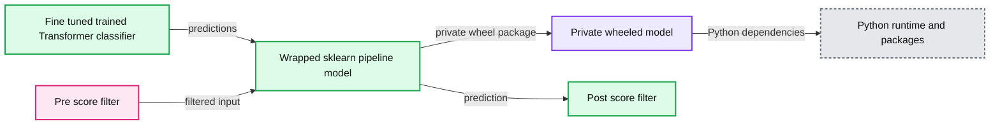
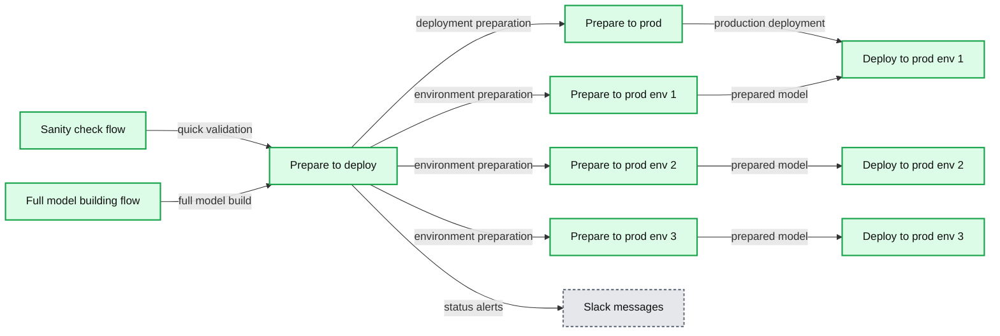
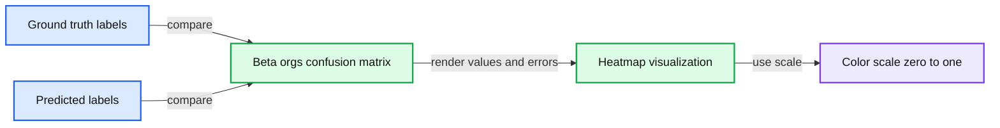

# How Outreach Productionizes PyTorch-based Hugging Face Transformers for NLP

- Source: https://www.databricks.com/blog/2021/05/14/how-outreach-productionizes-pytorch-based-hugging-face-transformers-for-nlp.html
- Published: 2021-05-14
- Authors: Andrew Brooks, Yong-Gang Cao, Yong Liu
- Categories: engineering, data-science-machine-learning
- Images: 5 total, 4 extracted as architecture

This is a guest blog from the data team at [Outreach.io](https://www.outreach.io/). We thank co-authors Andrew Brooks, staff data scientist (NLP), Yong-Gang Cao, machine learning engineer, and Yong Liu, principal data scientist, of Outreach.io for their contributions.

 
 At Outreach, a leading sales engagement platform, our data science team is a driving force behind our innovative product portfolio largely driven by deep learning and AI. We recently announced enhancements to the [Outreach Insights feature](https://www.outreach.io/explore), which is powered by the proprietary Buyer Sentiment deep learning model developed by the Outreach Data Science team. This model allows sales teams to deepen their understanding of customer sentiment through the analysis of email reply content, moving from just counting the reply rate to classification of the replier’s intent.

We use four primary classifications for email reply content: *positive*, *objection*, *unsubscribe* and *referral, *as well as finer sub-classifications. For example, for replies classified as an *objection*, we can break down how many replies are due to budget constraints vs. procurement timing issues. This is a gamechanger for the sales team, as it provides actionable insights for sales managers to coach their Sales Representatives to improve their strategies and performance.

This blog describes the technical details on how we develop the Buyer Sentiment deep learning model, which is a multiclass classifier for sales engagement email messages. In particular, we will explain an offline model development/experimentation, productionization and deployment steps.

## Overview of an ML model lifecycle: development and production

As discussed in many recent [articles](https://martinfowler.com/articles/cd4ml.html), the development of a machine learning (ML) model requires three major artifacts: data, model and code. To successfully develop and ship a ML model in production, we need to embrace the full lifecycle development for ML projects. **Figure 1** is a schematic view of Outreach’s full lifecycle development and production path**,** starting from data annotation to offline model development/experimentation, model productionization (model-preproduction), model deployment (staging and production) and, finally, online model monitoring and feedback loops. [Databricks](https://www.databricks.com/solutions/machine-learning)is used in model dev/pre-prod and CI/CD pipelines as execution servers (e.g., using GPU clusters in Databricks for model training).
  

**Summary:** Outreach’s lifecycle pipeline moves annotated data through model development, pre-production, staged and production deployment, application use, telemetry, and feedback-driven model updates.

**Components:**

- Annotation
- JSON dataset
- Model Dev
- GitHub
- Winning Model
- Model Pre-Prod
- MLflow experiment results
- Trained model artifacts
- Amazon ECR
- Docker image
- Model Staging
- SageMaker
- Kubernetes
- Model Prod
- Production endpoint
- Post Model Prod
- Application
- Telemetry

**Flows:**

- Annotation -> JSON dataset: publishes annotations
- JSON dataset -> Winning Model: consumed for model development
- Model Dev -> GitHub: publishes the winning model
- GitHub -> Winning Model: consumed by model development
- Winning Model -> MLflow experiment results: publishes experiment results
- MLflow experiment results -> Model Pre-Prod: publishes experiments
- Model Pre-Prod -> Trained model artifacts: publishes trained artifacts
- Model Pre-Prod -> Amazon ECR: publishes Docker image
- Model Pre-Prod -> Docker image: publishes Docker image
- Trained model artifacts -> Model Staging: deployed to hosting services
- Docker image -> Model Staging: deployed to hosting services
- Model Staging -> SageMaker: staging endpoint
- Model Staging -> Kubernetes: staging deployment
- SageMaker -> Model Prod: promotes or rolls back
- Kubernetes -> Model Prod: promotes or rolls back
- Model Prod -> Production endpoint: provides live traffic
- Production endpoint -> Application: used by the Outreach application
- Application -> Telemetry: generates telemetry
- Telemetry -> Winning Model: feedback loop for model drift monitoring and model update

**Numbers:** none

```mermaid
%% Outreach machine learning lifecycle from annotation through monitoring
flowchart LR
    A[Annotation] -->|Publish| J[JSON dataset]
    J -->|Consumed| W[Winning Model]
    D[Model Dev] -->|Publish| G[GitHub]
    G -->|Consumed| W
    W -->|Publish| M[MLflow experiment results]
    M -->|Publish| P[Model Pre-Prod]
    P -->|Publish| T[Trained model artifacts]
    P -->|Publish| E[Amazon ECR]
    P -->|Publish| X[Docker image]
    T -->|Deployed to hosting services| S[Model Staging]
    X -->|Deployed to hosting services| S
    S -->|Staging endpoint| H[SageMaker]
    S -->|Staging deployment| K[Kubernetes]
    H -->|Promote or rollback| R[Model Prod]
    K -->|Promote or rollback| R
    R -->|Live traffic| Q[Production endpoint]
    Q -->|Used by| U[Outreach App]
    U -->|Generates| Y[Telemetry]
    Y -->|Feedback loop for drift monitoring and model update| W

    classDef client   fill:#dbeafe,stroke:#2563eb,stroke-width:2px,color:#111
    classDef service  fill:#dcfce7,stroke:#16a34a,stroke-width:2px,color:#111
    classDef store    fill:#ede9fe,stroke:#7c3aed,stroke-width:2px,color:#111
    classDef cache    fill:#fef3c7,stroke:#d97706,stroke-width:2px,color:#111
    classDef queue    fill:#cffafe,stroke:#0891b2,stroke-width:2px,color:#111
    classDef critical fill:#fee2e2,stroke:#dc2626,stroke-width:4px,color:#111
    classDef external fill:#e5e7eb,stroke:#6b7280,stroke-width:2px,color:#111,stroke-dasharray:4 3
    classDef decision fill:#fce7f3,stroke:#db2777,stroke-width:2px,color:#111

    class A,D client
    class W,P,S,R,U service
    class J,M,T,E,X,Y store
    class G,H,K,Q external
```

source image: https://www.databricks.com/wp-content/uploads/2021/05/PyTorch-Databricks-Outreach.io-Use-Case-blog-img-1-1024x345.jpg

 Figure 1: Full Lifecycle View of Model Development and Production at Outreach

During the offline model development/experimentation stage (i.e., Model Dev step as labeled in Figure 1), we tried different types of ML models, such as SVM, FastText and Pytorch-based [Hugging Face](https://huggingface.co/) transformers. Based on our requirements (classification f1 scores initially for the English language, with multiple languages planned for the longer term), we settled on using Pytorch-based Hugging Face transformer (bert-uncased-small) for its high-performance classification results1).

However, productizing a prototype is still one of the most painful experiences faced by ML practitioners. You can trade speed for discipline by enforcing production-grade standards from the very beginning. However, this is often premature optimization, as ML models require many iterations and nonlinear processes, and many fail or substantially pivot before they ever ship. You can also trade engineering discipline for maximum flexibility from day one. However, this makes the journey from prototype to production more painful once complexity reaches a tipping point where marginal costs exceed marginal gains from each new enhancement.

The trade-off between discipline and flexibility is somewhere in the middle. For us, that means we don’t directly ship our prototype code and experiments, but we enforce the minimal amount of structure needed to 1) register results from each prototype experiment, so we don’t need to repeat them, especially unsuccessful experiments; 2) link prototype experiment results to source code, so we know what logic produced them and ensure reproducibility; and 3) enable historical prototype models to be loaded for offline analysis.

## Experiment, test, and deploy with MLflow Projects

Based on our full lifecycle analysis, we use [MLflow Projects](https://www.mlflow.org/docs/latest/projects.html#) as the common thread between model development and deployment to achieve this trade-off. MLflow Projects is a reasonably lightweight layer that centralizes and standardizes entry points and environment definitions with a self-documenting framework.

**Why we use MLflow Project: **

MLflow projects add virtually no weight to your project, especially if you’re already using MLflow Tracking and MLflow Models, for which there are built-in integrations.

1. **Smooth execution of code developed in IDE of choice. **
 → Support for running Databricks notebooks is first-class, but it can be cumbersome to run scripts. MLflow Project provides a smooth CLI for running .py and .sh files without unnecessary overhead like creating Apache Spark™ or Databricks jobs.
2. **Strong provenance tracing from source code to model results. **
 → Ability to run a script from a GitHub commit without pulling down code or losing provenance on local uncommitted code.
3. **Flexibility to prototype locally and then scale to remote clusters **
 → The MLflow Project API enables users to toggle from local to remote execution with the *--backend* argument, which points to a Databricks or kubernetes JSON cluster config created for a single-use operation. Dependencies are handled in code (Conda) rather than state (manually configured cluster), ensuring reproducibility.

**Model development mirrors CI/CD pattern**
 → While we refactor experiment code before deploying, the CI/CD pipeline invokes the train, test, and deploy pipeline following the same pattern from model development, so minimal “extra” effort must go from prototype experiment to production. The ML model artifacts (binaries, results, etc.) and deployment status are centralized into one system, which eases debugging by smoothing provenance tracking back from production traffic and incidents.

**How to use:**

1. Run local code locally (no provenance)` mlflow run ./ train`
2. Run remote code locally (provenance, but bound by local compute)`mlflow run https://github.com/your-GH/your-repo train --version 56a5aas`
3. Run remote code on a cluster (provenance + compute at scale)`mlflow run https://github.com/your-GH/your-repo train --config gpu_cluster_type.json --version 56a5aas`

## Three progressively wrapped model artifacts

One of our key considerations when developing a productionizable model is not just the model type (a fine-tuned [Pytorch-based Huggingface transformer model](https://github.com/huggingface/transformers)), but also the pre/post-process steps and the internally developed Python libraries that are used by the pre/post-process steps. We took a rigorous approach to treat the entire model pipeline as a single serializable artifact in the MLflow artifact store without external dependencies on accessing a GitHub repo at deployment time. We use the[scikit-learn Pipeline API](https://scikit-learn.org/stable/modules/generated/sklearn.pipeline.Pipeline.html) for the model pipeline implementation, which is the most widely-used Python library for ML pipeline building. This opens doors to integrate other pre/post-processing steps that are also scikit-learn pipeline API compliant. Additional advantages of using this pipeline approach include preventing data leaking and maintaining reproducibility.

Taking this approach resulted in three progressively wrapped model artifacts: a fine-tuned PyTorch transformer model that implements [scikit-learn baseEstimator and ClassifierMixin APIs](https://scikit-learn.org/stable/developers/develop.html#rolling-your-own-estimator), a scikit-learn Pipeline API compatible model pipeline that includes additional pre/post-processing steps (which we called pre-score filter and post-score filter) and a model pipeline that uses only locally bundled Python libraries without accessing any Github repos (**Figure 2**). Note that in the pre-score filter, we could add extra steps such as caching (for the same email message, we can serve the same prediction) and filtering out certain types of messages (e.g., bypassing those out-of-office messages). Similarly, in the post-score filter step, we can return the prediction and additional provenance tracking information about model versions and detailed score probabilities for the endpoint consumer app to use.
  

**Summary:** The diagram shows three progressively wrapped artifacts that transform a fine-tuned Transformer classifier into a privately distributable Python wheel.

**Components:**

- Fine-tuned trained Transformer classifier using Transformer encoder layers and positional encoding
- Wrapped sklearn pipeline model with pre-score and post-score filters
- Private wheeled model packaged with Python and dependency metadata
- Python runtime and package dependencies including Python, pip, MLflow, scikit-learn, and cachetools

**Flows:**

- Fine-tuned trained Transformer classifier -> Wrapped sklearn pipeline model: model predictions with pre-score and post-score filtering
- Wrapped sklearn pipeline model -> Private wheeled model: packaged deployment artifact with bundled dependencies

**Numbers:**

- N x Transformer layers
- N x positional encoding paths
- Python 3.6.9
- pip 19.2.3
- mlflow 1.7.2
- scikit-learn 0.22.1
- cachetools 3.1.1
- paths include transformer versions 1.8.3 and 1.8.0

source image: https://www.databricks.com/wp-content/uploads/2021/05/Outreach.io-Use-Case-blog-img-2-1024x395.jpg

 Figure 2: Three progressively wrapped models for deployment

## Embrace the automation, CI/CD and monitoring

Like any other software system, the most boring, painful and error-prone part is the repetitive maintenance work in a machine learning system. Continuous Integration and Continuous Deployment/Delivery (CI/CD) is designed to bring automation and guard rails into a workflow – from building to deployments. We designed two flows (**Figure 3**); one serves a quick sanity check round for each pushed commit, which takes under 30 minutes. The other prepares, checks and deploys the entire model, which takes a few hours. (*Note: You can watch *[*this video*](https://www.youtube.com/watch?v=s-UuqCxEXWE&t=1s)* for more details on utilizing MLflow and Databricks*):
  

**Summary:** The diagram shows two CI/CD flows for validating, building, preparing, and deploying NLP models across multiple production environments.

**Components:**

- Sanity check flow
- Full model building flow
- Prepare to deploy
- Prepare to prod
- Deploy to prod env 1
- Deploy to prod env 2
- Deploy to prod env 3
- Prepare to prod env 1
- Prepare to prod env 2
- Prepare to prod env 3
- CI and deployment notifications
- Slack messages

**Flows:**

- Sanity check flow -> Prepare to deploy: quick validation
- Full model building flow -> Prepare to deploy: full model build
- Prepare to deploy -> Prepare to prod: deployment preparation
- Prepare to deploy -> Prepare to prod env 1: environment preparation
- Prepare to deploy -> Prepare to prod env 2: environment preparation
- Prepare to deploy -> Prepare to prod env 3: environment preparation
- Prepare to prod -> Deploy to prod env 1: production deployment
- Prepare to prod env 1 -> Deploy to prod env 1: prepared model
- Prepare to prod env 2 -> Deploy to prod env 2: prepared model
- Prepare to prod env 3 -> Deploy to prod env 3: prepared model
- CI and deployment notifications -> Slack messages: status alerts

**Numbers:** 12s, 0s, 16s, 8s, 2m 16s, 91m 40s, 1m 17s, 12m 7s, 1, 2, 3

source image: https://www.databricks.com/wp-content/uploads/2021/05/Outreach.io-Use-Case-blog-img-3-scaled-1-1024x433.jpg

 Figure 3: CI/CD flows

### Integration with tools

As a  SaaS company, Outreach has a wide choice of SaaS and open source tools to leverage. While most of our internal services use Ruby or Go languages, the data science team opted to use Python, [Databricks](https://www.databricks.com/) and [MLflow](https://www.databricks.com/product/managed-mlflow) for at-scale job runs. Thus, there was a need to create piping and integrations for all those tools almost from scratch. We dynamically generate conda and Databricks cluster config files for MLflow runs and put effort into synchronizing each step to construct the flows. We even weaved CircleCI and Concourse together to let them trigger each other (the same CircleCI flow is reused in CD for entire model building with different behaviors).

To do those, we exploited most capabilities of APIs from service providers – thanks to the excellent documentation from providers, open-source code from Databricks and support from both internal and external teams. There were several pitfalls, including version issues over time. Still, the caveat here is that all the tools we chose were originally not designed or tested to work together. It was up to us to overcome those initial drawbacks and provide feedback to the providers to allow them to work together.

### Version controls

No matter which programming languages you use, one big headache is dependency complexity. Any version change in the deep dependency graph can be a danger for the production system. In our CI/CD, we scan and freeze all versions and bundle all dependency binaries and models into the Docker image we use for deployments so that nothing changes in the production environment. Once the image is deployed, it’s no longer affected by external dependencies. We versioned our data in Amazon S3 and built models at different stages via [Model Registry](https://www.databricks.com/product/mlflow-model-registry)provided by MLflow.

### Guarded and staged model releases

As you can see from our CI/CD flows, we added several guard-rail steps along with staged environments for deployments. Besides regular [flake8](https://flake8.pycqa.org/en/latest/)-based style checks, unit tests and liveness checks, we automated and verified the entire lifecycle, from training to the endpoint test after the deployment of images for each commit (in less than half an hour). For the full model check (except for the stage environment), we created a pre-prod environment with identical resources with prod for canary test and staged release purposes (beta launch of new models). Beyond that, we also added a regression test step for a thorough examination against large datasets (around one hour load and quality tests) to ensure all quality and throughput variances would be captured before we proceed for beta or production release.

As a final defense, we also added human checkpoints against the regression test results or pre-production results to confirm the promotion of changes beyond automated threshold checks. To assist the understanding of the real-world impact of changes, besides producing overall metrics and utilizing MLflow for side-by-side comparisons, we made a polished visualization of the confusion matrix (**Figure 4**) from a logistic regression test, as MLflow hosted image artifacts to assist the comparison and judgments with details (true positive, false positive, false negative numbers and rates on each label and axis with colors for emphasis) since overall metrics don’t tell all the dangers to individual categories but do tell the error types. The human check could be lifted once we accumulated enough experiences from multiple upgrades/iterations, and those data points could be used for later automation.
  

**Summary:** A polished confusion matrix visualizes beta organization classification performance, including accuracy, per-class errors, and true-positive metrics.

**Components:**

- Beta orgs confusion matrix heatmap
- Ground truth label axis
- Predicted label axis
- Per-class TP, FP, FN, and rate annotations
- Color scale from 0.0 to 1.0

**Flows:**

- Ground truth labels -> Confusion matrix: compare against predicted labels
- Predicted labels -> Confusion matrix: populate classification outcomes

**Numbers:** Accuracy 0.81; total 100; visible cell counts include 19, 15, 11, 9, 8, 4, 3, 2, and 1; visible rates include 100.00%, 95.00%, 90.00%, 88.24%, 86.67%, 84.62%, 80.00%, 75.00%, 66.67%, 60.00%, 50.00%, 42.86%, 40.00%, 33.33%, 25.00%, 20.00%, 14.29%, 11.76%, 10.00%, 5.88%, and 4.76%; color scale 0.0 to 1.0.

source image: https://www.databricks.com/wp-content/uploads/2021/05/Outreach.io-Use-Case-blog-img-4-1-1024x802.jpg

 Figure 4: Polished Visualization of Confusion Matrix for Predictions

### Optimizing and monitoring of services

Having CI/CD to produce healthy service is just a start, but optimal running behavior and continuous health monitoring are must-haves. To optimize for obvious cases and repetitive cases, we added shortcuts and a cache layer on API to speed up serving. We initially used SageMaker for hosting our endpoints, but we found metrics related to model performance and results are minimal, so we switched to using Kubernetes and integration with Datadog for more in-depth monitoring. This brought us many advantages, including closer alignment with other internal teams, security, control and cost savings. Below are our Datadog dashboards that monitor all types of prediction trends over time, as well as latency percentiles at will. It also makes it easy to make an online prediction comparison between a new model and an old model by just one screen (e.g., when we split traffic to 50% on each, they are supposed to be statistically identical if models are the same). As you can see from the example dashboard (**Figure 5**), the built-in caching ability does play a positive role (the service latency could become nearly zero-second from time to time because of caching).
  

 Figure 5: Datadog Dashboard Monitoring of the Model Endpoint Service

## What’s next

This blog has focused on the end-to-end release of ML lifecycle as part of our product release using Databricks, MLflow, CircleCI, Concourse and other tools, including Datadog and Kubernetes. However, the iterative training and offline experimental flow can also benefit from additional automation. For example, standardizing how new training data is added and initiating training runs based on dynamic triggers like newly annotated data or user-provided feedback could improve overall system efficiency and shorten time-to-market for the top-performing model. More complete quality monitoring built-in to each stage with pre-set thresholds for gating releases could further improve efficiency.

Our deploy gate is still manual because, while we have target thresholds on critical metrics for releasing models, we haven’t codified every constraint and edge case that might give us pause before releasing a new model. Sometimes small offline error analyses are performed to provide the human understanding and confidence needed before releasing.

Another aspect that we have not covered in much detail is the annotation and feedback flow. While annotation provides the labeled data required to train and evaluate the model *before* releasing, the front-end of the released model can capture feedback directly from the users of the applications. We’ve integrated this feedback mechanism into the user experience such that user-corrected predictions produce data assets that can be incorporated into the training process. These labels are particularly impactful to model improvements as they push the model to change its behavior rather than duplicate simple patterns it already has learned and predicts correctly.

Finally, given our current flexibility to deploy to either Amazon SageMaker or local Kubernetes clusters for hosting services, we are also open to extending to other types of model hosting services such as [TorchServ](https://pytorch.org/serve/) in the future.

For a more detailed look, [check out the Summit session on the topic](https://www.databricks.com/session_na20/continuous-delivery-of-deep-transformer-based-nlp-models-using-mlflow-and-aws-sagemaker-for-enterprise-ai-scenarios) given by the blog's authors.

 

References:
1 [Liu, Y, Dmitriev, P, Huang, Y, et al. Transfer learning meets sales engagement email classification: Evaluation, analysis, and strategies. Concurrency Computat Pract Exper. 2020;e5759.](https://onlinelibrary.wiley.com/doi/10.1002/cpe.5759)
