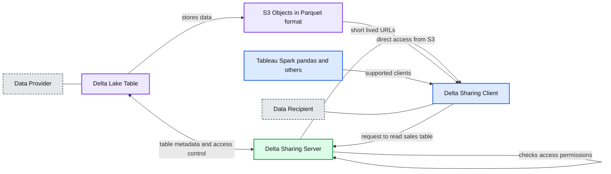
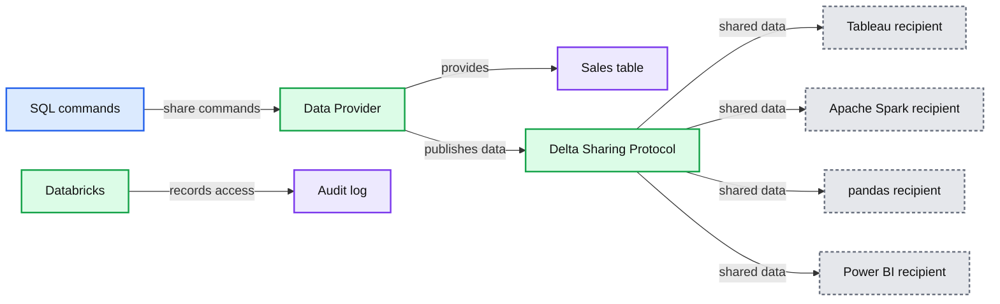

# Introducing Delta Sharing: An Open Protocol for Secure Data Sharing

- Source: https://www.databricks.com/blog/2021/05/26/introducing-delta-sharing-an-open-protocol-for-secure-data-sharing.html
- Published: 2021-05-26
- Authors: Matei Zaharia, Michael Armbrust, Steve Weis, Todd Greenstein, Cyrielle Simeone
- Categories: platform, announcements, product, data-warehousing
- Images: 3 total, 2 extracted as architecture

Delta Sharing has evolved into OpenSharing, the first open, vendor-neutral protocol for securely sharing AI assets, including Agent Skills, AI models, and unstructured data. Read the [announcement](https://www.databricks.com/company/newsroom/press-releases/databricks-announces-opensharing).

 

Update: [Delta Sharing](https://www.databricks.com/product/delta-sharing) is now generally available on AWS and Azure.

Get an early preview of [O'Reilly's new ebook](https://www.databricks.com/resources/ebook/delta-lake-running-oreilly?itm_data=deltasharingopenprotocol-blog-oreillyupandrunning) for the step-by-step guidance you need to start using Delta Lake.

 

Data sharing has become critical in the modern economy as enterprises look to securely exchange data with their customers, suppliers and partners. For example, a retailer may want to publish sales data to its suppliers in real time, or a supplier may want to share real-time inventory. But so far, data sharing has been severely limited because sharing solutions are tied to a single vendor. This creates friction for both data providers and consumers, who naturally run different platforms.

Today, we’re launching a new open source project that simplifies cross-organization sharing: [Delta Sharing](https://delta.io/sharing/), an *open* protocol for secure real-time exchange of large datasets, which enables secure data sharing *across products* for the first time. We’re developing Delta Sharing with partners at the top software and data providers in the world.

To see why today’s data sharing solutions create friction, consider a retailer that wants to share data with an analyst at one of its suppliers. Today, the retailer could use one of several cloud data warehouses that offer data sharing, but then the analyst would need to work with their IT, security, and procurement teams to deploy the same warehouse product at their company, a process that can take months. Furthermore, once the warehouse is deployed, the first thing the analyst would do is export the data from it into their favorite data science tool, such as pandas or Tableau.

With Delta Sharing, data users can *directly* connect to the shared data through pandas, Tableau, or dozens of other systems that implement the open protocol, without having to deploy a specific platform first. This reduces their access time from months to minutes, and greatly reduces work for data providers who want to reach as many users as possible.

We’re working with a vibrant ecosystem of partners on Delta Sharing, including product teams at the leading cloud, BI and data vendors:

 Delta Sharing Ecosystem

In this post, we’ll explain how Delta Sharing works and why we’re so excited about an open approach to data sharing.

## Delta Sharing goals

Delta Sharing is designed to be easy for both providers and consumers to use with their existing data and workflows. We designed it with four goals in mind:

- **Share live data directly without copying it:** We want to make it easy to share existing data in real time. Today, the majority of enterprise data is stored in cloud data lake and lakehouse systems. Delta Sharing works over these; in particular, it lets you securely share any existing dataset in the Delta Lake or Apache Parquet formats.
- **Support a wide range of clients:** Recipients should be able to directly consume data from their tools of choice without installing a new platform. The Delta Sharing protocol is designed to be easy for tools to support directly. It’s based on Parquet, which most tools already support, so implementing a connector for it is easy.
- **Strong security, auditing and governance:** The protocol is designed to help you meet privacy and compliance requirements. Delta Sharing lets you grant, track and audit access to shared data from a single point of enforcement.
- **Scale to massive datasets:** Data sharing increasingly needs to support terabyte-scale datasets, such as fine-grained industrial or financial data, a challenge for legacy solutions. Delta Sharing leverages the cost and elasticity of cloud storage systems to share massive datasets economically and reliably.

## How does Delta Sharing work?

Delta Sharing is a simple REST protocol that securely shares access to part of a cloud dataset. It leverages modern cloud storage systems, such as S3, ADLS or GCS, to reliably transfer large datasets. There are two parties involved: Data Providers and Recipients.

As the Data Provider, Delta Sharing lets you share existing tables or parts thereof (e.g., specific table versions of partitions) stored on your cloud data lake in [Delta Lake](https://delta.io) format. A Delta Lake table is essentially a collection of Parquet files, and it's easy to [wrap](https://docs.databricks.com/spark/latest/spark-sql/language-manual/delta-convert-to-delta.html) existing Parquet tables into Delta Lake if needed. The data provider decides what data they want to share and runs a sharing server in front of it that implements the Delta Sharing protocol and manages access for recipients. We’ve open sourced a [reference sharing server](https://github.com/delta-io/delta-sharing); and we provide a hosted one on Databricks, as we imagine other vendors will.

As a Data Recipient, all you need is one of the many Delta Sharing clients that supports the protocol. We’ve released open source connectors for pandas, Apache Spark, Rust and Python, and we’re working with partners on many more.

**Summary:** The diagram shows Delta Sharing securely providing a recipient with short-lived URLs for direct access to cloud-hosted Delta Lake data.

**Components:**

- Data Provider
- Delta Lake Table
- Delta Sharing Server
- S3 Objects in Parquet format
- Data Recipient
- Delta Sharing Client
- Tableau, Spark, pandas and other clients

**Flows:**

- Delta Lake Table -> S3 Objects: stores table data in Parquet format
- Delta Lake Table <-> Delta Sharing Server: provides table metadata and access control
- Delta Sharing Client -> Delta Sharing Server: requests permission to read the sales table
- Delta Sharing Server -> Delta Sharing Client: returns short-lived URLs for data objects
- S3 Objects -> Delta Sharing Client: direct access from S3
- Delta Sharing Server -> Delta Sharing Server: checks access permissions

**Numbers:** none

source image: https://www.databricks.com/wp-content/uploads/2021/05/blog-delta-sharing-under-the-hood.jpg

The actual exchange is carefully designed to be efficient by leveraging the functionality of cloud storage systems and Delta Lake. The [protocol](https://github.com/delta-io/delta-sharing/blob/main/PROTOCOL.md) works as follows:

1. The recipient’s client authenticates to the sharing server (via a bearer token or other method) and asks to query a specific table. The client can also provide filters on the data (e.g. “country=US”) as a hint to read just a subset of the data.
2. The server verifies whether the client is allowed to access the data, logs the request, and then determines which data to send back. This will be a subset of the data objects in S3 or other cloud storage systems that actually make up the table.
3. To transfer the data, the server generates short-lived pre-signed URLs that allow the client to read these Parquet files directly from the cloud provider, so that the transfer can happen in parallel at massive bandwidth, without streaming through the sharing server. This powerful feature available in all the major clouds makes it fast, cheap and reliable to share very large datasets.

## Benefits of the design

The Delta Sharing design provides many benefits for both providers and consumers:

- Data Providers can easily share an entire table, or just one version or partition of the table, because clients are only given access to a specific subset of the objects in it.
- Data Providers can update data reliably in real time using the [ACID transactions](https://www.databricks.com/blog/2020/11/23/acid-transactions-on-data-lakes.html) on Delta Lake, and recipients will always see a consistent view.
- Data Recipients don’t need to be on the same platform as the provider, or even in the cloud at all -- sharing works across clouds and even from cloud to on-premise users.
- The Delta Sharing protocol is very easy for clients to implement if they already understand Parquet. Most of our prototype implementations with open source engines and BI tools only took 1-2 weeks to build.
- Transfer is fast, cheap, reliable and parallelizable using the underlying cloud system.

## An open ecosystem

As previously mentioned, we are excited about establishing an open approach to data sharing. Data providers, like Nasdaq, have uniformly told us that it is too hard to deliver data to diverse consumers, all of which use different analytics tools.

> "We support Delta Sharing and its vision of an open protocol that will simplify secure data sharing and collaboration across organizations. Delta Sharing will enhance the way we work with our partners, reduce operational costs and enable more users to access a comprehensive range of Nasdaq’s data suite to discover insights and develop financial strategies,” said Bill Dague, Head of Alternative Data, Nasdaq.

With Delta Sharing, dozens of popular systems will be able to connect directly to shared data so that any user can use it, reducing friction for all participants. We are working with dozens of partners to define the Delta Sharing standard, and we invite you to participate.
Many of these companies extended their support for today’s launch:

**BI Tools:** [Tableau](https://www.tableau.com/about/blog/2021/5/meet-delta-sharing-secure-open-source-data-sharing), [Qlik](https://www.qlik.com/us/company/press-room/press-releases/qlik-expands-strategic-partnership-with-databricks-with-support-for-delta-sharing), Power BI, Looker
**Analytics:** [AtScale](https://www.atscale.com/blog/semantic-layer-shared-data-secure-open-source-delta-sharing/), [Dremio](https://www.dremio.com/blog/), [Starburst](https://blog.starburst.io/starburst-supports-launch-of-delta-sharing-the-first-open-protocol-for-secure-data-sharing), Microsoft Azure, Google BigQuery
**Governance:** [Collibra](https://www.collibra.com/us/en/blog/collibra-and-databricks-for-open-governed-data-sharing), [Immuta](https://www.immuta.com/articles/enabling-third-party-data-sharing-with-databricks-delta-sharing/), Alation, [Privacera](https://privacera.com/blog/privacera-and-starburst-support-launch-of-delta-sharing-with-open-source-powered-partnership/)
**Data Providers:** [FactSet](https://insight.factset.com/data-sharing-the-future-of-data-consumption), [Nasdaq](https://www.nasdaq.com/articles/delta-sharing-protocol%3A-the-evolution-of-financial-data-sharing-2021-05-26), [Precisely](https://www.precisely.com/blog/integration/precisely-databricks-partner-maximize-value-of-data), [Safegraph](https://www.safegraph.com/blog/safegraph-databricks-delta-sharing), Atlassian, AWS, Foursquare, ICE, Qandl, S&P, SequenceBio

## Delta Sharing on Databricks

Databricks customers will have a native integration of Delta Sharing in our [Unity Catalog](https://www.databricks.com/blog/2021/05/26/introducing-databricks-unity-catalog-fine-grained-governance-for-data-and-ai-on-the-lakehouse.html), providing a streamlined experience for sharing data both within and across organizations. Administrators will be able to manage shares using a new CREATE SHARE SQL syntax or REST APIs and audit all accesses centrally. Recipients will be able to consume the data from any platform. [Sign up](https://www.databricks.com/product/delta-sharing) to join our waitlist for preview access and updates.

**Summary:** The diagram shows a data provider sharing a sales table with multiple data recipients through the Delta Sharing Protocol, with centralized auditing.

**Components:**

- SQL commands for creating and granting access to the retail share
- Data Provider
- Databricks
- Sales table
- Audit log
- Delta Sharing Protocol
- Tableau recipient
- Apache Spark recipient
- pandas recipient
- Power BI recipient

**Flows:**

- SQL commands -> Data Provider: share creation, table addition, and SELECT grant
- Data Provider -> Sales table: provides shared data
- Databricks -> Audit log: records access activity
- Data Provider -> Delta Sharing Protocol: publishes shared data
- Delta Sharing Protocol -> Tableau recipient: shared data access
- Delta Sharing Protocol -> Apache Spark recipient: shared data access
- Delta Sharing Protocol -> pandas recipient: shared data access
- Delta Sharing Protocol -> Power BI recipient: shared data access

**Numbers:** none

source image: https://www.databricks.com/wp-content/uploads/2021/05/blog-delta-sharing-on-databricks.jpg

## Roadmap

This first version of Delta Sharing is just a start. As we develop the project, we plan to extend it to sharing other objects, such as streams, SQL views or arbitrary files like machine learning models. We believe that the future of data sharing is open, and we are thrilled to bring this approach to other sharing workflows.

## Getting started with Delta Sharing

To try the open source Delta Sharing release, follow the instructions at [delta.io/sharing](https://delta.io/sharing/). Or, if you are a Databricks customer, [sign up](https://www.databricks.com/product/unity-catalog) for updates on our service. We are very excited to hear your feedback!
