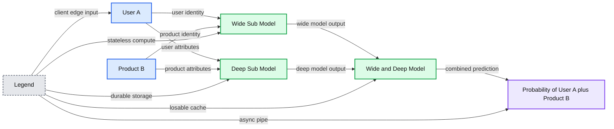

# How to Build a Scalable Wide and Deep Product Recommender

- Source: https://www.databricks.com/blog/2021/06/09/how-to-build-a-scalable-wide-and-deep-product-recommender.html
- Published: 2021-06-09
- Authors: Stephan Wernz, Liang Zhang, Bryan Smith
- Categories: platform, solutions, engineering, solution-accelerators, data-science-machine-learning, data-engineering
- Images: 2 total, 1 extracted as architecture

Download the [notebooks](https://notebooks.databricks.com/notebooks/RCG/Wide_and_Deep/index.html) referenced throughout this article.

I have a favorite coffee shop I've been visiting for years. When I walk in, the barista knows me by name and asks if I'd like my usual drink. Most of the time, the answer is "yes", but every now and then, I see they have some seasonal items and ask for a recommendation. Knowing I usually order a lightly sweetened latte with an extra shot of espresso, the barista might recommend the dark chocolate mocha -- not the fruity concoction piled high with whipped cream and sprinkles. The barista's knowledge of my explicit preferences and their ability to generalize based on my past choices provides me with a highly-personalized experience. And because I know the barista knows and understands me, I trust their recommendations.

Much like the barista at my favorite coffee shop, the wide-and-deep learning for recommender systems has the ability to both memorize and generalize product recommendations based on user behavior and customer interactions. First i[ntroduced by Google](https://arxiv.org/abs/1606.07792)for use in its Google Play app store, the wide-and-deep machine learning (ML) model has become popular in a variety of online scenarios for its ability to personalize user engagements, even in 'cold start problem' scenarios with sparse data inputs.

The goal with wide and deep recommenders is to provide the same level of customer intimacy that, for example, our favorite barista does. This model uses explicit and implicit feedback to expand the considerations set for customers. Wide and deep recommenders go beyond simple weighted averaging of customer feedback found in some collaborative filters to balance what is understood about the individual with what is known about similar customers. If done properly, the recommendations make the customer feel understood and this should translate into greater value for both the customer and the business.

## Understanding the model design

To understand the concept of deep & wide recommendations, it's best to think of it as two separate, but collaborating, engines. The wide model, often referred to in the literature as the *linear model*, memorizes users and their past product choices. Its inputs may consist simply of a user identifier and a product identifier, though other attributes relevant to the pattern (such as time of day) may also be incorporated.

*Figure 1. A conceptual interpretation of the wide and deep model*

**Summary:** The diagram shows user and product identities and attributes flowing into collaborating wide and deep submodels to predict the probability of User A selecting Product B.

**Components:**

- User A inputs: user identity and user attributes; technology not specified
- Product B inputs: product identity and product attributes; technology not specified
- Wide Sub-Model: memorization model; technology not specified
- Deep Sub-Model: generalization model; technology not specified
- Wide and Deep Model: combines both submodels; technology not specified
- Probability of User A plus Product B: prediction output

**Flows:**

- User identity -> Wide Sub-Model: user identity
- User attributes -> Deep Sub-Model: user attributes
- Product identity -> Wide Sub-Model: product identity
- Product attributes -> Deep Sub-Model: product attributes
- Wide Sub-Model -> Wide and Deep Model: wide model output
- Deep Sub-Model -> Wide and Deep Model: deep model output
- Wide and Deep Model -> Probability of User A plus Product B: combined prediction

**Numbers:** none

source image: https://www.databricks.com/wp-content/uploads/2021/06/deep-rec-blog-img-1.png

Figure 1. A conceptual interpretation of the wide and deep model

The deep portion of the model, so named as it is a deep neural network, examines the generalizable attributes of a user and their product choices. From these, the model learns the broader characteristics that tend to favor users' product selections.

Together, the wide and deep submodels are trained on historical product selections by individual users to predict future product selections. The end result is a single model capable of calculating the probability with which a user will purchase a given item, given both memorized past choices and generalizations about a user's preferences. These probabilities form the basis for user-specific product rankings, which can be used for making recommendations.

## Building the model

The intuitive logic of the wide-and-deep recommender belies the complexity of its actual construction. Inputs must be defined separately for each of the wide and deep portions of the model and each must be trained in a coordinated manner to arrive at a single output, but tuned using optimizers specific to the nature of each submodel. Thankfully, the [Tensorflow DNNLinearCombinedClassifier estimator](https://www.tensorflow.org/api_docs/python/tf/estimator/DNNLinearCombinedClassifier) provides a pre-packaged architecture, greatly simplifying the assembly of the overall model.

### Training

The challenge for most organizations is then training the recommender on the large number of user-product combinations found within their data. Using [Petastorm](https://petastorm.readthedocs.io/en/latest/), an open-source library for serving large datasets assembled in Apache Spark™ to Tensorflow (and other ML libraries), we can cache the data on high-speed, temporary storage and then read that data in manageable increments to the model during training. In doing so, we limit the memory overhead associated with the training exercise while preserving performance.

### Tuning

Tuning the model becomes the next challenge. Various model parameters control its ability to arrive at an optimal solution. The most efficient way to work through the potential parameter combinations is simply to iterate through some number of training cycles, comparing the models' evaluation metrics with each run to identify the ideal parameter combinations. By leveraging [hyperopt with SparkTrails](http://hyperopt.github.io/hyperopt/scaleout/spark/), we can parallelize this work across many compute nodes, allowing the optimizations to be performed in a timely manner.

### Deploying

Finally, we need to deploy the model for integration with various retail applications. Leveraging [MLflow](https://www.mlflow.org/) allows us to both persist our model and package it for deployment across a wide variety of microservices layers, including Azure Machine Learning, AWS Sagemaker, Kubernetes and Databricks Model Serving.

While this seems like a large number of technologies to bring together just to build a single model, Databricks integrates all of these technologies within a single platform, providing data scientists, data engineers & [MLOps](https://www.databricks.com/glossary/mlops) Engineers a unified experience. The pre-integration of these technologies means various personas can work faster and leverage additional capabilities, such as the [automated tracking](https://docs.databricks.com/applications/machine-learning/automl-hyperparam-tuning/index.html#automated-mlflow-tracking) of models, to enhance the transparency of the organization's model building efforts.

To see an end-to-end example of how a wide and deep recommender model may be built on Databricks, please check out the following notebooks:

[Get the notebook](https://notebooks.databricks.com/notebooks/RCG/Wide_and_Deep/index.html)
