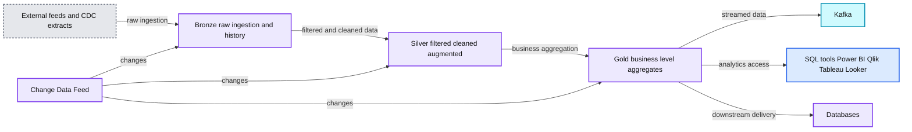
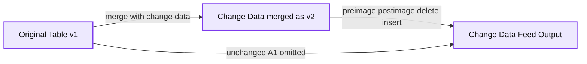
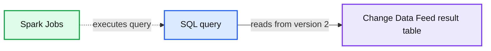
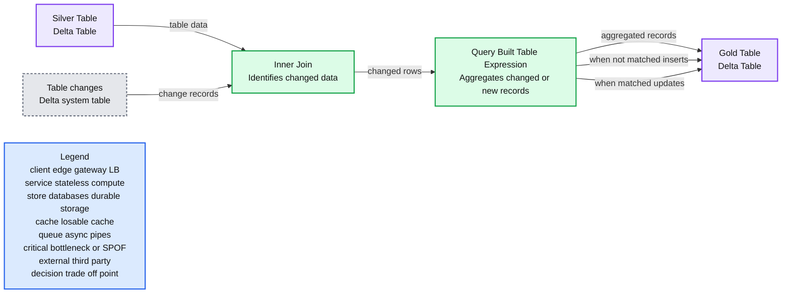
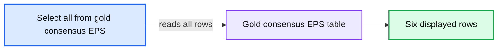
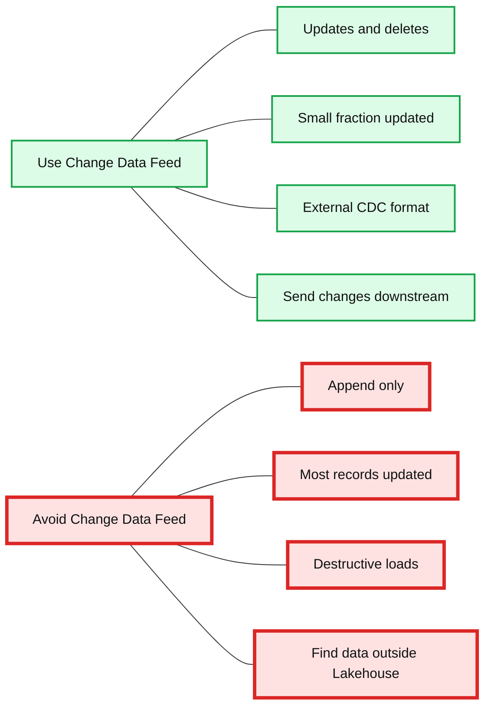

# How to Simplify CDC With Delta Lake's Change Data Feed

- Source: https://www.databricks.com/blog/2021/06/09/how-to-simplify-cdc-with-delta-lakes-change-data-feed.html
- Published: 2021-06-09
- Authors: Surya Sai Turaga, John O'Dwyer
- Categories: engineering, data-engineering, data-streaming
- Images: 9 total, 7 extracted as architecture

[Try this notebook in Databricks](https://www.databricks.com/notebooks/delta-lake-cdf.html)
  
[Change data capture (CDC)](https://en.wikipedia.org/wiki/Change_data_capture#:~:text=In%20databases%2C%20change%20data%20capture,taken%20using%20the%20changed%20data.) is a use case that we see many customers implement in Databricks – you can check out our previous deep dive on the topic [here](https://www.databricks.com/blog/2018/10/29/simplifying-change-data-capture-with-databricks-delta.html). Typically we see CDC used in an ingestion to analytics architecture called the *medallion architecture*. The medallion architecture that takes raw data landed from source systems and refines the data through bronze, silver and gold tables. CDC and the medallion architecture provide multiple benefits to users since only changed or added data needs to be processed. In addition, the different tables in the architecture allow different personas, such as Data Scientists and BI Analysts, to use the correct up-to-date data for their needs. We are happy to announce the exciting new [Change Data Feed (CDF)](https://docs.databricks.com/delta/delta-change-data-feed.html) feature in Delta Lake that makes this architecture simpler to implement and the MERGE operation and log versioning of Delta Lake possible!

**Summary:** The diagram shows external feeds entering a Bronze layer, progressing through Silver and Gold Delta Lake layers, with Change Data Feed supporting downstream updates.

**Components:**

- External feeds, other CDC output, and extracts
- Bronze layer for raw ingestion and history
- Silver layer for filtered, cleaned, and augmented data
- Gold layer for business-level aggregates
- Change Data Feed
- Kafka
- SQL tools including Power BI, Qlik, Tableau, and Looker
- Databases

**Flows:**

- External feeds -> Bronze: raw ingestion and history
- Bronze -> Silver: data processing
- Silver -> Gold: business-level aggregation
- Gold -> Kafka: streamed data
- Gold -> SQL tools: analytics access
- Gold -> Databases: downstream data delivery
- Change Data Feed -> Bronze: change data
- Change Data Feed -> Silver: change data
- Change Data Feed -> Gold: change data

**Numbers:** none

source image: https://www.databricks.com/wp-content/uploads/2021/06/How-to-Simplify-CDC-with-Delta-Lakes-Change-Data-Feed-blog-image6.jpg

 Get an early preview of [O'Reilly's new ebook](https://www.databricks.com/resources/ebook/delta-lake-running-oreilly?itm_data=simplifycdcdl-blog-oreillydlupandrunning) for the step-by-step guidance you need to start using Delta Lake.

## **Why is the CDF feature needed?**

Many customers use Databricks to perform CDC, as it is simpler to implement with Delta Lake compared to other Big Data technologies. However, even with the right tools, CDC can still be challenging to execute. We designed CDF to make coding even simpler and address the biggest pain points around CDC, including:

- **Quality Control** - Row level changes are hard to attain between versions.
- **Inefficiency** - It can be inefficient to account for non-changing rows since the current version changes are at the file and not the row level.

Here is how Change Data Feed (CDF) implementation helps resolve the above issues:

- **Simplicity and convenience **- Uses a common, easy-to-use pattern for identifying changes, making your code simple, convenient and easy to understand.
- **Efficiency** - The ability to only have the rows that have changed between versions, makes downstream consumption of Merge, Update and Delete operations extremely efficient.

CDF captures changes **only** from a Delta table and is **only** forward-looking once enabled.

## **Change Data Feed in Action!**

Let's dive into an example of CDF for a common use case: financial predictions. The notebook referenced at the top of this blog ingests financial data. Estimated Earnings Per Share (EPS) is financial data from analysts predicting a company's quarterly earnings per share. The raw data can come from many different sources and from multiple analysts for multiple stocks.

With the CDF feature, the data is simply inserted into the bronze table (raw ingestion), then filtered, cleaned and augmented in the silver table and, finally, aggregate values are computed in the gold table based on the changed data in the silver table.

While these transformations can get complex, thankfully, now the row-based  CDF feature is simple and efficient. But how do you use it? Let's dig in!

*NOTE: The example here focuses on the SQL version of CDF and also on a specific way to use the operations, to evaluate variations, please see the documentation *[*here*](https://docs.databricks.com/delta/delta-change-data-feed.html)

## **Enabling CDF on a Delta Lake Table**

To have the CDF feature available on a table, you must first enable the feature on said table. Below is an example of enabling CDF for the bronze table at table creation. You can also enable CDF on a table as an update to the table. In addition, you can enable CDF on a cluster for all tables created by the cluster. For these variations, please see the documentation [here](https://docs.databricks.com/delta/delta-change-data-feed.html).

Change Data Feed is a forward looking feature, it will capture changes once the table property is set up and not earlier

## **Querying the change data**

To query the change data, use the *table_changes* operation. The example below includes inserted rows and two rows that represent the pre- and post-image of an updated row, so that we can evaluate the differences in the changes if needed. There is also a *delete* Change Type that is returned for deleted rows.

**Summary:** The diagram shows how merging change data into an original Delta Lake table produces Change Data Feed rows for updated, deleted, and inserted records.

**Components:**

- Original Table v1 using Delta Lake
- Change Data merged as v2 using Delta Lake
- Change Data Feed Output using Delta Lake CDF
- Preimage row for the updated record
- Postimage row for the updated record
- Delete row
- Insert row

**Flows:**

- Original Table v1 + Change Data merged as v2 -> Change Data Feed Output: emits preimage, postimage, delete, and insert changes
- Original Table v1 -> Change Data Feed Output: unchanged A1 record is not emitted

**Numbers:** v1, v2, A1, A2, A3, A4, B1, B2, B3, B4, 12:00:00, version 2

source image: https://www.databricks.com/wp-content/uploads/2021/06/How-to-Simplify-CDC-with-Delta-Lakes-Change-Data-Feed-blog-img-3.jpg

This example accesses the changed records based on the *starting version,* but you can also cap the versions based on the *ending version*, as well as *starting* and *ending timestamps* if needed. This example focuses on SQL, but there are also ways to access this data in Python, Scala, Java and R. For these variations, please see the documentation [here](https://docs.databricks.com/delta/delta-change-data-feed.html).

**Summary:** The image shows a SQL query accessing Delta Lake Change Data Feed records from `silver_eps` starting at version 2.

**Components:**

- SQL query using Spark SQL
- Spark Jobs execution indicator
- Change Data Feed result table
- Columns: date, stock symbol, analyst, estimated EPS, change type, commit version, commit timestamp

**Flows:**

- SQL query -> Change Data Feed result table: reads changes from starting version 2

**Numbers:** 1, 2, 2.4, 2.3, 2.1, 1.3, 1.2, 3.5, 2.6, 8 rows, commit version 2, timestamps 2021-05-10T18:57:07.000+0000, dates 3/1/2021 and 4/1/2021

source image: https://www.databricks.com/wp-content/uploads/2021/06/How-to-Simplify-CDC-with-Delta-Lakes-Change-Data-Feed-blog-img-4.png

## **Using CDF row data in a MERGE statement**

Aggregate MERGE statements, like the merge into the gold table, can be complex by nature, but the CDF feature makes the coding of these statements simpler and more efficient.

**Summary:** The diagram shows how Delta Lake Change Data Feed identifies changed rows and uses them to incrementally update a gold Delta table through a MERGE operation.

**Components:**

- Silver Table - Delta Table
- Table changes - Delta system table
- Inner Join - identifies changed data
- Query Built Table Expression - aggregates changed or new records
- Gold Table - Delta Table
- MERGE outcomes - inserts when not matched and updates when matched

**Flows:**

- Silver Table -> Inner Join: silver table data
- Table changes -> Inner Join: change records
- Inner Join -> Query Built Table Expression: identified changed rows
- Query Built Table Expression -> Gold Table: aggregated records
- Query Built Table Expression -> Gold Table: inserts when not matched
- Query Built Table Expression -> Gold Table: updates when matched

**Numbers:** none

source image: https://www.databricks.com/wp-content/uploads/2021/06/How-to-Simplify-CDC-with-Delta-Lakes-Change-Data-Feed-blog-img-5.jpg

As seen in the above diagram, CDF makes it simple to derive which rows have changed, as it only performs the needed aggregation on the data that has changed or is new using *table_changes* operation. Below, you can see how to use the changed data to determine which dates and stock symbols have changed.

**Summary:** The image shows a SQL query selecting distinct dates and stock symbols from Delta Lake change data.

**Components:**

- SQL query using the `table_changes` operation
- Change data table named `silver_eps`
- Query result table with `date` and `stock_symbol` columns

**Flows:**

- `silver_eps change data -> SQL query: provides changed rows`
- `SQL query -> result table: selects distinct dates and stock symbols`

**Numbers:** 1, 2, 3, 4, 2, 4/1/2021, 3/1/2021, 4 rows

```mermaid
%% Shows distinct changed dates and stock symbols selected from Delta change data
flowchart LR
    A[Silver EPS change data] -->|changed rows| B[SQL distinct selection]
    B -->|selected dates and stocks| C[Result table]

    classDef client   fill:#dbeafe,stroke:#2563eb,stroke-width:2px,color:#111
    classDef service  fill:#dcfce7,stroke:#16a34a,stroke-width:2px,color:#111
    classDef store    fill:#ede9fe,stroke:#7c3aed,stroke-width:2px,color:#111
    classDef cache    fill:#fef3c7,stroke:#d97706,stroke-width:2px,color:#111
    classDef queue    fill:#cffafe,stroke:#0891b2,stroke-width:2px,color:#111
    classDef critical fill:#fee2e2,stroke:#dc2626,stroke-width:4px,color:#111
    classDef external fill:#e5e7eb,stroke:#6b7280,stroke-width:2px,color:#111,stroke-dasharray:4 3
    classDef decision fill:#fce7f3,stroke:#db2777,stroke-width:2px,color:#111

    class A store
    class B service
    class C store
```

source image: https://www.databricks.com/wp-content/uploads/2021/06/How-to-Simplify-CDC-with-Delta-Lakes-Change-Data-Feed-blog-img-6.png

As shown below, you can use the changed data from the silver table to aggregate only the data on the rows that need to be updated or inserted into the gold table. To do this, use **INNER JOIN** on the *table_changes('****table_name****','****version****')*

The end result is a clear and concise version of a gold table that can incrementally change over time!

**Summary:** The image shows a SQL query displaying six rows from the `gold_consensus_eps` table.

**Components:**

- SQL query using `SELECT * FROM gold_consensus_eps`
- Spark Jobs execution indicator
- `gold_consensus_eps` table with date, stock symbol, and consensus EPS columns

**Flows:**

- SQL query -> gold_consensus_eps: reads all table rows

**Numbers:** 1, 2, 3, 4, 5, 6, 3/1/2021, 4/1/2021, 2.3, 1.25, 3.05, 2.2, 6 rows

source image: https://www.databricks.com/wp-content/uploads/2021/06/How-to-Simplify-CDC-with-Delta-Lakes-Change-Data-Feed-blog-img-8.png

## **Typical use cases**

Here are some common use cases and benefits of the new CDF feature:

### Silver & gold tables

Improve Delta performance by processing only changes following initial MERGE comparison to accelerate and simplify ETL/ELT operations.

### Materialized views

Create up-to-date, aggregated views of information for use in BI and analytics without having to reprocess the full underlying tables, instead updating only where changes have come through.

### Transmit changes

Send Change Data Feed to downstream systems such as Kafka or RDBMS that can use it to incrementally process in later stages of data pipelines.

### Audit trail table

Capturing Change Data Feed outputs as a Delta table provides perpetual storage and efficient query capability to see all changes over time, including when deletes occur and what updates were made.

## **When to use Change Data Feed**

**Summary:** Best practices for when to use or avoid Delta Lake Change Data Feed.

**Components:**

- Use Change Data Feed: Delta changes include updates and deletes
- Use Change Data Feed: Small fraction of records updated in each batch
- Use Change Data Feed: Data received from external sources is in CDC format
- Use Change Data Feed: Send data changes to downstream applications
- Avoid Change Data Feed: Delta changes are append only
- Avoid Change Data Feed: Most records in the table updated in each batch
- Avoid Change Data Feed: Data received comprises destructive loads
- Avoid Change Data Feed: Find and ingest data outside of the Lakehouse

**Flows:**

- none

**Numbers:** none

source image: https://www.databricks.com/wp-content/uploads/2021/06/Small-fraction-of-records-updated-in-each-batch-blog-img-12.jpg

## **Conclusion**

At Databricks, we strive to make the impossible possible and the hard simple. CDC, Log versioning and MERGE implementation were virtually impossible at scale until Delta Lake was created. Now we are making it simpler and more efficient with the exciting Change Data Feed (CDF) feature!

[Try this notebook in Databricks](https://www.databricks.com/notebooks/delta-lake-cdf.html)
