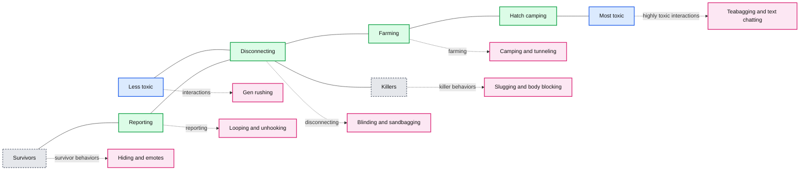

# Solution Accelerator: Toxicity Detection in Gaming

- Source: https://www.databricks.com/blog/2021/06/16/solution-accelerator-toxicity-detection-in-gaming.html
- Published: 2021-06-16
- Authors: Dan Morris, Duncan Davis
- Categories: engineering, solution-accelerators
- Images: 3 total, 2 extracted as architecture

Check out the [solution accelerator](https://www.databricks.com/solutions/accelerators/toxicity-detection-for-gaming) to download the notebooks referred throughout this blog. 

Across massively multiplayer online video games (MMOs), multiplayer online battle arena games (MOBAs) and other forms of online gaming, players continuously interact in real time to either coordinate or compete as they move toward a common goal -- winning.  This interactivity is integral to gameplay dynamics, but at the same time, it’s a prime opening for toxic behavior -- an issue pervasive throughout the online video gaming sphere.

Toxic behavior manifests in many forms, such as the varying degrees of griefing, cyberbullying and sexual harassment that are illustrated in the matrix below from [Behaviour Interactive](http://gamestudies.org/2004/articles/deslauriers_iseutlafrancestmartin_bonenfant), which lists the types of interactions seen within the multiplayer game, *Dead by Daylight*.

*Fig. 1: Matrix of toxic interactions that players experience*

**Summary:** Matrix positioning toxic gaming interactions from less toxic to most toxic, and from survivor-oriented to killer-oriented behavior.

**Components:**

- Less toxic: toxicity scale endpoint; no technology shown
- Survivors: player role axis; no technology shown
- Reporting: interaction category; no technology shown
- Disconnecting: interaction category; no technology shown
- Farming: interaction category; no technology shown
- Hatch camping: interaction category; no technology shown
- Most toxic: toxicity scale endpoint; no technology shown
- Killers: player role axis; no technology shown
- Toxic interaction labels: gen rushing, hiding, activating emotes, looping, rush unhooking, blinding, sandbagging, teabagging, text chatting, being away from keyboard, camping, lobby dodging, body blocking, dribbling, tunneling, slugging, face camping; no technology shown

**Flows:**

- Less toxic -> Most toxic: increasing toxicity
- Survivors -> Killers: interaction orientation

**Numbers:** none

source image: https://www.databricks.com/wp-content/uploads/2021/06/detecting-toxicity-in-gaming-blog-img-1.png

Fig. 1: Matrix of toxic interactions that players experience

In addition to the [personal toll](https://msutoday.msu.edu/news/2021/faculty-voice-gaming-and-toxicity) that toxic behavior can have on gamers and the community -- an issue that cannot be overstated -- it is also damaging to the bottom line of many game studios. For example, a study from [Michigan State University](https://msutoday.msu.edu/news/2021/faculty-voice-gaming-and-toxicity) revealed that 80% of players recently experienced toxicity, and of those, 20% reported leaving the game due to these interactions. Similarly, a study from [Tilburg University](https://arno.uvt.nl/show.cgi?fid=145375) showed that having a disruptive or toxic encounter in the first session of the game led to players being over three times more likely to leave the game without returning. Given that player retention is a top priority for many studios, particularly as game delivery transitions from physical media releases to long-lived services, it’s clear that toxicity must be curbed.

Compounding this issue related to churn, some companies face challenges related to toxicity early in development, even before launch. For example, [Amazon’s Crucible](https://www.wired.com/story/amazon-crucible-release-first-big-videogame/) was released into testing without text or voice chat due in part to not having a system in place to monitor or manage toxic gamers and interactions. This illustrates that the scale of the gaming space has far surpassed most teams’ ability to manage such behavior through reports or by intervening in disruptive interactions. Given this, it’s essential for studios to integrate analytics into games early in the development lifecycle and then design for the ongoing management of toxic interactions.

Toxicity in gaming is clearly a multifaceted issue that has become a part of video game culture and cannot be addressed universally in a single way.  That said, addressing toxicity within in-game chat can have a huge impact given the frequency of toxic behavior and the ability to automate detection of it using natural language processing (NLP).

## **Introducing the Toxicity Detection in Gaming Solution Accelerator from Databricks**

Using [toxic comment data](https://www.kaggle.com/c/jigsaw-toxic-comment-classification-challenge/data) from Jigsaw and [Dota 2 game match data](https://www.kaggle.com/devinanzelmo/dota-2-matches), this solution accelerator walks through the steps required to detect toxic comments in real time using NLP and your existing [lakehouse](https://www.databricks.com/blog/2020/01/30/what-is-a-data-lakehouse.html). For NLP, this solution accelerator uses [Spark NLP](https://nlp.johnsnowlabs.com/) from John Snow Labs, an open-source, enterprise-grade solution built natively on Apache Spark ™.

The steps you will take in this solution accelerator are:

- Load the Jigsaw and Dota 2 data into tables using Delta Lake
- Classify toxic comments using multi-label classification ([Spark NLP](https://nlp.johnsnowlabs.com/))
- Track experiments and register models using MLflow
- Apply inference on batch and streaming data
- Examine the impact of toxicity on game match data

## Detecting toxicity within in-game chat in production

With this solution accelerator, you can now more easily integrate toxicity detection into your own games. For example, the reference architecture below shows how to take chat and game data from a variety of sources, such as streams, files, voice or operational databases, and leverage Databricks to ingest, store and curate data into feature tables for machine learning (ML) pipelines, in-game ML, BI tables for analysis and even direct interaction with tools used for community moderation.

*Fig. 2: Toxicity detection reference architecture*

**Summary:** Reference architecture for ingesting gaming chat and game data, curating it with Databricks, training ML models, supporting operational tools, and enabling analysis.

**Components:**

- Chat streams, unstructured
- Server API
- Voice, unstructured
- Chat logs, unstructured
- Game data, structured
- Streaming: Azure Event Hubs, GCP Pub/Sub, Kafka, AWS Kinesis
- Raw format
- Apache Spark Structured Streaming
- Raw data, Bronze Table
- Clean data, Silver Table
- Refined data, Gold Table
- MLflow tracking and registry
- Training: lifecycle management, governance, batch and streaming model serving
- Operational and in-game ML: MLflow, Databricks, Docker, game servers, Kubernetes
- Community support tools: operational apps, Databricks SQL, Azure Cosmos DB, SQL
- Analysis: AWS Quicksight, Databricks SQL, Looker, Power BI, Tableau
- Cloud storage: Google Cloud Storage, Azure Data Lake, Amazon S3

**Flows:**

- Chat streams -> Streaming: streaming chat events
- Server API -> Streaming: server data
- Voice -> Streaming: voice data
- Chat logs -> Streaming: chat log data
- Game data -> Streaming: structured game data
- Streaming -> Raw format: incoming records
- Raw format -> Apache Spark Structured Streaming: raw event ingestion
- Apache Spark Structured Streaming -> Raw data, Bronze Table: raw data
- Raw data, Bronze Table -> Apache Spark Structured Streaming: read and write processing
- Apache Spark Structured Streaming -> Clean data, Silver Table: cleaned data
- Clean data, Silver Table -> MLflow tracking and registry: training data and model tracking
- MLflow tracking and registry -> Clean data, Silver Table: tracked training workflow
- Clean data, Silver Table -> Refined data, Gold Table: refined features
- Refined data, Gold Table -> MLflow tracking and registry: refined training data
- MLflow tracking and registry -> Operational and in-game ML: registered models
- Refined data, Gold Table -> Community support tools: curated data
- Refined data, Gold Table -> Analysis: BI data
- Cloud storage -> Raw data, Bronze Table: durable raw storage
- Cloud storage -> Clean data, Silver Table: durable clean storage
- Cloud storage -> Refined data, Gold Table: durable refined storage

**Numbers:** none

source image: https://www.databricks.com/wp-content/uploads/2021/06/detecting-toxicity-in-gaming-blog-img-3.jpg

```mermaid
%% Shows the toxicity detection data architecture from source ingestion through ML, support tools, and analysis
flowchart LR
    S[Chat and game sources]
    Q[Streaming sources]
    R[Raw format]
    I[Apache Spark structured streaming]
    B[Raw data bronze table]
    C[Clean data silver table]
    G[Refined data gold table]
    M[MLflow tracking and registry]
    O[Operational and in game ML]
    U[Community support tools]
    A[Analysis]
    D[Cloud storage]

    S -->|events and files| Q
    Q -->|streamed records| R
    R -->|raw events| I
    I -->|raw data| B
    B -->|processing| I
    I -->|cleaned data| C
    C -->|training data| M
    C -->|refinement| G
    G -->|registered models| M
    M -->|served models| O
    G -->|support data| U
    G -->|BI data| A
    D -->|durable storage| B
    D -->|durable storage| C
    D -->|durable storage| G

    classDef client fill:#dbeafe,stroke:#2563eb,stroke-width:2px,color:#111
    classDef service fill:#dcfce7,stroke:#16a34a,stroke-width:2px,color:#111
    classDef store fill:#ede9fe,stroke:#7c3aed,stroke-width:2px,color:#111
    classDef cache fill:#fef3c7,stroke:#d97706,stroke-width:2px,color:#111
    classDef queue fill:#cffafe,stroke:#0891b2,stroke-width:2px,color:#111
    classDef critical fill:#fee2e2,stroke:#dc2626,stroke-width:4px,color:#111
    classDef external fill:#e5e7eb,stroke:#6b7280,stroke-width:2px,color:#111,stroke-dasharray:4 3
    classDef decision fill:#fce7f3,stroke:#db2777,stroke-width:2px,color:#111

    class S client
    class Q queue
    class R,I,M,O,U,A service
    class B,C,G,D store
```

Fig. 2: Toxicity detection reference architecture

Having a real-time, scalable architecture to detect toxicity in the community allows for the opportunity to simplify workflows for community relationship managers and the ability to filter millions of interactions into manageable workloads. Similarly, the possibility of alerting on severely toxic events in real-time, or even automating a response such as muting players or alerting a CRM to the incident quickly, can have a direct impact on player retention. Likewise, having a platform capable of processing large datasets, from disparate sources, can be used to monitor brand perception through reports and dashboards.

## Getting started

The goal of this solution accelerator is to help support the ongoing management of toxic interactions in online gaming by enabling real-time detection of toxic comments within in-game chat. Get started today by importing this solution accelerator directly into your Databricks workspace.

Once imported you will have notebooks with two pipelines ready to move to production.

1. ML Pipeline using Multi-Label Classification with training on real-world English datasets from Google Jigsaw. The model will classify and label the forms of toxicity in text.
2. Real-time streaming inference pipeline leveraging the toxicity model. The pipeline source can be easily modified to ingest chat data from all the common data sources.

With both of these pipelines, you can begin understanding and analyzing toxicity with minimal effort. This solution accelerator also provides a foundation to build, customize and improve the model with relevant data to game mechanics and communities.

Check out the [solution accelerator](https://www.databricks.com/solutions/accelerators/toxicity-detection-for-gaming) to download the notebooks referred throughout this blog.
