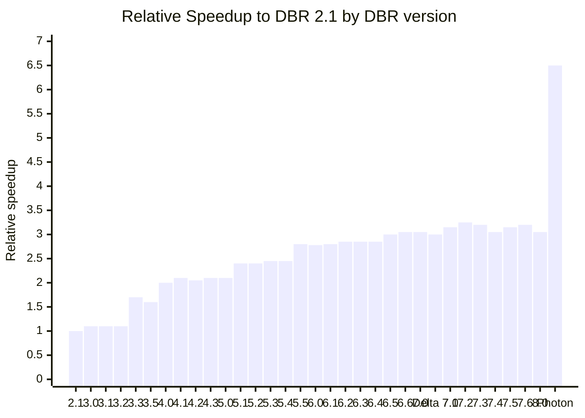
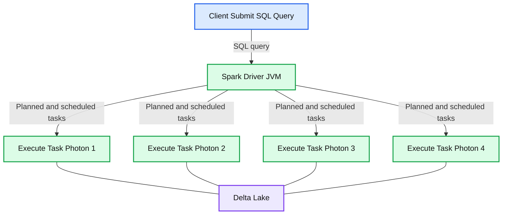
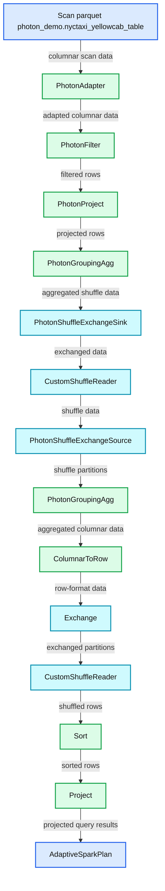
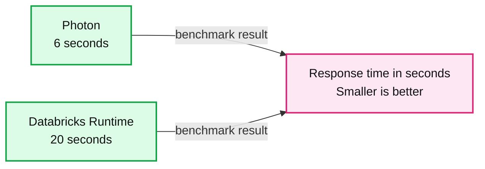

# Announcing Photon Public Preview: The Next Generation Query Engine on the Databricks Lakehouse Platform

- Source: https://www.databricks.com/blog/2021/06/17/announcing-photon-public-preview-the-next-generation-query-engine-on-the-databricks-lakehouse-platform.html
- Published: 2021-06-17
- Authors: Greg Rahn, Alexander Behm, Ala Luszczak, Cyrielle Simeone
- Categories: platform, announcements, data-warehousing
- Images: 5 total, 4 extracted as architecture

[Databricks Photon](https://www.databricks.com/product/photon) is now generally available on AWS and Azure.

Today, we're excited to announce the availability of [Photon](https://www.databricks.com/product/photon) in public preview. Photon is a native vectorized engine developed in C++ to dramatically improve query performance. All you have to do to benefit from Photon is turn it on. Photon will seamlessly coordinate work and resources and transparently accelerate portions of your SQL and Spark queries. No tuning or user intervention required.

---

[Explore why lakehouses are the data architecture of the future](https://www.databricks.com/resources/ebook/rise-data-lakehouse?itm_data=photonpublicpreviewengine-blog-riselakehousebook) with the father of the data warehouse, Bill Inmon.

---

While the new engine is designed to ultimately accelerate all workloads, during preview, Photon is focused on running SQL workloads faster, while reducing your total cost per workload. There are two ways you can benefit from Photon:

- As the default query engine on [Databricks SQL](https://www.databricks.com/product/databricks-sql) at no extra cost
- As part of a new high-performance [runtime](https://docs.databricks.com/runtime/index.html)on Databricks clusters, which [consumes DBUs at a different rate](https://www.databricks.com/product/aws-pricing/instance-types)than the same instance type running the non-Photon runtime.

In this blog, we'll discuss the motivation behind building Photon, explain how Photon works under the hood and how to monitor query execution in Photon from both Databricks SQL and traditional clusters on Databricks Data Science & Data Engineering as well.

## Faster with Photon

One might be wondering, why build a new query engine? They say a bar chart is worth a thousand words, so let's allow the data to tell the story.

*Image 1: Relative Speedup of Databricks Runtime compared to version 2.1 using TPC-DS 1TB*

**Summary:** Benchmark chart showing relative TPC-DS query speedups for Databricks Runtime releases compared with DBR 2.1, culminating in Photon.

**Components:**

- Databricks Runtime versions
- Photon query engine
- TPC-DS 1TB benchmark
- DBR 2.1 baseline

**Flows:**

- None visible

**Numbers:**

- Baseline: DBR 2.1
- Benchmark scale: 1TB
- Hardware: 10 x i3.xl
- Relative speedup range: 1.0x to approximately 6.5x
- Photon speedup: approximately 6.5x
- DBR versions shown: 2.1, 3.0, 3.1, 3.2, 3.3, 3.5, 4.0, 4.1, 4.2, 4.3, 5.0, 5.1, 5.2, 5.3, 5.4, 5.5, 6.0, 6.1, 6.2, 6.3, 6.4, 6.5, 6.6, 7.0, 7.0 Delta, 7.1, 7.2, 7.3, 7.4, 7.5, 7.6, 8.0
- Y-axis ticks: 0, 1, 2, 3, 4, 5, 6, 7

source image: https://www.databricks.com/wp-content/uploads/2021/06/photon-pr-blog-img-1.png

Image 1: Relative Speedup of Databricks Runtime compared to version 2.1 using TPC-DS 1TB

As you can see from this chart of Databricks Runtime performance using the Power Test from the TPC-DS benchmark (scale factor 1TB), performance steadily increased over the years. However, with the introduction of Photon, we see a huge leap forward in query performance -- Photon is up to 2x faster than Databricks Runtime 8.0. That’s why we're very excited about Photon's potential, and we're just getting started -- the Photon roadmap contains plans for greater coverage and more optimizations.

Early private preview customers have observed 2-4x average speedups using Photon on SQL workloads such as:

- **SQL-based jobs** - Accelerate large-scale production jobs on SQL and Spark DataFrames.
- **IoT use cases** - Faster time-series analysis using Photon compared to Spark and traditional Databricks Runtime.
- **Data privacy and compliance** - Query petabytes-scale datasets to identify and delete records without duplicating data with Delta Lake, production jobs and Photon.
- **Loading data into Delta and Parquet** - Photon's vectorized I/O speeds up data loads for Delta and Parquet tables, lowering overall runtime and costs of Data Engineering jobs.

## How Photon works

While Photon is written in C++, it integrates directly in and with Databricks Runtime and Spark. This means that no code changes are required to use Photon. Let me walk you through a quick "lifecycle of a query" to help you understand where Photon plugs in.

*Image 2: Lifecycle of a Photon query*

**Summary:** The diagram shows the lifecycle of a Photon query from SQL submission through Spark planning and scheduling to mixed Photon and JVM task execution over Delta Lake.

**Components:**

- Client: submits a SQL query.
- Spark Driver JVM: performs parsing, Catalyst analysis, planning, optimization, and scheduling.
- Execute Task: runs on Spark executors using Photon.
- Spark Executors: use mixed JVM and native execution.
- Delta Lake: underlying data storage.

**Flows:**

- Client -> Spark Driver JVM: SQL query submission.
- Spark Driver JVM -> Execute Tasks: planned and scheduled execution tasks.

**Numbers:** 1, 0, 1, 0, 0, 1, 0, 1, 1, 0, 1, 0

source image: https://www.databricks.com/wp-content/uploads/2021/06/photon-pr-blog-img-2.png

Image 2: Lifecycle of a Photon query

When a client submits a given query or command to the Spark driver, it is parsed, and the [Catalyst optimizer](https://www.databricks.com/glossary/catalyst-optimizer) does the analysis, planning and optimization just as it would if there were no Photon involved. The one difference is that with Photon the runtime engine makes a pass over the physical plan and determines which parts can run in Photon. Minor modifications may be made to the plan for Photon, for example, changing a sort merge join to hash join, but the overall structure of the plan, including join order, will remain the same. Since Photon does not yet support all features that Spark does, a single query can run partially in Photon and partially in Spark. This hybrid execution model is completely transparent to the user.

The query plan is then broken up into atomic units of distributed execution called tasks that are run in threads on worker nodes, which operate on a specific partition of the data. It’s at this level that the Photon engine does its work. You can think of it as replacing Spark’s whole stage codegen with a native engine implementation. The Photon library is loaded into the JVM, and Spark and Photon communicate via [JNI](https://en.wikipedia.org/wiki/Java_Native_Interface), passing data pointers to off-heap memory. Photon also integrates with Spark’s memory manager for coordinated spilling in mixed plans. Both Spark and Photon are configured to use off-heap memory and coordinate under memory pressure.

With the public preview release, Photon supports many - but not all - data types, operators and expressions. Refer to the [Photon overview](https://docs.databricks.com/runtime/photon.html) in the documentation for details.

## Photon execution analysis

Given that not all workloads and operators are supported today, you might be wondering how to choose workloads that can benefit from Photon and how to detect the presence of Photon in the execution plan. In short, Photon execution is bottom up -- it begins at the table scan operator and continues up the DAG (directed acyclic graph) until it hits an operation that is unsupported. At that point, the execution leaves Photon, and the rest of the operations will run without Photon.

1. If you are using Photon on Databricks SQL, it’s easy to see how much of a query ran using Photon:

 

2. Click the **Query History** icon on the sidebar.
3. Click the line containing the query you'd like to analyze.
4. On the Query Details pop-up, click **Execution Details**.
5. Look at the **Task Time in Photon** metric at the bottom.

In general, the larger the percentage of Task Time in Photon, the larger the performance benefit from Photon.

Image 3: Databricks SQL Query History Execution Details

If you are using Photon on Databricks clusters, you can view Photon action in the Spark UI. The following screenshot shows the query details DAG. There are two indications of Photon in the DAG. First, Photon operators start with Photon, such as PhotonGroupingAgg. Secondly, in the DAG Photon operators and stages are colored peach, whereas the non-Photon ones are blue.

*Image 4: Spark UI Query Details DAG*

**Summary:** The Spark UI query DAG shows Photon and non-Photon operators, with Photon stages colored peach and standard Spark stages colored blue.

**Components:**

- AdaptiveSparkPlan, Spark query planner
- Project, Spark projection operator
- Sort, Spark sorting operator
- CustomShuffleReader, Spark shuffle reader
- Exchange, Spark data exchange
- ColumnarToRow, Spark format conversion
- PhotonGroupingAgg, Photon aggregation operator
- PhotonShuffleExchangeSource, Photon shuffle source
- PhotonShuffleExchangeSink, Photon shuffle sink
- PhotonProject, Photon projection operator
- PhotonFilter, Photon filtering operator
- PhotonAdapter, Photon integration adapter
- Scan parquet photon_demo.nyctaxi_yellowcab_table, Photon parquet scan

**Flows:**

- Scan parquet photon_demo.nyctaxi_yellowcab_table -> PhotonAdapter: columnar scan data
- PhotonAdapter -> PhotonFilter: adapted columnar data
- PhotonFilter -> PhotonProject: filtered rows
- PhotonProject -> PhotonGroupingAgg: projected rows
- PhotonGroupingAgg -> PhotonShuffleExchangeSink: aggregated shuffle data
- PhotonShuffleExchangeSink -> CustomShuffleReader: exchanged data
- CustomShuffleReader -> PhotonShuffleExchangeSource: shuffle data
- PhotonShuffleExchangeSource -> PhotonGroupingAgg: shuffle partitions
- PhotonGroupingAgg -> ColumnarToRow: aggregated columnar data
- ColumnarToRow -> Exchange: row-format data
- Exchange -> CustomShuffleReader: exchanged partitions
- CustomShuffleReader -> Sort: shuffled rows
- Sort -> Project: sorted rows
- Project -> AdaptiveSparkPlan: projected query results

**Numbers:** none

source image: https://www.databricks.com/wp-content/uploads/2021/06/photon-pr-blog-img-4-rev.png

Image 4: Spark UI Query Details DAG

## Getting started with a working example on NYC taxi data

As discussed above, there are two ways you can use Photon:

1. Photon is on by default for all Databricks SQL endpoints. Just [provision a SQL endpoint](https://docs.databricks.com/sql/admin/sql-endpoints.html), and run your queries and use the method presented above to determine how much Photon impacts performance.
2. To run Photon on Databricks clusters (AWS only during public preview), [select a Photon runtime when provisioning a new cluster](https://docs.databricks.com/clusters/configure.html#databricks-runtime). The new Photon instance type consumes DBUs at a different rate than the same [instance type](https://www.databricks.com/product/aws-pricing/instance-types) running the non-Photon runtime. For more details on the specifics of Photon instances and DBU consumption, refer to the [Databricks pricing page for AWS](https://www.databricks.com/product/aws-pricing/instance-types).

Once you’ve created a Photon-enabled SQL endpoint or cluster, you can try running a few queries against the [NYC Taxi dataset](https://www1.nyc.gov/site/tlc/about/tlc-trip-record-data.page) from Databricks SQL editor or a notebook. We have pre-loaded an excerpt and made it accessible as part of our [Databricks datasets](https://docs.databricks.com/data/databricks-datasets.html).

First, create a new table pointing to the existing data with the following SQL snippet:

Try this query and enjoy the speed of Photon!

We measured the response time of the above query with Photon and a conventional Databricks Runtime on a warmed-up AWS cluster with 2 i3.2xlarge executors and a i3.2xlarge driver. Here are the results.

*Image 5: Photon vs. Databricks Runtime on NYC taxi example query*

**Summary:** Benchmark chart comparing Photon and Databricks Runtime response times for an NYC taxi example query, where smaller is better.

**Components:**

- Photon - query engine
- Databricks Runtime - runtime environment
- Response time - seconds

**Flows:**

- none

**Numbers:** 0, 5, 6, 10, 15, 20; seconds

source image: https://www.databricks.com/wp-content/uploads/2021/06/photon-pr-blog-img-5.png

Image 5: Photon vs. Databricks Runtime on NYC taxi example query

If you'd like to learn more about Photon, you can also watch our Data and AI Summit session: [Radical speed for SQL Queries Photon Under the Hood](https://www.databricks.com/session_na21/radical-speed-for-sql-queries-on-databricks-photon-under-the-hood). Thank you for reading, we look forward to your feedback on this!
